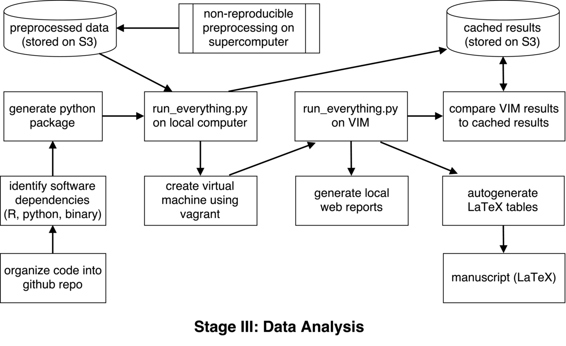

# 为大规模表型研究开发可重复的工作流程

# 为大规模表型研究开发可重复的工作流程

## Russell Poldrack

我是 Russell Poldrack，是斯坦福大学心理学系的教授。我的工作利用神经影像学、基因组学和行为研究来研究涉及决策和执行控制的大脑系统。由于工作流程的数据量大且复杂，我们许多工作流程都使用高性能计算。这个特定案例研究集中在一项被称为["MyConnectome 研究"](http://www.myconnectome.org)的分析上，该研究涉及在 18 个月内对单个个体进行密集数据收集，包括神经影像学、基因组、代谢组和行为数据。这个大型异质数据集为可重复数据分析带来了许多新挑战。

### 工作流程

 这个工作流程旨在概述对包括神经影像学、行为、转录组和代谢组数据在内的复杂数据集的分析（[`www.myconnectome.org`](http://www.myconnectome.org)）。这些数据是在 18 个月内从单个个体收集的，并将在手稿发表后通过[OpenFMRI 项目](http://openfmri.org/ds000031)完全在线提供。这些数据采用公共领域捐赠方式发布，意味着任何人都可以自由使用这些数据，无需对数据进行重新分发或要求归属。我选择这种方式是因为我认为这将为数据提供最大程度的实用性。

数据处理流程最初是在一台笔记本电脑上以不可重复的方式构建的。完成后，我开始有兴趣生成一个可重复的工作流程版本，以便其他研究人员可以精确重现分析。在这项研究中可重复分析的挑战在于原始数据非常庞大（包括原始基因组和神经影像数据在内达数 TB）。这些数据将提供给任何希望使用它们的人，但很难为这些操作提供可重复的工作流程，因为它们需要大规模超级计算资源。对于需要超级计算的过程（例如 RNA 测序数据的基因组比对和 MRI 数据的基于表面的分割），我们已经分享了用于完成这些工作流程的大部分代码。完全可重复性的另一个复杂性在于一些预处理操作是由另一个实验室执行的，他们目前不愿公开分享他们使用的代码。因此，我们决定专注于构建一个开放的可重复工作流程，尽可能涵盖大部分处理流程，使用从在线存档中下载的预处理数据。

这个过程的目标是创建一个完全自动化的分析流程，无需手动干预。该工作流程使用了多种工具，包括 Python、R、MATLAB 和 Connectome Workbench（用于神经影像数据分析的特定于领域的软件工具）。我开始生成执行每个操作的脚本，但最终决定生成一个单一的 Python 包来协调整个工作流程（可在 [`github.com/poldrack/myconnectome`](https://github.com/poldrack/myconnectome) 获取）。该软件包的第一个操作是使用 Python 中的 boto 包从 Amazon S3 下载预处理数据。然后我们对每种不同的数据类型进行额外处理。

对于神经影像数据，我们开发了一组 Python 函数来提取和总结不同脑区之间的连接度量。这些分析包括使用标准相关度量以及正则化偏相关度量（使用 R QUIC 包）评估区域之间的连接性。网络分析使用 Brain Connectivity Toolbox 执行，并使用 Cytoscape 软件包进行可视化。

对于转录组和代谢组数据，使用一组 Rmarkdown 脚本在 R 中执行分析。这些分析包括使用加权基因共表达网络分析（WGCNA）包识别共表达网络；然后使用这些网络中识别出的特征基因进行后续分析。基因网络使用 [DAVID](https://david.ncifcrf.gov) 进行注释。代谢组测量使用亲和传播进行聚类，并使用 [IMPALA](http://impala.molgen.mpg.de) 进行注释。

前述分析的每个结果都被保存并用于计算所有领域的每个测量之间的时间序列相关性（总共超过 20,000 个统计测试），使用 R 预测包。然后，这些结果在使用 Rmarkdown 生成的 Web 报告中进行总结。目前唯一的测试是将整个工作流程的结果与存储在 S3 上的一组结果进行比较。对代码的文档记录很少。

在单个系统上实施工作流程后，我随后在虚拟机上实施它，以便任何地方的任何人都可以运行它。我使用 Vagrant 软件包来配置具有所有必要要求的虚拟机。一旦安装完成，用户就可以通过单个命令运行整个工作流程。除了运行整个数据分析工作流程外，虚拟机还包括一个 Web 服务器，提供对所有分析结果的访问，以及用于详细结果的数据浏览器。该系统与 [`results.myconnectome.org`](http://results.myconnectome.org) 上公开展示的系统相同。有关安装和运行软件的文档正在不断发展。

### 痛点

在开发可重现分析工作流程时遇到了许多痛点。首先，有许多处理流程操作无法以这种方式实现。特别是，一些预处理操作需要高性能计算资源，由于作业提交系统的特定性，无法泛化。其次，需要大量额外工作来将代码泛化以在任意系统上运行，主要涉及识别和解决软件依赖关系。第三个痛点涉及确定适合共享可重现工作流程的技术。我们使用了使用 Vagrant 配置的虚拟机，但还有许多其他方法可以使用。最后，我们在确定项目的目标用户时遇到困难。我们最终决定使其对非高级用户易于使用，这需要大量额外工作。

### 主要好处

可重现的工作流程提供了许多重要的好处。首先，它提供了一定程度的细节，这些细节在出版物中是不可行的。其次，它增加了领域内其他人对出版物中呈现的结果的信任度。第三，它为我们子领域的其他人提供了如何实施可重现共享工作流程的示例。

### 关键工具

我使用了[Vagrant](https://www.vagrantup.com/)，使任何用户都可以轻松配置一个虚拟机，其中包含运行工作流所需的所有依赖项（请参阅[`github.com/poldrack/myconnectome-vm`](https://github.com/poldrack/myconnectome-vm)）。

### 问题

#### 对于你来说，“可重现性”是什么意思？

在我的案例研究中，“可重现性”意味着能够准确重现用于获取报告中结果的分析工作流程。更一般地，我认为这个术语还包括结果在不同工作流程或数据集中的一致性。

#### 您认为在您领域中可重现性为何重要？

用于神经影像数据的工作流程非常复杂，具有很高的分析灵活性，这引发了有关结果可重现性的担忧。我们迫切需要更高程度的透明度，以使我们领域的研究更具可重现性。

#### 你是如何或从哪里了解到可重现性的？

我认为我主要是通过负面例子学到的；也就是说，通过看到其他研究人员的研究结果依赖于不公开的代码和未共享的数据。

#### 您认为在您领域进行可重现研究的主要挑战是什么，您有什么建议吗？

这里经常提出有关人类主体问题和关于挖掘的担忧，但我认为这些都是误导。主要的陷阱是，可重现的研究实践使得更难获得引人注目的发现，从而获得高调的出版物。

#### 你认为进行可重复研究的主要动机是什么？

增加对自己研究的信任。

#### 你会推荐给你领域的研究人员一些最佳实践吗？

使用版本控制软件，并开放共享数据。
