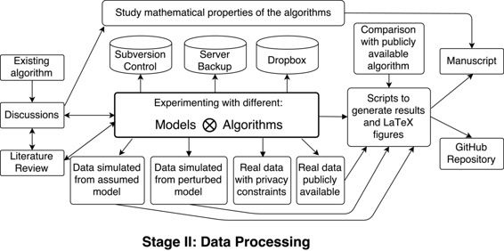

# 开发和测试用于跟踪视频中对象的随机滤波方法

# 开发和测试用于跟踪视频中对象的随机滤波方法

## 瓦伦蒂娜·斯塔涅娃

我的名字是瓦伦蒂娜·斯塔涅娃，我在华盛顿大学 eScience 研究所担任数据科学家。我是一名应用数学家，致力于开发从各种数据集中提取信息的方法。我的大部分经验都在图像处理及其生物医学应用领域。本案例研究描述了一个特定项目的工作流程，其目标是开发和测试新的跟踪视频中对象的算法，旨在保留对象的原始结构。这项研究是我在约翰斯·霍普金斯大学成像科学中心担任研究生时进行的，并受到了在心脏图像中跟踪心脏运动的任务的启发。我相信这反映了一个应用数学家在生物医学成像问题上工作的典型经验。

### 工作流程

 这项工作遵循了我所在领域问题的典型流程：受现有算法的启发，我们旨在将其扩展到处理图像序列（而不是单个图像）。通常，该过程涉及尝试不同数据模型和不同推断算法（与我的导师讨论和文献综述交织在一起）。这些模型和算法的各种组合可以在三种主要类型的数据集上进行测试：

+   从假设模型模拟出的数据集：由于数据集来自“正确模型”，因此此实验主要测试了推断算法的性能

+   从假设模型偏离的模型模拟的数据集（以某种可解释的方式）：此实验正在测试算法的稳健性

+   一个“真实”的数据集：一个移动对象的视频；这测试了该方法在实践中的适用性

这导致了探索相当多不同的设置，大部分研究时间都花在这个阶段上（实现和测试特定公式可能需要几周到几个月的时间）。这项工作是在大学服务器上的一个帐户上完成的，该服务器是顺序备份的。我还使用 Subversion 进行版本控制，并将我的文件存储在 Dropbox 文件夹中（它有自己的版本控制）。幸运的是，即使我们的服务器被黑客攻击，我也从未丢失过文件。

通常在真实数据上评估这些算法是困难的。没有标准的测试数据集，设计这样的数据集也很困难，因为不同的图像序列描述了不同的过程，并且一些算法在某些情况下表现良好，而在其他情况下表现不佳。人们通常考虑一系列典型的跟踪障碍，并检查某个算法是否能够克服它们。由于没有一个最终的度量标准来提交，这需要存储所有实验的结果。最终，我将所有的代码（用 MATLAB 编写）、数据和实验都保存在一个文件夹中，这个文件夹可以通过几个简单的命令重新生成我们手稿中的结果。当审稿人要求在我们的文章中包含额外的图时，我可以很容易地从原始数据中获得它。我们还选择了一个不会阻止我们在其他地方发布文章预印本的期刊，并将所有的补充材料存储在 GitHub 上。

工作流还包括一个平行路径，其中一个研究模型和算法的数学属性。例如，我们的目标是开发保持跟踪对象拓扑结构的算法，我们证明了我们的框架确保了这一点，从而消除了在多个情况下测试这个属性的必要性。有时甚至可以在不实现算法的情况下保证算法的性能，这使得数学研究的可重复性变得非常容易！

### 痛点

1) 私人数据：这个项目的一些动机是出于对处理特定心脏数据集并对获得的结果进行统计分析的需要。我最初在这个数据集上测试了算法，但由于一些隐私问题，最终我被禁止在我的出版物中使用它。我不得不寻找一个公共心脏数据集，但结果证明极其困难：一个旨在维护心脏图像公共数据库的网站因为创建者离开该领域而永久关闭。公共生物医学数据集的一个好的来源是[MICCAI](http://www.miccai.org/)会议的挑战：它们包含用于评估解决非常特定问题的方法的数据集。缺点是有时数据集不完整，因为它们被设计来解决特定的挑战：例如，我从图像分割挑战中获得的数据集不包含与跟踪问题相关的真实情况。

2) 容量（存储）：处理视频序列时，问题仅仅来自生成输出的大小。如果我生成了许多实验（在执行 MCMC 模拟时是不可避免的），我就必须存储许多视频。如果没有一个基本真理，我就不能仅仅存储一个小的不匹配度量而不是整个序列。GitHub 的政策不接受大于 100MB 的文件。这导致即使只尝试将输入数据上传到存储库中也很困难。这使得保持代码和数据在一起并且易于访问变得困难。

3) 随机性：使用蒙特卡罗模拟导致每次应用算法时输出不同。这需要额外的步骤来强制随机数生成器产生相同顺序的随机数序列。当涉及并行化时，这个过程并不简单：MATLAB（以及类似的脚本语言）通常无法控制单独线程启动的顺序，这会导致输出的额外随机性。此外，尝试同时生成多个随机流会导致产生相同的伪随机数序列（种子基于当前 CPU 时间），这会破坏蒙特卡罗算法。一种解决方案是提前生成所有并行线程中需要的随机序列，但这需要修改程序本身。使用随机输出也使得生成单元测试变得困难：我们只能获得输出应该是什么的渐近结果，因此即使使用模拟数据，设置输出的置信区间也很困难。

4) 备份：我使用 Subversion 对这个项目进行版本控制。我想使用 Subversion 提供的与 Nautilus 文件管理器的集成。结果发现这个功能有问题（那时是一个新功能），并不是所有的提交都通过图形界面记录下来：相当危险！我学到的是使用显式终端命令与版本控制系统更可靠。

### 关键利益

这种工作流程的主要优势之一是所有代码都是用一种语言编写的，而不需要借助外部库和工具包。通常，核心语言功能的变化要比附加包更少，这使得软件在长期和跨平台上更加可持续。

我们将某些数学属性编码到开发的算法中的方法也使得研究更加牢固地在原始设置偏差下重现。

### 问题

#### "重现性"对你意味着什么？

对我来说，“重现性”有两个意义：

(1) "确切可重现" - 当可以根据相同的输入和参数集合精确地再现结果时。例如：当可以提供一些脚本和环境，通过按一下按钮（或明确的一组说明）就可以在手稿中生成所有图表和计算时，手稿就是"确切可重现"的。

(2) "近似可重现" - 当可以通过类似或不同的方法在相同或可能略有不同的数据上生成类似的结果或类似的性能时。在科学中，通常的目标是测试一个假设，而实现这一目标的方法并不重要，如果通过不同的方法支持相同的假设，实际上会更好。此外，进行研究的数据可能永远不会再次观察到，因此重现这些数据的结果并不那么重要，但在类似的数据上产生类似的结果却很重要。我们对方法和结论的稳健性感兴趣，一个更好的术语可能是"稳健可重现"。

这个案例研究直接涉及到重现性的第一种类型，但也探讨了第二种解释的一点内容。

#### 你认为在你的领域中重现性的重要性是出于什么原因？

我认为在我的领域中重现性的重要性有两个主要原因：

+   个人方面：处理图像数据通常相当复杂，人们不想做重复的工作，但有时是必要的，在这种情况下最好有一个自动化的过程来重复实验。

+   公共方面：算法和研究过多，但在实践中很难使用，因为没有简单的方法来重现结果（通常需要重新实现算法或重新进行研究）。因此，如果一个人希望他们的研究在自己的团队之外有用，他们应该首先确保其可重现性。

#### 你是如何或从哪里了解到重现性的？

我一直在自学。我相信一些简短的重现性研讨会会极大地提高我的学习体验（例如，学习有关 git/GitHub、虚拟环境和轻量级虚拟容器）。

#### 你认为在你的领域进行可重现研究的主要挑战是什么，你有什么建议吗？

在处理生物医学数据时，人们经常面临隐私和存储挑战。我没有遇到的另一个问题是，领域中经常出现的使用过多外部软件包来预处理数据：其中一些仅受特定操作系统支持，或需要手动操作。这使得自动化工作流变得具有挑战性。为了提高大型数据集的性能，研究人员经常使用难以解释和扩展的复杂 C++程序。

#### 你认为进行可重现研究的主要动机是什么？

我认为激励应该是个人的，基于这样的认识：这将改善工作流程，而这就是研究应该做的方式。不幸的是，花在创建可复现研究上的时间和精力并没有得到很好的奖励。

#### 你会推荐一些在你领域的研究人员的最佳实践吗？

每天都要做到可复现！进行可复现研究要比在研究完成后再使其可复现要容易得多。

#### 你会推荐一些特定的资源来更多地了解可复现性吗？

一些有用的资源已被 eScience 可复现性工作组整理汇编：[`uwescience.github.io/reproducible/`](http://uwescience.github.io/reproducible/)

其他资源：[`github.com/Reproducible-Science-Curriculum`](https://github.com/Reproducible-Science-Curriculum)

Coursera 课程：[`www.coursera.org/course/repdata`](https://www.coursera.org/course/repdata)
