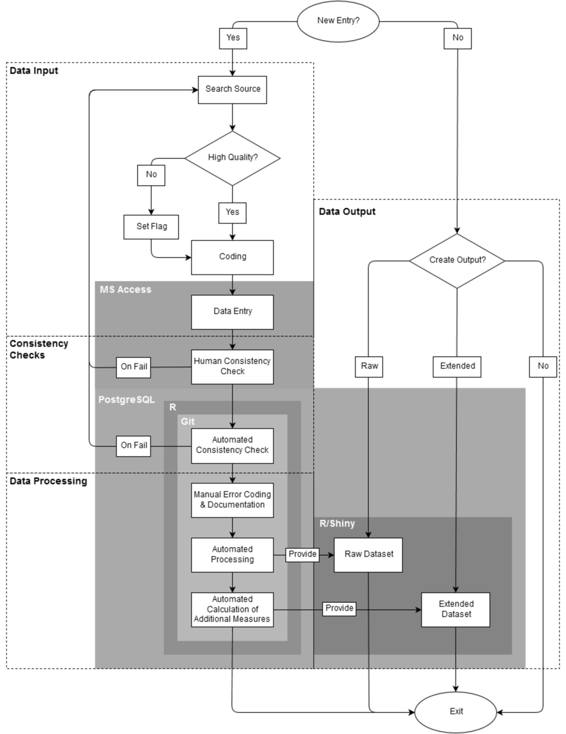

# 维护关于政党、选举和政府的可重复数据库

# 维护关于政党、选举和政府的可重复数据库

## Werner Krause 和 Dag Tanneberg

> 本章仅出现在书籍*可重复研究实践*的在线附录中。请引用该书的在线版本：Kitzes, J., Turek, D., & Deniz, F.（编）（2018）。可重复研究实践：数据密集科学的案例研究和经验教训[在线版本]。取自[`www.practicereproducibleresearch.org`](http://www.practicereproducibleresearch.org)。

我们的名字是 Werner Krause 和 Dag Tanneberg。我们在政治科学专业毕业，专注于比较政治。目前，我们正在德国柏林社会科学中心 WZB 的研究部门“民主与民主化”攻读博士学位。

我们部门的许多研究围绕政治竞争、选举和民主政府的动态展开。在 1990 年代中期，我们部门的高级研究员决定建立一个永久基础设施，以标准化且易于访问的格式向所有部门成员提供有关选举和政府的数据。最初，这些数据被用来观察和分析当时仍年轻的东欧和中欧民主国家的巩固过程。该项目已经发展成一个包括 1945 年至今全球 80 多个国家的数据库。

该数据库跟踪政治竞争的许多方面。例如，我们编码下议院和总统选举结果，政府任期，内阁规模和组成，以及政党之间选举联盟的起伏。部门成员可以输出我们的主要来源的原始数据和数字化副本。或者，可以从数据库中获取投票率、有效政党数量、不成比例度量或政府稳定性等摘要统计数据。不幸的是，该数据库目前尚不对外开放。然而，计划在 2017 年底之前公开。

2011 年和 2008 年，我们被聘为研究助理，继续这个历史悠久的项目。我们在数据库中引入了几项实质性和技术创新，使编码和数据管理流程更加简化，减少错误。我们的目标是确保从编码单个选举中的各个政党到生成涵盖 1945 年至今的每次选举的摘要统计数据的透明度和可重复性。

广义上讲，我们将可再现性定义为在科学研究中提供足够细节，使使用相同数据和方法的其他人能够复制已发表的结果的责任。这些可能是单一统计数据、图形、表格，甚至整篇文章。不能重现的结果既不开放供批评，也不可修订 - 它们是非科学的。

在我们数据库的背景下，可再现性要求变得更加严格。由于我们数据库中存储的数据质量影响着内外部部门的众多正在进行的项目，因此每一条信息都应该是可再现的。因此，挑战在于使原始数据的获取和编码对他人来说像我们为二次分析提供的标准化输出一样透明。

### 工作流程

 我们的团队由一名研究助理、两名初级研究人员和一名高级研究员组成。研究助理负责编码和录入数据。此外，她进行了一些基线一致性检查。初级研究人员负责监督自动一致性检查和数据处理。高级研究员监督项目。在收集、编码和处理数据时，我们面临三个基本挑战：a）减少编码错误，b）保持高度的编码者一致性，c）提供整个决策过程的透明度。每个挑战在下文中都有讨论。

我们的工作流程有四个独立的步骤。首先，数据必须手动获取和编码。其次，编码经过不同的人类监督和自动一致性检查。第三，新生成的数据在存储到我们的后端数据库之前要进行处理。最后，可以从我们的数据库中输出信息。从技术上讲，每个步骤都与其他步骤独立。

首先，我们的研究助理收集了 82 个国家即将举行的所有选举和政府的信息。一旦要向数据库添加新的观察结果，助理将汇编有关党派历史、选举结果和/或政府事件的来源。在这一点上，对源的质量进行批判性评估至关重要。它必须事实准确，并且应该提供尽可能细分的信息。这两个要求都是为了正确和可靠的编码。为了减轻研究助理的负担，高质量的印刷和数字来源列表包含在随数据库一起提供的详细代码手册中。如果没有高质量的来源，则将接受来自其他文件的信息作为初步依据。但是，这些条目将被标记，以便在高质量的来源变得可用时进行更新。例如，如果选举结果仅以选票和席位份额而不是绝对数字的形式提供，则将标记选举。一旦确定了源，就会按照代码手册的指南手动编码。

接下来，研究助理将编码数据输入到*Microsoft Access*前端，并将源数据的数字副本（包括所有编码决策）保存在所有用户都可以访问的服务器上。*Access*既不免费也不开放，但它易于维护，更重要的是，提供了一个使数据输入清晰简单的用户界面。通过表单和报告，*Access*界面提供了一个标准化的环境，减少了人为错误，增加了编码者之间的可靠性。此外，*Access*界面执行基本的一致性检查，使研究助理能够评估所选来源的可靠性。其中一个例行程序验证绝对票数之和是否等于源数据中所述的有效票数总数。另一个例行程序比较所有执政党的总席位份额与编码的政府类型。例如，获得不到议会 50%席位的最小获胜联盟会立即被识别为有问题的。如果任何一致性检查失败，必须查阅新的来源，以达到几乎无错误的结果。

数据输入完成后，它会自动导出到一个*PostgreSQL*数据库中。数据库允许我们存储整个数据集，并使用*Git*进行版本控制。数据库的更改每天都有记录，并且同时执行更复杂的自动一致性检查。这些检查利用开源统计软件[*R*](https://www.r-project.org/)。使用*R*包[*knitr*](http://yihui.name/knitr/)保存测试结果，并将其作为 pdf 发送给其中一位初级研究人员。这些报告记录了所有新条目，以及数据的所有额外更改和所有未通过的一致性检查。因此，我们的研究助理的工作可以轻松监控，并且几乎立即发现潜在的编码错误。

自动报告作为手动分类和错误文档的基础。尽管我们尽最大努力仅从高质量来源收集数据，但某些不一致是不可避免的。例如，有时我们无法确定由联合政府控制的议会席位数量。当政府党派参与不同的选举联盟，每个党派赢得的席位数没有报告时，就会发生这种情况。*R*会自动识别这些和其他情况。由于潜在不一致性的广泛多样性，所有可疑条目都会被标记，并必须手动记录。

最后，数据在*R*中进行处理。一个*R*脚本将来自几个表的数据连接起来，生成一个包含数据库所有条目的原始数据集。对原始数据进行额外操作，生成一个扩展数据集。这第二个数据集包括投票率、有效政党数量等摘要统计信息。

当所有这些步骤完成后，我们通过[*Shiny*](http://shiny.rstudio.com/)使两个数据集都可以访问。这个界面允许用户浏览和下载原始数据以及处理过的数据。还可以导出整个数据库，包括所有编码决策和标志。

### 痛点

对于不符合我们预定义编码方案的案例进行编码和记录构成一个特定的痛点。例如，在许多国家，政党和选举联盟并不像西欧的“行为良好”的政党系统那样。经常变化的选举联盟，地方级别的选举协议，或者像 1990 年代中期的意大利那样整个政党系统的崩溃给我们带来了严重困难。经常识别、编码和记录政党的选举表现是一项艰巨的任务。此外，这些问题案例有很多变化，几乎不可能用简洁的错误代码集来捕捉它们。因此，在代码手册中没有明确的规则，每个个案都需要单独解释。最终的数据集包含所有这些信息。因此，与编码准则的偏差至少对用户是透明的。

第二个痛点涉及数据库的历史和编码者之间的可靠性。通常，当前的研究助理只知道有限数量的前任。因此，几乎没有保证编码决策在编码者世代之间是一致的。相反，每个研究助理都会获得高度个性化的编码决策和问题知识，这些知识无法在编码者世代之间得到充分传达。换句话说，尽管存在广泛的代码手册，但编码者之间的可靠性是有限的。因此，一个经常性的任务是回顾过去的编码，以确保我们数据库中的信息随着时间的推移保持一致。

### 主要优势

我们工作流程的一个核心关注点是使数据收集和处理对用户透明化。虽然存在大量关于选举结果、政府组成和选举制度的数据集，但没有一个将编码过程记录到原始来源的级别。相反，我们向用户提供了列出所有标准化编码决策的代码手册。不符合这些准则的个别条目在数据库输出中被突出显示并解释。此外，我们为用户提供了审查我们的原始来源以及我们的编码决策的机会。有许多收集和聚合关于政党、选举和政府的数据的方法。然而，只有在研究人员提供足够详细的数据和导致其创建的决策的情况下，她才能评估数据的特殊性如何影响她的结果。我们的方法将数据来源、编码和聚合的透明度与不同层次的一致性检查、错误评估和持续监控相结合。它在比较政治领域确立了独特的可重现性水平。

### 关键工具

我们工作流程的关键工具是*PostgreSQL*数据库，它使我们能够高效地存储数据。与我们用作数据输入界面的*Microsoft Access*相比，*PostgreSQL*是一个免费的面向对象关系数据库管理系统。由于它与*Microsoft Access*、*Git*和*R*的兼容性，它构成了一个非常灵活的工具。它可以自动产生关于数据库变化和一致性检查失败的定期报告。此外，*PostgreSQL*使我们能够通过版本控制系统*Git*访问数据库的所有版本和相应的*R*脚本。因此，可以快速恢复数据库的早期版本，从而复制过去分析中使用的数据。*PostgreSQL*以及与提到的工具的兼容性使我们能够确保数据质量和可重现性的高水平。

我们要强调的第二个工具是统计编程包*R*。与大多数其他软件替代品不同，*R*是免费的。虽然*R*有陡峭的学习曲线，但它是数据挖掘和分析的绝佳工具。此外，*R*使我们能够自动处理数据并进行一致性检查。*R*的另一个重要特点是现有代码可以快速更改。例如，可以轻松地向我们提供的数据集添加额外的摘要统计信息。最后，*R*的包，如*knitr*和*shiny*，补充了我们的工作流程。这些包允许我们在数据集上创建定期报告，并为我们部门的成员提供轻松访问数据的途径。

### 问题

#### 你认为在你的领域中，可重现性为何如此重要？

政治科学家从经验中学习。如果我们领域的贡献不够透明，无法重现，那么将无法从中学到任何东西。然而，可重复性涵盖了数据生成和分析两个方面。垃圾进，垃圾出的原则适用于任何在等式两边失败的研究。

#### 你是如何或在哪里学习到可重复性的？

我们采用的一些做法是标准的，应该在每个入门方法课程中教授。其他一些则来自于更懂技术的同事。当我们把这两者结合起来时，就会发生魔法。

#### 你认为在你的领域进行可重复研究面临的主要挑战是什么，你有什么建议？

我们看到两个主要的陷阱。首先，政治科学家经常接受定性或定量方法的严格培训，但没有接受基本数据管理的培训。毕业生们在 Excel 中一行一行地合并数据集并不罕见。如果政治科学课程能教授关键的数据管理技能，将会受益匪浅。其次，我们的领域奖励生产力，而不是彻底性。我们完成一个项目，迅速转移到下一个，使得数据生成和分析的程序文档化不足。为了确保至少达到可重复性的最低水平，应该强制提供包含原始数据、数据管理和分析脚本的复制包。

#### 你认为进行可重复性研究的主要动机是什么？

政治科学家通过经验学习。可重复的研究建立了一个基准，可以用来比较未来的分析，从而确保科学进步。

#### 你会推荐给你领域的研究人员哪些最佳实践？

不要改变你的原始数据文件。远离图形用户界面。至少有一个笔记本详细记录你分析的演变过程。始终对你的代码或现场记录进行注释。
