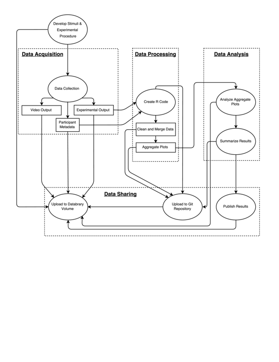

# 开发用于处理和分析光流数据的 R 代码

# 开发用于处理和分析光流数据的 R 代码

## Andrea R. Seisler 和 Rick O. Gilmore

> 本章仅出现在书籍*可复现研究实践*的在线附录中。请引用该书的在线版本：Kitzes, J., Turek, D., & Deniz, F.（编）（2018）。可复现研究实践：数据密集科学的案例研究和经验教训[在线版本]。取自[`www.practicereproducibleresearch.org`](http://www.practicereproducibleresearch.org)。

我的名字是 Andrea Seisler，我是宾夕法尼亚州立大学 Rick Gilmore 博士领导的大脑发育实验室的实验室经理。我有生物医学工程背景，专注于成像。在过去几年中，我一直在协助 Gilmore 博士进行各种行为和基于脑电图的光流研究的数据收集、处理、分析和出版工作。

可复现性意味着数据集的处理可以由许多用户多次使用相同的工作流程/代码进行，并获得相同的结果。它还意味着随着收集更多数据，可以运行一些命令来根据增加的数据集更新结果。

### 工作流程

 这项研究探讨了儿童观察者对视觉运动模式（光流）的敏感程度，这些模式在整体模式和速度方面有所不同。该研究延续了我们之前与成年人进行的一项研究（[`doi.org/10.17910/B7V88T`](http://doi.org/10.17910/B7V88T)），并且是一系列关于同一主题的研究之一（例如，[`doi.org/10.17910/B7QG6W`](http://doi.org/10.17910/B7QG6W)）。

**数据收集**

数据是利用在 Matlab 中编写的脚本和[心理物理学工具箱](http://psychtoolbox.org/)进行收集的，以生成显示。每个显示包含两个并排的、随时间变化的环形光流模式，由小白点在黑色背景上移动而成。一侧显示随机（0%一致）运动，而另一侧显示径向或平移运动。在每个试验中，我们改变了具有一致（非随机）运动的点的比例。一些儿童看到了具有 20、40、60 和 80%一致性的模式，而其他人看到了具有 15、30、45 和 60%一致性的模式。参与者的任务是确定屏幕的哪一侧包含一致的运动。参与者通过指向显示器来指出他们的选择。在一组四个块中，我们还改变了运动的速度。分别在 2 和 8 deg/s 下收集了两个块，总共 4 次运行。

由 Matlab 脚本为每个参与者生成了四个单独的输出（CSV 格式）文件，每个文件来自 4 个区块中的一个。每个 CSV 文件包含有关刺激的模式类型和一致性水平、反应时间和响应准确性的逐试信息。在参与者数据收集期间还收集了视频。文件名由测试日期（YYMMDD）与四位参与者标识符（NNNN）、区块顺序（1-4）和速度条件（2 或 8）连接而成。这种文件命名方案有助于后续处理。

在招募阶段，我们可以访问有关参与者的各种形式的个人身份识别信息（PII）。这使我们能够通过邮寄、电子邮件和电话联系我们所选的参与者家庭。大多数 PII 元素可能**不**与他人共享，并且仅存储在只有我们实验室组可以访问的本地计算机上。

**Databrary 数据库**

我们使用 Databrary 数字图书馆（[`databrary.org`](http://databrary.org)）来存储和共享数据，包括测试会话的视频。在完成数据收集会话后，我们在 Databrary 的电子表格上创建一个会话。我们输入有关参与者的信息（标识符代码、性别、测试时的年龄、家长报告的种族/族裔、测试日期和出生日期），以及会话特定的变量，如条件、测试顺序、会话是否用于试点测试或因某种原因被排除等等。我们上传每个文本格式的数据文件和会话的视频（如果有）。我们还征求家长和参与者是否同意与其他研究人员共享数据的许可。然后我们在 Databrary 的电子表格上记录家长和参与者是否同意共享数据。

组合的确切年龄、测试日期和出生日期在《健康保险可移植与责任法案》（HIPAA）下被视为个人身份识别信息。Databrary 允许我们记录这三个数据元素用于我们自己的记录，但除非参与者同意共享数据，否则不会向其他研究人员公开所有三个数据。如果参与者或家长拒绝共享数据，则只有测试时的年龄和测试年份可见。在某些情况下，我们将数据文件转移到宾夕法尼亚州立大学的 Box 云存储中进行分析和个人身份识别信息的删除。

**GitHub 代码库**

除了在 Databrary 上存储基于文本的数据之外，我们还将其存储在项目的 GitHub 存储库中（[`github.com/gilmore-lab/moco-3-pattern-psychophysics/tree/master/child-laminar-radial`](https://github.com/gilmore-lab/moco-3-pattern-psychophysics/tree/master/child-laminar-radial)）。GitHub 存储库是我们由实验室主任（吉尔莫尔）用 R 编写的数据清理和分析代码的家园。实验室主任进行了大部分分析，并在相关 R 函数的注释或站点的 README 文件中提供有关分析工作流程的文档。Git 的版本跟踪功能允许对我们的分析工作流程的更改历史进行仔细记录。

数据清理/文件合并工作流程包括一系列步骤。首先，从个别文件名中提取有关参与者 ID 号、速度条件和区块的信息。这些元素被添加到一个带有区块特定的、逐试验数据的 R 数据框中。然后，可以合并或连接个别区块数据文件，以创建该参与者的会话级数据框。使用 R 的*lapply*、*Reduce*和*merge*函数，可以在一组参与者文件上执行这些操作，以创建用于后续分析的单个数据框，该数据框保存为 CSV 文件。脚本`analyses/import-clean-export.R`说明了这些步骤是如何完成的。从运行此脚本生成的聚合输出数据文件的示例是`analyses/aggregate-data/moco-beh-child.csv`，该文件在数据收集过程中定期在 GitHub 上更新。第二步是分析数据。由于我们仍在收集数据，因此尚未进行正式分析，但我们已经创建了一些函数来可视化模式。函数`analyses/plot.aggregate.R`显示了我们如何导入先前生成的数据文件，对其进行总结，并创建几个示例图（请参阅`analyses/img`）。

此实验室中的多个研究都使用类似的工作流程，包括 EEG 和其他行为研究。Databrary、GitHub 和 R 的结合使得可以轻松创建特定类型数据的工作流程，并随着数据的收集进行再现。这使得数据共享和分析成为一个持续的过程，而不是保存到研究结束时才进行的事情。这使得撰写摘要和论文变得不那么繁琐。

### 痛点

将数据传输到 Databrary 可能需要一些时间。输出数据文件以 CSV 文件夹和另一个.mp4 文件夹的形式存储在本地。将数据（.mp4 和.csv）上传到 Databrary 必须手动进行，因为 Databrary 目前不会根据文件名重新排序文件。.csv 数据还需要手动上传到 Box/GitHub。

通过从 Databrary 导出数据为.csv 文件，相对容易更新参与者元数据文件。然后可以删除特定分析所不需要的列（例如种族、民族、任务名称），只留下参与者 ID、测试日期、年龄和性别列。

### 主要优势

R 包含许多命令（例如*merge*、*lapply*、*Reduce*），使得在多个数据集上执行操作并在收集数据时轻松添加数据集到分析中变得高效。我们经常“借用”一个用于某一目的的脚本，并将其用于新的研究中。通过自动化数据文件操作步骤，我们减少了错误的可能性。

### 主要工具

Databrary 允许我们所有的数据都存储或引用（例如 GitHub、出版物）在一个地方，并鼓励我们在收集数据时上传数据。这种边收集边上传的工作流比事后数据整理要少繁琐。Databrary 的数据集可以在我们研究小组内保持私密，直到完成并准备与其他研究人员分享数据。我们的做法是一旦我们在公开场合展示了我们的工作或提交了一篇论文，就分享数据。一旦数据集被分享，Databrary 系统会为数据集创建一个 DOI。这使得其他研究人员可以搜索到数据集。

### 问题

#### 你认为在你的领域中可复现性为何重要？

可复现性至关重要，因为如果另一个研究人员无法复现我们的工作流程并获得相同的结果，那么最初的结果可能是不正确的。

#### 你是如何或从哪里了解到可复现性的？

通过在线培训和书籍学习进行自学。

#### 你认为在你的领域进行可复现研究的主要挑战是什么，你有什么建议吗？

确保 GitHub 上的所有内容都可以被另一个用户 fork 并重新运行。我们还开始收集（经过许可）我们整个实验方案的视频。我们认为所有社会和行为科学家都应该这样做，以改善有关实验程序的文档准确性。

#### 你认为进行可复现研究的主要激励是什么？

它维护了科学理想。

#### 你会推荐给你领域的研究人员哪些最佳实践吗？

尽可能自动化。文档，文档，文档。从今天开始。

#### 你会推荐哪些特定资源来了解更多关于可复现性的知识吗？

R 编码和 R Markdown 培训：[`www.rstudio.com/online-learning/`](https://www.rstudio.com/online-learning/)
