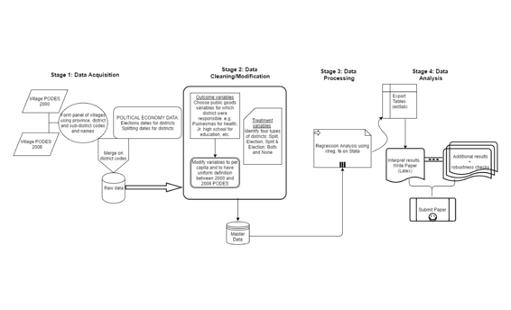

# 全部还是无！印度尼西亚部分与完全分权下的公共物品供给

# 全部还是无！印度尼西亚部分与完全分权下的公共物品供给

## Deepak Singhania

> 这一章节仅出现在书籍《可重现研究实践》的在线附录中。请引用该书的在线版本：Kitzes, J., Turek, D., & Deniz, F. (Eds.). (2018). The Practice of Reproducible Research: Case Studies and Lessons from the Data-Intensive Sciences [在线版本]。获取自[`www.practicereproducibleresearch.org`](http://www.practicereproducibleresearch.org)。

我是 Deepak Singhania，我的研究领域是发展经济学和应用微观经济学。我的主要研究还涉及一些政治经济学元素。我是加州大学河滨分校的第五年博士生。我的研究探讨了不同类型分权之间互补性的福利效应。现有文献对治理分权对公共物品供给的效应方向不明确。在我的研究中，我认为造成这种模糊不清的主要原因之一可能是对分权类型的误识别。理论文献广泛将分权类型分为行政、政治和财政分权。不同的分权类型及其互补性可能对分权效应的识别产生重要影响，而忽视这种互补性可能导致遗漏变量偏误。我通过分析 2000 年至 2008 年间印度尼西亚各地区之间的普遍财政分权下的行政和政治分权之间的互补性来解决识别问题。我的研究结果显示，与仅面临一种类型的分权或没有分权的地区相比，面临行政和政治分权的地区的公共物品供给有所增加。

研究从定义上来说意味着反复进行系统调查，这意味着对现有发现进行测试和再测试。我将再现性视为证明“研究”这个术语的本质意义的一种方式。在我的分权研究中，再现性至关重要，因为我正在挑战分权文献中的现有发现和方法。我希望将比较不同的分权类型的想法成为进行分权研究的标准方法，并且为此我需要确保我的工作是可以再现的。我计划不仅在印度尼西亚设置内使其再现，甚至使用我的方法来测试其他设置中的发现。

### 工作流程

 我使用了两种主要类型的数据。第一种是与公共产品相关的数据，这些数据可从印度尼西亚统计机构（BPS）获得。这些数据是印度尼西亚村庄的普查数据，称为 PODES。我使用了 2000 年和 2008 年的 PODES 波次进行短期分析，以及 2011 年的波次进行中期分析。这些数据并不公开，但可以轻松从 BPS 网站购买。要重现我的主要结果，只需使用 2000 年和 2008 年的波次即可。第二种类型的数据是与印度尼西亚地区的政治经济相关的信息。这有两个来源。有关地区分裂日期的数据可以从 BPS 免费获取，可以通过电子邮件联系他们。我从[Burgess et al. 2014](https://economics.mit.edu/files/12951)获得了地区首脑选举日期。这些日期也可以从印度尼西亚内政部获取，尽管我花了很多时间整理这些日期。

PODES 是一个庞大的数据集，涵盖了 60,000 多个村庄的 200 多个变量。在使用相同变量的两三个波次时，需要小心，因为变量名称和定义会不断变化。我选择了那些与公共产品相关的变量，这些变量由地区政府直接负责。我从一些现有的论文中获取了这些信息。一旦收集到了正确的变量集并统一了定义，这些数据就可以用于结果变量。这些数据还有其他各种变量，可以用作解释变量，但我在论文中没有使用它们，因为由于其他解释变量与处理变量之间的内生性问题，难以添加除主要处理以外的解释变量。但是，这不会改变我的论文的主要结果。

政治经济数据具有地区代码和名称，可以用来与 PODES 合并。对于处理“split”，我为被分割的地区的原始部分和新部分分配了一个虚拟变量。类似地，使用选举数据中的日期，分配了选举的处理。现在，合并后的政治经济数据和 PODES 数据集已准备好用于主要分析。为了应用带有固定效应估计策略的差异法，我使用了 Stata [版本 14 SE]中的 xtreg 命令来生成我的主要分析结果。我需要一个村庄面板的固定效应，这些固定效应是在村庄层面的。我在下一节中讨论了这个面板作为可重复性的一个痛点。我将结果从 Stata 导出为.eps 格式，以便我可以生成表格的 LaTeX 版本。由于不同类别下有许多变量，所以需要一些迭代来生成可以轻松解释的表格。

我已经对我的代码进行了详尽的注释。我计划将其提供给我使用过的每个数据集。这个过程很长，但很简单。在印度尼西亚的情况下，有一件有利的事情，这在许多发展中国家并不成立，那就是各种数据集中的区县和省份的代码和名称几乎是相似的，因此匹配它们并不是非常困难。我会说我的代码写得非常细致，不难理解。所以用我的代码复制我的工作应该很容易。此外，我的规范很简单，这将使在其他情境下进行类似分析更加容易。

### 痛点

在发展中国家进行实证研究的主要挑战之一是处理庞大的数据集，有时是混乱的数据集。在印度尼西亚的情况下尤其困难，因为部分数据是用巴哈萨语编写的。我使用谷歌翻译来理解 PODES 数据集中的变量及其含义。稍加练习后，这变得容易些。

另一个大问题是将 PODES 数据集转换为一个村庄的面板。为此，我使用了省份、区县和子区县的代码和名称来匹配村庄。在两周的时间内，我成功地创建了基线中 94% 的村庄面板。我愿意分享我的代码，以便能够复制我的工作。因为它是村庄普查，我使用了所有的村庄，除了三个地区，原因在我的论文中有提到，所以完全可以复制我的结果。

另一个可能面临的小问题是在不同 PODES 波次之间匹配区县代码与政治经济数据。我使用世界银行网站上的印尼扩散交叉路径，该网站位于 [INDO-DAPOER 页面](http://databank.worldbank.org/data/reports.aspx?source=1266)。他们提供了自 1990 年代初以来每年的区县代码。我建议研究人员仔细检查跨数据集匹配的区县代码和名称（总共有 434 个区县），使用 Excel 中的 exact() 命令应该是一个快速的工作。

我会说写代码时一定要非常小心。仅仅因为有一个大数据集可用，就不应该保留所有变量在主数据中。在选择初始变量时要吝啬一些，然后再逐渐添加更多变量。许多错误都是由于不必要的变量及其不必要的代码导致的。另一个具体的建议是，当重新编写已经编写好的一组代码时，你认为不需要或者你有更好的方式去做时，永远不要覆盖原始代码，因为你永远不知道新的代码是否可行。首先复制原始代码，然后将其粘贴到一个新的命令窗口中，然后再进行操作。

我的下一个建议是关于从 Stata 转移结果。永远不要复制粘贴结果。更简单的工具如 esttab 和 outreg 可供使用，使我们的生活更轻松。学习这些工具的初始固定成本较高，但从长远来看可以节省大量时间和错误。

自从最近接触到版本控制以来，我还没有使用过它。这非常有用，我打算更经常使用它。我相信我擅长存档我的旧文件，并在一个单独的文件夹中处理新文件，但我们无法真正信任人为错误。当像 github 和开放科学框架这样的工具可用时，为什么要冒险呢？

### 问题

#### 你认为在你的领域中可重复性研究的重要性在于什么？

我的领域中许多重要的公共政策决策基于研究结果。我们的大部分工作涉及测试某种因素对经济福祉的影响。如果这些结果出现错误，无论出于何种原因，都可能影响用于改善生活的宝贵资源。因此，在我的领域中，研究必须变得越来越可重复。毕竟，进行研究的主要目标是对社会产生积极影响，为了实现这样的宏伟目标，研究必须接受审查。这不是个人的事情，而是涉及整个社会的价值观。

#### 你是如何或从哪里了解到可重复性的？

我从我的委员会成员之一 Joseph Cummins 教授那里学到了一些，当时我们在他的课堂上合作撰写一篇论文。但我最近大部分是在加州大学伯克利分校社会科学透明倡议（BITSS）的研讨会上学到的。

#### 你认为在你的领域进行可重复研究面临的主要挑战是什么，你有什么建议吗？

我认为在我的领域进行可重复研究的最大陷阱是期刊对于在提交稿件时发布代码以及在可能的情况下发布数据没有严格要求。如果满足这些要求，即使数据不可访问，至少代码可以进行交叉检查，并在类似数据可用的不同环境中使用。对于所有工作都要公开的恐惧将要求研究人员在分析时更加谨慎。创造这种环境的最佳途径在于期刊的主导。

#### 你认为进行可重复研究的主要激励是什么？

我能想到的激励方式如下。为进行可重复研究提供资金将起到最重要的作用。另一种方法可能是通过在大学部门内任命职位或设立特殊机构来创造从事可重复研究的职业机会。最后，最好在早期阶段树立与可重复研究相关的价值观，这可以通过在本科课程大纲中包含这个主题的章节来实现。

#### 你会推荐一些你领域的研究者最佳实践吗？

在编写代码时，始终以这样的想法来编写：你将不得不将其与你的手稿一起发布。这样，你可以确保它简单易懂，有足够的注释，并且以合理的方式命名变量。

#### 你会推荐一些特定的资源来了解更多关于可复制性的知识吗？

我会推荐[`www.bitss.org`](http://www.bitss.org)。如果一个人能掌握这里提供的所有内容，那应该已经足够了。
