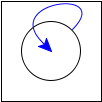

# 9 递归和循环：过程和数据

递归是自我引用的行为。当我们在编程语言中谈论递归时，我们可能有至少两种含义：数据中的递归，以及控制中的递归（即程序行为的递归——也就是说，函数的递归）。

## 9.1 递归和循环数据

数据中的递归可以指两种情况之一。它可以意味着引用相同类型的东西，或者引用相同的东西本身。

相同类型的递归导致我们传统上称为递归数据的东西。例如，树是一种递归数据结构：每个顶点可以有多个子节点，每个子节点本身都是一棵树。但是，如果我们编写一个遍历树节点的过程，我们希望它在不必追踪已经访问过的节点的情况下终止。它们是有限的数据结构。

相比之下，图通常是循环数据：一个节点引用另一个节点，后者可能再次引用原始节点。（或者，换句话说，一个节点可能直接引用自身。）当我们遍历图时，除非有明确的检查我们已经访问过什么的机制，否则我们应该期望计算会发散，即不会终止。相反，图算法需要记住它们已经访问过什么，以避免重复遍历。

将递归数据（例如列表和树）添加到我们的语言中非常简单。我们主要需要两件事：

1.  创建复合结构的能力（例如具有对子节点的引用的节点）。

1.  底部递归的能力（例如叶子节点）。

练习

> 将列表和二叉树作为编程语言的内置数据类型添加进去。

添加循环数据更加微妙。考虑最简单形式的循环数据，一个指向自身的单元格：

> 

让我们尝试在 Racket 中定义这个。这是一种尝试：

> | (let ([b b]) |
> | --- |
> |   b) |

但是这不起作用：let 右侧的 b 没有绑定。如果我们将其 desugar，很容易看出来：

> | ((lambda (b) |
> | --- |
> |    b) |
> |   b) |

并且，为了清晰起见，我们可以在函数中重新命名 b：

> | ((lambda (x) |
> | --- |
> |    x) |
> |  b) |

现在很明显 b 没有绑定。

除非我们还没有见过某种神奇的 Racket 构造，否则构造将是共享的，但几乎没有其他语言具有这种符号机制，因此我们不会在这里详细讨论它。实际上，我们正在研究的是共享实际上是如何工作的主要思想，可以清楚地看出，我们无法一次性创建循环数据。相反，我们需要首先为数据创建一个“位置”，然后在数据内部引用该位置。使用“然后”——即，引入时间——应该暗示一种变异操作。的确，让我们尝试使用盒子。

我们的计划如下。首先，我们想创建一个盒子并将其绑定到某个标识符上，比如 b。现在，我们想要改变盒子的内容。我们希望它包含一个指向自身的引用。它如何获得该引用？通过使用已经绑定给它的名称 b。这样，突变就创建了循环：

> | (let ([b (box 'dummy)]) |
> | --- |
> |   (begin |
> |     (set-box! b b) |
> |     b)) |

请注意，此程序如写的那样不会在 Typed PLAI 中运行。我们稍后会返回来对这样的程序进行类型化[REF]。现在，用不带类型的(#lang plai)语言运行它。

当上述程序运行时，Racket 会打印出：#0=’#&#0#。这种表示法实际上正是我们想要的。回想一下，#&是 Racket 打印盒子的方式。#0=（以及其他数字类似）是 Racket 给循环数据命名的方式。因此，Racket 正在说，“#0 绑定到一个盒子，其内容是#0#，即绑定到#0 的任何内容，即自身”。

练习

> 通过你的盒子解释器运行等效的程序，并确保它产生一个循环值。你如何检查这个？

上述想法推广到其他数据类型。以同样的方式，我们也可以产生循环列表、图等。中心思想是这样的两步过程：首先命名一个空白占位符；然后突变占位符，使其内容为自身；为了获得“自身”，使用先前绑定的名称。当然，我们不必局限于“自我循环”：我们也可以有互相循环的数据（其中没有一个元素是循环的，但它们的组合是循环的）。

## 9.2 递归函数

在术语上的转变中，递归函数不是指向相同类型的函数，而是指向相同的函数本身。首先确保我们已经扩展了我们的语言以包含条件（甚至是只检查 0 的条件，如前面描述的那样：向语言中添加函数），这样我们就可以编写终止的非平凡程序了，这是很有用的。

现在让我们尝试写一个递归的阶乘：

> | (let ([fact (lambda (n) |
> | --- |
> |               (if0 n |
> |                    1 |
> |                    (* n (fact (- n 1)))))]) |
> |   (fact 10)) |

但这根本行不通！内部的 fact 会给出一个未绑定的标识符错误，就像我们的循环数据示例一样。

我们应该遇到相同的错误并不奇怪，因为它有相同的原因。我们传统的绑定机制不会自动使函数定义成为循环的（事实上，在一些早期的编程语言中，它们并不是：错误地认为递归是一种特殊特性）。因为你通常写顶层定义，所以你不会遇到这个问题。在顶层，每个绑定都隐含着一个变量或一个盒子。因此，下面的模式基本上是自动为你准备好的。这就是为什么，当你想要一个递归的本地绑定时，你必须使用 letrec 或 local，而不是 let。相反，如果我们想要递归——即，一个函数定义循环地引用自己——我们必须手动实现它。

现在如何做到这一点已经很清楚了：问题与我们之前诊断的问题相同，因此我们可以重用相同的解决方案。我们再次必须遵循一个三步过程：首先创建一个占位符，然后在需要循环引用的地方引用该占位符，最后在使用前对占位符进行变异。因此：

> | (let ([fact (box 'dummy)]) |
> | --- |
> |   (let ([fact-fun |
> |          (lambda (n) |
> |            (if (zero? n) |
> |                1 |
> |                (* n ((unbox fact) (- n 1)))))]) |
> |     (begin |
> |       (set-box! fact fact-fun) |
> |       ((unbox fact) 10)))) |

实际上，我们甚至不需要 fact-fun：我只是为了清晰起见而使用了这个绑定。请注意，由于它不是递归的，而且我们有标识符而不是变量，因此它的使用可以简单地用其值替换：

> | (let ([fact (box 'dummy)]) |
> | --- |
> |   (begin |
> |     (set-box! fact |
> |               (lambda (n) |
> |                 (if (zero? n) |
> |                     1 |
> |                     (* n ((unbox fact) (- n 1)))))) |
> |     ((unbox fact) 10))) |

有一个小麻烦，需要反复打开 fact 的盒子。在有变量的语言中，这将更加无缝：事实上，变量的一个用途是简化上述模式的去糖化，而不是要求每次循环绑定标识符都要打开盒子。另一方面，稍加努力，去糖化过程也可以负责打开盒子。

> | (let ([fact 'dummy]) |
> | --- |
> |     (begin |
> |       (set! fact |
> |             (lambda (n) |
> |               (if (zero? n) |
> |                   1 |
> |                   (* n (fact (- n 1)))))) |
> |       (fact 10))) |

## 9.3 提前观察

我们对这种模式的前述讨论显示了明确的时间顺序：创建、更新、使用。我们可以用一个去糖化规则来捕捉它。假设我们添加以下新语法：

> | (rec name value body) |
> | --- |

作为其使用的一个例子，

> | (rec fact |
> | --- |
> |      (lambda (n) (if (= n 0) 1 (* n (fact (- n 1))))) |
> |      (fact 10)) |

将会计算出 10 的阶乘。这个新的语法会被去糖化为：

> | (let ([name (box 'dummy)]) |
> | --- |
> |   (begin |
> |     (set-box! name value) |
> |      body)) |

在这里我们假设 value 和 body 中所有对 name 的引用都已被重写为(unbox name)，或者我们可以使用变量：

> | (let ([name 'dummy]) |
> | --- |
> |   (begin |
> |     (set! name value) |
> |     body)) |

这自然引发了一个问题：如果我们按顺序排列呢？最有趣的是，如果我们在完成更新其真实值之前尝试使用名称会怎样？那么我们就会观察到在创建后立即使用系统的状态，即我们可以看到占位符的原始形式。

最简单的示例是：

> | (letrec ([x x]) |
> | --- |
> |   x) |

或者等价地，

> | (local ([define x x]) |
> | --- |
> |   x) |

在大多数 Racket 变体中，这会泄漏给占位符的初始值—<wbr>一个从未打算供公众消费的值。这令人不安，因为它毕竟是一个合法的值，这意味着它可能至少可以在某些计算中使用。然而，如果开发人员无意中访问并使用它，他们实际上是在进行无意义的计算。通常有三种解决这个问题的方法：

1.  确保值足够隐晦，以至于永远不会在有意义的上下文中使用。这意味着像 0 这样的值特别糟糕，实际上大多数常见的数据类型都应该避免使用。相反，语言可能会为此创建一种新类型的值。传递给任何其他操作，这将导致错误。

1.  明确检查标识符的每次使用是否属于这种特殊的“过早”值。尽管从技术上讲这是可行的，但它会给程序带来巨大的性能损失。因此，通常只在教学语言中使用。

1.  仅允许递归构造器在绑定函数的情况下使用，并确保绑定的右侧在语法上是一个函数。不幸的是，这种解决方案可能有点极端，因为它排除了编写例如用于创建图形的结构。

## 9.4 没有显式状态

正如您可能已经意识到的，还有另一种定义递归函数（因此递归数据）的方法，不涉及显式的突变操作。

现在就做！

> 当我们尝试仅使用 let 来定义递归函数时，您已经看到了出现的问题。再努力一点。提示：进行更多替换。然后再多一些。再多一些！

仅从函数中获得递归是一个了不起的想法，我是字面意思上使用这个术语。这在丹尼尔·P·弗里德曼和马蒂亚斯·费莱森的书《The Little Schemer》中有很好的描述。在[他们的在线示例章节](http://www.ccs.neu.edu/home/matthias/BTLS/sample.pdf)中阅读更多关于它的内容。

练习

> 上述解决方案是否在任何地方使用状态？隐式地？
