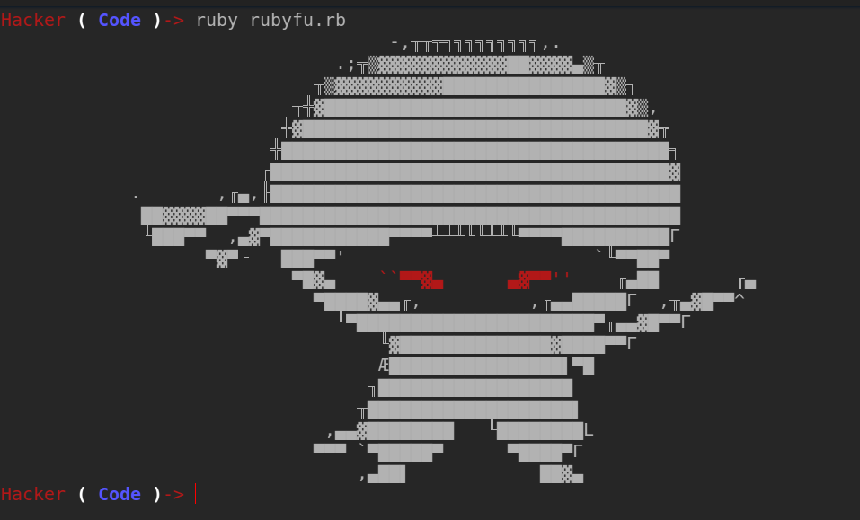

# RubyFu 中文版



***Rubyfu，Ruby 变得邪恶的地方！***


本书是一个伟大的想法、技巧和技能的集合，对黑客们可能会有用。它是一个独特的提取参考，总结了很多研究和经验，以便以最短、最聪明的方式实现你的**w00t**。Rubyfu 是你会找到即插即用代码的地方。Rubyfu 不仅是一本阅读的书，它是 Ruby 变得邪恶的地方。

### 谁应该阅读本书？

理想情况下，黑客们！那些有足够经验来黑掉我们的世界，并且*至少*具备 Ruby 编程语言的基础知识。要获得本书的最大好处，打开 Rubyfu.net 并将其固定在浏览器标签中。使用 irb/pry 交互式解释器运��代码，或将其作为脚本运行。优化代码以适应你的需求，是的，将代码及其输出推文到[@Rubyfu](https://twitter.com/rubyfu)与我们的出色社区分享。

### 本书组织结构

#### 模块 0x0 | 介绍

模块 0x0 只是一个平稳的开始，无论你是读者、作者、黑客还是来打个招呼的人。在这个模块中，你会找到一个很好的开始作为贡献者，各种形式的贡献都受欢迎，从校对一直到撰写主题。

#### 模块 0x1 | 基础 Ruby 功夫

模块 0x1 是一个最常见的字符串操作、提取和转换任务的精彩集合；处理你在黑客过程中可能遇到的真实案例。你的编码和数据转换可能是一个琐碎或复杂的挑战，在这里我们不在乎，我们会解决它。

#### 模块 0x2 | 系统功夫

模块 0x2 更深入地探讨系统黑客技术，其中经常需要使用系统命令、文件操作、加密和生成常见哈希。用 Ruby 获得简单的绑定和反向 shell 是一项有用的技能，毫无疑问。几乎所有主流的 Linux 系统都预装了 Ruby，如果没有，也没关系，我们总有其他方法利用我们的知识。

#### 模块 0x3 | 网络功夫

模块 0x3 深入探讨网络套接字、协议、数据包操作、服务枚举，并提供更多黑客和令人敬畏的代码来完成工作。与网络协议一起工作需要对这些协议如何工作以交换可理解数据有更深入的了解，是的，我们将在这里找到答案。

#### 模块 0x4 | Web 功夫

模块 0x4 涵盖了 Web 主题。网络是分享信息最常见的地方，也是最令人愉悦的黑客地点之一。网络黑客挑战以其独特性而闻名，在单个页面中有许多潜在技术，需要一种具有易于适应能力的多功能工具。在这里，我们将学习如何处理 GET 和 POST 请求、Web 服务、数据库、API，并操纵浏览器使其成为我们的士兵。

#### 模块 0x5 | 利用功夫

模块 0x5 通过 Ruby 构建您的利用能力。无论漏洞是远程的（FTP、IMAP、SMTP 等）还是本地的（文件格式、本地系统），您都需要知道如何为其构建模糊测试器和骨架利用程序。如果你到达那里，你将需要一种简单、干净且稳定的方式来构建你的利用程序。在这里，你将学习如何构建你的模糊测试器、利用程序，并将你的利用程序移植到 Metasploit——甚至如何编写自己的 Metasploit 模块。

#### 模块 0x6 | 取证功夫

模块 0x6 探索了 Rubyfu 的取证能力。无论你是红队、蓝队还是介于两者之间，你都需要一些取证技能来进行黑客活动和/或调查。在这里，你将学习如何处理注册表任务、提取浏览器信息等等。

## 

# 贡献

# 贡献

本书采用[CC BY-NC-SA 许可证](https://creativecommons.org/licenses/by-nc-sa/3.0/)，因此我们感谢各种形式的贡献、分发，并将永久保留我们贡献者的努力。

注意：��书中的代码在 Ruby 版本> 2.2.0 上测试通过

## 贡献方法

有几种贡献方式可以帮助本书取得最佳效果：

+   通过添加棘手的代码做出贡献。

+   通过为现有代码添加更多解释做出贡献。

+   通过增强代码质量或提供替代方案做出贡献。

+   通过提高书籍质量做出贡献：

    +   结构增强

    +   拼写、校对增强

    +   设计增强

    +   想法和请求

    +   任何其他

+   通过在社交媒体和 IS 社区中传播本书做出贡献。

    +   推特：[@Rubyfu](https://twitter.com/Rubyfu)和标签`#Rubyfu`

    +   Google+：[Rubyfu 页面](https://plus.google.com/114358908164154763697)

+   通过添加更多资源和参考资料做出贡献。

+   通过捐赠做出贡献。

## 如何做？

### 开始贡献

请在参考资料部分找到关于 GitBook 和 Markdown 编辑的所有必要信息。作为一个良好的开始，你可以参考[如何使用官方自述文件](https://github.com/GitbookIO/gitbook)。你可以轻松使用 GitBook [桌面编辑器](https://www.gitbook.com/editor)。

1.  创建一个[GitHub](https://github.com)账户。

1.  分叉[RubyFu 存储库](https://github.com/rubyfu/RubyFu)。

1.  克隆 GitHub 分叉的 RubyFu 存储库：

    `git clone https://github.com/[YourGithubAccount]/RubyFu`

1.  创建一个[GitBook](http://gitbook.com)账户。

1.  前往[**GitBook 编辑器**](https://www.gitbook.com/editor)并使用您的 GitBook 账户登录

1.  点击**导入**按钮导入克隆的存储库。然后，您将在**本地库**选项卡中找到它。

1.  将分叉的 RubyFu 存储库 GitHub URL 添加到 GitBook 编辑器中：**工具栏** >> **文件** >> **首选项** >> **GIT**。

1.  开始你的出色贡献。

1.  从 GitBook 编辑器，**同步**您的更改到分叉的存储库。

1.  从 GitHub，向**Master**分支发送一个**Pull Request(PR)**。

不确定从哪里开始帮助？去 待办事项列表 并检查未选中的项目。

### 用代码贡献

##### Ruby 代码

+   使用三个反引号 ````` followed by `ruby` then your code in between the ````` 来进行 Ruby 代码的高亮显示。例如。

    ```
     ```ruby

    puts "Ruby 代码在这里"

    ``` 
    ```

+   解释代码的主要思想 - 加一些细节 - 如果你解释每一行那就太棒了，但这不是必须的。

+   选择正确的模块。

+   让你的标题清晰。

+   在粘贴代码之前使用文本编辑器/IDE 进行代码识别。

+   如果你复制或开发了由他人创建的代码，请在页脚中提到来源。例如。

    ```
     ```ruby

    puts "你的良好代码"

    ```
      [Source][1] 
    ```

    然后将以下内容添加到页脚

```
 [1]: http://TheSouceCodeURL

Your notes should be under the footer's line. Add the following to initiate the footer if it does not yet exist

    <br><br><br>
    ---
    YOUR NOTES SHALL BE HERE 
```

+   尽量使用可读的代码，如果必须添加更多的巧妙/技术性代码，那么一定要解释清楚。

    > **记住！** 黑客的代码 **！=** 神秘的代码

##### 命令行

使用三个反引号来突出显示你的命令行。例如。

```
```

ls

``` 
```

### 用翻译贡献

要翻译 Rubyfu，确保

+   为你的翻译创建一个新的分支。

+   在 Rubyfu 的根目录下添加一个子目录，以你将要翻译的语言命名。

+   更新 `LANGS.md` 文件

+   将 `en/` 文件夹的内容复制并粘贴到你的语言文件夹中，然后进行翻译。

+   创建一个 Pull Request (PR)。

请确保将存储库标记为**观察**，以保持你的翻译工作处于最新状态。

### 一般贡献

一般的贡献可能包括主题请求、校对、拼写、书籍组织和风格。所有这些贡献都受欢迎；但是，它们必须在 [Rubyfu 问题](https://github.com/rubyfu/RubyFu/issues) 上进行讨论 - 尤其是关于主题和/或书籍组织和样式方面的事情。同时，不要犹豫，即使是关于书籍的一个单词的观察也要报告，这最终是为了你自己。

> **注意：** 由于本书是动态增强的并且无序的，因此很难为整本书制作具有序号的页脚注释，所以 - 直到我找到更好的解决方案 - 我将为每一页单独制作数字排序。

# 初学者

# 初学者

## 为初学者提供的伸展任务

好吧，如果你认为自己是一个初学者，并且需要热身，那么在开始这本书之前，使用 Ruby 做以下任务列表会很不错。

+   **字符串**

    +   请按原样打印以下字符串 `\x52\x75\x62\x79\x46\x75`，它**不应**解析为字符。

    +   你有字符串 `RubyFu`，将此字符串转换为一个数组（每个字符是一个元素）。

+   **数组**

    +   你有以下数组 `["R", "u", "b", "y", "F", "u"]`，将其转换为字符串 `RubyFu`。

    +   你有以下数组 `["1", "2", "3", "4"]`，计算所有元素的和。

+   **文件和文件夹**

    +   在你的下载文件夹中找到所有以 `.jpg` 或 `.pdf` 或 `.docx` 或 `.zip` 结尾的文件。

    +   创建一个名为 `ruby-testfu` 的文件夹，并将找到的所有文件（从上一个任务中）复制到其中。

+   **网络**

    +   创建一个简单的 TCP 服务器监听端口 3211。这个服务器打印`日期和时间`。

    +   创建一个简单的 TCP 客户端连接到之前的服务器并打印服务器发送的内容。

在初学者部分下可以找到一个很好的参考资料列表。

## 挑战自己！

有一些很棒的网站通过交互式挑战来提升您的编程技能，我真的鼓励您浏览其中一个或多个。

+   [Codewars](http://www.codewars.com/?language=ruby)

+   [rubeque](http://www.rubeque.com/)

+   [Hackerrank](https://www.hackerrank.com/)

+   [RubyQuiz](http://rubyquiz.com/)

* * *

# 必需的 Gems

# 必需的 Gems

我想列出可能在本书中使用的所有外部 gem。一旦需要新的 gem，此列表将会更新。

请注意，除非您特别需要它们，否则不需要安装它们全部。

## 主要 Gems

+   Pry - 一个 IRB 替代品和运行时开发者控制台。

+   pry-doc - Pry Doc 是一个 Pry REPL 插件。通过改进 `show-doc & show-source` 命令来扩展 REPL 的文档支持。

+   pry-byebug - 将'pry'与'byebug'结合起来。添加了'step'、'next'、'finish'、'continue'和'break'命令来控制执行。

    ```
    gem install pry
    gem install pry-doc
    gem install pry-byebug 
    ```

    以最佳外观运行 pry

    ```
    pry --simple-prompt 
    ```

> **注意：** 我们的大多数示例将在 **pry** 上执行，因此请将其视为我们环境的主要部分。否则，当您看到 `#!/usr/bin/env ruby` 时，这意味着一个文件脚本要执行。

## 模块 Gems

由于需要将所有必需的 gem 打包成一个 gem，我们创建了[hacker-gems](https://rubygems.org/gems/hacker-gems)，它可以一次性安装下面列出的所有 gem。

```
gem install hacker-gems 
```

您可能需要预先安装一些软件包，以避免缺少库的任何错误。

```
sudo apt-get install build-essential libreadline-dev libssl-dev libpq5 libpq-dev libreadline5 libsqlite3-dev libpcap-dev git-core autoconf postgresql pgadmin3 curl zlib1g-dev libxml2-dev libxslt1-dev vncviewer libyaml-dev curl nmap 
```

#### 模块 0x1 | 基本 Ruby Kung Fu

+   colorize - 扩展 String 类或添加一个 ColorizedString，具有设置文本颜色、背景的方法。

#### 模块 0x2 | 系统 Kung Fu

+   virustotal - 用于自动化 virustotal.com 查询的脚本。

+   uirusu - 用于与 Virustotal.org 交互的工具和 REST 库。

+   clipboard - 允许您在 Linux、MacOS、Windows 和 Cygwin 上访问剪贴板。

**额外的 gems**

用于构建命令行应用程序的有用 gem

+   tty-prompt - 一个美观而强大的交互式命令行提示符。

+   Thor - 简单轻松地创建命令套件应用程序，以及 Rails 生成器。

+   GLI - 创建出色、精致的命令套件而不需要大量代码。

+   Slop - 使用类似 trollop 的语法创建简单的命令行应用程序。

+   Highline - 通过“问答”风格的 API 处理用户输入和输出，包括类型转换和验证。

+   Escort - 一个使在 Ruby 中构建命令行应用程序变得如此简单的库，您会觉得自己像专家一样在指导您。

+   commander - Ruby 命令行可执行文件的完整解决方案。

#### 模块 0x3 | 网络 Kung Fu

+   geoip - 搜索 GeoIP 数据库主机或 IP 地址，返回国家、城市、ISP 和位置。

+   net-ping - 一个 ping 接口。包括 TCP、HTTP、LDAP、ICMP、UDP、WMI（用于 Windows）。

+   ruby-nmap - 与 Nmap 探测工具和安全/端口扫描器的 Ruby 接口。

+   ronin-scanners - 为 Ronin 提供 Ruby 接口的库，用于各种第三方安全扫描器。

+   net-dns - 一个纯 Ruby DNS 库，具有清晰的 OO 接口和可扩展的 API。

+   snmp - SNMP（简单网络管理协议）的 Ruby 实现。

+   net-ssh - SSH2 客户端协议的纯 Ruby 实现。

+   net-scp - SCP 客户端协议的纯 Ruby 实现。

+   ftpd - 一个纯 Ruby FTP 服务器库。支持隐式和显式 TLS、IPV6、被动和主动模式。

+   packetfu - 用于 Ruby 的中级数据包操作库。

+   packetgen - Ruby 库，用于轻松生成和捕获网络数据包。

#### Module 0x4 | Web Kung Fu

+   net-http-digest_auth - RFC 2617 - 摘要访问认证的实现。

+   ruby-ntlm - 用于 Ruby 的 NTLM 实现。

+   activerecord - Rails 上的数据库。通过将数据库表映射到 Ruby 来构建持久性域模型。

+   tiny_tds - TinyTDS - 用于 Ruby 的现代、简单且快速的 FreeTDS 库，使用 DB-Library。

+   activerecord-sqlserver-adapter。

+   activerecord-oracle_enhanced-adapter。

+   buby - 将 JRuby 与知名商业网络安全测试工具 Burp Suite from PortSwigger 混合。

+   wasabi - 一个简单的 WSDL 解析器。

+   savon - 重金属 SOAP 客户端。

+   httpclient - 在 Ruby 中提供类似于 libwww-perl（LWP）的功能。

+   nokogiri - 一个 HTML、XML、SAX 和 Reader 解析器。

+   twitter - 与 Twitter API 交互的 Ruby 接口。

+   selenium-webdriver - 用于编写网站自动化测试的工具。旨在模仿真实用户的行为。

+   watir-webdriver - 基于 WebDriver 的 Watir。

+   coffee-script - Ruby CoffeeScript 是与 JS CoffeeScript 编译器的桥梁。

+   opal - 用于 JavaScript 的 Ruby 运行时和核心库。

**额外的 gem**

用于处理网络的有用 gem：

+   Mechanize - 使自动化网络交互变得简单的 Ruby 库。

+   HTTP.rb - 用于 Ruby 的快速、优雅的 HTTP 客户端。

+   RestClient - 用于与 RESTful web 服务交互的类和可执行文件。

+   httparty - 让 http 变得有趣！还可以轻松消费 restful web 服务。

+   websocket - 通用的 Ruby 库，用于处理 WebSocket 协议。

#### Module 0x5 | Exploitation Kung Fu

+   metasm - 跨架构汇编器、反汇编器、链接器和调试器。

#### Module 0x6 | Forensic Kung Fu

+   metasm - 跨架构汇编器、反汇编器、链接器和调试器。
