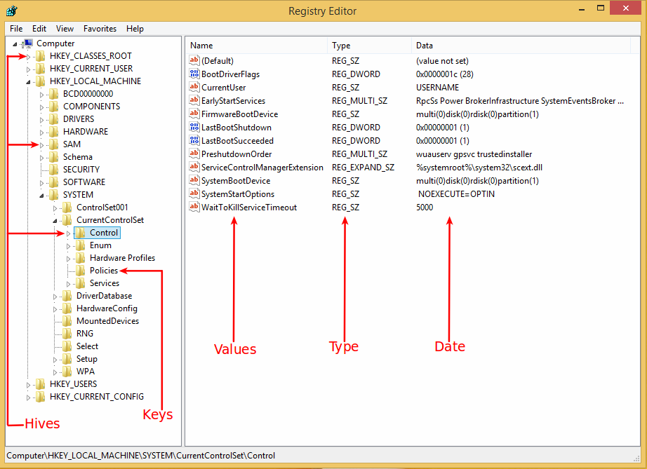

# 模块 0x6 | 取证功夫

# 模块 0x6 | 取证功夫

## 火狐调查

你可以在以下位置找到火狐配置文件数据库

+   Linux

    ```
    /home/$USER/.mozilla/firefox/[PROFILE] 
    ```

+   Windows

    ```
    C:\Users\%USERNAME%\[PROFILE] 
    ```

在上述目录中，有许多 SQLite 数据库文件，让我们导入这些数据库并看看我们得到了什么

```
require 'sqlite3'

# Browser history 
db = SQLite3::Database.new "places.sqlite"

# List all tables 
db.execute  "SELECT * FROM sqlite_master where type='table'"

# List all visited URLs (History)
db.execute  "SELECT url FROM moz_places"
# List all bookmarks
db.execute  "SELECT title FROM moz_bookmarks"

# List all Cookies
db = SQLite3::Database.new "cookies.sqlite"
db.execute  "SELECT baseDomain, name, host, path, value FROM moz_cookies"

# List all form history
db = SQLite3::Database.new "formhistory.sqlite"
db.execute  "SELECT fieldname, value FROM moz_formhistory" 
```

更多关于 [火狐取证](http://www.forensicswiki.org/wiki/Mozilla_Firefox_3_History_File_Format) 的信息

## 谷歌浏览器调查

+   Linux

    ```
    /home/$USER/.config/google-chrome/Default 
    ```

+   Windows

    ```
    C:\Users\%USERNAME%\AppData\Local\Google\Chrome\User Data\Default\ 
    ```

```
require 'sqlite3'

# List all Cookies
db = SQLite3::Database.new "Cookies"
db.execute  "SELECT host_key, path, name, value FROM cookies" 
```

更多关于 [Chrome 取证](http://www.forensicswiki.org/wiki/Google_Chrome) 的信息

* * *

# Windows 取证

# Windows 取证

## Windows 注册表



### 枚举

```
require 'win32/registry'

# List keys
keyname = 'SOFTWARE\Clients'
access  = Win32::Registry::KEY_ALL_ACCESS
Win32::Registry::HKEY_LOCAL_MACHINE.open(keyname,  access).keys

# List all MAC address keys
keyname= 'SOFTWARE\Microsoft\Windows NT\CurrentVersion\NetworkList\Signatures\Unmanaged' 
access = Win32::Registry::KEY_ALL_ACCESS
Win32::Registry::HKEY_LOCAL_MACHINE.open(ketname, access).keys

keyname= 'SOFTWARE\Microsoft\Windows NT\CurrentVersion\NetworkList\Signatures\Unmanaged' 
access = Win32::Registry::KEY_ALL_ACCESS
Win32::Registry::HKEY_LOCAL_MACHINE.open(keyname, access) do |reg|; 
  reg.each_key{|k, v| puts k, v}
end 
```

注意：`KEY_ALL_ACCESS` 使您能够写入和删除。如果您没有指定任何内容，则默认访问权限为 `KEY_READ`。

# 安卓取证

# 安卓取证

## 解析 APK 文件

我们的例子将针对 DIVA（Damn insecure and vulnerable App）APK 文件进行。您可以从 [这里](http://www.payatu.com/wp-content/uploads/2016/01/diva-beta.tar.gz) 下载该文件。

注意：一些方法可能不会返回预期的输出，因为 APK 中缺少信息，例如建议的 APK 没有图标和标志，但您可以下载一些已知的 APK，如 Twitter APK 等，并进行测试，它可以正常工作。

我们将使用 ruby_apk gem 来完成这项任务

+   安装 ruby_apk gem

    ```
    gem install ruby_apk 
    ```

现在，让我们开始解析

```
require 'ruby_apk'

apk = Android::Apk.new('diva-beta.apk')

# listing files in apk
apk.each_file do |name, data|
  puts "#{name}: #{data.size}bytes" # puts file name and data size
end

# Extract icon data in Apk
icons = apk.icon
icons.each do |name, data|
  File.open(File.basename(name), 'wb') {|f| f.write data } # save to file.
end

# Extract signature and certificate information from Apk
signs = apk.signs                   # retrun Hash(key: signature file path, value: OpenSSL::PKCS7)
signs.each do |path, sign|
  puts path
  puts sign
end

# Manifest
## Get readable xml
manifest = apk.manifest
puts manifest.to_xml

## Listing components and permissions
manifest.components.each do |c|     # 'c' is Android::Manifest::Component object
  puts "#{c.type}: #{c.name}"
  c.intent_filters.each do |filter|
    puts "\t#{filter.type}"
  end
end

## Extract application label string
puts apk.manifest.label

# Resource
## Extract resource strings from apk
rsc = apk.resource
rsc.strings.each do |str|
  puts str
end

## Parse resource file directly
rsc_data = File.open('resources.arsc', 'rb').read{|f| f.read }
rsc = Android::Resource.new(rsc_data)

# Resolve resource id
rsc = apk.resource

## assigns readable resource id
puts rsc.find('@string/app_name')   # => 'application name'

## assigns hex resource id
puts rsc.find('@0x7f040000')        # => 'application name'

## you can set lang attribute.
puts rsc.find('@0x7f040000', :lang => 'ja')

# Dex
## Extract dex information
dex = apk.dex
### listing string table in dex
dex.strings.each do |str|
  puts str
end

### listing all class names
dex.classes.each do |cls|           # cls is Android::Dex::ClassInfo
  puts "class: #{cls.name}"
  cls.virtual_methods.each do |m|   # Android::Dex::MethodInfo
    puts "\t#{m.definition}"        # puts method definition
  end
end

## Parse dex file directly
dex_data = File.open('classes.dex','rb').read{|f| f.read }
dex = Android::Dex.new(dex_data) 
```

# 内存取证

# 内存取证

## Linux 内存

### 转储 Linux 内存

要将 Linux 内存转储到磁盘以供特定进程使用，我们需要以下内容：

1.  **获取进程 ID（PID）:** `/proc/\[PID\]/cmdline`

    +   *cmdline* 文件保存了进程的完整命令行。

1.  **获取 PID 映射：** `/proc/\[PID\]/maps`

    +   *maps* 文件包含当前映射的内存区域及其访问权限。

1.  **获取进程内存页：** `/proc/\[PID\]/mem`

    +   *mem* 是一个文件，可用于通过该文件访问进程内存的页面

#### 案例研究

假设我们想要转储 `gnome-keyring-daemon` 进程的内存到磁盘，以提取存储在内存中的登录用户密码，因为它是以纯文本形式存储的。此外，我们知道它在内存中出现在 "libgck-1" 或 "libgcrypt" 字符串之后。我们将对其进行分割，然后将其拼接在一起。

**获取进程 ID（PID）**

```
@pids = []
Dir.glob('/proc/*/cmdline').each do |cmdline_file|
  processes_name.each do |process|
    if File.read(cmdline_file).include? "gnome-keyring-daemon"
      @pids << cmdline_file.split('/')[2].to_i  # get the pid number from proc/nnn/cmdline
    end
  end
end 
```

**获取 PID 映射：**

```
@pids_maps = []
@pids.each do |pid|
  # Open and parse maps file for each pid
  File.readlines("/proc/#{pid}/maps").each do |line|
    address, permissions = line.split(' ').first(2)
    # Find addresses in readable process memory pages
    if permissions.match(/^r.*/)
      # Find where pages starts and ends to read, no need to dump the whole memory.
      memory_start, memory_stop = address.split('-').map{|r| r.to_i(16)}
      chunk_size = memory_stop - memory_start
      @pids_maps << {pid: pid, memory_start: memory_start, memory_stop: memory_stop, chunk: chunk_size}
    end
  end
end 
```

**获取进程内存页：**

```
memory_dump = ''

@pids_maps.each do |pid|
  chunk_pointer = File.open("/proc/#{pid[:pid]}/mem", 'rb')     # Open mem file
  chunk_pointer.seek  pid[:memory_start]                        # put reading pointer where page starts
  memory_dump << chunk_pointer
end

File.open('gnome-keyring.dump', 'wb') {|f| f.print memory_dump} # Write dump to the desk as binary 
```

# 网络流量分析

# 网络流量分析

## 基本 PCAP 文件解析

```
require 'packetfu'
packets = PacketFu::PcapFile.read_packets 'packets.pcap' 
```

下载 [packets.pcap](https://github.com/rubyfu/RubyFu/blob/master/files/module06/packets.pcap) 文件。

### 查找 FTP 凭证

```
#!/usr/bin/env ruby
require 'packetfu'

pcap_file = ARGV[0]
packets = PacketFu::PcapFile.read_packets pcap_file

packets.each_with_index do |packet, i|
  if packet.tcp_dport == 21
    if packet.payload.match(/(USER|PASS)/)
      src = [packet.ip_src].pack('N').unpack('C4').join('.')
      dst = [packet.ip_dst].pack('N').unpack('C4').join('.')
      puts "#{src} => #{dst}"
      print packet.payload
    end
  end
end 
```

返回

```
192.168.2.127 => 192.168.2.128
USER ayoi
192.168.2.127 => 192.168.2.128
PASS kambingakuilang 
```

下载 [ftp.pcap](https://github.com/rubyfu/RubyFu/blob/master/files/module06/ftp.pcap) 文件

## 捕获并构建 PCAP 文件

有时我们没有时间或选项在我们的环境中安装外部库。让我们捕获所有接口上的所有数据包，然后看看如何构建一个 [**pcap**](https://wiki.wireshark.org/Development/LibpcapFileFormat) 文件以写入其中。

```
#!/usr/bin/env ruby
#
# KING SABRI | @KINGSABRI
#
require 'socket'

class Pcap

  def initialize(pcap_file)
    @pcap_file = open(pcap_file, 'wb')
    # Pcap Global https://wiki.wireshark.org/Development/LibpcapFileFormat#Global_Header
    global_header = [
        0xa1b2c3d4,   # magic_number: used to identify pcap files
        2,            # version_major
        4,            # version_minor
        0,            # thiszone
        0,            # sigfigs
        65535,        # snaplen
        1             # network (link-layer), 1 for Ethernet
    ].pack('ISSIIII')
    @pcap_file.write global_header
  end

  def write(data)
    time_stamp  = Time.now.to_f.round(2).to_s.split('.').map(&:to_i)
    data_length = data.length
    # Pcap Record (Packet) Header: https://wiki.wireshark.org/Development/LibpcapFileFormat#Record_.28Packet.29_Header
    packet_header = [
        time_stamp[0],   # ts_sec timestamp seconds
        time_stamp[1],   # ts_usec timestamp microseconds
        data_length,     # incl_len the number of bytes of packet data actually captured
        data_length      # orig_len the length of the packet as it appeared on the network when it was captured
    ].pack('IIII')
    record = "#{packet_header}#{data}"
    @pcap_file.write(record)
  rescue
    @pcap_file.close
  end
end 

pcap   = Pcap.new(ARGV[0])
socket = Socket.new(Socket::PF_PACKET, Socket::SOCK_RAW, 0x03_00)
loop do
  raw_data = socket.recvfrom(65535)[0]
  pcap.write raw_data
end 
```

<!--

[`www.behindthefirewalls.com/2014/01/extracting-files-from-network-traffic-pcap.html`](http://www.behindthefirewalls.com/2014/01/extracting-files-from-network-traffic-pcap.html)

[`jarmoc.com/blog/2013/05/22/bsjtf-ctf-writeup-what-in-the-name-of-zeus/`](http://jarmoc.com/blog/2013/05/22/bsjtf-ctf-writeup-what-in-the-name-of-zeus/)

[`hamsa.cs.northwestern.edu/readings/password-cracking2/`](http://hamsa.cs.northwestern.edu/readings/password-cracking2/)

-->

<!--

# !/usr/bin/env ruby

#

# [`www.youtube.com/watch?v=owsr3X453Z4`](https://www.youtube.com/watch?v=owsr3X453Z4)

require 'packetfu'

require 'pp'

capture = PacketFu::Capture.new :iface => 'mon0', :promisc => true, :start => true

capture.stream.each do |p|

pkt = PacketFu::Packet.parse p

pp pkt

end

###### \

# 数组 56

包括 PacketFu

packets = PcapFile.file_to_array '/home/KING/wireless.pcap'

packets.each*with_index do |packet , ref|

puts "*" *75

puts "参考：#{ref}"

puts "\*" _ 75

pkt = Packet.parse(packet)

puts pkt.dissect

sleep 2

end

###### \

packets = PcapFile.read_packets '/home/KING/wireless.pcap'

packet = packets[56]

pkt = Packet.parse(packet)

puts pkt.inspect_hex

=begin

1876

1551

1550

1339

1324

459

458

=end

--->

# 解析日志文件

# 解析日志文件

## Apache 日志文件

让我们首先列出我们可能需要从 Apache 日志中获取的重要信息

+   IP 地址

+   时间戳

+   HTTP 方法

+   URI 路径

+   响应代码

+   用户代理

为了读取日志文件，我更喜欢按行读取

```
apache_logs = File.readlines "/var/log/apache2/access.log" 
```

我正在寻找 Apache 日志的简单正则表达式。我在[这里](http://stackoverflow.com/questions/4846394/how-to-efficiently-parse-large-text-files-in-ruby)找到了一个，稍作调整。

```
apache_regex = /(\d{1,3}\.\d{1,3}\.\d{1,3}\.\d{1,3}) - (.{0})- \[([^\]]+?)\] "(GET|POST|PUT|DELETE) ([^\s]+?) (HTTP\/1\.1)" (\d+) (\d+) "-" "(.*)"/ 
```

所以我想出了这个小方法，它解析并将 Apache 的"access.log"文件转换为包含我们所需信息的哈希列表的数组。

```
#!/usr/bin/env ruby
# KING SABRI | @KINGSABRI

apache_logs = File.readlines "/var/log/apache2/access.log"

def parse(logs) 

  apache_regex = /(\d{1,3}\.\d{1,3}\.\d{1,3}\.\d{1,3}) - (.{0})- \[([^\]]+?)\] "(GET|POST|PUT|DELETE) ([^\s]+?) (HTTP\/1\.1)" (\d+) (\d+) ([^\s]+?) "(.*)"/

  result_parse = []
  logs.each do |log|
    parser = log.scan(apache_regex)[0]

    # If can't parse the log line for any reason.
    if log.scan(apache_regex)[0].nil?
      puts "Can't parse: #{log}\n\n"
      next
    end

    parse = 
        {
          :ip         => parser[0],
          :user       => parser[1],
          :time       => parser[2],
          :method     => parser[3],
          :uri_path   => parser[4],
          :protocol   => parser[5],
          :code       => parser[6],
          :res_size   => parser[7],
          :referer    => parser[8],
          :user_agent => parser[9]
        }
    result_parse << parse
  end

  return result_parse
end 

require 'pp'
pp parse(apache_logs) 
```

返回

```
[{:ip=>"127.0.0.1",
  :user=>"",
  :time=>"12/Dec/2015:20:09:05 +0300",
  :method=>"GET",
  :uri_path=>"/",
  :protocol=>"HTTP/1.1",
  :code=>"200",
  :res_size=>"3525",
  :referer=>"\"-\"",
  :user_agent=>
   "Mozilla/5.0 (X11; Linux x86_64) AppleWebKit/537.36 (KHTML, like Gecko) Chrome/47.0.2526.80 Safari/537.36"},
 {:ip=>"127.0.0.1",
  :user=>"",
  :time=>"12/Dec/2015:20:09:05 +0300",
  :method=>"GET",
  :uri_path=>"/icons/ubuntu-logo.png",
  :protocol=>"HTTP/1.1",
  :code=>"200",                                                                                                                                                          
  :res_size=>"3689",                                                                                                                                                     
  :referer=>"\"http://localhost/\"",                                                                                                                                     
  :user_agent=>                                                                                                                                                          
   "Mozilla/5.0 (X11; Linux x86_64) AppleWebKit/537.36 (KHTML, like Gecko) Chrome/47.0.2526.80 Safari/537.36"},                                                          
 {:ip=>"127.0.0.1",                                                                                                                                                      
  :user=>"",                                                                                                                                                             
  :time=>"12/Dec/2015:20:09:05 +0300",                                                                                                                                   
  :method=>"GET",                                                                                                                                                        
  :uri_path=>"/favicon.ico",                                                                                                                                             
  :protocol=>"HTTP/1.1",                                                                                                                                                 
  :code=>"404",                                                                                                                                                          
  :res_size=>"500",                                                                                                                                                      
  :referer=>"\"http://localhost/\"",                                                                                                                                     
  :user_agent=>                                                                                                                                                          
   "Mozilla/5.0 (X11; Linux x86_64) AppleWebKit/537.36 (KHTML, like Gecko) Chrome/47.0.2526.80 Safari/537.36"}] 
```

注意：Apache LogFormat 配置为 `LogFormat "%h %l %u %t \"%r\" %>s %b \"%{Referer}i\" \"%{User-agent}i\"" combined`，这是默认配置。

+   %h 是远程主机（即客户端 IP 地址）

+   %l 是由 identd 确定的用户标识（通常不使用，因为不可靠）

+   %u 是由 HTTP 身份验证确定的用户名

+   %t 是接收到请求的时间。

+   %r 是来自客户端的请求行。("GET / HTTP/1.0")

+   %>s 是服务器发送给客户端的状态代码（200、404 等）

+   %b 是发送给客户端的响应大小（以字节为单位）

+   引用者是链接到此 URL 的页面。

+   用户代理是浏览器识别字符串。

## IIS 日志文件

这是一个基本的 IIS 日志正则表达式

```
iis_regex = /(\d{4}-\d{2}-\d{2}) (\d{2}:\d{2}:\d{2}) (\d{1,3}\.\d{1,3}\.\d{1,3}\.\d{1,3}) ([^\s]++?) (\d{1,3}\.\d{1,3}\.\d{1,3}\.\d{1,3}) (\d{2}) (GET|POST|PUT|DELETE) ([^\s]++?) - (\d+) (\d+) (\d+) (\d+) ([^\s]++?) (.*)/ 
```
