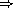
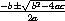

# 第二章 入门

本章是为那些对该语言不熟悉的程序员介绍 Scheme 的。如果你坐在一个交互式 Scheme 系统前，尝试着一边阅读示例一边实践，你会从本章中获得更多。

阅读完本章并完成练习后，你应该能够开始使用 Scheme。你将学会 Scheme 程序的语法以及它们是如何执行的，以及如何使用简单的数据结构和控制机制。

### 第 2.1 节 与 Scheme 交互

大多数 Scheme 系统提供了一个简化程序开发和实验的交互式编程环境。与 Scheme 的最简单交互遵循一个“读取-求值-打印”循环。一个程序（通常称为 *读取-求值-打印循环*，或 REPL）读取你在键盘上输入的每个表达式，对其进行求值，并打印其值。

使用交互式 Scheme 系统，你可以在键盘上输入一个表达式并立即看到其值。你可以定义一个过程并将其应用于参数以查看其工作原理。甚至可以键入一个由一组过程定义组成的整个程序，并在不离开系统的情况下进行测试。当你的程序变得更长时，将其键入到一个文件中（使用文本编辑器）并进行交互式加载和测试会更方便。在大多数 Scheme 系统中，可以使用非标准过程 `load` 加载文件，该过程接受一个字符串参数命名文件。将程序准备在文件中具有几个优点：你有机会更加仔细地组织你的程序，可以在不重新键入程序的情况下纠正错误，并且可以保留一份副本以供以后使用。大多数 Scheme 实现将从文件加载的表达式视为从键盘输入的表达式。

虽然 Scheme 提供了各种输入和输出过程，但 REPL 负责读取表达式并打印它们的值。这使你可以专注于编写程序，而不必担心其结果将如何显示。

本章和本书其余部分的示例遵循一种常规格式。首先给出你可能从键盘输入的表达式，可能跨越几行。表达式的值在  之后给出，可读为“求值为”。对于定义和表达式值未指定的情况，会省略 。

示例程序采用一种“看起来不错”并传达程序结构的样式进行格式化。代码易于阅读，因为每个表达式与其子表达式之间的关系清晰显示。然而，Scheme 忽略缩进和换行，因此无需遵循特定的样式。重要的是要建立一种样式并坚持下去。Scheme 将每个程序视为在一行上，其子表达式从左到右排序。

如果您可以访问交互式 Scheme 系统，现在启动它并在阅读时输入示例可能是个好主意。最简单的 Scheme 表达式之一是字符串常量。尝试在提示符下键入`"Hi Mom!"`（包括双引号）。系统应该以`"Hi Mom!"`作为响应；任何常量的值都是常量本身。

`"Hi Mom!"  "Hi Mom!"`

这里是一组表达式，每个表达式都有 Scheme 的响应。它们在本章的后面部分有解释，但现在可以用它们来练习与 Scheme 的交互。

`"hello"  "hello"

42  42

22/7  22/7

3.141592653  3.141592653

+  #<procedure>

(+ 76 31)  107

(* -12 10)  -120

'(a b c d)  (a b c d)`

要小心不要漏掉任何单引号（`'`），双引号或括号。如果您在最后一个表达式���漏掉了一个单引号，您可能会收到指示发生异常的消息。只需再试一次。如果您漏掉了一个闭括号或双引号，系统可能仍在等待它。

这里有一些更多的表达式供尝试。您可以尝试自己弄清楚它们的含义，或者等待在本章后面找出。

`(car '(a b c))  a

(cdr '(a b c))  (b c)

(cons 'a '(b c))  (a b c)

(cons (car '(a b c))

(cdr '(d e f)))  (a e f)`

如您所见，Scheme 表达式可能跨越多行。Scheme 系统通过匹配双引号和括号来确定何时具有完整表达式。

接下来，让我们尝试定义一个过程。

`(define square

(lambda (n)

(* n n)))`

过程`square`计算任何数字*n*的平方*n*²。我们稍后会详细介绍构成此定义的表达式。目前，可以说`define`建立变量绑定，`lambda`创建过程，`*`命名乘法过程。请注意这些表达式的形式。所有结构化形式都用括号括起来，并以*前缀表示法*编写，即运算符在参数之前。正如您所见，即使是简单的算术运算，如`*`，这也是正确的。

尝试使用`square`。

`(square 5)  25

(square -200)  40000

(square 0.5)  0.25

(square -1/2)  1/4`

即使下一个定义很简短，您可能会将其输入到文件中。假设您将文件命名为"reciprocal.ss"。

`(define reciprocal

(lambda (n)

(if (= n 0)

"oops!"

(/ 1 n))))`

此过程`reciprocal`计算任何数字*n* ≠ 0 的 1/*n*的数量。对于*n* = 0，`reciprocal`返回字符串`"oops!"`。返回到 Scheme 并尝试使用`load`加载您的文件。

`(load "reciprocal.ss")`

最后，尝试使用我们刚刚定义的过程。

`(reciprocal 10)  1/10`

`(reciprocal 1/10)  10`

`(reciprocal 0)  "oops!"`

`(reciprocal (reciprocal 1/10))  1/10`

在下一节中，我们将更详细地讨论 Scheme 表达式。在本章中，请记住，你的 Scheme 系统是学习 Scheme 最有用的工具之一。每当你尝试文本中的示例之一时，请跟上你自己的示例。在交互式 Scheme 系统中，尝试某事的成本相对较小---通常只是输入的时间。

### 第 2.2 节。简单表达式

最简单的 Scheme 表达式是常量数据对象，如字符串、数字、符号和列表。Scheme 支持其他对象类型，但这四种对于许多程序已经足够了。在前一节中，我们看到了一些字符串和数字的示例。

让我们稍微详细讨论一下数字。数字是常量数据对象。如果你输入一个数字，Scheme 会将其回显给你。以下示例显示了 Scheme 支持几种类型的数字。

`123456789987654321  123456789987654321`

`3/4  3/4`

`2.718281828  2.718281828`

`2.2+1.1i  2.2+1.1i`

Scheme 数字包括精确和非精确的整数、有理数、实数和复数。精确整数和有理数具有任意精度，即它们可以是任意大小。非精确数通常使用 IEEE 标准浮点表示内部表示。

Scheme 为相应的算术过程提供了`+`、`-`、`*`和`/`的名称。每个过程接受两个数值参数。下面的表达式称为*过程应用*，因为它们指定了将过程应用于一组参数。

`(+ 1/2 1/2)  1`

`(- 1.5 1/2)  1.0`

`(* 3 1/2)  3/2`

`(/ 1.5 3/4)  2.0`

Scheme 甚至对于常见的算术操作也采用前缀表示法。任何过程应用，无论过程接受零个、一个、两个还是更多参数，都写为`(*procedure* *arg* ...) `。这种规则简化了表达式的语法；无论操作是什么，都使用一种表示法，并且没有关于运算符的优先级或结合性的复杂规则。

过程应用可以嵌套，此时最内层的值首先计算。因此，我们可以嵌套上述算术过程的应用来评估更复杂的公式。

`(+ (+ 2 2) (+ 2 2))  8`

`(- 2 (* 4 1/3))  2/3`

`(* 2 (* 2 (* 2 (* 2 2))))  32`

`(/ (* 6/7 7/2) (- 4.5 1.5))  1.0`

这些示例展示了你需要将 Scheme 用作四则运算台式计算器的一切。虽然我们不会在本章讨论它们，但 Scheme 支持许多其他算术过程。现在可能是时候转到第 6.4 节，并尝试一些其他算术过程了。

简单的数字对象对于许多任务已经足够了，但有时需要包含两个或更多值的聚合数据结构。在许多语言中，基本的聚合数据结构是数组。在 Scheme 中，它是*列表*。列表被写成用括号括起来的对象序列。例如，`(1 2 3 4 5)`是一个数字列表，而`("this" "is" "a" "list")`是一个字符串列表。列表不必只包含一种类型的对象，因此`(4.2 "hi")`是一个包含数字和字符串的有效列表。列表可以嵌套（可以包含其他列表），因此`((1 2) (3 4))`是一个包含两个元素的有效列表，每个元素都是一个包含两个元素的列表。

你可能会注意到列表看起来就像过程应用程序，并想知道 Scheme 如何区分它们。也就是说，Scheme 如何区分对象列表 `(*obj[1]* *obj[2]* ...)` 和过程应用程序 `(*procedure* *arg* ...)`？

在某些情况下，区分可能看起来很明显。数字列表`(1 2 3 4 5)`几乎不可能与过程应用程序混淆，因为 1 是一个数字，不是一个过程。因此，答案可能是 Scheme 查看列表或过程应用程序的第一个元素，并根据该第一个元素是过程还是其他内容做出决定。但这个答案还不够好，因为我们甚至可能希望将一个有效的过程应用程序，如`(+ 3 4)`，视为列表。答案是我们必须明确告诉 Scheme 将列表视为数据而不是过程应用程序。我们用`quote`来做到这一点。

`(quote (1 2 3 4 5))  (1 2 3 4 5)

(quote ("this" "is" "a" "list"))  ("this" "is" "a" "list")

(quote (+ 3 4))  (+ 3 4)`

`quote`强制将列表视为数据。尝试在没有引号的情况下输入上述表达式；你可能会收到一个消息，指示前两个表达式发生了异常，第三个表达式得到了一个错误的答案（`7`）。

因为在 Scheme 代码中经常需要`quote`，Scheme 将在表达式前面加上单引号（`'`）识别为`quote`的缩写。

`'(1 2 3 4)  (1 2 3 4)

'((1 2) (3 4))  ((1 2) (3 4))

'(/ (* 2 -1) 3)  (/ (* 2 -1) 3)`

这两种形式都被称为`quote`表达式。当一个对象被包含在`quote`表达式中时，我们经常说该对象被*引用*。

`quote` 表达式*不是*过程应用，因为它阻止了其子表达式的评估。这是一个完全不同的语法形式。Scheme 支持除了过程应用和 `quote` 表达式之外的几种其他语法形式。每种语法形式的评估方式都不同。幸运的是，不同的语法形式数量很少。我们将在本章后面看到更多。

并非所有的 `quote` 表达式都涉及列表。尝试以下表达式，带有和不带有 `quote` 包装。

`(quote hello)  hello`

符号 `hello` 必须被引用，以防止 Scheme 将 `hello` 视为*变量*。在 Scheme 中，符号和变量类似于数学表达式和方程中的符号和变量。当我们评估数学表达式 1 - *x* 时，我们将 *x* 视为变量。另一方面，当我们考虑代数方程 *x*² - 1 = (*x* - 1)(*x* + 1) 时，我们将 *x* 视为符号（实际上，我们将整个方程符号化）。就像引用列表告诉 Scheme 将括号形式视为列表而不是过程应用一样，引用标识符告诉 Scheme 将标识符视为符号而不是变量。虽然符号通常用于代表方程或程序的符号表示中的变量，但符号也可以用作自然语言句子表示中的单词，例如。

你可能会想为什么应用程序和变量与列表和符号共享符号。共享符号使得 Scheme 程序可以被表示为 Scheme 数据，简化了在 Scheme 中编写解释器、编译器、编辑器和其他工具的过程。这一点在第 12.7 节中给出的 Scheme 解释器中有所体现，该解释器本身就是用 Scheme 编写的。许多人认为这是 Scheme 中最重要的特性之一。

数字和字符串也可以被引用。

`'2  2

'2/3  2/3

(quote "Hi Mom!")  "Hi Mom!"`

无论如何，数字和字符串在任何情况下都被视为常量，因此引用它们是不必要的。

现在让我们讨论一些用于操作列表的 Scheme 过程。有两个基本过程用于拆分列表：`car` 和 `cdr`（发音为 *could-er*）。`car` 返回列表的第一个元素，`cdr` 返回列表的其余部分。（名称 "car" 和 "cdr" 源自第一台实现 Lisp 语言的计算机 IBM 704 支持的操作。）每个过程都需要一个非空列表作为其参数。

`(car '(a b c))  a

(cdr '(a b c))  (b c)

(cdr '(a))  ()

(car (cdr '(a b c)))  b

(cdr (cdr '(a b c)))  (c)

(car '((a b) (c d)))  (a b)

(cdr '((a b) (c d)))  ((c d))`

列表的第一个元素通常称为列表的“car”，列表的其余部分通常称为列表的“cdr”。具有一个元素的列表的 cdr 是`()`，即*empty list*。

过程`cons`构建列表。它接受两个参数。第二个参数通常是一个列表，在这种情况下`cons`返回一个列表。

`(cons 'a '())  (a)

(cons 'a '(b c))  (a b c)

(cons 'a (cons 'b (cons 'c '())))  (a b c)

(cons '(a b) '(c d))  ((a b) c d)

(car (cons 'a '(b c)))  a

(cdr (cons 'a '(b c)))  (b c)

(cons (car '(a b c))

(cdr '(d e f)))  (a e f)

(cons (car '(a b c))

(cdr '(a b c)))  (a b c)`

正如“car”和“cdr”经常用作名词一样，“cons”经常用作动词。通过在列表开头添加元素来创建新列表被称为*consing*该元素到列表上。

注意`cons`第二个参数描述中的“通常”一词。实际上，过程`cons`构建*对*，一个对的 cdr 不一定是列表。列表是一系列对；每个对的 cdr 是序列中的下一个对。

*proper list*中最后一对的 cdr 是空列表。否则，一系列对形成一个*improper list*。更正式地说，空列表是 proper list，任何 cdr 是 proper list 的对也是 proper list。

improper list 以*dotted-pair notation*打印，列表的最后一个元素之前有一个句点或*dot*。

`(cons 'a 'b)  (a . b)

(cdr '(a . b))  b

(cons 'a '(b . c))  (a b . c)`

由于其打印表示法，cdr 不是列表的对通常被称为*dotted pair*。然而，即使 cdr 是列表的对也可以用 dotted-pair 表示法写出，尽管打印机总是选择不带点的方式写出 proper list。

`'(a . (b . (c . ())))  (a b c)`

过程`list`类似于`cons`，不同之处在于它接受任意数量的参数并始终构建 proper list。

`(list 'a 'b 'c)  (a b c)

(list 'a)  (a)

(list)  ()`

第 6.3 节提供了有关列表和 Scheme 程序操作列表的更多信息。现在可能是一个好时机转到该部分，并熟悉那里提供的其他程序。

#### 练习 2.2.1

将以下算术表达式转换为 Scheme 表达式并计算。

| *  a*. | 1.2 × (2 - 1/3) + -8.7 |
| --- | --- |
| *  b*. | (2/3 + 4/9) ÷ (5/11 - 4/3) |
| *  c*. | 1 + 1 ÷ (2 + 1 ÷ (1 + 1/2)) |
| *  d*. | 1 × -2 × 3 × -4 × 5 × -6 × 7 |

#### 练习 2.2.2

尝试使用过程`+`、`-`、`*`和`/`来确定当给定不同类型的数值参数时，Scheme 返回的值类型规则。

#### 练习 2.2.3

确定以下表达式的值。使用你的 Scheme 系统验证你的答案。

| *  a*. | `(cons 'car 'cdr)` |
| --- | --- |
| *  b*. | `(list 'this '(is silly))` |
| *  c*. | `(cons 'is '(this silly?))` |
| *  d*. | `(quote (+ 2 3))` |
| *  e*. | `(cons '+ '(2 3))` |
| *  f*. | `(car '(+ 2 3))` |
| *  g*. | `(cdr '(+ 2 3))` |
| *  h*. | `cons` |
| *  i*. | `(quote cons)` |
| *  j*. | `(quote (quote cons))` |
| *  k*. | `(car (quote (quote cons)))` |
| *  l*. | `(+ 2 3)` |
| *  m*. | `(+ '2 '3)` |
| *  n*. | `(+ (car '(2 3)) (car (cdr '(2 3))))` |
| *  o*. | `((car (list + - * /)) 2 3)` |

#### 练习 2.2.4

`(car (car '((a b) (c d))))` 得到 `a`。确定应用于 `((a b) (c d))` 的 `car` 和 `cdr` 的哪些组合得到 `b`、`c` 和 `d`。

#### 练习 2.2.5

写一个 Scheme 表达式，使其求值为以下内部列表结构。

#### 练习 2.2.6

绘制下面表达式产生的内部列表结构。

`(cons 1 (cons '(2 . ((3) . ())) (cons '(()) (cons 4 5))))`

#### 练习 2.2.7

`(car (car (car '((a b) (c d)))))` 的行为是未定义的，因为 `(car '((a b) (c d)))` 是 `(a b)`，`(car '(a b))` 是 `a`，而 `(car 'a)` 是未定义的。确定应用于 `((a b) (c d))` 的所有合法 `car` 和 `cdr` 的组合。

#### 练习 2.2.8

尝试解释 Scheme 表达式是如何求值的。你的解释是否涵盖了练习 2.2.3 中的最后一个例子？

### 第 2.3 节。求值 Scheme 表达式

让我们讨论一下 Scheme 如何评估你输入的表达式。我们已经建立了对于常量对象（如字符串和数字）的规则：对象本身就是值。你可能也已经在脑海中想出了一条规则，用于评估形式为 `(*procedure* *arg[1]* ... *arg[n]*)` 的过程应用。在这里，`*procedure*` 是表示 Scheme 过程的表���式，`*arg[1]* ... *arg[n]*` 是表示其参数的表达式。一种可能性是以下内容。

+   找到 `*procedure*` 的值。

+   找到 `*arg[1]*` 的值。

    

+   找到`*arg[n]*`的值。

+   将`*procedure*`的值应用于`*arg[1]* ... *arg[n]*`的值。

例如，考虑简单的过程应用 `(+ 3 4)`。`+` 的值是加法过程，3 的值是数字 3，4 的值是数字 4。将加法过程应用于 3 和 4 得到 7，因此我们的值是对象 7。

通过在每个级别应用这个过程，我们可以找到嵌套表达式 `(* (+ 3 4) 2)` 的值。`*` 的值是乘法过程，`(+ 3 4)` 我们可以确定为数字 7，2 的值是数字 2。将 7 乘以 2 得到 14，因此我们的答案是 14。

此规则适用于过程应用，但不适用于`quote`表达式，因为过程应用的子表达式被评估，而`quote`表达式的子表达式不被评估。`quote`表达式的评估更类似于常量对象的评估。形式为`(quote *object*)`的`quote`表达式的值简单地是`*object*`。

常量对象、过程应用和`quote`表达式只是 Scheme 提供的许多语法形式中的三种。幸运的是，只有少数其他语法形式需要 Scheme 程序员直接理解；这些被称为*核心*语法形式。其余的语法形式是*语法扩展*，最终以核心语法形式的术语定义。我们将在本章的剩余部分讨论其余的核心语法形式和一些语法扩展。第 3.1 节总结了核心语法形式并介绍了语法扩展机制。

在我们继续讨论更多的语法形式和过程之前，有两个与过程应用的评估相关的要点值得注意。首先，上述给出的过程是过度规定的，因为它要求从左到右评估子表达式。也就是说，`*procedure*`在`*arg[1]*`之前被评估，在`*arg[1]*`之前`*arg[2]*`被评估，依此类推。这不一定是必要的。Scheme 评估器可以自由地以任何顺序评估表达式---从左到右、从右到左或任何其他顺序。实际上，即使在同一个实现中，不同的应用可能以不同的顺序评估子表达式。

第二个要点是`*procedure*`的评估方式与`*arg[1]* ... *arg[n]*`相同。虽然`*procedure*`通常是一个命名特定过程的变量，但这不一定是情况。练习 2.2.3 让你确定表达式的值`((car (list + - * /)) 2 3)`。在这里，`*procedure*`是`(car (list + - * /))`。`(car (list + - * /))`的值是加法过程，就像`*procedure*`只是变量`+`一样。

#### 练习 2.3.1

写下评估下面表达式所需的步骤。

`((car (cdr (list + - * /))) 17 5)`

### 第 2.4 节 变量和 Let 表达式

假设`*expr*`是一个包含变量`*var*`的 Scheme 表达式。另外假设，当我们评估`*expr*`时，我们希望`*var*`具有值`*val*`。例如，当我们评估`(+ x 3)`时，我们可能希望`x`的值为 2。或者，当我们评估`(+ 2 y)`时，我们可能想要`y`的值为 3。以下示例演示了如何使用 Scheme 的`let`语法形式来实现这一点。

`(let ((x 2))

(+ x 3))  5

(let ((y 3))

(+ 2 y))  5

(let ((x 2) (y 3))

(+ x y))  5`

`let`语法形式包括一个变量-表达式对的列表，以及一系列被称为`let`主体的表达式。`let`表达式的一般形式是

`(let ((*var* *expr*) ...) *body[1]* *body[2]* ...)`

我们说变量被`let`绑定到值。我们将被`let`绑定的变量称为`let`-*bound*变量。

`let`表达式经常用于简化一个包含两个相同子表达式的表达式。这样做还确保了公共子表达式的值只计算一次。

`(+ (* 4 4) (* 4 4))  32

(let ((a (* 4 4))) (+ a a))  32`

方括号经常用于代替括号来界定`let`表达式的绑定。

`(let ([list1 '(a b c)] [list2 '(d e f)])

(cons (cons (car list1)

(car list2))

(cons (car (cdr list1))

(car (cdr list2)))))  ((a . d) b . e)`

Scheme 将方括号括起来的形式视为与括号括起来的形式相同。开放的方括号必须与闭合的方括号匹配，开放的括号必须与闭合的括号匹配。我们使用方括号来表示`let`（以及，正如我们将看到的，几个其他标准的语法形式）以提高可读性，特别是当我们可能会有两个或更多连续的开放括号时。

由于过程应用中的第一个位置的表达式与其他表达式没有区别，因此`let`绑定的变量也可以在那里使用。

`(let ([f +])

(f 2 3))  5

(let ([f +] [x 2])

(f x 3))  5

(let ([f +] [x 2] [y 3])

(f x y))  5`

被`let`绑定的变量只在`let`的主体中可见。

`(let (+ *）

(+ 2 3))  5`

这是幸运的，因为我们不希望`+`的值在任何地方都是乘法过程。

可以嵌套`let`表达式。

`(let ([a 4] [b -3])

(let ([a-squared (* a a)]

[b-squared (* b b)])

(+ a-squared b-squared)))  25`

当嵌套的`let`表达式绑定相同的变量时，只有内部`let`创建的绑定在其主体中可见。

`(let ([x 1])

(let ([x (+ x 1)])

(+ x x)))  4`

外部的`let`表达式在其主体中将`x`绑定为 1，这是第二个`let`表达式。内部的`let`表达式在其主体中将`x`绑定为`(+ x 1)`，这是表达式`(+ x x)`。`(+ x 1)`的值是多少？由于`(+ x 1)`出现在外部`let`的主体中，但没有出现在内部`let`的主体中，因此`x`的值必须是 1，因此`(+ x 1)`的值是 2。那么`(+ x x)`呢？它出现在两个`let`表达式的主体中。只有内部的`x`绑定是可见的，所以`x`是 2，`(+ x x)`是 4。

内部对`x`的绑定被称为*遮蔽*外部的绑定。`let`绑定的变量在其`let`表达式的主体中到处可见，除了被遮蔽的地方。变量绑定可见的区域称为其*作用域*。上面示例中第一个`x`的作用域是外部`let`表达式的主体减去内部`let`表达式的主体，在那里被第二个`x`遮蔽。这种作用域形式称为*词法作用域*，因为每个绑定的作用域可以通过对程序进行简单的文本分析来确定。

遮蔽可以通过为变量选择不同的名称来避免。上面的表达式可以重写，使内部`let`绑定的变量为`new-x`。

`(let ([x 1])

(let ([new-x (+ x 1)])

(+ new-x new-x)))  4`

尽管选择不同的名称有时可以防止混淆，但遮蔽可以帮助防止意外使用“旧”值。例如，在前面示例的原始版本中，我们无法在内部`let`的主体中错误地引用外部的`x`。

#### 练习 2.4.1

重写以下表达式，使用`let`去除公共子表达式并改善代码结构。不要进行任何代数简化。

| *  a*. | `(+ (- (* 3 a) b) (+ (* 3 a) b))` |
| --- | --- |
| *  b*. | `(cons (car (list a b c)) (cdr (list a b c)))` |

#### 练习 2.4.2

确定以下表达式的值。解释您是如何得出这个值的。 

`(let ([x 9])

(* x

(let ([x (/ x 3)])

(+ x x))))`

#### 练习 2.4.3

重写以下表达式，为每个不同的`let`绑定的变量提供唯一的名称，以便没有任何变量被遮蔽。验证您的表达式的值与原始表达式的值相同。

| *  a*. | `(let ([x 'a] [y 'b])   (list (let ([x 'c]) (cons x y))

(let ([y 'd]) (cons x y))))` |

| *  b*. | `(let ([x '((a b) c)])   (cons (let ([x (cdr x)])

(car x))

(let ([x (car x)])

(cons (let ([x (cdr x)])

(car x))

(cons (let ([x (car x)])

x)

(cdr x))))))` |

### 第 2.5 节。Lambda 表达式

在表达式`(let ([x (* 3 4)]) (+ x x))`中，变量`x`绑定到`(* 3 4)`的值。如果我们想要`x`绑定到`(/ 99 11)`的值时`(+ x x)`的值是多少？当`x`绑定到`(- 2 7)`的值时呢？在每种情况下，我们都需要一个不同的`let`表达式。然而，当`let`的主体复杂时，不得不重复它可能会不方便。

相反，我们可以使用语法形式`lambda`来创建一个新的过程，该过程以`x`为参数，并具有与`let`表达式相同的主体。

`(lambda (x) (+ x x))  #<procedure>`

`lambda`表达式的一般形式是

`(lambda (*var* ...) *body[1]* *body[2]* ...)`

变量`*var* ...`是过程的*形式参数*，表达式序列`*body[1]* *body[2]* ...`是其主体。（实际上，真正的一般形式比这略微更一般，稍后你会看到。）

过程与数字、字符串、符号或对一样都是对象。然而，就 Scheme 而言，它没有任何有意义的打印表示，因此本书使用符号`#<procedure>`来显示表达式的值是一个过程。

对过程执行的最常见操作是将其应用于一个或多个值。

`((lambda (x) (+ x x)) (* 3 4))  24`

这与任何其他过程应用没有区别。过程是`(lambda (x) (+ x x))`的值，唯一的参数是`(* 3 4)`的值，即 12。参数值或*实际参数*与`lambda`表达式的主体内的形式参数绑定方式与`let`绑定的变量与其值的绑定方式相同。在这种情况下，`x`绑定到 12，`(+ x x)`的值为 24。因此，将该过程应用于值 12 的结果为 24。

因为过程是对象，我们可以将过程建立为变量的值，并多次使用该过程。

`(let ([double (lambda (x) (+ x x))])`

(list (double (* 3 4))

(double (/ 99 11))

(double (- 2 7))))  (24 18 -10)`

在这里，我们为`double`建立一个过程的绑定，然后使用该过程来将三个不同的值加倍。

过程期望其实际参数为数字，因为它将实际参数传递给`+`。一般来说，实际参数可以是任何类型的对象。例如，考虑一个类似的过程，它使用`cons`而不是`+`。

`(let ([double-cons (lambda (x) (cons x x))])`

(double-cons 'a))  (a . a)`

注意`double`和`double-cons`之间的相似性，你可能不会感到惊讶地发现它们可以通过添加额外的参数合并为单个过程。

`(let ([double-any (lambda (f x) (f x x))])`

(list (double-any + 13)

(double-any cons 'a)))  (26 (a . a))`

这表明过程可以接受多个参数，并且传递给过程的参数本身可以是过程。

与`let`表达式一样，当`lambda`表达式嵌套在其他`lambda`或`let`表达式中时，它们变得更加有趣。

`(let ([x 'a])`

(let ([f (lambda (y) (list x y))])`

(f 'b)))  (a b)`

`lambda`表达式中的`x`出现在外部`let`表达式绑定的`lambda`外部的`x`中。变量`x`被称为`lambda`表达式中的自由出现，或者是`lambda`表达式的自由变量。变量`y`在`lambda`表达式中不是自由出现，因为它被`lambda`表达式绑定。在`lambda`表达式中自由出现的变量应该被绑定，例如，通过封闭的`lambda`或`let`表达式，除非变量（如原始过程的名称）在表达式外部绑定，正如我们在下一节中讨论的那样。

当过程应用在超出过程内自由发生的变量绑定范围的地方时，会发生什么，就像下面的表达式一样？

`(let ([f (let ([x 'sam])`

(lambda (y z) (list x y z)))])

(f 'i 'am))  (sam i am)`

当过程被应用时，创建过程时有效的相同绑定再次生效。即使在应用过程的地方可见另一个`x`的绑定，这也是正确的。

`(let ([f (let ([x 'sam])`

(lambda (y z) (list x y z)))])

(let ([x 'not-sam])

(f 'i 'am)))  (sam i am)`

在两种情况下，过程`f`中的`x`的值为`sam`。

顺便说一句，`let`表达式只不过是将`lambda`表达式直接应用于一组参数表达式。例如，下面的两个表达式是等价的。

`(let ([x 'a]) (cons x x))` ≡ `((lambda (x) (cons x x)) 'a)`

实际上，`let`表达式是一个以`lambda`和过程应用为基础定义的语法扩展，在一般情况下，任何形式为

`(let ((*var* *expr*) ...) *body[1]* *body[2]* ...)`

等同于以下内容。

`((lambda (*var* ...) *body[1]* *body[2]* ...)`

*expr* ...)`

更多关于核心形式和语法扩展的信息，请参见第 3.1 节。

如上所述，`lambda`的一般形式比我们之前看到的形式稍微复杂一些，因为形式参数规范`(*var* ...)`不一定是一个正确的列表，甚至根本不是一个列表。形式参数规范可以是以下三种形式之一：

+   一个正确的变量列表，`(*var[1]* ... *var[n]*)`，就像我们已经看到的那样，

+   一个单一变量，`*var[r]*`，或

+   一个不正确的变量列表，`(*var[1]* ... *var[n]* . *var[r]*)`。

在第一种情况下，必须提供精确的*n*个实际参数，并且每个变量都绑定到相应的实际参数。在第二种情况下，任何数量的实际参数都是有效的；所有实际参数都被放入单个列表中，单个变量被绑定到此列表。第三种情况是前两种情况的混合。至少必须提供*n*个实际参数。变量`*var[1]* ... *var[n]*`被绑定到相应的实际参数，变量`*var[r]*`被绑定到包含剩余实际参数的列表。在第二种和第三种情况下，`*var[r]*`有时被称为“剩余”参数，因为它保存除了那些单独命名的参数之外的其余实际参数。

让我们考虑一些例子，以帮助澄清`lambda`表达式的更一般语法。

`(let ([f (lambda x x)])

(f 1 2 3 4))  (1 2 3 4)

(let ([f (lambda x x)])

(f))  ()

(let ([g (lambda (x . y) (list x y))])

(g 1 2 3 4))  (1 (2 3 4))

(let ([h (lambda (x y . z) (list x y z))])

(h 'a 'b 'c 'd))  (a b (c d))`

在前两个示例中，名为`f`的过程接受任意数量的参数。这些参数自动形成一个列表，变量`x`绑定到这个列表；`f`的值是这个列表。在第一个示例中，参数是 1、2、3 和 4，因此答案是`(1 2 3 4)`。在第二个示例中，没有参数，因此答案是空列表`()`。第三个示例中，名为`g`的过程的值是一个列表，其第一个元素是第一个参数，其第二个元素是包含其余参数的列表。名为`h`的过程类似，但分离出第二个参数。虽然`f`接受任意数量的参数，但`g`必须至少接收一个，而`h`必须至少接收两个。

#### 练习 2.5.1

确定下面表达式的值。

| *  a*. | `(let ([f (lambda (x) x)])   (f 'a))` |
| --- | --- |
| *  b*. | `(let ([f (lambda x x)])   (f 'a))` |
| *  c*. | `(let ([f (lambda (x . y) x)])   (f 'a))` |
| *  d*. | `(let ([f (lambda (x . y) y)])   (f 'a))` |

#### 练习 2.5.2

原始过程`list`如何定义？

#### 练习 2.5.3

列出每个下面的`lambda`表达式中出现的自由变量。不要漏掉命名为`+`或`cons`等原始过程的变量。

| *  a*. | `(lambda (f x) (f x))` |
| --- | --- |
| *  b*. | `(lambda (x) (+ x x))` |
| *  c*. | `(lambda (x y) (f x y))` |
| *  d*. | `(lambda (x)   (cons x (f x y)))` |

| *  e*. | `(lambda (x)   (let ([z (cons x y)])

(x y z)))` |

| *  f*. | `(lambda (x)   (let ([y (cons x y)])

(x y z)))` |

### 第 2.6 节。顶级定义

由`let`和`lambda`表达式绑定的变量在这些表达式的主体之外是不可见的。假设您已经创建了一个对象，也许是一个过程，必须在任何地方都可以访问，就像`+`或`cons`一样。您需要的是一个*顶层定义*，可以用`define`来建立。大多数交互式 Scheme 系统支持顶层定义，在您输入的每个表达式中都可见，除非被另一个绑定遮蔽。

让我们为上一节的`double-any`过程建立一个顶层定义。

`(define double-any

(lambda (f x)

(f x x)))`

变量`double-any`现在具有与`cons`或任何其他原始过程名称相同的状态。我们可以像使用原始过程一样使用`double-any`。

`(double-any + 10)  20

(double-any cons 'a)  (a . a)`

可以为任何对象建立顶层定义，而不仅仅是过程。

`(define sandwich "peanut-butter-and-jelly")

sandwich  "peanut-butter-and-jelly"`

大多数情况下，顶层定义用于过程。

如上所述，顶层定义可能会被`let`或`lambda`绑定遮蔽。

`(define xyz '(x y z))

(let ([xyz '(z y x)])

xyz)  (z y x)`

具有顶层定义的变量几乎就像被`let`表达式绑定的变量一样，包围您键入的所有表达式。

仅凭您到目前为止所读的简单工具，就已经可以定义 Scheme 提供的一些原始过程，并在本书后面描述。如果您完成了上一节的练习，您应该已经知道如何定义`list`。

`(define list (lambda x x))`

此外，Scheme 提供了`cadr`和`cddr`的缩写，用于`car`与`cdr`的组合和`cdr`与`cdr`的组合。也就是说，`(cadr *list*)`等同于`(car (cdr *list*))`，类似地，`(cddr *list*)`等同于`(cdr (cdr *list*))`。它们可以很容易地定义如下。

`(define cadr

(lambda (x)

(car (cdr x))))

(define cddr

(lambda (x)

(cdr (cdr x))))`

`(cadr '(a b c))  b

(cddr '(a b c))  (c)`

任何定义`(define *var* *expr*)`，其中`*expr*`是一个`lambda`表达式，都可以用更短的形式来写，省略`lambda`。确切的语法取决于`lambda`表达式的形式参数规范的格式，即它是一个变量的适当列表，一个单一变量，还是一个不适当的变量列表。形式如下

`(define *var[0]*

(lambda (*var[1]* ... *var[n]*)

*e[1]* *e[2]* ...))`

可以缩写

`(define (*var[0]* *var[1]* ... *var[n]*)

*e[1]* *e[2]* ...)`

当

`(define *var[0]*

(lambda *var[r]*

*e[1]* *e[2]* ...))`

可以缩写

`(define (*var[0]* . *var[r]*)

*e[1]* *e[2]* ...)`

和

`(define *var[0]*

(lambda (*var[1]* ... *var[n]* . *var[r]*)

*e[1]* *e[2]* ...))`

可以缩写

`(define (*var[0]* *var[1]* ... *var[n]* . *var[r]*)

*e[1]* *e[2]* ...)`

例如，`cadr`和`list`的定义可能如下所示。

`(define (cadr x)

(car (cdr x)))

(define (list . x) x)`

本书并不经常使用这种替代语法。虽然它更短，但它倾向于掩盖一个事实，即过程与变量或名称并不像许多其他语言中那样紧密联系。这种语法通常被有些贬义地称为`defun`语法，指的是 Lisp 语言提供的`define`后的`defun`形式，其中过程与它们的名称更紧密地联系在一起。

顶层定义使我们更容易通过交互式方式尝试一个过程，因为每次使用时无需重新键入该过程。让我们尝试定义一个稍微复杂一点的`double-any`变体，将一个“普通”的两参数过程转换为一个“加倍”的一参数过程。

`(define doubler

(lambda (f)

(lambda (x) (f x x))))`

`doubler`接受一个参数`f`，必须是一个接受两个参数的过程。`doubler`返回的过程接受一个参数，它将该参数用于`f`的应用的两个参数。我们可以使用`doubler`定义上一节中的简单`double`和`double-cons`过程。

`(define double (doubler +))

(double 13/2)  13

(define double-cons (doubler cons))

(double-cons 'a)  (a . a)`

我们也可以使用`doubler`定义`double-any`。

`(define double-any

(lambda (f x)

((doubler f) x)))`

在`double`和`double-cons`中，`f`具有适当的值，即`+`或`cons`，即使这些过程明显是在`f`的作用域之外应用的。

当你尝试使用一个未被`let`或`lambda`表达式绑定的变量，并且没有顶层定义时会发生什么？尝试使用变量`i-am-not-defined`看看会发生什么。

`(i-am-not-defined 3)`

大多数 Scheme 系统会打印一条消息，指示发生了未绑定或未定义变量的异常。

然而，系统不应该在`lambda`表达式中出现未定义变量时发出投诉，直到结果过程被应用为止。即使我们尚未建立`proc2`的顶层定义，以下内容也*不*应该引发异常。

`(define proc1

(lambda (x y)

(proc2 y x)))`

如果在定义`proc2`之前尝试应用`proc1`，应该会收到一个未定义异常消息。让我们给`proc2`一个顶层定义并尝试`proc1`。

`(define proc2 cons)

(proc1 'a 'b)  (b . a)`

当您定义`proc1`时，系统接受您承诺定义`proc2`，并且除非在定义`proc2`之前使用`proc1`，否则不会抱怨。这使您可以以任何顺序定义过程。当两个在顶层定义的过程相互依赖时，这是必要的；稍后我们将看到一些示例。

#### 练习 2.6.1

如果您键入什么会发生

`(double-any double-any double-any)`

鉴于本节开头`double-any`的定义，您会得到什么结果？

#### 练习 2.6.2

定义`cadr`和`cddr`的更优雅（尽管可能效率较低）的方法是定义一个组合两个过程以创建第三个过程的过程。编写`compose`过程，使得`(compose *p[1]* *p[2]*)`是`*p[1]*`和`*p[2]*`的组合（假设两者都接受一个参数）。也就是说，`(compose *p[1]* *p[2]*)`应返回一个应用`*p[1]*`到应用`*p[2]*`到参数的结果的新过程。使用`compose`来定义`cadr`和`cddr`。

#### 练习 2.6.3

Scheme 还提供了`caar`、`cdar`、`caaar`、`caadr`等，其中`c`和`r`之间的最多四个`a`（代表`car`）和`d`（代表`cdr`）的任意组合（参见第 6.3 节）。使用前面练习中的`compose`过程定义每个。

### 第 2.7 节 条件表达式

到目前为止，我们考虑了无条件执行给定任务的表达式。假设我们希望编写过程`abs`。如果它的参数*x*为负数，`abs`返回-*x*；否则，返回*x*。编写`abs`最直接的方法是确定参数是否为负数，如果是，则使用`if`语法形式对其取反。

`(define abs

(lambda (n)

(if (< n 0)

(- 0 n)

n)))

(abs 77)  77

(abs -77)  77`

一个`if`表达式的形式为`(if *test* *consequent* *alternative*)`，其中`*consequent*`是在`*test*`为真时要评估的表达式，`*alternative*`是在`*test*`为假时要评估的表达式。在上面的表达式中，`*test*`是`(< n 0)`，`*consequent*`是`(- 0 n)`，`*alternative*`是`n`。

过程`abs`可以以多种其他方式编写。以下任何一种都是`abs`的有效定义。

`(define abs

(lambda (n)

(if (>= n 0)

n

(- 0 n))))

(define abs

(lambda (n)

(if (not (< n 0))

n

(- 0 n))))

(define abs

(lambda (n)

(if (or (> n 0) (= n 0))

n

(- 0 n))))

(define abs

(lambda (n)

(if (= n 0)

0

(if (< n 0)

(- 0 n)

n))))

(define abs

(lambda (n)

((if (>= n 0) + -)

0

n)))`

这些定义中的第一个询问`n`是否大于或等于零，翻转了测试。第二个询问`n`是否不小于零，使用了带有`<`的`not`过程。第三个询问`n`是否大于零或`n`是否等于零，使用了语法形式`or`。第四个将零单独处理，尽管这样做没有好处。第五个有点棘手；`n`要么加到零上，要么从零中减去，这取决于`n`是否大于或等于零。

为什么`if`是一个语法形式而不是一个过程？为了回答这个问题，让我们重新访问本章第一节中`reciprocal`的定义。

`(define reciprocal

(lambda (n)

(if (= n 0)

"哎呀！"

(/ 1 n))))`

除数过程的第二个参数不应为零，因为在数学上结果是未定义的。我们的`reciprocal`定义通过在除法之前测试零来避免这个问题。如果`if`是一个过程，它的参数（包括`(/ 1 n)`）将在它选择后件和替代项之前被评估。就像`quote`不评估它的唯一子表达式一样，`if`不评估它的所有子表达式，因此不能是一个过程。

语法形式`or`的操作方式类似于`if`。`or`表达式的一般形式是`(or *expr* ...)`。如果没有子表达式，即表达式只是`(or)`，则值为假。否则，每个`*expr*`依次被评估，直到（a）其中一个表达式评估为真或（b）没有更多表达式。在情况（a）中，值为真；在情况（b）中，值为假。

更准确地说，在情况（a）中，`or`表达式的值是最后一个被评估的子表达式的值。这一澄清是必要的，因为有许多可能的真值。通常，测试表达式的值是两个对象之一，`#t`表示真，`#f`表示假。

`(< -1 0)  #t

(> -1 0)  #f`

然而，每个 Scheme 对象在条件表达式和`not`过程中被视为真或假。只有`#f`被视为假；所有其他对象被视为真。

`(if #t 'true 'false)  true

(if #f 'true 'false)  false

(if '() 'true 'false)  true

(if 1 'true 'false)  true

(if '(a b c) 'true 'false)  true

(not #t)  #f

(not "false")  #f

(not #f)  #t

(or)  #f

(or #f)  #f

(或 #f #t)  #t

(or #f 'a #f)  a`

`and` 语法形式在形式上类似于 `or`，但是 `and` 表达式在其所有子表达式都为真时为真，否则为假。在没有子表达式的情况下，即表达式只是`(and)`时，值为真。否则，逐个评估子表达式，直到没有更多子表达式或子表达式的值为假。`and` 表达式的值是最后一个评估的子表达式的值。

使用 `and`，我们可以定义一个稍微不同版本的 `reciprocal`。

`(define reciprocal

(lambda (n)

(and (not (= n 0))

(/ 1 n))))

(reciprocal 3)  1/3

(reciprocal 0.5)  2.0

(reciprocal 0)  #f`

在这个版本中，如果`n`为零，则值为`#f`，否则为`1/n`。

过程`=`, `<`, `>`, `<=`, 和 `>=` 被称为*谓词*。谓词是一个关于其参数的特定问题的过程，并返回`#t`或`#f`中的一个值。大多数谓词的名称以问号（`?`）结尾；上面列出的常见数值过程是这一规则的例外。当然，并非所有谓词都需要数值参数。谓词`null?`返回真，如果其参数是空列表`()`，否则返回假。

`(null? '())  #t

(null? 'abc)  #f

(null? '(x y z))  #f

(null? (cdddr '(x y z)))  #t`

过程 `cdr` 不能接受除了一对之外的任何东西，当发生这种情况时会引发异常。然而，Common Lisp 将 `(cdr '())` 定义为 `()`。下面的过程 `lisp-cdr` 使用 `null?` 定义，如果其参数是 `()`，则返回 `()`。

`(define lisp-cdr

(lambda (x)

(if (null? x)

'()

(cdr x))))

(lisp-cdr '(a b c))  (b c)

(lisp-cdr '(c))  ()

(lisp-cdr '())  ()`

另一个有用的谓词是 `eqv?`，它需要两个参数。如果两个参数是等价的，`eqv?` 返回真。否则，`eqv?` 返回假。

`(eqv? 'a 'a)  #t

(eqv? 'a 'b)  #f

(eqv? #f #f)  #t

(eqv? #t #t)  #t

(eqv? #f #t)  #f

(eqv? 3 3)  #t

(eqv? 3 2)  #f

(let ([x "Hi Mom!"])

(eqv? x x))  #t

(let ([x (cons 'a 'b)])

(eqv? x x))  #t

(eqv? (cons 'a 'b) (cons 'a 'b))  #f`

如您所见，如果参数是相同的符号、布尔值、数字、对或字符串，`eqv?` 返回真。如果两个对是由不同的 `cons` 调用创建的，则它们不会被 `eqv?` 视为���同，即使它们具有相同的内容。`eqv?` 的详细等价规则在第 6.2 节中给出。

Scheme 还提供了一组*类型谓词*，根据对象的类型返回真或假，例如，`pair?`，`symbol?`，`number?`和`string?`。例如，谓词`pair?`仅在其参数为对时返回真。

`(pair? '(a . c))  #t

(pair? '(a b c))  #t

(pair? '())  #f

(pair? 'abc)  #f

(pair? "Hi Mom!")  #f

(pair? 1234567890)  #f`

类型谓词对于决定传递给过程的参数是否为适当类型很有用。例如，下面的`reciprocal`版本首先检查其参数是否为数字，然后再测试是否为零或执行除法。

`(define reciprocal

(lambda (n)

(if (and (number? n) (not (= n 0)))

(/ 1 n)

"oops!")))

(reciprocal 2/3)  3/2

(reciprocal 'a)  "oops!"`

顺便说一句，使用`reciprocal`的代码必须检查返回值是否为数字而不是字符串。为了减轻调用者的责任，通常最好报告错误，使用`assertion-violation`，如下所示。

`(define reciprocal

(lambda (n)

(if (and (number? n) (not (= n 0)))

(/ 1 n)

(assertion-violation 'reciprocal

"improper argument"

n))))

(reciprocal .25)  4.0

(reciprocal 0)  *exception in reciprocal: improper argument 0*

(reciprocal 'a)  *exception in reciprocal: improper argument a*`

`assertion-violation`的第一个参数是标识消息来源的符号，第二个参数是描述错误的字符串，第三个及后续参数是要包含在错误消息中的"irritants"。

让我们再看一个条件表达式`cond`，通常在`if`的位置使用很有用。`cond`类似于`if`，不同之处在于它允许多个测试和替代表达式。考虑下面的`sign`定义，它对负输入返回`-1`，对正输入返回`+1`，对零返回`0`。

`(define sign

(lambda (n)

(if (< n 0)

-1

(if (> n 0)

+1

0))))`

`(sign -88.3)  -1

(sign 0)  0

(sign 333333333333)  1

(* (sign -88.3) (abs -88.3))  -88.3`

两个`if`表达式可以被单个`cond`表达式替换，如下所示。

`(define sign

(lambda (n)

(cond

[(< n 0) -1]

[(> n 0) +1]

[else 0])))`

`cond`表达式通常采用以下形式

`(cond (*test* *expr*) ... (else *expr*))`

尽管`else`子句可以省略。只有在所有测试都不可能失败时才应这样做，就像下面的`sign`新版本一样。

`(define sign

(lambda (n)

(cond

[(< n 0) -1]

[(> n 0) +1]

[(= n 0) 0])))`

这些对`sign`的定义不依赖于测试执行的顺序，因为对于任何`n`的值，只有一个测试可以为真。下面的过程计算在具有 10,000、20,000 和 30,000 美元分界点的渐进税制下的给定收入的税金。

`(define income-tax

(lambda (income)

(cond

[(<= income 10000) (* income .05)]

[(<= income 20000) (+ (* (- income 10000) .08) 500.00)]

[(<= income 30000) (+ (* (- income 20000) .13) 1300.00)]

[else (+ (* (- income 30000) .21) 2600.00)])))`

`(income-tax 5000)  250.0

(income-tax 15000)  900.0

(income-tax 25000)  1950.0

(income-tax 50000)  6800.0`

在这个例子中，测试执行的顺序，从左到右（从上到下），是重要的。

#### 练习 2.7.1

定义谓词`atom?`，如果其参数不是一对则返回 true，否则返回 false。

#### 练习 2.7.2

过程`length`返回其参数的长度，该参数必须是一个列表。例如，`(length '(a b c))`是 3。使用`length`，定义过程`shorter`，它返回两个列表参数中较短的一个。如果它们的长度相同，则返回第一个列表。

`(shorter '(a b) '(c d e))  (a b)

(shorter '(a b) '(c d))  (a b)

(shorter '(a b) '(c))  (c)`

### 第 2.8 节。简单的递归

我们已经看到如何通过`if`、`and`、`or`和`cond`来控制表达式是否被求值。我们还可以通过创建包含表达式的过程并多次调用该过程来多次执行一个表达式。如果我们需要重复执行一些表达式，例如对列表的所有元素或从一到十的所有数字怎么办？我们可以通过递归来实现。递归是一个简单的概念：在过程内部应用该过程。起初掌握递归可能有些棘手，但一旦掌握，它提供的表现力远远超出了普通的循环结构。

*递归过程*是一个应用自身的过程。也许最简单的递归过程是以下过程，我们将其称为`goodbye`。

`(define goodbye

(lambda ()

(goodbye)))

(goodbye) `

这个过程不需要任何参数，只是立即应用它自己。在后没有值，因为`goodbye`永远不会返回。

很明显，要使递归过程实用，我们必须有一种方法来终止递归。大多数递归过程应该至少有两个基本要素，一个*基本情形*和一个*递归步骤*。基本情形终止递归，为某个基本参数给出过程的值。递归步骤给出了基于将过程应用于不同参数的值。为了使递归终止，不同的参数必须在某种方式上更接近基本参数。

让我们考虑递归地找到 proper list 的长度的问题。我们需要一个基本情况和一个递归步骤。关于列表递归的逻辑基本参数几乎总是空列表。空列表的长度为零，因此基本情况应该为空列表给出值零。为了更接近空列表，自然的递归步骤涉及参数的 cdr。非空列表比其 cdr 多一个元素，因此递归步骤给出的值比列表的 cdr 的长度多一个。

`(define length

(lambda (ls)

(if (null? ls)

0

(+ (length (cdr ls)) 1))))`

`(length '())  0

(length '(a))  1

(length '(a b))  2`

`if`表达式询问列表是否为空。如果是，值为零。这是基本情况。如果不是，值为列表的 cdr 的长度加一。这是递归步骤。

许多 Scheme 实现允许您跟踪过程的执行，以查看其操作方式。例如，在 Chez Scheme 中，跟踪过程的一种方法是键入`(trace *name*)`，其中`*name*`是您在顶层定义的过程的名称。如果您跟踪上面定义的`length`并将其传递给参数`'(a b c d)`，您应该看到类似以下内容：

`|(length (a b c d))

| (length (b c d))

| |(length (c d))

| | (length (d))

| | |(length ())

| | |0

| | 1

| |2

| 3

|4`

缩进显示了递归的嵌套级别；竖线将应用与其值在视觉上关联起来。请注意，在每次`length`的应用中，列表都会变小，直到最终达到`()`。`()`处的值为 0，每个外层级别都会加 1 以到达最终值。

让我们编写一个过程`list-copy`，它返回其参数的副本，该参数必须是一个列表。也就是说，`list-copy`返回一个由旧列表的元素（但不是对）组成的新列表。如果原始列表或副本可能通过`set-car!`或`set-cdr!`进行更改，那么制作副本可能很有用，我们稍后会讨论这一点。

`(list-copy '())  ()

(list-copy '(a b c))  (a b c)`

在研究下面的定义之前，看看你能否定义`list-copy`。

`(define list-copy

(lambda (ls)

(if (null? ls)

'()

(cons (car ls)

(list-copy (cdr ls))))))`

`list-copy`的定义与`length`的定义类似。基本情况中的测试相同，为`(null? ls)`。基本情况中的值为`()`，而不是 0，因为我们正在构建一个列表，而不是一个数字。递归调用相同，但是`list-copy`不是加一，而是将列表的 car 连接到递归调用的值上。

没有理由不能有多个基本情况。`memv`过程接受两个参数，一个对象和一个列表。它返回第一个子列表，或者*尾部*，其 car 等于对象，如果在列表中找不到对象，则返回`#f`。`memv`的值可以用作列表或条件表达式中的真值。

`(define memv

(lambda (x ls)

(cond

[(null? ls) #f]

[(eqv? (car ls) x) ls]

[else (memv x (cdr ls))])))`

`(memv 'a '(a b b d))  (a b b d)

(memv 'b '(a b b d))  (b b d)

(memv 'c '(a b b d))  #f

(memv 'd '(a b b d))  (d)

(if (memv 'b '(a b b d))

"yes"

"no")  "yes"`

这里有两个条件要检查，因此使用了`cond`。第一个 cond 子句检查`()`的基本值；没有对象是`()`的成员，所以答案是`#f`。第二个子句询问列表的 car 是否是对象，如果是，则返回列表，即第一个包含对象的 car 的尾部。递归步骤只是继续向下遍历列表。

可能还有多个递归情况。就像`memv`一样，下面定义的`remv`过程接受两个参数，一个对象和一个列表。它返回一个新列表，其中移除了列表中的所有对象。

`(define remv

(lambda (x ls)

(cond

[(null? ls) '()]

[(eqv? (car ls) x) (remv x (cdr ls))]

[else (cons (car ls) (remv x (cdr ls)))])))`

`(remv 'a '(a b b d))  (b b d)

(remv 'b '(a b b d))  (a d)

(remv 'c '(a b b d))  (a b b d)

(remv 'd '(a b b d))  (a b b)`

这个定义与上面的`memv`定义类似，不同之处在于`remv`在找到列表的 car 中的元素后不会停止。相反，它会继续，简单地忽略该元素。如果在列表的 car 中找不到元素，`remv`会像上面的`list-copy`一样做同样的事情：将列表的 car 连接到递归值上。

到目前为止，递归仅在列表的 cdr 上进行。然而，有时候，一个过程需要在列表的 car 和 cdr 上进行递归。下面定义的`tree-copy`过程将对对的结构视为树而不是列表���左子树是对的 car，右子树是对的 cdr。它执行类似于`list-copy`的操作，构建新的对，同时保留元素（叶子）不变。

`(define tree-copy

(lambda (tr)

(if (not (pair? tr))

tr

(cons (tree-copy (car tr))

(tree-copy (cdr tr))))))`

`(tree-copy '((a . b) . c))  ((a . b) . c)`

树结构的自然基本参数是任何不是对的东西，因为递归遍历对而不是列表。在这种情况下，递归步骤是*双重递归*，递归地找到参数的 car 和 cdr 的值。

在这一点上，熟悉其他提供特殊迭代结构的语言的读者，例如*while*或*for*循环，可能会想知道 Scheme 中是否需要类似的结构。这些结构是不必要的；在 Scheme 中，通过递归更清晰、更简洁地表达迭代。递归更通用，消除了许多其他语言迭代结构所需的变量赋值，导致代码更可靠、更易于理解。一些递归本质上是迭代并执行为此；第 3.2 节有更多相关内容。然而，通常不需要区分。相反，专注于编写清晰、简洁和正确的程序。

在我们离开递归的话题之前，让我们考虑一种称为*映射*的特殊重复形式。考虑以下过程`abs-all`，它以数字列表作为输入并返回它们的绝对值列表。

`(define abs-all

(lambda (ls)

(if (null? ls)

'()

(cons (abs (car ls))

(abs-all (cdr ls))))))`

`(abs-all '(1 -2 3 -4 5 -6))  (1 2 3 4 5 6)`

该过程通过将过程`abs`应用于每个元素从输入列表中形成新列表。我们说`abs-all` *映射* `abs` 到输入列表以产生输出列表。在列表上映射一个过程是一件相当常见的事情，因此 Scheme 提供了`map`过程，它将其第一个参数，一个过程，映射到其第二个参数，一个列表上。我们可以使用`map`来定义`abs-all`。

`(define abs-all

(lambda (ls)

(map abs ls)))`

然而，我们实际上并不需要`abs-all`，因为直接应用`map`的对应方式同样简短，也许更清晰。

`(map abs '(1 -2 3 -4 5 -6))  (1 2 3 4 5 6)`

当然，我们可以使用`lambda`来创建`map`的过程参数，例如，对数字列表进行平方。

`(map (lambda (x) (* x x))

'(1 -3 -5 7))  (1 9 25 49)`

我们可以将多参数过程映射到多个列表上，就像下面的例子一样。

`(map cons '(a b c) '(1 2 3))  ((a . 1) (b . 2) (c . 3))`

列表必须具有相同的长度，并且过程应接受与列表数量相同的参数。输出列表的每个元素是将过程应用于输入列表的相应成员的结果。

看一下上面`abs-all`的第一个定义，你应该能在学习之前推导出`map1`的以下定义，这是`map`的一个受限版本，将一个单参数过程映射到一个列表上。

`(define map1

(lambda (p ls)

(if (null? ls)

'()

(cons (p (car ls))

(map1 p (cdr ls))))))`

`(map1 abs '(1 -2 3 -4 5 -6))  (1 2 3 4 5 6)`

我们所做的一切只是用新参数`p`替换了`abs-all`中对`abs`的调用。更一般的`map`的定义在第 5.4 节中给出。

#### 练习 2.8.1

描述如果在 `tree-copy` 的 `cons` 定义中交换参数的顺序会发生什么。

#### 练习 2.8.2

请参考第 6.3 节中 `append` 的描述，并定义其二元版本。如果在对 `append` 的调用中交换参数的顺序会发生什么？

#### 练习 2.8.3

定义过程 `make-list`，它接受一个非负整数 `*n*` 和一个对象，并返回一个新列表，长为 `*n*`，每个元素都是该对象。

`(make-list 7 '())  (() () () () () () ())`

[*提示*：基本测试应该是 `(= *n* 0)`，而递归步骤应该涉及 `(- *n* 1)`。虽然 `()` 是列表递归的自然基本情况，但是 0 是非负整数递归的自然基本情况。同样，减去 1 是将非负整数逼近 0 的自然方法。]

#### 练习 2.8.4

过程 `list-ref` 和 `list-tail` 返回列表 *ls* 的第 *n* 个元素和第 *n* 个尾部。

`(list-ref '(1 2 3 4) 0)  1

(list-tail '(1 2 3 4) 0)  (1 2 3 4)

(list-ref '(a short (nested) list) 2)  (nested)

(list-tail '(a short (nested) list) 2)  ((nested) list)`

分别定义这两个过程。

#### 练习 2.8.5

练习 2.7.2 要求你在定义 `shorter` 时使用 `length`，该函数返回两个列表中较短的一个，如果两个列表长度相同，则返回第一个。不使用 `length` 定义 `shorter`。[*提示*：定义一个递归辅助函数 `shorter?`，并在长度比较的地方使用它。]

#### 练习 2.8.6

到目前为止，所展示的递归过程都是直接递归的。也就是说，每个过程直接将自己应用于一个新的参数。还可以编写两个相互使用的过程，从而实现间接递归。分别以 `odd?` 和 `even?` 的方式定义这两个过程。[*提示*：当参数为 0 时，每个过程应该返回什么？]

`(even? 17)  #f

(odd? 17)  #t`

#### 练习 2.8.7

使用 `map` 定义一个名为 `transpose` 的过程，该过程接受一对列表，并返回一对列表，如下所示。

`(transpose '((a . 1) (b . 2) (c . 3)))  ((a b c) 1 2 3)`

[*提示*：`((a b c) 1 2 3)` 和 `((a b c) . (1 2 3))` 是相同的。]

### 第 2.9 节。赋值

尽管许多程序可以在没有它们的情况下编写，但对顶层变量或 `let` 绑定和 `lambda` 绑定的赋值有时很有用。赋值不会创建新的绑定，如 `let` 或 `lambda` 那样，而是改变现有绑定的值。赋值使用 `set!` 执行。

`(define abcde '(a b c d e))

abcde （a b c d e）

(set! abcde (cdr abcde))

abcde （b c d e）

(let ([abcde '(a b c d e)])

(set! abcde (reverse abcde))

abcde) （e d c b a）

许多语言要求使用赋值来初始化本地变量，与变量的声明或绑定分开。在 Scheme 中，所有本地变量在绑定时立即赋值。除了使单独的赋值初始化本地变量变得不必要外，它还确保程序员不会忘记初始化它们，这是大多数语言中常见的错误来源。

实际上，在 Scheme 中，大多数在其他语言中既必要又方便的赋值在 Scheme 中既不必要又不方便，因为通常有一种更清晰的方式来表达相同的算法而不需要赋值。在某些语言中的一种常见做法是通过一系列赋值来顺序计算表达式的值，就像下面这个找到二次方程根的过程一样。

`(define quadratic-formula

(lambda (a b c)

(let ([root1 0] [root2 0] [minusb 0] [radical 0] [divisor 0])

(set! minusb (- 0 b))

(set! radical (sqrt (- (* b b) (* 4 (* a c)))))

(set! divisor (* 2 a))

(set! root1 (/ (+ minusb radical) divisor))

(set! root2 (/ (- minusb radical) divisor))

(cons root1 root2))))`

根据众所周知的二次方程公式计算根，

这个公式给出了方程 0 = *ax*² + *bx* + *c* 的解。在这个定义中，`let` 表达式仅用于建立变量绑定，对应于其他语言中所需的声明。前三个赋值表达式计算了公式的子部分，即 -*b*、 和 2*a*。最后两个赋值表达式根据子部分计算了两个根。两个根的一对是 `quadratic-formula` 的值。例如，2*x*² - 4*x* - 6 的两个根是 *x* = 3 和 *x* = -1。

`(quadratic-formula 2 -4 -6)  (3 . -1)`

上面的定义有效，但可以更清晰地写成没有赋值的形式，如下所示。

`(define quadratic-formula

(lambda (a b c)

(let ([minusb (- 0 b)]

[radical (sqrt (- (* b b) (* 4 (* a c))))]

[divisor (* 2 a)])

(let ([root1 (/ (+ minusb radical) divisor)]

[root2 (/ (- minusb radical) divisor)])

(cons root1 root2)))))`

在这个版本中，`set!` 表达式消失了，我们留下的基本上是相同的算法。然而，通过使用两个 `let` 表达式，这个定义清楚地表明了 `root1` 和 `root2` 对于 `minusb`、`radical` 和 `divisor` 的值的依赖关系。同样重要的是，`let` 表达式清楚地表明了 `minusb`、`radical` 和 `divisor` 之间以及 `root1` 和 `root2` 之间的 *缺乏* 依赖关系。

赋值在 Scheme 中确实有一些用途，否则语言就不会支持它们。��虑下面这个计算 `cons` 被调用次数并将计数存储在名为 `cons-count` 的变量中的版本。它使用 `set!` 来增加计数；没有办法在没有赋值的情况下实现相同的行为。

`(define kons-count 0)

(define kons

(lambda (x y)

(set! kons-count (+ kons-count 1))

(cons x y)))

(kons 'a '(b c))  (a b c)

kons-count  1

(kons 'a (kons 'b (kons 'c '())))  (a b c)

kons-count  4`

赋值通常用于实现必须维护一些内部状态的过程。例如，假设我们想要定义一个过程，第一次调用它时返回 0，第二次返回 1，第三次返回 2，依此类推。我们可以编写类似于上面`cons-count`定义的内容：

`(define next 0)

(define count

(lambda ()

(let ([v next])

(set! next (+ next 1))

v)))

(count)  0

(count)  1`

这种解决方案有些不理想，因为变量`next`在顶层可见，即使它不需要。由于它在顶层可见，系统中的任何代码都可以更改其值，可能无意中影响`count`的行为。我们可以通过在`lambda`表达式之外`let`-绑定`next`来解决这个问题：

`(define count

(let ([next 0])

(lambda ()

(let ([v next])

(set! next (+ next 1))

v))))`

后一种解决方案也很容易推广，以提供具有自己本地计数器的多个计数器。下面定义的过程`make-counter`在每次调用时返回一个新的计数过程。

`(define make-counter

(lambda ()

(let ([next 0])

(lambda ()

(let ([v next])

(set! next (+ next 1))

v)))))`

由于`next`绑定在`make-counter`内部，但在`make-counter`返回的过程之外，每个由它返回的过程都维护着自己独特的计数器。

`(define count1 (make-counter))

(define count2 (make-counter))

(count1)  0

(count2)  0

(count1)  1

(count1)  2

(count2)  1`

如果状态变量必须由多个在顶层定义的过程共享，但我们不希望状态变量在顶层可见，我们可以使用`let`绑定变量，并使用`set!`使过程在顶层可见。

`(define shhh #f)

(define tell #f)

(let ([secret 0])

(set! shhh

(lambda (message)

(set! secret message)))

(set! tell

(lambda ()

secret)))

(shhh "sally likes harry")

(tell)  "sally likes harry"

secret  *异常：变量 secret 未绑定*`

变量必须在分配之前定义，所以我们将`shhh`和`tell`定义为初始值为`#f`。（任何初始值都可以。）我们将在第 3.5 节再次看到这种结构，并在第 3.6 节中看到如何更好地将这样的代码结构化为库。

本地状态有时对于缓存计算值或允许计算*惰性*（即，仅一次且仅在需要时）非常有用。下面的`lazy`过程接受一个*thunk*或零参数过程作为参数。 Thunks 经常用于“冻结”必须由于某种原因延迟的计算，这正是我们在这种情况下需要做的。当传递一个 thunk `*t*`时，`lazy`返回一个新的 thunk，当调用时，返回调用`*t*`的值。一旦计算完成，该值将保存在本地变量中，以便无需再次执行计算。使用布尔标志记录`*t*`是否已被调用以及其值是否已保存。

`(define lazy

(lambda (t)

(let ([val #f] [flag #f])

(lambda ()

(if (not flag)

(begin (set! val (t))

(set! flag #t)))

val))))`

在这里首次使用的语法形式`begin`按顺序从左到右评估其子表达式，并返回最后一个子表达式的值，就像`let`或`lambda`表达式的主体一样。我们还看到`if`表达式的`*alternative*`子表达式可以省略。只有在`if`的值被丢弃时才应该这样做，就像在这种情况下一样。

惰性求值对于需要较长时间计算的值特别有用。通过延迟评估，我们可能完全避免计算该值，并通过保存该值，我们避免多次计算它。

`lazy`的操作最好通过在传递给`lazy`的 thunk 中打印消息来进行说明。

`(define p

(lazy (lambda ()

(display "哎呀！")

(newline)

"got me")))`

第一次调用`p`时，将打印消息`哎呀！`并返回字符串`"got me"`。此后，将返回`"got me"`，但不会打印消息。`display`和`newline`过程是我们看到的显式输入/输出的第一个示例；`display`打印字符串而不带引号，`newline`打印换行符。 

为了进一步说明`set!`的用法，让我们考虑堆栈对象的实现，其内部工作在外部不可见。堆栈对象接受四种*消息*之一：`empty?`，如果堆栈为空则返回`#t`；`push!`，将对象添加到堆栈顶部；`top`，返回堆栈顶部的对象；和`pop!`，移除堆栈顶部的对象。下面给出的`make-stack`过程每次调用时都创建一个新的堆栈，类似于`make-counter`。

`(define make-stack

(lambda ()

(let ([ls '()])

(lambda (msg . args)

(cond

[(eqv? msg 'empty?) (null? ls)]

[(eqv? msg 'push!) (set! ls (cons (car args) ls))]

[(eqv? msg 'top) (car ls)]

[(eqv? msg 'pop!) (set! ls (cdr ls))]

[else "糟糕"])))))`

每个堆栈存储为绑定到变量`ls`的列表；`set!`用于更改此绑定以进行`push!`和`pop!`。请注意，内部`lambda`表达式的参数列表使用不正确的列表语法将`args`绑定到除第一个参数之外的所有参数列表。这在这里很有用，因为在`empty?`、`top`和`pop!`的情况下只有一个参数（消息），但在`push!`的情况下有两个参数（消息和要推送到堆栈上的对象）。

`(define stack1 (make-stack))

(define stack2 (make-stack))

(list (stack1 'empty?) (stack2 'empty?))  (#t #t)

(stack1 'push! 'a)

(list (stack1 'empty?) (stack2 'empty?))  (#f #t)

(stack1 'push! 'b)

(stack2 'push! 'c)

(stack1 'top)  b

(stack2 'top)  c

(stack1 'pop!)

(stack1 'top)  a

(list (stack1 'empty?) (stack2 'empty?))  (#f #f)

(stack1 'pop!)

(list (stack1 'empty?) (stack2 'empty?))  (#t #f)`

与`make-counter`创建的计数器一样，每个堆栈对象维护的状态仅在对象内部直接可访问。对此状态的每个引用或更改都由对象本身显式进行。一个重要的好处是，我们可以更改堆栈的内部结构，也许是为了使用向量（参见第 6.9 节），而不是列表来保存元素，而不改变其外部行为。因为对象的行为是以抽象方式知道的（不是操作方式），所以它被称为*抽象对象*。有关创建抽象对象的更多信息，请参见第 12.8 节。

除了更改变量的值外，我们还可以使用过程`set-car!`和`set-cdr!`更改对的 car 和 cdr 字段的值。

`(define p (list 1 2 3))

(set-car! (cdr p) 'two)

p  (1 two 3)

(set-cdr! p '())

p  (1)`

我们可以使用这些运算符定义队列数据类型，它类似于堆栈，只是新元素被添加到一端并从另一端提取。下面的队列实现使用了一个*tconc*结构。tconc 由一个非空列表和一个头部组成。头部是一个对，其 car 指向列表的第一个对（头部），其 cdr 指向列表的最后一个对（end）。

列表的最后一个元素是一个占位符，不被视为队列的一部分。

四个队列操作如下定义：`make-queue`，构造队列；`putq!`，将元素添加到队列的末尾；`getq`，检索队列前端的元素；以及`delq!`，移除队列前端的元素。

`(define make-queue

(lambda ()

(let ([end (cons 'ignored '())])

(cons end end))))

(define putq!

(lambda (q v)

(let ([end (cons 'ignored '())])

(set-car! (cdr q) v)

(set-cdr! (cdr q) end)

(set-cdr! q end))))

(define getq

(lambda (q)

(car (car q))))

(define delq!

(lambda (q)

(set-car! q (cdr (car q)))))`

所有操作都很简单，除了`putq!`，它修改最后一对以包含新值，并添加一个新的末尾对。

`(define myq (make-queue))

(putq! myq 'a)

(putq! myq 'b)

(getq myq)  a

(delq! myq)

(getq myq)  b

(delq! myq)

(putq! myq 'c)

(putq! myq 'd)

(getq myq)  c

(delq! myq)

(getq myq)  d`

#### 练习 2.9.1

修改`make-counter`以接受两个参数：计数器的初始值，用于替代 0，以及每次增加计数器的数量。

#### 练习 2.9.2

查阅第 5.3 节中关于`case`的描述。用等效的`case`表达式替换`make-stack`中的`cond`表达式。将`mt?`作为`empty?`消息的第二个名称添加。

#### 练习 2.9.3

修改`stack`对象以允许两条消息`ref`和`set!`。`(*stack* 'ref *i*)`应返回栈顶第`*i*`个元素；`(*stack* 'ref 0)`应等同于`(*stack* 'top)`。`(*stack* 'set! *i* *v*)`应将栈顶第`*i*`个元素更改为`*v*`。

`(define stack (make-stack))

(stack 'push! 'a)

(stack 'push! 'b)

(stack 'push! 'c)

(stack 'ref 0)  c

(stack 'ref 2)  a

(stack 'set! 1 'd)

(stack 'ref 1)  d

(stack 'top)  c

(stack 'pop!)

(stack 'top)  d`

[*提示*：使用`list-ref`来实现`ref`，使用`list-tail`和`set-car!`来实现`set!`。]

#### 练习 2.9.4

Scheme 支持*向量*以及列表。像列表一样，向量是包含其他对象的聚合对象。与列表不同，向量具有固定大小，并且通常以一个扁平的内存块布局，其中包含向量长度的头部，如下面的十个元素向量所示。

这使得向量更适合需要快速访问聚合的任何元素的应用程序，但不太适合需要根据需要增长和收缩的数据结构的应用程序。

查阅第 6.9 节中关于基本向量操作的内容，并重新实现`stack`对象，使用向量而不是列表来保存栈内容。包括练习 2.9.3 中的`ref`和`set!`消息。让新的`make-stack`接受一个大小参数*n*，并使向量长度为*n*，但不要改变外部（抽象）接口。

#### 练习 2.9.5

为确定队列是否为空定义一个谓词`emptyq?`。修改`getq`和`delq!`，当发现空队列时引发异常，使用`assertion-violation`。

#### 练习 2.9.6

在队列实现中，封装列表中的最后一对是一个占位符，即它从不保存任何有用的内容。��新编码队列操作以避免这种浪费的对。确保早期给出的一系列队列操作在新实现中能够正常工作。您更喜欢哪种实现？

#### 练习 2.9.7

使用`set-cdr!`，可以创建*循环列表*。例如，以下表达式求值为一个其 car 为符号`a`，cdr 为列表本身的列表。

`(let ([ls (cons 'a '())])

(set-cdr! ls ls)

ls)`

在交互式 Scheme 会话中输入上述表达式会发生什么？当给出一个循环列表时，页面 42 上的`length`实现会做什么？内置的`length`原语做什么？

#### 练习 2.9.8

定义谓词`list?`，如果其参数是一个正确的列表则返回`#t`，否则返回`#f`（参见第 6.3 节）。对于循环列表以及以除`()`之外的对象终止的列表，它应该返回`#f`。

`(list? '())  #t

(list? '(1 2 3))  #t

(list? '(a . b))  #f

(list? (let ([ls (cons 'a '())])

(set-cdr! ls ls)

ls))  #f`

首先编写一个简化版本的`list?`，不处理循环列表，然后扩展到正确处理循环列表。修改你的定义，直到你满意为止，确保尽可能清晰简洁。[*提示*：使用以下“乌龟和兔子”算法来检测循环。定义一个带有两个参数的递归辅助过程，即乌龟和兔子。让乌龟和兔子同时从列表的开头开始。每次乌龟前进一个 cdr 时，兔子前进两个 cdr。如果兔子追上乌龟，那么一定存在循环。]
