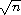

# 第三章 深入了解

前一章使您能够使用一小组最有用的原始句法形式和过程编写 Scheme 程序。本章介绍了许多额外功能和编程技术，这将使您能够编写更复杂和高效的程序。

### 第 3.1 节 句法扩展

正如我们在第 2.5 节中看到的，`let`句法形式仅仅是一个*句法扩展*，以`lambda`表达式和过程应用为核心句法形式来定义。此时，您可能想知道哪些句法形式是核心形式，哪些是句法扩展，以及如何定义新的句法扩展。本节将回答这些问题。

实际上，我们并不需要区分核心形式和句法扩展，因为一旦定义，句法扩展与核心形式具有完全相同的地位。然而，区分这两者可以使理解语言更容易，因为它允许我们将注意力集中在核心形式上，并以此理解所有其他形式。

对于 Scheme 实现来说，区分核心形式和句法扩展是必要的。Scheme 实现将句法扩展扩展为核心形式作为编译或解释的第一步，使得编译器或解释器的其余部分只需关注核心形式。然而，经过扩展后由编译器或解释器直接处理的核心形式集合是依赖于实现的，可能与此处描述的核心形式集合不同。

精确的句法形式集合构成了语言核心，因此存在争议，尽管必须能够从声明为核心形式的任何形式集合中推导出所有其他形式。这里描述的集合是满足这一约束条件的最简单之一。

核心句法形式包括顶层`define`形式、常量、变量、过程应用、`quote`表达式、`lambda`表达式、`if`表达式和`set!`表达式。下面的语法描述了 Scheme 的核心语法，其中使用这些定义和表达式。在语法中，竖线（ | ）分隔备选项，跟随星号（ * ）的形式表示该形式的零个或多个出现。 <variable> 是任何 Scheme 标识符。 <datum> 是任何 Scheme 对象，如数字、列表、符号或向量。 <boolean> 是`#t`或`#f`，<number> 是任何数字，<character> 是任何字符，<string> 是任何字符串。我们已经看到了数字、字符串、列表、符号和布尔值的示例。请参阅第六章或从第 455 页开始的正式语法描述，了解这些和其他对象的对象级语法更多信息。

| <program> |  | <form>* |
| --- | --- | --- |
| <form> |  | <definition> &#124; <expression> |
| <definition> |  | <variable definition> &#124; `(begin` <definition>*`)` |
| <variable definition> |  | `(define` <variable> <expression>`)` |
| <expression> |  | <constant> |
|  | &#124; | <variable> |
|  | &#124; | `(quote` <datum>`)` |
|  | &#124; | `(lambda` <formals> <expression> <expression>*`)` |
|  | &#124; | `(if` <expression> <expression> <expression>`)` |
|  | &#124; | `(set!` <variable> <expression>`)` |
|  | &#124; | <application> |
| <constant> |  | <boolean> &#124; <number> &#124; <character> &#124; <string> |
| <formals> |  | <variable> |
|  | &#124; | `(`<variable>*`)` |
|  | &#124; | `(`<variable> <variable>* `.` <variable>`)` |
| <application> |  | `(`<expression> <expression>*`)` |

语法存在歧义，因为过程应用的语法与`quote`、`lambda`、`if`和`set!`表达式的语法冲突。为了符合过程应用的条件，第一个<expression>不能是这些关键字之一，除非关键字已被重新定义或在本地绑定。

在第 2.6 节中给出的`define`的"defun"语法不包含在核心中，因为以那种形式的定义可以直接转换为更简单的`define`语法。同样，`if`的核心语法不允许省略`*alternative*`，就像第 2.9 节中的一个例子那样。缺少`*alternative*`的`if`表达式可以通过用任意常量（如`#f`）替换缺失的子表达式来简单地转换为`if`的核心语法。

仅包含定义的`begin`被视为语法中的定义；这是为了允许语法扩展扩展为多个定义。即，包含表达式的`begin`形式不被视为核心形式。形如

`(begin *e[1]* *e[2]* ...)`

等同于`lambda`应用

`((lambda () *e[1]* *e[2]* ...))`

因此不需要被视为核心。

现在我们已经建立了一组核心语法形式，让我们转向讨论语法扩展。语法扩展之所以被称为语法扩展，是因为它们将 Scheme 的语法扩展到核心语法之外。Scheme 程序中的所有语法扩展最终都必须源自核心形式。然而，一个语法扩展可以根据另一个语法扩展来定义，只要后者在某种意义上更接近核心语法。语法形式可以出现在期望表达式或定义的任何地方，只要扩展形式适当地扩展为定义或表达式即可。

语法扩展是用`define-syntax`定义的。`define-syntax`类似于`define`，不同之处在于`define-syntax`将一个语法转换过程或*转换器*与关键字（如`let`）关联起来，而不是将一个值与变量关联起来。以下是我们如何使用`define-syntax`定义`let`的方法。

`(define-syntax let

(syntax-rules ()

[(_ ((x e) ...) b1 b2 ...)

((lambda (x ...) b1 b2 ...) e ...)]))`

在`define-syntax`之后出现的标识符是正在定义的语法扩展的名称或关键字，在本例中是`let`。`syntax-rules`形式是一个求值为转换器的表达式。`syntax-rules`后面的项目是一个*辅助关键字*列表，几乎总是`()`。辅助关键字的一个示例是`cond`的`else`。（需要使用辅助关键字的其他示例在第八章中给出。）在辅助关键字列表之后是一个或多个*规则*或*模式/模板*对的序列。在我们对`let`的定义中只出现了一个规则。规则的模式部分指定输入必须采取的形式，模板指定输入应该转换为什么。

模式应始终是一个结构化表达式，其第一个元素是下划线（`_`）。 （正如我们将在第八章中看到的，使用`_`仅仅是一种约定，但这是一个很好的遵循。）如果存在多个规则，则在扩展期间，按顺序匹配模式以选择适当的规则。如果没有任何模式与输入匹配，则属于语法违规。

在模式中出现的下划线或省略号之外的标识符是*模式变量*，除非它们被列为辅助关键字。模式变量匹配任何子结构，并在相应模板中绑定到该子结构。模式中的`*pat* ...`符号允许零个或多个与输入中省略号原型`*pat*`匹配的表达式。类似地，模板中的`*expr* ...`符号从输出中产生零个或多个与省略号原型`*expr*`匹配的表达式。输入中`*pat*`的数量决定输出中`*expr*`的数量；为了使其工作，模板中的任何省略号原型必须至少包含一个来自模式中省略号原型的模式变量。

我们的 `let` 定义中的单个规则应该是相当不言自明的，但值得一提的是一些要点。首先，`let` 的语法要求体至少包含一个形式；因此，我们指定了 `b1 b2 ...` 而不是 `b ...`，这可能看起来更自然。另一方面，`let` 不要求至少有一个变量/值对，因此我们能够简单地使用 `(x e) ...`。其次，在模式中一起的模式变量 `x` 和 `e` 在模板中是分开的；任何形式的重新排列或重组都是可能的。最后，在模式中的省略原型中出现的三个模式变量 `x`、`e` 和 `b2` 也出现在模板中的省略原型中。这不是巧合；这是一个要求。一般来说，如果一个模式变量在模式中的省略原型中出现，它就不能在模板中的省略原型之外出现。

下面的 `and` 的定义比 `let` 的定义稍微复杂一些。

`(定义语法 和

(语法规则 ()

[(_) #t]

[(_ e) e]

[(_ e1 e2 e3 ...)

(如果 e1 (和 e2 e3 ...) #f)]))

这个定义是递归的，涉及多个规则。记住 `(和)` 的值为 `#t`；第一个规则处理这种情况。第二和第三个规则指定了递归的基本情况和递归步骤，并一起将具有两个或更多子表达式的 `and` 表达式转换为嵌套的 `if` 表达式。例如，`(和 a b c)` 首先扩展为

`(如果 a (和 b c) #f)`

然后

`(如果 a (如果 b (和 c) #f) #f)`

最后

`(如果 a (如果 b c #f) #f)`

通过这种扩展，如果 `a` 和 `b` 的值为真，则值为 `c`，否则为 `#f`，如所需。

下面的 `and` 版本更简单，但不幸的是，是错误的。

`(定义语法 和 ; 不正确！

(语法规则 ()

[(_) #t]

[(_ e1 e2 ...)

(如果 e1 (和 e2 ...) #f)]))

表达式

`(和 (非 (= x 0)) (/ 1 x))`

当 `x` 不为零时应返回 `(/ 1 x)` 的值。使用不正确版本的 `and`，表达式扩展如下。

`(如果 (非 (= x 0)) (和 (/ 1 x)) #f) 

(如果 (非 (= x 0)) (如果 (/ 1 x) (和) #f) #f) 

(如果 (非 (= x 0)) (如果 (/ 1 x) #t #f) #f)`

如果 `x` 不为零，则最终答案是 `#t`，而不是 `(/ 1 x)` 的值。

下面的 `or` 的定义与 `and` 的定义类似，只是必须为每个中间值引入一个临时变量，以便我们既可以测试值又可以返回它，如果它是一个真值的话。（对于 `and`，不需要临时变量，因为只有一个假值，`#f`。）

`(定义语法 或

(语法规则 ()

[(_) #f]

[(_ e) e]

[(_ e1 e2 e3 ...)

(让 ([t e1])

`(如果 t t (或 e2 e3 ...)))]))`

像由`lambda`或`let`绑定的变量一样，由模板引入的标识符是词法作用域的，即仅在模板引入的表达式中可见。因此，即使`e2 e3 ...`中的一个表达式包含对`t`的引用，对`t`的引入绑定也不会"捕获"这些引用。这通常通过引入标识符的自动重命名来实现。

就像上面给出的`and`的简化版本一样，下面给出的`or`的简化版本是不正确的。

`(define-syntax or ; incorrect!

(syntax-rules ()

[(_) #f]

[(_ e1 e2 ...)

(let ([t e1])

(if t t (or e2 ...)))]))`

然而，原因更加微妙，这是练习 3.2.6 的主题。

#### Exercise 3.1.1

写出扩展步骤，以展开

`(let ([x (memv 'a ls)])

(and x (memv 'b x)))`

转换为核心形式。

#### Exercise 3.1.2

写出扩展步骤，以展开

`(or (memv x '(a b c)) (list x))`

转换为核心形式。

#### Exercise 3.1.3

`let*`类似于`let`，但按顺序评估其绑定。每个右侧表达式都在先前绑定的范围内。

`(let* ([a 5] [b (+ a a)] [c (+ a b)])

(list a b c))  (5 10 15)`

`let*`可以被实现为嵌套的`let`表达式。例如，上面的`let*`表达式等同于下面的嵌套`let`表达式。

`(let ([a 5])

(let ([b (+ a a)])

(let ([c (+ a b)])

(list a b c))))  (5 10 15)`

使用`define-syntax`定义`let*`。

#### Exercise 3.1.4

正如我们在第 2.9 节中看到的，省略`if`表达式的第三个或*替代*子表达式是合法的。然而，这样做通常会导致混淆。Scheme 提供了两种语法形式，`when`和`unless`，可以用来替代这种"单臂"的`if`表达式。

`(when *test* *expr[1]* *expr[2]*...)

(unless *test* *expr[1]* *expr[2]* ...)`

对于这两种形式，首先评估`test`。对于`when`，如果`test`评估为真，则剩余的表达式按顺序评估，就好像被包含在隐式的`begin`表达式中一样。如果`test`评估为假，则不评估剩余的表达式，结果是未指定的。`unless`类似，只有当`test`评估为假时才评估剩余的表达式。

`(let ([x 3])

(unless (= x 0) (set! x (+ x 1)))

(when (= x 4) (set! x (* x 2)))

x)  8`

以`if`和`begin`为基础定义`when`作为语法扩展，并以`when`为基础定义`unless`。

### 第 3.2 节。更多递归

在第 2.8 节中，我们看到如何使用顶层定义来定义递归过程。在此之前，我们看到如何使用`let`为过程创建局部绑定。自然而然地会想知道`let`绑定的过程是否可以是递归的。答案是否定的，至少不是直接的方式。如果尝试评估表达式

`(let ([sum (lambda (ls)

(if (null? ls)

0

(+ (car ls) (sum (cdr ls)))))])

(sum '(1 2 3 4 5)))`

它可能会引发异常，并显示`sum`未定义的消息。这是因为变量`sum`仅在`let`表达式的主体中可见，而不在其值绑定到`sum`的`lambda`表达式中可见。我们可以通过将过程`sum`传递给自身来解决这个问题。

`(let ([sum (lambda (sum ls)

(if (null? ls)

0

(+ (car ls) (sum sum (cdr ls)))))])

(sum sum '(1 2 3 4 5)))  15`

这种方法有效且聪明，但有一种更简单的方法，使用`letrec`。像`let`一样，`letrec`语法形式包括一组变量-值对，以及一系列被称为`letrec`的*body*表达式。

`(letrec ((*var* *expr*) ...) *body[1]* *body[2]* ...)`

与`let`不同，变量`*var* ...`不仅在`letrec`的主体中可见，而且在`*expr* ...`中也可见。因此，我们可以将上面的表达式重写如下。

`(letrec ([sum (lambda (ls)

(if (null? ls)

0

(+ (car ls) (sum (cdr ls)))))])

(sum '(1 2 3 4 5)))  15`

使用`letrec`，我们还可以定义相互递归的过程，比如练习 2.8.6 中讨论的`even?`和`odd?`过程。

`(letrec ([even?

(lambda (x)

(or (= x 0)

(odd? (- x 1))))]

[odd?

(lambda (x)

(and (not (= x 0))

(even? (- x 1))))])

(list (even? 20) (odd? 20)))  (#t #f)`

在`letrec`表达式中，`*expr* ...`通常是`lambda`表达式，尽管这不一定是必须的。然而，对表达式的一个限制必须遵守。必须能够在不评估任何变量`*var* ...`的情况下评估每个`*expr*`。然而，如果表达式都是`lambda`表达式，这个限制总是满足的，因为即使变量可能出现在`lambda`表达式中，也不能在`letrec`的主体中调用结果过程之前对其进行评估。以下`letrec`表达式遵守了这个限制。

`(letrec ([f (lambda () (+ x 2))]

[x 1])

(f))  3`

而以下则不会。

`(letrec ([y (+ x 2)]`

[x 1])

y)`

在这种情况下，引发异常，指示在引用时未定义`x`。

我们可以使用`letrec`来隐藏“帮助”程序的定义，以便它们不会混乱顶层命名空间。下面的`list?`定义演示了这一点，它遵循了练习 2.9.8 中概述的“乌龟和兔子”算法。

`(define list?

(lambda (x)

(letrec ([race

(lambda (h t)

(if (pair? h)

(let ([h (cdr h)])

(if (pair? h)

(and (not (eq? h t))

(race (cdr h) (cdr t)))

(null? h)))

(null? h)))])

(race x x))))`

当递归过程仅在过程外的一个地方调用时，通常更清晰的做法是使用*命名*`let`表达式。命名的`let`表达式采用以下形式。

`(let *name* ((*var* *expr*) ...)

*body[1]* *body[2]* ...)`

命名为`let`的形式与未命名的`let`类似，它将变量`*var* ...`绑定到`*expr* ...`的值，并在`*body[1]* *body[2]* ...`中使用。与未命名的`let`一样，这些变量仅在 body 中可见，而不在`*expr* ...`中可见。此外，变量`*name*`在 body 中绑定到一个可调用的过程，可以用于递归调用；过程的参数成为变量`*var* ...`的新值。

`list?`的定义已经被重写为使用命名为`let`。

`(define list?

(lambda ( x )

(let race ([h x] [t x])

(if (pair? h)

(let ([h (cdr h)])

(if (pair? h)

(and (not (eq? h t))

(race (cdr h) (cdr t)))

(null? h)))

(null? h)))))`

就像`let`可以表示为将`lambda`表达式直接应用于参数一样，命名为`let`可以表示为将递归过程应用于参数。形式为

`(let *name* ((*var* *expr*) ...)

*body[1]* *body[2]* ...)`

可以通过以下方式用`letrec`重写。

`((letrec ((*name* (lambda (*var* ...) *body[1]* *body[2]* ...)))

*name*)

*expr* ...)`

或者可以重写为

`(letrec ((*name* (lambda (*var* ...) *body[1]* *body[2]* ...)))

(*name* *expr* ...))`

假设变量`*name*`在`*expr* ...`中不是自由的。

正如我们在第 2.8 节中讨论的，一些递归本质上是迭代并且执行为迭代。当一个过程调用在相对于`lambda`表达式的尾部位置时（见下文），它被认为是*尾调用*，并且 Scheme 系统必须将其*正确*处理，作为"goto"或跳转。当一个过程尾调用自身或通过一系列尾调用间接调用自身时，结果是*尾递归*。由于尾调用被视为跳转，尾递归可以用于无限迭代，取代其他编程语言提供的更为限制的迭代构造，而无需担心溢出任何递归堆栈。

如果一个调用在相对于`lambda`表达式的尾部位置，那么它的值将直接从`lambda`表达式返回，即，如果在调用之后没有其他操作，只需从`lambda`表达式返回。例如，如果一个调用是`lambda`表达式体中的最后一个表达式，`if`表达式中的*consequent*或*alternative*部分处于尾部位置，`and`或`or`表达式的最后一个子表达式处于尾部位置，`let`或`letrec`体中的最后一个表达式处于尾部位置等，则该调用处于尾部位置。下面表达式中对`f`的每次调用都是尾调用，但对`g`的调用则不是。

`(lambda () (f (g)))

(lambda () (if (g) (f) (f)))

(lambda () (let ([x 4]) (f)))

(lambda () (or (g) (f)))`

在每种情况下，对`f`的调用的值直接返回，而对`g`的调用则不会。

一般递归和特别是命名的`let`提供了一种自然的方式来实现许多算法，无论是迭代的、递归的还是部分迭代部分递归的；程序员不必负担两种不同的机制。

下面两个关于`factorial`的定义使用了命名的`let`表达式来计算非负整数*n*的阶乘，*n*!。第一个采用了递归定义*n*! = *n* × (*n* - 1)!，其中 0!定义为 1。

`(define factorial

(lambda (n)

(let fact ([i n])

(if (= i 0)

1

(* i (fact (- i 1)))))))`

`(factorial 0)  1

(factorial 1)  1

(factorial 2)  2

(factorial 3)  6

(factorial 10)  3628800`

第二个是一个迭代版本，使用迭代定义*n*! = *n* × (*n* - 1) × (*n* - 2) × ... × 1，使用一个累加器`a`来保存中间乘积。

`(define factorial

(lambda (n)

(let fact ([i n] [a 1])

(if (= i 0)

a

(fact (- i 1) (* a i))))))`

计算给定*n*的第*n*个斐波那契数的类似问题。*斐波那契数*是一个无限整数序列，0, 1, 1, 2, 3, 5, 8 等，其中每个数字是序列中前两个数字的和。计算第*n*个斐波那契数的过程最自然地递归定义如下。

`(define fibonacci

(lambda (n)

(let fib ([i n])

(cond

[(= i 0) 0]

[(= i 1) 1]

[else (+ (fib (- i 1)) (fib (- i 2)))]))))

(fibonacci 0)  0

(fibonacci 1)  1

(fibonacci 2)  1

(fibonacci 3)  2

(fibonacci 4)  3

(fibonacci 5)  5

(fibonacci 6)  8

(fibonacci 20)  6765

(fibonacci 30)  832040`

这个解决方案在每一步都需要计算前两个斐波那契数，因此是*双重递归*的。例如，计算`(fibonacci 4)`需要计算`(fib 3)`和`(fib 2)`，计算`(fib 3)`需要计算`(fib 2)`和`(fib 1)`，计算`(fib 2)`需要计算`(fib 1)`和`(fib 0)`。这是非常低效的，并且随着`n`的增长而变得更加低效。一个更有效的解决方案是改编上面`factorial`示例的累加器解决方案，使用两个累加器，`a1`用于当前斐波那契数，`a2`用于前一个。

`(define fibonacci

(lambda (n)

(if (= n 0)

0

(let fib ([i n] [a1 1] [a2 0])

(if (= i 1)

a1

(fib (- i 1) (+ a1 a2) a1))))))`

这里，零被视为一个特殊情况，因为没有前一个值。这使我们能够使用单个基本情况`(= i 1)`。使用这种迭代解决方案计算第*n*个斐波那契数所需的时间随*n*线性增长，与双递归版本相比有显著差异。为了感受差异，请尝试使用两种定义计算`(fibonacci 35)`和`(fibonacci 40)`，看看每个需要多长时间。

我们还可以通过查看每个小输入的跟踪来感受差异。下面的第一个跟踪显示了在输入为 5 时，在`fibonacci`的非尾递归版本中对`fib`的调用。

`|(fib 5)

| (fib 4)

| |(fib 3)

| | (fib 2)

| | |(fib 1)

| | |1

| | |(fib 0)

| | |0

| | 1

| | (fib 1)

| | 1

| |2

| |(fib 2)

| | (3 5)

| | 1

| | (fib 0)

| | 0

| |1

| 3

| (fib 3)

| |(fib 2)

| | (fib 1)

| | 1

| | (fib 0)

| | 0

| |1

| |(fib 1)

| |1

| 2

|5`

请注意，有几次对`fib`的调用，参数为 2、1 和 0。第二个跟踪显示了在尾递归版本中对`fib`的调用，同样输入为 5。

`|(fib 5 1 0)

|(fib 4 1 1)

|(fib 3 2 1)

|(fib 2 3 2)

|(fib 1 5 3)

|5`

显然，有相当大的差异。

到目前为止所展示的命名`let`示例要么是尾递归的，要么不是尾递归的。经常发生的情况是，在同一表达式中一个递归调用是尾递归的，而另一个不是。下面的`factor`定义计算其非负整数参数的质因数。第一次调用`f`不是尾递归的，但第二次调用是。

`(define factor

(lambda (n)

(let f ([n n] [i 2])

(cond

[(>= i n) (list n)]

[(integer? (/ n i))

(cons i (f (/ n i) i))]

[else (f n (+ i 1))]))))

(factor 0)  (0)

(factor 1)  (1)

(factor 12)  (2 2 3)

(factor 3628800)  (2 2 2 2 2 2 2 2 3 3 3 3 5 5 7)

(factor 9239)  (9239)`

在下面的`(factor 120)`的求值中，通过在 Chez Scheme 中用`trace-let`替换`let`来生成对`f`的调用跟踪，突出了非尾调用和尾调用之间的差异。

`|(f 120 2)

| (f 60 2)

| |(f 30 2)

| | (f 15 2)

| | (f 15 3)

| | |(f 5 3)

| | |(f 5 4)

| | |(f 5 5)

| | |(5)

| | (3 5)

| |(2 3 5)

| (2 2 3 5)

|(2 2 2 3 5)`

一个对`f`的非尾调用相对于其调用者显示为缩进，因为调用者仍然活动，而尾调用则显示在相同缩进级别。

#### 练习 3.2.1

在 3.2 节中定义的递归过程中，哪些是尾递归的，哪些不是？

#### 练习 3.2.2

使用`letrec`重写`factor`，以绑定`f`代替命名`let`。你更喜欢哪个版本？

#### 练习 3.2.3

下面的`letrec`表达式能否使用命名`let`重写？如果不能，为什么？如果可以，那就这样做。

`(letrec ([even?

(lambda (x)

(or (= x 0)

(odd? (- x 1))))]

[odd?

(lambda (x)

(and (not (= x 0))

(even? (- x 1))))])

(even? 20))`

#### 练习 3.2.4

重新编写本节中给出的 `fibonacci` 的两个定义，以计算对 `fib` 的递归调用次��，使用类似于第 2.9 节中 `cons-count` 示例中使用的计数器。对几个输入值分别计算每种情况下进行的递归调用次数。您注意到了什么？

#### 练习 3.2.5

增强第 3.1 节中给出的 `let` 的定义，以处理命名 `let` 和未命名 `let`，使用两个规则。

#### 练习 3.2.6

`or` 的以下定义比第 3.1 节中给出的更简单。

`(define-syntax or ; incorrect!

(syntax-rules ()

[(_) #f]

[(_ e1 e2 ...)

(let ([t e1])

`(if t t (or e2 ...)))]))`

说明为什么这不正确。*提示*：考虑如果此版本的 `or` 用于第 [66 页上给出的 `even?` 和 `odd?` 示例中非常大的输入会发生什么。]

#### 练习 3.2.7

`factor` 的定义不是最有效的。首先，除了 *n* 本身之外，*n* 的因子不可能在  之后找到。其次，当找到一个因子时，除法 `(/ n i)` 会执行两次。第三，在 2 之后，不可能再找到偶数因子。重新编码 `factor` 以纠正所有三个问题。哪个问题最重要？您能做出其他改进吗？

### 第 3.3 节。延续

在评估 Scheme 表达式时，实现必须跟踪两件事：(1) 要评估什么，以及 (2) 如何处理值。考虑以下表达式中 `(null? x)` 的评估。

`(if (null? x) (quote ()) (cdr x))`

实现必须首先评估 `(null? x)`，并根据其值评估 `(quote ())` 或 `(cdr x)`。 "要评估什么" 是 `(null? x)`，"如何处理值" 是决定评估 `(quote ())` 还是 `(cdr x)` 的决定，并执行。我们称"如何处理值"为计算的*延续*。

因此，在任何表达式的评估过程中，在任何时刻都有一个延续准备完成，或至少*继续*从那一点开始的计算。假设 `x` 的值为 `(a b c)`。在评估 `(if (null? x) (quote ()) (cdr x))` 过程中，我们可以分离出六个延续，等待

1.  `(if (null? x) (quote ()) (cdr x))` 的值，

1.  `(null? x)` 的值，

1.  `null?` 的值，

1.  `x` 的值，

1.  `cdr` 的值，以及

1.  `x` 的值（再次）。

`(cdr x)` 的延续没有列出，因为它与等待 `(if (null? x) (quote ()) (cdr x))` 的延续相同。

Scheme 允许捕获任何表达式的续延，并将其传递给过程`call/cc`。`call/cc`必须传递一个参数的过程`*p*`。`call/cc`构造当前续延的具体表示，并将其传递给`*p*`。续延本身由过程`*k*`表示。每次将值应用于`*k*`时，它将值返回给`call/cc`应用的续延。这个值本质上成为`call/cc`应用的值。

如果`*p*`在不调用`*k*`的情况下返回，则过程返回的值将成为`call/cc`应用的值。

考虑下面的简单示例。

`(call/cc

(lambda (k)

(* 5 4)))  20

(call/cc

(lambda (k)

(* 5 (k 4))))  4

(+ 2

(call/cc

(lambda (k)

(* 5 (k 4)))))  6`

在第一个示例中，续延被捕获并绑定到`k`，但`k`从未被使用，因此值只是 5 和 4 的乘积。在第二个示例中，在乘法之前调用了续延，因此值是传递给续延的值，即 4。在第三个示例中，续延包括加法 2；因此，值是传递给续延的值 4，再加上 2。

这是一个不太平凡的示例，展示了使用`call/cc`从递归中提供非局部退出的用法。

`(define product

(lambda (ls)

(call/cc

(lambda (中断)

(let f ([ls ls])

(cond

[(null? ls) 1]

[(= (car ls) 0) (break 0)]

[else (* (car ls) (f (cdr ls)))]))))))`

`(product '(1 2 3 4 5))  120

(product '(7 3 8 0 1 9 5))  0`

非局部退出允许`product`在检测到零值时立即返回，而不执行待处理的乘法。

上述每次续延调���在控制仍在传递给`call/cc`的过程内时返回续延。以下示例在此过程已经返回后使用续延。

`(let ([x (call/cc (lambda (k) k))])

(x (lambda (ignore) "hi")))  "hi"`

通过这次对`call/cc`的调用捕获的续延可以描述为“取值，将其绑定到`x`，并将`x`的值应用于`(lambda (ignore) "hi")`的值。”由于`(lambda (k) k)`返回其参数，`x`绑定到续延本身；这个续延应用于`(lambda (ignore) "hi")`的求值结果产生的过程。这样做的效果是将`x`（再次！）绑定到这个过程，并将过程应用于自身。过程忽略其参数并返回`"hi"`。

上面示例的以下变体可能是其规模最令人困惑的 Scheme 程序；猜测它返回什么可能很容易，但需要一些思考才能弄清楚为什么。

`(((call/cc (lambda (k) k)) (lambda (x) x)) "HEY!")  "HEY!"`

`call/cc`的值是它自己的延续，就像前面的例子一样。这被应用于恒等过程`(lambda (x) x)`，因此`call/cc`返回第二次带有这个值。然后，恒等过程应用于自身，产生恒等过程。最后，它被应用于`"嘿！"`，产生`"嘿！"`。

以这种方式使用延续并不总是那么令人困惑。考虑以下定义的`factorial`，在返回 1 之前将递归基础处的延续保存下来，通过分配顶层变量`retry`。

`(define retry #f)

(define factorial

(lambda (x)

(if (= x 0)

(call/cc (lambda (k) (set! retry k) 1))

(* x (factorial (- x 1))))))`

根据这个定义，`factorial`的工作方式符合我们对`factorial`的期望，只是它有一个副作用，即分配`retry`。

`(factorial 4)  24

(retry 1)  24

(retry 2)  48`

绑定到`retry`的延续可以描述为“将值乘以 1，然后将此结果乘以 2，然后将此结果乘以 3，然后将此结果乘以 4”。如果我们传递给延续一个不同的值，即不是 1，我们将导致基础值不是 1，从而改变最终结果。

`(retry 2)  48

(retry 5)  120`

这种机制可以作为使用`call/cc`实现的断点包的基础；每次遇到断点时，都会保存断点的延续，以便可以从断点重新启动计算（如果需要，可以多次）。

延续可用于实现各种形式的多任务处理。下面定义的简单“轻量级进程”机制允许��个计算交错进行。由于它是*非抢占式*的，因此需要每个进程自愿不时“暂停”，以便允许其他进程运行。

`(define lwp-list '())

(define lwp

(lambda (thunk)

(set! lwp-list (append lwp-list (list thunk)))))

(define start

(lambda ()

(let ([p (car lwp-list)])

(set! lwp-list (cdr lwp-list))

(p))))`

`(define pause

(lambda ()

(call/cc

(lambda (k)

(lwp (lambda () (k #f)))

(start)))))`

以下轻量级进程合作打印包含`"嘿！"`的无限序列的行。

`(lwp (lambda () (let f () (pause) (display "h") (f))))

(lwp (lambda () (let f () (pause) (display "e") (f))))

(lwp (lambda () (let f () (pause) (display "y") (f))))

(lwp (lambda () (let f () (pause) (display "!") (f))))

(lwp (lambda () (let f () (pause) (newline) (f))))

(start)  *嘿！*

 *嘿！*

 *嘿！*

 *嘿！*

 `

请参见第 12.11 节，了解支持使用`call/cc`进行抢占式多任务处理的*引擎*的实现。

#### 练习 3.3.1

使用`call/cc`编写一个无限循环的程序，从零开始打印一系列数字。不要使用任何递归过程，也不要使用任何赋值。

#### 练习 3.3.2

重写`product`而不使用`call/cc`，保留如果列表元素中有任何零则不执行任何乘法的特性。

#### 练习 3.3.3

如果由上述`lwp`定义创建的进程终止会发生什么？定义一个`quit`过程，允许进程在不影响`lwp`系统的情况下终止。务必处理仅剩的进程终止的情况。

#### 练习 3.3.4

每次调用`lwp`时，进程列表都会被复制，因为`lwp`使用`append`将其参数添加到进程列表的末尾。修改原始的`lwp`代码，使用第 2.9 节中开发的队列数据类型来避免这个问题。

#### 练习 3.3.5

轻量级进程机制允许动态创建新进程，尽管本节中给出的示例并未这样做。设计一个需要动态创建新进程的应用程序，并使用轻量级进程机制实现它。

### 第 3.4 节。延续传递风格

正如我们在前一节中讨论的，延续等待每个表达式的值。特别是，每个过程调用都与一个延续相关联。当一个过程通过非尾调用调用另一个过程时，被调用的过程接收一个负责完成调用过程剩余部分并返回到调用过程延续的隐式延续。如果调用是尾调用，则被调用的过程简单地接收调用过程的延续。

我们可以通过在每次调用中传递一个显式过程参数来使延续变得显式。例如，在对`f`的调用的延续中

`(letrec ([f (lambda x) (cons 'a x))]`

[g (lambda x (cons 'b (f x)))]

[h (lambda x (g (cons 'c x)))])

`(cons 'd (h '())))`  (d b a c)`

将符号`b`连接到返回给它的值上，然后将此连接的结果返回给对`g`的调用的延续。这个延续与对`h`的调用的延续相同，后者将符号`d`连接到返回给它的值上。我们可以通过用显式过程替换这些隐式延续来以*延续传递风格*或 CPS 重写这个。

`(letrec ([f (lambda (x k) (k (cons 'a x)))]`

[g (lambda x k

`(f x (lambda v (k (cons 'b v)))))]`

[h (lambda x k (g (cons 'c x) k))])

`(h '() (lambda v) (cons 'd v))))`

像前面示例中的`h`和`g`的隐式延续一样，传递给`h`并传递给`g`的显式延续，

`(lambda v (cons 'd v))`

将符号`d`连接到传递给它的值上。类似地，传递给`f`的延续，

`(lambda v (k (cons 'b v)))`

将`b`连接到传递给它的值上，然后将其传递给`g`的延续。

当以 CPS 编写的表达式当然更加复杂，但这种编程风格具有一些有用的应用。CPS 允许一个过程向其延续传递多个结���，因为实现延续的过程可以接受任意数量的参数。

`(define car&cdr

(lambda (p k)

(k (car p) (cdr p))))

(car&cdr '(a b c)

(lambda (x y)

(list y x)))  ((b c) a)

(car&cdr '(a b c) cons)  (a b c)

(car&cdr '(a b c a d) memv)  (a d)`

(这也可以用多个值来完成；参见第 5.8 节。CPS 还允许一个过程接受单独的“成功”和“失败”延续，它们可能接受不同数量的参数。下面是一个例子，`integer-divide`，它将其前两个参数的商和余数传递给第三个参数，除非第二个参数（除数）为零，此时它将错误消息传递给第四个参数。

`(define integer-divide

(lambda (x y success failure)

(if (= y 0)

(failure "divide by zero")

(let ([q (quotient x y)])

(success q (- x (* q y)))))))

(integer-divide 10 3 list (lambda (x) x))  (3 1)

(integer-divide 10 0 list (lambda (x) x))  "divide by zero"`

过程`quotient`，由`integer-divide`使用，返回其两个参数的商，向零截断。

明确的成功和失败延续有时可以帮助避免必须将过程的成功执行与失败执行分开所需的额外通信。此外，可以为不同类型的成功或失败拥有多个成功或失败延续，每个延续可能接受不同数量和类型的参数。请参见第 12.10 和第 12.11 节，这些节提供了使用延续传递风格的扩展示例。

此时，您可能想知道 CPS 与通过`call/cc`捕获的延续之间的关系。事实证明，任何使用`call/cc`的程序都可以在不使用`call/cc`的情况下以 CPS 方式重写，但可能需要对程序进行全面重写（有时甚至包括系统定义的原语）。在查看下面的版本之前，尝试将第 75 页上的`product`示例转换为 CPS。

`(define product

(lambda (ls k)

(let ([break k])

(let f ([ls ls] [k k])

(cond

[(null? ls) (k 1)]

[(= (car ls) 0) (break 0)]

[else (f (cdr ls)

(lambda (x)

(k (* (car ls) x))))])))))`

`(product '(1 2 3 4 5) (lambda (x) x))  120

(product '(7 3 8 0 1 9 5) (lambda (x) x))  0`

#### 练习 3.4.1

首先重写第 2.1 节中首次给出的`reciprocal`示例，以接受像上面的`integer-divide`一样的成功和失败延续。

#### 练习 3.4.2

将第 75 页的`retry`示例重写为使用 CPS。

#### 练习 3.4.3

将以下表达式重写为 CPS 以避免使用`call/cc`。

`(define reciprocals

(lambda (ls)

(call/cc

(lambda (k)

(map (lambda (x)

(if (= x 0)

(k "zero found")

(/ 1 x)))

ls)))))`

`(reciprocals '(2 1/3 5 1/4))  (1/2 3 1/5 4)

(reciprocals '(2 1/3 0 5 1/4))  "zero found"`

*提示*：`map`的单列表版本在第[46 页上定义。]

### 第 3.5 节。内部定义

在第 2.6 节中，我们讨论了顶层定义。定义也可以出现在`lambda`、`let`或`letrec`主体的开头，这样它们创建的绑定将局限于主体。

`(define f (lambda (x) (* x x)))

(let ([x 3])

(define f (lambda (y) (+ y x)))

(f 4))  7

(f 4)  16`

过程通过内部定义可以相互递归，就像使用`letrec`一样。例如，我们可以使用内部定义重写第 3.2 节中的`even?`和`odd?`示例如下。

`(let ()

(define even?

(lambda (x)

(or (= x 0)

(odd? (- x 1)))))

(define odd?

(lambda (x)

(and (not (= x 0))

(even? (- x 1)))))

(even? 20))  #t`

类似地，我们可以用内部定义的`race`替换`letrec`来绑定`race`，在我们第一个`list?`定义中。

`(define list?

(lambda (x)

(define race

(lambda (h t)

(if (pair? h)

(let ([h (cdr h)])

(if (pair? h)

(and (not (eq? h t))

(race (cdr h) (cdr t)))

(null? h)))

(null? h))))

(race x x)))`

实际上，内部变量定义和`letrec`几乎可以互换。除了语法上的明显差异之外，唯一的区别是，变量定义保证从左到右进行评估，而 letrec 的绑定可以以任何顺序进行评估。因此，我们不能完全用`letrec`表达式替换包含内部定义的`lambda`、`let`或`letrec`主体。但是，我们可以使用`letrec*`，它像`let*`���样，保证从左到右的评估顺序。形式为

`(define *var* *expr[0]*)

*expr[1]*

*expr[2]*

`

等同于将定义的变量绑定到主体中的相关值的`letrec*`表达式。

`(letrec* ((*var* *expr[0]*) ...) *expr[1]* *expr[2]* ...)`

相反，形式为`letrec*`的表达式

`(letrec* ((*var* *expr[0]*) ...) *expr[1]* *expr[2]* ...)`

可以用包含内部定义和主体中表达式的`let`表达式替换。

`(let ()

(define *var* *expr[0]*)

*expr[1]*

*expr[2]*

)`

这些转换之间看似缺乏对称性，是因为`letrec*`表达式可以出现在任何表达式有效的地方，而内部定义只能出现在主体的开头。因此，在用内部定义替换`letrec*`时，通常必须引入一个`let`表达式来保存这些定义。

内部定义与`letrec`或`letrec*`之间的另一个区别是，语法定义可以出现在内部定义中，而`letrec`和`letrec*`只绑定变量。

`(let ([x 3])

(define-syntax set-x!

(syntax-rules ()

[(_ e) (set! x e)]))

(set-x! (+ x x))

x)  6`

由内部语法定义建立的语法扩展的作用域，与内部变量定义一样，仅限于语法定义出现的主体中。

内部定义可以与顶层定义和赋值一起使用，以帮助模块化程序。程序的每个模块应该只公开其他模块需要的绑定，同时隐藏其他绑定，否则会使顶层命名空间混乱，并可能导致意外使用或重新定义这些绑定。一个常见的模块结构如下所示。

`(define *export-var* #f)

(let ()

(define *var* *expr*)

*init-expr*

(set! *export-var* *export-val*)

)`

第一组定义为我们希望导出（在全局可见）的变量建立了顶层绑定。第二组定义建立了仅在模块内可见的局部绑定。表达式`*init-expr* ...`执行在局部绑定建立后必须发生的任何初始化。最后，`set!`表达式将导出的变量分配给相应的值。

这种模块化形式的一个优点是，在程序开发过程中，括号`let`表达式可以被移除或“注释掉”，使内部定义变为顶层，以便进行交互式测试。但这种模块化形式也有几个缺点，我们将在下一节讨论。

以下模块导出一个名为`calc`的变量，该变量绑定到实现简单四则运算计算器的过程。

`(define calc #f)

(let ()

(define do-calc

(lambda (ek expr)

(cond

[(number? expr) expr]

[(and (list? expr) (= (length expr) 3))

(let ([op (car expr)] [args (cdr expr)])

(case op

[(add) (apply-op ek + args)]

[(sub) (apply-op ek - args)]

[(mul) (apply-op ek * args)]

[(div) (apply-op ek / args)]

[else (complain ek "invalid operator"��op)]))]

[else (complain ek "invalid expression" expr)])))

(define apply-op

(lambda (ek op args)

(op (do-calc ek (car args)) (do-calc ek (cadr args)))))

(define complain

(lambda (ek msg expr)

(ek (list msg expr))))

(set! calc

(lambda (expr)

; grab an error continuation ek

(call/cc

(lambda (ek)

(do-calc ek expr))))))

(calc '(add (mul 3 2) -4))  2

(calc '(div 1/2 1/6))  3

(calc '(add (mul 3 2) (div 4)))  ("无效表达式" (div 4))

(calc '(mul (add 1 -2) (pow 2 7)))  ("无效运算符" pow)`

本示例使用`case`表达式来确定应用哪个运算符。`case`类似于`cond`，不同之处在于测试始终相同：`(memv *val* (*key* ...))`，其中`*val*`是第一个`case`子形式的值，`(*key* ...)`是每个`case`子句前面的项目列表。上面示例中的`case`表达式可以使用`cond`重写如下。

`(let ([temp op])

(cond

[(memv temp '(add)) (apply-op ek + args)]

[(memv temp '(sub)) (apply-op ek - args)]

[(memv temp '(mul)) (apply-op ek * args)]

[(memv temp '(div)) (apply-op ek / args)]

[else (complain ek "无效运算符" op)]))`

#### 练习 3.5.1

在`calc`示例中重新定义`complain`为一个等效的语法扩展。

#### 练习 3.5.2

在`calc`示例中，错误继续`ek`在每次调用`apply-op`、`complain`和`do-calc`时都被传递。将`apply-op`、`complain`和`do-calc`的定义尽可能向内移动，以消除这些过程的定义和应用中的`ek`参数。

#### 练习 3.5.3

从`calc`中消除`call/cc`，并重写`complain`以使用`assertion-violation`引发异常。

#### 练习 3.5.4

扩展`calc`以处理一元减号表达式，例如，

`(calc '(minus (add 2 3)))  -5`

和其他您选择的运算符。

### 第 3.6 节。库

在前面一节的结尾，我们讨论了一种模块化形式，涉及从`let`内部分配一组顶层变量，同时将未发布的辅助程序保持在`let`的局部范围内。这种模块化形式有几个缺点：

+   它是不可移植的，因为交互式顶层的行为甚至存在性在修订⁶报告中并不保证。

+   需要赋值，这使得代码看起来有些笨拙，可能会阻碍编译器的分析和优化。

+   它不支持关键字绑定的发布，因为对于关键字没有类似于`set!`的东西。

另一种不具有这些缺点的替代方法是创建一个库。库导出一组标识符，每个标识符在库内定义或从其他库导入。导出的标识符不必绑定为变量；它可以绑定为关键字。

以下库导出两个标识符：变量`gpa->grade`和关键字`gpa`。变量`gpa->grade`绑定到一个过程，该过程接受以数字表示的绩点平均值（GPA），并根据四分制返回相应的字母等级。关键字`gpa`命名一个语法扩展，其子形式必须全部是字母等级，其值是从这些字母等级计算出的 GPA。

`(library (grades)

(export gpa->grade gpa)

(导入 (rnrs))

(定义 in-range?

(lambda (x n y)

(and (>= n x) (< n y))))

(定义语法 range-case

(语法规则 (- else)

[(_ expr ((x - y) e1 e2 ...) ... [else ee1 ee2 ...])

(让 ([tmp expr])

(条件

[(in-range? x tmp y) e1 e2 ...]

...

[else ee1 ee2 ...]))]

[(_ expr ((x - y) e1 e2 ...) ...)

(让 ([tmp expr])

(条件

[(in-range? x tmp y) e1 e2 ...]

...))]))

(定义 letter->number

(lambda (x)

(case x

[(a)  4.0]

[(b)  3.0]

[(c)  2.0]

[(d)  1.0]

[(f)  0.0]

[else (断言违规 'grade "无效的字母等级" x)])))

(定义 gpa->grade

(lambda (x)

(range-case x

[(0.0 - 0.5) 'f]

[(0.5 - 1.5) 'd]

[(1.5 - 2.5) 'c]

[(2.5 - 3.5) 'b]

[else 'a])))

(定义语法 gpa

(语法规则 ()

[(_ g1 g2 ...)

(让 ([ls (map letter->number '(g1 g2 ...))])

(/ (apply + ls) (length ls)))])))`

这个库的名称是 `(grades)`。这可能看起来像一种有趣的名称，但所有库名称都是用括号括起来的。该库从标准库 `(rnrs)` 中导入，其中包含了本章和上一章中使用的大部分原始和关键字绑定，以及我们实现 `gpa->grade` 和 `gpa` 所需的一切。

除了 `gpa->grade` 和 `gpa`，库中还定义了几个其他语法扩展和过程，但其他的都没有被导出。没有被导出的那些只是为被导出的那些提供帮助。库中使用的所有内容都应该很熟悉，除了 `apply` 过程，该过程在第 107 页有描述。

如果你的 Scheme 实现支持在交互式顶层使用 `import`，你可以像下面展示的那样测试这两个导出。

`(导入 (grades))

(gpa c a c b b)  2.8

(gpa->grade 2.8)  b`

第 10 章更详细地描述了库，并提供了它们使用的其他示例。

#### 练习 3.6.1

修改 `gpa` 以处理 "`x`" 等级，这些等级不计入平均绩点。要小心处理每个等级都是 `x` 的情况。

`(导入 (grades))

(gpa a x b c)  3.0`

#### 练习 3.6.2

从 `(grades)` 导出一个新的语法形式 `distribution`，它接受一组成绩，类似于 `gpa`，但返回一个形式为 `((*n* *g*) ...)` 的列表，其中 `*n*` 是集合中 `*g*` 出现的次数，每个 `*g*` 都有一个条目。让 `distribution` 调用一个未导出的过程来执行实际工作。

`(导入 (grades))

(distribution a b a c c c a f b a)  ((4 a) (2 b) (3 c) (0 d) (1 f))`

#### 练习 3.6.3

现在阅读第 7.8 节关于输出操作的内容，并定义一个新的导出 `histogram`，作为一个过程，接受一个 `*文本输出端口*` 和一个分布，例如 `distribution` 可能产生的，然后以示例所示的样式打印直方图。

`(导入 (成绩))

(直方图

(当前输出端口)

(分布 a b a c c a c a f b a))

*输出：*

a: *****

b: **

c: ***

d:

f: *`
