# 第六章。对象操作

本章描述了对象的操作，包括列表、数字、字符、字符串、向量、字节向量、符号、布尔值、哈希表和枚举。第一节涵盖了常量对象和引用。第二节描述了用于比较两个对象的通用等价谓词以及用于确定对象类型的谓词。后续章节描述了主要涉及上述对象类型之一的过程。没有专门处理过程操作的章节，因为专门为过程定义的唯一操作是应用，这在第五章中描述。端口操作在第七章中更一般地讨论了输入和输出。描述了定义新数据类型的机制在第九章中。

### 第 6.1 节。常量和引用

**语法**: `*constant*`

**返回值:** `*constant*`

`*constant*` 是任何自我评估的常量，即数字、布尔值、字符、字符串或字节向量。常量是不可变的；请参见下面对 `quote` 描述的注释。

`3.2  3.2

#f  #f

#\c  #\c

"hi"  "hi"

#vu8(3 4 5)  #vu8(3 4 5)`

**语法**: `(quote *obj*)`

**语法**: `'*obj*`

**返回值:** `*obj*`

**库:** `(rnrs base)`, `(rnrs)`

`'*obj*` 等同于 `(quote *obj*)`。Scheme 读取器（参见 `read`）将缩写形式转换为较长形式。

`quote` 抑制了 `*obj*` 的正常评估规则，允许 `*obj*` 作为数据使用。虽然任何 Scheme 对象都可以被引用，但对于自我评估的常量，即数字、布尔值、字符、字符串和字节向量，引用并非必需。

引用和自我评估的常量是不可变的。也就是说，程序不应通过 `set-car!`、`string-set!` 等方式改变常量，并且实现允许在尝试这种改变时引发带有条件类型 `&assertion` 的异常。如果尝试更改不可变对象未被检测到，则程序的行为是未指定的。实现可以选择在不同常量之间共享存储空间以节省空间。

`(+ 2 3)  5

'(+ 2 3)  (+ 2 3)

(quote (+ 2 3))  (+ 2 3)

'a  a

'cons  cons

'()  ()

'7  7`

**语法**: `(quasiquote *obj* ...)`

**语法**: ``*obj*`

**语法**: `(unquote *obj* ...)`

**语法**: `,*obj*`

**语法**: `(unquote-splicing *obj* ...)`

**语法**: `,@*obj*`

**返回值:** 见下文

**库:** `(rnrs base)`, `(rnrs)`

``*obj*` 等同于 `(quasiquote *obj*)`， `,*obj*` 等同于 `(unquote *obj*)`，而 `,@*obj*` 等同于 `(unquote-splicing *obj*)`。这些缩写形式会被 Scheme 读取器转换为更长的形式（参见 `read`）。

`quasiquote` 类似于 `quote`，但允许引用文本的部分被“取消引用”。在 `quasiquote` 表达式中，`unquote` 和 `unquote-splicing` 子形式会被评估，而其他所有内容会被引用，即保持未评估状态。每个 `unquote` 子形式的值会被插入到输出中，取代 `unquote` 形式，而每个 `unquote-splicing` 子形式的值会被拼接到周围的列表或向量结构中。`unquote` 和 `unquote-splicing` 仅在 `quasiquote` 表达式中有效。

`quasiquote` 表达式可以嵌套，每个 `quasiquote` 引入一个新的引用级别，每个 `unquote` 或 `unquote-splicing` 则减少一个引用级别。嵌套在 *n* 个 `quasiquote` 表达式中的表达式必须在 *n* 个 `unquote` 或 `unquote-splicing` 表达式内才能被评估。

``(+ 2 3)  (+ 2 3)

`(+ 2 ,(* 3 4))  (+ 2 12)

`(a b (,(+ 2 3) c) d)  (a b (5 c) d)

`(a b ,(reverse '(c d e)) f g)  (a b (e d c) f g)

(let ([a 1] [b 2])

`(,a . ,b))  (1 . 2)

`(+ ,@(cdr '(* 2 3)))  (+ 2 3)

`(a b ,@(reverse '(c d e)) f g)  (a b e d c f g)

(let ([a 1] [b 2])

`(,a ,@b))  (1 . 2)

`#(,@(list 1 2 3))  #(1 2 3)

'`,(cons 'a 'b)  `,(cons 'a 'b)

`',(cons 'a 'b)  '(a . b)`

`unquote` 和 `unquote-splicing` 表单在零个或多个子表单的情况下仅在拼接（列表或向量）上下文中有效。`(unquote *obj* ...)` 等同于 `(unquote *obj*) ...`，`(unquote-splicing *obj* ...)` 等同于 `(unquote-splicing *obj*) ...`。这些形式主要用作 `quasiquote` 展开器输出中的中间形式。它们支持某些有用的嵌套准引用习语 [3]，例如 `,@,@`，在双重嵌套和双重评估的 `quasiquote` 表达式中使用时具有双重间接拼接的效果。

``(a (unquote) b)  (a b)

`(a (unquote (+ 3 3)) b)  (a 6 b)

`(a (unquote (+ 3 3) (* 3 3)) b)  (a 6 9 b)

(let ([x '(m n)]) ``(a ,@,@x f))  `(a (unquote-splicing m n) f)

(let ([x '(m n)])

(eval `(let ([m '(b c)] [n '(d e)]) `(a ,@,@x f))

(environment '(rnrs))))  (a b c d e f)`

`unquote` 和 `unquote-splicing` 是 `quasiquote` 的辅助关键字。在除了被识别为辅助关键字的上下文之外引用这些标识符是语法错误。

### 第 6.2 节。通用等价和类型谓词

本节描述了确定对象类型或两个对象等价性的基本 Scheme 谓词（返回布尔值 `#t` 或 `#f` 中的一个）的谓词。首先讨论等价谓词 `eq?`、`eqv?` 和 `equal?`，然后是类型谓词。

**过程**：`(eq? *obj[1]* *obj[2]*)`

**返回**：如果 `*obj[1]*` 和 `*obj[2]*` 相同，则返回 `#t`，否则返回 `#f`

**库**：`(rnrs base)`、`(rnrs)`

在大多数 Scheme 系统中，如果两个对象在内部由相同的指针值表示，则认为它们是相同的，如果它们在内部由不同的指针值表示，则认为它们是不同的（不相同），尽管可能存在其他标准，例如时间戳。

尽管对象标识的特定规则在各个系统之间略有不同，但以下规则始终成立。

+   不同类型的两个对象（布尔值、空列表、对、数字、字符、字符串、向量、符号和过程）是不同的。

+   两个具有不同内容或值的相同类型对象是不同的。

+   布尔对象 `#t` 在出现的任何位置都与自身相同，`#f` 在出现的任何位置都与自身相同，但 `#t` 和 `#f` 是不同的。

+   空列表 `()` 在出现的任何位置都与自身相同。

+   如果且仅当两个符号具有相同的名称（通过 `string=?`）时，它们是相同的。

+   常量对、向量、字符串或字节向量与其自身相同，由 `cons`、`vector`、`string`、`make-bytevector` 等的应用创建的对、向量、字符串或字节向量也是如此。由 `cons`、`vector`、`string`、`make-bytevector` 等的不同应用创建的两个对、向量、字符串或字节向量是不同的。一个后果是，例如，`cons` 可以用于创建与所有其他对象不同的唯一对象。

+   可能表现不同的两个过程是不同的。通过对 `lambda` 表达式的评估创建的过程与其自身相同。由不同时间或相似 `lambda` 表达式创建的两个过程可能相同也可能不同。

`eq?` 不能可靠地用于比较数字和字符。尽管每个不精确数字都与每个精确数字不同，但两个精确数字、两个不精确数字或具有相同值的两个字符可能相同也可能不相同。

由于常量对象是不可变的，即程序不应通过 `vector-set!`、`set-car!` 或任何其他结构变异操作修改它们，因此，所有或不同引用的常量或自评估字面量的部分可能在内部由相同的对象表示。因此，当应用于不同不可变常量的相等部分时，`eq?` 可能返回 `#t`。

`eq?` 最常用于比较符号或检查已分配对象的指针等价性，例如对、向量或记录实例。

`(eq? 'a 3)  #f`

`(eq? #t 't)  #f`

`(eq? "abc" 'abc)  #f`

(eq? "hi" '(hi))  #f

(eq? #f '())  #f

(eq? 9/2 7/2)  #f

(eq? 3.4 53344)  #f

(eq? 3 3.0)  #f

(eq? 1/3 #i1/3)  #f

(eq? 9/2 9/2)  *unspecified*

(eq? 3.4 (+ 3.0 .4))  *unspecified*

(let ([x (* 12345678987654321 2)])

(eq? x x))  *unspecified*

(eq? #\a #\b)  #f

(eq? #\a #\a)  *unspecified*

(let ([x (string-ref "hi" 0)])

(eq? x x))  *unspecified*

(eq? #t #t)  #t

(eq? #f #f)  #t

(eq? #t #f)  #f

(eq? (null? '()) #t)  #t

(eq? (null? '(a)) #f)  #t

(eq? (cdr '(a)) '())  #t

(eq? 'a 'a)  #t

(eq? 'a 'b)  #f

(eq? 'a (string->symbol "a"))  #t

(eq? '(a) '(b))  #f

(eq? '(a) '(a))  *unspecified*

(let ([x '(a . b)]) (eq? x x))  #t

(let ([x (cons 'a 'b)])

(eq? x x))  #t

(eq? (cons 'a 'b) (cons 'a 'b))  #f

(eq? "abc" "cba")  #f

(eq? "abc" "abc")  *unspecified*

(let ([x "hi"]) (eq? x x))  #t

(let ([x (string #\h #\i)]) (eq? x x))  #t

(eq? (string #\h #\i)

(string #\h #\i))  #f

(eq? '#vu8(1) '#vu8(1))  *unspecified*

(eq? '#vu8(1) '#vu8(2))  #f

(let ([x (make-bytevector 10 0)])

(eq? x x))  #t

(let ([x (make-bytevector 10 0)])

(eq? x (make-bytevector 10 0)))  #f

(eq? '#(a) '#(b))  #f

(eq? '#(a) '#(a))  *unspecified*

(let ([x '#(a)]) (eq? x x))  #t

(let ([x (vector 'a)])

(eq? x x))  #t

(eq? (vector 'a) (vector 'a))  #f

(eq? car car)  #t

(eq? car cdr)  #f

(let ([f (lambda (x) x)])

(eq? f f))  #t

(let ([f (lambda () (lambda (x) x))])

(eq? (f) (f)))  *unspecified*

(eq? (lambda (x) x) (lambda (y) y))  *unspecified*

(let ([f (lambda (x)

(lambda ()

(set! x (+ x 1))

x))])

(eq? (f 0) (f 0)))  #f`

**procedure**: `(eqv? *obj[1]* *obj[2]*)`

**returns:** `#t` if `*obj[1]*` and `*obj[2]*` are equivalent, `#f` otherwise

**libraries:** `(rnrs base)`, `(rnrs)`

`eqv?` 类似于 `eq?`，但 `eqv?` 保证对于两个被 `char=?` 视为相等的字符和两个被 `=` 视为相等且除了 `eq?` 和 `eqv?` 外无法区分的数字，`eqv?` 将返回 `#t`。由于（b）的结果是，即使在区分 `-0.0` 和 `+0.0` 的系统中（如基于 IEEE 浮点运算的系统），`(eqv? -0.0 +0.0)` 也是 `#f`，尽管 `(= -0.0 +0.0)` 是 `#t`。这是因为诸如 `/` 这样的操作可以暴露出差异：

`(/ 1.0 -0.0)  -inf.0

(/ 1.0 +0.0)  +inf.0`

类似地，尽管 3.0 和 3.0+0.0i 在数值上被认为是相等的，但如果 -0.0 和 0.0 有不同的表示，则它们在 `eqv?` 中不被视为等价。

`(= 3.0+0.0i 3.0)  #t

(eqv? 3.0+0.0i 3.0)  #f`

当参数为 NaN 时，`eqv?` 返回的布尔值未指定。

`(eqv? +nan.0 (/ 0.0 0.0))  *unspecified*`

`eqv?` 不太依赖于实现，但通常比 `eq?` 更昂贵。

`(eqv? 'a 3)  #f

(eqv? #t 't)  #f

(eqv? "abc" 'abc)  #f

(eqv? "hi" '(hi))  #f

(eqv? #f '())  #f

(eqv? 9/2 7/2)  #f

(eqv? 3.4 53344)  #f

(eqv? 3 3.0)  #f

(eqv? 1/3 #i1/3)  #f

(eqv? 9/2 9/2)  #t

(eqv? 3.4 (+ 3.0 .4))  #t

(let ([x (* 12345678987654321 2)])

(eqv? x x))  #t

(eqv? #\a #\b)  #f

(eqv? #\a #\a)  #t

(let ([x (string-ref "hi" 0)])

(eqv? x x))  #t

(eqv? #t #t)  #t

(eqv? #f #f)  #t

(eqv? #t #f)  #f

(eqv? (null? '()) #t)  #t

(eqv? (null? '(a)) #f)  #t

(eqv? (cdr '(a)) '())  #t

(eqv? 'a 'a)  #t

(eqv? 'a 'b)  #f

(eqv? 'a (string->symbol "a"))  #t

(eqv? '(a) '(b))  #f

(eqv? '(a) '(a))  *unspecified*

(let ([x '(a . b)]) (eqv? x x))  #t

(let ([x (cons 'a 'b)])

(eqv? x x))  #t

(eqv? (cons 'a 'b) (cons 'a 'b))  #f

(eqv? "abc" "cba")  #f

(eqv? "abc" "abc")  *unspecified*

(let ([x "hi"]) (eqv? x x))  #t

(let ([x (string #\h #\i)]) (eqv? x x))  #t

(eqv? (string #\h #\i)

(string #\h #\i))  #f

(eqv? '#vu8(1) '#vu8(1))  *unspecified*

(eqv? '#vu8(1) '#vu8(2))  #f

(let ([x (make-bytevector 10 0)])

(eqv? x x))  #t

(let ([x (make-bytevector 10 0)])

(eqv? x (make-bytevector 10 0)))  #f

(eqv? '#(a) '#(b))  #f

(eqv? '#(a) '#(a))  *unspecified*

(let ([x '#(a)]) (eqv? x x))  #t

(let ([x (vector 'a)])

(eqv? x x))  #t

(eqv? (vector 'a) (vector 'a))  #f

(eqv? car car)  #t

(eqv? car cdr)  #f

(let ([f (lambda (x) x)])

(eqv? f f))  #t

(let ([f (lambda () (lambda (x) x))])

(eqv? (f) (f)))  *unspecified*

(eqv? (lambda (x) x) (lambda (y) y))  *unspecified*

(let ([f (lambda (x)

(lambda ()

(set! x (+ x 1))

x))])

(eqv? (f 0) (f 0)))  #f`

**procedure**: `(equal? *obj[1]* *obj[2]*)`

**returns:** 如果 `*obj[1]*` 和 `*obj[2]*` 具有相同的结构和内容，则返回 `#t`，否则返回 `#f`

**libraries:** `(rnrs base)`, `(rnrs)`

两个对象是相等的，如果它们根据 `eqv?`、字符串的 `string=?`、字节向量的 `bytevector=?`、其对应的 `car` 和 `cdr` 相等的对、或者长度相等的向量的相应元素相等。

`equal?` 需要在循环参数中终止，并返回 `#t`，“仅当其参数（可能是无限的）展开成普通树时，其展开作为有序树相等”[24]。本质上，如果两个对象的结构不能通过任何一组对成对和向量访问器的组合以及用于比较叶子数据的 `eqv?`、`string=?` 和 `bytevector=?` 程序来区分，则两个值在 `equal?` 的意义上是等价的。

实现 `equal?` 的高效性是棘手的[1]，即使有一个良好的实现，它也可能比 `eqv?` 或 `eq?` 更昂贵。

`(equal? 'a 3)  #f

(equal? #t 't)  #f

(equal? "abc" 'abc)  #f

(equal? "hi" '(hi))  #f

(equal? #f '())  #f

(equal? 9/2 7/2)  #f

(equal? 3.4 53344)  #f

(equal? 3 3.0)  #f

(equal? 1/3 #i1/3)  #f

(equal? 9/2 9/2)  #t

(equal? 3.4 (+ 3.0 .4))  #t

(let ([x (* 12345678987654321 2)])

(equal? x x))  #t

(equal? #\a #\b)  #f

(equal? #\a #\a)  #t

(let ([x (string-ref "hi" 0)])

(equal? x x))  #t

(equal? #t #t)  #t

(equal? #f #f)  #t

(equal? #t #f)  #f

(equal? (null? '()) #t)  #t

(equal? (null? '(a)) #f)  #t

(equal? (cdr '(a)) '())  #t

(equal? 'a 'a)  #t

(equal? 'a 'b)  #f

(equal? 'a (string->symbol "a"))  #t

(equal? '(a) '(b))  #f

(equal? '(a) '(a))  #t

(let ([x '(a . b)]) (equal? x x))  #t

(let ([x (cons 'a 'b)])

(equal? x x))  #t

(equal? (cons 'a 'b) (cons 'a 'b))  #t

(equal? "abc" "cba")  #f

(equal? "abc" "abc")  #t

(let ([x "hi"]) (equal? x x))  #t

(let ([x (string #\h #\i)]) (equal? x x))  #t

(equal? (string #\h #\i)

(string #\h #\i))  #t

(equal? '#vu8(1) '#vu8(1))  #t

(equal? '#vu8(1) '#vu8(2))  #f

(let ([x (make-bytevector 10 0)])

(equal? x x))  #t

(let ([x (make-bytevector 10 0)])

(equal? x (make-bytevector 10 0)))  #t

(equal? '#(a) '#(b))  #f

(equal? '#(a) '#(a))  #t

(let ([x '#(a)]) (equal? x x))  #t

(let ([x (vector 'a)])

(equal? x x))  #t

(equal? (vector 'a) (vector 'a))  #t

(equal? car car)  #t

(equal? car cdr)  #f

(let ([f (lambda (x) x)])

(equal? f f))  #t

(let ([f (lambda () (lambda (x) x))])

(equal? (f) (f)))  *unspecified*

(equal? (lambda (x) x) (lambda (y) y))  *unspecified*

(let ([f (lambda (x)

(lambda ()

(set! x (+ x 1))

x))])

(equal? (f 0) (f 0)))  #f

(equal?

(let ([x (cons 'x 'x)])

(set-car! x x)

(set-cdr! x x)

x)

(let ([x (cons 'x 'x)])

(set-car! x x)

(set-cdr! x x)

(cons x x)))  #t`

**procedure**: `(boolean? *obj*)`

**returns:** 如果`*obj*`是`#t`或`#f`，则返回`#t`，否则返回`#f`

**libraries:** `(rnrs base)`, `(rnrs)`

`boolean?` 等同于 `(lambda (x) (or (eq? x #t) (eq? x #f)))`.

`(boolean? #t)  #t

(boolean? #f)  #t

(or (boolean? 't) (boolean? '()))  #f`

**procedure**: `(null? *obj*)`

**returns:** 如果`*obj*`是空列表，则返回`#t`，否则返回`#f`

**libraries:** `(rnrs base)`, `(rnrs)`

`null?` 等同于 `(lambda (x) (eq? x '()))`.

`(null? '())  #t

(null? '(a))  #f

(null? (cdr '(a)))  #t

(null? 3)  #f

(null? #f)  #f`

**procedure**: `(pair? *obj*)`

**returns:** 如果`*obj*`是一对，则返回`#t`，否则返回`#f`

**libraries:** `(rnrs base)`, `(rnrs)`

`(pair? '(a b c))  #t

(pair? '(3 . 4))  #t

(pair? '())  #f

(pair? '#(a b))  #f

(pair? 3)  #f`

**procedure**: `(number? *obj*)`

**returns:** 如果`*obj*`是数字对象，则返回`#t`，否则返回`#f`

**procedure**: `(complex? *obj*)`

**returns:** `#t` if `*obj*` is a complex number object, `#f` otherwise

**procedure**: `(real? *obj*)`

**returns:** `#t` if `*obj*` is a real number object, `#f` otherwise

**procedure**: `(rational? *obj*)`

**returns:** `#t` if `*obj*` is a rational number object, `#f` otherwise

**procedure**: `(integer? *obj*)`

**returns:** `#t` if `*obj*` is an integer object, `#f` otherwise

**libraries:** `(rnrs base)`, `(rnrs)`

这些谓词形成一个层次结构：任何整数都是有理数，任何有理数都是实数，任何实数都是复数，任何复数都是数值。大多数实现不提供无理数的内部表示，因此所有实数通常也是有理数。

`real?`、`rational?`和`integer?`谓词不会将具有非精确零虚部的复数识别为实数、有理数或整数。

`(integer? 1901)  #t

(rational? 1901)  #t

(real? 1901)  #t

(complex? 1901)  #t

(number? 1901)  #t

(integer? -3.0)  #t

(rational? -3.0)  #t

(real? -3.0)  #t

(complex? -3.0)  #t

(number? -3.0)  #t

(integer? 7+0i)  #t

(rational? 7+0i)  #t

(real? 7+0i)  #t

(complex? 7+0i)  #t

(number? 7+0i)  #t

(integer? -2/3)  #f

(rational? -2/3)  #t

(real? -2/3)  #t

(complex? -2/3)  #t

(number? -2/3)  #t

(integer? -2.345)  #f

(rational? -2.345)  #t

(real? -2.345)  #t

(complex? -2.345)  #t

(number? -2.345)  #t

(integer? 7.0+0.0i)  #f

(rational? 7.0+0.0i)  #f

(real? 7.0+0.0i)  #f

(complex? 7.0+0.0i)  #t

(number? 7.0+0.0i)  #t

(integer? 3.2-2.01i)  #f

(rational? 3.2-2.01i)  #f

(real? 3.2-2.01i)  #f

(complex? 3.2-2.01i)  #t

(number? 3.2-2.01i)  #t

(integer? 'a)  #f

(rational? '(a b c))  #f

(real? "3")  #f

(complex? '#(1 2))  #f

(number? #\a)  #f`

**procedure**: `(real-valued? *obj*)`

**returns:** `#t` if `*obj*` is a real number, `#f` otherwise

**procedure**: `(rational-valued? *obj*)`

**returns:** `#t` if `*obj*` is a rational number, `#f` otherwise

**procedure**: `(integer-valued? *obj*)`

**returns:** `#t` if `*obj*` is an integer, `#f` otherwise

**libraries:** `(rnrs base)`, `(rnrs)`

这些谓词类似于`real?`、`rational?`和`integer?`，但将具有非精确零虚部的实数、有理数或整数复数视为实数、有理数或整数。

`(integer-valued? 1901)  #t

(rational-valued? 1901)  #t

(real-valued? 1901)  #t

(integer-valued? -3.0)  #t

(rational-valued? -3.0)  #t

(real-valued? -3.0)  #t

(integer-valued? 7+0i)  #t

(rational-valued? 7+0i)  #t

(real-valued? 7+0i)  #t

(integer-valued? -2/3)  #f

(rational-valued? -2/3)  #t

(real-valued? -2/3)  #t

(integer-valued? -2.345)  #f

(rational-valued? -2.345)  #t

(real-valued? -2.345)  #t

(integer-valued? 7.0+0.0i)  #t

(rational-valued? 7.0+0.0i)  #t

(real-valued? 7.0+0.0i)  #t

(integer-valued? 3.2-2.01i)  #f

(rational-valued? 3.2-2.01i)  #f

(real-valued? 3.2-2.01i)  #f`

与`real?`、`rational?`和`integer?`类似，这些谓词对所有非数值返回`#f`。

`(integer-valued? 'a)  #f`

(rational-valued? '(a b c))  #f

(real-valued? "3")  #f`

**procedure**: `(char? *obj*)`

**returns:** `#t`如果`*obj*`是一个字符，否则为`#f`

**libraries:** `(rnrs base)`, `(rnrs)`

`(char? 'a)  #f`

(char? 97)  #f

(char? #\a)  #t

(char? "a")  #f

(char? (string-ref (make-string 1) 0))  #t`

**procedure**: `(string? *obj*)`

**returns:** `#t`如果`*obj*`是一个字符串，否则为`#f`

**libraries:** `(rnrs base)`, `(rnrs)`

`(string? "hi")  #t

(string? 'hi)  #f

(string? #\h)  #f`

**procedure**: `(vector? *obj*)`

**returns:** `#t`如果`*obj*`是一个向量，否则为`#f`

**libraries:** `(rnrs base)`, `(rnrs)`

`(vector? '#())  #t

(vector? '#(a b c))  #t

(vector? (vector 'a 'b 'c))  #t

(vector? '())  #f

(vector? '(a b c))  #f

(vector? "abc")  #f`

**procedure**: `(symbol? *obj*)`

**returns:** `#t`如果`*obj*`是一个符号，否则为`#f`

**libraries:** `(rnrs base)`, `(rnrs)`

`(symbol? 't)  #t

(symbol? "t")  #f

(symbol? '(t))  #f

(symbol? #\t)  #f

(symbol? 3)  #f

(symbol? #t)  #f`

**procedure**: `(procedure? *obj*)`

**returns:** `#t`如果`*obj*`是一个过程，否则为`#f`

**libraries:** `(rnrs base)`, `(rnrs)`

`(procedure? car)  #t

(procedure? 'car)  #f

(procedure? (lambda (x) x))  #t

(procedure? '(lambda (x) x))  #f

(call/cc procedure?)  #t`

**procedure**: `(bytevector? *obj*)`

**returns:** `#t` if `*obj*` is a bytevector, `#f` otherwise

**libraries:** `(rnrs bytevectors)`, `(rnrs)`

`(bytevector? #vu8())  #t

(bytevector? '#())  #f

(bytevector? "abc")  #f`

**procedure**: `(hashtable? *obj*)`

**returns:** `#t` if `*obj*` is a hashtable, `#f` otherwise

**libraries:** `(rnrs hashtables)`, `(rnrs)`

`(hashtable? (make-eq-hashtable))  #t

(hashtable? '(not a hash table))  #f`

### 第 6.3 节。列表和对

对 Scheme 结构化对象类型来说，对偶或*cons cell*是最基本的。对偶最常见的用途是构建列表，这是由*cdr*字段链接的对之间的有序序列。列表的元素占据对的*car*字段。在*proper list*中，最后一个对的 cdr 是空列表`()`；在*improper list*中，最后一个对的 cdr 可以是除`()`之外的任何其他内容。

对可以用来构建二叉树。树结构中的每个对都是二叉树的内部节点；其 car 和 cdr 是节点的子节点。

Proper lists 被打印为由空格分隔并用括号括起的对象序列。匹配的方括号（ `[` `]` ）可以用括号代替。例如，`(1 2 3)`和`(a [nested list])`是 proper lists。空列表写作`()`。

Improper lists 和 trees 需要稍微复杂的语法。单个对写作两个由空格和点分隔的对象，例如，`(a . b)`。这被称为*dotted-pair notation*。Improper lists 和 trees 也用 dotted-pair notation 写作；点出现在必要的地方，例如，`(1 2 3 . 4)`或`((1 . 2) . 3)`。Proper lists 也可以用 dotted-pair notation 写作。例如，`(1 2 3)`可以写作`(1 . (2 . (3 . ())))`。

通过破坏性地改变对的 car 或 cdr 字段，使用`set-car!`或`set-cdr!`，可以创建循环列表或循环图。这样的列表不被视为 proper lists。

接受`*list*`参数的过程需要检测列表是否不完整，只要它们实际上遍历列表足够远，要么(a)尝试在非列表尾部操作，要么(b)由于循环而无限循环。例如，如果`member`实际上找到了正在寻找的元素，则无需检测列表是否不完整，而`list-ref`永远不需要检测循环，因为其递归受索引参数限制。

**procedure**: `(cons *obj[1]* *obj[2]*)`

**returns:** 一个新的对，其 car 和 cdr 分别为`*obj[1]*`和`*obj[2]*`

**libraries:** `(rnrs base)`, `(rnrs)`

`cons`是一对构造过程。`*obj[1]*`成为新对的 car，`*obj[2]*`成为 cdr。

`(cons 'a '())  (a)`

`(cons 'a '(b c))  (a b c)`

`(cons 3 4)  (3 . 4)`

**procedure**: `(car *pair*)`

**returns:** `*pair*`的 car

**libraries:** `(rnrs base)`, `(rnrs)`

空列表不是一对，因此参数不能是空列表。

`(car '(a))  a`

`(car '(a b c))  a`

`(car (cons 3 4))  3`

**procedure**: `(cdr *pair*)`

**returns:** `*pair*`的 cdr

**libraries:** `(rnrs base)`, `(rnrs)`

空列表不是一对，因此参数不能是空列表。

`(cdr '(a))  ()`

`(cdr '(a b c))  (b c)`

`(cdr (cons 3 4))  4`

**procedure**: `(set-car! *pair* *obj*)`

**returns:** 未指定

**libraries:** `(rnrs mutable-pairs)`

`set-car!`将`*pair*`的 car 更改为`*obj*`。

`(let ([x (list 'a 'b 'c)])`

`(set-car! x 1)`

x)  (1 b c)`

**procedure**: `(set-cdr! *pair* *obj*)`

**returns:** 未指定

**libraries:** `(rnrs mutable-pairs)`

`set-cdr!`将`*pair*`的 cdr 更改为`*obj*`。

`(let ([x (list 'a 'b 'c)])`

`(set-cdr! x 1)`

x)  (a . 1)`

**procedure**: `(caar *pair*)`

**procedure**: `(cadr *pair*)` 

**procedure**: `(cddddr *pair*)`

**returns:** `*pair*`的 caar、cadr 等

**libraries:** `(rnrs base)`, `(rnrs)`

这些过程被定义为最多四个`car`和`cdr`的组合。在`c`和`r`之间的`a`和`d`表示从右到左应用`car`或`cdr`。例如，应用于一对的`cadr`过程会产生一对的`cdr`的`car`，等同于`(lambda (x) (car (cdr x)))`。

`(caar '((a)))  a`

`(cadr '(a b c))  b`

`(cdddr '(a b c d))  (d)`

`(cadadr '(a (b c)))  c`

**procedure**: `(list *obj* ...)`

**returns:** 一个由`*obj* ...`组成的列表

**libraries:** `(rnrs base)`, `(rnrs)`

`list`等同于`(lambda x x)`。

`(list)  ()`

`(list 1 2 3)  (1 2 3)`

`(list 3 2 1)  (3 2 1)`

**procedure**: `(cons* *obj* ... *final-obj*)`

**returns:** 由`*obj* ...`组成的列表，以`*final-obj*`结尾

**libraries:** `(rnrs lists)`, `(rnrs)`

如果省略了`*obj* ...`，结果就是简单的`*final-obj*`。否则，将构建一个由`*obj* ...`组成的列表，类似于`list`，只是最终的 cdr 字段是`*final-obj*`而不是`()`。如果`*final-obj*`不是列表，则结果是不正确的列表。

`(cons* '())  ()`

`(cons* '(a b))  (a b)`

`(cons* 'a 'b 'c)  (a b . c)`

`(cons* 'a 'b '(c d))  (a b c d)`

**procedure**: `(list? *obj*)`

**returns:** `#t` 如果 `*obj*` 是一个正确的列表，否则为 `#f`

**libraries:** `(rnrs base)`, `(rnrs)`

`list?` 必须对所有不正确的列表返回 `#f`，包括循环列表。 `list?` 的定义如下所示，第 67 页。

`(list? '())  #t

(list? '(a b c))  #t

(list? 'a)  #f

(list? '(3 . 4))  #f

(list? 3)  #f

(let ([x (list 'a 'b 'c)])

(set-cdr! (cddr x) x)

(list? x))  #f`

**procedure**: `(length *list*)`

**returns:** `*list*` 中元素的数量

**libraries:** `(rnrs base)`, `(rnrs)`

`length` 可以如下定义，使用了用于定义 `list?` 的乌龟和兔子算法的改编，该算法在第 67 页上用于定义 `list?`。

`(define length

(lambda (x)

(define improper-list

(lambda ()

(assertion-violation 'length "not a proper list" x)))

(let f ([h x] [t x] [n 0])

(if (pair? h)

(let ([h (cdr h)])

(if (pair? h)

(if (eq? h t)

(improper-list)

(f (cdr h) (cdr t) (+ n 2)))

(if (null? h)

(+ n 1)

(improper-list))))

(if (null? h)

n

(improper-list))))))

(length '())  0

(length '(a b c))  3

(length '(a b . c))  *exception*

(length

(let ([ls (list 'a 'b)])

(set-cdr! (cdr ls) ls)  *exception*

ls))

(length

(let ([ls (list 'a 'b)])

(set-car! (cdr ls) ls)  2

ls))`

**procedure**: `(list-ref *list* *n*)`

**returns:** `*list*` 的第 `*n*` 个元素（从零开始）

**libraries:** `(rnrs base)`, `(rnrs)`

`*n*` 必须是一个精确的非负整数，小于 `*list*` 的长度。 `list-ref` 可以如下定义，不带错误检查。

`(define list-ref

(lambda (ls n)

(if (= n 0)

(car ls)

(list-ref (cdr ls) (- n 1)))))

(list-ref '(a b c) 0)  a

(list-ref '(a b c) 1)  b

(list-ref '(a b c) 2)  c`

**procedure**: `(list-tail *list* *n*)`

**returns:** `*list*` 的第 `*n*` 个尾部（从零开始）

**libraries:** `(rnrs base)`, `(rnrs)`

`*n*` 必须是一个精确的非负整数，小于或等于 `*list*` 的长度。结果不是一个副本；尾部与 `*list*` 的第 `*n*` 个 cdr 是 `eq?` 的（如果 `*n*` 是零，则是 `*list*` 本身）。

`list-tail` 可以如下定义，不带错误检查。

`(define list-tail

(lambda (ls n)

(if (= n 0)

ls

(list-tail (cdr ls) (- n 1)))))

(list-tail '(a b c) 0)  (a b c)

(list-tail '(a b c) 2)  (c)

(list-tail '(a b c) 3)  ()

(list-tail '(a b c . d) 2)  (c . d)

(list-tail '(a b c . d) 3)  d

(let ([x (list 1 2 3)])

(eq? (list-tail x 2)

(cddr x)))  #t`

**procedure**: `(append)`

**procedure**: `(append *list* ... *obj*)`

**returns:** 输入列表的连接

**libraries:** `(rnrs base)`, `(rnrs)`

`append`返回一个新列表，其中包含第一个列表的元素，然后是第二个列表的元素，第三个列表的元素，依此类推。新列表由所有参数的新对构成，但最后一个参数（不必是列表）仅放置在新结构的末尾。`append`可以定义为如下无错误检查。

`(define append

(lambda args

(let f ([ls '()] [args args])

(if (null? args)

ls

(let g ([ls ls])

(if (null? ls)

(f (car args) (cdr args))

(cons (car ls) (g (cdr ls)))))))))

(append '(a b c) '())  (a b c)

(append '() '(a b c))  (a b c)

(append '(a b) '(c d))  (a b c d)

(append '(a b) 'c)  (a b . c)

(let ([x (list 'b)])

(eq? x (cdr (append '(a) x))))  #t`

**过程**: `(reverse *list*)`

**返回:** 一个包含`*list*`元素的逆序列表

**库**: `(rnrs base)`，`(rnrs)`

`reverse`可以定义为如下无错误检查。

`(define reverse

(lambda (ls)

(let rev ([ls ls] [new '()])

(if (null? ls)

new

(rev (cdr ls) (cons (car ls) new))))))

(reverse '())  ()

(reverse '(a b c))  (c b a)`

**过程**: `(memq *obj* *list*)`

**过程**: `(memv *obj* *list*)`

**过程**: `(member *obj* *list*)`

**返回:** `*list*`的首元素等价于`*obj*`的第一个尾部，或`#f`

**库**: `(rnrs lists)`，`(rnrs)`

这些过程按顺序遍历参数`*list*`，将`*list*`的元素与`*obj*`进行比较。如果找到一个等价于`*obj*`的对象，则返回以该对象为首元素的列表的尾部。如果列表包含多个等价于`*obj*`的对象，则返回第一个首元素等价于`*obj*`的尾部。如果找不到等价于`*obj*`的对象，则返回`#f`。对于`memq`的等价测试是`eq?`，对于`memv`是`eqv?`，对于`member`是`equal?`。

这些过程通常用作谓词，但它们的名称不以问号结尾，因为它们返回一个有用的��值，而不是`#t`。`memq`可以定义为如下无错误检查。

`(define memq

(lambda (x ls)

(cond

[(null? ls) #f]

[(eq? (car ls) x) ls]

[else (memq x (cdr ls))])))`

`memv`和`member`可以类似地定义，其中`eqv?`和`equal?`代替`eq?`。

`(memq 'a '(b c a d e))  (a d e)

(memq 'a '(b c d e g))  #f

(memq 'a '(b a c a d a))  (a c a d a)

(memv 3.4 '(1.2 2.3 3.4 4.5))  (3.4 4.5)

(memv 3.4 '(1.3 2.5 3.7 4.9))  #f

(let ([ls (list 'a 'b 'c)])

(set-car! (memv 'b ls) 'z)

ls)  (a z c)

(member '(b) '((a) (b) (c)))  ((b) (c))

(member '(d) '((a) (b) (c)))  #f

(member "b" '("a" "b" "c"))  ("b" "c")

(let ()

（define member?

（lambda （x ls）

（and （member x ls） #t）））

（member? '（b） '（（a） （b） （c）））  #t

（define count-occurrences

（lambda （x ls）

（cond

\[（memq x ls）=>

（lambda （ls）

（+ （count-occurrences x （cdr ls）） 1）】

\[else 0]））

（count-occurrences 'a '（a b c d a））  2`

**procedure**：`（memp *procedure* *list*）`

**返回：**`*procedure*`返回 true 的`*list*`的第一个尾部，或`#f`

**libraries:** `（rnrs lists）`，`（rnrs）`

`*procedure*`应该接受一个参数并返回一个值。它不应该修改`*list*`。

`（memp odd? '（1 2 3 4））`  （1 2 3 4）

（memp even? '（1 2 3 4））  （2 3 4）

（let （[ls （list 1 2 3 4）]）

（eq? （memp odd? ls） ls））  #t

（let （[ls （list 1 2 3 4）]）

（eq? （memp even? ls） （cdr ls）））  #t

（memp odd? '（2 4 6 8））  #f`

**procedure**：`（remq *obj* *list*）`

**procedure**：`（remv *obj* *list*）`

**procedure**：`（remove *obj* *list*）`

**返回：**一个包含删除所有`*obj*`出现的`*list*`的元素的列表

**libraries:** `（rnrs lists）`，`（rnrs）`

这些过程遍历参数`*list*`，移除任何等于`*obj*`的对象。输出列表中剩余的元素与它们在输入列表中出现的顺序相同。如果`*list*`的一个尾部（包括`*list*`本身）不包含`*obj*`的任何出现，则结果列表的相应尾部可能与输入列表的尾部相同（通过`eq?`）。

`remq`的等价测试是`eq?`，对于`remv`是`eqv?`，对于`remove`是`equal?`。

`（remq 'a '（a b a c a d））`  （b c d）

（remq 'a '（b c d））  （b c d）

（remv 1/2 '（1.2 1/2 0.5 3/2 4））  （1.2 0.5 3/2 4）

（remove '（b） '（（a） （b） （c）））  （（a） （c））`

**procedure**：`（remp *procedure* *list*）`

**返回：**一个包含`*procedure*`返回`#f`的`*list*`中元素的列表

**libraries:** `（rnrs lists）`，`（rnrs）`

`*procedure*`应该接受一个参数并返回一个值。它不应该修改`*list*`。

`remp`将`*procedure*`应用于`*list*`的每个元素，并返回一个仅包含`*procedure*`返回`#f`的元素的列表。返回的列表的元素按照它们在原始列表中出现的顺序排列。

`（remp odd? '（1 2 3 4））`  （2 4）

（remp

（lambda （x）（and （> x 0）（< x 10）））

'（-5 15 3 14 -20 6 0 -9））  （-5 15 14 -20 0 -9）`

**procedure**：`（filter *procedure* *list*）`

**返回：**`*procedure*`返回 true 的`*list*`的元素列表

**libraries:** `（rnrs lists）`，`（rnrs）`

`*procedure*`应该接受一个参数并返回一个值。它不应该修改`*list*`。

`filter`将`*procedure*`应用于`*list*`的每个元素，并返回一个新列表，仅包含`*procedure*`返回 true 的元素。返回的列表中的元素与它们在原始列表中出现的顺序相同。

`(filter odd? '(1 2 3 4))  (1 3)

(filter

(lambda (x) (and (> x 0) (< x 10)))

'(-5 15 3 14 -20 6 0 -9))  (3 6)`

**procedure**: `(partition *procedure* *list*)`

**returns:** 请参见下文

**libraries:** `(rnrs lists)`, `(rnrs)`

`*procedure*`应接受一个参数并返回一个值。它不应修改`*list*`。

`partition`将`*procedure*`应用于`*list*`的每个元素，并返回两个值：一个新列表，仅包含`*procedure*`返回 true 的元素，以及一个新列表，仅包含`*procedure*`返回`#f`的元素。返回的列表中的元素与它们在原始列表中出现的顺序相同。

`(partition odd? '(1 2 3 4))  (1 3)

 (2 4)

(partition

(lambda (x) (and (> x 0) (< x 10)))

'(-5 15 3 14 -20 6 0 -9))  (3 6)

 (-5 15 14 -20 0 -9)`

通过分别调用`filter`和`remp`可以获得`partition`返回的值，但这将要求对`*list*`的每个元素调用两次`*procedure*`。

**procedure**: `(find *procedure* *list*)`

**returns:** `*procedure*`对`*list*`返回 true 的第一个元素，或`#f`

**libraries:** `(rnrs lists)`, `(rnrs)`

`*procedure*`应接受一个参数并返回一个值。它不应修改`*list*`。

`find`按顺序遍历参数`*list*`，依次将`*procedure*`应用于每个元素。如果`*procedure*`对给定元素返回 true 值，则`find`返回该元素，而不会将`*procedure*`应用于剩余元素。如果`*procedure*`对`*list*`的每个元素都返回`#f`，则`find`返回`#f`。

如果程序必须区分在列表中找到`#f`和根本找不到元素之间的区别，则应使用`memp`。

`(find odd? '(1 2 3 4))  1

(find even? '(1 2 3 4))  2

(find odd? '(2 4 6 8))  #f

(find not '(1 a #f 55))  #f`

**procedure**: `(assq *obj* *alist*)`

**procedure**: `(assv *obj* *alist*)`

**procedure**: `(assoc *obj* *alist*)`

**returns:** `*alist*`的`car`等价于`*obj*`的第一个元素，或`#f`

**libraries:** `(rnrs lists)`, `(rnrs)`

参数`*alist*`必须是一个*关联列表*。关联列表是一个适当的列表，其元素是形式为`(key . value)`的键值对。关联对用于存储与某些对象（键）关联的信息（值）。

这些过程遍历关联列表，测试每个键是否等价于`*obj*`。如果找到等价的键，则返回键值对。否则，返回`#f`。

`assq` 的等价测试是 `eq?`，`assv` 的是 `eqv?`，`assoc` 的是 `equal?`。`assq` 可以无需错误检查地定义如下。

`(define assq

(lambda (x ls)

(cond

[(null? ls) #f]

[(eq? (caar ls) x) (car ls)]

[else (assq x (cdr ls))])))`

`assv` 和 `assoc` 可以类似地定义，只需用 `eqv?` 和 `equal?` 替换 `eq?`。

`(assq 'b '((a . 1) (b . 2)))  (b . 2)

(cdr (assq 'b '((a . 1) (b . 2))))  2

(assq 'c '((a . 1) (b . 2)))  #f

(assv 2/3 '((1/3 . 1) (2/3 . 2)))  (2/3 . 2)

(assv 2/3 '((1/3 . a) (3/4 . b)))  #f

(assoc '(a) '(((a) . a) (-1 . b)))  ((a) . a)

(assoc '(a) '(((b) . b) (a . c)))  #f

(let ([alist (list (cons 2 'a) (cons 3 'b))])

(set-cdr! (assv 3 alist) 'c)

alist)  ((2 . a) (3 . c))`

在第 12.7 节中给出的解释器将环境表示为关联列表，并对变量查找和赋值都使用 `assq`。

**procedure**: `(assp *procedure* *alist*)`

**returns:** `*procedure*` 返回 true 的 `*alist*` 的第一个元素，或 `#f`

**libraries:** `(rnrs lists)`, `(rnrs)`

`*alist*` 必须是一个 *关联列表*。关联列表是一个适当的列表，其元素是形式为 `(key . value)` 的键-值对。`*procedure*` 应接受一个参数并返回一个值。它不应修改 `*list*`。

`(assp odd? '((1 . a) (2 . b)))  (1 . a)

(assp even? '((1 . a) (2 . b)))  (2 . b)

(let ([ls (list (cons 1 'a) (cons 2 'b))])

(eq? (assp odd? ls) (car ls)))  #t

(let ([ls (list (cons 1 'a) (cons 2 'b))])

(eq? (assp even? ls) (cadr ls)))  #t

(assp odd? '((2 . b)))  #f`

**procedure**: `(list-sort *predicate* *list*)`

**returns:** 包含根据 `*predicate*` 排序的 `*list*` 元素的列表

**libraries:** `(rnrs sorting)`, `(rnrs)`

`*predicate*` 应该是一个期望两个参数并在排序列表中第一个参数必须在第二个参数之前时返回 `#t` 的过程。也就是说，如果将 `*predicate*` 应用于两个元素 `*x*` 和 `*y*`，其中 `*x*` 在输入列表中位于 `*y*` 之后，则仅当 `*x*` 应该在输出列表中出现在 `*y*` 之前时，它才应返回 true。如果满足此约束，`list-sort` 执行稳定排序，即仅在根据 `*predicate*` 必要时重新排序两个元素。不会删除重复元素。此过程最多可能调用 *n*log*n* 次 `predicate`，其中 *n* 是 `*list*` 的长度。

`(list-sort < '(3 4 2 1 2 5))  (1 2 2 3 4 5)

(list-sort > '(0.5 1/2))  (0.5 1/2)

(list-sort > '(1/2 0.5))  (1/2 0.5)

(list->string

(list-sort char>?

(string->list "hello")))  "ollhe"`

### 第 6.4 节。数字

方案数字可以分类为整数、有理数、实数或复数。这种分类是分层的，即所有整数都是有理数，所有有理数都是实数，所有实数都是复数。在 6.2 节中描述的`integer?`、`rational?`、`real?`和`complex?`谓词用于确定数字属于这些类别中的哪一个。

方案数字也可以根据用于导出数字的操作的质量和这些操作的输入而分类为*精确*或*不精确*。谓词`exact?`和`inexact?`可用于确定数字的精确性。Scheme 中的大多数数字操作都是*精确性保持*的：如果给定精确操作数，它们返回精确值，如果给定不精确操作数或精确和不精确操作数的组合，它们返回不精确值。

精确整数和有理数算术通常支持任意精度；整数的大小或比率的分母或分子仅受系统存储约束限制。虽然其他表示是可能的，但通常通过主机计算机硬件或系统软件支持的*浮点*数表示不精确数。复数通常表示为有序对(`*real-part*`、`*imag-part*`)，其中`*real-part*`和`*imag-part*`是精确整数、精确有理数或浮点数。

Scheme 数字的书写方式与书写数字的普通约定没有太大区别。精确整数通常写成一个由可选符号开头的数字序列。例如，`3`、`+19`、`-100000`和`208423089237489374`都表示精确整数。

一个精确的有理数通常写成两个由斜杠(`/`)分隔的数字序列，并在可选的符号之前。例如，`3/4`、`-6/5`和`1/1208203823`都是精确的有理数。当读取时，比率立即缩减到最低项，实际上可能缩减为精确整数。

不精确实数通常以浮点或科学记数法书写。浮点表示法由一个数字序列后跟一个小数点和另一个数字序列组成，所有这些数字序列之前都有一个可选符号。科学记数法由一个可选符号、一个数字序列、一个可选的小数点后跟一个第二个数字序列和一个指数组成；指数写为字母`e`后跟一个可选符号和一个数字序列。例如，`1.0`和`-200.0`是有效的不精确整数，`1.5`、`0.034`、`-10e-10`和`1.5e-5`是有效的不精确有理数。指数是应该缩放到指数之前的数字的十的幂，因此`2e3`等同于`2000.0`。

尾数宽度`|*w*`可以作为实数或复数的实部的后缀，写成浮点或科学计数法。尾数宽度`*m*`表示数字表示中的有效位数。尾数宽度默认为 53，即规范化 IEEE 双精度浮点数中的有效位数，或更多。对于非规范化 IEEE 双精度浮点数，尾数宽度小于 53。如果实现无法表示具有指定尾数宽度的数字，则尽可能使用具有至少与请求的有效位数相同的表示，否则使用具有最大尾数宽度的表示。

精确和非精确实数被写成精确或非精确整数或有理数；Scheme 数字的语法中没有为非有理实数（即无理数）提供规定。

复数可以以矩形形式或极坐标形式表示。在矩形形式中，复数写成`*x*+*y*i`或`*x*-*y*i`，其中`*x*`是整数、有理数或实数，而`*y*`是无符号整数、有理数或实数。实部*x*可以省略，此时假定为零。例如，`3+4i`，`3.2-3/4i`，`+i`和`-3e-5i`是以矩形形式写成的复数。在极坐标形式中，复数写成`*x*@*y*`，其中`*x*`和`*y*`是整数、有理数或实数。例如，`1.1@1.764`和`-1@-1/2`是以极坐标形式写成的复数。

语法`+inf.0`和`-inf.0`表示代表正无穷大和负无穷大的非精确实数。语法`+nan.0`和`-nan.0`表示非精确的“非数字”（NaN）值。通过将非精确的正值和负值除以非精确的零，可以产生无穷大，而通过将非精确的零除以非精确的零等方式也可以产生 NaN。

数字表示的精确性可以通过在表示之前加上`#e`或`#i`来覆盖。`#e`强制数字为精确值，而`#i`强制其为非精确值。例如，`1`，`#e1`，1/1，`#e1/1`，`#e1.0`和`#e1e0`都表示精确整数 1，而`#i3/10`，`0.3`，`#i0.3`和`3e-1`都表示非精确有理数 0.3。

数字默认以十进制表示，尽管特殊前缀`#b`（二进制）、`#o`（八进制）、`#d`（十进制）和`#x`（十六进制）可用于指定基数 2、基数 8、基数 10 或基数 16。对于基数 16，字母`a`到`f`或`A`到`F`用作表示数字值 10 到 15 所需的额外数字。例如，`#b10101`是 21[10]的二进制等价物，`#o72`是 58[10]的八进制等价物，`#xC7`是 199[10]的十六进制等价物。浮点数和科学计数法表示的数字始终以十进制表示。

如果两者都存在，基数和精确性前缀可以以任意顺序出现。

Scheme 实现可能支持多种不精确数量的内部表示尺寸。指数标记符`s`（*short*）、`f`（*single*）、`d`（*double*）和`l`（*long*）可以出现在默认指数标记符`e`的位置，以覆盖科学计数法中写入的数字的默认尺寸。在支持多个表示的实现中，默认尺寸至少具有与 *double* 一样多的精度。

为 Scheme 数字提供了精确的语法，请参见 459 页。

任何数字都可以用各种不同的方式写入，但系统打印程序（通过`put-datum`、`write`和`display`调用）和`number->string`以紧凑的形式表达数字，使用尽可能少的数字以保留属性，即读取时打印的数字与原始数字相同。

本节的其余部分描述了对数字进行操作的“通用算术”过程。接下来的两节描述了特定于 *fixnums* 和 *flonums* 的操作，它们分别是精确、固定精度整数值和不精确实值的表示。

本节中的过程所接受的数值参数的类型由给定参数的名称隐含：对于复数（即所有数字），`*num*`；对于实数，`*real*`；对于有理数，`*rat*`；对于整数，`*int*`。如果需要 `*real*`、`*rat*` 或 `*int*`，则必须通过 `real?`、`rational?` 或 `integer?` 将参数视为实数、有理数或整数，即数字的虚部必须完全为零。如果需要精确整数，则使用名称 `*exint*`。在每种情况下，名称后缀可能出现，例如 `*int[2]*`。

**procedure**: `(exact? *num*)`

**returns:** `#t` 如果 `*num*` 是精确的，则返回 `#f`

**libraries:** `(rnrs base)`, `(rnrs)`

`(exact? 1)  #t

(exact? -15/16)  #t

(exact? 2.01)  #f

(exact? #i77)  #f

(exact? #i2/3)  #f

(exact? 1.0-2i)  #f`

**procedure**: `(inexact? *num*)`

**returns:** `#t` 如果 `*num*` 是不精确的，则返回 `#f`

**libraries:** `(rnrs base)`, `(rnrs)`

`(inexact? -123)  #f

(inexact? #i123)  #t

(inexact? 1e23)  #t

(inexact? +i)  #f`

**procedure**: `(= *num[1]* *num[2]* *num[3]* ...)`

**procedure**: `(< *real[1]* *real[2]* *real[3]* ...)`

**procedure**: `(> *real[1]* *real[2]* *real[3]* ...)`

**procedure**: `(<= *real[1]* *real[2]* *real[3]* ...)`

**procedure**: `(>= *real[1]* *real[2]* *real[3]* ...)`

**returns:** `#t` 如果关系成立，则返回 `#f`

**libraries:** `(rnrs base)`, `(rnrs)`

The predicate `=` returns `#t` if its arguments are equal. The predicate `<` returns `#t` if its arguments are monotonically increasing, i.e., each argument is greater than the preceding ones, while `>` returns `#t` if its arguments are monotonically decreasing. The predicate `<=` returns `#t` if its arguments are monotonically nondecreasing, i.e., each argument is not less than the preceding ones, while `>=` returns `#t` if its arguments are monotonically nonincreasing.

As implied by the names of the arguments, `=` is defined for complex arguments while the other relational predicates are defined only for real arguments. Two complex numbers are considered equal if their real and imaginary parts are equal. Comparisons involving NaNs always return `#f`.

`(= 7 7)  #t

(= 7 9)  #f

(< 2e3 3e2)  #f

(<= 1 2 3 3 4 5)  #t

(<= 1 2 3 4 5)  #t

(> 1 2 2 3 3 4)  #f

(>= 1 2 2 3 3 4)  #f

(= -1/2 -0.5)  #t

(= 2/3 .667)  #f

(= 7.2+0i 7.2)  #t

(= 7.2-3i 7)  #f

(< 1/2 2/3 3/4)  #t

(> 8 4.102 2/3 -5)  #t

(let ([x 0.218723452])

(< 0.210 x 0.220))  #t

(let ([i 1] [v (vector 'a 'b 'c)])

(< -1 i (vector-length v)))  #t

(apply < '(1 2 3 4))  #t

(apply > '(4 3 3 2))  #f

(= +nan.0 +nan.0)  #f

(< +nan.0 +nan.0)  #f

(> +nan.0 +nan.0)  #f

(>= +inf.0 +nan.0)  #f

(>= +nan.0 -inf.0)  #f

(> +nan.0 0.0)  #f`

**procedure**: `(+ *num* ...)`

**returns:** the sum of the arguments `*num* ...`

**libraries:** `(rnrs base)`, `(rnrs)`

When called with no arguments, `+` returns 0.

`(+)  0

(+ 1 2)  3

(+ 1/2 2/3)  7/6

(+ 3 4 5)  12

(+ 3.0 4)  7.0

(+ 3+4i 4+3i)  7+7i

(apply + '(1 2 3 4 5))  15`

**procedure**: `(- *num*)`

**returns:** the additive inverse of `*num*`

**procedure**: `(- *num[1]* *num[2]* *num[3]* ...)`

**returns:** the difference between `*num[1]*` and the sum of `*num[2]* *num[3]* ...`

**libraries:** `(rnrs base)`, `(rnrs)`

`(- 3)  -3

(- -2/3)  2/3

(- 4 3.0)  1.0

(- 3.25+4.25i 1/4+1/4i)  3.0+4.0i

(- 4 3 2 1)  -2`

**procedure**: `(* *num* ...)`

**returns:** the product of the arguments `*num* ...`

**libraries:** `(rnrs base)`, `(rnrs)`

When called with no arguments, `*` returns 1.

`(*)  1

(* 3.4)  3.4

(* 1 1/2)  1/2

(* 3 4 5.5)  66.0

(* 1+2i 3+4i)  -5+10i

(apply * '(1 2 3 4 5))  120`

**过程**：`(/ *num*)`

**返回**：`*num*`的倒数

**过程**：`(/ *num[1]* *num[2]* *num[3]* ...)`

**返回**：将`*num[1]*`除以`*num[2]* *num[3]* ...`的乘积的结果

**库**：`(rnrs base)`，`(rnrs)`

`(/ -17)  -1/17

(/ 1/2)  2

(/ .5)  2.0

(/ 3 4)  3/4

(/ 3.0 4)  .75

(/ -5+10i 3+4i)  1+2i

(/ 60 5 4 3 2)  1/2`

**过程**：`(zero? *num*)`

**返回**：如果`*num*`为零，则返回`#t`，否则返回`#f`

**库**：`(rnrs base)`，`(rnrs)`

`zero?`等同于`(lambda (x) (= x 0))`。

`(zero? 0)  #t

(zero? 1)  #f

(zero? (- 3.0 3.0))  #t

(zero? (+ 1/2 1/2))  #f

(zero? 0+0i)  #t

(zero? 0.0-0.0i)  #t`

**过程**：`(positive? *real*)`

**返回**：如果`*real*`大于零，则返回`#t`，否则返回`#f`

**库**：`(rnrs base)`，`(rnrs)`

`positive?`等同于`(lambda (x) (> x 0))`。

`(positive? 128)  #t

(positive? 0.0)  #f

(positive? 1.8e-15)  #t

(positive? -2/3)  #f

(positive? .001-0.0i)  *异常：不是实数*

**过程**：`(negative? *real*)`

**返回**：如果`*real*`小于零，则返回`#t`，否则返回`#f`

**库**：`(rnrs base)`，`(rnrs)`

`negative?`等同于`(lambda (x) (< x 0))`。

`(negative? -65)  #t

(negative? 0)  #f

(negative? -0.0121)  #t

(negative? 15/16)  #f

(negative? -7.0+0.0i)  *异常：不是实数*

**过程**：`(even? *int*)`

**返回**：如果`*int*`是偶数，则返回`#t`，否则返回`#f`

**过程**：`(odd? *int*)`

**返回**：如果`*int*`是奇数，则返回`#t`，否则返回`#f`

**库**：`(rnrs base)`，`(rnrs)`

`(even? 0)  #t

(even? 1)  #f

(even? 2.0)  #t

(even? -120762398465)  #f

(even? 2.0+0.0i)  *异常：不是整数*

(odd? 0)  #f

(odd? 1)  #t

(odd? 2.0)  #f

(odd? -120762398465)  #t

(odd? 2.0+0.0i)  *异常：不是整数*

**过程**：`(finite? *real*)`

**返回**：如果`*real*`是有限的，则返回`#t`，否则返回`#f`

**过程**：`(infinite? *real*)`

**返回**：如果`*real*`是无限的，则返回`#t`，否则返回`#f`

**过程**：`(nan? *real*)`

**返回**：如果`*real*`是 NaN，则返回`#t`，否则返回`#f`

**库**：`(rnrs base)`，`(rnrs)`

`(finite? 2/3)  #t

(infinite? 2/3)  #f

(nan? 2/3)  #f

(finite? 3.1415)  #t

(infinite? 3.1415)  #f

(nan? 3.1415)  #f

(finite? +inf.0)  #f

(infinite? -inf.0)  #t

(nan? -inf.0)  #f

(finite? +nan.0)  #f

(infinite? +nan.0)  #f

(nan? +nan.0)  #t`

**procedure**: `(quotient *int[1]* *int[2]*)`

**returns:** `*int[1]*` 和 `*int[2]*` 的整数商

**procedure**: `(remainder *int[1]* *int[2]*)`

**returns:** `*int[1]*` 和 `*int[2]*` 的整数余数

**procedure**: `(modulo *int[1]* *int[2]*)`

**returns:** `*int[1]*` 和 `*int[2]*` 的整数模数

**libraries:** `(rnrs r5rs)`

`remainder` 的结果与 `*int[1]*` 的符号相同，而 `modulo` 的结果与 `*int[2]*` 的符号相同。

`(quotient 45 6)  7

(quotient 6.0 2.0)  3.0

(quotient 3.0 -2)  -1.0

(remainder 16 4)  0

(remainder 5 2)  1

(remainder -45.0 7)  -3.0

(remainder 10.0 -3.0)  1.0

(remainder -17 -9)  -8

(modulo 16 4)  0

(modulo 5 2)  1

(modulo -45.0 7)  4.0

(modulo 10.0 -3.0)  -2.0

(modulo -17 -9)  -8`

**procedure**: `(div *x[1]* *x[2]*)`

**procedure**: `(mod *x[1]* *x[2]*)`

**procedure**: `(div-and-mod *x[1]* *x[2]*)`

**returns:** 见下文

**libraries:** `(rnrs base)`, `(rnrs)`

如果 `*x[1]*` 和 `*x[2]*` 是精确的，那么 `*x[2]*` 不能为零。这些过程实现了数论整数除法，`div` 操作与 `quotient` 相关联，`mod` 操作与 `remainder` 或 `modulo` 相关联，但在两种情况下都扩展到处理实数。

`(div *x[1]* *x[2]*)` 的值 `*n[d]*` 是一个整数，而 `(mod *x[1]* *x[2]*)` 的值 `*x[m]*` 是一个实数，满足 *x*[1] = *n*[d] · *x*[2] + *x*[m] 且 0 ≤ *x*[m] < |*x*[2]|。在无法将这些方程式所规定的数学结果表示为数字对象的情况下，`div` 和 `mod` 返回一个未指定的数字或引发带有条件类型 `&implementation-restriction` 的异常。

`div-and-mod` 过程的行为如下定义。

`(define (div-and-mod x1 x2) (values (div x1 x2) (mod x1 x2)))`

除非在上述情况下引发异常，否则它返回两个值：对这两个参数调用 `div` 的结果和对这两个参数调用 `mod` 的结果。

`(div 17 3)  5

(mod 17 3)  2

(div -17 3)  -6

(mod -17 3)  1

(div 17 -3)  -5

(mod 17 -3)  2

(div -17 -3)  6

(mod -17 -3)  1

(div-and-mod 17.5 3)  5.0

 2.5`

**procedure**: `(div0 *x[1]* *x[2]*)`

**procedure**: `(mod0 *x[1]* *x[2]*)`

**procedure**: `(div0-and-mod0 *x[1]* *x[2]*)`

**returns:** 见下文

**libraries:** `(rnrs base)`, `(rnrs)`

如果 `*x[1]*` 和 `*x[2]*` 是精确的，`*x[2]*` 不能为零。这些过程类似于 `div`、`mod` 和 `div-and-mod`，但对 "mod" 值施加了不同的约束，这也影响了 "div" 值。`(div0 *x[1]* *x[2]*)` 的值 `*n[d]*` 是一个整数，`(mod0 *x[1]* *x[2]*)` 的值 `*x[m]*` 是一个实数，满足 *x*[1] = *n*[d] · *x*[2] + *x*[m] 且 -|*x*[2]/2| ≤ *x*[m] < |*x*[2]/2|。在实现无法将这些方程规定的数学结果表示为数字对象时，`div0` 和 `mod0` 返回一个未指定的数字或引发带有条件类型 `&implementation-restriction` 的异常。

`div0-and-mod0` 过程的行为就好像定义如下。

`(define (div0-and-mod0 x1 x2) (values (div0 x1 x2) (mod0 x1 x2)))`

也就是说，除非在上述情况下引发异常，否则它返回两个值：对两个参数调用 `div0` 的结果和对两个参数调用 `mod0` 的结果。

`(div0 17 3)  6

(mod0 17 3)  -1

(div0 -17 3)  -6

(mod0 -17 3)  1

(div0 17 -3)  -6

(mod0 17 -3)  -1

(div0 -17 -3)  6

(mod0 -17 -3)  1

(div0-and-mod0 17.5 3)  6.0

 -0.5`

**procedure**: `(truncate *real*)`

**returns:** 最接近 `*real*` 且朝零的整数

**libraries:** `(rnrs base)`, `(rnrs)`

如果 `*real*` 是无穷大或 NaN，则 `truncate` 返回 `*real*`。

`(truncate 19)  19

(truncate 2/3)  0

(truncate -2/3)  0

(truncate 17.3)�� 17.0

(truncate -17/2)  -8`

**procedure**: `(floor *real*)`

**returns:** 最接近 `*real*` 且朝 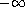 的整数

**libraries:** `(rnrs base)`, `(rnrs)`

如果 `*real*` 是无穷大或 NaN，则 `floor` 返回 `*real*`。

`(floor 19)  19

(floor 2/3)  0

(floor -2/3)  -1

(floor 17.3)  17.0

(floor -17/2)  -9`

**procedure**: `(ceiling *real*)`

**returns:** 最接近 `*real*` 且朝 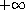 的整数

**libraries:** `(rnrs base)`, `(rnrs)`

如果 `*real*` 是无穷大或 NaN，则 `ceiling` 返回 `*real*`。

`(ceiling 19)  19

(ceiling 2/3)  1

(ceiling -2/3)  0

(ceiling 17.3)  18.0

(ceiling -17/2)  -8`

**过程：** `(round *real*)`

**返回：** 最接近`*real*`的整数

**库：** `(rnrs base)`，`(rnrs)`

如果`*real*`恰好介于两个整数之间，���返回最接近的偶数。如果`*real*`是无穷大或 NaN，则`round`返回`*real*`。

`(round 19)  19

(round 2/3)  1

(round -2/3)  -1

(round 17.3)  17.0

(round -17/2)  -8

(round 2.5)  2.0

(round 3.5)  4.0`

**过程：** `(abs *real*)`

**返回：** `*real*`的绝对值

**库：** `(rnrs base)`，`(rnrs)`

`abs`等同于`(lambda (x) (if (< x 0) (- x) x))`。对于实数输入，`abs`和`magnitude`（见第 183 页）是相同的。

`(abs 1)  1

(abs -3/4)  3/4

(abs 1.83)  1.83

(abs -0.093)  0.093`

**过程：** `(max *real[1]* *real[2]* ...)`

**返回：** `*real[1]* *real[2]* ...`的最大值

**库：** `(rnrs base)`，`(rnrs)`

`(max 4 -7 2 0 -6)  4

(max 1/2 3/4 4/5 5/6 6/7)  6/7

(max 1.5 1.3 -0.3 0.4 2.0 1.8)  2.0

(max 5 2.0)  5.0

(max -5 -2.0)  -2.0

(let ([ls '(7 3 5 2 9 8)])

(apply max ls))  9`

**过程：** `(min *real[1]* *real[2]* ...)`

**返回：** `*real[1]* *real[2]* ...`的最小值

**库：** `(rnrs base)`，`(rnrs)`

`(min 4 -7 2 0 -6)  -7

(min 1/2 3/4 4/5 5/6 6/7)  1/2

(min 1.5 1.3 -0.3 0.4 2.0 1.8)  -0.3

(min 5 2.0)  2.0

(min -5 -2.0)  -5.0

(let ([ls '(7 3 5 2 9 8)])

(apply min ls))  2`

**过程：** `(gcd *int* ...)`

**返回：** 参数`*int* ...`的最大公约数

**库：** `(rnrs base)`，`(rnrs)`

结果始终为非负数，即-1 的因子被忽略。当没有参数时，`gcd`返回 0。

`(gcd)  0

(gcd 34)  34

(gcd 33.0 15.0)  3.0

(gcd 70 -42 28)  14`

**过程：** `(lcm *int* ...)`

**返回：** 参数`*int* ...`的最小公倍数

**库：** `(rnrs base)`，`(rnrs)`

结果始终为非负数，即-1 的公共倍数被忽略。虽然`lcm`在没有参数的情况下应该返回，但它被定义为返回 1。如果一个或多个参数为 0，`lcm`返回 0。

`(lcm)  1

(lcm 34)  34

(lcm 33.0 15.0)  165.0

(lcm 70 -42 28)  420

(lcm 17.0 0)  0.0`

**procedure**: `(expt *num[1]* *num[2]*)`

**returns:** `*num[1]*` 的 `*num[2]*` 次方

**libraries:** `(rnrs base)`, `(rnrs)`

如果两个参数都是 0，则 `expt` 返回 1。

`(expt 2 10)  1024

(expt 2 -10)  1/1024

(expt 2 -10.0)  9.765625e-4

(expt -1/2 5)  -1/32

(expt 3.0 3)  27.0

(expt +i 2)  -1`

**procedure**: `(inexact *num*)`

**returns:** `*num*` 的非精确表示

**libraries:** `(rnrs base)`, `(rnrs)`

如果 `*num*` 已经是非精确的，则返回不变。如果实现不支持 `*num*` 的非精确表示，可能会引发带有条件类型 `&implementation-violation` 的异常。对于超出实现的非精确数表示范围的输入，`inexact` 也可能返回 `+inf.0` 或 `-inf.0`。

`(inexact 3)  3.0

(inexact 3.0)  3.0

(inexact -1/4)  -.25

(inexact 3+4i)  3.0+4.0i

(inexact (expt 10 20))  1e20`

**procedure**: `(exact *num*)`

**returns:** `*num*` 的精确表示

**libraries:** `(rnrs base)`, `(rnrs)`

如果 `*num*` 已经是精确的，则返回不变。如果实现不支持 `*num*` 的精确表示，可能会引发带有条件类型 `&implementation-violation` 的异常。

`(exact 3.0)  3

(exact 3)  3

(exact -.25)  -1/4

(exact 3.0+4.0i)  3+4i

(exact 1e20)  100000000000000000000`

**procedure**: `(exact->inexact *num*)`

**returns:** `*num*` 的非精确表示

**procedure**: `(inexact->exact *num*)`

**returns:** `*num*` 的精确表示

**libraries:** `(rnrs r5rs)`

这些是对 `inexact` 和 `exact` 的替代名称，用于与 Revised⁵ Report 兼容。

**procedure**: `(rationalize *real[1]* *real[2]*)`

**returns:** 见下文

**libraries:** `(rnrs base)`, `(rnrs)`

`rationalize` 返回与 `*real[1]*` 最多相差 `*real[2]*` 的最简有理数。有理数 *q*[1] = *n*[1]/*m*[1] 比另一个有理数 *q*[2] = *n*[2]/*m*[2] 更简单，如果 |*n*[1]| ≤ |*n*[2]| 且 |*m*[1]| ≤ |*m*[2]|，并且 |*n*[1]| < |*n*[2]| 或 |*m*[1]| < |*m*[2]|.

`(rationalize 3/10 1/10)  1/3

(rationalize .3 1/10)  0.3333333333333333

(eqv? (rationalize .3 1/10) #i1/3)  #t`

**procedure**: `(numerator *rat*)`

**returns:** `*rat*` 的分子

**libraries:** `(rnrs base)`, `(rnrs)`

如果 `*rat*` 是整数，则分子是 `*rat*`。

`(numerator 9)  9

(numerator 9.0)  9.0

(numerator 0.0)  0.0

(numerator 2/3)  2

(numerator -9/4)  -9

(numerator -2.25)  -9.0`

**procedure**: `(denominator *rat*)`

**returns:** the denominator of `*rat*`

**libraries:** `(rnrs base)`, `(rnrs)`

If `*rat*` is an integer, including zero, the denominator is one.

`(denominator 9)  1

(denominator 9.0)  1.0

(denominator 0)  1

(denominator 0.0)  1.0

(denominator 2/3)  3

(denominator -9/4)  4

(denominator -2.25)  4.0`

**procedure**: `(real-part *num*)`

**returns:** the real component of `*num*`

**libraries:** `(rnrs base)`, `(rnrs)`

If `*num*` is real, `real-part` returns `*num*`.

`(real-part 3+4i)  3

(real-part -2.3+0.7i)  -2.3

(real-part -i)  0

(real-part 17.2)  17.2

(real-part -17/100)  -17/100`

**procedure**: `(imag-part *num*)`

**returns:** the imaginary component of `*num*`

**libraries:** `(rnrs base)`, `(rnrs)`

If `*num*` is real, `imag-part` returns exact zero.

`(imag-part 3+4i)  4

(imag-part -2.3+0.7i)  0.7

(imag-part -i)  -1

(imag-part -2.5)  0

(imag-part -17/100)  0`

**procedure**: `(make-rectangular *real[1]* *real[2]*)`

**returns:** a complex number with real component `*real[1]*` and imaginary component `*real[2]*`

**libraries:** `(rnrs base)`, `(rnrs)`

`(make-rectangular -2 7)  -2+7i

(make-rectangular 2/3 -1/2)  2/3-1/2i

(make-rectangular 3.2 5.3)  3.2+5.3i`

**procedure**: `(make-polar *real[1]* *real[2]*)`

**returns:** a complex number with magnitude `*real[1]*` and angle `*real[2]*`

**libraries:** `(rnrs base)`, `(rnrs)`

`(make-polar 2 0)  2

(make-polar 2.0 0.0)  2.0+0.0i

(make-polar 1.0 (asin -1.0))  0.0-1.0i

(eqv? (make-polar 7.2 -0.588) 7.2@-0.588)  #t`

**procedure**: `(angle *num*)`

**returns:** the angle part of the polar representation of `*num*`

**libraries:** `(rnrs base)`, `(rnrs)`

The range of the result is 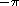 (exclusive) to 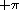 (inclusive).

`(angle 7.3@1.5708)  1.5708

(angle 5.2)  0.0`

**procedure**: `(magnitude *num*)`

**returns:** the magnitude of `*num*`

**libraries:** `(rnrs base)`, `(rnrs)`

`magnitude` and `abs` (see page 178) are identical for real arguments. The magnitude of a complex number *x* + *yi* is 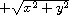.

`(magnitude 1)  1

(magnitude -3/4)  3/4

(magnitude 1.83)  1.83

(magnitude -0.093)  0.093

(magnitude 3+4i)  5

(magnitude 7.25@1.5708)  7.25`

**过程**: `(sqrt *num*)`

**返回**: `*num*` 的主平方根

**库**: `(rnrs base)`, `(rnrs)`

当可行时，鼓励但不要求实现对 `sqrt` 的确切输入返回确切结果。

`(sqrt 16)  4

(sqrt 1/4)  1/2

(sqrt 4.84)  2.2

(sqrt -4.84)  0.0+2.2i

(sqrt 3+4i)  2+1i

(sqrt -3.0-4.0i)  1.0-2.0i`

**过程**: `(exact-integer-sqrt *n*)`

**返回**: 见下文

**库**: `(rnrs base)`, `(rnrs)`

此过程返回两个非负确切整数 *s* 和 *r*，其中 *n* = *s*² + *r*，且 *n* < (*s* + 1)²。

`(exact-integer-sqrt 0)  0

 0

(exact-integer-sqrt 9)  3

 0

(exact-integer-sqrt 19)  4

 3`

**过程**: `(exp *num*)`

**返回**: *e* 的 `*num*` 次方

**库**: `(rnrs base)`, `(rnrs)`

`(exp 0.0)  1.0

(exp 1.0)  2.7182818284590455

(exp -.5)  0.6065306597126334`

**过程**: `(log *num*)`

**返回**: `*num*` 的自然对数

**过程**: `(log *num[1]* *num[2]*)`

**返回**: `*num[1]*` 的以 `*num[2]*` 为底的对数

**库**: `(rnrs base)`, `(rnrs)`

`(log 1.0)  0.0

(log (exp 1.0))  1.0

(/ (log 100) (log 10))  2.0

(log (make-polar (exp 2.0) 1.0))  2.0+1.0i

(log 100.0 10.0)  2.0

(log .125 2.0)  -3.0`

**过程**: `(sin *num*)`

**过程**: `(cos *num*)`

**过程**: `(tan *num*)`

**返回**: `*num*` 的正弦、余弦或正切

**库**: `(rnrs base)`, `(rnrs)`

参数以弧度指定。

`(sin 0.0)  0.0

(cos 0.0)  1.0

(tan 0.0)  0.0`

**过程**: `(asin *num*)`

**过程**: `(acos *num*)`

**返回**: `*num*` 的反正弦或反余弦

**库**: `(rnrs base)`, `(rnrs)`

结果以弧度表示。 复数 *z* 的反正弦和反余弦定义如下。

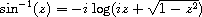

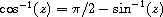

`(define pi (* (asin 1) 2))

(= (* (acos 0) 2) pi)  #t`

**过程**: `(atan *num*)`

**过程**: `(atan *real[1]* *real[2]*)`

**返回**: 见下文

**库**: `(rnrs base)`, `(rnrs)`

当传递单个复数参数 `*num*`（第一种形式）时，`atan` 返回 `*num*` 的反正切。 复数 *z* 的反正切定义如下。

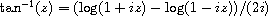

当传递两个实数参数（第二种形式）时，`atan` 等效于 `(lambda (y x) (angle (make-rectangular x y)))`。

`(define pi (* (atan 1) 4))

(= (* (atan 1.0 0.0) 2) pi)  #t`

**过程**: `(按位非 *exint*)`

**返回**: `*exint*`的按位非

**过程**: `(按位与 *exint* ...)`

**返回**: `*exint* ...`的按位与

**过程**: `(按位或 *exint* ...)`

**返回**: `*exint* ...`的按位或

**过程**: `(按位异或 *exint* ...)`

**返回**: `*exint* ...`的按位异或

**库**: `(rnrs 算术 按位)`, `(rnrs)`

即使内部表示方式不是以二进制补码表示，输入也会被视为以二进制补码表示。

`(按位非 0)  -1

(按位非 3)  -4

(按位与 #b01101 #b00111)  #b00101

(按位或 #b01101 #b00111)  #b01111

(按位异或 #b01101 #b00111)  #b01010`

**过程**: `(按位 if *exint[1]* *exint[2]* *exint[3]*)`

**返回**: 其参数的按位“if”

**库**: `(rnrs 算术 按位)`, `(rnrs)`

即使内部表示方式不是以二进制补码表示，输入也会被视为以二进制补码表示。

对于`*exint[1]*`中设置的每个位，结果的相应位取自`*exint[2]*`，对于`*exint[1]*`中未设置的每个位，结果的相应位取自`*x[3]*`。

`(按位 if #b101010 #b111000 #b001100)  #b101100`

`按位 if`可能定义如下：

`(定义 按位 if

(lambda (exint1 exint2 exint3)

(按位或

(按位与 exint1 exint2)

(按位与 (按位非 exint1) exint3))))`

**过程**: `(按位计数 *exint*)`

**返回**: 见下文

**库**: `(rnrs 算术 按位)`, `(rnrs)`

对于非负输入，`按位计数`返回`*exint*`的二进制补码表示中设置的位数。对于负输入，它返回一个负数，其大小比`*exint*`的二进制补码表示中未设置的位数多一个，这等效于`(按位非 (按位计数 (按位非 *exint*)))`。

`(按位计数 #b00000)  0

(按位计数 #b00001)  1

(按位计数 #b00100)  1

(按位计数 #b10101)  3

(按位计数 -1)  -1

(按位计数 -2)  -2

(按位计数 -4)  -3`

**过程**: `(按位长度 *exint*)`

**返回**: 见下文

**库**: `(rnrs 算术 按位)`, `(rnrs)`

该过程返回`*exint*`的最小二进制补码表示的位数，不包括负数的符号位。对于 0，`按位长度`返回 0。

`(按位长度 #b00000)  0

(按位长度 #b00001)  1

(按位长度 #b00100)  3

(按位长度 #b00110)  3

(bitwise-length -1)  0

(bitwise-length -6)  3

(bitwise-length -9)  4`

**procedure**: `(bitwise-first-bit-set *exint*)`

**returns:** `*exint*`中设置的最低有效位的���引

**libraries:** `(rnrs arithmetic bitwise)`, `(rnrs)`

输入被视为以二进制补码表示，即使内部没有以这种方式表示。

如果`*exint*`为 0，则`bitwise-first-bit-set`返回-1。

`(bitwise-first-bit-set #b00000)  -1

(bitwise-first-bit-set #b00001)  0

(bitwise-first-bit-set #b01100)  2

(bitwise-first-bit-set -1)  0

(bitwise-first-bit-set -2)  1

(bitwise-first-bit-set -3)  0`

**procedure**: `(bitwise-bit-set? *exint[1]* *exint[2]*)`

**returns:** 如果`*exint[1]*`的第`*exint[2]*`位被设置，则返回`#t`，否则返回`#f`

**libraries:** `(rnrs arithmetic bitwise)`, `(rnrs)`

`*exint[2]*`被视为`*exint[1]*`的二进制补码表示中位的从零开始的索引。非负数的二进制补码表示在左侧（向更重要的位）概念上扩展为无限数量的零位，而负数的二进制补码表示在左侧概念上扩展为无限数量的一位。因此，精确整数可用于表示任意大的集合，其中 0 是空集，-1 是全集，`bitwise-bit-set?`用于测试成员资格。

`(bitwise-bit-set? #b01011 0)  #t

(bitwise-bit-set? #b01011 2)  #f

(bitwise-bit-set? -1 0)  #t

(bitwise-bit-set? -1 20)  #t

(bitwise-bit-set? -3 1)  #f

(bitwise-bit-set? 0 5000)  #f

(bitwise-bit-set? -1 5000)  #t`

**procedure**: `(bitwise-copy-bit *exint[1]* *exint[2]* *exint[3]*)`

**returns:** `*exint[1]*`的第`*exint[2]*`位被`*exint[3]*`替换后的结果

**libraries:** `(rnrs arithmetic bitwise)`, `(rnrs)`

`*exint[2]*`被视为`*exint[1]*`的二进制补码表示中位的从零开始的索引。`*exint[3]*`必须为 0 或 1。该过程根据`*exint[3]*`的值有效地清除或设置指定的位。即使内部没有以二进制补码表示，也会将`*exint[1]*`视为以二进制补码表示。

`(bitwise-copy-bit #b01110 0 1)  #b01111

(bitwise-copy-bit #b01110 2 0)  #b01010`

**procedure**: `(bitwise-bit-field *exint[1]* *exint[2]* *exint[3]*)`

**returns:** 请参见下文

**libraries:** `(rnrs arithmetic bitwise)`, `(rnrs)`

`*exint[2]*` 和 `*exint[3]*` 必须是非负数，且 `*exint[2]*` 不能大于 `*exint[3]*`。此过程返回从 `*exint[1]*` 中提取的位序列，从 `*exint[2]*`（包括）到 `*exint[3]*`（不包括）。`*exint[1]*` 被视为二进制补码表示，即使内部并非如此。

`(位位域 #b10110 0 3)  #b00110

(位位域 #b10110 1 3)  #b00011

(位位域 #b10110 2 3)  #b00001

(位位域 #b10110 3 3)  #b00000`

**procedure**: `(位复制位域 *exint[1]* *exint[2]* *exint[3]* *exint[4]*)`

**returns:** 详见下文

**libraries:** `(rnrs 算术 位运算)`, `(rnrs)`

`*exint[2]*` 和 `*exint[3]*` 必须是非负数，且 `*exint[2]*` 不能大于 `*exint[3]*`。此过程返回 `*exint[1]*`，其从 `*exint[2]*`（包括）到 `*exint[3]*`（不包括）的 `*n*` 位被替换为 `*exint[4]*` 的低阶 `*n*` 位。`*exint[1]*` 和 `*exint[4]*` 被视为二进制补码表示，即使内部并非如此。

`(位复制位域 #b10000 0 3 #b10101)  #b10101

(位复制位域 #b10000 1 3 #b10101)  #b10010

(位复制位域 #b10000 2 3 #b10101)  #b10100

(位复制位域 #b10000 3 3 #b10101)  #b10000`

**procedure**: `(位算术右移 *exint[1]* *exint[2]*)`

**returns:** `*exint[1]*` 被算术右移 `*exint[2]*` 位

**procedure**: `(位算术左移 *exint[1]* *exint[2]*)`

**returns:** `*exint[1]*` 左移 `*exint[2]*` 位

**libraries:** `(rnrs 算术 位运算)`, `(rnrs)`

`*exint[2]*` 必须是非负数。`*exint[1]*` 被视为二进制补码表示，即使内部并非如此。

`(位算术右移 #b10000 3)  #b00010

(位算术右移 -1 1)  -1

(位算术右移 -64 3)  -8

(位算术左移 #b00010 2)  #b01000

(位算术左移 -1 2)  -4`

**procedure**: `(位算术移位 *exint[1]* *exint[2]*)`

**returns:** 详见下文

**libraries:** `(rnrs 算术 位运算)`, `(rnrs)`

如果 `*exint[2]*` 为负数，则 `位算术移位` 返回将 `*exint[1]*` 右移 `*exint[2]*` 位的结果。否则，`位算术移位` 返回将 `*exint[1]*` 左移 `*exint[2]*` 位的结果。`*exint[1]*` 被视为二进制补码表示，即使内部并非如此。

`(位算术移位 #b10000 -3)  #b00010

(位算术移位 -1 -1)  -1

(bitwise-arithmetic-shift -64 -3)  -8

(bitwise-arithmetic-shift #b00010 2)  #b01000

(bitwise-arithmetic-shift -1 2)  -4`

因此，`bitwise-arithmetic-shift`的行为就像是这样定义的。

`(define bitwise-arithmetic-shift

(lambda (exint1 exint2)

(if (< exint2 0)

(bitwise-arithmetic-shift-right exint1 (- exint2))

(bitwise-arithmetic-shift-left exint1 exint2))))`

**过程：** `(bitwise-rotate-bit-field *exint[1]* *exint[2]* *exint[3]* *exint[4]*)`

**返回：** 见下文

**库：** `(rnrs arithmetic bitwise)`，`(rnrs)`

`*exint[2]*`，`*exint[3]*`和`*exint[4]*`必须是非负的，且`*exint[2]*`不能大于`*exint[3]*`。该过程返回将`*exint[1]*`从第`*exint[2]*`位（包括）到第`*exint[3]*`位（不包括）左移`(mod *exint[4]* (- *exint[3]* *exint[2]*))`位后的结果，超出范围的位插入到范围的底端。即使内部没有以补码表示，`*exint[1]*`也被视为以补码表示。

`(bitwise-rotate-bit-field #b00011010 0 5 3)  #b00010110

(bitwise-rotate-bit-field #b01101011 2 7 3)  #b01011011`

**过程：** `(bitwise-reverse-bit-field *exint[1]* *exint[2]* *exint[3]*)`

**返回：** 见下文

**库：** `(rnrs arithmetic bitwise)`，`(rnrs)`

`*exint[2]*`和`*exint[3]*`必须是非负的，且`*exint[2]*`不能大于`*exint[3]*`。该过程返回将`*exint[1]*`从第`*exint[2]*`位（包括）到第`*exint[3]*`位（不包括）反转后的结果。即使内部没有以补码表示，`*exint[1]*`也被视为以补码表示。

`(bitwise-reverse-bit-field #b00011010 0 5)  #b00001011

(bitwise-reverse-bit-field #b01101011 2 7)  #b00101111`

**过程：** `(string->number *string*)`

**过程：** `(string->number *string* *radix*)`

**返回：** 由`*string*`表示的数字，或`#f`

**库：** `(rnrs base)`，`(rnrs)`

如果`*string*`是一个有效的数字表示，那么返回该数字，否则返回`#f`。数字在基数`*radix*`中解释，必须是集合{2,8,10,16}中的一个精确整数。如果未指定，默认为 10。`*string*`中的任何基数说明符，例如`#x`，都会覆盖`*radix*`参数。

`(string->number "0")  0

(string->number "3.4e3")  3400.0

(string->number "#x#e-2e2")  -738

(string->number "#e-2e2" 16)  -738

(string->number "#i15/16")  0.9375

(string->number "10" 16)  16`

**过程：** `(number->string *num*)`

**过程：** `(number->string *num* *radix*)`

**过程：** `(number->string *num* *radix* *precision*)`

**返回值：** 将 `*num*` 的外部表示转换为字符串。

**库：** `(rnrs base)`，`(rnrs)`

num 用基数 `*radix*` 表示，`*radix*` 必须是集合 {2,8,10,16} 中的精确整数。如果未指定，则 `*radix*` 默认为 10。在任何情况下，结果字符串中不会出现基数说明符。

外部表示的特点是，当使用 `string->number` 转换回数字时，结果数值等效于 `*num*`。也就是说，对于所有输入：

`(eqv? (string->number

(number->string *num* *radix*)

*基数*)

*num*)`

返回 `#t`。如果不可能，则引发条件类型为 `&implementation-restriction` 的异常。

如果提供了 `*precision*`，则它必须是一个精确的正整数，`*num*` 必须是不精确的，`*radix*` 必须是 10。在这种情况下，数的实部和，如果存在，数的虚部都将以显式的尾数宽度 `*m*` 打印出来，其中 `*m*` 是使上述表达式成立的大于或等于 `*precision*` 的最小可能值。

如果 `*radix*` 是 10，则 `*num*` 的不精确值使用可能的最少数量的有效数字表示 [5]，以不违反上述限制。

`(number->string 3.4)  "3.4"

(number->string 1e2)  "100.0"

(number->string 1e-23)  "1e-23"

(number->string -7/2)  "-7/2"

(number->string 220/9 16)  "DC/9"`

### 第 6.5 节。固定整数

*Fixnums* 表示固定范围内的精确整数，该范围要求是一个封闭范围 [-2^(*w*-1),2^(*w*-2) - 1]，其中 *w*（*固定整数宽度*）至少为 24。通过过程 `fixnum-width` 可以确定 *w* 的实现特定值，并且通过过程 `least-fixnum` 和 `greatest-fixnum` 可以确定范围的端点。

仅对固定整数进行操作的算术过程的名称以前缀“`fx`”开头，以使它们与其通用对应项区分开来。

要求为固定整数的过程参数命名为 `*fx*`，可能带有后缀，例如，`*fx[2]*`。

除非另有规定，否则固定整数特定过程的数值均为固定整数。如果固定整数操作的值应为固定整数，但数学结果超出了固定整数范围，则会引发条件类型为 `&implementation-restriction` 的异常。

对于固定整数的位和移位操作假定固定整数采用二进制补码表示，即使在内部未以此方式表示它们。

**过程：** `(fixnum? *obj*)`

**返回值：** 如果 `*obj*` 是固定整数，则返回 `#t`，否则返回 `#f`。

**库：** `(rnrs arithmetic fixnums)`，`(rnrs)`

`(fixnum? 0)  #t

(fixnum? -1)  #t

(fixnum? (- (expt 2 23)))  #t

(fixnum? (- (expt 2 23) 1))  #t`

**过程：** `(least-fixnum)`

**returns:** 支持的实现中最小（最负数）的 fixnum

**procedure**: `(greatest-fixnum)`

**returns:** 支持的实现中最大（最正数）的 fixnum

**libraries:** `(rnrs arithmetic fixnums)`, `(rnrs)`

`(fixnum? (- (least-fixnum) 1))  #f

(fixnum? (least-fixnum))  #t

(fixnum? (greatest-fixnum))  #t

(fixnum? (+ (greatest-fixnum) 1))  #f`

**procedure**: `(fixnum-width)`

**returns:** 实现相关的*fixnum 宽度*

**libraries:** `(rnrs arithmetic fixnums)`, `(rnrs)`

如本节导言所述，fixnum 宽度确定了 fixnum 范围的大小，必须至少为 24。

`(define w (fixnum-width))

(= (least-fixnum) (- (expt 2 (- w 1))))  #t

(= (greatest-fixnum) (- (expt 2 (- w 1)) 1))  #t

(>= w 24)  #t`

**procedure**: `(fx=? *fx[1]* *fx[2]* *fx[3]* ...)`

**procedure**: `(fx<? *fx[1]* *fx[2]* *fx[3]* ...)`

**procedure**: `(fx>? *fx[1]* *fx[2]* *fx[3]* ...)`

**procedure**: `(fx<=? *fx[1]* *fx[2]* *fx[3]* ...)`

**procedure**: `(fx>=? *fx[1]* *fx[2]* *fx[3]* ...)`

**returns:** 如果关系成立则返回`#t`，否则返回`#f`

**libraries:** `(rnrs arithmetic fixnums)`, `(rnrs)`

谓词`fx=?`在其参数相等时返回`#t`。谓词`fx<?`在其参数单调递增时返回`#t`，即每个参数都大于前面的参数，而`fx>?`在其参数单调递减时返回`#t`。谓词`fx<=?`在其参数单调不减时返回`#t`，即每个参数都不小于前面的参数，而`fx>=?`在其参数单调不增时返回`#t`。

`(fx=? 0 0)  #t

(fx=? -1 1)  #f

(fx<? (least-fixnum) 0 (greatest-fixnum))  #t

(let ([x 3]) (fx<=? 0 x 9))  #t

(fx>? 5 4 3 2 1)  #t

(fx<=? 1 3 2)  #f

(fx>=? 0 0 (least-fixnum))  #t`

**procedure**: `(fxzero? *fx*)`

**returns:** 如果`*fx*`为零则返回`#t`，否则返回`#f`

**procedure**: `(fxpositive? *fx*)`

**returns:** 如果`*fx*`大于零则返回`#t`，否则返回`#f`

**procedure**: `(fxnegative? *fx*)`

**returns:** 如果`*fx*`小于零则返回`#t`，否则返回`#f`

**libraries:** `(rnrs arithmetic fixnums)`, `(rnrs)`

`fxzero?`等同于`(lambda (x) (fx=? x 0))`，`fxpositive?`等同于`(lambda (x) (fx>? x 0))`，而`fxnegative?`等同于`(lambda (x) (fx<? x 0))`。

`(fxzero? 0)  #t

(fxzero? 1)  #f

(fxpositive? 128)  #t

(fxpositive? 0)  #f

(fxpositive? -1)  #f

(fxnegative? -65)  #t

(fxnegative? 0)  #f

(fxnegative? 1)  #f`

**procedure**: `(fxeven? *fx*)`

**returns:** 如果 `*fx*` 是偶数则为 `#t`，否则为 `#f`

**procedure**: `(fxodd? *fx*)`

**returns:** 如果 `*fx*` 是奇数则为 `#t`，否则为 `#f`

**libraries:** `(rnrs arithmetic fixnums)`, `(rnrs)`

`(fxeven? 0)  #t

(fxeven? 1)  #f

(fxeven? -1)  #f

(fxeven? -10)  #t

(fxodd? 0)  #f

(fxodd? 1)  #t

(fxodd? -1)  #t

(fxodd? -10)  #f`

**procedure**: `(fxmin *fx[1]* *fx[2]* ...)`

**returns:** `*fx[1]*` `*fx[2]*` ... 的最小值

**procedure**: `(fxmax *fx[1]* *fx[2]* ...)`

**returns:** `*fx[1]*` `*fx[2]*` ... 的最大值

**libraries:** `(rnrs arithmetic fixnums)`, `(rnrs)`

`(fxmin 4 -7 2 0 -6)  -7

(let ([ls '(7 3 5 2 9 8)])

(apply fxmin ls))  2

(fxmax 4 -7 2 0 -6)  4

(let ([ls '(7 3 5 2 9 8)])

(apply fxmax ls))  9`

**procedure**: `(fx+ *fx[1]* *fx[2]*)`

**returns:** `*fx[1]*` 和 `*fx[2]*` 的和

**libraries:** `(rnrs arithmetic fixnums)`, `(rnrs)`

`(fx+ -3 4)  1`

**procedure**: `(fx- *fx*)`

**returns:** `*fx*` 的加法逆元

**procedure**: `(fx- *fx[1]* *fx[2]*)`

**returns:** `*fx[1]*` 和 `*fx[2]*` 的差

**libraries:** `(rnrs arithmetic fixnums)`, `(rnrs)`

`(fx- 3)  -3

(fx- -3 4)  -7`

**procedure**: `(fx* *fx[1]* *fx[2]*)`

**returns:** `*fx[1]*` 和 `*fx[2]*` 的乘积

**libraries:** `(rnrs arithmetic fixnums)`, `(rnrs)`

`(fx* -3 4)  -12`

**procedure**: `(fxdiv *fx[1]* *fx[2]*)`

**procedure**: `(fxmod *fx[1]* *fx[2]*)`

**procedure**: `(fxdiv-and-mod *fx[1]* *fx[2]*)`

**returns:** 见下文

**libraries:** `(rnrs arithmetic fixnums)`, `(rnrs)`

`*fx[2]*` 不能为零。这些是通用 `div`、`mod` 和 `div-and-mod` 的 fixnum 版本。

`(fxdiv 17 3)  5

(fxmod 17 3)  2

(fxdiv -17 3)  -6

(fxmod -17 3)  1

(fxdiv 17 -3)  -5

(fxmod 17 -3)  2

(fxdiv -17 -3)  6

(fxmod -17 -3)  1

(fxdiv-and-mod 17 3)  5

 2`

**procedure**: `(fxdiv0 *fx[1]* *fx[2]*)`

**procedure**: `(fxmod0 *fx[1]* *fx[2]*)`

**procedure**: `(fxdiv0-and-mod0 *fx[1]* *fx[2]*)`

**returns:** 见下文

**libraries:** `(rnrs arithmetic fixnums)`, `(rnrs)`

`*fx[2]*` 不能为零。这些是通用 `div0`、`mod0` 和 `div0-and-mod0` 的 fixnum 版本。

`(fxdiv0 17 3)  6

(fxmod0 17 3)  -1

(fxdiv0 -17 3)  -6

(fxmod0 -17 3)  1

(fxdiv0 17 -3)  -6

(fxmod0 17 -3)  -1

(fxdiv0 -17 -3)  6

(fxmod0 -17 -3)  1

(fxdiv0-and-mod0 17 3)  6

 -1`

**procedure**: `(fx+/carry *fx[1]* *fx[2]* *fx[3]*)`

**procedure**: `(fx-/carry *fx[1]* *fx[2]* *fx[3]*)`

**procedure**: `(fx*/carry *fx[1]* *fx[2]* *fx[3]*)`

**returns:** 见下文

**libraries:** `(rnrs arithmetic fixnums)`, `(rnrs)`

当普通的 fixnum 加法、减法或乘法操作溢出时，会引发异常。这些替代过程反而返回一个进位，并允许进位传播到下一个操作。它们可用于实现多精度算术的可移植代码。

这些过程返回以下计算的两个 fixnum 值。对于 `fx+/carry`：

`(let* ([s (+ *fx[1]* *fx[2]* *fx[3]*)]

[s0 (mod0 s (expt 2 (fixnum-width)))]

[s1 (div0 s (expt 2 (fixnum-width)))])

(values s0 s1))`

对于 `fx-/carry`：

`(let* ([d (- *fx[1]* *fx[2]* *fx[3]*)]

[d0 (mod0 d (expt 2 (fixnum-width)))]

[d1 (div0 d (expt 2 (fixnum-width)))])

(values d0 d1))`

对于 `fx*/carry`：

`(let* ([s (+ (* *fx[1]* *fx[2]*) *fx[3]*)]

[s0 (mod0 s (expt 2 (fixnum-width)))]

[s1 (div0 s (expt 2 (fixnum-width)))])

(values s0 s1))`

**procedure**: `(fxnot *fx*)`

**returns:** `*fx*` 的按位非

**procedure**: `(fxand *fx* ...)`

**returns:** `*fx* ...` 的按位与

**procedure**: `(fxior *fx* ...)`

**returns:** `*fx* ...` 的按位或

**procedure**: `(fxxor *fx* ...)`

**returns:** `*fx* ...` 的按位异或

**libraries:** `(rnrs arithmetic fixnums)`, `(rnrs)`

`(fxnot 0)  -1

(fxnot 3)  -4

(fxand #b01101 #b00111)  #b00101

(fxior #b01101 #b00111)  #b01111

(fxxor #b01101 #b00111)  #b01010`

**procedure**: `(fxif *fx[1]* *fx[2]* *fx[3]*)`

**returns:** 其参数的按位“if”

**libraries:** `(rnrs arithmetic fixnums)`, `(rnrs)`

对于 `*fx[1]*` 中的每个设置位，结果的相应位取自 `*fx[2]*`，对于 `*fx[1]*` 中每个未设置的位，结果的相应位取自 `*x[3]*`。

`(fxif #b101010 #b111000 #b001100)  #b101100`

`fxif` 可能定义如下：

`(define fxif

(lambda (fx1 fx2 fx3)

(fxior (fxand fx1 fx2)

(fxand (fxnot fx1) fx3))))`

**procedure**: `(fxbit-count *fx*)`

**returns:** 见下文

**libraries:** `(rnrs arithmetic fixnums)`, `(rnrs)`

对于非负输入，`fxbit-count` 返回在 `*fx*` 的二进制补码表示中设置的位数。对于负输入，它返回一个负数，其大小比 `*fx*` 中未设置的位数多一个，这等效于 `(fxnot (fxbit-count (fxnot *fx*)))`。

`(fxbit-count #b00000)  0

(fxbit-count #b00001)  1

(fxbit-count #b00100)  1

(fxbit-count #b10101)  3

(fxbit-count -1)  -1

(fxbit-count -2)  -2

(fxbit-count -4)  -3`

**procedure**: `(fxlength *fx*)`

**returns:** 请见下文

**libraries:** `(rnrs arithmetic fixnums)`, `(rnrs)`

此过程返回`*fx*`的最小二进制补码表示的位数，不包括负数的符号位。对于 0，`fxlength`返回 0。

`(fxlength #b00000)  0

(fxlength #b00001)  1

(fxlength #b00100)  3

(fxlength #b00110)  3

(fxlength -1)  0

(fxlength -6)  3

(fxlength -9)  4`

**procedure**: `(fxfirst-bit-set *fx*)`

**returns:** `*fx*`中最低有效位的索引

**libraries:** `(rnrs arithmetic fixnums)`, `(rnrs)`

如果`*fx*`为 0，则`fxfirst-bit-set`返回-1。

`(fxfirst-bit-set #b00000)  -1

(fxfirst-bit-set #b00001)  0

(fxfirst-bit-set #b01100)  2

(fxfirst-bit-set -1)  0

(fxfirst-bit-set -2)  1

(fxfirst-bit-set -3)  0`

**procedure**: `(fxbit-set? *fx[1]* *fx[2]*)`

**returns:** 如果`*fx[1]*`的第`*fx[2]*`位被设置，则返回`#t`，否则返回`#f`

**libraries:** `(rnrs arithmetic fixnums)`, `(rnrs)`

`*fx[2]*`必须是非负的。它被视为`*fx[1]*`的二进制补码表示中位的基于零的索引，符号位在左侧被虚拟地复制了无限多次。

`(fxbit-set? #b01011 0)  #t

(fxbit-set? #b01011 2)  #f

(fxbit-set? -1 0)  #t

(fxbit-set? -1 20)  #t

(fxbit-set? -3 1)  #f

(fxbit-set? 0 (- (fixnum-width) 1))  #f

(fxbit-set? -1 (- (fixnum-width) 1))  #t`

**procedure**: `(fxcopy-bit *fx[1]* *fx[2]* *fx[3]*)`

**returns:** `*fx[1]*`的第`*fx[2]*`位被`*fx[3]*`替换后的结果

**libraries:** `(rnrs arithmetic fixnums)`, `(rnrs)`

`*fx[2]*`必须是非负的，并且小于`(- (fixnum-width) 1)`的值。`*fx[3]*`必须是 0 或 1。根据`*fx[3]*`的值，此过程有效地清除或设置指定的位。

`(fxcopy-bit #b01110 0 1)  #b01111

(fxcopy-bit #b01110 2 0)  #b01010`

**procedure**: `(fxbit-field *fx[1]* *fx[2]* *fx[3]*)`

**returns:** 请见���文

**libraries:** `(rnrs arithmetic fixnums)`, `(rnrs)`

`*fx[2]*`和`*fx[3]*`必须是非负的，并且小于`(fixnum-width)`的值，且`*fx[2]*`不能大于`*fx[3]*`。此过程返回从`*fx[1]*`中提取的位序列，从`*fx[2]*`（包括）到`*fx[3]*`（不包括）。

`(fxbit-field #b10110 0 3)  #b00110

(fxbit-field #b10110 1 3)  #b00011

(fxbit-field #b10110 2 3)  #b00001

(fxbit-field #b10110 3 3)  #b00000`

**过程：** `(fxcopy-bit-field *fx[1]* *fx[2]* *fx[3]* *fx[4]*)`

**返回：** 请见下文

**libraries:** `(rnrs arithmetic fixnums)`, `(rnrs)`

`*fx[2]*` 和 `*fx[3]*` 必须是非负数且小于 `(fixnum-width)` 的值，且 `*fx[2]*` 不能大于 `*fx[3]*`。该过程返回 `*fx[1]*`，其中从 `*fx[2]*`（包括）到 `*fx[3]*`（不包括）的 `*n*` 位被 `*x[4]*` 的低位 `*n*` 位替换。

`(fxcopy-bit-field #b10000 0 3 #b10101)  #b10101

(fxcopy-bit-field #b10000 1 3 #b10101)  #b10010

(fxcopy-bit-field #b10000 2 3 #b10101)  #b10100

(fxcopy-bit-field #b10000 3 3 #b10101)  #b10000`

**过程：** `(fxarithmetic-shift-right *fx[1]* *fx[2]*)`

**返回：** `*fx[1]*` 算术右移 `*fx[2]*` 位

**过程：** `(fxarithmetic-shift-left *fx[1]* *fx[2]*)`

**返回：** `*fx[1]*` 左移 `*fx[2]*` 位

**libraries:** `(rnrs arithmetic fixnums)`, `(rnrs)`

`*fx[2]*` 必须是非负数且小于 `(fixnum-width)` 的值。

`(fxarithmetic-shift-right #b10000 3)  #b00010

(fxarithmetic-shift-right -1 1)  -1

(fxarithmetic-shift-right -64 3)  -8

(fxarithmetic-shift-left #b00010 2)  #b01000

(fxarithmetic-shift-left -1 2)  -4`

**过程：** `(fxarithmetic-shift *fx[1]* *fx[2]*)`

**返回：** 请见下文

**libraries:** `(rnrs arithmetic fixnums)`, `(rnrs)`

`*fx[2]*` 的绝对值必须小于 `(fixnum-width)` 的值。如果 `*fx[2]*` 是负数，`fxarithmetic-shift` 返回将 `*fx[1]*` 算术右移 `*fx[2]*` 位的结果。否则，`fxarithmetic-shift` 返回将 `*fx[1]*` 左移 `*fx[2]*` 位的结果。

`(fxarithmetic-shift #b10000 -3)  #b00010

(fxarithmetic-shift -1 -1)  -1

(fxarithmetic-shift -64 -3)  -8

(fxarithmetic-shift #b00010 2)  #b01000

(fxarithmetic-shift -1 2)  -4`

因此，`fxarithmetic-shift` 的行为就像是下面定义的一样。

`(define fxarithmetic-shift

(lambda (fx1 fx2)

(if (fx<? fx2 0)

(fxarithmetic-shift-right fx1 (fx- fx2))

(fxarithmetic-shift-left fx1 fx2))))`

**过程：** `(fxrotate-bit-field *fx[1]* *fx[2]* *fx[3]* *fx[4]*)`

**返回：** 请见下文

**libraries:** `(rnrs arithmetic fixnums)`, `(rnrs)`

`*fx[2]*`、`*fx[3]*` 和 `*fx[4]*` 必须是非负数且小于 `(fixnum-width)` 的值，`*fx[2]*` 不能大于 `*fx[3]*`，且 `*fx[4]*` 不能大于 `*fx[3]*` 和 `*fx[2]*` 之间的差值。

此过程返回将`*fx[1]*`的位从第`*fx[2]*`位（包括）到第`*fx[3]*`位（不包括）左移`*fx[4]*`位的结果，超出范围的位插入到范围的底部。

`(fxrotate-bit-field #b00011010 0 5 3)  #b00010110`

(fxrotate-bit-field #b01101011 2 7 3)  #b01011011`

**过程**：`(fxreverse-bit-field *fx[1]* *fx[2]* *fx[3]*)`

**返回**：见下文

**库**：`(rnrs arithmetic fixnums)`，`(rnrs)`

`*fx[2]*`和`*fx[3]*`必须是非负的且小于`(fixnum-width)`的值，而`*fx[2]*`不能大于`*fx[3]*`。此过程返回从第`*fx[2]*`位（包括）到第`*fx[3]*`位（不包括）反转`*fx[1]*`位的结果。

`(fxreverse-bit-field #b00011010 0 5)  #b00001011`

(fxreverse-bit-field #b01101011 2 7)  #b00101111`

### 第 6.6 节。浮点数

*浮点数*代表不精确的实数。实现必须将任何不精确的实数表示为浮点数，其词法语法不包含竖线和除`e`以外的指数标记，但不需要将任何其他不精确的实数表示为浮点数。

实现通常使用 IEEE 双精度浮点表示浮点数，但不要求实现这样做，甚至不要求使用任何类型的浮点表示，尽管名为“flonum”。

本节描述了对浮点数的操作。特定于浮点数的过程名称以前缀"`fl`"开头，以将它们与其通用对应项区分开来。

必须为浮点数的过程参数以`*fl*`命名，可能带有后缀，例如，`*fl[2]*`。除非另有规定，否则特定于浮点数的过程的数值都是浮点数。

**过程**：`(flonum? *obj*)`

**返回**：如果`*obj*`是浮点数，则返回`#t`，否则返回`#f`

**库**：`(rnrs arithmetic flonums)`，`(rnrs)`

`(flonum? 0)  #f`

(flonum? 3/4)  #f

(flonum? 3.5)  #t

(flonum? .02)  #t

(flonum? 1e10)  #t

(flonum? 3.0+0.0i)  #f`

**过程**：`(fl=? *fl[1]* *fl[2]* *fl[3]* ...)`

**过程**：`(fl<? *fl[1]* *fl[2]* *fl[3]* ...)`

**过程**：`(fl>? *fl[1]* *fl[2]* *fl[3]* ...)`

**过程**：`(fl<=? *fl[1]* *fl[2]* *fl[3]* ...)`

**过程**：`(fl>=? *fl[1]* *fl[2]* *fl[3]* ...)`

**返回**：如果关系成立，则返回`#t`，否则返回`#f`

**库**：`(rnrs arithmetic flonums)`，`(rnrs)`

谓词 `fl=?` 如果其参数相等则返回 `#t`。谓词 `fl<?` 如果其参数单调递增则返回 `#t`，即，每个参数都大于前面的参数，而 `fl>?` 如果其参数单调递减则返回 `#t`。谓词 `fl<=?` 如果其参数单调不减则返回 `#t`，即，每个参数都不小于前面的参数，而 `fl>=?` 如果其参数单调不增则返回 `#t`。当只传递一个参数时，这些谓词中的每一个都返回 `#t`。

涉及 NaN 的比较始终返回 `#f`。

`(fl=? 0.0 0.0)  #t

(fl<? -1.0 0.0 1.0)  #t

(fl>? -1.0 0.0 1.0)  #f

(fl<=? 0.0 3.0 3.0)  #t

(fl>=? 4.0 3.0 3.0)  #t

(fl<? 7.0 +inf.0)  #t

(fl=? +nan.0 0.0)  #f

(fl=? +nan.0 +nan.0)  #f

(fl<? +nan.0 +nan.0)  #f

(fl<=? +nan.0 +inf.0)  #f

(fl>=? +nan.0 +inf.0)  #f`

**procedure**: `(flzero? *fl*)`

**returns:** `#t` 如果 `*fl*` 是零，否则为 `#f`

**procedure**: `(flpositive? *fl*)`

**returns:** `#t` 如果 `*fl*` 大于零，否则为 `#f`

**procedure**: `(flnegative? *fl*)`

**returns:** `#t` 如果 `*fl*` 小于零，否则为 `#f`

**libraries:** `(rnrs arithmetic flonums)`，`(rnrs)`

`flzero?` 等同于 `(lambda (x) (fl=? x 0.0))`，`flpositive?` 等同于 `(lambda (x) (fl>? x 0.0))`，而 `flnegative?` 等同于 `(lambda (x) (fl<? x 0.0))`。

即使 flonum 表示区分了 -0.0 和 +0.0，-0.0 被视为零和非负数。

`(flzero? 0.0)  #t

(flzero? 1.0)  #f

(flpositive? 128.0)  #t

(flpositive? 0.0)  #f

(flpositive? -1.0)  #f

(flnegative? -65.0)  #t

(flnegative? 0.0)  #f

(flnegative? 1.0)  #f

(flzero? -0.0)  #t

(flnegative? -0.0)  #f

(flnegative? +nan.0)  #f

(flzero? +nan.0)  #f

(flpositive? +nan.0)  #f

(flnegative? +inf.0)  #f

(flnegative? -inf.0)  #t`

**procedure**: `(flinteger? *fl*)`

**returns:** `#t` 如果 `*fl*` 是整数，否则为 `#f`

**libraries:** `(rnrs arithmetic flonums)`，`(rnrs)`

`(flinteger? 0.0)  #t

(flinteger? -17.0)  #t

(flinteger? +nan.0)  #f

(flinteger? +inf.0)  #f`

**procedure**: `(flfinite? *fl*)`

**returns:** `#t` 如果 `*fl*` 是有限的，否则为 `#f`

**procedure**: `(flinfinite? *fl*)`

**returns:** `#t` 如果 `*fl*` 是无穷大，否则为 `#f`

**procedure**: `(flnan? *fl*)`

**returns:** 如果 `*fl*` 是 NaN 则返回 `#t`，否则返回 `#f`

**libraries:** `(rnrs arithmetic flonums)`，`(rnrs)`

`(flfinite? 3.1415)  #t

(flinfinite? 3.1415)  #f

(flnan? 3.1415)  #f

(flfinite? +inf.0)  #f

(flinfinite? -inf.0)  #t

(flnan? -inf.0)  #f

(flfinite? +nan.0)  #f

(flinfinite? +nan.0)  #f

(flnan? +nan.0)  #t`

**procedure**: `(fleven? *fl-int*)`

**returns:** 如果 `*fl-int*` 是偶数则返回 `#t`，否则返回 `#f`

**procedure**: `(flodd? *fl-int*)`

**returns:** 如果 `*fl-int*` 是奇数则返回 `#t`，否则返回 `#f`

**libraries:** `(rnrs arithmetic flonums)`，`(rnrs)`

`*fl-int*` 必须是整数值的 flonum。

`(fleven? 0.0)  #t

(fleven? 1.0)  #f

(fleven? -1.0)  #f

(fleven? -10.0)  #t

(flodd? 0.0)  #f

(flodd? 1.0)  #t

(flodd? -1.0)  #t

(flodd? -10.0)  #f`

**procedure**: `(flmin *fl[1]* *fl[2]* ...)`

**returns:** `*fl[1]*` `*fl[2]*` ... 的最小值

**procedure**: `(flmax *fl[1]* *fl[2]* ...)`

**returns:** `*fl[1]*` `*fl[2]*` ... 的最大值

**libraries:** `(rnrs arithmetic flonums)`，`(rnrs)`

`(flmin 4.2 -7.5 2.0 0.0 -6.4)  -7.5

(let ([ls '(7.1 3.5 5.0 2.6 2.6 8.0)])

(apply flmin ls))  2.6

(flmax 4.2 -7.5 2.0 0.0 -6.4)  4.2

(let ([ls '(7.1 3.5 5.0 2.6 2.6 8.0)])

(apply flmax ls))  8.0`

**procedure**: `(fl+ *fl* ...)`

**returns:** 参数 `*fl* ...` 的和

**libraries:** `(rnrs arithmetic flonums)`，`(rnrs)`

当不带参数调用时，`fl+` 返回 `0.0`。

`(fl+)  0.0

(fl+ 1.0 2.5)  3.25

(fl+ 3.0 4.25 5.0)  12.25

(apply fl+ '(1.0 2.0 3.0 4.0 5.0))  15.0`

**procedure**: `(fl- *fl*)`

**returns:** `*fl*` 的加法逆元

**procedure**: `(fl- *fl[1]* *fl[2]* *fl[3]* ...)`

**returns:** `*fl[1]*` 与 `*fl[2]* *fl[3]* ...` 的和的差

**libraries:** `(rnrs arithmetic flonums)`，`(rnrs)`

使用 IEEE 浮点表示的 flonums，单参数 `fl-` 等同于

`(lambda (x) (fl* -1.0 x))`

或

`(lambda (x) (fl- -0.0 x))`

但不是

`(lambda (x) (fl- 0.0 x))`

因为后者对于 `0.0` 返回 `0.0` 而不是 `-0.0`。

`(fl- 0.0)  -0.0

(fl- 3.0)  -3.0

(fl- 4.0 3.0)  1.0

(fl- 4.0 3.0 2.0 1.0)  -2.0`

**procedure**: `(fl* *fl* ...)`

**returns:** 参数 `*fl* ...` 的乘积

**libraries:** `(rnrs arithmetic flonums)`，`(rnrs)`

当不带参数调用时，`fl*` 返回 `1.0`。

`(fl*)  1.0

(fl* 1.5 2.5)  3.75

(fl* 3.0 -4.0 5.0)  -60.0

(apply fl* '(1.0 -2.0 3.0 -4.0 5.0))  120.0`

**过程**：`(fl/ *fl*)`

**返回**：`*fl*`的乘法逆元

**过程**：`(fl/ *fl[1]* *fl[2]* *fl[3]* ...)`

**返回**：`*fl[1]*`除以`*fl[2]* *fl[3]* ...`的乘积的结果

**库**：`(rnrs arithmetic flonums)`，`(rnrs)`

`(fl/ -4.0)  -0.25

(fl/ 8.0 -2.0)  -4.0

(fl/ -9.0 2.0)  -4.5

(fl/ 60.0 5.0 3.0 2.0)  2.0`

**过程**：`(fldiv *fl[1]* *fl[2]*)`

**过程**：`(flmod *fl[1]* *fl[2]*)`

**过程**：`(fldiv-and-mod *fl[1]* *fl[2]*)`

**返回**：见下文

**库**：`(rnrs arithmetic flonums)`，`(rnrs)`

这些是通用`div`、`mod`和`div-and-mod`的 flonum 特定版本。

`(fldiv 17.0 3.0)  5.0

(flmod 17.0 3.0)  2.0

(fldiv -17.0 3.0)  -6.0

(flmod -17.0 3.0)  1.0

(fldiv 17.0 -3.0)  -5.0

(flmod 17.0 -3.0)  2.0

(fldiv -17.0 -3.0)  6.0

(flmod -17.0 -3.0)  1.0

(fldiv-and-mod 17.5 3.75)  4.0

 2.5`

**过程**：`(fldiv0 *fl[1]* *fl[2]*)`

**过程**：`(flmod0 *fl[1]* *fl[2]*)`

**过程**：`(fldiv0-and-mod0 *fl[1]* *fl[2]*)`

**返回**：见下文

**库**：`(rnrs arithmetic flonums)`，`(rnrs)`

这些是通用`div0`、`mod0`和`div0-and-mod0`的 flonum 特定版本。

`(fldiv0 17.0 3.0)  6.0

(flmod0 17.0 3.0)  -1.0

(fldiv0 -17.0 3.0)  -6.0

(flmod0 -17.0 3.0)  1.0

(fldiv0 17.0 -3.0)  -6.0

(flmod0 17.0 -3.0)  -1.0

(fldiv0 -17.0 -3.0)  6.0

(flmod0 -17.0 -3.0)  1.0

(fldiv0-and-mod0 17.5 3.75)  5.0

 -1.25`

**过程**：`(flround *fl*)`

**返回**：最接近`*fl*`的整数

**过程**：`(fltruncate *fl*)`

**返回**：最接近`*fl*`的整数朝向零

**过程**：`(flfloor *fl*)`

**返回**：最接近`*fl*`的整数朝向

**过程**：`(flceiling *fl*)`

**返回**：最接近`*fl*`的整数朝向

**库**：`(rnrs arithmetic flonums)`，`(rnrs)`

如果`*fl*`是整数、NaN 或无穷大，则每个过程都返回`*fl*`。如果`*fl*`恰好处于两个整数之间，则`flround`返回最接近的偶数整数。

`(flround 17.3)  17.0

(flround -17.3)  -17.0

(flround 2.5)  2.0

(flround 3.5)  4.0

(fltruncate 17.3)  17.0

(fltruncate -17.3)  -17.0

(flfloor 17.3)  17.0

(flfloor -17.3)  -18.0

(flceiling 17.3)  18.0

(flceiling -17.3)  -17.0`

**procedure**: 返回`(flnumerator *fl*)`

**returns:** `*fl*`的分子

**procedure**: 返回`(fldenominator *fl*)`

**returns:** `*fl*`的分母

**libraries:** `(rnrs arithmetic flonums)`, `(rnrs)`

如果`*fl*`是整数，包括 0.0 或无穷大，则分子为`*fl*`，分母为 1.0。

`(flnumerator -9.0)  -9.0

(fldenominator -9.0)  1.0

(flnumerator 0.0)  0.0

(fldenominator 0.0)  1.0

(flnumerator -inf.0)  -inf.0

(fldenominator -inf.0)  1.0`

对于 IEEE 浮点数而言，以下结论成立，但其他浮点数表示法不一定成立。

`(flnumerator 3.5)  7.0

(fldenominator 3.5)  2.0`

**procedure**: 返回`(flabs *fl*)`

**returns:** `*fl*`的绝对值

**libraries:** `(rnrs arithmetic flonums)`, `(rnrs)`

`(flabs 3.2)  3.2

(flabs -2e-20)  2e-20`

**procedure**: 返回`(flexp *fl*)`

**returns:** *e*的`*fl*`次幂

**procedure**: 返回`(fllog *fl*)`

**returns:** `*fl*`的自然对数

**procedure**: 返回`(fllog *fl[1]* *fl[2]*)`

**returns:** `*fl[1]*`的以`*fl[2]*`为底的对数

**libraries:** `(rnrs arithmetic flonums)`, `(rnrs)`

`(flexp 0.0)  1.0

(flexp 1.0)  2.7182818284590455

(fllog 1.0)  0.0

(fllog (exp 1.0))  1.0

(fl/ (fllog 100.0) (fllog 10.0))  2.0

(fllog 100.0 10.0)  2.0

(fllog .125 2.0)  -3.0`

**procedure**: 返回`(flsin *fl*)`

**returns:** `*fl*`的正弦值

**procedure**: 返回`(flcos *fl*)`

**returns:** `*fl*`的余弦值

**procedure**: 返回`(fltan *fl*)`

**returns:** `*fl*`的正切值

**libraries:** `(rnrs arithmetic flonums)`, `(rnrs)`

**procedure**: 返回`(flasin *fl*)`

**returns:** `*fl*`的反正弦值

**procedure**: 返回`(flacos *fl*)`

**returns:** `*fl*`的反余弦值

**procedure**: 返回`(flatan *fl*)`

**returns:** `*fl*`的反正切值

**procedure**: 返回`(flatan *fl[1]* *fl[2]*)`

**returns:** `*fl[1]*`/`*fl[2]*`的反正切值

**libraries:** `(rnrs arithmetic flonums)`, `(rnrs)`

**procedure**: 返回`(flsqrt *fl*)`

**returns:** 返回`*fl*`的主平方根

**libraries:** `(rnrs arithmetic flonums)`, `(rnrs)`

返回`*fl*`的主平方根。-0.0 的平方根应为-0.0。其他负数的结果可能是 NaN 或其他未指定的浮点数。

`(flsqrt 4.0)  2.0

(flsqrt 0.0)  0.0

(flsqrt -0.0)  -0.0`

**procedure**: 返回`(flexpt *fl[1]* *fl[2]*)`

**returns:** `*fl[1]*`的`*fl[2]*`次幂

**libraries:** `(rnrs arithmetic flonums)`, `(rnrs)`

如果`*fl[1]*`为负且`*fl[2]*`不是整数，则结果可能是 NaN 或其他未指定的 flonum。如果`*fl[1]*`和`*fl[2]*`都为零，则结果为 1.0。如果`*fl[1]*`为零且`*fl[2]*`为正，则结果为零。在`*fl[1]*`为零的其他情况下，结果可能是 NaN 或其他未指定的 flonum。

`(flexpt 3.0 2.0)  9.0

(flexpt 0.0 +inf.0)  0.0`

**过程：** `(fixnum->flonum *fx*)`

**返回：** 最接近`*fx*`的 flonum 表示

**过程：** `(real->flonum *real*)`

**返回：** 最接近`*real*`的 flonum 表示

**库：** `(rnrs arithmetic flonums)`，`(rnrs)`

`fixnum->flonum`是`inexact`的受限变体。当输入为精确实数时，`real->flonum`是`inexact`的受限变体；当输入为非 flonum 的不精确实数时，它将不精确的非 flonum 实数转换为最接近的 flonum。

`(fixnum->flonum 0)  0.0

(fixnum->flonum 13)  13.0

(real->flonum -1/2)  -0.5

(real->flonum 1s3)  1000.0`

### 第 6.7 节。字符

字符是表示字母、数字、特殊符号（如`$`或`-`）以及某些非图形控制字符（如空格和换行符）的原子对象。字符以`#\`前缀写入。对于大多数字符，前缀后跟着字符本身。例如，字母`A`的书面字符表示为`#\A`。换行符、空格和制表符也可以用这种方式写入，但更清晰地写为`#\newline`、`#\space`和`#\tab`。其他字符名称也受支持，如页面 457 上字符对象语法中定义的那样。任何 Unicode 字符都可以用语法`#\x*n*`写入，其中`*n*`由一个或多个十六进制数字组成，表示有效的 Unicode 标量值。

本节描述主要涉及字符的操作。另请参阅下一节关于字符串和第七章关于输入和输出的其他与字符相关的操作。

**过程：** `(char=? *char[1]* *char[2]* *char[3]* ...)`

**过程：** `(char<? *char[1]* *char[2]* *char[3]* ...)`

**过程：** `(char>? *char[1]* *char[2]* *char[3]* ...)`

**过程：** `(char<=? *char[1]* *char[2]* *char[3]* ...)`

**过程：** `(char>=? *char[1]* *char[2]* *char[3]* ...)`

**返回：** 如果关系成立，则为`#t`，否则为`#f`

**库：** `(rnrs base)`，`(rnrs)`

这些谓词的行为方式类似于数值谓词`=`, `<`, `>`, `<=`和`>=`。例如，当其参数是等效字符时，`char=?`返回`#t`，当其参数是单调递增字符（Unicode 标量）值时，`char<?`返回`#t`。

`(char>? #\a #\b)  #f

(char<? #\a #\b)  #t

(char<? #\a #\b #\c)  #t

(let ([c #\r])

(char<=? #\a c #\z))  #t

(char<=? #\Z #\W)  #f

(char=? #\+ #\+)  #t`

**procedure**: `(char-ci=? *char[1]* *char[2]* *char[3]* ...)`

**procedure**: `(char-ci<? *char[1]* *char[2]* *char[3]* ...)`

**procedure**: `(char-ci>? *char[1]* *char[2]* *char[3]* ...)`

**procedure**: `(char-ci<=? *char[1]* *char[2]* *char[3]* ...)`

**procedure**: `(char-ci>=? *char[1]* *char[2]* *char[3]* ...)`

**returns:** `#t` if the relation holds, `#f` otherwise

**libraries:** `(rnrs unicode)`, `(rnrs)`

这些谓词与谓词`char=?`、`char<?`、`char>?`、`char<=?`和`char>=?`相同，只是它们是不区分大小写的，即比较它们的参数的大小写折叠版本。例如，`char=?`认为`#\a`和`#\A`是不同的值；`char-ci=?`则不认为是。

`(char-ci<? #\a #\B)  #t

(char-ci=? #\W #\w)  #t

(char-ci=? #\= #\+)  #f

(let ([c #\R])

(list (char<=? #\a c #\z)

(char-ci<=? #\a c #\z)))  (#f #t)`

**procedure**: `(char-alphabetic? *char*)`

**returns:** `#t` if `*char*` is a letter, `#f` otherwise

**procedure**: `(char-numeric? *char*)`

**returns:** `#t` if `*char*` is a digit, `#f` otherwise

**procedure**: `(char-whitespace? *char*)`

**returns:** `#t` if `*char*` is whitespace, `#f` otherwise

**libraries:** `(rnrs unicode)`, `(rnrs)`

一个字符如果具有 Unicode 的"Alphabetic"属性，则为字母，如果具有 Unicode 的"Numeric"属性，则为数字，如果具有 Unicode 的"White_Space"属性，则为空格。

`(char-alphabetic? #\a)  #t

(char-alphabetic? #\T)  #t

(char-alphabetic? #\8)  #f

(char-alphabetic? #\$)  #f

(char-numeric? #\7)  #t

(char-numeric? #\2)  #t

(char-numeric? #\X)  #f

(char-numeric? #\space)  #f

(char-whitespace? #\space)  #t

(char-whitespace? #\newline)  #t

(char-whitespace? #\Z)  #f`

**procedure**: `(char-lower-case? *char*)`

**returns:** `#t` if `*char*` is lower case, `#f` otherwise

**procedure**: `(char-upper-case? *char*)`

**returns:** `#t` if `*char*` is upper case, `#f` otherwise

**procedure**: `(char-title-case? *char*)`

**returns:** `#t` if `*char*` is title case, `#f` otherwise

**libraries:** `(rnrs unicode)`, `(rnrs)`

一个字符如果具有 Unicode 的"Uppercase"属性，则为大写，如果具有"Lowercase"属性，则为小写，如果在 Lt 一般类别中，则为标题大小写。

`(char-lower-case? #\r)  #t

(char-lower-case? #\R)  #f

(char-upper-case? #\r)  #f

(char-upper-case? #\R)  #t

(char-title-case? #\I)  #f

(char-title-case? #\x01C5)  #t`

**procedure**: `(char-general-category *char*)`

**returns:** 代表`*char*`的 Unicode 一般类别的符号

**libraries:** `(rnrs unicode)`, `(rnrs)`

返回值是符号之一 `Lu`, `Ll`, `Lt`, `Lm`, `Lo`, `Mn`, `Mc`, `Me`, `Nd`, `Nl`, `No`, `Ps`, `Pe`, `Pi`, `Pf`, `Pd`, `Pc`, `Po`, `Sc`, `Sm`, `Sk`, `So`, `Zs`, `Zp`, `Zl`, `Cc`, `Cf`, `Cs`, `Co`, 或 `Cn`。

`(char-general-category #\a)  Ll

(char-general-category #\space)  Zs

(char-general-category #\x10FFFF)  Cn  `

**procedure**: `(char-upcase *char*)`

**returns:** `*char*`的大写字符对应物

**libraries:** `(rnrs unicode)`, `(rnrs)`

如果`*char*`是小写或标题字符，并且有一个大写对应字符，`char-upcase`返回大写对应字符。否则`char-upcase`返回`*char*`。

`(char-upcase #\g)  #\G

(char-upcase #\G)  #\G

(char-upcase #\7)  #\7

(char-upcase #\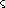)  #\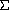`

**procedure**: `(char-downcase *char*)`

**returns:** `*char*`的小写字符等价物

**libraries:** `(rnrs unicode)`, `(rnrs)`

如果`*char*`是大写或标题字符，并且有一个小写对应字符，`char-downcase`返回小写对应字符。否则`char-downcase`返回`*char*`。

`(char-downcase #\g)  #\g

(char-downcase #\G)  #\g

(char-downcase #\7)  #\7

(char-downcase #\)  #\`

**procedure**: `(char-titlecase *char*)`

**returns:** `*char*`的标题字符等价物

**libraries:** `(rnrs unicode)`, `(rnrs)`

如果`*char*`是大写或小写字符，并且有一个标题字符对应字符，`char-titlecase`返回标题字符对应字符。否则，如果它不是标题字符，没有单个标题字符对应字符，但有一个单个大写字符对应字符，`char-titlecase`返回大写字符对应字符。否则`char-titlecase`返回`*char*`。

`(char-titlecase #\g)  #\G

(char-titlecase #\G)  #\G

(char-titlecase #\7)  #\7

(char-titlecase #\)  #\`

**procedure**: `(char-foldcase *char*)`

**returns:** `*char*`的大小写折叠字符等价物

**libraries:** `(rnrs unicode)`, `(rnrs)`

如果`*char*`有一个大小写折叠对应字符，`char-foldcase`返回大小写折叠对应字符。否则，`char-foldcase`返回`*char*`。对于大多数字符，`(char-foldcase *char*)`等同于`(char-downcase (char-upcase *char*))`，但对于土耳其 İ 和 ı，`char-foldcase` 作为恒等函数。

`(char-foldcase #\g)  #\g

(char-foldcase #\G)  #\g

(char-foldcase #\7)  #\7

(char-foldcase #\)  #\`

**过程：** `(char->integer *char*)`

**返回：** `*char*`的 Unicode 标量值作为精确整数

**库：** `(rnrs base)`，`(rnrs)`

`(char->integer #\newline)  10

(char->integer #\space)  32

(- (char->integer #\Z) (char->integer #\A))  25`

**过程：** `(integer->char *n*)`

**返回：** 对应于 Unicode 标量值`*n*`的字符

**库：** `(rnrs base)`，`(rnrs)`

`*n*`必须是精确整数且有效的 Unicode 标量值，即 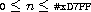 或 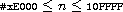。

`(integer->char 48)  #\0

(integer->char #x3BB)  #\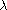`

### 第 6.8 节。字符串

字符串是字符序列，通常用作消息、字符缓冲区或文本块的容器。Scheme 提供了创建字符串、从字符串中提取字符、获取子字符串、连接字符串以及更改字符串内容的操作。

字符串被写为用双引号括起来的字符序列，例如，`"hi there"`。双引号可以通过在其前面加上反斜杠来引入到字符串中，例如，`"two \"quotes\" within"`。反斜杠也可以通过在其前面加上反斜杠来包含，例如，`"a \\slash"`。各种特殊字符可以通过其他两个字符序列插入，例如，`\n`表示换行，`\r`表示回车，`\t`表示制表符。任何 Unicode 字符都可以用语法`#\x*n*;`插入，其中`*n*`由一个或多个十六进制数字组成，表示有效的 Unicode 标量值。定义字符串精确语法的语法在第 458 页上给出。

字符串由精确非负整数索引，并且任何字符串的第一个元素的索引为 0。对于给定字符串的最高有效索引比其长度少 1。

**过程：** `(string=? *string[1]* *string[2]* *string[3]* ...)`

**过程：** `(string<? *string[1]* *string[2]* *string[3]* ...)`

**过程：** `(string>? *string[1]* *string[2]* *string[3]* ...)`

**过程：** `(string<=? *string[1]* *string[2]* *string[3]* ...)`

**过程：** `(string>=? *string[1]* *string[2]* *string[3]* ...)`

**返回：** 如果关系成立，则为`#t`，否则为`#f`

**库：** `(rnrs base)`，`(rnrs)`

与`=`、`<`、`>`、`<=`和`>=`一样，这些谓词表示所有参数之间的关系。例如，`string>?`确定其参数的字典序排序是否单调递减。

比较基于字符谓词`char=?`和`char<?`。如果两个字符串长度相同且根据`char=?`包含相同字符序列，则它们在字典顺序上等效。如果两个字符串只在长度上有所不同，则较短的��符串被认为在字典顺序上小于较长的字符串。否则，字符串在第一个字符位置上的差异（通过`char=?`）决定哪个字符串在字典顺序上小于另一个字符串，根据`char<?`。

可以定义不带错误检查的两参数`string=?`如下。

`(定义 string=?

(lambda (s1 s2)

(let ([n (string-length s1)])

(and (= (string-length s2) n)

(let loop ([i 0])

(or (= i n)

(and (char=? (string-ref s1 i) (string-ref s2 i))

(loop (+ i 1)))))))))`

可以定义不带错误检查的两参数`string<?`如下。

`(定义 string<?

(lambda (s1 s2)

(let ([n1 (string-length s1)] [n2 (string-length s2)])

(let loop ([i 0])

(and (not (= i n2))

(or (= i n1)

(let ([c1 (string-ref s1 i)] [c2 (string-ref s2 i)])

(or (char<? c1 c2)

(and (char=? c1 c2)

(loop (+ i 1)))))))))))`

这些定义可以直接扩展以支持三个或更多参数。`string<=?`、`string>?`和`string>=?`可以类似地定义。

`(string=? "mom" "mom")  #t

(string<? "mom" "mommy")  #t

(string>? "Dad" "Dad")  #f

(string=? "Mom and Dad" "mom and dad")  #f

(string<? "a" "b" "c")  #t`

**过程**：`(string-ci=? *string[1]* *string[2]* *string[3]* ...)`

**过程**：`(string-ci<? *string[1]* *string[2]* *string[3]* ...)`

**过程**：`(string-ci>? *string[1]* *string[2]* *string[3]* ...)`

**过程**：`(string-ci<=? *string[1]* *string[2]* *string[3]* ...)`

**过程**：`(string-ci>=? *string[1]* *string[2]* *string[3]* ...)`

**返回**：如果关系成立，则为`#t`，否则为`#f`

**库**：`(rnrs unicode)`，`(rnrs)`

这些谓词与`string=?`、`string<?`、`string>?`、`string<=?`和`string>=?`相同，只是它们区分大小写，即比较其参数的大小写折叠版本。

`(string-ci=? "Mom and Dad" "mom and dad")  #t

(string-ci<=? "say what" "Say What!?")  #t

(string-ci>? "N" "m" "L" "k")  #t

(string-ci=? "Stra\sse" "Strasse")  #t`

**过程**：`(string *char* ...)`

**返回**：包含字符`*char* ...`的字符串

**库**：`(rnrs base)`，`(rnrs)`

`(string)  ""

(string #\a #\b #\c)  "abc"

(string #\H #\E #\Y #\!)  "HEY!"`

**过程**：`(make-string *n*)`

**过程**：`(make-string *n* *char*)`

**返回**：长度为`*n*`的字符串

**库**：`(rnrs base)`，`(rnrs)`

`*n*` must be an exact nonnegative integer. If `*char*` is supplied, the string is filled with `*n*` occurrences of `*char*`, otherwise the characters contained in the string are unspecified.

`(make-string 0)  ""

(make-string 0 #\x)  ""

(make-string 5 #\x)  "xxxxx"`

**procedure**: `(string-length *string*)`

**returns:** the number of characters in `*string*`

**libraries:** `(rnrs base)`, `(rnrs)`

The length of a string is always an exact nonnegative integer.

`(string-length "abc")  3

(string-length "")  0

(string-length "hi there")  8

(string-length (make-string 1000000))  1000000`

**procedure**: `(string-ref *string* *n*)`

**returns:** the `*n*`th character (zero-based) of `*string*`

**libraries:** `(rnrs base)`, `(rnrs)`

`*n*` must be an exact nonnegative integer less than the length of `*string*`.

`(string-ref "hi there" 0)  #\h

(string-ref "hi there" 5)  #\e`

**procedure**: `(string-set! *string* *n* *char*)`

**returns:** unspecified

**libraries:** `(rnrs mutable-strings)`

`*n*` must be an exact nonnegative integer less than the length of `*string*`. `string-set!` changes the `*n*`th element of `*string*` to `*char*`.

`(let ([str (string-copy "hi three")])

(string-set! str 5 #\e)

(string-set! str 6 #\r)

str)  "hi there"`

**procedure**: `(string-copy *string*)`

**returns:** a new copy of `*string*`

**libraries:** `(rnrs base)`, `(rnrs)`

This procedure creates a new string with the same length and contents as `*string*`.

`(string-copy "abc")  "abc"

(let ([str "abc"])

(eq? str (string-copy str)))  #f`

**procedure**: `(string-append *string* ...)`

**returns:** a new string formed by concatenating the strings `*string* ...`

**libraries:** `(rnrs base)`, `(rnrs)`

`(string-append)  ""

(string-append "abc" "def")  "abcdef"

(string-append "Hey " "you " "there!")  "Hey you there!"`

The following implementation of `string-append` recurs down the list of strings to compute the total length, then allocates the new string, then fills it up as it unwinds the recursion.

`(define string-append

(lambda args

(let f ([ls args] [n 0])

(if (null? ls)

(make-string n)

(let* ([s1 (car ls)]

[m (string-length s1)]

[s2 (f (cdr ls) (+ n m))])

(do ([i 0 (+ i 1)] [j n (+ j 1)])

((= i m) s2)

(string-set! s2 j (string-ref s1 i))))))))`

**procedure**: `(substring *string* *start* *end*)`

**returns:** a copy of `*string*` from `*start*` (inclusive) to `*end*` (exclusive)

**libraries:** `(rnrs base)`, `(rnrs)`

`*start*`和`*end*`必须是精确的非负整数；`*start*`必须小于`*string*`的长度，而`*end*`可以小于或等于`*string*`的长度。如果`*end*` ≤ `*start*`，则返回长度为零的字符串。`substring`可以如下定义而无需错误检查。

`(define substring

(lambda (s1 m n)

(let ([s2 (make-string (- n m))])

(do ([j 0 (+ j 1)] [i m (+ i 1)])

((= i n) s2)

(string-set! s2 j (string-ref s1 i))))))

(substring "hi there" 0 1)  "h"

(substring "hi there" 3 6)  "the"

(substring "hi there" 5 5)  ""

(let ([str "hi there"])

(let ([end (string-length str)])

(substring str 0 end)))  "hi there"`

**procedure**：`(string-fill! *string* *char*)`

**返回：** 未指定

**库：** `(rnrs mutable-strings)`

`string-fill!`将`*string*`中的每个字符设置为`*char*`。

`(let ([str (string-copy "sleepy")])

(string-fill! str #\Z)

str)  "ZZZZZZ"`

`string-fill!`可能定义如下：

`(define string-fill!

(lambda (s c)

(let ([n (string-length s)])

(do ([i 0 (+ i 1)])

((= i n))

(string-set! s i c)))))`

另一种定义见第 276 页。

**procedure**：`(string-upcase *string*)`

**返回：** `*string*`的大写等价

**procedure**：`(string-downcase *string*)`

**返回：** `*string*`的小写等价

**procedure**：`(string-foldcase *string*)`

**返回：** `*string*`的大小写折叠等价

**procedure**：`(string-titlecase *string*)`

**返回：** `*string*`的标题大小写等价

**库：** `(rnrs unicode)`，`(rnrs)`

这些过程实现了从标量值序列到标量值序列的 Unicode 区域无关大小写映射。这些映射并不总是将单个字符映射到单个字符，因此结果字符串的长度可能与`*string*`的长度不同。如果结果字符串与`*string*`相同（通过`string=?`），则可能返回`*string*`或`*string*`的副本。否则，将分配新的结果字符串。`string-foldcase`不使用土耳其语言的特殊映射。

`string-titlecase`将`*string*`中每个单词的第一个大写字符转换为其标题大小写形式，并将每个其他字符转换为其小写形式。单词分隔符按照 Unicode 标准附录#29 [8]指定的方式识别。

`(string-upcase "Hi")  "HI"

(string-downcase "Hi")  "hi"

(string-foldcase "Hi")  "hi"

(string-upcase "Straße")  "STRASSE"

(string-downcase "Straße")  "straße"

(string-foldcase "Straße")  "strasse"

(string-downcase "STRASSE")   "strasse"

(string-downcase "")  ""

(string-titlecase "kNock KNoCK")  "Knock Knock"

(string-titlecase "who's there?")  "Who's There?"

(string-titlecase "r6rs")  "R6rs"

(string-titlecase "R6RS")  "R6rs"

**过程**：`(string-normalize-nfd *string*)`

**返回：** 返回`*string*`的 Unicode 标准化形式 D

**过程**：`(string-normalize-nfkd *string*)`

**返回：** 返回`*string*`的 Unicode 标准化形式 KD

**过程**：`(string-normalize-nfc *string*)`

**返回：** 返回`*string*`的 Unicode 标准化形式 C

**过程**：`(string-normalize-nfkc *string*)`

**返回：** 返回`*string*`的 Unicode 标准化形式 KC

**libraries:** `(rnrs unicode)`, `(rnrs)`

如果结果字符串与`*string*`相同（通过`string=?`），则可能返回`*string*`或`*string*`的副本。否则，将新分配结果字符串。

`(string-normalize-nfd "\xE9;")  "e\x301;"

(string-normalize-nfc "\xE9;")  "\xE9;"

(string-normalize-nfd "\x65;\x301;")  "e\x301;"

(string-normalize-nfc "\x65;\x301;")  "\xE9;"

**过程**：`(string->list *string*)`

**返回：** 返回`*string*`中的字符列表

**libraries:** `(rnrs base)`, `(rnrs)`

`string->list`允许将字符串转换为列表，以便将 Scheme 的列表处理操作应用于字符串的处理。`string->list`可以定义为无错误检查如下。

`(define string->list

(lambda (s)

(do ([i (- (string-length s) 1) (- i 1)]

[ls '() (cons (string-ref s i) ls)])

((< i 0) ls))))

(string->list "")  ()

(string->list "abc")  (#\a #\b #\c)

(apply char<? (string->list "abc"))  #t

(map char-upcase (string->list "abc"))  (#\A #\B #\C)

**过程**：`(list->string *list*)`

**返回：** 返回`*list*`中的字符的字符串

**libraries:** `(rnrs base)`, `(rnrs)`

`*list*`必须完全由字符组成。

`list->string`是`string->list`的功能反向。程序可能一起使用这两个过程，首先将字符串转换为列表，然后对该列表进行操作以生成新列表，最后将新列表转换回字符串。

`list->string`可以定义为无错误检查如下。

`(define list->string

(lambda (ls)

(let ([s (make-string (length ls))])

(do ([ls ls (cdr ls)] [i 0 (+ i 1)])

((null? ls) s)

(string-set! s i (car ls))))))

(list->string '())  ""

(list->string '(#\a #\b #\c))  "abc"

(list->string

(map char-upcase

(string->list "abc")))  "ABC"

### 第 6.9 节。向量

向量对于某些应用程序比列表更方便和高效。访问列表中的任意元素需要线性遍历列表直到选定的元素，而任意向量元素的访问时间是常数。向量的 *长度* 是它包含的元素数。向量由精确的非负整数索引，并且任何向量的第一个元素的索引是 0。给定向量的最大有效索引比其长度少一个。

与列表一样，向量的元素可以是任何类型，并且单个向量可以容纳多种对象类型。

向量被写为由空格分隔的对象序列，前缀为 `#(`，后跟 `)`。例如，由元素 `a`、`b` 和 `c` 组成的向量将被写为 `#(a b c)`。

**procedure**: `(vector *obj* ...)`

**returns:** 包含对象 `*obj* ...` 的向量

**libraries:** `(rnrs base)`, `(rnrs)`

`(vector)  #()

(vector 'a 'b 'c)  #(a b c)`

**procedure**: `(make-vector *n*)`

**procedure**: `(make-vector *n* *obj*)`

**returns:** 长度为 `*n*` 的向量

**libraries:** `(rnrs base)`, `(rnrs)`

`*n*` 必须是一个精确的非负整数。如果提供了 `*obj*`，则向量的每个元素都将填充为 `*obj*`；否则，元素是未指定的。

`(make-vector 0)  #()

(make-vector 0 '#(a))  #()

(make-vector 5 '#(a))  #(#(a) #(a) #(a) #(a) #(a))`

**procedure**: `(vector-length *vector*)`

**returns:** `*vector*` 中的元素数

**libraries:** `(rnrs base)`, `(rnrs)`

向量的长度始终是一个精确的非负整数。

`(vector-length '#())  0

(vector-length '#(a b c))  3

(vector-length (vector 1 '(2) 3 '#(4 5)))  4

(vector-length (make-vector 300))  300`

**procedure**: `(vector-ref *vector* *n*)`

**returns:** `*vector*` 的第 `*n*` 个元素（从零开始）

**libraries:** `(rnrs base)`, `(rnrs)`

`*n*` 必须是小于 `*vector*` 长度的精确非负整数。

`(vector-ref '#(a b c) 0)  a

(vector-ref '#(a b c) 1)  b

(vector-ref '#(x y z w) 3)  w`

**procedure**: `(vector-set! *vector* *n* *obj*)`

**returns:** 未指定

**libraries:** `(rnrs base)`, `(rnrs)`

`*n*` 必须是小于 `*vector*` 长度的精确非负整数。`vector-set!` 将 `*vector*` 的第 `*n*` 个元素更改为 `*obj*`。

`(let ([v (vector 'a 'b 'c 'd 'e)])

(vector-set! v 2 'x)

v)  #(a b x d e)`

**procedure**: `(vector-fill! *vector* *obj*)`

**returns:** 未指定

**libraries:** `(rnrs base)`, `(rnrs)`

`vector-fill!` 用 `*obj*` 替换 `*vector*` 的每个元素。可以定义为无错误检查的形式。

`(define vector-fill!

(lambda (v x)

(let ([n (vector-length v)])

(do ([i 0 (+ i 1)])

((= i n))

(vector-set! v i x)))))

(let ([v (vector 1 2 3)])

(vector-fill! v 0)

v)  #(0 0 0)`

**过程：** `(vector->list *vector*)`

**返回：** 一个`*vector*`元素的列表

**库：** `(rnrs base)`，`(rnrs)`

`vector->list`提供了一个方便的方法，用于将列表处理操作应用于向量。可以无需错误检查地定义如下。

`(define vector->list

(lambda (s)

(do ([i (- (vector-length s) 1) (- i 1)]

[ls '() (cons (vector-ref s i) ls)])

((< i 0) ls))))

(vector->list (vector))  ()

(vector->list '#(a b c))  (a b c)

(let ((v '#(1 2 3 4 5)))

(apply * (vector->list v)))  120`

**过程：** `(list->vector *list*)`

**返回：** 一个`*list*`元素的向量

**库：** `(rnrs base)`，`(rnrs)`

`list->vector`是`vector->list`的功能反转。这两个过程经常结合使用，以利用列表处理操作。可以使用`vector->list`将向量转换为列表，对该列表进行某种处理以生成新列表，然后将新列表转换回向量使用`list->vector`。

`list->vector`可以无需错误检查地定义如下。

`(define list->vector

(lambda (ls)

(let ([s (make-vector (length ls))])

(do ([ls ls (cdr ls)] [i 0 (+ i 1)])

((null? ls) s)

(vector-set! s i (car ls))))))

(list->vector '())  #()

(list->vector '(a b c))  #(a b c)

(let ([v '#(1 2 3 4 5)])

(let ([ls (vector->list v)])

(list->vector (map * ls ls))))  #(1 4 9 16 25)`

**过程：** `(vector-sort *predicate* *vector*)`

**返回：** 包含`*vector*`元素的向量，根据`*predicate*`排序

**过程：** `(vector-sort! *predicate* *vector*)`

**返回：** 未指定

**库：** `(rnrs sorting)`，`(rnrs)`

`*predicate*`应该是一个期望两个参数并在排序向量中第一个参数必须在第二个参数之前时返回`#t`的过程。也就是说，如果`*predicate*`应用于两个元素`*x*`和`*y*`，其中`*x*`在输入向量中出现在`*y*`之后，则只有当`*x*`应该在输出向量中出现在`*y*`之前时，谓词才应返回 true。如果满足此约束，`vector-sort`执行稳定排序，即仅在必要时根据`*predicate*`重新排序两个元素。`vector-sort!`进行破坏性排序，不一定执行稳定排序。重复元素不会被移除。`*predicate*`不应具有任何副作用。

`vector-sort`最多调用`*predicate*` *n*log*n*次，其中*n*是`*vector*`的长度，而`vector-sort!`最多调用谓词*n*²次。`vector-sort!`的较松限制允许实现使用快速排序算法，在某些情况下可能比具有较紧*n*log*n*限制的算法更快。

`(vector-sort < '#(3 4 2 1 2 5))  #(1 2 2 3 4 5)

(vector-sort > '#(0.5 1/2))  #(0.5 1/2)

(vector-sort > '#(1/2 0.5))  #(1/2 0.5)

(let ([v (vector 3 4 2 1 2 5)])

(vector-sort! < v)

v)  #(1 2 2 3 4 5)`

### 第 6.10 节。字节向量

字节向量是原始二进制数据的向量。尽管名义上组织为一系列精确的无符号 8 位整数，但字节向量可以被解释为一系列精确的有符号 8 位整数、精确的有符号或无符号 16 位、32 位、64 位或任意精度整数、IEEE 单精度或双精度浮点数，或上述各种组合。

字节向量的长度是它存储的 8 位字节数，而字节向量的索引始终以字节偏移量给出。任何数据元素可以在任何字节偏移处对齐，而不考虑底层硬件的对齐要求，并且可以使用指定的字节序（见下文）表示，该字节序与硬件规定的字节序不同。为 16 位、32 位和 64 位整数以及单精度和双精度浮点数提供了特殊的、通常更有效的运算符，这些运算符以它们的 *本机* 格式提供，即，具有底层硬件的字节序并存储在整数或浮点数大小的倍数索引处。

多字节数据值的字节序决定了它在内存中的布局。在 *大端序* 格式中，值的更重要的字节位于较低的索引处，而在 *小端序* 格式中，值的更重要的字节位于较高的索引处。当一个字节向量过程接受一个字节序参数时，该参数可以是符号 `big`，代表大端序格式，或符号 `little`，代表小端序格式。实现可以扩展这些过程以接受其他字节序符号。实现的本机字节序可以通过过程 `native-endianness` 获得。

字节向量使用 `#vu8(` 前缀代替向量的 `#(` 前缀进行编写，例如，`#vu8(1 2 3)`。以这种方式指定的字节向量的元素始终以 8 位无符号精确整数给出，即从 0 到 255（包括）的整数，使用任何有效的此类数字的语法编写。与字符串一样，字节向量是自我评估的，因此它们不需要引用。

`'#vu8(1 2 3)  #vu8(1 2 3)

#vu8(1 2 3)  #vu8(1 2 3)

#vu8(#x3f #x7f #xbf #xff)  #vu8(63 127 191 255)`

**语法**：`(endianness *symbol*)`

**返回**：`*symbol*`

**库**：`(rnrs bytevectors)`，`(rnrs)`

`*symbol*` 必须是符号 `little`、符号 `big` 或实现识别为字节序符号的其他符号。如果 `*symbol*` 不是符号或者实现不识别它为字节序符号，则属于语法违例。

`(endianness little)  little

(endianness big)  big

(endianness "spam")  *exception*`

**过程**: `(native-endianness)`

**返回值:** 一个命名实现本机字节序的符号

**库:** `(rnrs bytevectors)`, `(rnrs)`

返回值是符号`little`、符号`big`或实现中识别的其他字节序符号。通常反映底层硬件的字节序。

`(symbol? (native-endianness))  #t`

**过程**: `(make-bytevector *n*)`

**过程**: `(make-bytevector *n* *fill*)`

**返回值:** 长度为`*n*`的新字节向量

**库:** `(rnrs bytevectors)`, `(rnrs)`

如果提供了`*fill*`，则字节向量的每个元素都初始化为`*fill*`；否则，元素是未指定的。`*fill*`值必须是有符号或无符号的 8 位值，即范围在-128 到 255 之间。负的填充值被视为其二进制补码等价值。

`(make-bytevector 0)  #vu8()

(make-bytevector 0 7)  #vu8()

(make-bytevector 5 7)  #vu8(7 7 7 7 7)

(make-bytevector 5 -7)  #vu8(249 249 249 249 249)`

**过程**: `(bytevector-length *bytevector*)`

**返回值:** `*bytevector*`的长度，以 8 位字节为单位

**库:** `(rnrs bytevectors)`, `(rnrs)`

`(bytevector-length #vu8())  0

(bytevector-length #vu8(1 2 3))  3

(bytevector-length (make-bytevector 300))  300`

**过程**: `(bytevector=? *bytevector[1]* *bytevector[2]*)`

**返回值:** 如果关系成立则为`#t`，否则为`#f`

**库:** `(rnrs bytevectors)`, `(rnrs)`

仅当两个字节向量具有相同的长度和相同的内容时，它们才通过`bytevector=?`相等。

`(bytevector=? #vu8() #vu8())  #t

(bytevector=? (make-bytevector 3 0) #vu8(0 0 0))  #t

(bytevector=? (make-bytevector 5 0) #vu8(0 0 0))  #f

(bytevector=? #vu8(1 127 128 255) #vu8(255 128 127 1))  #f`

**过程**: `(bytevector-fill! *bytevector* *fill*)`

**返回值:** 未指定

**库:** `(rnrs bytevectors)`, `(rnrs)`

`*fill*`值必须是有符号或无符号的 8 位值，即范围在-128 到 255 之间。负的填充值被视为其二进制补码等价值。

`bytevector-fill!`用`*fill*`替换`*bytevector*`的每个元素。

`(let ([v (make-bytevector 6)])

(bytevector-fill! v 255)

v)  #vu8(255 255 255 255 255 255)

(let ([v (make-bytevector 6)])

(bytevector-fill! v -128)

v)  #vu8(128 128 128 128 128 128)`

**过程**: `(bytevector-copy *bytevector*)`

**返回值:** 一个与`*bytevector*`相同长度和内容的新字节向量

**库:** `(rnrs bytevectors)`, `(rnrs)`

`bytevector-copy`创建一个与`*bytevector*`具有相同长度和内容的新字节向量。

`(bytevector-copy #vu8(1 127 128 255))  #vu8(1 127 128 255)

(let ([v #vu8(1 127 128 255)])

(eq? v (bytevector-copy v)))  #f`

**procedure**: `(bytevector-copy! *src* *src-start* *dst* *dst-start* *n*)`

**returns:** 未指定

**libraries:** `(rnrs bytevectors)`, `(rnrs)`

`*src*` 和 `*dst*` 必须是字节向量。`*src-start*`、`*dst-start*` 和 `*n*` 必须是确切的非负整数。`*src-start*` 和 `*n*` 的总和不得超过 `*src*` 的长度，`*dst-start*` 和 `*n*` 的总和不得超过 `*dst*` 的长度。

`bytevector-copy!` 重写了从`*src-start*`开始的`*src*`的`*n*`字节，以`*dst-start*`开始的`*dst*`的`*n*`字节。即使`*dst*`与`*src*`是相同的字节向量，源和目标位置重叠也可以工作。也就是说，在操作开始之前，目标被填充了出现在源中的字节。

`(define v1 #vu8(31 63 95 127 159 191 223 255))

(define v2 (make-bytevector 10 0))

(bytevector-copy! v1 2 v2 1 4)

v2  #vu8(0 95 127 159 191 0 0 0 0 0)

(bytevector-copy! v1 5 v2 7 3)

v2  #vu8(0 95 127 159 191 0 0 191 223 255)

(bytevector-copy! v2 3 v2 0 6)

v2  #vu8(159 191 0 0 191 223 0 191 223 255)

(bytevector-copy! v2 0 v2 1 9)

v2  #vu8(159 159 191 0 0 191 223 0 191 223)`

**procedure**: `(bytevector-u8-ref *bytevector* *n*)`

**returns:** 返回：`*n*`索引处的 8 位无符号字节（从零开始），来自`*bytevector*`

**libraries:** `(rnrs bytevectors)`, `(rnrs)`

`*n*` 必须是一个小于 `*bytevector*` 长度的确切非负整数。

值以精确的 8 位无符号整数返回，即在 0 到 255 范围内的值。

`(bytevector-u8-ref #vu8(1 127 128 255) 0)  1

(bytevector-u8-ref #vu8(1 127 128 255) 2)  128

(bytevector-u8-ref #vu8(1 127 128 255) 3)  255`

**procedure**: `(bytevector-s8-ref *bytevector* *n*)`

**returns:** 返回：`*n*`索引处的 8 位有符号字节（从零开始），来自`*bytevector*`

**libraries:** `(rnrs bytevectors)`, `(rnrs)`

`*n*` 必须是一个小于 `*bytevector*` 长度的确切非负整数。

返回的值是一个精确的 8 位有符号整数，即-128 到 127 之间的值，它是作为二进制补码值处理的存储值的等价物。

`(bytevector-s8-ref #vu8(1 127 128 255) 0)  1

(bytevector-s8-ref #vu8(1 127 128 255) 1)  127

(bytevector-s8-ref #vu8(1 127 128 255) 2)  -128

(bytevector-s8-ref #vu8(1 127 128 255) 3)  -1`

**procedure**: `(bytevector-u8-set! *bytevector* *n* *u8*)`

**returns:** 未指定

**libraries:** `(rnrs bytevectors)`, `(rnrs)`

`*n*`必须是小于`*bytevector*`长度的精确非负整数。`*u8*`必须是 8 位无符号值，即范围在 0 到 255 之间。

`bytevector-u8-set!`将`*bytevector*`中索引为`*n*`（从零开始）的 8 位值更改为`*u8*`

`(let ([v (make-bytevector 5 -1)])

(bytevector-u8-set! v 2 128)

v)  #vu8(255 255 128 255 255)`

**procedure**: `(bytevector-s8-set! *bytevector* *n* *s8*)`

**returns:** 未指定

**libraries:** `(rnrs bytevectors)`, `(rnrs)`

`*n*`必须是小于`*bytevector*`长度的精确非负整数。`*s8*`必须是 8 位有符号值，即范围在-128 到 127 之间。

`bytevector-s8-set!`将`*bytevector*`中索引为`*n*`（从零开始）的 8 位值更改为`*s8*`的二进制补码等效值。

`(let ([v (make-bytevector 4 0)])

(bytevector-s8-set! v 1 100)

(bytevector-s8-set! v 2 -100)

v)  #vu8(0 100 156 0)`

**procedure**: `(bytevector->u8-list *bytevector*)`

**returns:** 返回`*bytevector*`的 8 位无符号元素列表

**libraries:** `(rnrs bytevectors)`, `(rnrs)`

`(bytevector->u8-list (make-bytevector 0))  ()

(bytevector->u8-list #vu8(1 127 128 255))  (1 127 128 255)

(let ([v #vu8(1 2 3 255)])

(apply * (bytevector->u8-list v)))  1530`

**procedure**: `(u8-list->bytevector *list*)`

**returns:** 返回由`*list*`的元素组成的新字节向量

**libraries:** `(rnrs bytevectors)`, `(rnrs)`

`*list*`必须完全由精确的 8 位无符号整数组成，即范围在 0 到 255 之间。

`(u8-list->bytevector '())  #vu8()

(u8-list->bytevector '(1 127 128 255))  #vu8(1 127 128 255)

(let ([v #vu8(1 2 3 4 5)])

(let ([ls (bytevector->u8-list v)])

(u8-list->bytevector (map * ls ls))))  #vu8(1 4 9 16 25)`

**procedure**: `(bytevector-u16-native-ref *bytevector* *n*)`

**returns:** 返回`*bytevector*`中索引为`*n*`（从零开始）的 16 位无符号整数

**procedure**: `(bytevector-s16-native-ref *bytevector* *n*)`

**returns:** 返回`*bytevector*`中索引为`*n*`（从零开始）的 16 位有符号整数

**procedure**: `(bytevector-u32-native-ref *bytevector* *n*)`

**returns:** 返回`*bytevector*`中索引为`*n*`（从零开始）的 32 位无符号整数

**procedure**: `(bytevector-s32-native-ref *bytevector* *n*)`

**returns:** 返回`*bytevector*`中索引为`*n*`（从零开始）的 32 位有符号整数

**procedure**: `(bytevector-u64-native-ref *bytevector* *n*)`

**returns:** 返回`*bytevector*`中索引为`*n*`（从零开始）的 64 位无符号整数

**procedure**: `(bytevector-s64-native-ref *bytevector* *n*)`

**returns:** 返回`*bytevector*`中索引为`*n*`（从零开始）的 64 位有符号整数

**libraries:** `(rnrs bytevectors)`, `(rnrs)`

`*n*`必须是一个精确的非负整数。它索引值的起始字节，必须是值所占字节数的倍数：16 位值为 2，32 位值为 4，64 位值为 8。`*n*`的总和和值所占字节数不得超过`*bytevector*`的长度。假定本机字节序。

返回值是适当范围内的精确整数，与值所占字节相对应。有符号值是存储值视为补码值的等价值。

`(define v #vu8(#x12 #x34 #xfe #x56 #xdc #xba #x78 #x98))`

如果本机字节序为大端：

`(bytevector-u16-native-ref v 2)`  #xfe56

`(bytevector-s16-native-ref v 2)`  #x-1aa

`(bytevector-s16-native-ref v 6)`  #x7898

`(bytevector-u32-native-ref v 0)`  #x1234fe56

`(bytevector-s32-native-ref v 0)`  #x1234fe56

`(bytevector-s32-native-ref v 4)`  #x-23458768

`(bytevector-u64-native-ref v 0)`  #x1234fe56dcba7898

`(bytevector-s64-native-ref v 0)`  #x1234fe56dcba7898`

如果本机字节序为小端：

`(bytevector-u16-native-ref v 2)`  #x56fe

`(bytevector-s16-native-ref v 2)`  #x56fe

`(bytevector-s16-native-ref v 6)`  #x-6788

`(bytevector-u32-native-ref v 0)`  #x56fe3412

`(bytevector-s32-native-ref v 0)`  #x56fe3412

`(bytevector-s32-native-ref v 4)`  #x-67874524

`(bytevector-u64-native-ref v 0)`  #x9878badc56fe3412

`(bytevector-s64-native-ref v 0)`  #x-67874523a901cbee`

**过程**：`(bytevector-u16-native-set! *bytevector* *n* *u16*)`

**过程**：`(bytevector-s16-native-set! *bytevector* *n* *s16*)`

**过程**：`(bytevector-u32-native-set! *bytevector* *n* *u32*)`

**过程**：`(bytevector-s32-native-set! *bytevector* *n* *s32*)`

**过程**：`(bytevector-u64-native-set! *bytevector* *n* *u64*)`

**过程**：`(bytevector-s64-native-set! *bytevector* *n* *s64*)`

**返回**：未指定

**库**：`(rnrs bytevectors)`，`(rnrs)`

`*n*`必须是一个精确的非负整数。它索引了值的起始字节，必须是值占用的字节数的倍数：16 位值占用 2 个字节，32 位值占用 4 个字节，64 位值占用 8 个字节。`*n*`和值占用的字节数的和不能超过`*bytevector*`的长度。`*u16*`必须是一个 16 位无符号值，即在 0 到 2¹⁶ - 1 的范围内的值；`*s16*`必须是一个 16 位有符号值，即在-2¹⁵到 2¹⁵ - 1 的范围内的值；`*u32*`必须是一个 32 位无符号值，即在 0 到 2³² - 1 的范围内的值；`*s32*`必须是一个 32 位有符号值，即在-2³¹到 2³¹ - 1 的范围内的值；`*u64*`必须是一个 64 位无符号值，即在 0 到 2⁶⁴ - 1 的范围内的值；`*s64*`必须是一个 64 位有符号值，即在-2⁶³到 2⁶³ - 1 的范围内的值。假定本地字节序为大端。

这些过程将给定值存储在`*bytevector*`的索引为`*n*`（从零开始）的 2、4 或 8 个字节中。负值将存储为它们的二进制补码等效值。

`(define v (make-bytevector 8 0))

(bytevector-u16-native-set! v 0 #xfe56)

(bytevector-s16-native-set! v 2 #x-1aa)

(bytevector-s16-native-set! v 4 #x7898)`

如果本地字节序为大端：

`v  #vu8(#xfe #x56 #xfe #x56 #x78 #x98 #x00 #x00)`

如果本地字节序为小端：

`v  #vu8(#x56 #xfe #x56 #xfe #x98 #x78 #x00 #x00)`

`(define v (make-bytevector 16 0))

(bytevector-u32-native-set! v 0 #x1234fe56)

(bytevector-s32-native-set! v 4 #x1234fe56)

(bytevector-s32-native-set! v 8 #x-23458768)`

如果本地字节序为大端：

`v  #vu8(#x12 #x34 #xfe #x56 #x12 #x34 #xfe #x56

      #xdc #xba #x78 #x98 #x00 #x00 #x00 #x00)`

如果本地字节序为小端：

`v  #vu8(#x56 #xfe #x34 #x12 #x56 #xfe #x34 #x12

      #x98 #x78 #xba #xdc #x00 #x00 #x00 #x00)`

`(define v (make-bytevector 24 0))

(bytevector-u64-native-set! v 0 #x1234fe56dcba7898)

(bytevector-s64-native-set! v 8 #x1234fe56dcba7898)

(bytevector-s64-native-set! v 16 #x-67874523a901cbee)`

如果本地字节序为大端：

`v  #vu8(#x12 #x34 #xfe #x56 #xdc #xba #x78 #x98

      #x12 #x34 #xfe #x56 #xdc #xba #x78 #x98

      #x98 #x78 #xba #xdc #x56 #xfe #x34 #x12)`

如果本地字节序为小端：

`v  #vu8(#x98 #x78 #xba #xdc #x56 #xfe #x34 #x12

      #x98 #x78 #xba #xdc #x56 #xfe #x34 #x12

      #x12 #x34 #xfe #x56 #xdc #xba #x78 #x98)`

**procedure**: `(bytevector-u16-ref *bytevector* *n* *eness*)`

**返回:**`*bytevector*`的索引为`*n*`（从零开始）的 16 位无符号整数。

**procedure**: `(bytevector-s16-ref *bytevector* *n* *eness*)`

**returns:** 返回索引为`*n*`（从零开始）的 16 位有符号整数`*bytevector*`

**procedure**: `(bytevector-u32-ref *bytevector* *n* *eness*)`

**returns:** 返回索引为`*n*`（从零开始）的 32 位无符号整数`*bytevector*`

**procedure**: `(bytevector-s32-ref *bytevector* *n* *eness*)`

**returns:** 返回索引为`*n*`（从零开始）的 32 位有符号整数`*bytevector*`

**procedure**: `(bytevector-u64-ref *bytevector* *n* *eness*)`

**returns:** 返回索引为`*n*`（从零开始）的 64 位无符号整数`*bytevector*`

**procedure**: `(bytevector-s64-ref *bytevector* *n* *eness*)`

**returns:** 返回索引为`*n*`（从零开始）的 64 位有符号整数`*bytevector*`

**libraries:** `(rnrs bytevectors)`, `(rnrs)`

`*n*`必须是精确的非负整数，并索引值的起始字节。`*n*`和值占用的字节数之和（16 位值为 2，32 位值为 4，64 位值为 8）不能超过`*bytevector*`的长度。`*n*`不需要是值占用的字节数的倍数。`*eness*`必须是一个有效的表示字节序的符号。

返回值是适当范围内的精确整数，对于值占用的字节数而言。有符号值相当于存储值视为二进制补码值。

`(define v #vu8(#x12 #x34 #xfe #x56 #xdc #xba #x78 #x98 #x9a #x76))

(bytevector-u16-ref v 0 (endianness big))  #x1234

(bytevector-s16-ref v 1 (endianness big))  #x34fe

(bytevector-s16-ref v 5 (endianness big))  #x-4588

(bytevector-u32-ref v 2 'big)  #xfe56dcba

(bytevector-s32-ref v 3 'big)  #x56dcba78

(bytevector-s32-ref v 4 'big)  #x-23458768

(bytevector-u64-ref v 0 'big)  #x1234fe56dcba7898

(bytevector-s64-ref v 1 'big)  #x34fe56dcba78989a

(bytevector-u16-ref v 0 (endianness little))  #x3412

(bytevector-s16-ref v 1 (endianness little))  #x-1cc

(bytevector-s16-ref v 5 (endianness little))  #x78ba

(bytevector-u32-ref v 2 'little)  #xbadc56fe

(bytevector-s32-ref v 3 'little)  #x78badc56

(bytevector-s32-ref v 4 'little)  #x-67874524

(bytevector-u64-ref v 0 'little)  #x9878badc56fe3412

(bytevector-s64-ref v 1 'little)  #x-6567874523a901cc`

**procedure**: `(bytevector-u16-set! *bytevector* *n* *u16* *eness*)`

**procedure**: `(bytevector-s16-set! *bytevector* *n* *s16* *eness*)`

**procedure**: `(bytevector-u32-set! *bytevector* *n* *u32* *eness*)`

**procedure**: `(bytevector-s32-set! *bytevector* *n* *s32* *eness*)`

**procedure**: `(bytevector-u64-set! *bytevector* *n* *u64* *eness*)`

**procedure**: `(bytevector-s64-set! *bytevector* *n* *s64* *eness*)`

**returns:** 未指定

**libraries:** `(rnrs bytevectors)`, `(rnrs)`

`*n*` 必须是一个精确的非负整数，并索引值的起始字节。 `*n*` 和值占用的字节数的总和不得超过 `*bytevector*` 的长度。 `*n*` 不必是值占用的字节数的倍数。 `*u16*` 必须是一个 16 位无符号值，即范围为 0 到 2¹⁶ - 1（含）。 `*s16*` 必须是一个 16 位有符号值，即范围为-2¹⁵ 到 2¹⁵ - 1（含）。 `*u32*` 必须是一个 32 位无符号值，即范围为 0 到 2³² - 1（含）。 `*s32*` 必须是一个 32 位有符号值，即范围为-2³¹ 到 2³¹ - 1（含）。 `*u64*` 必须是一个 64 位无符号值，即范围为 0 到 2⁶⁴ - 1（含）。 `*s64*` 必须是一个 64 位有符号值，即范围为-2⁶³ 到 2⁶³ - 1（含）。 `*eness*` 必须是一个指定字节序的有效符号。

这些过程将给定值存储在 `*bytevector*` 的索引 `*n*`（从零开始）处的 2、4 或 8 个字节中。 负值存储为它们的二进制补码等价值。

`(define v (make-bytevector 8 0))

(bytevector-u16-set! v 0 #xfe56 (endianness big))

(bytevector-s16-set! v 3 #x-1aa (endianness little))

(bytevector-s16-set! v 5 #x7898 (endianness big))

v  #vu8(#xfe #x56 #x0 #x56 #xfe #x78 #x98 #x0)

(define v (make-bytevector 16 0))

(bytevector-u32-set! v 0 #x1234fe56 'little)

(bytevector-s32-set! v 6 #x1234fe56 'big)

(bytevector-s32-set! v 11 #x-23458768 'little)

v  #vu8(#x56 #xfe #x34 #x12 #x0 #x0

      #x12 #x34 #xfe #x56 #x0

      #x98 #x78 #xba #xdc #x0)

(define v (make-bytevector 28 0))

(bytevector-u64-set! v 0 #x1234fe56dcba7898 'little)

(bytevector-s64-set! v 10 #x1234fe56dcba7898 'big)

(bytevector-s64-set! v 19 #x-67874523a901cbee 'big)

v  #vu8(#x98 #x78 #xba #xdc #x56 #xfe #x34 #x12 #x0 #x0

      #x12 #x34 #xfe #x56 #xdc #xba #x78 #x98 #x0

      #x98 #x78 #xba #xdc #x56 #xfe #x34 #x12 #x0)`

**procedure**: `(bytevector-uint-ref *bytevector* *n* *eness* *size*)`

**返回:** `*bytevector*` 的索引 `*n*`（从零开始）处的 `*size*` 字节无符号整数

**procedure**: `(bytevector-sint-ref *bytevector* *n* *eness* *size*)`

**返回:** `*bytevector*` 的索引 `*n*`（从零开始）处的 `*size*` 字节有符号整数

**libraries:** `(rnrs bytevectors)`, `(rnrs)`

`*n*` 必须是一个精确的非负整数，并索引值的起始字节。 `*size*` 必须是一个精确的正整数，并指定值所占的字节数。 `*n*` 和 `*size*` 的总和不得超过 `*bytevector*` 的长度。 `*n*` 不必是值占用的字节数的倍数。 `*eness*` 必须是一个有效的指定字节序的符号。

返回值是适合于值占用的字节数的范围内的确切整数。有符号值是存储值视为二进制补码值的等效值。

`(define v #vu8(#x12 #x34 #xfe #x56 #xdc #xba #x78 #x98 #x9a #x76))

(bytevector-uint-ref v 0 'big 1)  #x12

(bytevector-uint-ref v 0 'little 1)  #x12

(bytevector-uint-ref v 1 'big 3)  #x34fe56

(bytevector-uint-ref v 2 'little 7)  #x9a9878badc56fe

(bytevector-sint-ref v 2 'big 1)  #x-02

(bytevector-sint-ref v 1 'little 6)  #x78badc56fe34

(bytevector-sint-ref v 2 'little 7)  #x-6567874523a902

(bytevector-sint-ref (make-bytevector 1000 -1) 0 'big 1000)  -1`

**过程**：`(bytevector-uint-set! *bytevector* *n* *uint* *eness* *size*)`

**过程**：`(bytevector-sint-set! *bytevector* *n* *sint* *eness* *size*)`

**返回：**未指定

**libraries:** `(rnrs bytevectors)`, `(rnrs)`

`*n*`必须是一个正确的非负整数，并索引值的起始字节。`*size*`必须是一个正确的正整数，并指定值占用的字节数。`*n*`和`*size*`的总和不得超过`*bytevector*`的长度。`*n*`不需要是值占用的字节数的倍数。`*uint*`必须是一个在范围 0 到 2^(*size*·8) - 1（包括）之间的正确整数。`*sint*`必须是一个在范围-2^(*size*·8-1)到 2^(*size*·8-1) - 1（包括）之间的正确整数。`*eness*`必须是一个有效的描述字节顺序的符号。

这些过程将给定的值存储在从索引`*n*`（从零开始）开始的`*bytevector*`的`*size*`字节中。负值将存储为它们的二进制补码等价形式。

`(define v (make-bytevector 5 0))

(bytevector-uint-set! v 1 #x123456 (endianness big) 3)

v  #vu8(0 #x12 #x34 #x56 0)

`(define v (make-bytevector 7 -1))

(bytevector-sint-set! v 1 #x-8000000000 (endianness little) 5)

v  #vu8(#xff 0 0 0 0 #x80 #xff)`

**过程**：`(bytevector->uint-list *bytevector* *eness* *size*)`

**返回：**一个新的`*bytevector*`的`*size*`位无符号元素的列表

**过程**：`(bytevector->sint-list *bytevector* *eness* *size*)`

**返回：**一个新的`*bytevector*`的`*size*`位有符号元素的列表

**libraries:** `(rnrs bytevectors)`, `(rnrs)`

`*eness*`必须是一个有效的描述字节顺序的符号。`*size*`必须是一个正确的正整数，并指定值占用的字节数。它必须是能够整除`*bytevector*`的长度的值。

`(bytevector->uint-list (make-bytevector 0) 'little 3)  ()

(let ([v #vu8(1 2 3 4 5 6)])

(bytevector->uint-list v 'big 3))  (#x010203 #x040506)

(let ([v (make-bytevector 80 -1)])

(bytevector->sint-list v 'big 20))  (-1 -1 -1 -1)`

**procedure**: `(uint-list->bytevector *list* *eness* *size*)`

**procedure**: `(sint-list->bytevector *list* *eness* *size*)`

**returns:** a new bytevector of the elements of `*list*`

**libraries:** `(rnrs bytevectors)`, `(rnrs)`

`*eness*` must be a valid endianness symbol naming the endianness. `*size*` must be an exact positive integer and specifies the number of bytes occupied by the value. For `uint-list->bytevector`, `*list*` must consist entirely of `*size*`-byte exact unsigned integers, i.e., values in the range 0 to 2^(*size*·8) - 1 inclusive. For `sint-list->bytevector`, `*list*` must consist entirely of `*size*`-byte exact signed integers, i.e., values in the range -2^(*size*·8-1) to 2^(*size*·8-1) inclusive. Each value occupies `*size*` bytes in the resulting bytevector, whose length is thus `*size*` times the length of `*list*`.

`(uint-list->bytevector '() 'big 25)  #vu8()

(sint-list->bytevector '(0 -1) 'big 3)  #vu8(0 0 0 #xff #xff #xff)

(define (f size)

(let ([ls (list (- (expt 2 (- (* 8 size) 1)))

(- (expt 2 (- (* 8 size) 1)) 1))])

(sint-list->bytevector ls 'little size)))

(f 6)  #vu8(#x00 #x00 #x00 #x00 #x00 #x80

      #xff #xff #xff #xff #xff #x7f)`

**procedure**: `(bytevector-ieee-single-native-ref *bytevector* *n*)`

**returns:** the single floating-point value at index `*n*` (zero-based) of `*bytevector*`

**procedure**: `(bytevector-ieee-double-native-ref *bytevector* *n*)`

**returns:** the double floating-point value at index `*n*` (zero-based) of `*bytevector*`

**libraries:** `(rnrs bytevectors)`, `(rnrs)`

`*n*` must be an exact nonnegative integer. It indexes the starting byte of the value and must be a multiple of the number of bytes occupied by the value: 4 for single floats, 8 for double. The sum of `*n*` and the number of bytes occupied by the value must not exceed the length of `*bytevector*`. The native endianness is assumed.

The return value is an inexact real number. Examples appear after the mutation operators below.

**procedure**: `(bytevector-ieee-single-native-set! *bytevector* *n* *x*)`

**procedure**: `(bytevector-ieee-double-native-set! *bytevector* *n* *x*)`

**returns:** unspecified

**libraries:** `(rnrs bytevectors)`, `(rnrs)`

`*n*` must be an exact nonnegative integer. It indexes the starting byte of the value and must be a multiple of the number of bytes occupied by the value: 4 for single floats, 8 for double. The sum of `*n*` and the number of bytes occupied by the value must not exceed the length of `*bytevector*`. The native endianness is assumed.

These procedures store the given value as an IEEE-754 single or double floating-point value at index `*n*` (zero-based) of `*bytevector*`.

`(define v (make-bytevector 8 0))

(bytevector-ieee-single-native-set! v 0 .125)

(bytevector-ieee-single-native-set! v 4 -3/2)

(list

(bytevector-ieee-single-native-ref v 0)

(bytevector-ieee-single-native-ref v 4))  (0.125 -1.5)

(bytevector-ieee-double-native-set! v 0 1e23)

(bytevector-ieee-double-native-ref v 0)  1e23`

**procedure**: `(bytevector-ieee-single-ref *bytevector* *n* *eness*)`

**返回值:** `*bytevector*` 中索引为 `*n*`（从零开始）的单精度浮点值

**procedure**: `(bytevector-ieee-double-ref *bytevector* *n* *eness*)`

**返回值:** `*bytevector*` 中索引为 `*n*`（从零开始）的双精度浮点值

**库:** `(rnrs bytevectors)`, `(rnrs)`

`*n*` 必须是一个确切的非负整数，并索引值的起始字节。`*n*` 和值占用的字节数（单精度浮点数为 4，双精度浮点数为 8）的总和不能超过 `*bytevector*` 的长度。`*n*` 不必是值占用的字节数的倍数。`*eness*` 必须是一个有效的大小端名称符号。

返回值是一个非精确实数。在下面的变异运算符之后出现示例。

**procedure**: `(bytevector-ieee-single-set! *bytevector* *n* *x* *eness*)`

**procedure**: `(bytevector-ieee-double-set! *bytevector* *n* *x* *eness*)`

**返回值:** 未指定

**库:** `(rnrs bytevectors)`, `(rnrs)`

`*n*` 必须是一个确切的非负整数，并索引值的起始字节。`*n*` 和值占用的字节数（单精度浮点数为 4，双精度浮点数为 8）的总和不能超过 `*bytevector*` 的长度。`*n*` 不必是值占用的字节数的倍数。`*eness*` 必须是一个有效的大小端名称符号。

这些过程将给定值存储为 `*bytevector*` 的索引为 `*n*`（从零开始）的 IEEE-754 单精度或双精度浮点值。

`(define v (make-bytevector 10 #xc7))

(bytevector-ieee-single-set! v 1 .125 'little)

(bytevector-ieee-single-set! v 6 -3/2 'big)

(list

(bytevector-ieee-single-ref v 1 'little)

(bytevector-ieee-single-ref v 6 'big))  (0.125 -1.5)

v  #vu8(#xc7 #x0 #x0 #x0 #x3e #xc7 #xbf #xc0 #x0 #x0)

(bytevector-ieee-double-set! v 1 1e23 'big)

(bytevector-ieee-double-ref v 1 'big)  1e23`

### 第 6.11 节。符号

符号在 Scheme 程序中用作各种目的的符号名称。字符串可以用于大多数相同的目的，但符号之间的比较更有效率是符号的一个重要特征。这个特征是具有相同名称的两个符号在 `eq?` 的意义上是相同的。原因是 Scheme 读取器（由 `get-datum` 和 `read` 调用）和过程 `string->symbol` 在内部符号表中编目符号，并且每当遇到相同的名称时，总是返回相同的符号。因此，不需要逐个字符比较，就像比较两个字符串所需的那样。

两个符号可以快速比较是否相等的特性使它们非常适合用作程序表示中的标识符，允许快速比较标识符。这个特性也使符号在各种其他用途中非常有用。例如，符号可以用作程序之间传递的消息、列表结构记录的标签，或者存储在关联列表中的对象的名称（参见第 6.3 节中的`assq`）。

符号不带双引号或其他括号字符。括号、双引号、空格以及大多数其他对 Scheme 读取器具有特殊含义的字符不允许出现在符号的打印表示中。这些以及任何其他 Unicode 字符可以以`#\x*n*;`的语法出现在符号的打印表示中的任何位置，其中`*n*`由一个或多个十六进制数字组成，表示有效的 Unicode���量值。

页 458 上的符号语法给出了符号语法的精确定义。

**过程：** `(symbol=? *symbol[1]* *symbol[2]*)`

**返回：** 如果两个符号相同则返回`#t`，否则返回`#f`

**库：** `(rnrs base)`，`(rnrs)`

符号也可以用`eq?`进行比较，这通常比`symbol=?`更有效。

`(symbol=? 'a 'a)  #t`

`(symbol=? 'a (string->symbol "a"))  #t`

`(symbol=? 'a 'b)  #f`

**过程：** `(string->symbol *string*)`

**返回：** 名称为`*string*`的符号

**库：** `(rnrs base)`，`(rnrs)`

`string->symbol` 记录它在内部表中创建的所有符号，并与系统读取器共享。如果根据谓词`string=?`，表中已经存在一个名称等价于字符串的符号，则返回该符号。否则，创建一个以`*string*`为名称的新符号；将该符号输入表中并返回。

在将字符串用作`string->symbol`的参数后修改它的效果是未指定的。

`(string->symbol "x")  x`

`(eq? (string->symbol "x") 'x)  #t`

`(eq? (string->symbol "X") 'x)  #f`

`(eq? (string->symbol "x")`

`(string->symbol "x"))  #t`

`(string->symbol "()")  \x28;\x29;`

**过程：** `(symbol->string *symbol*)`

**返回：** 一个字符串，即`*symbol*`的名称

**库：** `(rnrs base)`，`(rnrs)`

`symbol->string`返回的字符串应被视为不可变。如果通过`string-set!`或其他方式修改传递给`string->symbol`的字符串，则可能导致不可预测的行为。

`(symbol->string 'xyz)  "xyz"`

`(symbol->string 'Hi)  "Hi"`

`(symbol->string (string->symbol "()"))  "()"`

### 第 6.12 节。布尔值

在条件上下文中，每个 Scheme 对象都有一个真值，除了`#f`之外的每个对象都被视为真。Scheme 提供了专用的真值`#t`，用于在表达式的值应该传达的仅仅是它为真时使用。

**过程：**`(boolean=? *boolean[1]* *boolean[2]*)`

**返回：** 如果两个布尔值相同，则返回`#t`，否则返回`#f`

**库：**`(rnrs base)`，`(rnrs)`

布尔值`#t`和`#f`也可以用`eq?`进行比较，这通常比`boolean=?`更有效。

`(boolean=? #t #t)  #t

`(boolean=? #t #f)  #f

`(boolean=? #t (< 3 4))  #t`

### 第 6.13 节。哈希表

哈希表表示任意 Scheme 值之间的关联集合。它们基本上与关联列表（参见第 165 页 objects.html#page:assq）具有相同的目的，但在涉及大量关联时通常更快。

**过程：**`(make-eq-hashtable)`

**过程：**`(make-eq-hashtable *size*)`

**返回：** 一个新的可变 eq 哈希表

**库：**`(rnrs hashtables)`，`(rnrs)`

如果提供了`*size*`，它必须是一个非负确切整数，表示哈希表最初应该容纳的元素数量。哈希表会根据需要增长，但当哈希表增长时，通常必须重新对所有现有元素进行重新哈希。提供一个非零的`*size*`可以帮助限制在表最初填充时必须进行的重新哈希量。

一个 eq 哈希表使用`eq?`（指针相等）过程比较键，并通常使用基于对象地址的哈希函数。它的哈希和等价函数适用于任何 Scheme 对象。

`(define ht1 (make-eq-hashtable))

`(define ht2 (make-eq-hashtable 32))`

**过程：**`(make-eqv-hashtable)`

**过程：**`(make-eqv-hashtable *size*)`

**返回：** 一个新的可变 eqv 哈希表

**库：**`(rnrs hashtables)`，`(rnrs)`

如果提供了`*size*`，它必须是一个非负确切整数，表示哈希表最初应该容纳的元素数量。哈希表会根据需要增长，但当哈希表增长时，通常必须重新对所有现有元素进行重新哈希。提供一个非零的`*size*`可以帮助限制在表最初填充时必须进行的重新哈希量。

一个 eqv 哈希表使用`eqv?`过程比较键，并通常使用基于对象地址的哈希函数，用于可用`eq?`识别的对象。它的哈希和等价函数适用于任何 Scheme 对象。

**过程：**`(make-hashtable *hash* *equiv?*)`

**过程：**`(make-hashtable *hash* *equiv?* *size*)`

**返回：** 一个新的可变哈希表

**库：**`(rnrs hashtables)`，`(rnrs)`

`*hash*`和`*equiv?*`必须是过程。如果提供了`*size*`，它必须是一个非负确切整数，表示哈希表最初应该容纳大约多少元素。哈希表会根据需要增长，但当哈希表增长时，通常必须重新对所有现有元素进行重新哈希。提供一个非零的`*size*`可以帮助限制在表最初填充时必须进行的重新哈希量。

新哈希表使用`*hash*`计算哈希值，并使用`*equiv?*`比较键，两者都不应修改哈希表。`*equiv?*`应该比较两个键，只有在两个键应该被区分时才返回 false。`*hash*`应该接受一个键作为参数，并返回一个非负确切整数值，每次用`*equiv?*`不区分的参数调用时返回相同的值。只要哈希表仅用于它们接受的键，`*hash*`和`*equiv?*`过程不需要接受任意输入，并且只要键在它们在表中存储关联时没有被修改，两个过程可以假定键是不可变的。哈希表操作可能对每个哈希表操作调用`*hash*`和`*equiv?*`一次、不调用或多次。

`(define ht (make-hashtable string-hash string=?))`

**过程：** `(hashtable-mutable? *hashtable*)`

**返回值：** 如果`*hashtable*`是可变的，则返回`#t`，否则返回`#f`

**库：** `(rnrs hashtables)`，`(rnrs)`

由上述哈希表创建过程之一返回的哈希表是可变的，但由`hashtable-copy`创建的哈希表可能是不可变的。不可变哈希表不能被`hashtable-set!`、`hashtable-update!`、`hashtable-delete!`或`hashtable-clear!`中的任何过程修改。

`(hashtable-mutable? (make-eq-hashtable))  #t`

(hashtable-mutable? (hashtable-copy (make-eq-hashtable)))  #f`

**过程：** `(hashtable-hash-function *hashtable*)`

**返回值：** 与`*hashtable*`相关联的哈希函数

**过程：** `(hashtable-equivalence-function *hashtable*)`

**返回值：** 与`*hashtable*`相关联的等价函数

**库：** `(rnrs hashtables)`，`(rnrs)`

`hashtable-hash-function`对于 eq 和 eqv 哈希表返回`#f`。

`(define ht (make-eq-hashtable))`

(hashtable-hash-function ht)  #f

(eq? (hashtable-equivalence-function ht) eq?)  #t

(define ht (make-hashtable string-hash string=?))

(eq? (hashtable-hash-function ht) string-hash)  #t

(eq? (hashtable-equivalence-function ht) string=?)  #t`

**过程：** `(equal-hash *obj*)`

**过程：** `(string-hash *string*)`

**过程：** `(string-ci-hash *string*)`

**过程：** `(symbol-hash *symbol*)`

**返回值：** 一个确切的非负整数哈希值

**库：** `(rnrs hashtables)`，`(rnrs)`

这些过程是适合与适当的 Scheme 谓词一起使用的哈希函数：对于 `equal-hash` 使用 `equal?`，对于 `string-hash` 使用 `string=?`，对于 `string-ci-hash` 使用 `string-ci=?`，对于 `symbol-hash` 使用 `symbol=?`（或 eq?）。由 `equal-hash`、`string-hash` 和 `string-ci-hash` 返回的哈希值通常取决于输入值的当前结构和内容，因此如果在哈希表中的键在它们有关���时被修改，则这些哈希值通常不适用。

**procedure**: `(hashtable-set! *hashtable* *key* *obj*)`

**returns:** 未指定

**libraries:** `(rnrs hashtables)`, `(rnrs)`

`*hashtable*` 必须是一个可变的哈希表。`*key*` 应该是哈希表的哈希和等价函数的适当键。`*obj*` 可以是任何 Scheme 对象。

`hashtable-set!` 将 `*key*` 与 `*obj*` 关联在 `*hashtable*` 中，替换现有的关联（如果有的话）。

`(define ht (make-eq-hashtable))

(hashtable-set! ht 'a 73)`

**procedure**: `(hashtable-ref *hashtable* *key* *default*)`

**returns:** 见下文

**libraries:** `(rnrs hashtables)`, `(rnrs)`

`*key*` 应该是哈希表的哈希和等价函数的适当键。`*default*` 可以是任何 Scheme 对象。

`hashtable-ref` 返回与 `*key*` 在 `*hashtable*` 中关联的值。如果在 `*hashtable*` 中没有与 `*key*` 关联的值，则 `hashtable-ref` 返回 `*default*`。

`(define p1 (cons 'a 'b))

(define p2 (cons 'a 'b))

(define eqht (make-eq-hashtable))

(hashtable-set! eqht p1 73)

(hashtable-ref eqht p1 55)  73

(hashtable-ref eqht p2 55)  55

(define equalht (make-hashtable equal-hash equal?))

(hashtable-set! equalht p1 73)

(hashtable-ref equalht p1 55)  73

(hashtable-ref equalht p2 55)  73`

**procedure**: `(hashtable-contains? *hashtable* *key*)`

**returns:** 如果 `*key*` 在 `*hashtable*` 中存在关联，则返回 `#t`，否则返回 `#f`

**libraries:** `(rnrs hashtables)`, `(rnrs)`

`*key*` 应该是哈希表的哈希和等价函数的适当键。

`(define ht (make-eq-hashtable))

(define p1 (cons 'a 'b))

(define p2 (cons 'a 'b))

(hashtable-set! ht p1 73)

(hashtable-contains? ht p1)  #t

(hashtable-contains? ht p2)  #f`

**procedure**: `(hashtable-update! *hashtable* *key* *procedure* *default*)`

**returns:** 未指定

**libraries:** `(rnrs hashtables)`, `(rnrs)`

`*hashtable*` 必须是一个可变的哈希表。`*key*` 应该是哈希表的哈希和等价函数的适当键。`*default*` 可以是任何 Scheme 对象。`*procedure*` 应该接受一个参数，返回一个值，并且不应修改 `*hashtable*`。

`hashtable-update!`将`*hashtable*`中与`*key*`关联的值应用于`*procedure*`，或者如果`*hashtable*`中没有与`*key*`关联的值，则应用于`*default*`。如果`*procedure*`返回，则`hashtable-update!`将`*key*`与`*procedure*`返回的值关联起来，替换旧的关联（如果有）。

一个不验证接收到的参数是否是正确类型的`hashtable-update!`版本可能定义如下。

`(define hashtable-update!

(lambda (ht key proc value)

(hashtable-set! ht key

(proc (hashtable-ref ht key value)))))`

但是，实现可能通过避免多次哈希计算和哈希表查找来更有效地实现`hashtable-update!`。

`(define ht (make-eq-hashtable))

(hashtable-update! ht 'a

(lambda (x) (* x 2))

55)

(hashtable-ref ht 'a 0)  110

(hashtable-update! ht 'a

(lambda (x) (* x 2))

0)

(hashtable-ref ht 'a 0)  220`

**过程**: `(hashtable-delete! *hashtable* *key*)`

**返回:** 未指定

**库:** `(rnrs hashtables)`, `(rnrs)`

`*hashtable*`必须是一个可变哈希表。`*key*`应该是哈希表的哈希和等价函数的适当键。

`hashtable-delete!`从`*hashtable*`中删除`*key*`的任何关联。

`(define ht (make-eq-hashtable))

(define p1 (cons 'a 'b))

(define p2 (cons 'a 'b))

(hashtable-set! ht p1 73)

(hashtable-contains? ht p1)  #t

(hashtable-delete! ht p1)

(hashtable-contains? ht p1)  #f

(hashtable-contains? ht p2)  #f

(hashtable-delete! ht p2)`

**过程**: `(hashtable-size *hashtable*)`

**返回:** `*hashtable*`中的条目数

**库:** `(rnrs hashtables)`, `(rnrs)`

`(define ht (make-eq-hashtable))

(define p1 (cons 'a 'b))

(define p2 (cons 'a 'b))

(hashtable-size ht)  0

(hashtable-set! ht p1 73)

(hashtable-size ht)  1

(hashtable-delete! ht p1)

(hashtable-size ht)  0`

**过程**: `(hashtable-copy *hashtable*)`

**过程**: `(hashtable-copy *hashtable* *mutable?*)`

**返回:** 包含与`*hashtable*`相同条目的新哈希表

**库:** `(rnrs hashtables)`, `(rnrs)`

如果`*mutable?*`存在且不为 false，则复制是可变的；否则，复制是不可变的。

`(define ht (make-eq-hashtable))

(define p1 (cons 'a 'b))

(hashtable-set! ht p1 "c")

(define ht-copy (hashtable-copy ht))

(hashtable-mutable? ht-copy)  #f

(hashtable-delete! ht p1)

(hashtable-ref ht p1 #f)  #f

(hashtable-delete! ht-copy p1)  *异常: 不可变*

(hashtable-ref ht-copy p1 #f)  "c"`

**过程**: `(hashtable-clear! *hashtable*)`

**过程**: `(hashtable-clear! *hashtable* *size*)`

**返回:** 未指定

**库:** `(rnrs hashtables)`, `(rnrs)`

`*hashtable*` 必须是可变的哈希表。如果提供了 `*size*`，则必须是非负确切整数。

`hashtable-clear!` 从 `*hashtable*` 中移除所有条目。如果提供了大小，则将哈希表重置为给定大小，就像使用大小参数 `*size*` 之一新创建的哈希表一样。

`(define ht (make-eq-hashtable))`

`(define p1 (cons 'a 'b))`

`(define p2 (cons 'a 'b))`

`(hashtable-set! ht p1 "first")`

`hashtable-set! ht p2 "second"`

`(hashtable-size ht)`  2

`hashtable-clear! ht`

`(hashtable-size ht)`  0

`(hashtable-ref ht p1 #f)`  #f`

**过程：** `(hashtable-keys *hashtable*)`

**返回：** 包含 `*hashtable*` 中键的向量

**libraries:** `(rnrs hashtables)`, `(rnrs)`

返回的向量中键可以以任何顺序出现。

`(define ht (make-eq-hashtable))`

`(define p1 (cons 'a 'b))`

`(define p2 (cons 'a 'b))`

`(hashtable-set! ht p1 "one")`

`(hashtable-set! ht p2 "two")`

`(hashtable-set! ht 'q "three")`

`(hashtable-keys ht)`  #((a . b) q (a . b))`

**过程：** `(hashtable-entries *hashtable*)`

**返回：** 两个向量：一个键的向量和一个值的向量

**libraries:** `(rnrs hashtables)`, `(rnrs)`

`hashtable-entries` 返回两个值。第一个是包含 `*hashtable*` 中键的向量，第二个是包含相应值的向量。键和值可以以任何顺序出现，但键和相应值的顺序相同。

`(define ht (make-eq-hashtable))`

`(define p1 (cons 'a 'b))`

`(define p2 (cons 'a 'b))`

`(hashtable-set! ht p1 "one")`

`(hashtable-set! ht p2 "two")`

`hashtable-set! ht 'q "three"`

`(hashtable-entries ht)`  #((a . b) q (a . b))

  #("two" "three" "one")`

### 第 6.14 节。枚举

枚举是有序的符号集，通常用于命名和操作选项，例如创建文件时可以指定的缓冲区模式和文件选项。

**语法：** `(define-enumeration *name* (*symbol* ...) *constructor*)`

**libraries:** `(rnrs enums)`, `(rnrs)`

`define-enumeration` 形式是一种定义，可以出现在任何其他定义出现的地方。

`define-enumeration` 语法创建一个新的枚举集，其中指定的符号按指定的顺序形成枚举的全集。它定义了一个名为 `*name*` 的新的语法形式，可以用来验证一个符号是否在全集中。如果 `*x*` 在全集中，则 `(*name *x*)` 求值为 `*x*`。如果 `*x*` 不在全集中，则属于语法违例。

`define-enumeration` also defines a new syntactic form named by `*constructor*` that may be used to create subsets of the enumeration type. If `*x* ...` are each in the universe, `*(constructor *x** ...)` evaluates to an enumeration set containing `*x* ...`. Otherwise, it is a syntax violation. The same symbol may appear more than once in `*x* ...`, but the resulting set contains only one occurrence of the symbol.

`(define-enumeration weather-element

(hot warm cold sunny rainy snowy windy)

weather)

(weather-element hot)  hot

(weather-element fun)  *syntax violation*

(weather hot sunny windy)  #<enum-set>

(enum-set->list (weather rainy cold rainy))  (cold rainy)`

**procedure**: `(make-enumeration *symbol-list*)`

**returns:** an enumeration set

**libraries:** `(rnrs enums)`, `(rnrs)`

This procedure creates a new enumeration type whose universe comprises the elements of `*symbol-list*`, which must be a list of symbols, in the order of their first appearance in the list. It returns the universe of the new enumeration type as an enumeration set.

`(define positions (make-enumeration '(top bottom above top beside)))

(enum-set->list positions)  (top bottom above beside)`

**procedure**: `(enum-set-constructor *enum-set*)`

**returns:** an enumeration-set construction procedure

**libraries:** `(rnrs enums)`, `(rnrs)`

This procedure returns a procedure `*p*` that may be used to create subsets of the universe of `*enum-set*`. `*p*` must be passed a list of symbols, and each element of the list must be an element of the universe of `*enum-set*`. The enumeration set returned by `*p*` contains all and only the symbols in the list it is passed. The value returned by `*p*` may contain elements not in `*enum-set*` if the universe of `*enum-set*` contains those elements.

`(define e1 (make-enumeration '(one two three four)))

(define p1 (enum-set-constructor e1))

(define e2 (p1 '(one three)))

(enum-set->list e2)  (one three)

(define p2 (enum-set-constructor e2))

(define e3 (p2 '(one two four)))

(enum-set->list e3)  (one two four)`

**procedure**: `(enum-set-universe *enum-set*)`

**returns:** the universe of `*enum-set*`, as an enumeration set

**libraries:** `(rnrs enums)`, `(rnrs)`

`(define e1 (make-enumeration '(a b c a b c d)))

(enum-set->list (enum-set-universe e1))  (a b c d)

(define e2 ((enum-set-constructor e1) '(c)))

(enum-set->list (enum-set-universe e2))  (a b c d)`

**procedure**: `(enum-set->list *enum-set*)`

**returns:** a list of the elements of `*enum-set*`

**libraries:** `(rnrs enums)`, `(rnrs)`

The symbols in the resulting list appear in the order given to them when the enumeration type of `enum-set` was created.

`(define e1 (make-enumeration '(a b c a b c d)))

(enum-set->list e1)  (a b c d)

(define e2 ((enum-set-constructor e1) '(d c a b)))

(enum-set->list e2)  (a b c d)`

**procedure**: `(enum-set-subset? *enum-set[1]* *enum-set[2]*)`

**returns:** 如果 `*enum-set[1]*` 是 `*enum-set[2]*` 的子集，则返回 `#t`，否则返回 `#f`

**libraries:** `(rnrs enums)`, `(rnrs)`

枚举集 `*enum-set[1]*` 是枚举集 `*enum-set[2]*` 的子集，当且仅当 `*enum-set[1]*` 的全集是 `*enum-set[2]*` 的子集，并且 `*enum-set[1]*` 的每个元素都是 `*enum-set[2]*` 的元素。

`(define e1 (make-enumeration '(a b c)))

(define e2 (制作枚举 '(a b c d e)))

(enum-set-subset? e1 e2)  #t

(enum-set-subset? e2 e1)  #f

(define e3 ((enum-set-constructor e2) '(a c)))

(enum-set-subset? e3 e1)  #f

(enum-set-subset? e3 e2)  #t`

**procedure**: `(enum-set=? *enum-set[1]* *enum-set[2]*)`

**returns:** 如果 `*enum-set[1]*` 和 `*enum-set[2]*` 相等，则返回 `#t`，否则返回 `#f`

**libraries:** `(rnrs enums)`, `(rnrs)`

两个枚举集 `*enum-set[1]*` 和 `*enum-set[2]*` 相等，如果每个都是另一个的子集。

`(define e1 (制作枚举 '(a b c d)))

(define e2 (制作枚举 '(b d c a)))

(enum-set=? e1 e2)  #t

(define e3 ((enum-set-constructor e1) '(a c)))

(define e4 ((enum-set-constructor e2) '(a c)))

(enum-set=? e3 e4)  #t

(enum-set=? e3 e2)  #f`

`enum-set=?` 可以根据以下方式定义为 `enum-set-subset?`。

`(define enum-set=?

(lambda (e1 e2)

(and (enum-set-subset? e1 e2) (enum-set-subset? e2 e1))))`

**procedure**: `(enum-set-member? *symbol* *enum-set*)`

**returns:** 如果符号是 `*enum-set*` 的元素，则返回 `#t`，否则返回 `#f`

**libraries:** `(rnrs enums)`, `(rnrs)`

`(define e1 (make-enumeration '(a b c d e)))

(define e2 ((enum-set-constructor e1) '(d b)))

(enum-set-member? 'c e1)  #t

(enum-set-member? 'c e2)  #f`

**procedure**: `(enum-set-union *enum-set[1]* *enum-set[2]*)`

**returns:** `*enum-set[1]*` 和 `*enum-set[2]*` 的并集

**procedure**: `(enum-set-intersection *enum-set[1]* *enum-set[2]*)`

**returns:** `*enum-set[1]*` 和 `*enum-set[2]*` 的交集

**procedure**: `(enum-set-difference *enum-set[1]* *enum-set[2]*)`

**returns:** `*enum-set[1]*` 和 `*enum-set[2]*` 的差集

**libraries:** `(rnrs enums)`, `(rnrs)`

`*enum-set[1]*` 和 `*enum-set[2]*` 必须具有相同的枚举类型。每个过程返回一个表示两个集合的并集、交集或差集的新枚举集。

`(define e1 (make-enumeration '(a b c d)))

(define e2 ((enum-set-constructor e1) '(a c)))

(define e3 ((enum-set-constructor e1) '(b c)))

(enum-set->list (enum-set-union e2 e3))  (a b c)

(enum-set->list (enum-set-intersection e2 e3))  (c)

(enum-set->list (enum-set-difference e2 e3))  (a)

(enum-set->list (enum-set-difference e3 e2))  (b)

(define e4 (制作枚举 '(b d c a)))

(enum-set-union e1 e4)  *异常: 不同的枚举类型*`

**过程**: `(enum-set-complement *enum-set*)`

**返回:** 相对于其宇宙的`*enum-set*`的补集

**libraries:** `(rnrs enums)`, `(rnrs)`

`(define e1 (制作枚举 '(a b c d)))`

(enum-set->list (enum-set-complement e1))  ()

(define e2 ((enum-set-constructor e1) '(a c)))

(enum-set->list (enum-set-complement e2))  (b d)`

**过程**: `(enum-set-projection *enum-set[1]* *enum-set[2]*)`

**返回:** `*enum-set[1]*` 在 `*enum-set[2]*` 宇宙中的投影

**libraries:** `(rnrs enums)`, `(rnrs)`

`*enum-set[1]*` 中任何不在 `*enum-set[2]*` 宇宙中的元素都将被丢弃。结果与 `*enum-set[2]*` 具有相同的枚举类型。

`(define e1 (制作枚举 '(a b c d)))`

(define e2 (制作枚举 '(a b c d e f g)))

(define e3 ((enum-set-constructor e1) '(a d)))

(define e4 ((enum-set-constructor e2) '(a c e g)))

(enum-set->list (enum-set-projection e4 e3))  (a c)

(enum-set->list

(enum-set-union e3

(enum-set-projection e4 e3)))  (a c d)`

**过程**: `(enum-set-indexer *enum-set*)`

**返回:** 一个返回`*enum-set*`宇宙中符号索引的过程

**libraries:** `(rnrs enums)`, `(rnrs)`

`enum-set-indexer` 返回一个过程 `*p*`，当应用于`*enum-set*`宇宙中的符号时，返回符号在形成宇宙的符号有序集合中的索引（从零开始）。如果应用于不在宇宙中的符号，`*p*` 返回 `#f`。

`(define e1 (制作枚举 '(a b c d)))`

(define e2 ((enum-set-constructor e1) '(a d)))

(define p (enum-set-indexer e2))

(list (p 'a) (p 'c) (p 'e))  (0 2 #f)`
