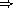

# 第八章 语法扩展

*语法扩展*，或*宏*，用于简化和规范程序中重复模式，引入具有新评估规则的语法形式，并执行有助于使程序更高效的转换。

语法扩展通常采用`(*关键字* *子形式* ...)`的形式，其中`*关键字*`是命名语法扩展的标识符。每个`*子形式*`的语法因语法扩展而异。语法扩展也可以采用不当列表或甚至单一标识符的形式。

通过将关键字与转换过程或*转换器*关联来定义新的语法扩展。可以使用`define-syntax`形式或使用`let-syntax`或`letrec-syntax`来定义语法扩展。可以使用`syntax-rules`创建转换器，允许执行基于简单模式的转换。它们也可以是接受一个参数并执行任意计算的普通过程。在这种情况下，通常使用`syntax-case`来解构输入，通常使用`syntax`来构造输出。`identifier-syntax`形式和`make-variable-transformer`过程允许创建与单一标识符和分配给这些标识符相匹配的转换器，前者受限于像`syntax-rules`一样的简单模式，后者允许执行任意计算。

语法扩展在评估开始时（在编译或解释之前）由语法*扩展器*展开为核心形式。如果扩展器遇到语法扩展，它会调用相关的转换器来展开语法扩展，然后对转换器返回的形式重复展开过程。如果扩展器遇到核心语法形式，它会递归处理子形式（如果有的话），并从展开的子形式重构形式。在展开过程中保留有关标识符绑定的信息，以强制变量和关键字的词法作用域。

本章描述的语法扩展机制是“syntax-case”系统的一部分。支持库和顶层程序的可移植实现可在[`www.cs.indiana.edu/syntax-case/`](http://www.cs.indiana.edu/syntax-case/)找到。有关系统背后动机和实现的描述可在文章“Scheme 中的语法抽象”[12]中找到。尚未标准化的其他功能，包括`modules`、本地`import`和元定义，可在*Chez Scheme 用户指南*[9]中找到。

### 第 8.1 节 关键字绑定

本节描述了在关键字和转换器之间建立绑定的形式。关键字绑定可以在顶层程序或库体中使用`define-syntax`以及在任何局部范围内使用`define-syntax`、`let-syntax`或`letrec-syntax`来建立。

**语法**: `(define-syntax *keyword* *expr*)`

**库:** `(rnrs base)`, `(rnrs)`

`*expr*`必须评估为一个转换器。

以下示例将`let*`定义为一个语法扩展，使用`syntax-rules`指定转换器（参见第 8.2 节）。

`(define-syntax let*

(syntax-rules ()

[(_ () b1 b2 ...) (let () b1 b2 ...)]

[(_ ((i1 e1) (i2 e2) ...) b1 b2 ...)

(let ([i1 e1])

(let* ([i2 e2] ...) b1 b2 ...))]))`

由一组内部定义建立的所有绑定，无论是关键字定义还是变量定义，都在直接封闭体内的任何地方可见，包括在定义本身内部。例如，表达式

`(let ()

(define even?

(lambda (x)

(or (= x 0) (odd? (- x 1)))))

(define-syntax odd?

(syntax-rules ()

[(_ x) (not (even? x))]))

(even? 10))`

是有效的，应该评估为`#t`。

展开器按从左到右的顺序处理`library`、`lambda`或其他体中的初始形式。如果遇到变量定义，它记录定义的标识符是一个变量，但推迟右侧表达式的展开，直到所有定义都被处理完毕。如果遇到关键字定义，它展开和评估右侧表达式，并将关键字绑定到生成的转换器。如果遇到表达式，它将完全展开所有推迟的右侧表达式以及当前和剩余的体表达式。

从左到右的处理顺序的一个含义是，一个内部定义可以影响后续形式是否也是一个定义。例如，表达式

`(let ()

(define-syntax bind-to-zero

(syntax-rules ()

[(_ id) (define id 0)]))

(bind-to-zero x)

x)`

评估为`0`，无论`let`表达式之外是否存在`bind-to-zero`的任何绑定。

**语法**: `(let-syntax ((*keyword* *expr*) ...) *form[1]* *form[2]* ...)`

**语法**: `(letrec-syntax ((*keyword* *expr*) ...) *form[1]* *form[2]* ...)`

**返回:** 见下文

**库:** `(rnrs base)`, `(rnrs)`

每个`*expr*`必须评估为一个转换器。对于`let-syntax`和`letrec-syntax`，每个`*keyword*`都在形式`*form[1]* *form[2]* ...`中绑定。对于`letrec-syntax`，绑定范围还包括每个`*expr*`。

`let-syntax`或`letrec-syntax`形式可以展开为一个或多个表达式，任何允许表达式的地方，此时结果表达式被视为被包含在`begin`表达式中。它也可以展开为零个或多个定义，任何允许定义的地方，此时这些定义被视为出现在`let-syntax`或`letrec-syntax`形式的位置。

以下示例突出了`let-syntax`和`letrec-syntax`的区别。

`(let ([f (lambda (x) (+ x 1))])

(let-syntax ([f (syntax-rules ()

[(_ x) x])]

[g (syntax-rules ()

[(_ x) (f x)])])

(list (f 1) (g 1))))  (1 2)

(let ([f (lambda (x) (+ x 1))])

(letrec-syntax ([f (syntax-rules ()

[(_ x) x])]

[g (syntax-rules ()

[(_ x) (f x)])])

(list (f 1) (g 1))))  (1 1)`

两个表达式除了第一个表达式中的`let-syntax`形式是第二个表达式中的`letrec-syntax`形式外完全相同。在第一个表达式中，`g`中的`f`指的是`let`绑定的变量`f`，而在第二个表达式中，它指的是由`letrec-syntax`形式建立的关键字`f`。

### 第 8.2 节。语法规则变换器

本节描述的`syntax-rules`形式允许以方便的方式指定简单的变换器。这些变换器可以使用第 8.1 节描述的机制绑定到关键字。虽然它比第 8.3 节描述的机制要不太表达，但它足以定义许多常见的语法扩展。

**语法：** `(syntax-rules (*literal* ...) *clause* ...)`

**返回：** 一个变压器

**库：** `(rnrs base)`, `(rnrs)`

每个`*literal*`必须是一个标识符，不能是下划线（`_`）或省略号（`...`）。每个子句必须采用下面的形式。

`(*pattern* *template*)`

每个`*pattern*`指定了输入形式可能采用的一种语法，相应的`*template*`指定了输出应该如何显示。

模式由列表结构、向量结构、标识符和常量组成。模式中的每个标识符都是一个`*literal*`、一个*pattern variable*、一个*underscore*或一个*ellipsis*。标识符`_`是一个下划线，标识符`...`是一个省略号。除了在字面量列表`(*literal* ...)`中出现的标识符`else`之外，任何标识符如果不是`_`或`...`，则是一个字面量。字面量用作辅助关键字，例如`case`和`cond`表达式中的`else`。模式中的列表和向量结构指定了输入所需的基本结构，下划线和模式变量指定了任意子结构，而字面量和常量指定了必须完全匹配的原子片段。省略号指定了其后的子模式的重复出现。

输入形式`*F*`与模式`*P*`匹配当且仅当

+   `*P*`是一个下划线或模式变量，

+   `*P*`是一个字面量标识符，而`*F*`是一个具有相同绑定的标识符，由谓词`free-identifier=?`（第 8.3 节）确定，

+   `*P*`的形式为`(*P[1]* ... *P[n]*)`，而`*F*`是匹配`*P[1]*`到`*P[n]*`的*n*个元素的列表，

+   `*P*`的形式为`(*P[1]* ... *P[n]* . *P[x]*)`，而`*F*`是一个包含*n*个或更多元素的列表或不完整列表，其前*n*个元素匹配`*P[1]*`到`*P[n]*`，而第*n*个 cdr 匹配`*P[x]*`，

+   `*P*`的形式为`(*P[1]* ... *P[k]* *P[e]* *ellipsis* *P[*m*+1]* ... *P[n]*)`，其中`*ellipsis*`是标识符`...`，而`*F*`是一个包含*n*个元素的正确列表，其前*k*个元素匹配`*P[1]*`到`*P[k]*`，接下来的*m* - *k*个元素每个匹配`*P[e]*`，其余的*n* - *m*个元素匹配`*P[*m*+1]*`到`*P[n]*`，

+   `*P*`的形式为`(*P[1]* ... *P[k]* *P[e]* *ellipsis* *P[*m*+1]* ... *P[n]* . *P[x]*)`，其中`*ellipsis*`是标识符`...`，而`*F*`是一个包含*n*个元素的列表或不完整列表，其前*k*个元素匹配`*P[1]*`到`*P[k]*`，接下来的*m* - *k*个元素分别匹配`*P[e]*`，接下来的*n* - *m*个元素匹配`*P[*m*+1]*`到`*P[n]*`，而第*n*个和最后一个 cdr 匹配`*P[x]*`，

+   `*P*`的形式为`#(*P[1]* ... *P[n]*)`，而`*F*`是一个包含*n*个元素的向量，其前*n*个元素匹配`*P[1]*`到`*P[n]*`，

+   `*P*`的形式为`#(*P[1]* ... *P[k]* *P[e]* *ellipsis* *P[*m*+1]* ... *P[n]*)`，其中`*ellipsis*`是标识符`...`，而`*F*`是一个包含*n*个或更多元素的向量，其前*k*个元素匹配`*P[1]*`到`*P[k]*`，接下来的*m* - *k*个元素每个匹配`*P[e]*`，其余的*n* - *m*个元素匹配`*P[*m*+1]*`到`*P[n]*`，或

+   `*P*`是一个模式数据（任何非列表、非向量、非符号对象），而`*F*`在`equal?`过程的意义上等于`*P*`。

`syntax-rules` `*pattern*`的最外层结构实际上必须是上述列表结构形式之一，尽管模式的子模式可以是上述任何形式。此外，最外层模式的第一个元素被忽略，因为它总是被假定为命名语法形式的关键字。（这些声明不适用于`syntax-case`；请参见第 8.3 节。）

如果传递给`syntax-rules`转换器的输入表单与给定子句的模式匹配，则接受该子句，并根据关联模板指定的方式转换表单。在进行此转换时，出现在模式中的模式变量将绑定到相应的输入子表单。在一个或多个省略号后面的子模式中出现的模式变量可以绑定到零个或多个输入子表单的序列或序列。

模板是一个模式变量，一个不是模式变量的标识符，一个模式数据，一个子模板列表`(*S[1]* ... *S[n]*)`，一个不完整子模板列表`(*S[1]* *S[2]* ... *S[n]* . *T*)`，或一个子模板向量`#(*S[1]* ... *S[n]*)`。每个子模板`*S[i]*`是一个模板，后面跟着零个或多个省���号。不完整子模板列表的最后一个元素`*T*`是一个模板。

模板中出现的模式变量将在输出中被绑定到它们所绑定的输入子表单中。模式数据和标识符不是模式变量的将直接插入到输出中。模板中的列表和向量结构在输出中保持为列表和向量结构。模板后跟省略号的子模板扩展为零个或多个子模板的出现。子模板必须至少包含一个子模式后跟省略号的模式变量。（否则，扩展器无法确定子表单在输出中应重复多少次。）在子模式后跟一个或多个省略号的子模式中出现的模式变量只能出现在后跟（至少）同样多个省略号的子模板中。这些模式变量在输出中被替换为它们所绑定的输入子表单，并按指定方式分布。如果模板中的模式变量后跟的省略号比相关模式中的省略号多，输入形式将根据需要复制。

形式为`(... *template*)`的模板与`*template*`相同，只是模板中的省略号没有特殊含义。也就是说，包含在`*template*`中的任何省略号都被视为普通标识符。特别是，模板`(... ...)`产生一个单独的省略号，`...`。这允许语法扩展扩展为包含省略号的形式，包括`syntax-rules`或`syntax-case`模式和模板。

下面的`or`定义演示了`syntax-rules`的使用。

`(define-syntax or

(syntax-rules ()

[(_) #f]

[(_ e) e]

[(_ e1 e2 e3 ...)

(let ([t e1]) (if t t (or e2 e3 ...)))]))`

输入模式指定输入必须由关键字和零个或多个子表达式组成。下划线（ `_` ）是一个特殊的模式符号，匹配任何输入，通常用于关键字位置，以提醒程序员和任何阅读定义的人，关键字位置永远包含预期的关键字且无需匹配。（实际上，如上所述，`syntax-rules`忽略关键字位置的内容。）如果存在多个子表达式（第三条款），扩展的代码既测试第一个子表达式的值，如果不为假则返回该值。为了避免两次评估表达式，变换器引入了临时变量 `t`的绑定。

扩展算法通过必要时重命名本地标识符来自动维护词法作用域。因此，变换器引入的`t`的绑定仅在变换器引入的代码内部可见，而不在输入的子表单内部可见。类似地，对标识符`let`和`if`的引用不受输入上下文中的任何绑定的影响。

`(let ([if #f])

(let ([t 'okay])

(或者 如果 t)))  好的`

在扩展过程中，此表达式被转换为下面表达式的等价形式。

`((lambda (if1)

((lambda (t1)

((lambda (t2)

(if t2 t2 t1))

if1))

'好))

#f)  好`

在这个示例扩展中，`if1`、`t1` 和 `t2` 代表原始表达式中的 `if` 和 `t`，以及 `or` 的扩展中的 `t` 已被重命名的标识符。

下面简化版本的 `cond` 定义（简化是因为它每个子句至少需要一个输出表达式，并且不支持辅助关键字 `=>`）演示了辅助关键字如 `else` 如何在变换器的输入中被识别，通过包含在文字列表中。

`(define-syntax cond

(syntax-rules (else)

[(_ (else e1 e2 ...)) (begin e1 e2 ...)]

[(_ (e0 e1 e2 ...)) (if e0 (begin e1 e2 ...))]

[(_ (e0 e1 e2 ...) c1 c2 ...)

(if e0 (begin e1 e2 ...) (cond c1 c2 ...))]))`

**语法**：`_`

**语法**：`...`

**库：** `(rnrs base)`，`(rnrs syntax-case)`，`(rnrs)`

这些标识符是 `syntax-rules`、`identifier-syntax` 和 `syntax-case` 的辅助关键字。第二个（`...`）也是 `syntax` 和 `quasisyntax` 的辅助关键字。在不被识别为辅助关键字的上下文中引用这些标识符是一个语法违例。

**语法**：`(identifier-syntax *tmpl*)`

**语法**：`(identifier-syntax (*id[1]* *tmpl[1]*) ((set! *id[2]* *e[2]*) *tmpl[2]*))`

**返回：** 一个变换器

**库：** `(rnrs base)`，`(rnrs)`

当一个关键字绑定到由 `identifier-syntax` 的第一种形式产生的变换器时，在绑定的范围内对关键字的引用将被 `*tmpl*` 替换。

`(let ()

(define-syntax a (identifier-syntax car))

(list (a '(1 2 3)) a))  (1 #<procedure>)`

使用 `identifier-syntax` 的第一种形式，将关联关键字与 `set!` 的表面赋值是一个语法违例。`identifier-syntax` 的第二种更一般的形式允许变换器指定在使用 `set!` 时发生的情况。

`(let ([ls (list 0)])

(define-syntax a

(identifier-syntax

[id (car ls)]

[(set! id e) (set-car! ls e)]))

(let ([before a])

(set! a 1)

(list before a ls)))  (0 1 (1))`

`identifier-syntax` 的定义以 `make-variable-transformer` 的形式显示在第 307 页。

### 第 8.3 节。语法-Case 变换器

本节描述了一个更具表现力的机制，用于基于 `syntax-case` 创建变换器，这是 `syntax-rules` 的一个广义版本。这种机制允许指定任意复杂的转换，包括以受控方式“弯曲”词法作用域的转换，从而允许定义更广泛类别的语法扩展。任何可以使用 `syntax-rules` 定义的变换器都可以轻松地重写为使用 `syntax-case`；实际上，`syntax-rules` 本身可以在 `syntax` 的描述中以 `syntax-case` 的术语定义为一个语法扩展。

使用此机制，转换器是一个参数的过程。该参数是代表要处理的形式的 *syntax 对象*。返回值是代表输出形式的语法对象。语法对象可以是以下任何一种。

+   一个非对、非向量、非符号值，

+   一对语法对象，

+   语法对象的向量，或

+   一个包装对象。

一个语法对象的 *wrap* 包含有关形式的上下文信息，以及其结构。展开器使用此上下文信息来维护词法作用域。包装还可以包含由实现用于在扩展和编译过程中跟踪文件、行和字符信息的信息，例如跟踪文件、行和字符信息。

所有标识符都必须具有上下文信息，这就是为什么上面语法对象的定义不允许除非它们被包装之外的符号。代表标识符的语法对象本身被称为标识符；因此，术语 *identifier* 可以指代语法实体（符号、变量或关键字）或作为语法对象的具体表示的语法实体。

转换器通常使用 `syntax-case` 对其输入进行解构，并使用 `syntax` 重新构建其输出。仅这两种形式就足以定义许多语法扩展，包括可以使用 `syntax-rules` 定义的任何扩展。下面将介绍这两种形式以及一组提供附加功能的其他形式和过程。

**syntax**: `(syntax-case *expr* (*literal* ...) *clause* ...)`

**returns:** 见下文

**libraries:** `(rnrs syntax-case)`, `(rnrs)`

每个 `*literal*` 必须是标识符。每个 `*clause*` 必须采用以下两种形式之一。

`(*pattern* *output-expression*)`

(*pattern* *fender* *output-expression*)`

`syntax-case` 模式可以采用 8.2 节中描述的任何形式。

`syntax-case` 首先评估 `*expr*`，然后尝试将结果值与第一个 `*clause*` 的模式匹配。此值可以是任何 Scheme 对象。如果该值与模式匹配，并且没有 `*fender*` 存在，则评估 `*output-expression*` 并将其值作为 `syntax-case` 表达式的值返回。如果该值与模式不匹配，则将该值与下一个条款进行比较，依此类推。如果该值与任何模式都不匹配，则属于语法违例。

如果可选的 `*fender*` 存在，则它将作为对条款接受的额外约束。如果 `syntax-case` `*expr*` 的值与给定条款的模式匹配，则会评估相应的 `*fender*`。如果 `*fender*` 评估为真值，则接受该条款；否则，该条款将被拒绝，就好像输入未能匹配模式一样。Fenders 在逻辑上是匹配过程的一部分，即它们指定了除表达式的基本结构之外的附加匹配约束。

子句的 `*pattern*` 中包含的模式变量被绑定到子句的 `*fender*`（如果存在）和 `*output-expression*` 中输入值的相应部分。模式变量占用与程序变量和关键字相同的命名空间；由 `syntax-case` 创建的模式变量绑定可以遮蔽（并被遮蔽）程序变量和关键字绑定以及其他模式变量绑定。然而，模式变量只能在 `syntax` 表达式中引用。

请参阅 `syntax` 描述后面的示例。

**语法**：`(syntax *template*)`

**语法**：`#'*template*`

**返回：** 请参见下文

**库：** `(rnrs syntax-case)`，`(rnrs)`

`#'*template*` 等同于 `(syntax *template*)`。在程序读取之前，缩写形式会在宏展开之前转换为较长的形式。

`syntax` 表达式类似于 `quote` 表达式，不同之处在于 `*template*` 中出现的模式变量的值被插入到 `*template*` 中，并且与输入和模板相关的上下文信息在输出中保留以支持词法作用域。`syntax` 的 `*template*` 与 `syntax-rules` 的 `*template*` 相同，并且被类似地处理。

模板中的列表和向量结构变为真实的列表或向量（适用于直接应用列表或向量操作，如 `map` 或 `vector-ref`），因为列表或向量结构必须被复制以插入模式变量的值，并且空列表永远不会被包装。例如，如果 `x`、`a`、`b` 和 `c` 是模式变量，则 `#'(x ...)`、`#'(a b c)`、`#'()` 都是列表。

下面的 `or` 定义等同于 8.2 节中给出的定义，只是它使用 `syntax-case` 和 `syntax` 替代了 `syntax-rules`。

`(define-syntax or

（lambda (x)

（语法-案例 x ()

[(_) #'#f]

[(_ e) #'e]

[(_ e1 e2 e3 ...)

#'(let ([t e1]) (if t t (or e2 e3 ...)))])))`

在这个版本中，生成转换器的 `lambda` 表达式是显式的，每个子句的输出部分中的 `syntax` 表达式也是显式的。通过使生成的 `lambda` 表达式和 `syntax` 表达式显式，任何 `syntax-rules` 形式都可以用 `syntax-case` 表达。这一观察结果导致以下关于 `syntax-rules` 的定义以 `syntax-case` 形式表示。

`(define-syntax syntax-rules

（lambda (x)

（syntax-case x ()

[(_ (i ...) ((keyword . pattern) template) ...)

#'(lambda (x)

（syntax-case x (i ...)

[(_ . pattern) #'template] ...))])))`

由于每个 `syntax-rules` 模式的第一个位置总是被忽略，因此在每个 `syntax-rules` 模式中使用下划线代替每个 `keyword`。

由于`lambda`和`syntax`表达式在`syntax-rules`形式中是隐式的，因此用`syntax-rules`表达的定义通常比用`syntax-case`表达的等效定义更短。在两者都足够的情况下选择使用哪一个是一种品味问题，但许多可以轻松用`syntax-case`编写的转换器无法轻松或根本无法用`syntax-rules`编写（请参见第 8.4 节）。

**procedure**: `(identifier? *obj*)`

**returns:** `#t` if `*obj*` is an identifier, `#f` otherwise

**libraries:** `(rnrs syntax-case)`, `(rnrs)`

`identifier?`经常在 fender 中使用，以验证输入形式的某些子形式是否为标识符，如下面未命名`let`的定义所示。

`(define-syntax let

(lambda (x)

(define ids?

(lambda (ls)

(or (null? ls)

(and (identifier? (car ls))

(ids? (cdr ls))))))

(syntax-case x ()

[(_ ((i e) ...) b1 b2 ...)

(ids? #'(i ...))

#'((lambda (i ...) b1 b2 ...) e ...)])))`

通常，语法扩展的形式为`(*keyword* *subform* ...)`，但`syntax-case`系统也允许它们采用单例标识符的形式。例如，下面表达式中的关键字`pcar`可以用作标识符（在这种情况下，它会扩展为对`car`的调用），也可以用作结构化形式（在这种情况下，它会扩展为对`set-car!`的调用）。

`(let ([p (cons 0 #f)])

(define-syntax pcar

(lambda (x)

(syntax-case x ()

[_ (identifier? x) #'(car p)]

[(_ e) #'(set-car! p e)])))

(let ([a pcar])

(pcar 1)

(list a pcar)))  (0 1)`

fender `(identifier? x)`用于识别单例标识符情况。

**procedure**: `(free-identifier=? *identifier[1]* *identifier[2]*)`

**procedure**: `(bound-identifier=? *identifier[1]* *identifier[2]*)`

**returns:** see below

**libraries:** `(rnrs syntax-case)`, `(rnrs)`

单独的符号名称无法区分标识符，除非这些标识符仅用作符号数据。谓词`free-identifier=?`和`bound-identifier=?`用于根据在给定上下文中作为自由引用或绑定标识符的*预期用途*来比较标识符。

`free-identifier=?`用于确定两个标识符是否等效，如果它们作为转换器输出中的自由标识符出现，则它们是否等效。由于标识符引用是词法作用域的，这意味着当且仅当标识符`*id[1]*`和`*id[2]*`指向相同绑定时，`(free-identifier=? *id[1]* *id[2]*)`为真。 （对于此比较，假定如果没有绑定，则假定两个同名标识符具有相同的绑定。）在`syntax-case`模式中出现的文字标识符（辅助关键字）（例如`case`和`cond`中的`else`）与`free-identifier=?`匹配。

类似地，`bound-identifier=?` 用于确定两个标识符是否等效，如果它们作为转换器输出中的绑定标识符出现，那么它们将是等效的。换句话说，如果两个标识符的 `bound-identifier=?` 返回 true，则一个标识符的绑定将在其范围内捕获对另一个标识符的引用。一般来说，只有在原始程序中同时存在两个标识符或者两个标识符由相同的转换器应用引入时（可能是隐式的---参见 `datum->syntax`），两个标识符才是 `bound-identifier=?`。`bound-identifier=?` 可用于检测绑定结构中的重复标识符或者需要检测绑定结构中的绑定标识符实例的其他预处理。

下面的定义等效于使用 `syntax-rules` 简化版本的 `cond` 的早期定义，只是 `else` 是通过在 fender 中显式调用 `free-identifier?` 来识别的，而不是通过包含在文字列表中。

`(define-syntax cond

(lambda (x)

(syntax-case x ()

[(_ (e0 e1 e2 ...))

(and (identifier? #'e0) (free-identifier=? #'e0 #'else))

#'(begin e1 e2 ...)]

[(_ (e0 e1 e2 ...)) #'(if e0 (begin e1 e2 ...))]

[(_ (e0 e1 e2 ...) c1 c2 ...)

#'(if e0 (begin e1 e2 ...) (cond c1 c2 ...))])))`

无论使用哪种 `cond` 定义，如果存在包围 `else` 的词法绑定，则 `else` 不会被识别为辅助关键字。例如，

`(let ([else #f])

(cond [else (write "oops")]))`

不会写 `"oops"`，因为 `else` 在词法上是绑定的，因此不是出现在 `cond` 定义中的相同 `else`。

以下未命名 `let` 的定义使用 `bound-identifier=?` 来检测重复标识符。

`(define-syntax let

(lambda (x)

(define ids?

(lambda (ls)

(or (null? ls)

(and (identifier? (car ls)) (ids? (cdr ls))))))

(define unique-ids?

(lambda (ls)

(or (null? ls)

(and (not (memp

(lambda (x) (bound-identifier=? x (car ls)))

(cdr ls)))

(unique-ids? (cdr ls))))))

(syntax-case x ()

[(_ ((i e) ...) b1 b2 ...)

(and (ids? #'(i ...)) (unique-ids? #'(i ...)))

#'((lambda (i ...) b1 b2 ...) e ...)])))`

使用上面的 `let` 定义，表达式

`(let ([a 3] [a 4]) (+ a a))`

是一个语法违例，而

`(let ([a 0])

(let-syntax ([dolet (lambda (x)

(syntax-case x ()

[(_ b)

#'(let ([a 3] [b 4]) (+ a b))]))])

(dolet a)))`

评估为 `7`，因为由 `dolet` 引入的标识符 `a` 和从输入形式中提取的标识符 `a` 不是 `bound-identifier=?`。然而，如果两个 `a` 的出现都作为自由引用保留，它们将引用相同的 `a` 绑定，`free-identifier=?` 将不会区分它们。

两个被 `free-identifier=?` 的标识符可能不会被 `bound-identifier=?`。由转换器引入的标识符可能引用与未由转换器引入的标识符相同的封闭绑定，但一个标识符的引入绑定不会捕获对另一个标识符的引用。另一方面，被 `bound-identifier=?` 的标识符是 `free-identifier=?` 的，只要这些标识符在进行比较的上下文中具有有效的绑定。

**syntax**: `(with-syntax ((*pattern* *expr*) ...) *body[1]* *body[2]* ...)`

**returns:** 最终主体表达式的值

**libraries:** `(rnrs syntax-case)`, `(rnrs)`

有时将转换器的输出分开构造，然后将这些部分组合在一起是很有用的。`with-syntax` 通过允许创建本地模式绑定来实现这一点。

`*pattern*` 在形式上与 `syntax-case` 的模式相同。每个 `*expr*` 的值根据相应的 `*pattern*` 进行计算和解构，而 `*pattern*` 中的模式变量会像在 `syntax-case` 中一样绑定到值的适当部分，在被处理和评估的 `*body[1]* *body[2]* ...` 中，就像处理和评估 `lambda` 的主体一样。

`with-syntax` 可以被定义为在 `syntax-case` 中的一个语法扩展。

`(define-syntax with-syntax

(lambda (x)

(syntax-case x ()

[(_ ((p e) ...) b1 b2 ...)

#'(syntax-case (list e ...) ()

[(p ...) (let () b1 b2 ...)])])))`

下面对完整的 `cond` 的定义演示了使用 `with-syntax` 来支持在内部使用递归构造输出的转换器。

`(define-syntax cond

(lambda (x)

(syntax-case x ()

[(_ c1 c2 ...)

(let f ([c1 #'c1] [cmore #'(c2 ...)])

(if (null? cmore)

(syntax-case c1 (else =>)

[(else e1 e2 ...) #'(begin e1 e2 ...)]

[(e0) #'(let ([t e0]) (if t t))]

[(e0 => e1) #'(let ([t e0]) (if t (e1 t)))]

[(e0 e1 e2 ...) #'(if e0 (begin e1 e2 ...))])

(with-syntax ([rest (f (car cmore) (cdr cmore))])

(syntax-case c1 (=>)

[(e0) #'(let ([t e0]) (if t t rest))]

[(e0 => e1) #'(let ([t e0]) (if t (e1 t) rest))]

[(e0 e1 e2 ...)

#'(if e0 (begin e1 e2 ...) rest)]))))])))`

**syntax**: `(quasisyntax *template* ...)`

**syntax**: `#`*template*`

**syntax**: `(unsyntax *template* ...)`

**syntax**: `#,*template*`

**syntax**: `(unsyntax-splicing *template* ...)`

**syntax**: `#,@*template*`

**returns:** 见下文

**libraries:** `(rnrs syntax-case)`, `(rnrs)`

`#`*template*` 等同于 `(quasisyntax *template*)`，而 `#,*template*` 等同于 `(unsyntax *template*)`，`#,@*template*` 等同于 `(unsyntax-splicing *template*)`。在程序被读取之前，缩写形式会被转换为更长的形式，然后进行宏展开。

`quasisyntax` 类似于 `syntax`，但它允许对引用文本的部分进行评估，类似于 `quasiquote`（第 6.1 节）。

在`quasisyntax` `*template*`中，`unsyntax`和`unsyntax-splicing`形式的子表达式会被评估，而其他内容则被视为普通的模板材料，就像`syntax`一样。每个`unsyntax`子表达式的值会被插入到输出中，取代`unsyntax`形式，而每个`unsyntax-splicing`子表达式的值会被插入到周围的列表或向量结构中。`unsyntax`和`unsyntax-splicing`只在`quasisyntax`表达式中有效。

`quasisyntax`表达式可以嵌套，每个`quasisyntax`引入一个新的语法引用级别，每个`unsyntax`或`unsyntax-splicing`则减少一个引用级别。在*n*个`quasisyntax`表达式中嵌套的表达式必须在*n*个`unsyntax`或`unsyntax-splicing`表达式中才能被评估。

`quasisyntax`可以在许多情况下替代`with-syntax`使用。例如，下面的`case`定义利用`quasisyntax`构建其输出，类似于上面`with-syntax`描述中给出的`cond`定义中使用内部递归的方式。

`(define-syntax case

(lambda (x)

(syntax-case x ()

[(_ e c1 c2 ...)

#`(let ([t e])

#,(let f ([c1 #'c1] [cmore #'(c2 ...)])

(if (null? cmore)

(syntax-case c1 (else)

[(else e1 e2 ...) #'(begin e1 e2 ...)]

[((k ...) e1 e2 ...)

#'(if (memv t '(k ...)) (begin e1 e2 ...))])

(syntax-case c1 ()

[((k ...) e1 e2 ...)

#`(if (memv t '(k ...))

(begin e1 e2 ...)

#,(f (car cmore) (cdr cmore)))]))))])))`

包含零个或多个子表达式的`unsyntax`和`unsyntax-splicing`形式只在拼接（列表或向量）上下文中有效。`(unsyntax *template* ...)`等同于`(unsyntax *template*) ...`，`(unsyntax-splicing *template* ...)`等同于`(unsyntax-splicing *template*) ...`。这些形式主要用作`quasisyntax`扩展器的输出中的中间形式。它们支持某些有用的嵌套准引用（`quasisyntax`）习惯用法[3]，例如`#,@#,@`，在双重嵌套和双重评估的`quasisyntax`表达式中使用时，具有双重间接拼接的效果，就像在第 6.1 节中显示的嵌套`quasiquote`示例中一样。

`unsyntax`和`unsyntax-splicing`是`quasisyntax`的辅助关键字。在除了被识别为辅助关键字的上下文之外引用这些标识符是语法错误。

**procedure**: `(make-variable-transformer *procedure*)`

**returns:** a variable transformer

**libraries:** `(rnrs syntax-case)`, `(rnrs)`

正如本节开头所述，转换器可能只是接受一个参数的过程，即代表输入形式的语法对象，并返回代表输出形式的新语法对象。传递给转换器的形式通常代表一个括号形式，其第一个子形式是绑定到转换器的关键字或仅仅是关键字本身。`make-variable-transformer`可用于将过程转换为一种特殊类型的转换器，扩展器也会将`set!`形式传递给其中关键字紧跟在`set!`关键字之后的形式，就好像它是一个要分配的变量。这使得程序员可以控制关键字在这种情况下的行为。参数`*procedure*`应接受一个参数。

`(let ([ls (list 0)])

(define-syntax a

(make-variable-transformer

(lambda (x)

(syntax-case x ()

[id (标识符？ #'id) #'(car ls)]

[(set! _ e) #'(set-car! ls e)]

[(_ e ...) #'((car ls) e ...)]))))

(let ([before a])

(set! a 1)

(list before a ls)))  (0 1 (1))`

这种语法抽象可以更简洁地使用`identifier-syntax`定义，如第 8.2 节所示，但`make-variable-transformer`可用于创建执行任意计算的转换器，而`identifier-syntax`仅限于简单的术语重写，如`syntax-rules`。`identifier-syntax`可以根据下面所示的方式定义为`make-variable-transformer`。

`(define-syntax identifier-syntax

(lambda (x)

(syntax-case x (set!)

[(_ e)

#'(lambda (x)

(syntax-case x ()

[id (标识符？ #'id) #'e]

[(_ x (... ...)) #'(e x (... ...))]))]

[(_ (标识符 exp1) ((set! var val) exp2))

(and (标识符？ #'id) (标识符？ #'var))

#'(make-variable-transformer

(lambda (x)

(syntax-case x (set!)

[(set! var val) #'exp2]

[(标识符 x (... ...)) #'(exp1 x (... ...))]

[id (标识符？ #'id) #'exp1])))])))`

**过程：** `(syntax->datum *obj*)`

**返回：** 剥离了语法信息的`*obj*`

**库：** `(rnrs syntax-case)`, `(rnrs)`

过程`syntax->datum`从语法对象中剥离所有语法信息，并返回相应的 Scheme“数据”。以这种方式剥离的标识符将转换为它们的符号名称，然后可以与`eq?`进行比较。因此，可以定义一个谓词`symbolic-identifier=?`如下。

`(define symbolic-identifier=?

(lambda (x y)

(eq? (syntax->datum x)

(syntax->datum y))))`

两个`free-identifier=?`的标识符不一定是`symbolic-identifier=?`：通常指向相同绑定的两个标识符具有相同的名称，但库的`import`形式（第 345 页）的`rename`和`prefix`子形式可能导致具有不同名称但相同绑定的两个标识符。

**过程：** `(datum->syntax *template-identifier* *obj*)`

**返回：** 一个语法对象

**库：** `(rnrs syntax-case)`, `(rnrs)`

`datum->syntax` 从 `*template-identifier*` 中构造一个语法对象，其中包含与 `*template-identifier*` 相同的上下文信息，使得语法对象的行为就像在引入 `*template-identifier*` 时将其引入代码中一样。模板标识符通常是从输入形式中提取的关键字，而对象通常是命名要构造的标识符的符号。

`datum->syntax` 允许转换器通过创建*隐式标识符*来“弯曲”词法作用域规则，使其行为就像它们存在于输入形式中一样，从而允许定义引入可见绑定或引用的语法扩展，这些绑定或引用在输入形式中并未明确出现。例如，我们可以定义一个 `loop` 表达式，将变量 `break` 绑定到循环体内的一个跳出过程中。

`(define-syntax loop

(lambda (x)

(syntax-case x ()

[(k e ...)

(with-syntax ([break (datum->syntax #'k 'break)])

#'(call/cc

(lambda (break)

(let f () e ... (f)))))])))

(let ([n 3] [ls '()])

(loop

(if (= n 0) (break ls))

(set! ls (cons 'a ls))

(set! n (- n 1))))  (a a a)`

如果我们将 `loop` 定义为

`(define-syntax loop

(lambda (x)

(syntax-case x ()

[(_ e ...)

#'(call/cc

(lambda (break)

(let f () e ... (f))))])))`

变量 `break` 在 `e ...` 中将不可见。

对于 `*obj*` 来说，它也可以表示任意的 Scheme 表单，正如下面的 `include` 定义所示。

`(define-syntax include

(lambda (x)

(define read-file

(lambda (fn k)

(let ([p (open-input-file fn)])

(let f ([x (read p)])

(if (eof-object? x)

(begin (close-port p) '())

(cons (datum->syntax k x) (f (read p))))))))

(syntax-case x ()

[(k filename)

(let ([fn (syntax->datum #'filename)])

(with-syntax ([(expr ...) (read-file fn #'k)])

#'(begin expr ...)))])))`

`(include "filename")` 展开为包含由 `"filename"` 命名的文件中找到的形式的 `begin` 表达式。例如，如果文件 `f-def.ss` 包含表达式 `(define f (lambda () x))`，则表达式

`(let ([x "okay"])

(include "f-def.ss")

(f))`

评估为 `"okay"`.

`include` 的定义使用 `datum->syntax` 将从文件中读取的对象转换为适当词法上下文中的语法对象，因此在这些表达式中的标识符引用和定义在 `include` 形式出现的地方被作用域化。

**procedure**: `(generate-temporaries *list*)`

**returns:** a list of distinct generated identifiers

**libraries:** `(rnrs syntax-case)`, `(rnrs)`

转换器可以通过为每个标识符命名来将固定数量的标识符引入其输出。然而，在某些情况下，要引入的标识符数量取决于输入表达式的某些特征。例如，一个直接的`letrec`定义需要与输入表达式中的绑定对数量相同的临时标识符。过程`generate-temporaries`用于构建临时标识符列表。

`*list*`可以是任何列表；其内容并不重要。生成的临时标识符数量等于`*list*`中的元素数量。每个临时标识符都保证与所有其他标识符不同。

下面显示了使用`generate-temporaries`的`letrec`的定义。

`(define-syntax letrec

(lambda (x)

(syntax-case x ()

[(_ ((i e) ...) b1 b2 ...)

(with-syntax ([(t ...) (generate-temporaries #'(i ...))])

#'(let ([i #f] ...)

(let ([t e] ...)

(set! i t)

...

(let () b1 b2 ...))))])))`

以这种方式使用`generate-temporaries`的任何转换器都可以重写以避免使用它，尽管会失去一些清晰度。诀窍是使用递归定义的中间形式，每次扩展步骤生成一个临时标识符，并在生成足够多的临时标识符后完成扩展。以下是使用这种技术支持多组绑定的`let-values`（第 99 页）的定义。

`(define-syntax let-values

(syntax-rules ()

[(_ () f1 f2 ...) (let () f1 f2 ...)]

[(_ ((fmls1 expr1) (fmls2 expr2) ...) f1 f2 ...)

(lvhelp fmls1 () () expr1 ((fmls2 expr2) ...) (f1 f2 ...))]))

(define-syntax lvhelp

(syntax-rules ()

[(_ (x1 . fmls) (x ...) (t ...) e m b)

(lvhelp fmls (x ... x1) (t ... tmp) e m b)]

[(_ () (x ...) (t ...) e m b)

(call-with-values

(lambda () e)

(lambda (t ...)

(let-values m (let ([x t] ...) . b))))]

[(_ xr (x ...) (t ...) e m b)

(call-with-values

(lambda () e)

(lambda (t ... . tmpr)

(let-values m (let ([x t] ... [xr tmpr]) . b))))]))`

`lvhelp`的实现因需要在创建任何绑定之前评估所有右侧表达式以及支持不正确的形式列表而变得复杂。

### 第 8.4 节。示例

本节介绍了一系列用`syntax-rules`或`syntax-case`定义的说明性语法扩展，从一些简单但有用的语法扩展开始，以及以自动生成构造函数、谓词、字段访问器和字段设置器为特色的相当复杂的结构定义机制。

本节中最简单的示例是以下`rec`的定义。`rec`是一种语法扩展，允许以最小的努力创建内部递归匿名（不是外部命名）过程。

`(define-syntax rec

(syntax-rules ()

[(_ x e) (letrec ([x e]) x)]))

(map (rec sum

(lambda (x)

(if (= x 0)

0

(+ x (sum (- x 1))))))

'(0 1 2 3 4 5))  (0 1 3 6 10 15)`

使用`rec`，我们可以如下定义完整的`let`（包括未命名和命名）。

`(define-syntax let

（syntax-rules ()

[(_ ((x e) ...) b1 b2 ...)

((lambda (x ...) b1 b2 ...) e ...)]

[(_ f ((x e) ...) b1 b2 ...)

((rec f (lambda (x ...) b1 b2 ...)) e ...)]))`

我们也可以直接根据`letrec`定义`let`，尽管定义有点不太清晰。

`(define-syntax let

（syntax-rules ()

[(_ ((x e) ...) b1 b2 ...)

((lambda (x ...) b1 b2 ...) e ...)]

[(_ f ((x e) ...) b1 b2 ...)

((letrec ([f (lambda (x ...) b1 b2 ...)]) f) e ...)]))`

这些定义依赖于第一个模式不能匹配命名`let`的事实，因为命名`let`的第一个子形式必须是标识符，而不是绑定列表。 以下定义使用防御器使此检查更加健壮。

`(define-syntax let

（lambda (x)

（syntax-case x ()

[(_ ((x e) ...) b1 b2 ...)

#'((lambda (x ...) b1 b2 ...) e ...)]

[(_ f ((x e) ...) b1 b2 ...)

（identifier? #'f)

#'((rec f (lambda (x ...) b1 b2 ...)) e ...)])))`

有了防御，我们甚至可以将子句按相反的顺序放置。

`(define-syntax let

（lambda (x)

（syntax-case x ()

[(_ f ((x e) ...) b1 b2 ...)

（identifier? #'f)

#'((rec f (lambda (x ...) b1 b2 ...)) e ...)]

[(_ ((x e) ...) b1 b2 ...)

#'((lambda (x ...) b1 b2 ...) e ...)])))`

要完全健壮，应该在第 8.3 节中未命名的`let`的定义中所用的`ids?`和`unique-ids?`检查也应该在这里使用。

两种`let`的变体都可以用简单的一行模式轻松描述，但`do`需要更多的工作。 `do`的精确语法不能直接用单个模式来表达，因为`do`表达式的绑定列表中的一些绑定可能采用`(var val)`的形式，而其他绑定则采用`(var val update)`的形式。 以下`do`的定义在内部使用`syntax-case`来单独解析绑定，而不是整体形式。

`(define-syntax do

（lambda (x)

（syntax-case x ()

[(_ (binding ...) (test res ...) expr ...)

（with-syntax ([((var val update) ...)

（map (lambda (b)

（syntax-case b ()

[(var val) #'(var val var)]

[(var val update) #'(var val update)]))

#'(binding ...))])

#'(let doloop ([var val] ...)

（if test

（begin (if #f #f) res ...)

（begin expr ... (doloop update ...)))))])))`

看起来奇怪的表达式`(if #f #f)`是在没有提供结果表达式`res ...`的情况下插入的，因为`begin`要求至少有一个子表达式。 如果未提供任何结果表达式，则`(if #f #f)`的值是未指定的，这正是我们希望的，因为如果未提供任何结果表达式，则`do`的值也是未指定的。 通过稍微增加一些代码的代价，我们可以使用`syntax-case`来确定是否提供了任何结果表达式，并根据需要使用一个或两个臂的`if`来生成循环。 结果扩展将更干净但语义上等效。

如 8.2 节中提到的，省略号在形式为`(... *template*)`的模板中失去了特殊含义。这个事实允许语法扩展扩展为包含省略号的语法定义。下面的`be-like-begin`的定义说明了这种用法。

`(define-syntax be-like-begin

(syntax-rules ()

[(_ name)

(define-syntax name

(syntax-rules ()

[(_ e0 e1 (... ...))

(begin e0 e1 (... ...))]))]))`

以这种方式定义`be-like-begin`，`(be-like-begin sequence)`的效果与以下`sequence`的定义相同。

`(define-syntax sequence

(syntax-rules ()

[(_ e0 e1 ...) (begin e0 e1 ...)]))`

也就是说，`sequence`形式变得等同于`begin`形式，例如：

`(sequence (display "Say what?") (newline))`

输出"说什么？"后跟一个换行符。

以下示例展示了如何通过在给定表达式中定义一个本地`if`，将`if`表达式限制在需要"else"（替代）子表达式的情况下。在下面的`let-syntax`绑定的主体中，双臂`if`像往常一样工作：

`(let-syntax ([if (lambda (x)

(syntax-case x ()

[(_ e1 e2 e3)

#'(if e1 e2 e3)]))])

(if (< 1 5) 2 3))  2`

但是单臂 if 会导致语法错误。

`(let-syntax ([if (lambda (x)

(syntax-case x ()

[(_ e1 e2 e3)

#'(if e1 e2 e3)]))])

(if (< 1 5) 2))  *语法违规*`

尽管这个`if`的本地定义看起来足够简单，但在尝试编写它时可能会出现一些微妙的问题。如果使用`letrec-syntax`代替`let-syntax`，则插入到输出中的标识符`if`将引用本地`if`而不是内置的`if`，扩展将无限循环。

同样，如果下划线被替换为标识符`if`，扩展将再次无限循环。模板`(if e1 e2 e3)`中出现的`if`将被视为绑定到输入形式中相应标识符`if`的模式变量，后者表示`if`的本地版本。

将`if`放在尝试修补后一个版本的文字列表中也不起作用。这将导致`syntax-case`将模式中的文字`if`（其作用域在`let-syntax`表达式之外）与输入表达式中的`if`进行比较，后者的作用域在`let-syntax`内部。由于它们不引用相同的绑定，它们不会是`free-identifier=?`，结果会导致语法违规。

下划线（`_`）的传统用法帮助程序员避免这种情况，其中错误的标识符被错误匹配或意外插入。

生成对不存在于输入形式上下文中的标识符的引用是语法违规的，如果插入到转换器输出中的标识符的“最近封闭的词法绑定”不包含输入形式，则可能发生这种情况。例如，

`(let-syntax ([divide (lambda (x)

(let ([/ +])

(syntax-case x ()

[(_ e1 e2) #'(/ e1 e2)])))])

(let ([/ *]) (divide 2 1)))`

应该导致语法违例，显示`/`被引用在无效的上下文中，因为`divide`的输出中的`/`是在变换器内的`let`表达式所绑定的变量`/`的引用。

下一个示例定义了一个类似于过程定义的`define-integrable`形式，除了它导致过程的代码被*整合*或插入到直接调用该过程的地方。

`(define-syntax define-integrable

(syntax-rules (lambda)

[(_ name (lambda formals form1 form2 ...))

(begin

(define xname (lambda formals form1 form2 ...))

(define-syntax name

(lambda (x)

(syntax-case x ()

[_ (identifier? x) #'xname]

[(_ arg (... ...))

#'((lambda formals form1 form2 ...)

arg

(... ...))]))))]))`

形式`(define-integrable *name* *lambda-expression*)`扩展为一对定义：`*name*`的语法定义和`xname`的变量定义。`*name*`的变换器将表面上的对`*name*`的调用转换为对`*lambda-expression*`的直接调用。由于结果形式仅仅是直接的`lambda`应用（相当于`let`表达式），实际参数被求值正好一次，而且在过程主体的求值之前，正如所要求的那样。对`*name*`的所有其他引用都被替换为对`xname`的引用。对`xname`的定义将其绑定到`*lambda-expression*`的值。这允许该过程被用作第一类值。`define-integrable`变换器不会对`lambda`表达式内部或调用点处的词法作用域进行特殊处理，因为词法作用域由扩展器自动维护。另外，因为`xname`是由变换器引入的，所以对于`xname`的绑定在除了由`*name*`的变换器引入的引用处之外的任何地方都不可见。

上述对`define-integrable`的定义对于递归过程不起作用，因为递归调用会导致无限数量的扩展步骤，很可能导致在扩展时耗尽内存。对于直接递归过程的这个问题的解决方案是，用一个`let-syntax`绑定来包装每个`lambda`表达式的出现，该绑定无条件地将`*name*`扩展为`xname`。

`(define-syntax define-integrable

(syntax-rules (lambda)

[(_ name (lambda formals form1 form2 ...))

(begin

(define xname

(let-syntax ([name (identifier-syntax xname)])

(lambda formals form1 form2 ...)))

(define-syntax name

(lambda (x)

(syntax-case x ()

[_ (identifier? x) #'xname]

[(_ arg (... ...))

#'((let-syntax ([name (identifier-syntax xname)])

(lambda formals form1 form2 ...))

arg (... ...))]))))]))`

对于相互递归过程，可以通过用非标准的 `fluid-let-syntax` 表单替换 `let-syntax` 表单来解决这个问题，这在 *Chez Scheme 用户指南* 中有描述 [9]。

`define-integrable` 的两种定义处理了标识符出现在结构化表达式的第一个位置与出现在其他位置的情况，就像描述 `identifier?` 中给出的 `pcar` 示例一样。在其他情况下，这两种情况必须被同等对待。形式 `identifier-syntax` 可以使这样做更加方便。

`(let ([x 0])

(define-syntax x++

(identifier-syntax

(let ([t x])

(set! x (+ t 1)) t)))

(let ([a x++]) (list a x)))  (0 1)`

以下示例使用 `identifier-syntax`、`datum->syntax` 和本地语法定义来定义一种 *方法* 形式，这是面向对象编程（OOP）系统的基本构建块之一。`method` 表达式类似于 `lambda` 表达式，但除了形式参数和主体外，`method` 表达式还包含一个实例变量列表 `(ivar ...)`。当调用方法时，始终会传递一个 *对象*（*实例*），表示为与实例变量对应的 *字段* 的向量，以及零个或多个额外参数。在方法主体中，对象隐式绑定到标识符 `self`，额外参数绑定到形式参数。可以通过实例变量引用或赋值在方法主体中访问或更改对象的字段。

`(define-syntax method

(lambda (x)

(syntax-case x ()

[(k (ivar ...) formals b1 b2 ...)

(with-syntax ([(index ...)

(let f ([i 0] [ls #'(ivar ...)])

(如果 (null? ls)

'()

(cons i (f (+ i 1) (cdr ls)))))]

[self (datum->syntax #'k 'self)]

[set! (datum->syntax #'k 'set!)])

#'(lambda (self . formals)

(let-syntax ([ivar (identifier-syntax

(vector-ref self index))]

...)

(let-syntax ([set!

(syntax-rules (ivar ...)

[(_ ivar e) (vector-set! self index e)]

...

[(_ x e) (set! x e)])])

b1 b2 ...))))])))`

为 `ivar ...` 和 `set!` 进行本地绑定使得对象的字段看起来像普通变量，引用和赋值被转换为对 `vector-ref` 和 `vector-set!` 的调用。使用 `datum->syntax` 使得引入的 `self` 和 `set!` 的绑定在方法主体中可见。需要嵌套的 `let-syntax` 表达式以使作为本地 `set!` 版本辅助关键字的标识符 `ivar ...` 被正确作用域。

通过使用一般形式的 `identifier-syntax` 更直接地处理 `set!` 形式，我们可以简化 `method` 的定义。

`(define-syntax method

(lambda ( x )

(syntax-case x ()

[(k (ivar ...) formals b1 b2 ...)

(with-syntax ([(index ...)

(let f ([i 0] [ls #'(ivar ...)])

(如果 (null? ls)

'()

(cons i (f (+ i 1) (cdr ls)))))]

[self (datum->syntax #'k 'self)])

#'(lambda (self . formals)

(let-syntax ([ivar (identifier-syntax

[_ (vector-ref self index)]

[(set! _ e)

(vector-set! self index e)])]

...)

b1 b2 ...)))])))`

下面的例子演示了`method`的简单用法。

`(let ([m (method (a) (x) (list a x self))])

(m #(1) 2))  (1 2 #(1))

(let ([m (method (a) (x)

(set! a x)

(set! x (+ a x))

(list a x self))])

(m #(1) 2))  (2 4 #(2))`

在基于`method`的完整面向对象系统中，实例变量`ivar ...`可能是从类声明中获取的，而不是在`method`表单中明确列出的，尽管相同的技术会被用来使实例变量在方法体中出现为普通变量。

本节的最后一个例子定义了一个简单的结构定义工具，将结构表示为带有命名字段的向量。 结构使用`define-structure`定义，其形式为

`(define-structure *name* *field* ...)`

其中`*name*`命名结构，而`*field* ...`命名其字段。 `define-structure`展开为一系列生成的定义：一个构造函数`make-*name*`，一个类型谓词`*name*?`，以及一个访问器`*name*-*field*`和每个字段名称一个 setter`set-*name*-*field*!`。

`(define-syntax define-structure

(lambda (x)

(define gen-id

(lambda (template-id . args)

(datum->syntax template-id

(string->symbol

(apply string-append

(map (lambda (x)

(if (string? x)

x

(symbol->string (syntax->datum x))))

args))))))

(syntax-case x ()

[(_ name field ...)

(with-syntax ([constructor (gen-id #'name "make-" #'name)]

[predicate (gen-id #'name #'name "?")]

[(access ...)

(map (lambda (x) (gen-id x #'name "-" x))

#'(field ...))]

[(assign ...)

(map (lambda (x)

(gen-id x "set-" #'name "-" x "!"))

#'(field ...))]

[structure-length (+ (length #'(field ...)) 1)]

[(index ...)

(let f ([i 1] [ids #'(field ...)])

(if (null? ids)

'()

(cons i (f (+ i 1) (cdr ids)))))])

#'(begin

(define constructor

(lambda (field ...)

(vector 'name field ...)))

(define predicate

(lambda (x)

(and (vector? x)

(= (vector-length x) structure-length)

(eq? (vector-ref x 0) 'name))))

(define access

(lambda (x)

(vector-ref x index)))

...

(define assign

(lambda (x update)

(vector-set! x index update)))

...))])))`

构造函数接受与结构中字段数量相同的参数，并创建一个向量，其第一个元素是符号`*name*`，其余元素是参数值。类型谓词返回真值，如果其参数是预期长度的向量，并且其第一个元素是`*name*`。

由于`define-structure`形式展开为包含定义的`begin`，它本身是一个定义，并且可以在任何定义有效的地方使用。

生成的标识符是使用`datum->syntax`创建的，以允许标识符在`define-structure`形式出现的地方可见。

下面的例子演示了`define-structure`的使用。

`(define-structure tree left right)

(define t

(make-tree

(make-tree 0 1)

(make-tree 2 3)))

t  #(tree #(tree 0 1) #(tree 2 3))

(tree? t)  #t

(tree-left t)  #(tree 0 1)

(tree-right t)  #(tree 2 3)

(set-tree-left! t 0)

t  #(tree 0 #(tree 2 3))`
