# 第十二章 扩展示例

本章介绍了一系列执行比本书前几章中大多数示例更复杂任务的程序。它们展示了各种编程技术，并演示了特定的编程风格。

本章的每个部分都详细描述了一个程序，并给出了其使用示例。然后列出了代码清单。在每个部分的末尾都有旨在激发对程序的思考并提出可能扩展的练习。这些练习通常比第二章和 3 章中的练习更困难，有些是重大项目。

第 12.1 节介绍了一个简单的矩阵乘法包。它展示了一组几乎可以用任何语言编写的过程。其最有趣的特点是，所有乘法操作都是通过调用一个*通用*过程`mul`来执行的，该过程根据其参数的维度调用适当的辅助过程，并且动态分配适当大小的结果。第 12.2 节介绍了一个用于根据任意谓词对列表进行排序的归并排序算法。第 12.3 节描述了一种用于构建集合的语法形式。它展示了从集合表示到 Scheme 代码的简单但高效的语法转换。第 12.4 节介绍了从*C 语言程序设计*[19]中借鉴的一个单词计数程序，将其从 C 语言翻译成 Scheme。它展示了字符和字符串操作，数据结构的创建和操作，以及基本的文件输入和输出。第 12.5 节介绍了一个实现`put-datum`、`write`和`display`基本版本的 Scheme 打印机。第 12.6 节介绍了一个类似于许多 Scheme 系统和其他语言中找到的简单格式化输出工具。第 12.7 节介绍了一个用于 Scheme 的简单解释器，展示了 Scheme 作为一种语言实现工具，同时为 Scheme 提供了一种非正式的操作语义以及用于研究 Scheme 扩展的有用基础。第 12.8 节介绍了一个小型、可扩展的抽象对象工具，可以作为整个面向对象子系统的基础。第 12.9 节介绍了一个用于计算输入值序列的傅立叶变换的递归算法。它突出了 Scheme 的复数算术的使用。第 12.10 节介绍了一个简洁的统一算法，展示了如何在 Scheme 中将过程用作延续和替换（统一器）。第 12.11 节描述了一个多任务设施及其以延续为基础的实现。

### 第 12.1 节 矩阵和向量乘法

这个示例程序主要涉及基本的编程技术。它演示了简单的算术和向量操作、使用`do`语法形式进行循环、基于对象类型进行分派以及引发异常。

标量乘以标量、标量乘以矩阵或矩阵乘以矩阵是通过一个名为`mul`的单一*通用*过程执行的。`mul`接受两个参数，并根据其参数的类型决定执行什么操作。因为标量操作使用 Scheme 的乘法过程`*`，`mul`的标量可以是任何内置数值类型（精确或非精确复数、实数、有理数或整数）。

*m*×*n*矩阵*A*和*n*×*p*矩阵*B*的乘积是由以下定义的*m*×*p*矩阵*C*的元素

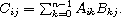

标量*x*和*m*×*n*矩阵*A*的乘积是由以下方程定义的*m*×*n*矩阵*C*，其元素为

*C*[*ij*] = *xA*[*ij*].

换句话说，*C*的每个元素是*x*和*A*对应元素的乘积。向量-向量、向量-矩阵和矩阵-向量乘法可以看作是矩阵-矩阵乘法的特殊情况，其中向量表示为 1 × *n*或*n* × 1 矩阵。

这里有一些示例，每个示例前面都有标准数学符号表示的等效操作。

+   标量乘以标量：

    3 × 4 = 12

    `(mul 3 4)  12`

+   标量乘以向量（1 × 3 矩阵）：

    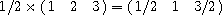

    `(mul 1/2 '#(#(1 2 3)))  #(#(1/2 1 3/2))`

+   标量乘以矩阵：

    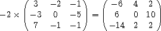

    `(mul -2

    '#(#(3 -2 -1)

    #(-3 0 -5)

    #(7 -1 -1)))  #(#(-6 4 2)

       #(6 0 10)

       #(-14 2 2))`

+   向量乘以矩阵：

    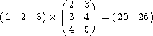

    `(mul '#(#(1 2 3))

    '#(#(2 3)

    #(3 4)

    #(4 5)))  #(#(20 26))`

+   矩阵乘以向量：

    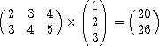

    `(mul '#(#(2 3 4)

    #(3 4 5))

    '#(#(1) #(2) #(3)))  #(#(20) #(26))`

+   矩阵乘以矩阵：

    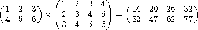

    `(mul '#(#(1 2 3)

    #(4 5 6))

    '#(#(1 2 3 4)

    #(2 3 4 5)

    #(3 4 5 6)))  #(#(14 20 26 32)

       #(32 47 62 77))`

`mul`及其辅助程序的代码，结构化为一个库，如下所示。前几个定义建立了一组支持矩阵数据类型的过程。矩阵是向量的向量。包括创建矩阵的过程、访问和分配矩阵元素的过程以及矩阵谓词。在这些定义之后是`mul`本身的定义。在`mul`的`lambda`表达式内部是一组支持`mul`的辅助程序的定义。

`mul`检查其参数的类型，并选择适当的辅助过程来完成工作。每个辅助程序都操作特定类型的参数。例如，`mat-sca-mul`将矩阵乘以标量。如果任一参数的类型无效或参数不兼容，例如，行或列不匹配，`mul`或其其中一个辅助程序会引发异常。

`(library (tspl matrix)

(export make-matrix matrix? matrix-rows matrix-columns

matrix-ref matrix-set! mul)

(import (rnrs))

; make-matrix 创建一个矩阵（向量的向量）。

(define make-matrix

(lambda (rows columns)

(do ([m (make-vector rows)]

[i 0 (+ i 1)])

((= i rows) m)

(vector-set! m i (make-vector columns)))))

; matrix? 检查其参数是否为矩阵。

; 虽然不是绝对可靠，但通常足够好。

(define matrix?

(lambda (x)

(and (vector? x)

(> (vector-length x) 0)

(vector? (vector-ref x 0)))))

; matrix-rows 返回矩阵中的行数。

(define matrix-rows

(lambda (x)

(vector-length x)))

; matrix-columns 返回矩阵中的列数。

(define matrix-columns

(lambda (what)

(vector-length (vector-ref x 0))))

; matrix-ref 返回第 i 行的第 j 个元素。

(define matrix-ref

(lambda (m i j)

(vector-ref (vector-ref m i) j)))

; matrix-set! changes the jth element of the ith row.

(define matrix-set!

(lambda (m i j x)

(vector-set! (vector-ref m i) j x)))

; mat-sca-mul 将矩阵乘以标量。

(define mat-sca-mul

(lambda (m x)

(let* ([nr (matrix-rows m)]

[nc (matrix-columns m)]

[r (make-matrix nr nc)])

(do ([i 0 (+ i 1)])

((= i nr) r)

(do ([j 0 (+ j 1)])

((= j nc))

(matrix-set! r i j (* x (matrix-ref m i j))))))))

; mat-mat-mul 将一个矩阵乘以另一个矩阵，在验证后进行

; 第一个矩阵的列数与第二个矩阵的列数相同

; 矩阵有行。

(define mat-mat-mul

(lambda (m1 m2)

(let* ([nr1 (matrix-rows m1)]

[nr2 (matrix-rows m2)]

[nc2 (矩阵列数 m2)]

[r (make-matrix nr1 nc2)])

(unless (= (matrix-columns m1) nr2) (match-error m1 m2))

(do ([i 0 (+ i 1)])

((= i nr1) r)

(do ([j 0 (+ j 1)])

((= j nc2))

(do ([k 0 (+ k 1)]

[a 0 (+ a

(* (matrix-ref m1 i k)

(matrix-ref m2 k j)))])

((= k nr2)

(matrix-set! r i j a))))))))

; 当 mul 接收到无效的参数时，调用 type-error 进行投诉

; 参数的类型。

(define type-error

(lambda (what)

(assertion-violation 'mul

"不是数字或矩阵"

what)))

; match-error 在 mul 接收到一对

; 不兼容的参数。

(define match-error

(lambda (what1 what2)

(assertion-violation 'mul

"不兼容的操作数" what1

what2)))

; mul is the generic matrix/scalar multiplication procedure

(define mul

(lambda (x y)

(cond

[(number? x)

(cond

[(number? y) (* x y)]

[(matrix? y) (mat-sca-mul y x)]

[else (type-error y)])]

[(matrix? x)

(cond

[(number? y) (mat-sca-mul x y)]

[(matrix? y) (mat-mat-mul x y)]

[else (type-error y)])]

[else (type-error x)]))))`

#### 练习 12.1.1

进行必要的更改，将`mul`重命名为`*`。

#### 练习 12.1.2

谓词`matrix?`通常足够，但不完全可靠，因为它可能对不是矩阵的对象返回`#t`。特别是，它不验证所有矩阵行是否为向量，每行是否具有相同数量的元素，或元素本身是否为数字。修改`matrix?`以执行这些额外检查。

#### 练习 12.1.3

练习 12.1.2 的另一个解决方案是定义一个封装矩阵向量的矩阵记录类型。如果矩阵创建例程永远不允许创建格式不正确的矩阵记录，则矩阵记录检查是确保输入格式正确所需的唯一检查。定义一个矩阵记录类型并重新编写库以使用它。

#### 练习 12.1.4

为加法和减法编写类似的通用过程。设计一个通用的`dispatch`过程或语法形式，以便类型分派代码不需要为每个新操作重新编写。

#### 练习 12.1.5

这个`mul`的版本使用向量的向量来表示矩阵。使用嵌套列表来表示矩阵重新编写系统。通过这种改变获得或失去了什么效率？

### 第 12.2 节。排序

本节介绍了一种基于称为归并排序的简单技术的列表排序算法。这里定义的`sort`过程接受两个参数：一个谓词和一个列表，就像内置的`list-sort`一样。它返回一个包含旧列表元素的列表，根据谓词排序。与`list-sort`一样，谓词应该是一个期望两个参数并在排序列表中第一个参数必须在第二个参数之前的过程，否则返回`#t`的过程。也就是说，如果谓词应用于两个元素`*x*`和`*y*`，其中`*x*`在输入列表中出现在`*y*`之后，则仅当`*x*`应该在输出列表中出现在`*y*`之前时才返回 true。如果满足此约束条件，`sort`将执行*稳定排序*；对于稳定排序，已经相对于彼此排序的两个元素将以它们在输入中出现的顺序出现在输出中。因此，对已经排序的列表进行排序将导致不重新排序，即使存在等效元素。

`(sort < '(3 4 2 1 2 5))  (1 2 2 3 4 5)

(sort > '(0.5 1/2))  (0.5 1/2)

(sort > '(1/2 0.5))  (1/2 0.5)

(list->string

(sort char>?

(string->list "coins")))  "sonic"`

代码还定义了一个伴随过程`merge`。`merge`接受一个谓词和两个排序列表，并返回两个列表元素按排序顺序合并的列表。通过正确定义的谓词，`merge`也是稳定的，即第一个列表中的项目将出现在第二个列表中的项目之前，除非必须使第二个列表中的项目首先出现。

`(merge char<?

'(#\a #\c)

'(#\b #\c #\d))  (#\a #\b #\c #\c #\d)

(merge <

`'(1/2 2/3 3/4)`

`'(0.5 0.6 0.7))`  `(1/2 0.5 0.6 2/3 0.7 3/4)`

`(list->string`

`(merge char>?`

`(string->list "old")`

`(string->list "toe")))`  `"tooled"`

归并排序算法简单而优雅。输入列表被拆分成两个大致相等的子列表。这些子列表被递归排序，产生两个排序好的列表。然后将这些排序好的列表合并成一个排序好的列表。递归的基本情况是一个元素的列表，这个列表已经排序好了。

为了减少开销，实现在 `sort` 中一次计算输入列表的长度，而不是在递归的每一步中都计算，这样做也允许 `dosort` 仅通过将长度减半来隔离列表的前一半，从而节省了分配新列表包含一半元素的成本。因此，`ls` 可能包含超过 `n` 个元素，但只有前 `n` 个元素被视为列表的一部分。

\`(library (tspl sort)`

`(export sort merge)`

`(import (rnrs))`

`(define dosort`

`(lambda (pred? ls n)`

`(if (= n 1)`

`(list (car ls))`

`(let ([i (div n 2)])`

`(domerge pred?`

`(dosort pred? ls i)`

`(dosort pred? (list-tail ls i) (- n i)))))))`

`(define domerge`

`(lambda (pred? l1 l2)`

`(cond`

`[(null? l1) l2]`

`[else (cons (car l2) (domerge pred? l1 (cdr l2)))]`

`[(pred? (car l2) (car l1))`

`(cons (car l2) (domerge pred? l1 (cdr l2)))]`

`[else (cons (car l1) (domerge pred? (cdr l1) l2))])))`

`(define sort`

`(lambda (pred? l)`

`(if (null? l) l (dosort pred? l (length l)))))`

`(define merge`

(define (pred? l1 l2)

`(domerge pred? l1 l2))))`

#### 练习 12.2.1

在 `dosort` 中，当 `n` 为 1 时，为什么返回 `(list (car ls))` 而不仅仅是 `ls`？通过将 `(list (car ls))` 替换为 `(if (null? (cdr ls)) ls (list (car ls)))`，总共可以节省多少内存分配？

#### 练习 12.2.2

在 `dosort` 中分割输入列表时，不复制输入列表的前半部分实际上节省了多少工作？

#### 练习 12.2.3

如果算法使用 `set-cdr!` 来进行破坏性操作，分离和连接列表，那么几乎所有的内存分配都可以节省下来。编写 `sort` 和 `merge` 的破坏性版本 `sort!` 和 `merge!`。确定这两组程序在不同输入情况下在内存分配和运行时间方面的差异。

### 第 12.3\. 节 一个集合构造器

本示例描述了一种语法扩展，`set-of`，它允许构造表示为无重复元素列表的集合 [22]。它使用 `define-syntax` 和 `syntax-rules` 将集合表达式编译为递归表达式。展开的代码通常与手工编写的代码一样高效。

一个 `set-of` 表达式采用以下形式。

`\`(set-of *expr* *clause* ...)`

`*expr*` 描述了集合的元素，这些元素是由 `set-of` 子句 `*clause* ...` 所建立的绑定所确定的。每个 `*clause*` 可以采取三种形式之一：

1.  以形式`(*x* in *s*)`的从句为每个元素`*s*`依次建立绑定到`*x*`。这个绑定在剩余的从句和表达式`*expr*`中可见。

1.  以形式`(*x* is *e*)`的从句为`*x*`建立到`*e*`的绑定。这个绑定在剩余的从句和表达式`*expr*`中可见。这种形式本质上是`(*x* in (list *e*))`的缩写。

1.  任何其他形式的从句都被视为谓语；这用于强制拒绝某些元素，如下面的第二个例子中所示。

`(set-of x

(x in '(a b c)))  (a b c)

(set-of x

(x in '(1 2 3 4))

(even? x))  (2 4)

(set-of (cons x y)

(x in '(1 2 3))

(y is (* x x)))  ((1 . 1) (2 . 4) (3 . 9))`

`(set-of (cons x y)

(x in '(a b))

(y in '(1 2)))  ((a . 1) (a . 2) (b . 1) (b . 2))`

`set-of`表达式被转换为嵌套的`let`、命名为`let`和`if`表达式，对应于每个`is`、`in`或谓词子表达式。例如，简单表达式

`(set-of x (x in '(a b c)))`

被转换为

`(let loop ([set '(a b c)])

(if (null? set)

'()

(let ([x (car set)])

(set-cons x (loop (cdr set))))))`

表达式

`(set-of x (x in '(1 2 3 4)) (even? x))`

被转换为

`(let loop ([set '(1 2 3 4)])

(if (null? set)

'()

(let ([x (car set)])

(if (even? x)

(set-cons x (loop (cdr set)))

(loop (cdr set))))))`

更复杂的表达式

`(set-of (cons x y) (x in '(1 2 3)) (y is (* x x)))`

被转换为

`(let loop ([set '(1 2 3)])

(if (null? set)

'()

(let ([x (car set)])

(let ([y (* x x)])

(set-cons (cons x y)

(loop (cdr set)))))))`

最后，表达式

`(set-of (cons x y) (x in '(a b)) (y in '(1 2)))`

被转换为嵌套的命名`let`表达式：

`(let loop1 ([set1 '(a b)])

(if (null? set1)

'()

(let ([x (car set1)])

(let loop2 ([set2 '(1 2)])

(if (null? set2)

(loop1 (cdr set1))

(let ([y (car set2)])

(set-cons (cons x y)

(loop2 (cdr set2)))))))))`

这些是相当直接的转换，只是递归在嵌套的命名`let`表达式上的基本情况取决于级别。最外层命名`let`的基本情况始终是空列表`()`，而内部命名`let`的基本情况是下一个外部命名`let`的递归步骤。为了处理这个问题，`set-of`的定义使用了一个帮助语法扩展`set-of-help`。`set-of-help`接受一个额外的表达式`base`，这是当前级别递归的基本情况。

`(library (tspl sets)

(export set-of set-cons in is)

(import (rnrs))

; set-of 使用辅助语法扩展`set-of-help`，将其传递给

; 一个初始的基本表达式为'()

(define-syntax set-of

(syntax-rules ()

[(_ e m ...)

(set-of-help e '() m ...)]))

; set-of-help recognizes in, is, and predicate expressions and

; 将它们转换为嵌套的命名`let`、`let`和`if`表达式。

(define-syntax set-of-help

(syntax-rules (in is)

[(_ e base) (set-cons e base)]

[(_ e base (x in s) m ...)

(let loop ([set s])

(if (null? set)

基础

(let ([x (car set)])

(set-of-help e (loop (cdr set)) m ...))))]

[(_ e base (x is y) m ...)

(let ([x y]) (set-of-help e base m ...))]

[(_ e base p m ...)

(if p (set-of-help e base m ...) base)]))

; 由于`in`和`is`被`set-of`用作辅助关键字，因此

; 库必须导出它们的定义

(define-syntax in

(lambda (x)

(syntax-violation 'in "错误的辅助关键字" x)))

(define-syntax is

(lambda (x)

(syntax-violation 'is "错误的辅助关键字" x)))

; 如果 x 已经在 y 中，则`set-cons`返回原始集合 y。

(define set-cons

(lambda (x y)

(if (memv x y)

y

(cons x y)))))`

#### 练习 12.3.1

编写一个过程`union`，它接受任意数量的集合（列表）作为参数，并仅使用`set-of`语法形式返回集合的并集。 例如：

`(union)  ()

(union '(a b c))  (a b c)

(union '(2 5 4) '(9 4 3))  (2 5 9 4 3)

(union '(1 2) '(2 4) '(4 8))  (1 2 4 8)`

#### 练习 12.3.2

`map`的单列表版本可以（几乎）定义如下。

`(define map1

(lambda (f ls)

(set-of (f x) (x in ls))))

(map1 - '(1 2 3 2))  (-1 -3 -2)`

为什么这不起作用？ 有什么可以改变使其起作用吗？

#### 练习 12.3.3

设计一个不同的`set-cons`定义，以维护一些排序顺序的集合，使得集合成员的测试，因此`set-cons`本身可能更有效。

### 第 12.4 节。 单词频率计数

这个程序演示了几种基本的编程技术，包括字符串和字符操作，文件输入/输出，数据结构操作和递归。 该程序改编自《C 程序设计语言》第六章[19]。 使用这个特定示例的一个原因是展示将 C 程序几乎直接转换为 Scheme 时的外观。

Scheme 程序和原始 C 程序之间有一些值得注意的区别。首先，Scheme 版本使用不同的文件输入和输出协议。它不像隐式地使用标准输入和输出端口，而是需要传入文件名，从而演示文件的打开和关闭。其次，`get-word`过程返回三个值之一：一个字符串（单词）、一个非字母字符或一个 eof 值。原始的 C 版本返回一个标志来表示字母（表示已读取一个单词）或一个非字母字符。此外，C 版本传入一个要填充的字符串和字符串中字符数的限制；而 Scheme 版本会构建一个所需长度的新字符串（单词中的字符被保存在列表中，直到找到单词的结尾，然后用`list->string`转换为字符串）。最后，`char-type`使用原始的 Scheme 字符谓词`char-alphabetic?`和`char-numeric?`来确定一个字符是字母还是数字。

主程序`frequency`以输入文件名和输出文件名作为参数，例如，`(frequency "pickle" "freq.out")`将文件"pickle"中每个单词的频率计数打印到文件"freq.out"中。当`frequency`从输入文件中读取��词时，它将它们插入到二叉树结构中（使用二进制排序算法）。重复条目通过增加与每个单词关联的计数来记录。一旦到达文件结尾，程序遍历树，打印每个单词及其计数。

假设文件"pickle"包含以下文本。

`彼得·派普挑选了一撮泡菜辣椒；

彼得·派普挑选了一撮泡菜辣椒。

如果彼得·派普挑选了一撮泡菜辣椒，

彼得·派普挑选了一撮泡菜辣椒在哪里？

然后，在键入`(frequency "pickle" "freq.out")`之后，文件"freq.out"应包含以下内容。

`1 一个

1 如果

4 彼得

4 派普

1 哪里

2 一个

4 的

4 撮

4 辣椒

4 挑选

4 泡菜

1 s

1 这个`

单词计数程序的代码结构化为顶层程序，脚本头部建议在修订⁶报告的非规范附录中的脚本章节中使用。它从命令行获取输入和输出文件的名称。

`#! /usr/bin/env scheme-script

(import (rnrs))

;;; 如果 p 上的下一个字符是字母，get-word 读取一个单词

;;; 从 p 中读取一个字符串并将其作为字符串返回。如果字符不是

;;; 字母，get-word 返回字符（在 eof 时返回 eof 对象）。

(define get-word

(lambda (p)

(let ([c (get-char p)])

(if (eq? (char-type c) 'letter)

(list->string

(let loop ([c c])

(cons

c

(if (memq (char-type (lookahead-char p))

'(letter digit))

(loop (get-char p))

'()))))

c))))

;;; char-type 首先测试 eof 对象，因为 eof 对象

;;; 可能不是 char-alphabetic?或 char-numeric?的有效参数

;;; 它返回 eof 对象、符号 letter、符号 digit，

;;; 或者如果它不是字母或数字，则是参数本身。

(定义 char-type

(lambda (c)

(条件

[(eof-object? c) c]

[(char-alphabetic? c) '字母]

[(char-numeric? c) '数字]

[其他 c])))

;;; 树节点表示为具有四个字段的记录类型：单词，

;;; 左、���和计数。只有一个字段，单词，由

;;; 构造函数过程 make-tnode 的参数。其余

;;; 字段由构造函数初始化，并由后续更改

;;; 操作。

(定义记录类型 tnode

(字段 (不可变的单词)

(可变的左)

(可变的右)

(可变的计数))

(协议

(lambda (new)

(lambda (word)

(new word '() '() 1)))))

;;; 如果单词已经存在于树中，则树会增加其

;;; 计数。否则，创建一个新的树节点并放入

;;; 树。在任何情况下，返回新的或修改后的树。

(定义树

(lambda (node word)

(条件

[(null? node) (make-tnode word)]

[(string=? word (tnode-word node))

(tnode-count-set! node (+ (tnode-count node) 1))

节点]

[(string<? word (tnode-word node))

(tnode-left-set! node (tree (tnode-left node) word))

节点]

[其他

(tnode-right-set! node (tree (tnode-right node) word))

node])))

;;; tree-print 按“中序”打印树，即左子树，

;;; 然后节点，然后右子树。对于每个单词，计数和

;;; 单行打印单词。

(定义 tree-print

(lambda (node p)

(除非 (null? node)

(tree-print (tnode-left node) p)

(put-datum p (tnode-count node))

(put-char p #\space)

(put-string p (tnode-word node))

(newline p)

(tree-print (tnode-right node) p))))

;;; 频率是驱动程序。它打开文件，读取

;;; 单词，并将它们输入树中。当输入端口

;;; 到达文件末尾，打印树并关闭端口。

(定义频率

(lambda (infn outfn)

(让([ip (open-file-input-port infn (file-options))

(buffer-mode block) (native-transcoder))]

[op (open-file-output-port outfn (file-options))

(buffer-mode block) (native-transcoder))])

(让循环 ([root '()])

(让([w (get-word ip)])

(条件

[(eof-object? w) (tree-print root op)]

[(string? w) (循环 (tree root w))]

[其他 (循环 root)])))

(close-port ip)

(close-port op))))

(除非 (= (length (command-line)) 3)

(put-string (current-error-port) "用法：")

(put-string (current-error-port) (car (command-line)))

(put-string (current-error-port) " 输入文件名 输出文件名\n")

(退出 #f))

(频率 (cadr (command-line)) (caddr (command-line)))`

#### 练习 12.4.1

在先前显示的输出文件中，大写单词出现在其他单词之前，并且大写的 `A` 未被识别为与小写的 `a` 相同的单词。修改 `tree` 以使用不区分大小写的字符串比较版本，以防止这种情况发生。

#### 练习 12.4.2

“word” `s` 出现在文件 “freq.out” 中，尽管它实际上只是缩写 `Where's` 的一部分。调整 `get-word` 以允许嵌入的单引号标记。

#### 练习 12.4.3

修改此程序以“清除”某些常见单词，如 `a`、`an`、`the`、`is`、`of` 等，以减少长输入文件的输出量。 尝试想出其他减少无用输出的方法。

#### 练习 12.4.4

`get-word` 将字符缓冲在列表中，为每个字符分配一个新对（使用 `cons`）。 通过使用字符串来缓冲字符，使其更有效率。 设计一种允许字符串在必要时增长的方法。 [*提示*：使用 `string-append` 或字符串输出端口。]

#### 练习 12.4.5

`tree` 实现通过创建树并稍后填充它们的 `left` 和 `right` 字段来工作。 这需要许多不必要的赋值。 重新编写 `tree` 程序，完全避免使用 `tree-left-set!` 和 `tree-right-set!`。

#### 练习 12.4.6

重新编写程序，使用哈希表（第 6.13 节）代替二叉树，并比较新旧程序在大型输入文件上的运行时间。 哈希表总是更快还是总是更慢？ 是否存在盈亏平衡点？ 盈亏平衡点是否取决于文件的大小或文件的其他特征？

### 第 12.5 节。 Scheme 打印机

打印 Scheme 对象可能看起来是一个复杂的过程，但实际上，一个基本的打印机是直截了当的，正如这个例子所示。 `put-datum`、`write` 和 `display` 都由相同的代码实现。 复杂的打印机通常支持各种打印控件，并处理循环对象的打印，但这里给出的是完全基本的。

该程序的主要驱动程序是一个过程 `wr`，它接受要打印的对象 `x`、一个标志 `d?` 和一个端口 `p`。 标志 `d?`（用于显示）如果代码要 *显示* 该对象，则为 `#t`，否则为 `#f`。 对于字符和字符串，`d?` 标志很重要。 请回顾第 7.8 节，`display` 打印字符串时不包含引号，字符不使用 `#\` 语法。

`write` 和 `display` 的入口点处理第二个（端口）参数的可选性，在未提供端口参数时传递 `current-output-port` 的值。

过程、端口和文件结束对象被打印为 `#<procedure>`、`#<port>` 和 `#<eof>`。 未识别的值类型被打印为 `#<unknown>`。 因此，例如，哈希表、枚举集和某些特定实现类型的对象都将打印为 `#<unknown>`。

`(library (tspl printer)

(export put-datum write display)

(import (except (rnrs) put-datum write display))

; 在此处定义这些，以避免混淆括号平衡器

(define lparen #\()

(define rparen #\))

; wr 是驱动程序，根据 x 的类型进行分派

(define wr

(lambda (x d? p)

(cond

[(symbol? x) (put-string p (symbol->string x))]

[(pair? x) (wrpair x d? p)]

[(number? x) (put-string p (number->string x))]

[(null? x) (put-string p "()")]

[(boolean? x) (put-string p (if x "#t" "#f"))]

[(char? x) (if d? (put-char p x) (wrchar x p))]

[(string? x) (if d? (put-string p x) (wrstring x p))]

[(vector? x) (wrvector x d? p)]

[(bytevector? x) (wrbytevector x d? p)]

[(eof-object? x) (put-string p "#<eof>")]

[(port? x) (put-string p "#<port>")]

[(procedure? x) (put-string p "#<procedure>")]

[else (put-string p "#<unknown>")])))

; wrpair 处理对和非空列表

(define wrpair

(lambda (x d? p)

(put-char p lparen)

(let loop ([x x])

(wr (car x) d? p)

(cond

[(pair? (cdr x)) (put-char p #\space) (loop (cdr x))]

[(null? (cdr x))]

[else (put-string p " . ") (wr (cdr x) d? p)]))

(put-char p rparen)))

; wrchar 处理字符。仅在 d?为#f 时使用。

(define wrchar

(lambda (x p)

(put-string p "#\\")

(cond

[(assq x '((#\alarm . "alarm") (#\backspace . "backspace")

(#\delete . "删除") (#\esc . "esc")

(#\newline . "换行") (#\nul . "nul")

(#\page . "分页") (#\return . "回车")

(#\space . "空格") (#\tab . "制表符")

(#\vtab . "垂直制表符"))) =>

(lambda (a) (put-string p (cdr a)))]

[else (put-char p x)])))

; wrstring 处理字符串。仅在 d?为#f 时使用。

(define wrstring

(lambda (x p)

(put-char p #\")

(let ([n (string-length x)])

(do ([i 0 (+ i 1)])

((= i n))

(let ([c (string-ref x i)])

(case c

[(#\alarm) (put-string p "\\a")]

[(#\backspace) (put-string p "\\b")]

[(#\newline) (put-string p "\\n")]

[(#\page) (put-string p "\\f")]

[(#\return) (put-string p "\\r")]

[(#\tab) (put-string p "\\t")]

[(#\vtab) (put-string p "\\v")]

[(#\") (put-string p "\\\"")]

[(#\\) (put-string p "\\\\")]

[else (put-char p c)]))))

(put-char p #\")))

(define wrvector

(lambda (x d? p)

(put-char p #\#)

(let ([n (vector-length x)])

(do ([i 0 (+ i 1)] [sep lparen #\space])

((= i n))

(put-char p sep)

(wr (vector-ref x i) d? p)))

(put-char p rparen)))

(define wrbytevector

(lambda (x d? p)

(put-string p "#vu8")

(let ([n (bytevector-length x)])

(do ([i 0 (+ i 1)] [sep lparen #\space])

((= i n))

(put-char p sep)

(wr (bytevector-u8-ref x i) d? p)))

(put-char p rparen)))

; check-and-wr 在提供端口时调用

(define check-and-wr

(lambda (who x d? p)

(unless (and (output-port? p) (textual-port? p))

(assertion-violation who "无效参数" p))

(wr x d? p)))

; put-datum 调用 wr，d?设置为#f

(define put-datum

(lambda (p x)

(check-and-wr 'put-datum x #f p)))

; write 调用 wr，d?设置为#f

(define write

(case-lambda

[(x) (wr x #f (current-output-port))]

[(x p) (check-and-wr 'write x #f p)]))

; display 调用 wr，d?设置为#t

(define display

(case-lambda

[(x) (wr x #t (current-output-port))]

[(x p) (check-and-wr 'display x #t p)])))`

#### 练习 12.5.1

数字是通过`number->string`来打印的。正确打印所有 Scheme 数值类型，特别是不精确数值，是一项复杂的任务。然而，处理精确整数和比率相对简单。修改代码以直接打印精确整数和比率数值（不使用`number->string`），但继续对不精确和复数数值使用`number->string`。

#### 练习 12.5.2

修改`wr`及其辅助程序，将它们的输出定向到内部缓冲区而不是端口。使用修改后的版本来实现一个名为`object->string`的过程，类似于`number->string`，返回一个包含其输入的打印表示的字符串。例如：

`(object->string '(a b c))  "(a b c)"

(object->string "hello")  "\"hello\""`

你可能会惊讶于这种改变是多么容易实现。

#### 练习 12.5.3

一些符号由`wr`不正确打印，包括以数字开头或包含空格的符号。修改`wr`以调用`wrsymbol`辅助程序，根据需要使用十六进制标量转义来处理这些符号。十六进制标量转义采用`#\x*n*;`的形式，其中`*n*`是以十六进制表示的字符的 Unicode 标量值。请参考第 458 页上的符号语法确定何时需要十六进制标量转义。

### 第 12.6 节。格式化输出

经常需要打印包含 Scheme 对象的打印表示的字符串，特别是数字。使用 Scheme 的标准输出例程这样做可能很繁琐。例如，第 12.4 节的`tree-print`过程需要四个调用输出例程来打印一个简单的单行消息：

`(put-datum p (tnode-count node))

(put-char p #\space)

(put-string p (tnode-word node))

(换行 p)`

这一节中定义的格式化输出功能允许将这四个调用替换为下面的单个`fprintf`调用。

`(fprintf p "~s ~a~%" (tnode-count node) (tnode-word node))`

`fprintf`期望一个端口参数，一个*控制字符串*，以及一个不确定数量的额外参数，这些参数根据控制字符串的规定插入到输出中。在示例中，`(tnode-count node)`的值首先被写入，代替`~s`。然后是一个空格和`(tnode-word node)`的显示值，代替`~a`。`~%`在输出中被换行符替换。

这一节中还定义的`printf`过程类似于`fprintf`，只是不需要端口参数，输出发送到当前输出端口。

`~s`、`~a`和`~%`是*格式指令*；`~s`导致控制字符串后未使用的第一个参数通过`write`打印到输出中，`~a`导致未使用的第一个参数通过`display`打印，而`~%`只是导致打印一个换行字符。下面的`fprintf`的简单实现仅识别另一个格式指令，`~~`，它在输出中插入一个波浪号。例如，

`(printf "The string ~s displays as ~~.~%" "~")`

打印

`字符串"~"显示为~。`

`(库 (tspl formatted-output)

(导出 printf fprintf)

(导入 (rnrs))

; dofmt 完成所有工作。它循环遍历控制字符串

; 识别格式指令并打印所有其���字符

; 而不解释。控制字符串末尾的波浪号是

; 被视为普通字符。  不进行正确性检查

; 输入。  指令可以使用小写或大写字母。

(define dofmt

(lambda (p cntl args)

(let ([nmax (- (string-length cntl) 1)])

(let loop ([n 0] [a args])

(if (<= n nmax)

(let ([c (string-ref cntl n)])

(if (and (char=? c #\~) (< n nmax))

(case (string-ref cntl (+ n 1))

[(#\a #\A)

(display (car a) p)

(loop (+ n 2) (cdr a))]

[(#\s #\S)

(write (car a) p)

(loop (+ n 2) (cdr a))]

[(#\%)

(newline p)

(loop (+ n 2) a)]

[(#\~)

(put-char p #\~) (loop (+ n 2) a)]

[else

(put-char p c) (loop (+ n 1) a)])

(begin

(put-char p c)

(loop (+ n 1) a)))))))))

; `printf` 和 `fprintf` 之间的唯一区别在于 `fprintf` 传递它的

; 端口参数传递给 `dofmt`，而 `printf` 传递给当前输出端口

; 端口。

(define printf

(lambda (control . args)

(dofmt (current-output-port) control args)))

(define fprintf

(lambda (p control . args)

(dofmt p control args))))`

#### 练习 12.6.1

添加错误检查到代码中，用于无效的端口参数（`fprintf`），无效的波浪线转义和额外或缺失的参数。

#### 练习 12.6.2

使用 `number->string` 的可选基数参数，增强 `printf` 和 `fprintf`，支持以下新的格式指令：

| *  a*. | `~b` 或 `~B`：打印下一个未使用的参数，该参数必须是一个二进制数； |
| --- | --- |
| *  b*. | `~o` 或 `~O`：打印下一个未使用的参数，该参数必须是一个八进制数；和 |
| *  c*. | `~x` 或 `~X`：打印下一个未使用的参数，该参数必须是一个十六进制数。 |

例如：

`(printf "#x~x #o~o #b~b~%" 16 8 2)`

会打印

`#x10 #o10 #b10`

#### 练习 12.6.3

添加一个"间接"格式指令，`~@`，将下一个未使用的参数（必须是字符串）视为被拼接到当前格式字符串中。例如：

`(printf "--- ~@ ---" "> ~s <" '(a b c))`

会打印

`---> (a b c) <---`

#### 练习 12.6.4

实现 `format`，`fprintf` 的一个版本，将其输出放入一个字符串而不是写入端口。利用练习 12.5.2 中的 `object->string` 来支持 `~s` 和 `~a` 指令。

`(let ([x 3] [y 4])

(format "~s + ~s = ~s" x y (+ x y)))  "3 + 4 = 7"`

#### 练习 12.6.5

不要使用 `object->string`，定义 `format` 使用一个字符串输出端口。

#### 练习 12.6.6

修改 `format`、`fprintf` 和 `printf`，允许在 `~a` 和 `~s` 格式指令的波浪号后指定字段大小。例如，指令 `~10s` 会导致下一个未使用的参数被插入到输出中，左对齐在大小为 10 的字段中。如果对象需要的空间超过指定的数量，则允许其扩展到字段之外。

`(let ([x 'abc] [y '(def)])

(format "(cons '~5s '~5s) = ~5s"

x y (cons x y)))  "(cons 'abc   '(def)) = (abc def)"`

[*提示*：使用递归的 `format`。]

### 第 12.7 节。Scheme 的元循环解释器

本节描述的程序是 Scheme 的*元循环*解释器，即，它是用 Scheme 编写的 Scheme 解释器。该解释器展示了当核心结构独立于其语法扩展和原语时，Scheme 有多小。它还说明了可以同样适用于除 Scheme 以外的语言的解释技术。

解释器的相对简单性有点具有误导性。用 Scheme 编写的 Scheme 解释器可能比大多数其他语言中的解释器简单得多。以下是一些这个解释器更简单的原因。

+   尾调用之所以能够正确处理，只是因为解释器中的尾调用由主机实现正确处理。唯一需要的就是解释器本身必须是尾递归的。

+   解释代码中的一流程序是由解释器中的一流程序实现的，而解释器本身又由主机实现支持。

+   用`call/cc`创建的一流延续由主机实现的`call/cc`提供。

+   `cons`和`assq`等原语过程以及存储管理等服务由主机实现提供。

转换解释器以在除 Scheme 以外的语言中运行可能需要显式支持这些项目的一些或全部。

解释器在一个*环境*中存储词法绑定，它只是一个*关联列表*（见页面 165）。对`lambda`表达式的求值导致在保存环境和`lambda`主体的变量范围内创建一个过程。随后的过程应用将新绑定（实际参数）与保存的环境相结合。

解释器仅处理第 3.1 节中描述的核心语法形式，并且仅识别一些原语过程的绑定。它不执行错误检查。

`(interpret 3)  3

(interpret '(cons 3 4))  (3 . 4)

(interpret

'((lambda (x . y)

(list x y))

'a 'b 'c 'd))  (a (b c d))

(interpret

'(((call/cc (lambda (k) k))

(lambda (x) x))

"HEY!"))  "HEY!"

(interpret

'((lambda (memq)

(memq memq 'a '(b c a d e)))

(lambda (memq x ls)

(if (null? ls) #f

(if (eq? (car ls) x)

ls

(memq memq x (cdr ls)))))))  (a d e)

(interpret

'((lambda (reverse)

(set! reverse

(lambda (ls new)

(if (null? ls)

new

(reverse (cdr ls) (cons (car ls) new)))))

(reverse '(a b c d e) '()))

#f))  (e d c b a)`

`(library (tspl interpreter)

(export interpret)

(import (rnrs) (rnrs mutable-pairs))

; primitive-environment 包含了一小部分原语

; 过程; 可以很容易地通过添加额外的原语来扩展。

(define primitive-environment

`((apply . ,apply) (assq . ,assq) (call/cc . ,call/cc)

(car . ,car) (cadr . ,cadr) (caddr . ,caddr)

(cadddr . ,cadddr) (cddr . ,cddr) (cdr . ,cdr)

(cons . ,cons) (eq? . ,eq?) (list . ,list) (map . ,map)

(memv . ,memv) (null? . ,null?) (pair? . ,pair?)

(read . ,read) (set-car! . ,set-car!)

(set-cdr! . ,set-cdr!) (symbol? . ,symbol?)))

; new-env 从形式参数返回一个新环境

; 规范，实际参数列表和外部

; 环境。symbol? 测试识别“不正确的”

; 参数列表。环境是关联列表，

; 将变量与值关联起来。

(define new-env

(lambda (formals actuals env)

(cond

[(null? formals) env]

[(symbol? formals) (cons (cons formals actuals) env)]

[else

(cons

(cons (car formals) (car actuals))

(new-env (cdr formals) (cdr actuals) env))])))

; lookup 在环境中查找变量 var 的值

; env，使用 assq。假设 var 在 env 中绑定。

(define lookup

(lambda (var env)

(cdr (assq var env))))

; assign 类似于 lookup 但改变了变量的绑定

; 通过更改关联对的 cdr 来更改变量 var 的绑定

(define assign

(lambda (var val env)

(set-cdr! (assq var env) val)))

; exec 评估表达式，识别一小组核心形式。

(define exec

(lambda (expr env)

(cond

[(symbol? expr) (lookup expr env)]

[(pair? expr)

(case (car expr)

[(quote) (cadr expr)]

[(lambda)

(lambda vals

(let ([env (new-env (cadr expr) vals env)])

(let loop ([exprs (cddr expr)])

(if (null? (cdr exprs))

(exec (car exprs) env)

(begin

(exec (car exprs) env)

(loop (cdr exprs)))))))]

[(if)

(if (exec (cadr expr) env)

(exec (caddr expr) env)

(exec (cadddr expr) env))]

[(set!) (assign (cadr expr) (exec (caddr expr) env) env)]

[else

(apply

(exec (car expr) env)

(map (lambda (x) (exec x env)) (cdr expr))))]

[else expr])))

; 解释器从基本环境开始执行。

(define interpret

(lambda (expr)

(exec expr  primitive-environment))))`

#### 练习 12.7.1

如写的那样，解释器无法解释自身，因为它不支持其实现中使用的几种语法形式：`let`（命名和未命名）、内部 `define`、`case`、`cond` 和 `begin`。重新编写解释器的代码，只使用它支持的语法形式。

#### 练习 12.7.2

在完成前面的练习后，使用解释器运行一个解释器的副本，并使用该副本运行另一个解释器的副本。重复此过程，看看系统在停止之前会深入多少级。

#### 练习 12.7.3

乍一看，似乎 `lambda` 情况可以更简单地写成如下。

`[(lambda)

(lambda vals

(let ([env (new-env (cadr expr) vals env)])

(let loop ([exprs (cddr expr)])

(let ([val (exec (car exprs) env)])

(if (null? (cdr exprs))

val

(loop (cdr exprs)))))))]`

为什么这样是不正确的？[*提示*：Scheme 的哪个属性会被违反？]

#### 练习 12.7.4

尝试通过寻找方法减少提问或分配更少的存储空间来使解释器更高效。[*提示*：在评估之前，将词法变量引用转换为`(access *n*)`，其中`*n*`表示问题值前面的环境关联列表中的值的数量。

#### 练习 12.7.5

Scheme 在应用过程之前评估过程的参数，并将过程应用于这些参数的值（*按值调用*）。修改解释器以传递未评估的参数，并安排在引用时评估它们（*按名调用*）。[*提示*：使用`lambda`延迟评估。] 您需要创建接受未评估参数的原始过程（`car`、`null?`等）的版本。

### 第 12.8 节。定义抽象对象

本示例演示了一种语法扩展，有助于定义简单的抽象对象（参见第 2.9 节）。这种功能具有作为 Scheme 中完整面向对象子系统基础的无限潜力。

抽象对象类似于基本数据结构，如对和向量。然而，与通过访问和赋值运算符进行操作不同，抽象对象响应*消息*。有效的消息及每个消息所采取的操作由对象本身内部的代码定义，而不是由对象外部的代码定义，从而产生更模块化和潜在更安全的编程系统。抽象对象本地的数据只能通过对象响应消息时执行的操作访问。

使用`define-object`定义了一种特定类型的抽象对象，其一般形式为

`(define-object (*name* *var[1]* ...)

((*var[2]* *expr*) ...)

((*msg* *action*) ...))`

第一组绑定`((*var[2]* *expr*) ...)`可以省略。`define-object`定义了一个过程，用于创建给定类型的新抽象对象。此过程称为`*name*`，并且此过程的参数成为本地变量`*var[1]* ...`的值。在调用过程之后，变量`*var[2]* ...`按顺序绑定到值`*expr* ...`（与`let*`一样），并且消息`*msg* ...`以相互递归的方式绑定到过程值`*action* ...`（与`letrec`一样）。在这些绑定内部，创建新的抽象对象；此对象是创建过程的值。

语法形式`send-message`用于向抽象对象发送消息。`(send-message *object* *msg* *arg* ...)`向`*object*`发送带有参数`*arg* ...`的消息`*msg*`。当对象接收消息时，`*arg* ...`成为与消息相关联的操作过程的参数，并且此过程返回的值由`send-message`返回。

以下示例应有助于澄清如何定义和使用抽象对象。第一个示例是一个简单的`kons`对象，类似于 Scheme 内置的对对象类型，除了访问或分配其字段需要发送消息外。

`(define-object (kons kar kdr)

((get-car (lambda () kar))

(get-cdr (lambda () kdr))

(set-car! (lambda (x) (set! kar x)))

(set-cdr! (lambda (x) (set! kdr x)))))

(define p (kons 'a 'b))

(send-message p get-car)  a

(send-message p get-cdr)  b

(send-message p set-cdr! 'c)

(send-message p get-cdr)  c`

简单的`kons`对象除了按请求返回或分配字段之外什么也不做。抽象对象有趣的地方在于它们可以用来限制访问或执行其他服务。下面的`kons`版本要求在对字段进行任何分配请求时都提供密码。此密码是`kons`过程的参数。

`(define-object (kons kar kdr pwd)

((get-car (lambda () kar))

(get-cdr (lambda () kar))

(set-car!

(lambda (x p)

(if (string=? p pwd)

(set! kar x))))

(set-cdr!

(lambda (x p)

(if (string=? p pwd)

(set! kar x))))))

(define p1 (kons 'a 'b "magnificent"))

(send-message p1 set-car! 'c "magnificent")

(send-message p1 get-car)  c

(send-message p1 set-car! 'd "please")

(send-message p1 get-car)  c

(define p2 (kons 'x 'y "please"))

(send-message p2 set-car! 'z "please")

(send-message p2 get-car)  z`

一个抽象对象的一个重要能力是它可以对发送给它的消息进行统计。下面的`kons`版本计算对两个字段的访问次数。这个版本还演示了明确初始化局部绑定的用法。

`(define-object (kons kar kdr)

((count 0))

((get-car

(lambda ()

(set! count (+ count 1))

kar))

(get-cdr

(lambda ()

(set! count (+ count 1))

kdr))

(accesses

(lambda () count))))

(define p (kons 'a 'b))

(send-message p get-car)  a

(send-message p get-cdr)  b

(send-message p accesses)  2

(send-message p get-cdr)  b

(send-message p accesses)  3`

实现`define-object`是直接的。对象定义被转换为对象创建过程的定义。这个过程是一个`lambda`表达式的值，其参数是在定义中指定的那些。`lambda`的主体由一个`let*`表达式组成，用于绑定局部变量，以及一个`letrec`表达式，用于将消息名称绑定到动作过程。`letrec`的主体是另一个`lambda`表达式，其值代表新对象。这个`lambda`表达式的主体将传入的消息与预期的消息进行比较，使用`case`表达式，并将相应的动作过程应用于剩余的参数。

例如，定义

`(define-object (kons kar kdr)

((count 0))

((get-car

(lambda ()

(set! count (+ count 1))

kar))

(get-cdr

(lambda ()

(set! count (+ count 1))

kdr))

(accesses

(lambda () count))))`

被转换为

`(define kons

(lambda (kar kdr)

(let* ([count 0])

(letrec ([get-car

(lambda ()

(set! count (+ count 1)) kar)]

[get-cdr

(lambda ()

(set! count (+ count 1)) kdr)]

[accesses (lambda () count)])

(lambda (msg . args)

(case msg

[(get-car) (apply get-car args)]

[(get-cdr) (apply get-cdr args)]

[(accesses) (apply accesses args)]

[else (assertion-violation 'kons

"无效消息"

(cons msg args))]))))))`

`(library (tspl oop)

(export define-object send-message)

(import (rnrs))

; define-object 创建一个对象构造函数，使用 let*绑定

; 本地字段和 letrec 用于定义导出的过程。一个

; 对象本身是一个接受与应用程序对应的消息的过程

; 到导出过程的名称。第二个模式是

; 用于允许省略本地字段集。

(define-syntax define-object

(syntax-rules ()

[(_ (name . varlist)

((var1 val1) ...)

((var2 val2) ...))

(define name

(lambda varlist

(let* ([var1 val1] ...)

(letrec ([var2 val2] ...)

(lambda (msg . args)

(case msg

[(var2) (apply var2 args)]

...

[else

(assertion-violation 'name

"无效消息"

(cons msg args))]))))))]

[(_ (name . varlist) ((var2 val2) ...))

(define-object (name . varlist)

()

((var2 val2) ...))]))

; send-message 将发送消息的行为从发送行为中抽象出来

; 并允许取消引用消息。

(define-syntax send-message

(syntax-rules ()

[(_ obj msg arg ...)

(obj 'msg arg ...)])))`

#### 练习 12.8.1

使用`define-object`来定义第 2.9 节中的`stack`对象类型。

#### 练习 12.8.2

使用`define-object`来定义一个`queue`对象类型，其操作类似于第 2.9 节中描述的操作。

#### 练习 12.8.3

描述一个对象以另一个对象为基础通常很有用。例如，第二个`kons`对象类型可以描述为与第一个相同，但具有密码参数和与`set-car!`和`set-cdr!`消息关联的不同操作。这称为*继承*；新类型的对象被称为*继承*第一个的属性。修改`define-object`以支持继承，允许在消息/操作对之后出现可选声明`(inherit object-name)`。这将需要保存有关每个对象定义的一些信息，以便可能在后续对象定义中使用。应禁止冲突的参数名称，但其他冲突应通过使用新对象定义中指定的初始化或操作来解决。

#### 练习 12.8.4

基于第 317 页的 `method` 定义，定义一个完整的对象系统，但使用记录而不是向量来表示对象实例。如果做得好，得到的对象系统应该比上面给出的系统更有效和更易于使用。

### 第 12.9 节。快速傅里叶变换

本节描述的过程使用 Scheme 的复数算术来计算一系列值的离散*傅里叶变换* (DFT) [4]。离散傅里叶变换用于分析和处理采样信号序列，在数字电子应用中应用广泛，如模式识别、带宽压缩、雷达目标检测和天气监测。

*N* 个输入值的 DFT 序列，

{*x*(*n*)}[*n*=0]^(*N*-1),

是 *N* 输出值的序列，

{*X*(*m*)}[*m*=0]^(*N*-1),

每个都由等式定义

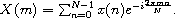

对于给定的 *N*，将常量量抽象化是方便的

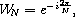

以获得更简洁但等效的方程式

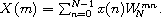

对 *N* 个输出值的直接计算，每个值都是 *N* 个中间值的和，需要约 *N*² 次操作。*快速* 傅里叶变换 (FFT)，当 *N* 是 2 的幂时适用，只需要约 *N*log[2]*N* 次操作。虽然通常呈现为相当复杂的迭代算法，但快速傅里叶变换最简洁、优雅地表达为递归算法。

递归算法，归因于 Sam Daniel [7]，可以通过以下方式操纵前述求和推导得出。我们首先将求和拆分为两个求和，并将它们重新组合成一个求和从 0 到 *N*/2 - 1。

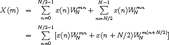

然后我们提取出公共因子 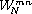。

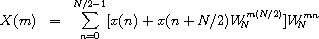

我们可以将 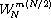 减少到当 *m* 是偶数时为 1，当 *m* 是奇数时为 -1，因为

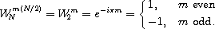

这使我们能够专门为 *m* = 2*k* 和 *m* = 2*k* + 1 的偶数和奇数情况定制求和，其中 0 ≤ *k* ≤ *N*/2 - 1。

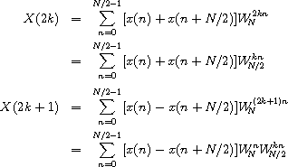

结果的求和是*N*/2 元素序列的 DFT

{*x*(*n*) + *x*(*n* + *N*/2)}[*n*=0]^(*N*/2-1)

和

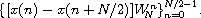

因此，可以通过交错两个 *N*/2 元素序列的 DFT 来递归地计算 N 元素序列的 DFT。如果我们选择两个元素作为基本情况，我们可以描述一个递归快速傅里叶变换 (RFFT) 算法如下。对于 *N* = 2，

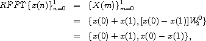

由于 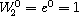。对于 *N* > 2，

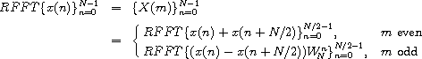

伴随着偶数和奇数分量的交错。

上图改编自 Sam Daniel 的一幅图[7]，展示了 RFFT 算法的计算结构。第一阶段计算输入的前半部分和后半部分的成对和差；这个阶段被标记为*butterfly*阶段。第二阶段对结果子序列进行递归。第三阶段将两个递归调用的 RFFT 的输出交错，从而产生正确排序的序列{*X*(*m*)}[*m*=0]^(*N*-1)。

过程`dft`接受一个值序列（列表），`x`，其长度被假定为 2 的幂。`dft`预先计算一系列的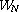的幂，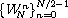，并调用`rfft`来启动递归。`rfft`遵循上述算法。

`(define (dft x)

(define (w-powers n)

(let ([pi (* (acos 0.0) 2)])

(let ([delta (/ (* -2.0i pi) n)])

(let f ([n n] [x 0.0])

(if (= n 0)

'()

(cons (exp x) (f (- n 2) (+ x delta))))))))

(define (evens w)

(if (null? w)

'()

(cons (car w) (evens (cddr w)))))

(define (interlace x y)

(if (null? x)

'()

(cons (car x) (cons (car y) (interlace (cdr x) (cdr y))))))

(define (split ls)

(let split ([fast ls] [slow ls])

(if (null? fast)

(values '() slow)

(let-values ([(front back) (split (cddr fast) (cdr slow))])

(values (cons (car slow) front) back)))))

(define (butterfly x w)

(let-values ([(front back) (split x)])

(values

(map + front back)

(map * (map - front back) w))))

(define (rfft x w)

(if (null? (cddr x))

(let ([x0 (car x)] [x1 (cadr x)])

(list (+ x0 x1) (- x0 x1)))

(let-values ([(front back) (butterfly x w)])

(let ([w (evens w)])

(interlace (rfft front w) (rfft back w))))))

(rfft x (w-powers (length x))))`

#### 练习 12.9.1

修改算法以使用四个点作为基本情况。如何简化以避免将任何基本情况的输出乘以`w`的元素？

#### 练习 12.9.2

重新编码`dft`以接受向量而不是列表作为输入，并产生向量作为输出。必要时在内部使用列表，但不要简单地在输入时将其转换为列表，然后在退出时将输出转换为向量。

#### 练习 12.9.3

而不是在每一步为新的点数重新计算`w`的幂，代码简单地使用前一个幂列表的偶数元素。展示这样做会产生正确的幂列表。也就是说，展示`(evens (w-powers n))`等于`(w-powers (/ n 2))`。

#### 练习 12.9.4

递归步骤创建了几个立即丢弃的中间列表。重新编码递归步骤以避免任何不必要的分配。

#### 练习 12.9.5

输入值序列的每个元素可以通过离散傅立叶变换的方程重新生成

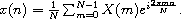

注意到这个方程与定义*X*(*m*)的原始方程之间的相似性，创建一个修改版本的`dft`，`inverse-dft`，执行逆变换。验证`(inverse-dft (dft *seq*))`对几个输入序列`*seq*`返回`*seq*`。

### 第 12.10 节。统一算法

*统一*是一种模式匹配技术，用于自动定理证明、类型推断系统、计算机代数和逻辑编程，例如，Prolog。

一个统一算法尝试通过计算表达式的统一替换来使两个符号表达式相等。*替换*是一个将变量替换为其他表达式的函数。替换必须以相同的方式处理变量的所有出现，例如，如果它用*a*替换变量*x*的一个出现，它必须用*a*替换*x*的所有出现。两个表达式*e*[1]和*e*[2]的统一替换，或*统一器*，是一个替换，，使得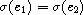。

例如，两个表达式*f*(*x*)和*f*(*y*)可以通过将*y*替换为*x*（或*x*替换为*y*）统一。在这种情况下，统一器可以描述为将*y*替换为*x*并保持其他变量不变的函数。另一方面，两个表达式*x* + 1 和*y* + 2 无法统一。看起来，将 3 替换为*x*和 2 替换为*y*会使两个表达式都等于 4，因此相互相等。然而，符号表达式 3 + 1 和 2 + 2 仍然不同。

两个表达式可能有多个统一器。例如，表达式*f*(*x*,*y*)和*f*(1,*y*)可以通过将 1 替换为*x*统一为*f*(1,*y*)。它们也可以通过将 1 替换为*x*和 5 替换为*y*统一为*f*(1,5)。第一个替换是首选的，因为它不会对*y*进行不必要的替换。统一算法通常为两个表达式生成*最一般统一器*，或*mgu*。两个表达式的 mgu 不进行不必要的替换；表达式的所有其他统一器都是 mgu 的特例。在上面的例子中，第一个替换是 mgu，第二个是特例。

对于这个程序的目的，符号表达式可以是变量、常量或函数应用。变量由 Scheme 符号表示，例如，`x`；函数应用由列表表示，函数名在第一个位置，参数在其余位置，例如，`(f x)`；常量由零参数函数表示，例如，`(a)`。

这里介绍的算法使用传递继续风格或 CPS（参见第 3.4 节）的方法，在子术语上递归找到两个术语的 mgu（如果存在）。过程`unify`接受两个术语，并将它们传递给一个帮助过程`uni`，同时还有一个初始（身份）替换、一个成功继续和一个失败继续。成功继续返回将其参数，一个替换，应用于其中一个术语的结果，即统一的结果。失败继续简单地返回其参数，一个消息。因为在`unify`内部通过显式继续传递控制（始终使用尾调用），从成功或失败继续返回就是从`unify`本身返回。

替换是过程。每当一个变量需要被另一个术语替换时，就会从变量、术语和现有替换中形成一个新替换。给定一个术语作为参数，新替换将在调用保存的变量的出现次数中用保存的术语替换其保存的变量的结果上。直观地说，替换是一系列过程，每个变量在替换中对应一个过程。链由初始的身份替换终止。

`(统一 'x 'y)  y

(统一 '(f x y) '(g x y))  "clash"

(统一 '(f x (h)) '(f (h) y))  (f (h) (h))

(统一 '(f (g x) y) '(f y x))  "cycle"

(统一 '(f (g x) y) '(f y (g x)))  (f (g x) (g x))

(统一 '(f (g x) y) '(f y z))  (f (g x) (g x))`

`(库 (tspl unification)

(导出 unify)

(导入 (rnrs))

; occurs? 仅在 u 出现在 v 中时返回 true

(定义 occurs?

(lambda (u v)

(并且 (pair? v)

(让 f ([l (cdr v)])

(并且 (pair? l)

(或 (eq? u (car l))

(occurs? u (car l))

(f (cdr l))))))))

; sigma 通过返回一个扩展 s 的新替换过程来返回

; 用 v 替换 u 的替换

(定义 sigma

(lambda (u v s)

(lambda (x)

(让 f ([x (s x)])

(如果 (symbol? x)

(如果 (eq? x u) v x)

(cons (car x) (map f (cdr x))))))))

; try-subst 尝试用 v 替换 u，但可能需要

; 如果 (s u) 不是一个变量，则进行完全统一

; 如果看到 u 出现在 v 中，则失败。

(定义 try-subst

(lambda (u v s ks kf)

(让 ([u (s u)])

(如果 (不 (symbol? u))

(uni u v s ks kf)

(让 ([v (s v)])

(条件

[(eq? u v) (ks s)]

[(occurs? u v) (kf "cycle")]

[其他 (ks (sigma u v s))]))))))

; uni 尝试使用传递继续统一 u 和 v

; 返回一个将替换返回给成功参数的样式

; ks 或者错误消息返回给失败参数 kf。 

; 替换本身由一个过程表示

; 变量到术语。

(定义 uni

(lambda (u v s ks kf)

(条件

[(symbol? u) (try-subst u v s ks kf)]

[(symbol? v) (try-subst v u s ks kf)]

[(并且 (eq? (car u) (car v))

(= (length u) (length v)))

(让 f ([u (cdr u)] [v (cdr v)] [s s])

(如果 (null? u)

(ks s)

(uni (car u)

(car v)

s

(lambda (s) (f (cdr u) (cdr v) s))

kf)))]

[else (kf "clash")])))

; unify 展示了 uni 的一个可能接口，其中初始

; 替换是恒等过程，初始成功

; 延续返回统一的术语，初始失败

; 延续返回错误消息。

(define unify

(lambda (u v)

(uni u

v

(lambda (x) x)

(lambda (s) (s u))

(lambda (msg) msg)))))`

#### 练习 12.10.1

修改 `unify`，使其返回其替换而不是统一的术语。将此替换应用于两个输入术语，以验证它对每个输入返回相同的结果。

#### 练习 12.10.2

如上所述，对术语的替换是顺序执行的，每替换一个变量需要对输入表达式进行一整个遍历。以不同方式表示替换，使得只需对表达式进行一次遍历。确保替换不仅在输入表达式上执行，还在替换过程中插入的任何表达式上执行。

#### 练习 12.10.3

将延续传递风格的统一算法扩展为整个延续传递风格逻辑编程系统。

### 第 12.11 节。使用引擎进行多任务处理

引擎是支持*定时抢占*的高级进程抽象[10,15]。引擎可用于模拟多处理，实现轻量级线程，实现操作系统内核，并执行非确定性计算。引擎实现是 Scheme 中延续的更有趣的应用之一。

通过将一个 thunk（无参数过程）传递给 `make-engine` 过程来创建一个引擎。thunk 的主体是引擎执行的计算。引擎本身是一个带有三个参数的过程：

1.  `*ticks*`，一个正整数，指定要提供给引擎的*燃料*量。引擎执行直到燃料耗尽或计算完成。

1.  `*complete*`，一个带有两个参数的过程，指定计算完成时要执行的操作。其参数将是剩余的燃料量和计算的结果。

1.  `*expire*`，一个带有一个参数的过程，指定如果计算完成前燃料耗尽时要执行的操作。其参数将是一个新的引擎，能够从中断点继续计算。

当引擎应用于其参数时，它设置一个定时器，在`*ticks*`时间单位后触发。如果引擎计算在定时器触发之前完成，系统调用 `*complete*`，传递剩余的`*ticks*`数量和计算的值。另一方面，如果定时器在引擎计算完成之前触发，系统将从中断的计算的延续创建一个新的引擎，并将此引擎传递给 `*expire*`。`*complete*` 和 `*expire*` 在引擎调用的延续中被调用。

以下示例从一个微不足道的计算（3）创建了一个引擎，并为该引擎提供了 10 个滴答。

`(define eng

(make-engine

(lambda () 3)))

(eng 10

(lambda (ticks value) value)

(lambda (x) x))  3`

将 `list` 作为引擎的 `*complete*` 过程传递通常是有用的，这会导致引擎返回剩余的滴答数以及计算完成后的值列表。

`(eng 10

list

(lambda (x) x))  (9 3)`

在上面的示例中，值为 3，剩余 9 个滴答，也就是说，只需要一个单位的燃料来评估 3。（这里给出的燃料数量仅供参考。实际数量可能有所不同。）

通常，引擎计算不会在一次尝试中完成。以下示例显示了使用引擎在步骤中计算第 10 个斐波那契数（参见第 3.2 节）的用法。

`(define fibonacci

(lambda (n)

(if (< n 2)

n

(+ (fibonacci (- n 1))

(fibonacci (- n 2))))))

(define eng

(make-engine

(lambda ()

(fibonacci 10))))

(eng 50

list

(lambda (new-eng)

(set! eng new-eng)

"expired"))  "expired"

(eng 50

list

(lambda (new-eng)

(set! eng new-eng)

"expired"))  "expired"

(eng 50

list

(lambda (new-eng)

(set! eng new-eng)

"expired"))  "expired"

(eng 50

list

(lambda (new-eng)

(set! eng new-eng)

"expired"))  (22 55)`

每当引擎的燃料耗尽时，`*expire*` 过程将 `eng` 分配给新引擎。整个计算需要四个 50 个滴答的分配才能完成；在最后的 50 个滴答中，除了 23 个之外，全部用完了。因此，总共使用的燃料量为 177 个滴答。这导致了以下程序 `mileage`，该程序使用引擎来"计时"计算。

`(define mileage

(lambda (thunk)

让我们来看看，循环(eng] [total-ticks 0])

(eng 50

(lambda (ticks value)

(+ total-ticks (- 50 ticks)))

(lambda (new-eng)

(loop new-eng (+ total-ticks 50)))))))

(mileage (lambda () (fibonacci 10)))  178`

选择每次使用 50 个滴答的数量是任意的，当然也可以选择一个更大的数字，例如 10000，以减少计算被中断的次数。

下一个过程 `round-robin` 可以成为一个简单的时间共享操作系统的基础。 `round-robin` 维护一个进程队列（引擎列表），并以*轮转*方式循环遍历队列，允许每个进程运行一段时间。 `round-robin` 返回引擎计算返回的值列表，按计算完成的顺序排列。

`(define round-robin

(lambda (engs)

如果 `engs` 为 `null`，

'()

((car engs) 1

(lambda (ticks value)

(cons value (round-robin (cdr engs))))

(lambda (eng)

(round-robin

(append (cdr engs) (list eng))))))))`

'假设与一个 tick 相对应的计算量是恒定的，则 `round-robin` 的效果是返回一个列表，其中包含从最快完成到最慢完成的值。因此，当我们对一个引擎列表调用 `round-robin`，每个引擎计算一个斐波那契数时，输出列表按照较早的斐波那契数排在前面，而不管输入列表的顺序如何。'

'`（round-robin'

`(map (lambda (x)`

`(make-engine`

`(lambda ()`

`(fibonacci x))))`

`'（4 5 2 8 3 7 6 2）`  `(1 1 2 3 5 8 13 21)`

'如果燃料的数量每次循环都不同，则可能会发生更有趣的事情。在这种情况下，计算将是非确定性的，即结果会因调用而异。'

'以下语法形式 `por`（并行或）返回首个完成并具有真值的表达式。`por` 是用过程 `first-true` 实现的，它类似于 `round-robin`，但是当任何一个引擎完成并具有真值时就退出。如果所有引擎都完成，但没有一个具有真值，`first-true`（因此 `por`）返回 `#f`。'

'`（define-syntax por`'

'`（syntax-rules ()）`

`[(_ x ...)`

`(first-true`

`(list (make-engine (lambda () x)) ...))]))`

`(define first-true`

`(lambda (engs)`

`(if (null? engs)`

`#f`

`((car engs) 1`

`(lambda (ticks value)`

`(or value (first-true (cdr engs))))`

`(lambda (eng)`

`(first-true`

`(append (cdr engs) (list eng))))))))`

'即使其中一个表达式是无限循环，`por` 仍然可以完成（只要另一个表达式完成并返回真值即可）。'

'`（por 1 2）`  `1'

`(por ((lambda (x) (x x)) (lambda (x) (x x)))`

`(fibonacci 10))`  `55`

'第二个 `por` 表达式的第一个子表达式是非终止的，因此答案是第二个子表达式的值。'

'让我们转向引擎的实现。任何抢占式多任务原语都必须具有在给定计算量后中断运行的能力。某些 Scheme 实现提供了原始计时器中断机制来提供此功能。我们将在此构建一个合适的计时器中断机制。'

'我们的计时器系统定义了三个过程：`start-timer`、`stop-timer` 和 `decrement-timer`，它们的操作如下所述。'

+   '`（start-timer *ticks* *handler*）` 将计时器设置为 `*ticks*` 并安装 `*handler*` 作为计时器到期时调用的过程（不带参数）。'

+   '`（stop-timer）` 重置计时器并返回剩余的 tick 数。'

+   '`(decrement-timer)` 函数将计时器减少一个 tick，如果计时器开启，即计时器不为零。当计时器达到零时，`decrement-timer` 调用保存的处理程序。如果计时器已经达到零，则 `decrement-timer` 在不改变计时器的情况下返回。'

'这些过程的实现代码与下面的引擎实现一起给出。'

使用计时器系统需要在适当的位置插入对`decrement-timer`的调用。在进入过程时消耗一个计时器滴答通常提供了足够的粒度。这可以通过在`lambda`的位置使用下面定义的`timed-lambda`来实现。`timed-lambda`在执行其主体中的表达式之前简单地调用`decrement-timer`。

`(define-syntax timed-lambda

(syntax-rules ()

[(_ 形式参数 表达式 1 表达式 2 ...)

(lambda 形式参数 (decrement-timer) 表达式 1 表达式 2 ...)]))`

重新定义命名的`let`和`do`以使用`timed-lambda`可能很有用，以便用这些构造表达的递归被计时。如果使用此机制，请不要忘记在引擎内运行的代码中使用`lambda`和其他形式的计时版本，否则将不会消耗任何滴答。

现在我们有了一个合适的计时器，我们可以根据计时器和继续实现引擎。在引擎实现中，我们在两个地方使用`call/cc`：(1)获取调用引擎的计算的继续，以便在引擎计算完成或计时器到期时返回到该继续，以及(2)获取计时器到期时引擎计算的继续，以便在随后运行新创建的引擎时返回到此计算。

引擎系统的状态包含在引擎系统内部的两个变量中：`do-complete`和`do-expire`。当启动引擎时，引擎为`do-complete`和`do-expire`分配了一些过程，当调用时，返回到引擎的调用者的继续，以调用`*complete*`或`*expire*`。引擎通过调用传递给`make-engine`的参数中的过程以指定数量的滴答来启动（或重新启动）计算。然后使用滴答和本地过程`timer-handler`来启动计时器。

假设引擎计算完成之前计时器到期。然后调用过程`timer-handler`。它通过使用`call/cc`和`do-expire`获取滴答。因此，`do-expire`被调用并传入一个继续，如果调用，将重新启动计时器并继续中断的计算。`do-expire`从这个继续创建一个新的引擎，并安排引擎的`*expire*`过程在正确的继续中被调用。

另一方面，如果引擎计算在计时器到期之前完成，计时器将停止，并将剩余的滴答数与值一起传递给`do-complete`；`do-complete`安排引擎的`*complete*`过程在正确的继续中使用滴答和值被调用。

让我们讨论一下这段代码的一些微妙之处。首先涉及到的是当引擎被调用时启动计时器的方法。如果让`new-engine`在启动计时器之前启动计时器，而不是将 ticks 传递给计算并让其启动计时器，代码似乎会更简化。然而，在计算内部启动计时器可以防止 ticks 被过早消耗。如果引擎系统本身消耗燃料，则提供少量燃料的引擎可能不会向完成进展（实际上可能是负进展）。如果使用上面描述的软件计时器，通过使用`lambda`的无计时版本编译引擎制造代码，实际上可以避免这个问题。

第二个微妙之处涉及到由`do-complete`和`do-expire`创建并随后由`call/cc`应用的过程。看起来`do-complete`可以首先调用引擎的`*complete*`过程，然后将结果传递给延续（对于`do-expire`也是如此），如下所示。

`(escape (complete value ticks))`

然而，这将导致对尾递归的不正确处理。问题在于，在调用`complete`过程返回之前，当前延续不会被替换为存储在`escape`中的延续。因此，当引擎实际调用可能看起来是尾递归时，正在运行的引擎的延续和引擎调用的延续都可能被保留很长时间。这尤其不合适，因为引擎接口鼓励使用传递风格和因此尾递归。循环调度程序和`first-true`提供了很好的例子，因为其中的每个`*expire*`过程都尾递归地调用引擎。

我们通过安排`do-complete`和`do-expire`在调用`complete`或`expire`过程之前从正在运行的引擎的延续中逃逸来保持对尾递归的正确处理。由于引擎调用的延续是一个过程应用，将一个没有参数的过程传递给它将导致在引擎调用的延续中应用该过程。

`(library (tspl timer)

(export start-timer stop-timer decrement-timer)

(import (rnrs))

(define clock 0)

(define handler #f)

(define start-timer

(lambda (ticks new-handler)

(set! handler new-handler)

(set! clock ticks)))

(define stop-timer

(lambda ()

(let ([time-left clock])

(set! clock 0)

time-left)))

(define decrement-timer

(lambda ()

(when (> clock 0)

(set! clock (- clock 1))

(when (= clock 0) (handler)))))

(define-syntax timed-lambda

(syntax-rules ()

[(_ formals exp1 exp2 ...)

(lambda formals (decrement-timer) exp1 exp2 ...)])))

(library (tspl engines)

(export make-engine timed-lambda)

(import (rnrs) (tspl timer))

(define make-engine

(let ([do-complete #f] [do-expire #f])

(define timer-handler

(lambda ()

(start-timer (call/cc do-expire) timer-handler)))

(define new-engine

(lambda (resume)

(lambda (ticks complete expire)

((call/cc

(lambda (escape)

(set! do-complete

(lambda (ticks value)

(escape (lambda () (complete ticks value)))))

(set! do-expire

(lambda (resume)

(escape (lambda ()

(expire (new-engine resume))))))

(resume ticks)))))))

(lambda (proc)

(new-engine

(lambda (ticks)

(start-timer ticks timer-handler)

(let ([value (proc)])

(let ([ticks (stop-timer)])

(do-complete ticks value))))))))

(define-syntax timed-lambda

(syntax-rules ()

[(_ formals exp1 exp2 ...)

(lambda formals (decrement-timer) exp1 exp2 ...)])))`

#### Exercise 12.11.1

如果你的 Scheme 实现允许在交互式顶层定义和导入库，请尝试在上面定义库，然后输入

`(import (rename (tspl engines) (timed-lambda lambda)))`

来定义`make-engine`并重新定义`lambda`。然后尝试本节前面给出的示例。

#### Exercise 12.11.2

在`make-engine`的主体中出现嵌套的`let`表达式可能会出现：

`(let ([value (proc)])

(let ([ticks (stop-timer)])

(do-complete ticks value)))`

可以用以下内容替换。

`(let ([value (proc)] [ticks (stop-timer)])

(do-complete value ticks))`

为什么这不正确？

#### Exercise 12.11.3

用以下内容替换前面练习中讨论的嵌套`let`表达式也是不正确的。

`(let ([value (proc)])

(do-complete value (stop-timer)))`

为什么？

#### Exercise 12.11.4

修改引擎实现以提供一个名为`engine-return`的过程，该过程可以立即从引擎返回。

#### Exercise 12.11.5

使用引擎为进程实现一个小型操作系统的内核。进程应通过评估形式为`(trap 'request)`的表达式来请求服务（例如从用户读取输入）。使用前面练习中的`call/cc`和`engine-return`来实现`trap`。

#### Exercise 12.11.6

不使用引擎，而是从延续和定时器中断构建，编写相同的操作系统内核。

#### Exercise 12.11.7

这种引擎实现不允许一个引擎调用另一个引擎，即嵌套引擎[10]。修改实现以允许嵌套引擎。
