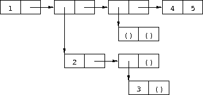
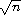

# 选定练习的答案

**练习 2.2.1. **(第 20 页)

| *  a*. | `(+ (* 1.2 (- 2 1/3)) -8.7)` |
| --- | --- |
| *  b*. | `(/ (+ 2/3 4/9) (- 5/11 4/3))` |
| *  c*. | `(+ 1 (/ 1 (+ 2 (/ 1 (+ 1 1/2)))))` |
| *  d*. | `(* (* (* (* (* (* 1 -2) 3) -4) 5) -6) 7)` 或 `(* 1 -2 3 -4 5 -6 7)` |

**练习 2.2.2. **(第 20 页)

参见第 6.4 节。

**练习 2.2.3. **(第 20 页)

| *  a*. | `(car . cdr)` |
| --- | --- |
| *  b*. | `(this (is silly))` |
| *  c*. | `(is this silly?)` |
| *  d*. | `(+ 2 3)` |
| *  e*. | `(+ 2 3)` |
| *  f*. | `+` |
| *  g*. | `(2 3)` |
| *  h*. | `#<procedure>` |
| *  i*. | `cons` |
| *  j*. | `'cons` |
| *  k*. | `quote` |
| *  l*. | `5` |
| *  m*. | `5` |
| *  n*. | `5` |
| *  o*. | `5` |

**练习 2.2.4. **(第 21 页)

`(car (cdr (car '((a b) (c d)))))  b

(car (car (cdr '((a b) (c d)))))  c

(car (cdr (car (cdr '((a b) (c d))))))  d`

**练习 2.2.5. **(第 21 页)

`'((a . b) ((c) d) ())`

**练习 2.2.6. **(第 21 页)

**练习 2.2.7. **(第 21 页)

`(car '((a b) (c d)))  (a b)

(car (car '((a b) (c d))))  a

(cdr (car '((a b) (c d))))  (b)

(car (cdr (car '((a b) (c d)))))  b

(cdr (cdr (car '((a b) (c d)))))  ()

(cdr '((a b) (c d)))  ((c d))

(car (cdr '((a b) (c d))))  (c d)

(car (car (cdr '((a b) (c d)))))  c

(cdr (car (cdr '((a b) (c d)))))  (d)

(car (cdr (car (cdr '((a b) (c d)))))  d

(cdr (cdr (car (cdr '((a b) (c d)))))  ()

(cdr (cdr '((a b) (c d))))  ()

**练习 2.2.8. **(第 21 页)

参见第 2.3 节。

**练习 2.3.1. **(第 23 页)

1.  评估变量`list`、`+`、`-`、`*`和`/`，得到列表、加法、减法、乘法和除法过程。

1.  将加法、减法、乘法和除法过程应用于列表过程，得到按顺序包含这些过程的列表。

1.  评估变量`cdr`，得到 cdr 过程。

1.  将步骤 2 中生成的列表应用于 cdr 过程，得到包含减法、乘法和除法过程的列表。

1.  评估变量`car`，得到 car 过程。

1.  将步骤 4 中生成的列表应用于 car 过程，得到减法过程。

1.  评估常量`17`和`5`，得到`17`和`5`。

1.  将减法过程应用于`17`和`5`，得到`12`。

其他顺序也是可能的。例如，变量`car`可能在其参数之前被评估。

**练习 2.4.1. **(页 25)

| *  a*. | `(let ([x (* 3 a)]) (+ (- x b) (+ x b)))` |
| --- | --- |
| *  b*. | `(let ([x (list a b c)]) (cons (car x) (cdr x)))` |

**练习 2.4.2. **(页 25)

值为 54。外部`let`将`x`绑定到 9，而内部`let`将`x`绑定到 3（9/3）。内部`let`评估为 6（3 + 3），外部`let`评估为 54（9 × 6）。

**练习 2.4.3. **(页 26)

| *  a*. | `(let ([x0 'a] [y0 'b])   (list (let ([x1 'c]) (cons x1 y0))

(let ([y1 'd]) (cons x0 y1))))` |

| *  b*. | `(let ([x0 '((a b) c)])   (cons (let ([x1 (cdr x0)]) |

(car x1))

(let ([x2 (car x0)])

(cons (let ([x3 (cdr x2)])

(car x3))

(cons (let ([x4 (car x2)])

x4)

(cdr x2))))))` |

**练习 2.5.1. **(页 30)

| *  a*. | `a` |
| --- | --- |
| *  b*. | `(a)` |
| *  c*. | `a` |
| *  d*. | `()` |

**练习 2.5.2. **(页 30)

请参阅页 31。

**练习 2.5.3. **(页 30)

| *  a*. | 没有自由变量 |
| --- | --- |
| *  b*. | `+` |
| *  c*. | `f` |
| *  d*. | `cons`、`f` 和 `y` |
| *  e*. | `cons` 和 `y` |
| *  f*. | `cons`、`y` 和 `z`（`y`也作为绑定变量出现） |

**练习 2.6.1. **(页 34)

程序将无限循环。

**练习 2.6.2. **(页 34)

`(define compose

(lambda (p1 p2)

(lambda (x)

(p1 (p2 x)))))

(define cadr (compose car cdr))

(define cddr (compose cdr cdr))`

**练习 2.6.3. **(页 34)

`(define caar (compose car car))

(define cadr (compose car cdr))

(define cdar (compose cdr car))

(define cddr (compose cdr cdr))

(define caaar (compose car caar))

(define caadr (compose car cadr))

(define cadar (compose car cdar))

(define caddr (compose car cddr))

(define cdaar (compose cdr caar))

(define cdadr (compose cdr cadr))

(define cddar (compose cdr cdar))

(define cdddr (compose cdr cddr))

(define caaaar (compose caar caar))

(define caaadr (compose caar cadr))

(define caadar (compose caar cdar))

(define caaddr (compose caar cddr))

(define cadaar (compose cadr caar))

(define cadadr (compose cadr cadr))

(define caddar (compose cadr cdar))

(define cadddr (compose cadr cddr))

(define cdaaar (compose cdar caar))

(define cdaadr (compose cdar cadr))

(define cdadar (compose cdar cdar))

(define cdaddr (compose cdar cddr))

(define cddaar (compose cddr caar))

(define cddadr (compose cddr cadr))

(define cdddar (compose cddr cdar))

(define cddddr (compose cddr cddr))`

**练习 2.7.1. **(页 41)

`(define atom?

(lambda (x)

(not (pair? x))))`

**练习 2.7.2. **(第 41 页)

`(define shorter

(lambda (ls1 ls2)

(if (< (length ls2) (length ls1))

ls2

ls1)))`

**练习 2.8.1. **(第 46 页)

输出的结构将是输入结构的镜像。例如，`(a . b)`将变为`(b . a)`，`((a . b) . (c . d))`将变为`((d . c) . (b . a))`。

**练习 2.8.2. **(第 46 页)

`(define append

(lambda (ls1 ls2)

(if (null? ls1)

ls2

(cons (car ls1) (append (cdr ls1) ls2)))))`

**练习 2.8.3. **(第 46 页)

`(define make-list

(lambda (n x)

(if (= n 0)

'()

(cons x (make-list (- n 1) x)))))`

**练习 2.8.4. **(第 47 页)

查看第 160 页上`list-ref`的描述以及第 160 页上`list-tail`的描述。

**练习 2.8.5. **(第 47 页)

`(define shorter?

(lambda (ls1 ls2)

(and (not (null? ls2))

(or (null? ls1)

(shorter? (cdr ls1) (cdr ls2))))))

(define shorter

(lambda (ls1 ls2)

(if (shorter? ls2 ls1)

ls2

ls1)))`

**练习 2.8.6. **(第 47 页)

`(define even?

(lambda (x)

(or (= x 0)

(odd? (- x 1)))))

(define odd?

(lambda (x)

(and (not (= x 0))

(even? (- x 1)))))`

**练习 2.8.7. **(第 47 页)

`(define transpose

(lambda (ls)

(cons (map car ls) (map cdr ls))))`

**练习 2.9.1. **(第 54 页)

`(define make-counter

(lambda (初始化 增量)

(let ([next init])

(lambda ()

(let ([v next])

(set! next (+ next incr))

v)))))`

**练习 2.9.2. **(第 55 页)

`(define make-stack

(lambda ()

(let ([ls '()])

(lambda (msg . args)

(case msg

[(empty? mt?) (null? ls)]

[(push!) (set! ls (cons (car args) ls))]

[(top) (car ls)]

[(pop!) (set! ls (cdr ls))]

[else "oops"])))))`

**练习 2.9.3. **(第 55 页)

`(define make-stack

(lambda ()

(let ([ls '()])

(lambda (msg . args)

(case msg

[(empty? mt?) (null? ls)]

[(push!) (set! ls (cons (car args) ls))]

[(top) (car ls)]

[(pop!) (set! ls (cdr ls))]

[(ref) (list-ref ls (car args))]

[(set!) (set-car! (list-tail ls (car args)) (cadr args))]

[else "oops"])))))`

**练习 2.9.4. **(第 55 页)

`(define make-stack

(lambda (n)

(let ([v (make-vector n)] [i -1])

(lambda (msg . args)

(case msg

[(empty? mt?) (= i -1)]

[(push!)

(set! i (+ i 1))

(vector-set! v i (car args))]

[(top) (vector-ref v i)]

[(pop!) (set! i (- i 1))]

[(ref) (vector-ref v (- i (car args)))]

[(set!) (vector-set! v (- i (car args)) (cadr args))]

[else "oops"])))))`

**练习 2.9.5. **(第 56 页)

`(define emptyq?

(lambda (q)

(eq? (car q) (cdr q))))

(define getq

(lambda (q)

(if (emptyq? q)

(assertion-violation 'getq "队列为空")

(car (car q)))))

(define delq!

(lambda (q)

(if (emptyq? q)

(assertion-violation 'delq! "队列为空")

(set-car! q (cdr (car q))))))`

**练习 2.9.6. **(第 56 页)

`(define make-queue

(lambda ()

(cons '() '())))

(define putq!

(lambda (q v)

(let ([p (cons v '())])

(if (null? (car q))

(begin

(set-car! q p)

(set-cdr! q p))

(begin

(set-cdr! (cdr q) p)

(set-cdr! q p))))))

(define getq

(lambda (q)

(car (car q))))

(define delq!

(lambda (q)

(if (eq? (车 q) (牛 q))

(begin

(set-car! q '())

(set-cdr! q '()))

(set-car! q (cdr (car q))))))`

**练习 2.9.7. **(第 56 页)

当要求打印循环结构时，一些实现会打印一个反映其循环结构的输出表示。其他实现则无法检测到循环并产生无输出或无限输出流。当 `length` 被传递一个循环列表时，会引发异常，可能会显示列表不是正确的消息。然而，第 42 页上 `length` 的定义将简单地无限循环。

**练习 2.9.8. **(第 56 页)

`(define race

(lambda (hare tortoise)

(if (pair? hare)

(let ([hare (cdr hare)])

(if (pair? hare)

(and (not (eq? hare tortoise))

(race (cdr hare) (cdr tortoise)))

(null? hare)))

(null? hare))))

(define list?

(lambda (x)

(race x x)))`

**练习 3.1.1. **(第 64 页)

`(let ([x (memv 'a ls)]) (and x (memv 'b x))) 

((lambda (x) (and x (memv 'b x))) (memv 'a ls)) 

((lambda (x) (if x (and (memv 'b x)) #f)) (memv 'a ls)) 

((lambda (x) (if x (memv 'b x) #f)) (memv 'a ls))`

**练习 3.1.2. **(第 64 页)

`(or (memv x '(a b c)) (list x)) 

(let ((t (memv x '(a b c)))) (if t t (or (list x)))) 

((lambda (t) (if t t (or (list x)))) (memv x '(a b c))) 

((lambda (t) (if t t (list x))) (memv x '(a b c)))`

**练习 3.1.3. **(第 64 页)

查看第 97 页。

**练习 3.1.4. **(第 64 页)

`(define-syntax when

(syntax-rules ()

[(_ e0 e1 e2 ...)

(if e0 (begin e1 e2 ...))]))

(define-syntax unless

(syntax-rules ()

[(_ e0 e1 e2 ...)

(when (not e0) e1 e2 ...)]))`

**练习 3.2.1. **(第 72 页)

尾递归：`even?` 和 `odd?`，`race`，第二个 `factorial` 定义中的 `fact`，第二个 `fibonacci` 版本中的 `fib`。非尾递归：`sum`，`factorial`，第一个 `fibonacci` 版本中的 `fib`。两者都包括：`factor`。

**练习 3.2.2. **(第 72 页)

`(define factor

(λ (n)

(letrec ([f (λ (n i)

(条件

[(>= i n) (列表 n)]

[(整数? (/ n i))

(cons i (f (/ n i) i))]

[否则 (f n (+ i 1))]))])

(f n 2))))`

**练习 3.2.3. **(页 72)

是的，但我们需要两个命名的`let`表达式，一个用于`even?`，一个用于`odd?`。

`(让 even? ([x 20])

(或 (= x 0)

(让 odd? ([x (- x 1)])

(和 (不 (= x 0))

(even? (- x 1))))))`

**练习 3.2.4. **(页 72)

`(定义 fibcount1 0)

(定义 fibonacci1

(λ (n)

(让 fib ([i n])

(set! fibcount1 (+ fibcount1 1))

(条件

[(= i 0) 0]

[(= i 1) 1]

[否则 (+ (fib (- i 1)) (fib (- i 2)))]))))

(定义 fibcount2 0)

(定义 fibonacci2

(λ (n)

(如果 (= n 0)

0

(让 fib ([i n] [a1 1] [a2 0])

(set! fibcount2 (+ fibcount2 1))

(如果 (= i 1)

a1

(fib (- i 1) (+ a1 a2) a1))))))`

`(斐波那契数 10`的计数为 177 和 10，`斐波那契数 20`的计数为 21891 和 20，`斐波那契数 30`的计数为 2692537 和 30\. 第二个调用的次数与输入成正比，而第一个调用的次数随着输入值的增加而迅速增长（事实上是指数增长）。

**练习 3.2.5. **(页 73)

请参见页 312。

**练习 3.2.6. **(页 73)

在`or`表达式的最后子表达式中的调用不是尾调用，因为`or`的修改定义。对于`even?`/`odd?`的例子，`even?`的结果定义将不再是尾递归的，对于非常大的输入可能会耗尽可用空间。

此定义执行的扩展在另一方面是不正确的，这与多返回值有关（第 5.8 节）：如果最后一个子表达式返回多个值，则`or`表达式应返回多个值，但使用不正确的定义，每个子表达式都出现在`let`的右侧，`let`期望单个返回值。简单且不正确的`and`定义也有同样的问题。

**练习 3.2.7. **(页 73)

以下三个版本中的第一个直接解决了识别出的问题，停在，避免了冗余的除法，并在 2 之后跳过偶数因子。停在可能带来最大的节省，其次是跳过大于 2 的偶数因子。避免冗余的除法不那么重要，因为只有在找到因子时才会发生。

`(定义 factor

(λ (n)

(让 f ([n n] [i 2] [step 1])

(如果 (> i (sqrt n))

(列表 n)

(让 ([n/i (/ n i)])

(如果 (整数? n/i)

(cons i (f n/i i step))

(f n (+ i step) 2)))))))`

第二个版本用`(* i i)`替换了`(> i (sqrt n))`，因为`*`通常比`sqrt`快得多。

`(定义 factor

(λ (n)

(让 f ([n n] [i 2] [step 1])

(如果 (> (* i i) n)

(列表 n)

(let ([n/i (/ n i)])

(if (integer? n/i)

(cons i (f n/i i step))

(f n (+ i step) 2)))))))`

第三个版本使用 `gcd`（参见第 179 页）来避免大部分除法，因为 `gcd` 应该比 `/` 更快。

`(define factor

(lambda (n)

(let f ([n n] [i 2] [step 1])

(if (> (* i i) n)

(list n)

(if (= (gcd n i) 1)

(f n (+ i step) 2)

(cons i (f (/ n i) i step)))))))`

要查看这些更改带来的差异，请在您的 Scheme 系统中计时每个 `factor` 版本，包括原始版本，以查看哪个性能更好。尝试各种输入，包括像 `(+ (expt 2 100) 1)` 这样的更大输入。

**练习 3.3.1. **(页码 77)

`(let ([k.n (call/cc (lambda (k) (cons k 0)))])

(let ([k (car k.n)] [n (cdr k.n)])

(write n)

(newline)

(k (cons k (+ n 1)))))`

或者使用多值（参见第 5.8 节）：

`(call-with-values

(lambda () (call/cc (lambda (k) (values k 0))))

(lambda (k n)

(write n)

(newline)

(k k (+ n 1))))`

**练习 3.3.2. **(页码 77)

`(define product

(lambda (ls)

(if (null? ls)

1

(if (= (car ls) 0)

0

(let ([n (product (cdr ls))])

(if (= n 0) 0 (* n (car ls))))))))`

**练习 3.3.3. **(页码 77)

如果其中一个进程在不调用 `pause` 的情况下返回，则返回到首次运行它的 `pause` 调用，或者如果它是列表中的第一个进程，则返回到原始的 `start` 调用。以下是允许进程显式 `quit` 的系统的重新实现。如果其他��程仍在活动，则 `lwp` 系统继续运行。否则，控制返回到原始 `start` 调用的延续。

`(define lwp-list '())

(define lwp

(lambda (thunk)

(set! lwp-list (append lwp-list (list thunk)))))

(define start

(lambda ()

(call/cc

(lambda (k)

(set! quit-k k)

(next)))))

(define next

(lambda ()

(let ([p (car lwp-list)])

(set! lwp-list (cdr lwp-list))

(p))))

(define pause

(lambda ()

(call/cc

(lambda (k)

(lwp (lambda () (k #f)))

(next)))))

(define quit

(lambda (v)

(if (null? lwp-list)

(quit-k v)

(next))))`

**练习 3.3.4. **(页码 77)

`(define lwp-queue (make-queue))

(define lwp

(lambda (thunk)

(putq! lwp-queue thunk)))

(define start

(lambda ()

(let ([p (getq lwp-queue)])

(delq! lwp-queue)

(p))))

(define pause

(lambda ()

(call/cc

(lambda (k)

(lwp (lambda () (k #f)))

(start)))))`

**练习 3.4.1. **(页码 80)

`(define reciprocal

(lambda (n success failure)

(if (= n 0)

(failure)

(success (/ 1 n)))))`

**练习 3.4.2. **(页码 80)

`(define retry #f)

(define factorial

(lambda (x)

(let f ([x x] [k (λ (x) x)])

(if (= x 0)

(begin (set! retry k) (k 1))

(f (- x 1) (lambda (y) (k (* x y))))))))`

**练习 3.4.3. **(页码 80)

`(define map/k

(lambda (p ls k)

(if (null? ls)

(k '())

(p (car ls)

(lambda (x)

(map/k p (cdr ls)

(lambda (ls)

(k (cons x ls)))))))))

(define reciprocals

(lambda (ls)

(map/k (lambda (x k) (if (= x 0) "找到零" (k (/ 1 x))))

ls

(lambda (x) x))))`

**练习 3.5.1. **(页码 85)

`(define-syntax complain

(syntax-rules ()

[(_ ek msg expr) (ek (list msg expr))]))`

**练习 3.5.2. **(页码 85)

`(define calc

(lambda (expr)

(call/cc

(lambda (ek)

(define do-calc

(lambda (expr)

(cond

[(number? expr) expr]

[(and (list? expr) (= (length expr) 3))

(let ([op (car expr)] [args (cdr expr)])

(case op

[(add) (apply-op + args)]

[(sub) (apply-op - args)]

[(mul) (apply-op * args)]

[(div) (apply-op / args)]

[else (complain "无效的运算符" op)]))]

[else (complain "无效的表达式" expr)])))

(define apply-op

(lambda (op args)

(op (do-calc (car args)) (do-calc (cadr args)))))

(define complain

(lambda (msg expr)

(ek (list msg expr))))

(do-calc expr)))))`

**练习 3.5.3. **(页码 85)

`(define calc #f)

(let ()

(define do-calc

(lambda (expr)

(cond

[(number? expr) expr]

[(and (list? expr) (= (length expr) 3))

(let ([op (car expr)] [args (cdr expr)])

(case op

[(add) (apply-op + args)]

[(sub) (apply-op - args)]

[(mul) (apply-op * args)]

[(div) (apply-op / args)]

[else (complain "无效的运算符" op)]))]

[else (complain "无效的表达式" expr)])))

(define apply-op

(lambda (op args)

(op (do-calc (car args)) (do-calc (cadr args)))))

(define complain

(lambda (msg expr)

(assertion-violation 'calc msg expr)))

(set! calc

(lambda (expr)

(do-calc expr))))`

**练习 3.5.4. **(页码 85)

这里添加了 `sqrt`, `times`（`mul`的别名）和 `expt` 以及 `minus`。

`(let ()

(define do-calc

(lambda (ek expr)

(cond

[(number? expr) expr]

[(and (list? expr) (= (length expr) 2))

(let ([op (car expr)] [args (cdr expr)])

(case op

[(minus) (apply-op1 ek - args)]

[(sqrt) (apply-op1 ek sqrt args)]

[else (complain ek "无效的一元运算符" op)]))]

[(and (list? expr) (= (length expr) 3))

(let ([op (car expr)] [args (cdr expr)])

(case op

[(add) (apply-op2 ek + args)]

[(sub) (apply-op2 ek - args)]

[(mul times) (apply-op2 ek * args)]

[(div) (apply-op2 ek / args)]

[(expt) (apply-op2 ek expt args)]

[else (complain ek "无效的二元运算符" op)]))]

[else (complain ek "无效的表达式" expr)])))

(define apply-op1

(lambda (ek op args)

(op (do-calc ek (car args)))))

(define apply-op2

(lambda (ek op args)

(op (do-calc ek (car args)) (do-calc ek (cadr args)))))

(define complain

(lambda (ek msg expr)

(ek (list msg expr))))

(set! calc

(lambda (expr)

(call/cc

(lambda (ek)

(do-calc ek expr))))))`

**练习 3.6.1. **(页码 87)

这个版本的 `gpa` 在所有输入的字母等级都是 `x` 时返回 `x`。

`(define-syntax gpa

(syntax-rules ()

[(_ g1 g2 ...)

(let ([ls (map letter->number (remq 'x '(g1 g2 ...)))])

(if (null? ls)

'x

(/ (apply + ls) (length ls))))]))`

**练习 3.6.2。**（页 87）

在库中定义了如下的`$distribution`和`distribution`之后：

`(define $distribution

(lambda (ls)

(let loop ([ls ls] [a 0] [b 0] [c 0] [d 0] [f 0])

(if (null? ls)

(list (list a 'a) (list b 'b) (list c 'c)

(list d 'd) (list f 'f))

(case (car ls)

[(a) (loop (cdr ls) (+ a 1) b c d f)]

[(b) (loop (cdr ls) a (+ b 1) c d f)]

[(c) (loop (cdr ls) a b (+ c 1) d f)]

[(d) (loop (cdr ls) a b c (+ d 1) f)]

[(f) (loop (cdr ls) a b c d (+ f 1))]

; 忽略 x 等级，参照前述练习

[(x) (loop (cdr ls) a b c d f)]

[else (assertion-violation 'distribution

"未识别的成绩等级"

(car ls))])))))

(define-syntax distribution

(syntax-rules ()

[(_ g1 g2 ...)

($distribution '(g1 g2 ...))]))`

修改`export`行以添加`distribution`（但不添加`$distribution`）。

**练习 3.6.3。**（页 87）

在定义了以下`histogram`之后：

`(define histogram

(lambda (port distr)

(for-each

(lambda (n g)

(put-datum port g)

(put-string port ": ")

(let loop ([n n])

(unless (= n 0)

(put-char port #\*)

(loop (- n 1))))

(put-string port "\n"))

(map car distr)

(map cadr distr))))`

修改`export`行以添加`histogram`。该解决方案使用`for-each`，在 118 页上描述了该方法。
