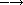
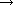

# 形式语法

此处显示的正式语法和相应的文本描述了 Scheme 数据值或 *数据* 的书面语法。这些语法也有效地涵盖了 Scheme 语法形式的书面语法，因为每个 Scheme 语法形式都有一个作为 Scheme 数据的表示。特别地，括号括起来的语法形式被写为列表，并且标识符（例如关键字和变量）被写为符号。每个语法形式的高层结构在第四章到第十一章中的 "syntax" 条目中详细描述，并且这些语法形式在"形式概述"中进行了总结。

数据的书面表示涉及到标记、空白和注释。*标记* 是表示原子数据或用作标点符号的一个或多个字符序列。表示原子数据的标记包括符号、数字、字符串、布尔值和字符，而用作标点符号的标记包括开放和关闭括号、开放和关闭方括号、开放向量括号 `#(`、开放字节向量括号 `#vu8(`、点对标记 `.`（点）、引号 `'` 以及 ```, the unquotation marks `,` and `,@`, the syntax quotation marks `#'` and `#``, and the syntax unquotation marks `#,` and `#,@`.

*Whitespace* consists of space, tab, newline, form-feed, carriage-return, and next-line characters along with any additional characters categorized as Zs, Zl, or Zp by the Unicode standard [30]. A newline character is also called a linefeed character. Some whitespace characters or character sequences serve as *line endings*, which are recognized as part of the syntax of line comments and strings. A line ending is a newline character, a next-line character, a line-separator character, a carriage-return character followed by a newline character, a carriage return followed by a next-line character, or a carriage return not followed by a newline or next-line character. A different set of whitspace characters serve as *intraline whitespace*, which are recognized as part of the syntax of strings. Intraline whitespace includes spaces, tabs, and any additional Unicode characters whose general category is Zs. The sets of intraline whitespace characters and line endings are disjoint, and there are other whitespace characters, such as form feed, that are not in either set.

*Comments* come in three flavors: line comments, block comments, and datum comments. A line comment consists of a semicolon ( `;` ) followed by any number of characters up to the next line ending or end of input. A block comment consists of a `#|` prefix, any number of characters and nested block comments, and a `|#` suffix. A datum comment consists of a `#;` prefix followed by any datum.

Symbols, numbers, characters, booleans, and the dotted pair marker ( `.` ) must be delimited by the end the input, whitespace, the start of a comment, an open or close parenthesis, an open or close bracket, a string quote ( `"` ), or a hash mark ( `#` ). Any token may be preceded or followed by any number of whitespace characters and comments.

Case is significant in the syntax of characters, strings, and symbols except within a hex scalar value, where the hexadecimal digits "a" through "f" may be written in either upper or lower case. (Hex scalar values are hexadecimal numbers denoting Unicode scalar values.) Case is insignificant in the syntax of booleans and numbers. For example, `Hello` is distinct from `hello`, `#\A` is distinct from `#\a`, and `"String"` is distinct from `"string"`, while `#T` is equivalent to `#t`, `#E1E3` is equivalent to `#e1e3`, `#X2aBc` is equivalent to `#x2abc`, and `#\x3BA` is equivalent to `#\x3ba`.

A conforming implementation of the Revised⁶ Report is not permitted to extend the syntax of datums, with one exception: it is permitted to recognize any token starting with the prefix `#!` as a flag indicating certain extensions are valid in the text following the flag. So, for example, an implementation might recognize the flag `#!braces` and switch to a mode in which lists may be enclosed in braces as well as in parentheses and brackets.

`#!braces '{a b c}  (a b c)`

The flag `#!r6rs` may be used to declare that the subsequent text is written in R6RS syntax. It is good practice to include `#!r6rs` at the start of any file containing a portable library or top-level program to specify that R6RS syntax is being used, in the event that future reports extend the syntax in ways that are incompatible with the text of the library or program. `#!r6rs` is otherwise treated as a comment.

In the grammars appearing below, <empty> stands for an empty sequence of characters. An item followed by an asterisk ( * ) represents zero or more occurrences of the item, and an item followed by a raised plus sign ( ^+ ) represents one or more occurrences. Spacing between items within a production appears for readability only and should be treated as if it were not present.

**Datums.**  A datum is a boolean, character, symbol, string, number, list, vector, or bytevector.

| <datum> |  | <boolean> |
|  | &#124; | <character> |
|  | &#124; | <symbol> |
|  | &#124; | <string> |
|  | &#124; | <number> |
|  | &#124; | <list> |
|  | &#124; | <vector> |
|  | &#124; | <bytevector> |

Lists, vectors, and bytevectors are compound datums formed from groups of tokens possibly separated by whitespace and comments. The others are single tokens.

**Booleans.**  Boolean false is written `#f`. While all other values count as true, the canonical true value (and only other value to be considered a boolean value by the `boolean?` predicate) is written `#t`.

| <boolean> |  | `#t` &#124; `#f` |

Case is not significant in the syntax of booleans, so these may also be written as `#T` and `#F`.

**Characters.**  A character object is written as the prefix `#\` followed by a single character, a character name, or a sequence of characters specifying a Unicode scalar value.

| <character> |  | `#\` <any character> &#124; `#\` <character name> &#124; `#\x` <hex scalar value> |
| <character name> |  | `alarm` &#124; `backspace` &#124; `delete` &#124; `esc` &#124;`linefeed` |
|  | &#124; | `newline` &#124; `page` &#124; `return` &#124; `space` &#124; `tab` &#124; `vtab` |
| <hex scalar value> |  | <digit 16>^+ |

The named characters correspond to the Unicode characters alarm (Unicode scalar value 7, i.e., U+0007), backspace (U+0008), delete (U+007F), esc (U+001B), linefeed (U+000A; same as newline), newline (U+000A), page (U+000C), return (U+000D), space (U+0020), tab (U+0009) and vertical tab (U+000B).

A hex scalar value represents a Unicode scalar value *n*,  or . The <digit 16> nonterminal is defined under **Numbers** below.

A `#\` prefix followed by a character name is always interpreted as a named character, e.g., `#\page` is treated as `#\page` rather than `#\p` followed by the symbol `age`. Characters must also be delimited, as described above, so that `#\pager` is treated as a syntax error rather than as the character `#\p` followed by the symbol `ager` or the character `#\page` followed by the symbol `r`.

Case is significant in the syntax of character objects, except within a hex scalar value.

**Strings.**  A string is written as a sequence of string elements enclosed in string quotes (double quotes). Any character other than a string quote or backslash can appear as a string element. A string element can also consist of a backslash followed by a single character, a backslash followed by sequence of characters specifying a Unicode scalar value, or a backslash followed by sequence of intraline whitespace characters that includes a single line ending.

| <string> |  | `"` <string character>* `"` |
| <string element> |  | <any character except `"` or `\`> |
|  | &#124; | `\"` &#124; `\\` &#124; `\a` &#124; `\b` &#124; `\f` &#124; `\n` &#124; `\r` &#124; `\t` &#124; `\v` |
|  | &#124; | `\x` <hex scalar value> `;` |
|  | &#124; | `\` <intraline whitespace>* <line ending> <intraline whitespace>* |

A string element consisting of a single character represents that character, except that any single character or pair of characters representing a line ending represents a single newline character. A backslash followed by a double quote represents a double quote, while a backslash followed by a backslash represents a backslash. A backslash followed by `a` represents the alarm character (U+0007); by `b`, backspace (U+0008); by `f`, form feed (U+000C); by `n`, newline (U+000A); by `r`, carriage return (U+000D); by `t`, tab (U+0009); and by `v`, vertical tab (U+000B). A backslash followed by `x`, a hex scalar value, and a semi-colon ( `;` ) represents the Unicode character specified by the scalar value. The <hex scalar value> nonterminal is defined under **Characters** above. Finally, a sequence of characters consisting of a backslash followed by intraline whitespace that includes a single line ending represents no characters.

Case is significant in the syntax of strings, except within a hex scalar value.

**Symbols.**  A symbol is written either as an "initial" character followed by a sequence of "subsequent" characters or as a "peculiar symbol." Initial characters are letters, certain special characters, an additional set of Unicode characters, or arbitrary characters specified by Unicode scalar values. Subsequent characters are initial characters, digits, certain additional special characters, and a set of additional Unicode characters. The peculiar symbols are `+`, `-`, `...`, and any sequence of subsequent characters prefixed by `->`.

| <symbol> |  | <initial> <subsequent>* |
| <initial> |  | <letter> &#124; `!` &#124; `$` &#124; `%` &#124; `&` &#124; `*` &#124; `/` &#124; `:` &#124; `<` &#124; `=` &#124; `>` &#124; `?` &#124; `~` &#124; `_` &#124; `^` |
|  | &#124; | <Unicode Lu, Ll, Lt, Lm, Lo, Mn, Nl, No, Pd, Pc, Po, Sc, Sm, Sk, So, or Co> |
|  | &#124; | `\x` <hex scalar value> `;` |
| <subsequent> |  | <initial> &#124; <digit 10> &#124; `.` &#124; `+` &#124; `-` &#124; `@` &#124; <Unicode Nd, Mc, or Me> |
| <letter> |  | `a` &#124; `b` &#124; ... &#124; `z` &#124; `A` &#124; `B` &#124; ... &#124; `Z` |

<Unicode Lu, Ll, Lt, Lm, Lo, Mn, Nl, No, Pd, Pc, Po, Sc, Sm, Sk, So, or Co> represents any character whose Unicode scalar value is greater than 127 and whose Unicode category is one of the listed categories. <Unicode Nd, Mc, or Me> represents any character whose Unicode category is one of the listed categories. The <hex scalar value> nonterminal is defined under **Characters** above, and <digit 10> is defined under **Numbers** below.

Case is significant in symbols.

**Numbers.**  Numbers can appear in one of four radices: 2, 8, 10, and 16, with 10 the default. Several of the productions below are parameterized by the radix, `*r*`, and each represents four productions, one for each of the four possible radices. Numbers that contain radix points or exponents are constrained to appear in radix 10, so <decimal `*r*`> is valid only when `*r*` is 10.

| <number> |  | <num 2> &#124; <num 8> &#124; <num 10> &#124; <num 16> |
| <num `*r*`> |  | <prefix `*r*`> <complex `*r*`> |
| <prefix `*r*`> |  | <radix `*r*`> <exactness> &#124; <exactness> <radix `*r*`> |
| <radix 2> |  | `#b` |
| <radix 8> |  | `#o` |
| <radix 10> |  | <empty> &#124; `#d` |
| <radix 16> |  | `#x` |
| <exactness> |  | <empty> &#124; `#i` &#124; `#e` |
| <complex `*r*`> |  | <real `*r*`> &#124; <real `*r*`> @ <real `*r*`> |
|  | &#124; | <real `*r*`> `+` <imag `*r*`> &#124; <real `*r*`> `-` <imag `*r*`> |
|  | &#124; | `+` <imag `*r*`> &#124; `-` <imag `*r*`> |
| <real `*r*`> |  | <sign> <ureal `*r*`> &#124; `+nan.0` &#124; `-nan.0` &#124; `+inf.0` &#124; `-inf.0` |
| <imag `*r*`> |  | `i` &#124; <ureal `*r*`> `i` &#124; `inf.0` `i` &#124; `nan.0` `i` |
| <ureal `*r*`> |  | <uinteger `*r*`> &#124; <uinteger `*r*`> `/` <uinteger `*r*`> &#124; <decimal `*r*`> <suffix> |
| <uinteger `*r*`> |  | <digit `*r*`>^+ |
| <decimal 10> |  | <uinteger 10> <suffix> |
|  | &#124; | `.` <digit 10>^+ <suffix> |
|  | &#124; | <digit 10>^+ `.` <digit 10>* <suffix> |
| <suffix> |  | <exponent> <mantissa width> |
| <exponent> |  | <empty> &#124; <exponent marker> <sign> <digit 10>^+ |
| <exponent marker> |  | `e` &#124; `s` &#124; `f` &#124; `d` &#124; `l` |
| <mantissa width> |  | <empty> &#124; `&#124;` <digit 10>^+ |
| <sign> |  | <empty> &#124; `+` &#124; `-` |
| <digit 2> |  | `0` &#124; `1` |
| <digit 8> |  | `0` &#124; `1` &#124; `2` &#124; `3` &#124; `4` &#124; `5` &#124; `6` &#124; `7` |
| <digit 10> |  | `0` &#124; `1` &#124; `2` &#124; `3` &#124; `4` &#124; `5` &#124; `6` &#124; `7` &#124; `8` &#124; `9` |
| <digit 16> |  | <digit 10> &#124; `a` &#124; `b` &#124; `c` &#124; `d` &#124; `e` &#124; `f` |

A number written as above is inexact if it is prefixed by `#i` or if it is not prefixed by `#e` and contains a decimal point, nonempty exponent, or nonempty mantissa width. Otherwise, it is exact.

Case is not significant in the syntax of numbers.

**Lists.**  Lists are compound datums formed from groups of tokens and possibly involving other datums, including other lists. Lists are written as a sequence of datums within parentheses or brackets; as a nonempty sequence of datums, dotted-pair marker ( . ), and single datum enclosed within parentheses or brackets; or as an abbreviation.

| <list> |  | `(`<datum>*`)` &#124; `[`<datum>*`]` |
|  | &#124; | `(`<datum>^+ `.` <datum>`)` &#124; `[`<datum>^+ `.` <datum>`]` |
|  | &#124; | <abbreviation> |
| <abbreviation> |  | `'` <datum> &#124; ``` <datum> &#124; `,` <datum> &#124; `,@` <datum> |

|  | &#124; | `#'` <datum> &#124; `#`` <datum> &#124; `#,` <datum> &#124; `#,@` <datum> |
| --- | --- | --- |

如果在括号或方括号括起来的列表中没有出现点对标记，则它是一个正确的列表，数据是列表中给定顺序的元素。如果出现点对标记，则列表的初始元素是标记之前的元素，跟在标记后面的数据是列表的尾部。点对标记通常仅在跟在标记后面的数据本身不是列表时使用。虽然任何正确的列表都可以在不带点对标记的情况下写成，但可以通过在点对标记后面放置一个列表来使用点对标记表示一个正确的列表。

这些缩写等效于下面显示的相应的两元素列表。一旦读取了一个缩写，结果与其非缩写形式不可区分。

`'<datum>  (引语 <datum>)

`<datum>  (准引语 <datum>)

,<datum>  (unquote <datum>)

,@<datum>  (取消引语展开 <datum>)

#'<datum>  (语法 <datum>)

#`<datum>  (准引语 <datum>)

#,<datum>  (取消引语 <datum>)

#,@<datum>  (解语法展开 <datum>)`

**向量。**  向量是由标记组成的复合数据，可能涉及其他数据，包括其他向量。向量被写为一个开放向量括号，后跟一系列数据和一个闭合括号。

| <vector> |  | `#(`<datum>*`)` |
| --- | --- | --- |

**字节向量。** 字节向量是由一组令牌组成的复合数据，但语法不允许它们包含任意嵌套的数据。字节向量由一个开放的字节向量括号，后跟一系列八位八进制数（无符号 8 位精确整数）和一个闭合括号来表示。

| <字节向量> |  | `#vu8(`<八进制数>*`)` |
| --- | --- | --- |
| <八进制数> |  | <表示精确整数`*n*`的任意<数字>，0 ≤ *n* ≤ 255> |
