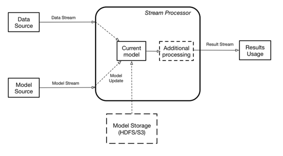
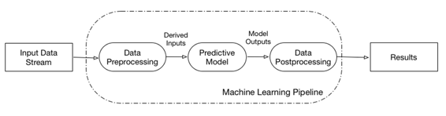

# 第一章\. 提议的实现

今天大多数模型服务实现都基于表述状态转移（REST），这可能不适用于高容量数据处理或在流式系统中使用。使用 REST 需要流式应用程序“走出”它们的执行环境，并发出一个通过网络获取模型服务结果的调用。

新流式引擎的“本地”实现——例如，[Flink TensorFlow](http://bit.ly/eron-wright-ffsf-2017)或[Flink JPPML](http://bit.ly/2wOgHUg)——不会出现这个问题，但需要您重新启动实现以更新模型，因为模型本身是整体代码实现的一部分。

在这里，我们提出了一个在流式系统中本地评分模型的架构，允许您在不中断执行的情况下更新模型。

# 总体架构

图 1-1 展示了提议的模型服务架构的高层视图（类似于[动态控制流](https://data-artisans.com/blog/bettercloud-dynamic-alerting-apache-flink)）。

###### 图 1-1\. 模型服务的总体架构

该架构假定存在两个数据流：一个包含需要评分的数据，另一个包含模型更新。流式引擎在内存中包含用于实际评分的当前模型。评分结果可以被传递给客户，也可以被流式引擎内部用作新流——用于额外计算的输入。如果当前没有定义模型，则输入数据将被丢弃。当接收到新模型时，它将在内存中实例化，实例化完成后，评分将切换到新模型。模型流可以包含数据本身的二进制 blob，也可以包含对外部存储的模型数据的引用（通过引用传递），比如数据库或文件系统中的 Hadoop 分布式文件系统（HDFS）或亚马逊网络服务简单存储服务（S3）。

这些方法有效地将模型评分用作一种新类型的功能转换，任何其他流功能转换都可以使用。

尽管上述总体架构显示了一个单一模型，但一个单一的流式引擎可以同时评分多个模型。

# 模型学习流水线

在最长的时间段内，模型构建实现是临时的——人们会以任何他们认为合适的方式转换源数据，进行一些特征提取，然后基于这些特征训练他们的模型。这种方法的问题在于，当有人想要提供这个模型时，他必须发现所有这些中间转换，并在服务应用程序中重新实现它们。

为了形式化这个过程，加州大学伯克利分校的 AMPLab 引入了[机器学习流水线](https://www.slideshare.net/jeykottalam/pipelines-ampcamp)（图 1-2），它是定义完整数据转换步骤链的图形。

###### 图 1-2. 机器学习流水线

这种方法的优点是双重的：

+   它捕获了整个处理流水线，包括数据准备转换、机器学习本身以及对机器学习结果的任何必需的后处理。这意味着流水线定义了从明确定义的输入到输出的完整转换，从而简化了模型的更新。

+   完整流水线的定义允许对处理进行优化。

一个给定的流水线可以封装多个模型（例如，参见[PMML 模型组合](http://dmg.org/pmml/v4-1/MultipleModels.html)）。在这种情况下，我们认为这些模型是内部的—不可见用于评分。从评分的角度来看，一个单独的流水线始终代表一个单元，无论它封装了多少模型。

许多应用程序都采用了这种机器学习流水线的概念，包括[SparkML](http://spark.apache.org/docs/latest/ml-guide.html)、TensorFlow 和[PMML](http://bit.ly/linuxfoundation-pmml)。

从本书开始，当我提到模型服务时，我指的是提供完整的流水线。
