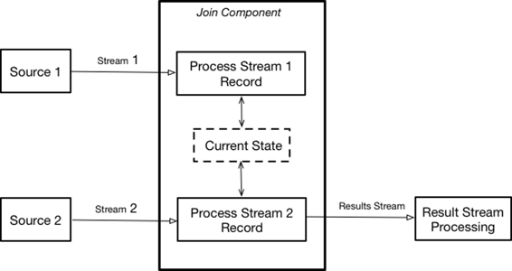
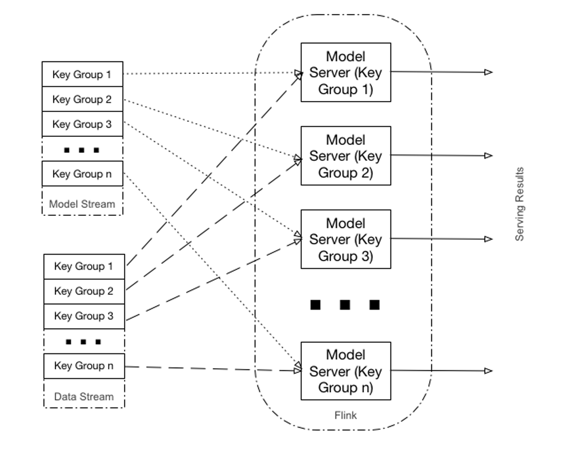
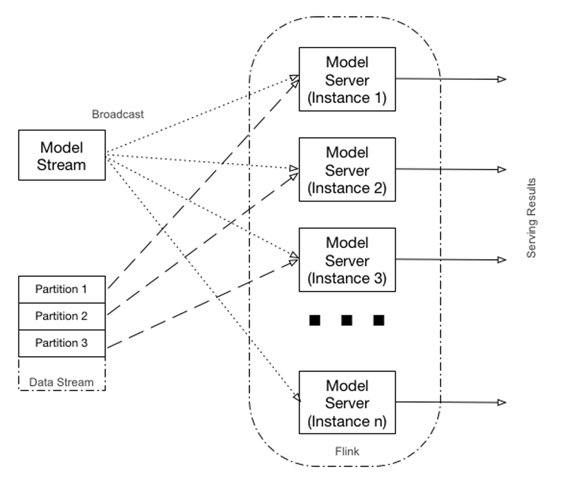

# 第四章。Apache Flink 实现

[Flink](https://flink.apache.org/)是一个开源的流处理引擎（SPE），它可以执行以下操作：

+   良好扩展，可以在数千个节点上运行

+   提供强大的检查点和保存点功能，实现容错和可重启性

+   为流应用程序提供状态支持，允许最小化对外部数据库的使用

+   提供强大的窗口语义，允许您生成准确的结果，即使数据无序或延迟到达

让我们看看如何利用 Flink 的能力来实现提议的架构

# 整体架构

Flink 提供了一个[低级流处理操作](http://bit.ly/apache-steam-process)，`ProcessFunction`，它提供了对任何流应用程序的基本构建块的访问：

+   事件（流中的单个记录）

+   状态（容错、一致性）

+   计时器（事件时间和处理时间）

Flink 提供了低级连接操作的实现，该操作绑定了两个不同的输入（如果我们需要合并多个流，可以级联多个低级连接；此外，Flink 即将推出的版本中将提供[侧输入](http://bit.ly/flink-side-inputs)，允许额外的流合并方法），并为每个输入提供处理记录的单独方法。实现低级连接通常遵循以下[模式](http://bit.ly/apache-steam-process)：

1.  创建并维护反映执行当前状态的状态对象。

1.  在从一个（或两个）输入接收元素时更新状态。

1.  在从一个或两个输入接收元素时，使用当前状态来转换数据并产生结果。

图 4-1 说明了这个操作。



###### 图 4-1。使用 Flink 的低级连接

这种模式很好地适应了整体架构（图 1-1），这正是我想要实现的。

Flink 提供了两种实现低级连接的方式，一种是由`CoProcessFunction`实现的基于键的连接，另一种是由`RichCoFlatMapFunction`实现的基于分区的连接。虽然你可以在这个实现中同时使用两种方式，但它们提供了不同的服务级别协议（SLAs），适用于略有不同的用例。

# 使用基于键的连接

Flink 的`CoProcessFunction`允许对两个流进行基于键的合并。当使用这个 API 时，数据按键在多个 Flink 执行器之间分区。来自两个流的记录（基于键）被路由到负责实际处理的适当执行器，如图 4-2 所示。



###### 图 4-2。基于键的连接

这种方法的主要特点如下：

+   执行的分布基于键（`dataType`，参见示例 3-2 和 3-3）。

+   个别模型的评分（针对给定的 `dataType`）是由单独的执行器实现的（一个执行器可以对多个模型进行评分），这意味着扩展 Flink 可以更好地分布个别模型，从而更好地并行化评分。

+   特定模型始终由特定执行器进行评分，这意味着根据输入记录的数据类型分布，此方法可能会导致“热”执行器。

基于此，基于键的连接是在需要对多个数据类型进行评分且分布相对均匀的情况下的一种适当方法。

此实现的核心是一个 `DataProcessor` 类（[完整代码在此处可用](http://bit.ly/DataProcessorKeyed)），您可以在 示例 4-1 中看到。

##### 示例 4-1\. 数据处理器类

```
object DataProcessorKeyed {
 def apply() = new DataProcessorKeyed
...
}
class DataProcessor extends
CoProcessFunction[WineRecord, ModelToServe, Double]
with CheckpointedFunction
with CheckpointedRestoring[List[Option[Model]]] {

 var currentModel : Option[Model] = None
 var newModel : Option[Model] = None
 @transient private var checkpointedState:
   ListState[Option[Model]] = null

override def
  snapshotState(context: FunctionSnapshotContext): Unit = {
 checkpointedState.clear()
 checkpointedState.add(currentModel)
 checkpointedState.add(newModel)
}

override def initializeState(context:
  FunctionInitializationContext): Unit = {
 val descriptor = new ListStateDescriptor[Option[Model]] (
   "modelState",new ModelTypeSerializer)

 checkpointedState = context.getOperatorStateStore.
   getListState (descriptor)

 if (context.isRestored) {
   val iterator = checkpointedState.get().iterator()
   currentModel = iterator.next()
   newModel = iterator.next()
 }
}

override def restoreState(state: List[Option[Model]]): Unit = {
 currentModel = state(0)
 newModel = state(1)
}

 override def processElement2(model: ModelToServe, ctx:
   CoProcessFunction[WineRecord,ModelToServe, Double]#Context,
   out: Collector[Double]): Unit = {

 import DataProcessorKeyed._

 println(s"New model - $model")
 newModel = factories.get(model.modelType) match {
   case Some(factory) => factory.create (model)
   case _ => None
 }
}

 override def processElement1(record: WineRecord, ctx:
   CoProcessFunction[WineRecord,ModelToServe, Double]#Context,
   out: Collector[Double]): Unit = {

   // See if we have update for the model
   newModel match {
     case Some(model) => {
       // Clean up current model
       currentModel match {
         case Some(m) => m.cleanup()
         case _ =>
       }
       // Update model
       currentModel = Some(model)
       newModel = None
     }
     case _ =>
   }
   currentModel match {
     case Some(model) => {
       val start = System.currentTimeMillis()
       val quality = model.score(record.asInstanceOf[AnyVal]).
         asInstanceOf[Double]
       val duration = System.currentTimeMillis() - start
       modelState.update(modelState.value()
         .incrementUsage(duration))
       println(s"Calculated quality - $quality")
     }
     case _ => println("No model available - skipping")
   }
 }
}
```

这个类有两个主要的方法：

`processElement2`

当新的 `Model` 记录（稍后描述的 `ModelToServe` 类）到达时，将调用此方法。此方法只是构建一个新的用于提供服务的模型，就像 示例 2-2 中的 TensorFlow 模型或 示例 2-6 中的 PMML 模型一样，并将其存储在 `newModel` 状态变量中。因为模型创建可能是一个耗时的操作，我将 `newModel` 状态与 `currentModel` 状态分离，以便模型创建不会影响当前模型的提供服务。

`processElement1`

当新的 `Data` 记录（`WineRecord` 类）到达时，首先检查是否有新的模型可用，如果有，则使用 `newModel` 的值更新 `currentModel`。这确保了在对记录进行评分时不会发生模型更新。然后我们检查当前是否有模型进行评分，并调用实际的评分。

除了这些主要方法外，该类还实现了对 [受管状态](http://bit.ly/flink-umos) 的检查点支持。我们通过向类添加另外两个接口来实现这一点：

`CheckpointedFunction`

维护跨个别流记录的状态的状态转换函数的核心接口。

`CheckpointedRestoring`

提供从检查点还原状态的方法的接口。

这两个接口由以下三种方法实现：`initializeState`、`snapshotState` 和 `restoreState`。

示例 4-2 展示了被 `DataProcessor` 类使用的 `ModelToServe` 类的样子。

##### 示例 4-2\. 服务模型类

```
object ModelToServe {
 def fromByteArray(message: Array[Byte]): Try[ModelToServe] = Try{
   val m = ModelDescriptor.parseFrom(message)
   m.messageContent.isData match {
     case true => new ModelToServe(m.name, m.description,
       m.modeltype, m.getData.toByteArray, m.dataType)
     case _ => throw new Exception("Not yet supported")
   }
 }
}

case class ModelToServe(name: String, description: String,
  modelType: ModelDescriptor.ModelType,
  model : Array[Byte], dataType : String) {}
```

此类将模型定义的传入 protobuf 解析为代码中其余部分使用的内部格式。

同样，我们使用`DataRecord`类来解组传入的数据定义（示例 3-1），如示例 4-3 所示。

##### 示例 4-3\. DataRecord 类

```
object DataRecord {

 def fromByteArray(message: Array[Byte]): Try[WineRecord] = Try {
   WineRecord.parseFrom(message)
 }
}
```

检查点实现还需要对`Model`类进行序列化支持，如示例 4-4 所示（[完整代码在此处可用](http://bit.ly/2gwB16C)）。

##### 示例 4-4\. ModelTypeSerializer 类

```
class ModelTypeSerializer extends TypeSerializer[Option[Model]] {
 ...

 override def serialize(record: Option[Model],
   target: DataOutputView): Unit = {
   record match {
     case Some(model) => {
       target.writeBoolean(true)
       val content = model.toBytes()
       target.writeLong(model.getType)
       target.writeLong(content.length)
       target.write(content)
     }
     case _ => target.writeBoolean(false)
   }
 }

 ...

 override def deserialize(source: DataInputView): Option[Model] =
   source.readBoolean() match {
     case true => {
       val t = source.readLong().asInstanceOf[Int]
       val size = source.readLong().asInstanceOf[Int]
       val content = new Array[Byte] (size)
       source.read (content)
       Some(factories.get(t).get.restore(content))
     }
     case _ => None
   }
...
```

该类利用模型和模型工厂特性上的实用方法，以通用方式实现序列化/反序列化，而不考虑实际模型实现。

序列化实现还需要实现配置支持，可以在示例 4-5 中看到（[完整代码在此处可用](http://bit.ly/2gwB16C)）。

##### 示例 4-5\. ModelSerializerConfigSnapshot 类

```
class ModelSerializerConfigSnapshot[T <: Model]
  extends TypeSerializerConfigSnapshot{

...

 override def write(out: DataOutputView): Unit = {
   super.write(out)
   // write only the classname to avoid Java serialization
   out.writeUTF(classOf[Model].getName)
 }

 override def read(in: DataInputView): Unit = {
   super.read(in)
   val genericTypeClassname = in.readUTF
   try
     typeClass = Class.forName(genericTypeClassname, true,
       getUserCodeClassLoader).asInstanceOf[Class[Model]]
   catch {
     ...
   }
 }
...
```

执行的整体编排是使用 Flink 驱动程序完成的，如示例 4-6 所示（[完整代码在此处可用](http://bit.ly/2yE1B8o)）。

##### 示例 4-6\. 用于基于键的连接的 Flink 驱动程序

```
object ModelServingKeyedJob {
...
 // Build execution Graph
 def buildGraph(env : StreamExecutionEnvironment) : Unit = {
   env.setStreamTimeCharacteristic(TimeCharacteristic.EventTime)
   env.enableCheckpointing(5000)
   // Configure Kafka consumer
   val dataKafkaProps = new Properties
   dataKafkaProps.setProperty("zookeeper.connect",
     ModelServingConfiguration.LOCAL_ZOOKEEPER_HOST)
   dataKafkaProps.setProperty("bootstrap.servers",
     ModelServingConfiguration.LOCAL_KAFKA_BROKER)
   dataKafkaProps.setProperty("group.id",
     ModelServingConfiguration.DATA_GROUP)
   dataKafkaProps.setProperty("auto.offset.reset", "latest")
   val modelKafkaProps = new Properties
   modelKafkaProps.setProperty("zookeeper.connect",
     ModelServingConfiguration.LOCAL_ZOOKEEPER_HOST)
   modelKafkaProps.setProperty("bootstrap.servers",
      ModelServingConfiguration.LOCAL_KAFKA_BROKER)
   modelKafkaProps.setProperty("group.id",
      ModelServingConfiguration.MODELS_GROUP)
   modelKafkaProps.setProperty("auto.offset.reset", "latest")
   // Create a Kafka consumer
   val dataConsumer = new FlinkKafkaConsumer010[Array[Byte]](...
   val modelConsumer = new FlinkKafkaConsumer010[Array[Byte]](...

   // Create input data streams
   val modelsStream = env.addSource(modelConsumer)
   val dataStream = env.addSource(dataConsumer)
   // Read data from streams
   val models = modelsStream.map(ModelToServe.fromByteArray(_))
     .flatMap(BadDataHandler[ModelToServe]).keyBy(_.dataType)
   val data = dataStream.map(DataRecord.fromByteArray(_))
     .flatMap(BadDataHandler[WineRecord]).keyBy(_.dataType)

   // Merge streams
   Data
.connect(models)
.process(DataProcessor())
 }
}
```

这个实现的核心是`buildGraph`方法。它首先配置并创建两个 Kafka 消费者，用于模型和数据，然后从这些消费者构建两个输入数据流。然后从两个流中读取数据并将它们合并。

`FlinkKafkaConsumer010` 类需要定义[反序列化模式](http://bit.ly/2gvPIqi)。因为我们的消息是 protobuf 编码的，我将 Kafka 消息视为二进制数据块。为此，需要实现`ByteArraySchema`类，如示例 4-7 所示，定义 Kafka 数据的编码和解码。

##### 示例 4-7\. ByteArraySchema 类

```
class ByteArraySchema extends DeserializationSchema[Array[Byte]]
  with SerializationSchema[Array[Byte]] {

 override def isEndOfStream(nextElement:Array[Byte]):Boolean = false
 override def deserialize(message:Array[Byte]):Array[Byte] = message
 override def serialize(element: Array[Byte]): Array[Byte] = element
 override def getProducedType: TypeInformation[Array[Byte]] =
   TypeExtractor.getForClass(classOf[Array[Byte]])
}
```

# 使用基于分区的连接

Flink 的`RichCoFlatMapFunction`允许并行合并两个流。任务被分成几个并行实例以执行，每个实例处理任务输入数据的一个子集。任务的并行实例数称为其[并行度](http://bit.ly/2i51BaF)。

在对分区流使用此 API 时，每个分区的数据由专用的 Flink 执行器处理。模型流中的记录被广播到所有执行器。如图 4-3 所示，输入流的每个分区被路由到模型服务器的相应实例。如果输入流的分区数少于 Flink 的并行度，则只有一些模型服务器实例会被利用。否则，一些模型服务器实例将为多个分区提供服务。



###### 图 4-3\. 基于分区的连接

这种方法的主要特点如下：

+   相同的模型可以根据数据流的分区在多个执行器中进行评分，这意味着 Flink 的扩展（和输入数据的分区）会导致更好的评分吞吐量。

+   因为模型流被广播到所有独立运行的模型服务器实例，一些模型更新中可能存在竞争条件，这意味着在模型切换点，可能会出现一些模型抖动（模型可以在不同时间更新在不同实例中，因此在一段时间内不同的输入记录可能由不同的模型提供）。

基于这些考虑，当需要在大量数据负载下使用一个或几个模型进行评分时，使用全局连接是一个合适的方法。

这个实现的核心是 `DataProcessorMap` 类，您可以在示例 4-8 中看到它的运行情况（[完整代码在此处可用](http://bit.ly/2gcOLpYa)）。

##### 示例 4-8\. 数据处理映射类

```
class DataProcessorMap
  extends RichCoFlatMapFunction[WineRecord, ModelToServe, Double]
  with CheckpointedFunction
  with CheckpointedRestoring[List[Option[Model]]] {
 ...

 override def flatMap2(model: ModelToServe, out: Collector[Double]):
   Unit = {
   import DataProcessorMap._
   println(s"New model - $model")
   newModel = factories.get(model.modelType) match{
     case Some(factory) => factory.create(model)
     case _ => None
   }
 }
 override def flatMap1(record: WineRecord, out: Collector[Double]):
   Unit = {
   // See if we need to update
   newModel match {
     case Some(model) => {
       // Close current model first
       currentModel match {
         case Some(m) => m.cleanup();
         case _ =>
       }
       // Update model
       currentModel = Some(model)
       newModel = None
     }
     case _ =>
   }
   currentModel match {
     case Some(model) => {
       val start = System.currentTimeMillis()
       val quality = model.score(record.asInstanceOf[AnyVal])
         .asInstanceOf[Double]
       val duration = System.currentTimeMillis() - start
     }
     case _ => println("No model available - skipping")
   }
 }
}
```

这个实现与 `DataProcessor` 类（示例 4-1）非常相似。以下是两者之间的主要区别：

+   `DataProcessMap` 类扩展了 `RichCoFlatMapFunction`，而 `DataProcessor` 类扩展了 `CoProcessFunction` 类。

+   方法名称不同：`flatMap1` 和 `flatMap2` 与 `processElement1` 和 `processElement2`。但方法内部的实际代码几乎相同。

与 `DataProcessor` 类类似，这个类还实现了对状态的检查点支持。

执行的整体编排是使用 Flink 驱动程序完成的，这与之前基于键的连接的 Flink 驱动程序（示例 4-6）在将流传递给执行器（`keyBy` 对 `broadcast`）和处理（`process` 对 `flatMap`）以及连接方面有所不同，如示例 4-9 所示（[完整代码在此处可用](http://bit.ly/2ydjA2y)）。

##### 示例 4-9\. 用于全局连接的 Flink 驱动程序

```
// Read data from streams
val models = modelsStream.map(ModelToServe.fromByteArray(_))
 .flatMap(BadDataHandler[ModelToServe]).broadcast
val data = dataStream.map(DataRecord.fromByteArray(_))
 .flatMap(BadDataHandler[WineRecord])
// Merge streams
Data
 .connect(models)
 .flatMap(DataProcessorMap())
```

尽管这个示例使用了一个模型，但您可以通过使用以数据类型为键的模型映射轻松扩展它以支持多个模型。

Flink 低级处理 API 提供的丰富的流语义为操作数据流（包括它们的转换和合并）提供了一个非常强大的平台。在本章中，您已经看到了使用 Flink 实现提议架构的不同方法。在第五章中，我们将看看如何使用 Beam 来解决相同的问题。
