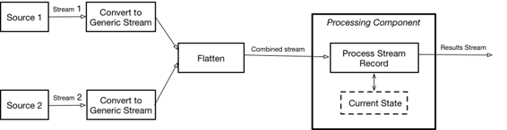

# 第五章\. Apache Beam 实现

[Beam](https://beam.apache.org/)是一个开源的、统一的模型，用于定义批处理和流处理管道。它不是一个流处理引擎（SPE），而是一个 SDK，您可以使用它构建一个管道定义，然后由 Beam 支持的分布式处理后端之一来���行。使用 Beam，您可以做到以下几点：

+   使用单一的编程模型来处理批处理和流处理用例。

+   通过构建和执行的分离，您可以在多个执行环境上使用相同的 Beam 流水线。

+   编写和共享新的 SDK、IO 连接器和转换库，不受特定运行程序的限制。

让我们看看如何使用 Beam 的语义来实现我们的解决方案。

# 整体架构

Beam 为流合并提供了非常丰富的[执行语义](http://bit.ly/2gvXOzd)，包括[`CoGroupByKey`](http://bit.ly/2ychhwv)和[`Combine`](http://bit.ly/2zfOwPG)。它还支持[side inputs](http://bit.ly/2kGzv6w)，将一个流上的计算作为另一个流的处理输入。不幸的是，所有这些 API 都设计用于[窗口流](http://bit.ly/2xznvoc)，不适用于全局窗口——这是我正在尝试解决的问题。

我找到的唯一选项是使用[`Flatten`](http://bit.ly/2wPgkcg)，它允许您将多个流合并为一个。结合用于存储模型的[state](http://bit.ly/2xza5ZG)功能，提供了一个合理的整体实现方法，如图 5-1 所示。



###### 图 5-1\. Beam 实现方法

使用`Flatten`操作符的注意事项是所有合并的流必须具有相同的数据定义。为了满足这一要求，我引入了`DataWithModel`数据结构（稍后描述），它可以包含数据或模型定义。

# 使用 Beam 实现模型服务

示例 5-1 展示了使用 Beam 进行模型服务的整体流程（Beam 仅提供 Java 和 Python API；因此，本节中的代码为 Java[[完整代码在此处可用](http://bit.ly/2hBvbAA)]）：

##### 示例 5-1\. 用于模型服务的 Beam 流水线

```
public class ModelServer {
   public static void main(String[] args) {
       // Create and initialize pipeline
       KafkaOptions options =
         JobConfiguration.initializePipeline(args);
       Pipeline p = Pipeline.create(options);

       // Coder to use for Kafka data - raw byte message
       KvCoder<byte[], byte[]> kafkaDataCoder =
       KvCoder.of(NullableCoder.of(ByteArrayCoder.of()),
         ByteArrayCoder.of());

       // Data Stream - gets data records from Kafka topic
       PCollection<KV<String, ModelServer1Support.DataWithModel>>
         dataStream = p
          .apply("data", KafkaIO.readBytes()
             .withBootstrapServers(options.getBroker())
             .withTopics(Arrays.asList(options.getKafkaDataTopic()))
             .updateConsumerProperties(
               JobConfiguration.getKafkaConsumerProps(options,
                 true))
             .withoutMetadata()).setCoder(kafkaDataCoder)
          // Convert Kafka message to WineRecord
          .apply("Parse data records", ParDo.of(
            new ModelServer1Support.ConvertDataRecordFunction()));

       // Models Stream - get model records from Kafka
       PCollection<KV<String,ModelServer1Support.DataWithModel>>
         modelStream = p
          .apply("models", KafkaIO.readBytes()
             .withBootstrapServers(options.getBroker())
             .withTopics(Arrays.asList(
               options.getKafkaModelsTopic()))
             .updateConsumerProperties(
               JobConfiguration.getKafkaConsumerProps(options,
                 false))
             .withoutMetadata()).setCoder(kafkaDataCoder)
          // Convert Kafka record to ModelDescriptor
          .apply("Parse model", ParDo.of(
            new ModelServer1Support.ConvertModelRecordFunction()));
       // Create a combined PCollection stream.
       PCollection<KV<String,ModelServer1Support.DataWithModel>>
         combinedStream =
           PCollectionList.of(dataStream).and(modelStream)
                   // Flatten the list
                   .apply(Flatten.pCollections());

       // Score models and print result
       PCollection<Double> scoringResults = combinedStream
          // Score data using current model
          .apply("Scoring the model", ParDo.of(
             new ModelServer1Support.ScoringdFunction()))
          // Print scoring result
          .apply("Print result", MapElements.via(
             new ModelServer1Support.SimplePrinterFn<>()));

       // Run the pipeline
       p.run();
   }
```

这段代码首先创建流水线并设置 Kafka 编码器。因为两个流都只包含没有键的消息，所以必须为键使用`NullableCoder`。然后，它定义了两个输入流，一个数据流和一个模型流，将它们合并在一起。最后，合并的流用于模型服务。

为了从 Kafka 中读取数据，我正在使用新的 Beam 对 Kafka 的支持，[Kafka.IO](http://bit.ly/2g0Mgnd)，它从 Kafka 读取字节数组，然后对这些数据进行转换以创建一个`PCollection`的`DataWithModel`，在示例 5-2 中定义（[完整代码在此处可用](http://bit.ly/2yEX45V)）。

##### 示例 5-2\. DataWithModel 类

```
public static class DataWithModel implements Serializable {
   private Winerecord.WineRecord data;
   private ModelDescriptor model;
   ...
   public Winerecord.WineRecord getData() {return data;}

   public ModelDescriptor getModel() {return model;}
}
```

这里 `ModelDescriptor` 是之前 `ModelToServe` 类的 Java 版本（示例 4-2），而 `WineRecord` 则是数据 protobuf 定义的表示（示例 3-4）。

示例 5-3 展示了如何处理数据输入到 `DataWithModel` 的转换（[完整代码在此处可用](http://bit.ly/2i62j7h)）：

##### 示例 5-3\. 将数据流转换为 DataWithModel

```
public class ConvertDataRecordFunction
  extends DoFn<KV<byte[], byte[]>, KV<String, DataWithModel>> {
   @ProcessElement
   public void processElement(DoFn<KV<byte[], byte[]>,
      KV<String, DataWithModel>>.ProcessContext ctx) {

       // Get current element
       KV<byte[], byte[]> input = ctx.element();
       try {
           Winerecord.WineRecord record =
             Winerecord.WineRecord.parseFrom(input.getValue());
           ctx.output(KV.of(record.getDataType(),
             new DataWithModel(record)));
       } catch (Throwable t) {
          ...
       }
   }
}
```

将模型输入转换为 `DataWithModel` 的转换同样简单。

实际的模型服务使用了[状态支持](http://bit.ly/2xza5ZG)，并由 示例 5-4 中所示的类实现（[完整代码在此处可用](http://bit.ly/2yb0kF7)）：

##### 示例 5-4\. 模型评分的实现

```
public class ScoringFunction
  extends DoFn<KV<String,DataWithModel>, Double> {

   private static final Map<Integer, ModelFactory> factories =
     new HashMap<Integer, ModelFactory>() {
   ...
   // Internal state
   @StateId("model")
   private final StateSpec<ValueState<Model>> modelSpec =
                     StateSpecs.value(ModelCoder.of());

   @ProcessElement
   public void processElement
     (DoFn<KV<String,DataWithModel>, Double>.ProcessContext ctx,
     @StateId("model") ValueState<Model> modelState) {
       // Get current element
       KV<String, DataWithModel> input = ctx.element();
       // Check if we got the model
       CurrentModelDescriptor descriptor =
         input.getValue().getModel();
       // Get current model
       Model model = modelState.read();
       if (descriptor != null) {
           // Process model - store it
           ModelFactory factory = factories
             .get(descriptor.getModelType().ordinal());
           if (factory == null)
               System.out.println("Unknown model type ");
           else {
               Optional<Model> current = factory.create(descriptor);
               if (current.isPresent()) {
                   if (model != null) model.cleanup();
                   // Create and store the model
                   modelState.write(current.get());
               } else
                   ...
           }
       }
       // Process data
       else {
           if (model == null)
               System.out.println("No model available - skipping");
           else {
               // Score the model
               long start = System.currentTimeMillis();
               double quality = (double) model.score(input
                 .getValue().getData());
               long duration = System.currentTimeMillis() - start;
               // Propagate result
               ctx.output(quality);
           }
       }
   }
}
```

这个类从流中获取下一个元素并检查其类型。如果这是一个模型元素，它就会更新当前模型。如果是数据元素，则会得分（假设存在模型）。这段代码与 Flink 实现中的 `DataProcessor` 类（示例 4-1）非常相似，但有一个重要区别：Flink 的 `DataProcessor` 类提供了两种不同的方法，可以在两个不同的线程上调用，以便模型加载的任何扩展处理时间都不会显著影响得分。而在 Beam 的情况下，它是一个单一方法，因此模型创建的任何延迟都可能影响得分。

Beam 程序需要一个运行器，而 Flink 是一个常用选择。为了能够在 Flink 运行器上运行此实现，它还必须实现一个模型对象的编码器，如示例 5-5 中所示（[完整代码在此处可用](http://bit.ly/2i4T4Ey)）。

##### 示例 5-5\. 模型编码器

```
public class ModelCoder extends AtomicCoder<Model> {
...
 public static ModelCoder of() {
   return INSTANCE;
 }
...
 private static void writeModel(Model value, DataOutputStream dos)
 throws IOException {
   byte[] bytes = value.getBytes();
   VarInt.encode((long) bytes.length, dos);
   dos.write(bytes);
   VarInt.encode(value.getType(), dos);
 }

 private static Model readModel(DataInputStream dis)
 throws IOException {
   int len = (int)VarInt.decodeLong(dis);
   ...
   byte[] bytes = new byte[len];
   dis.readFully(bytes);
   int type = (int)VarInt.decodeLong(dis);
   ModelFactory factory = factories.get(type);
   ...
   return factory.restore(bytes);
 }
...
 @Override
 public void encode(Model value, OutputStream outStream,
      Context context) throws IOException {
 throws IOException {
   if (value == null)
     throw new CoderException("cannot encode a null model");
   if (context.isWholeStream) {
     byte[] bytes = value.getBytes();
     byte[] types = ByteUtils.longToBytes(value.getType());
     if (outStream instanceof ExposedByteArrayOutputStream) {
      ((ExposedByteArrayOutputStream) outStream).writeAndOwn(bytes);
     } else {
       outStream.write(bytes);
       outStream.write(types);
     }
   } else {
     writeModel(value, new DataOutputStream(outStream));
   }
 }
...
 @Override
 public Model decode(InputStream inStream, Context context)
   throws IOException {
   if (context.isWholeStream) {
     byte[] bytes = StreamUtils.getBytes(inStream);
     int type = (int)ByteUtils
       .bytesToLong(StreamUtils.getBytes(inStream));
     ModelFactory factory = factories.get(type);
     if (factory == null) {
       System.out.println("Unknown model type " + type);
       return null;
     }
     return factory.restore(bytes);
   } else {
     try {
       return readModel(new DataInputStream(inStream));
     } catch (EOFException | UTFDataFormatException exn) {
       ...
     }
   }
 }
...
}
```

尽管此示例仅使用一个模型，但您可以轻松地扩展它以支持多个模型，方法是使用一个以数据类型为键的模型映射的状态。

Beam 允许您构建实现模型服务的执行管道，可以使用多个运行器执行，包括 [Apache Apex](http://apex.apache.org/)、[Apache Flink](http://flink.apache.org/)、[Apache Spark](http://spark.apache.org/) 和 [Google Cloud Dataflow](https://cloud.google.com/dataflow)。在第六章中，我们将看看如何使用 Spark 流处理解决相同的问题。
