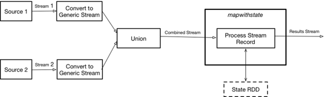

# 第六章\. Apache Spark 实现

[Spark](https://spark.apache.org/) 是一个围绕速度、易用性和复杂分析构建的强大开源处理引擎。它目前是大数据领域最大的开源社区，拥有超过 1,000 名贡献者，代表着超过 250 个组织。Spark 的主要特点如下：

性能

它从底层开始进行性能优化，通过利用内存计算和其他优化技术可以非常快速。

使用便捷性

它提供了易于使用的 API，用于操作大型数据集，包括超过 100 个用于转换数据的操作符集合以及用于操作半结构化数据的数据框 API。

统一引擎

它打包了更高级别的库，包括支持 SQL 查询、流数据、机器学习和图处理。这些标准库提高了开发人员的生产力，并可以无缝组合以创建复杂的工作流程。

Spark Streaming 是核心 Spark API 的扩展，使得构建容错的实时数据流处理变得容易。在下一节中，我们将讨论如何使用 Spark Streaming 来实现我们的解决方案。

# 整体架构

Spark Streaming 目前使用一种小批量处理流的方法，尽管真正的流式处理实现正在进行中（稍后讨论）。由于我们的问题需要状态，我们的实现唯一的选择是使用[`mapWithState`](http://bit.ly/2xzhNCM) [操作符](http://bit.ly/2xzhNCM)，其中状态是 Spark 中弹性分布式数据集核心数据集合的抽象。这个 RDD 中的每个记录都是一个键-值对，其中键是数据类型（参见示例 3-2），值是当前的模型对象。这种方法有效地使用状态 RDD 作为模型的内存，这个内存在小批量执行之间被保存。

这个实现的第二个问题是必须合并两个输入流：数据流和模型流。与 Beam 情况类似，Spark 中合并非窗口流的唯一选项是[`union`](http://bit.ly/2xzyoeG) 操作符，它要求两个流具有相同的数据定义。图 6-1 展示了 Spark 实现的整体架构。



###### 图 6-1\. Spark 实现方法

# 使用 Spark Streaming 实现模型服务

示例 6-1 展示了使用 Spark 实现模型服务的整体流程，遵循这个架构（[完整代码在此处可用](http://bit.ly/2gbSpk9)）。

##### 示例 6-1\. 使用 Spark 进行模型服务

```
object SparkModelServer {
...
 def main(args: Array[String]): Unit = {
...
   // Initial state RDD for current models
   val modelsRDD = ssc.sparkContext.emptyRDD[(String, Model)]

   // Create models kafka stream
   val kafkaParams = KafkaSupport.getKafkaConsumerConfig(
     ModelServingConfiguration.LOCAL_KAFKA_BROKER)
   val modelsStream = KafkaUtils.createDirectStream[Array[Byte],
      Array[Byte]](ssc,PreferConsistent,Subscribe[Array[Byte],
         Array[Byte]]
   (Set(ModelServingConfiguration.MODELS_TOPIC),kafkaParams))

   // Create data kafka stream
   val dataStream = KafkaUtils.createDirectStream[Array[Byte],
      Array[Byte]](ssc, PreferConsistent,Subscribe[Array[Byte],
        Array[Byte]]
   (Set(ModelServingConfiguration.DATA_TOPIC),kafkaParams))

   // Convert streams
   val data = dataStream.map(r =>
   DataRecord.fromByteArray(r.value())).filter(_.isSuccess)
    .map(d => DataWithModel(None, Some(d.get)))

   val models = modelsStream.map(r =>
   ModelToServe.fromByteArray(r.value())).filter(_.isSuccess)
      .map(m => DataWithModel(Some(m.get), None))

   // Combine streams
   val unionStream = ssc.union(Seq(data, models)).
     map(r => (r.getDataType, r))
   // Score model using mapWithState
   val mappingFunc = (dataType: String, dataWithModel:
       Option[DataWithModel], state: State[Model]) => {

     val currentModel = state.getOption().getOrElse(null
       .asInstanceOf[Model])
     dataWithModel match {
       case Some(value) =>
         if (value.isModel) {
           // Process model
           if (currentModel != null) currentModel.cleanup()
           val model = factories.get(value.getModel.modelType.value)
           match {
             case Some(factory) => factory.create(value.getModel)
             case _ => None
           }
           model match {
             case Some(m) => state.update(m)
             case _ =>
           }
           None
         }
         else {
           // Process data
           if (currentModel != null)
             Some(currentModel.
             score(value.getData.
               asInstanceOf[AnyVal]).asInstanceOf[Double])
           else
             None
         }
       case _ => None
     }
   }
   val resultDstream = unionStream.mapWithState(StateSpec.
     function(mappingFunc).initialState(modelsRDD))
   resultDstream.print()
   // Execute
   ssc.start()
   ssc.awaitTermination()
 }
}
```

实际的模型服务是在 `mappingFunc` 中完成的（其功能类似于 Flink 中的模型服务实现[示例 4-1]），它在每个小批量上对合并流进行调用。

这里另一个重要的点是将 `KryoSerializer` 设置为默认序列化器，并为模型实现 Kryo 序列化器。要注册这些序列化器，你需要实现一个特殊的 `KryoRegistrator` 类，如示例 6-2（[完整代码可在此处找到](http://bit.ly/2ygTii6)）所示。

##### 示例 6-2. 模型 Kryo 序列化器和注册器

```
class ModelSerializerKryo extends Serializer[Model]{
...
 override def read(kryo: Kryo, input: Input, `type`: Class[Model]):
   Model = {
   import ModelSerializerKryo._

   val mType = input.readLong().asInstanceOf[Int]
   val bytes = Stream.continually(input.readByte()).
     takeWhile(_ != -1).toArray
   factories.get(mType) match {
     case Some(factory) => factory.restore(bytes)
     case _ => throw new Exception(s"Unknown model type $mType")
   }
 }

 override def write(kryo: Kryo, output: Output, value: Model):
   Unit = {
   println("KRYO serialization")
   output.writeLong(value.getType)
   output.write(value.toBytes)
 }
}
...

class ModelRegistrator extends KryoRegistrator {
 override def registerClasses(kryo: Kryo) {
   kryo.register(classOf[Model], new ModelSerializerKryo())
 }
}
```

尽管此示例使用单个模型，但你可以通过使用按数据类型键入的模型映射轻松扩展它以支持多个模型。

在使用这种 Spark 实现时，有必要牢记它不是真正的流式系统，这意味着会有长达“批处理时间大小”的延迟，通常为 500 毫秒或更长。如果这是可以接受的，那么这个解决方案非常可扩展。

Spark 提供了一个名为[结构化流式处理](http://bit.ly/2gEAFwG)的新流处理 API，但是对于我们在解决的问题，你不能使用它，因为一些必需的操作还没有得到[支持](http://bit.ly/2yFLOWy)（截至版本 2.2）；例如：

> 目前尚不支持两个流式数据集之间的任何类型的连接。

Spark 流式处理是我将讨论的最后一个流处理引擎。在第七章和第八章中，我们将研究使用流式框架解决相同问题的开始，从 Kafka Streams 开始。
