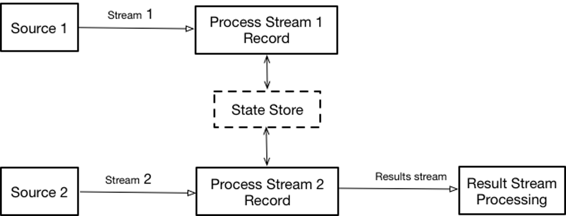
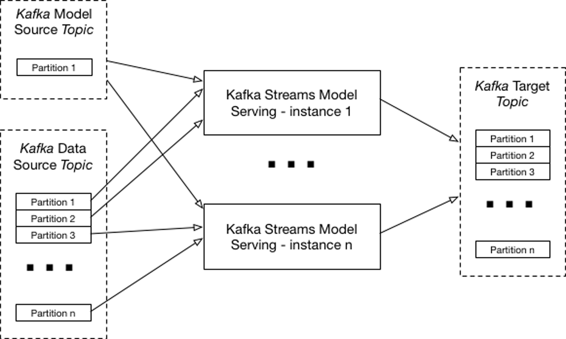

# 第七章 Apache Kafka Streams 实现

正如前面所述，与 Flink、Beam 和 Spark 不同，[Kafka Streams](https://kafka.apache.org/documentation/streams/) 是一个用于处理和分析存储在 Kafka 中的数据的客户端库。它建立在重要的流处理概念之上，如正确区分事件时间和处理时间、窗口支持以及简单而高效的应用状态管理。由于 Kafka Streams 是一个 Java 虚拟机（JVM）框架，我们的架构实现相当简单和直接。由于它在单个 JVM 中运行，可以将状态实现为内存中的静态 Java 对象，可以被两个流共享。这意味着不需要合并流，它们可以独立执行，同时共享相同的状态，这是当前的模型。

尽管这种解决方案可以工作，但它有一个严重的缺点：与 Spark 或 Flink 等引擎不同，它不提供自动恢复。幸运的是，Kafka Streams 允许使用[自定义状态存储](http://bit.ly/2xz7or5)来实现，这些存储由一个特殊的 Kafka 主题支持。我将从向您展示如何实现这样一个状态存储开始这一章。从技术上讲，可以使用 Kafka Streams 提供的键值存储，但我决定创建一个自定义状态服务器来展示实现细节。

# 实现自定义状态存储

实现自定义状态存储始于决定它需要保存的数据。对于我们的实现，唯一需要存储的是我们模型的当前版本和新版本（[完整代码在此处可用](http://bit.ly/2gbUCvJ)；目前 Kafka Stream 仅提供 Java API，因此，本节中的所有代码都是 Java）：

##### 示例 7-1\. StoreState 类

```
public class StoreState {
   private Model currentModel = null;
   private Model newModel = null;
...
   public Model getCurrentModel() {return currentModel;}
   public Model getNewModel() {return newModel;}
...
}
```

Kafka Streams 支持几种[状态存储类型](http://bit.ly/2yYCgSU)，包括持久性和内存类型，可以进一步设置为自定义（用户可以定义存储上可用的操作）、键值或窗口存储（窗口存储与键值存储不同之处在于它可以为任何给定的键存储多个值，因为该键可以存在于多个窗口中）。对于本应用程序，在示例 7-2 中展示，我使用了一个内存中的自定义存储，实现了接口 `org.apache.kafka.streams.processor.StateStore`（[完整代码在此处可用](http://bit.ly/2xyoyK8)）。

##### 示例 7-2\. ModelStateStore 类

```
public class ModelStateStore implements StateStore{
...
   @Override public void init(ProcessorContext context,
     StateStore root) {
       StateSerdes<Integer, StoreState> serdes =
                new StateSerdes<Integer, StoreState>(
                name, Serdes.Integer(), new ModelStateSerde());
       changeLogger = new ModelStateStoreChangeLogger(
         name, context, serdes);
       if (root != null && loggingEnabled) {
           context.register(root, loggingEnabled,
             new StateRestoreCallback() {
               @Override public void restore(byte[] key,
                 byte[] value) {
                   if (value == null) {
                       state.zero();
                   } else {
                       state = serdes.valueFrom(value);
                   }
               }
           });
       }
       open = true;
   }

   @Override public void flush() {
       if (loggingEnabled) {
           changeLogger.logChange(changelogKey, state);
       }
   }
...
}
```

这个实现使用 `ModelStateStoreChangeLogger` 定期将存储的当前状态写入特殊的 Kafka 主题，并在启动时恢复存储状态。因为 `ModelStateStoreChangeLogger` 使用 Kafka 主题存储状态，所以需要一个键。在我们的实现中，我们可以使用数据类型作为键，或者引入一个虚假键来满足这个要求，我使用了一个虚假键。它还使用 `ModelStateSerde` 将存储内容序列化/反序列化为二进制数据块，这些数据块可以存储在 Kafka 中。

这个类中的两个主要方法是 `flush`，负责将当前状态刷新到 Kafka，和 `init`，负责从 Kafka 恢复状态。示例 7-3 展示了 `ModelStateStoreChangeLogger` 实现的样子（[完整代码在此处可用](http://bit.ly/2xzFEaF)）。

##### 示例 7-3\. `ModelStateStoreChangeLogger` 类

```
public class ModelStateStoreChangeLogger<K,V> {
...
   public void logChange(K key, V value) {
       if (collector != null) {
           Serializer<K> keySerializer =
             serialization.keySerializer();
           Serializer<V> valueSerializer =
             serialization.valueSerializer();
           collector.send(this.topic, key, value, this.partition,
           context.timestamp(), keySerializer, valueSerializer);
       }
   }
}
```

这是一个非常简单的类，有一个可执行方法 `logChange`，它将存储的当前状态发送到 Kafka Streams 运行时分配的主题。

`ModelStateStore` 使用的第二个类是 `ModelStateSerde`，你可以在 示例 7-4 中看到（[完整代码在此处可用](http://bit.ly/2zgeXVy)）。

##### 示例 7-4\. 状态序列化器/反序列化器类

```
public class ModelStateSerde implements Serde<StoreState> {
   ...
   @Override public Serializer<StoreState> serializer() {
     return serializer;}

   @Override public Deserializer<StoreState> deserializer() {
     return deserializer;}

   public static class ModelStateSerializer implements Serializer<
     StoreState> {
       ...
       @Override public byte[] serialize(String topic, StoreState
         state) {

           bos.reset();
           DataOutputStream output = new DataOutputStream(bos);
           writeModel(state.getCurrentModel(), output);
           writeModel(state.getNewModel(), output);
           try {
               output.flush();
               output.close();
           }
           catch(Throwable t){}
           return bos.toByteArray();
       }
       private void writeModel(Model model,DataOutputStream output){
           try{
               if(model == null){
                   output.writeLong(0);
                   return;
               }
               byte[] bytes = model.getBytes();
               output.writeLong(bytes.length);
               output.writeLong(model.getType());
               output.write(bytes);
           }
           catch (Throwable t){
               ...
           }
       }
       ...
   }
   public static class ModelStateDeserializer
     implements Deserializer<StoreState> {
       ...
       @Override
       public StoreState deserialize(String topic, byte[] data) {

           ByteArrayInputStream bis =new ByteArrayInputStream(data);
           DataInputStream input = new DataInputStream(bis);
           Model currentModel = readModel(input);
           Model newModel = readModel(input);
           return new StoreState(currentModel, newModel);
       }

       @Override
       public void close() {}

       private Model readModel(DataInputStream input) {
           try {
               int length = (int)input.readLong();
               if (length == 0)
                   return null;
               int type = (int) input.readLong();
               byte[] bytes = new byte[length];
               input.read(bytes);
               ModelFactory factory = factories.get(type);
               return factory.restore(bytes);
           } catch (Throwable t) {
               ...
           }
       }
   }
}
```

这个清单包含三个类：

+   `ModelStateSerializer` 负责将状态序列化为字节数组。

+   `ModelStateDeserializer` 负责从字节数组中恢复状态��

+   `ModelStateSerde` 负责与 Kafka Streams 运行时进行接口交互，并提供用于状态数据序列化/反序列化的类。

用于模型状态存储的最终类是 `ModelStateStoreSupplier`，用于创建存储实例，你可以在 示例 7-5 中看到（[完整代码在此处可用](http://bit.ly/2yGVC2A)）。

##### 示例 7-5\. `ModelStateStoreSupplier` 类

```
public class ModelStateStoreSupplier
  implements StateStoreSupplier<ModelStateStore> {
   ...
   @Override public ModelStateStore get() {
       return new ModelStateStore(name, loggingEnabled);
   }

   @Override public Map<String, String> logConfig() {
     return logConfig;}

   @Override public boolean loggingEnabled() {
     return loggingEnabled;}
}
```

# 实现模型服务

有了存储之后，使用 Kafka Streams 实现模型服务变得非常简单；基本上是两个独立的流通过共享存储协调（有点类似于 Flink [图 4-1]，状态被实现为状态存储）。



###### 图 7-1\. Kafka Streams 实现方法

示例 7-6 展示了这个架构的整体实现（[完整代码在此处可用](http://bit.ly/2xzyYEs)）。

##### 示例 7-6\. 模型服务的实现

```
public class ModelServerWithStore {
   public static void main(String [ ] args) throws Throwable {
       Properties streamsConfiguration = new Properties();
       // Give the Streams application a unique name.
       streamsConfiguration.put(
             StreamsConfig.APPLICATION_ID_CONFIG, "model-serving");
       streamsConfiguration.put(
             StreamsConfig.CLIENT_ID_CONFIG,"model_server-client");
       // Where to find Kafka broker(s).
       streamsConfiguration.put(
             StreamsConfig.BOOTSTRAP_SERVERS_CONFIG,
             ApplicationKafkaParameters.LOCAL_KAFKA_BROKER);
       final File example = Files.createTempDirectory(
             new File("/tmp").toPath(), "example").toFile();
       streamsConfiguration.put(StreamsConfig.STATE_DIR_CONFIG,
         example.getPath());
       // Create topology
       final KafkaStreams streams =
         createStreams(streamsConfiguration);
       streams.cleanUp();
       streams.start();
       // Add shutdown hook to respond to SIGTERM
       Runtime.getRuntime().addShutdownHook(new Thread(() -> {
           try {
               streams.close();
           } catch (Exception e) {}
       }));
   }

   static KafkaStreams createStreams(
     final Properties streamsConfiguration) {

       Serde<StoreState> stateSerde = new ModelStateSerde();
       ByteArrayDeserializer deserializer =
         new ByteArrayDeserializer();
       ModelStateStoreSupplier storeSupplier =
              new ModelStateStoreSupplier("modelStore", stateSerde);
       KStreamBuilder builder = new KStreamBuilder();
       // Data input streams
       builder.addSource("data-source", deserializer, deserializer,
              ApplicationKafkaParameters.DATA_TOPIC)
              .addProcessor("ProcessData",
              DataProcessorWithStore::new,"data-source");
       builder.addSource("model-source", deserializer, deserializer,
              ApplicationKafkaParameters.MODELS_TOPIC)
              .addProcessor("ProcessModels",
              ModelProcessorWithStore::new,"model-source");
       builder.addStateStore(storeSupplier, "ProcessData",
              "ProcessModels");
       return new KafkaStreams(builder, streamsConfiguration);
   }
}
```

这个类的主要方法配置 Kafka Streams，构建流拓扑，然后运行它们。执行拓扑配置在 `CreateStreams` 方法中实现。首先创建存储提供者。接下来创建两个有效独立的流处理管道。最后，创建一个状态存储并将其附加到两个管道（处理器）上。

每个流水线从其专用流中读取数据，然后调用专用处理器。

示例 7-7 展示了模型处理器的外观（[完整代码在此处可用](http://bit.ly/2kHT9yH)）。

##### 示例 7-7\. 模型处理器

```
public class ModelProcessorWithStore
  extends AbstractProcessor<byte[], byte[]> {
...
   @Override
   public void process(byte[] key, byte[] value) {

       Optional<CurrentModelDescriptor> descriptor =
         DataConverter.convertModel(value);
       if(!descriptor.isPresent()){
           return;
       }
       CurrentModelDescriptor model = descriptor.get();
       System.out.println("New scoring model " + model);
       if(model.getModelData() == null) {
           System.out.println("Not yet supported");
           return;
       }
       ModelFactory factory = factories.get(model.getModelType()
         .ordinal());
       if(factory == null){
           System.out.println("Bad model type " +
             model.getModelType());
           return;
       }
       Optional<Model> current = factory.create(model);
       if(current.isPresent()) {
           modelStore.setNewModel(current.get());
           return;
       }
   }

   @Override
   public void init(ProcessorContext context) {
       this.context = context;
       this.context.schedule(10000);
       modelStore = (ModelStateStore)
         this.context.getStateStore("modelStore");
   }
}
```

这个类有两个重要的方法：`init` 负责连接到数据存储，`process` 负责处理器功能的实际执行。`process` 方法对传入的模型消息进行解组，将其转换为内部表示，然后将其（作为新模型）存入数据存储。

数据流处理器同样简单，如 示例 7-8 所示（[完整代码在此处可用](http://bit.ly/2kHT9yH)）。

##### 示例 7-8\. 数据处理器

```
public class DataProcessorWithStore
  extends AbstractProcessor<byte[], byte[]> {
...
   @Override
   public void process(byte[] key, byte[] value) {
       Optional<Winerecord.WineRecord> dataRecord =
         DataConverter.convertData(value);
       if(!dataRecord.isPresent()) {
           return;                                 // Bad record
       }
       if(modelStore.getNewModel() != null){
           // update the model
           if(modelStore.getCurrentModel() != null)
               modelStore.getCurrentModel().cleanup();
           modelStore.setCurrentModel(modelStore.getNewModel());
           modelStore.setNewModel(null);
       }
       // Actually score
       if(modelStore.getCurrentModel() == null) {
           // No model currently
           System.out.println("No model available - skipping");
       }
       else{
           // Score the model
           double quality = (double) modelStore.getCurrentModel()
             .score(dataRecord.get());
           System.out.println(
               "Calculated quality - " + quality + " in " +
                 duration + "ms");
        }
   }

   @Override
   public void init(ProcessorContext context) {
       this.context = context;
       this.context.schedule(10000);
       modelStore = (ModelStateStore)
         this.context.getStateStore("modelStore");
       Objects.requireNonNull(modelStore, "Store can't be null");
   }
}
```

与模型处理器类似，这个类有两个方法承担相同的责任。`process` 方法对传入的数据消息进行解组，并将其转换为内部表示。然后检查是否有新模型，并在必要时更新状态存储的内容。最后，如果存在模型，则对输入数据进行评分并打印结果。

尽管这里介绍的实现对单个模型进行评分，但是您可以根据需要轻松扩展以支持多个模型，使用数据类型进行路由。

# 扩展 Kafka Streams 实现

尽管这个实现非常简单，但是在这个解决方案的可扩展性方面仍然存在疑问，因为 Kafka Streams 实现在单个 Java 虚拟机（JVM）中运行。幸运的是，基于 [Kafka 数据分区](http://bit.ly/2ya6BB5)，Kafka Streams 实现很容易扩展。实际上，Kafka Streams 的扩展与 Flink 的基于分区的连接方法非常相似（图 4-3）。请记住，为了使其正常工作，每个实例必须为模型主题拥有不同的消费者组（以确保所有实例都在读取相同的模型集），并为数据主题拥有相同的消费者组（以确保每个实例只获取部分数据消息）。图 7-2 说明了 Kafka Streams 的扩展。



###### 图 7-2\. Kafka Streams 实现的扩展

与 Flink 的基于分区连接实现类似，基于多个 JVM 的 Kafka Streams 模型服务器实现容易出现潜在的竞争条件，因为它不能保证所有 JVM 中的模型同时更新。

在 第八章 中，我们将看到如何使用另一个流行的流处理框架——Akka Streams——构建模型服务解决方案。
