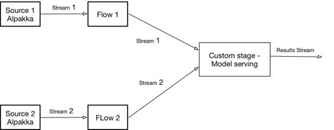

# 第八章\. Akka Streams 实现

Akka Streams 是 Akka 项目的一部分，是一个专注于进程内反压力响应式流的库。它类似于 Kafka Streams，但不严格绑定于 Kafka；它提供了一个广泛的连接器生态系统，连接到各种技术（数据存储、消息队列、文件存储、流媒体服务等）。

这个连接器生态系统通常被称为[Alpakka 生态系统](http://developer.lightbend.com/docs/alpakka/current/)，它建立在[Reactive Streams](http://www.reactive-streams.org/)标准之上（自从其创建以来，Akka Streams 一直是协同领导者）。随着 Reactive Streams 已经在 Java 9 中成为一部分，通过[JEP-266（更多并发更新）](http://openjdk.java.net/jeps/266)进程，更多的连接器和这个连接器生态系统的指数级增长将会发生，像亚马逊这样的主要参与者已经[在新的 AWS 2.0 SDK 中采用了它](http://amzn.to/2yERvnP)。

在 Akka Streams 中，计算是用类似图形的领域特定语言（DSL）编写的，旨在使图形绘制与代码之间的转换更简单。

Akka Streams 中的图形是从以下基本元素构建的：

+   Source 是一个具有恰好一个输出的部分图形。

+   Sink 是一个具有恰好一个输入的部分图形。

+   Stage 是从输入到输出的转换的实现。

+   Flow 是一个具有恰好一个输入和恰好一个输出的部分图形（阶段）。

+   Fan-in 是一个部分图形（阶段），它将多个流作为输入，并以用户定义的方式组合所有输入的元素提供单个输出。

+   Fan-out 是一个部分图形（阶段），它接受一个输入并生成多个输出。它们可能在不同输出之间路由元素，或同时在多个输出上发出元素。

+   自定义阶段是一个部分图形，可以接受任意数量的输入，应用自定义逻辑，并产生任意数量的输出。

Akka Streams 默认提供了[相当多](http://bit.ly/2yhbOGA)的内置阶段，你可以用来构建自定义应用程序。

# 总体架构

对于模型服务的实现，我决定使用自定义阶段，这是一种完全类型安全的封装所需功能的方式。我们的阶段将提供类似于 Flink 低级联接的功能（图 4-1）。 

有了这样一个组件，整体实现将会看起来像图 8-1 中所示。



###### 图 8-1\. Akka Streams 实现方法

# 使用 Akka Streams 实现模型服务

实现自定义`GraphStage`是 Akka 中的一个高级主题，因此您可能希望查看[文档](http://doc.akka.io/docs/akka/current/scala/stream/stream-customize.html)。实现从定义阶段的形状开始，如示例 8-1 所示（[完整代码在此处可用](http://bit.ly/2zeLEm9)）。

##### 示例 8-1\. 定义阶段的形状

```
class ModelStageShape() extends Shape {
 var dataRecordIn = InletWineRecord
 var modelRecordIn = InletModelToServe
 var scoringResultOut = Outlet[Option[Double]]("scoringOut")

def this(dataRecordIn: Inlet[WineRecord], modelRecordIn:
  Inlet[ModelToServe],scoringResultOut: Outlet[Option[Double]]) {

   this()
   this.dataRecordIn = dataRecordIn
   this.modelRecordIn = modelRecordIn
   this.scoringResultOut = scoringResultOut
 }

 override def deepCopy(): Shape =
   new ModelFanInShape(dataRecordIn.carbonCopy(),
   modelRecordIn.carbonCopy(), scoringResultOut)

 override def copyFromPorts(inlets: immutable.Seq[Inlet[_]],
   outlets: immutable.Seq[Outlet[_]]): Shape =
   new ModelFanInShape(
     inlets(0).asInstanceOf[Inlet[WineRecord]],
     inlets(1).asInstanceOf[Inlet[ModelToServe]],
     outlets(0).asInstanceOf[Outlet[Option[Double]]])

 override val inlets = List(dataRecordIn, modelRecordIn)
 override val outlets = List(scoringResultOut)
}
```

示例 8-1 定义了一个具有两个输入（数据记录和模型记录）和一个输出（评分结果）的形状。形状还定义了与输入和输出相关联的类型（Akka Streams 是强类型的）。

有了这个实现，阶段的实现在示例 8-2 中呈现（[完整代码在此处可用](http://bit.ly/2zeLEm9)）。

##### 示例 8-2\. 阶段实现

```
class ModelStage
  extends GraphStageWithMaterializedValue[ModelStageShape] {

 private val factories = ...

 override val shape: ModelStageShape = new ModelStageShape

 override def createLogicAndMaterializedValue
   (inheritedAttributes: Attributes): (GraphStageLogic) = {

   new GraphStageLogicWithLogging(shape) {
     // State must be kept in the Logic instance
     private var currentModel : Option[Model] = None
     private var newModel : Option[Model] = None
     // Start pulling input streams
     override def preStart(): Unit = {
       tryPull(shape.modelRecordIn)
       tryPull(shape.dataRecordIn)
     }

     setHandler(shape.modelRecordIn, new InHandler {
       override def onPush(): Unit = {
         val model = grab(shape.modelRecordIn)
         newModel = factories.get(model.modelType) match{
           case Some(factory) => factory.create(model)
           case _ => None
         }
         pull(shape.modelRecordIn)
       }
     })

     setHandler(shape.dataRecordIn, new InHandler {
       override def onPush(): Unit = {
         val record = grab(shape.dataRecordIn)
         newModel match {
           case Some(model) => {
             // Close current model first
             currentModel match {
               case Some(m) => m.cleanup()
               case _ =>
             }
             // Update model
             currentModel = Some(model)
             newModel = None
           }
           case _ =>
         }
         currentModel match {
           case Some(model) => {
             val quality =
              model.score(record.asInstanceOf[AnyVal])
                .asInstanceOf[Double]
             push(shape.scoringResultOut, Some(quality))
           }
           case _ => {
             push(shape.scoringResultOut, None)
           }
         }
         pull(shape.dataRecordIn)
       }
     })

     setHandler(shape.scoringResultOut, new OutHandler {
       override def onPull(): Unit = {}
     })
   }
  }
}
```

实现的主要部分是`createLogic`方法，它定义了阶段的主要处理逻辑。这是通过为输入和输出定义处理程序来完成的。

模型输入的处理程序创建一个新模型，并将其存储在本地变量中以供进一步使用。因为处理程序支持[背压](https://en.wikipedia.org/wiki/Back_pressure)，它控制来自源的记录速率（确保当前消息的处理完成）然后再尝试读取下一个记录。这是通过在处理程序执行结束时显式轮询新记录来实现的。

数据输入的处理程序检查是否有新模型，如果有，则更新正在提供的模型。然后，它检查是否有模型，如果有，则对数据进行评分。与模型处理程序类似，在记录处理完成后，处理程序轮询下一个记录。

最后，输出处理程序什么也不做。

这个类中的另一个重要方法是`preStart`，它启动对数据和模型记录的轮询。

有了阶段的实现，服务器的实现看起来像示例 8-3（[完整代码在此处可用](http://bit.ly/2zfyrtf)）。

##### 示例 8-3\. Akka 模型服务器实现

```
object AkkaModelServer {

 implicit val system = ActorSystem("ModelServing")
 implicit val materializer = ActorMaterializer()
 implicit val executionContext = system.dispatcher

 val dataConsumerSettings = ConsumerSettings(system,
  new ByteArrayDeserializer, new ByteArrayDeserializer)
   .withBootstrapServers(LOCAL_KAFKA_BROKER)
   .withGroupId(DATA_GROUP)
   .withProperty(ConsumerConfig.AUTO_OFFSET_RESET_CONFIG, "latest")

 val modelConsumerSettings = ConsumerSettings(
  system, new ByteArrayDeserializer, new ByteArrayDeserializer)
   .withBootstrapServers(LOCAL_KAFKA_BROKER)
   .withGroupId(MODELS_GROUP)
   .withProperty(ConsumerConfig.AUTO_OFFSET_RESET_CONFIG, "latest")

 def main(args: Array[String]): Unit = {
   import ApplicationKafkaParameters._
   val modelStream: Source[ModelToServe, Consumer.Control] =Consumer
       .atMostOnceSource(modelConsumerSettings,Subscriptions
       .topics(MODELS_TOPIC))
       .map(record => ModelToServe.fromByteArray(record.value()))
       .filter(_.isSuccess).map(_.get)

   val dataStream: Source[WineRecord, Consumer.Control] = Consumer
       .atMostOnceSource(dataConsumerSettings, Subscriptions
       .topics(DATA_TOPIC))
       .map(record => DataRecord.fromByteArray(record.value()))
       .filter(_.isSuccess).map(_.get)
   val model = new ModelStage()

   def dropMaterializedValueM1, M2, M3:
     NotUsed = NotUsed

   val modelPredictions  = Source.fromGraph(
     GraphDSL.create(dataStream, modelStream, model)(
      dropMaterializedValue) {
       implicit builder => (d, m, w) =>
         import GraphDSL.Implicits._
         // Wire input streams with the model stage (2 in, 1 out)
         d ~> w.dataRecordIn
         m ~> w.modelRecordIn
         SourceShape(w.scoringResultOut)
     }
   )
}
```

这里创建了`ActorSystem`和`Materializer`，这对于运行任何 Akka Stream 应用程序都是必要的。之后，分别创建了数据流和模型流，每个流都从相应的 Kafka 主题中读取数据，并将数据从二进制格式转换为内部表示。最后，将这两个流连接到我们的阶段，并启动生成的图。

# 扩展 Akka Streams 实现

与 Kafka Streams 类似，Akka Streams 实现在单个 Java 虚拟机（JVM）内运行。扩展此解决方案可能需要在多台机器上运行我们的实现的多个实例（类似于 Kafka Streams 应用程序扩展见[图 7-2]）。因为实现正在使用特定的消费者组来读取数据记录，Kafka 将意识到它们属于[同一应用程序](http://doc.akka.io/docs/akka-stream-kafka/current/consumer.html)，并将不同的分区发送到不同的实例，从而实现基于分区的负载平衡。

# 保存执行状态

我们简单实现的另一个不足之处是我们的阶段实现不是持久的，这意味着崩溃可能会丢失状态。 Akka Streams 本身不提供持久性模型。[Akka Persistence](http://doc.akka.io/docs/akka/current/scala/persistence.html)，Akka 的一个单独模块，提供了一个基于[event source](https://github.com/eligosource/eventsourced)的库来实现持久性。 Akka Streams 支持[使用阶段 actor](http://charithe.github.io/dynamic-akka-streams-using-stage-actors.html)，其中一个阶段可以封装一个自定义 actor。这允许使用[persistent actors](http://doc.akka.io/docs/akka/current/scala/persistence.html)，Akka 在系统中持久化状态的标准方式，从而解决了这类应用程序的持久性问题。

在第四章到第八章中，您已经看到了如何通过使用不同的流引擎和框架来实现模型服务，但与任何流应用程序一样，提供一个明确定义的监控解决方案是必要的。您可能希望在模型服务应用程序中看到的信息示例包括：

+   目前使用哪个模型？

+   安装时间是什么时候？

+   模型已经被服务多少次？

+   平均和最小/最大模型服务时间是多少？

我们在第九章中看到了这样的解决方案。
