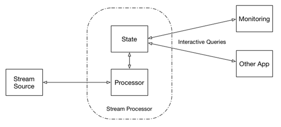

# 第九章 监控

获取执行信息的一般方法包括以下内容：

+   日志记录

+   将这些信息（定期）写入外部存储（例如数据库）

虽然这两种方法都能够工作并且经常被使用，但它们通常遭受以下问题：

+   它们会增加执行的额外延迟 —— 它们通常是在执行过程中使用同步调用来实现的。

+   它们需要额外的软件组件 —— 数据库、日志聚合器等，这意味着需要额外的维护。

最近，[Flink](http://bit.ly/2zgfsif)和[Kafka Streams](http://docs.confluent.io/current/streams/developer-guide.html#id8)都引入了可查询状态（图 9-1），这是一种与此类监控不同的方法。

[Kafka Streams 文档](http://docs.confluent.io/current/streams/developer-guide.html#id8)将可查询状态（交互式查询）定义为一种方法，根据文档描述

> 让你从流中获取更多，不仅仅是数据的处理。这个特性允许你将流处理层视为轻量级的嵌入式数据库，并且更具体地，直接查询流处理应用程序的最新状态，而无需首先将该状态材料化到外部数据库或外部存储中。



###### 图 9-1\. 可查询状态

# Flink

Flink 最近引入了一种管理的键控状态接口，该接口提供对当前执行的键范围内状态的访问。这意味着这种类型的状态只能在 Flink `KeyedStream`上使用，并且仅适用于 Flink 的基于键的连接实现。

当前的 Flink 实现包括以下[状态选项](http://bit.ly/2yh8sUw)：

`ValueState<T>`

这会保持一个可以更新和检索的值。你可以使用`update(T)`设置值，并使用`T value()`检索它。

`ListState<T>`

这会保持一个元素列表。`ListState`支持追加元素并检索所有当前存储元素的`Iterable`。你可以使用`add(T)`添加元素，并使用`Iterable<T> get()`检索`Iterable`。

`ReducingState<T>`

这会保持一个代表添加到状态中的所有值的聚合的单个值。与`ListState`类似，你可以使用`add(T)`添加一个元素，但是这些元素会使用指定的`ReduceFunction`进行聚合。

`FoldingState<T, ACC>`

这会保持一个表示添加到状态中的所有值的聚合的单个值。与`ReducingState`不同，聚合的类型可以与添加到状态的元素的类型不同。与`ReducingState`类似，你可以使用`add(T)`添加元素，并使用指定的`FoldFunction`将它们折叠成一个聚合。

Flink 还提供了 `QueryableStateClient` 类，您可以用于针对内部提供状态的 [KvState](http://vishnuviswanath.com/flink_queryable_state1.html) 实例进行查询。您需要使用有效的 Flink `JobManager` 地址、端口和作业 ID 进行配置。

要在我们的实现中合并可查询统计信息，必须通过向 `DataProcessor` 类（示例 4-1）添加 `ValueState<T>` 来修改。此类的更新版本如示例 9-1 所示（[完整代码在此处可用](http://bit.ly/DataProcessorKeyed)）。

##### 示例 9-1\. ModelToServeStats 类

```
class DataProcessorKeyed
    extends CoProcessFunction[WineRecord, ModelToServe, Double]
      with CheckpointedFunction
      with CheckpointedRestoring[List[Option[Model]]] {

 var modelState: ValueState[ModelToServeStats] = _
 var newModelState: ValueState[ModelToServeStats] = _
 ...

 override def open(parameters: Configuration): Unit = {
 val modelDesc = new ValueStateDescriptorModelToServeStats
   modelDesc.setQueryable("currentModel")

 modelState = getRuntimeContext.getState(modelDesc)
 val newModelDesc = new ValueStateDescriptorModelToServeStats
 newModelState = getRuntimeContext.getState(newModelDesc)
}

override def processElement2(model: ModelToServe,
    ctx: CoProcessFunction[WineRecord,
    ModelToServe, Double]#Context, out: Collector[Double]): Unit = {

   import DataProcessorKeyed._

   println(s"New model - $model")
   newModelState.update(new ModelToServeStats(model))
   newModel = factories.get(model.modelType) match {
     case Some(factory) => factory.create (model)
     case _ => None
   }
 }

 override def processElement1(record: WineRecord,
    ctx: CoProcessFunction[WineRecord,
    ModelToServe, Double]#Context, out: Collector[Double]): Unit = {

    ...
    val start = System.currentTimeMillis()
    val quality = model.score(record
      .asInstanceOf[AnyVal]).asInstanceOf[Double]
    val duration = System.currentTimeMillis() - start
    modelState.update(modelState.value().incrementUsage(duration))
    ...
}
```

此添加跟踪当前模型名称，引入时间，使用次数，总执行时间以及最小/最大执行时间。

您可以通过使用可查询状态客户端来访问此信息，如示例 9-2 所示（[完整代码在此处可用](http://bit.ly/2zg0J77)）。

##### 示例 9-2\. Flink 可查询状态客户端

```
object ModelStateQuery {
 def main(args: Array[String]) {
   val jobId = JobID.fromHexString("...")
   val types = Array("wine")
   val config = new Configuration()
   config.setString(JobManagerOptions.ADDRESS, "localhost")
   config.setInteger(JobManagerOptions.PORT, 6124)
   ...
   val client = new QueryableStateClient(config,
     highAvailabilityServices)
   val execConfig = new ExecutionConfig
   val keySerializer = createTypeInformation[
     String].createSerializer(execConfig)
   val valueSerializer = createTypeInformation[ModelToServeStats]
     .createSerializer(execConfig)
   while(true) {
     val stats = for (key <- types) yield {
       val serializedKey = KvStateRequestSerializer
          .serializeKeyAndNamespace(key,keySerializer,
          VoidNamespace.INSTANCE, VoidNamespaceSerializer.INSTANCE)
       // now wait for the result and return it
       try {
         val serializedResult = client.getKvState(jobId,
           "currentModel",key.hashCode(), serializedKey)
         val serializedValue = Await.result(serializedResult,
           FiniteDuration(2, TimeUnit.SECONDS))
         val value = KvStateRequestSerializer.deserializeValue
           (serializedValue, valueSerializer)
         List(value.name, value.description, value.since,
           value.usage,value.duration, value.min, value.max)
    ...
     }
     stats.toList.filter(_.nonEmpty).foreach(row =>
...
}
```

这个简单的实现每隔 `timeInterval` 轮询运行中的 Flink 服务器并打印结果。这里的 `jobId` 是由 Flink 服务器执行的当前 `jobId`。

# Kafka Streams

处理 Kafka Streams 时，必须考虑两件事情：在单个 Java 虚拟机（JVM）中发生了什么，以及几个代表单个 Kafka Streams 应用程序的 JVM 如何协同工作。因此，[Kafka 可查询 API](http://docs.confluent.io/current/streams/developer-guide.html#id8)包括两个部分：

[查询本地状态存储（对于应用程序实例）](http://bit.ly/2gddeMb)

这提供了对由应用程序实例（部分状态）本地管理的状态的访问。在这种情况下，应用程序实例可以直接查询自己的本地状态存储。因此，您可以在应用程序代码的其他部分中使用相应的（本地）数据，这些部分与调用 Kafka Streams API 无关。

[查询远程状态存储（对于整个应用程序）](http://bit.ly/2yhezYj)

要查询应用程序的完整状态，需要从每个实例的本地片段汇总状态。这意味着除了能够查询本地状态存储之外，还需要能够发现应用程序的所有运行实例。总体而言，这些构建块使得在应用程序内部进行通信（同一应用程序的实例之间）以及进行交互式查询的应用程序之间的通信成为可能。

实现始于定义状态表示，`ModelServingInfo`，可以查询以获取有关处理当前状态的信息，如示例 9-3（[完整代码在此处可用](http://bit.ly/2kGYGWu)）所示。

##### 示例 9-3\. ModelServingInfo 类

```
public class ModelServingInfo {

   private String name;
   private String description;
   private long since;
   private long invocations;
   private double duration;
   private long min;
   private long max;
   ...
   public void update(long execution){
       invocations++;
       duration += execution;
       if(execution < min) min = execution;
       if(execution > max) max = execution;
   }
...
}
```

现在，您必须将此信息添加到示例 7-2 中显示的状态存储中。 示例 9-4 向您展示了如何做到这一点（[完整代码在此处可用](http://bit.ly/2gbUCvJ))。

##### 示例 9-4\. 更新的 StoreState 类

```
public class StoreState {
   ...
   private ModelServingInfo currentServingInfo = null;
   private ModelServingInfo newServingInfo = null;
   ...
   public ModelServingInfo getCurrentServingInfo() {
     return currentServingInfo;}

   public void setCurrentServingInfo(ModelServingInfo
     currentServingInfo) {
       this.currentServingInfo = currentServingInfo;
   }

   public ModelServingInfo getNewServingInfo() {
     return newServingInfo;}

   public void setNewServingInfo(ModelServingInfo newServingInfo) {
       this.newServingInfo = newServingInfo;
   }
}
```

这将添加两个`ModelServingInfo`类的实例（类似于`Model`类）。 添加这些实例将需要对`ModelSerde`进行更改（示例 7-4）以实现对`ModelServingInfo`类的序列化/反序列化支持（[完整代码在此处可用](http://bit.ly/2zgeXVy)）。 示例 9-5 展示了如何实现这一点。

##### 示例 9-5\. ModelServingInfo 序列化/反序列化

```
...
private void writeServingInfo(ModelServingInfo servingInfo,
  DataOutputStream output){
   try{
       if(servingInfo == null) {
           output.writeLong(0);
           return;
       }
       output.writeLong(5);
       output.writeUTF(servingInfo.getDescription());
       output.writeUTF(servingInfo.getName());
       output.writeDouble(servingInfo.getDuration());
       output.writeLong(servingInfo.getInvocations());
       output.writeLong(servingInfo.getMax());
       output.writeLong(servingInfo.getMin());
       output.writeLong(servingInfo.getSince());
   }
   catch (Throwable t){
       System.out.println("Error Serializing servingInfo");
       t.printStackTrace();
   }
}
...
private ModelServingInfo readServingInfo(DataInputStream input) {
   try {
       long length = input.readLong();
       if (length == 0) return null;
       String descriprtion = input.readUTF();
       String name = input.readUTF();
       double duration = input.readDouble();
       long invocations = input.readLong();
       long max  = input.readLong();
       long min = input.readLong();
       long since = input.readLong();
       return new ModelServingInfo(name, descriprtion, since,
         invocations,duration, min, max); duration, min, max);
   } catch (Throwable t) {
       System.out.println("Error Deserializing serving info");
       t.printStackTrace();
       return null;
   }
}
```

最后，您还必须更改`ModelStateStore`类（示例 7-2）。 首先，Streams 可查询状态仅允许对存储数据进行读取访问，这需要引入一个仅支持读取访问的接口，该接口可用于查询（示例 9-6）：

##### 示例 9-6\. 可查询状态存储接口

```
public interface ReadableModelStateStore {
   ModelServingInfo getCurrentServingInfo();
}
```

有了这个信息，您可以扩展`DataProcessorWithStore`类（示例 7-7）以收集您的执行信息，如示例 9-7 所示（[完整代码在此处可用](http://bit.ly/2kH9HqR))。

##### 示例 9-7\. 更新的数据处理器类

```
...
   // Score the model
   long start = System.currentTimeMillis();
   double quality = (double) modelStore.getCurrentModel().score(
     dataRecord.get());
   long duration = System.currentTimeMillis() - start;
   modelStore.getCurrentServingInfo().update(duration);
...
```

要使应用程序的完整状态（所有实例）可查询，需要提供额外实例的可发现性。 示例 9-8 展示了这种服务的简单实现（[完整代码在此处可用](http://bit.ly/2wNZfzs))。

##### 示例 9-8\. 简单的元数据服务

```
public class MetadataService {
   private final KafkaStreams streams;

   public MetadataService(final KafkaStreams streams) {
       this.streams = streams;
   }

   public List<HostStoreInfo> streamsMetadata() {
       // Get metadata for all of the instances of this application
       final Collection<StreamsMetadata> metadata =
         streams.allMetadata();
       return mapInstancesToHostStoreInfo(metadata);
   }

   public List<HostStoreInfo> streamsMetadataForStore(
     final  String store) {
       // Get metadata for all of the instances of this application
       final Collection<StreamsMetadata> metadata =
         streams.allMetadataForStore(store);
       return mapInstancesToHostStoreInfo(metadata);
   }

   private List<HostStoreInfo> mapInstancesToHostStoreInfo(
     final Collection<StreamsMetadata> metadatas) {
       return metadatas.stream().map(metadata -> new HostStoreInfo(
         metadata.host(),metadata.port(),
         metadata.stateStoreNames()))
         .collect(Collectors.toList());
   }
}
```

为了实际提供这些信息，您需要实现一个简单的 REST 服务，使用 HTTP 服务器实现从元数据服务暴露信息以及用于构建 REST 服务的框架。 在此示例中，我使用了 Java 生态系统中流行的 Jetty 和 JAX-RS（具有相应的 JAX-RS 注解），这是流行的选择。 示例 9-9 展示了一个使用元数据服务和模型服务信息的简单 REST 服务实现（[完整代码在此处可用](http://bit.ly/2i2QAXj))。

##### 示例 9-9\. 简单的 REST 服务实现

```
@Path("state")
public class QueriesRestService {
   private final KafkaStreams streams;
   private final MetadataService metadataService;
   private Server jettyServer;

   public QueriesRestService(final KafkaStreams streams) {
       this.streams = streams;
       this.metadataService = new MetadataService(streams);
   }

   @GET()
   @Path("/instances")
   @Produces(MediaType.APPLICATION_JSON)
   public List<HostStoreInfo> streamsMetadata() {
       return metadataService.streamsMetadata();
   }
   @GET()
   @Path("/instances/{storeName}")
   @Produces(MediaType.APPLICATION_JSON)
   public List<HostStoreInfo> streamsMetadataForStore(
   @PathParam("storeName") String store) {
       return metadataService.streamsMetadataForStore(store);
   }
   @GET
   @Path("{storeName}/value")
   @Produces(MediaType.APPLICATION_JSON)
   public ModelServingInfo servingInfo(
   @PathParam("storeName") final String storeName) {
       // Get the Store
       final ReadableModelStateStore store = streams.store(
         storeName, new ModelStateStore.ModelStateStoreType());
       if (store == null) {
           throw new NotFoundException();
       }
       return store.getCurrentServingInfo();
   }

...
}
```

此实现提供了几种 REST 方法：

+   获取应用程序实例列表（请记住，为了可伸缩性，可以运行多个 Kafka Streams 应用程序实例，其中每个实例负责一部分主题的分区）。 它返回每个实例中可用的状态存储列表。

+   获取包含具有给定名称的存储的应用程序实例列表。

+   从具有给定名称的存储中获取`Model`服务信息。

此代码需要实现两个额外的类：一个用作返回有关给定主机上存储的信息的数据容器的类，以及用于在 Kafka Streams 实例中定位存储的模型存储类型。示例 9-10 展示了数据容器类的外观（[完整代码在此处可用](http://bit.ly/2xzllVI)）。

##### 示例 9-10\. 主机存储信息

```
public class HostStoreInfo {
   private String host;
   private int port;
   private Set<String> storeNames;
   ...
   public String getHost() {return host;}
   public void setHost(final String host) {this.host = host;}\
   public int getPort() {return port;}
   public void setPort(final int port) {this.port = port;}
   public Set<String> getStoreNames() {return storeNames;}
   public void setStoreNames(final Set<String> storeNames) {
       this.storeNames = storeNames;
   }
}
```

模型存储类型看起来像示例 9-11（[完整代码在此处可用](http://bit.ly/2xyoyK8)）：

##### 示例 9-11\. 主机存储信息

```
public class ModelStateStoreType implements
QueryableStoreType<ReadableModelStateStore> {
   @Override public boolean accepts(StateStore stateStore) {
       return stateStore instanceof ModelStateStore;
   }
   @Override public ReadableModelStateStore create(
     StateStoreProvider provider,String storeName) {
       return provider.stores(storeName, this).get(0);
   }
}
```

最后，为了将所有内容整合在一起，您需要更新使用 Kafka Streams 进行模型服务的整体实现，如示例 7-6 中所示，如示例 9-12（[完整代码在此处可用](http://bit.ly/2xzyYEs)）。

##### 示例 9-12\. 使用 Kafka Streams 更新模型服务

```
public class ModelServerWithStore {
   final static int port=8888;

   public static void main(String [ ] args) throws Throwable {
   ...
       // Start the Restful proxy for servicing remote access
       final QueriesRestService restService =
         startRestProxy(streams, port);
       // Add shutdown hook to respond to SIGTERM
       Runtime.getRuntime().addShutdownHook(new Thread(() -> {
           try {
               streams.close();
               restService.stop();
           } catch (Exception e) {
               // ignored
           }
       }));
   }
   ...
   static QueriesRestService startRestProxy(KafkaStreams streams,
     int port) throws Exception {
       final QueriesRestService restService =
         new QueriesRestService(streams);
       restService.start(port);
       return restService;
   }
}
```

完成后，您可以通过按名称查询存储来获取状态存储内容。

# Akka Streams

Akka Streams 不支持可查询状态（或任何状态），但通过对我们的自定义阶段实现进行小改动（示例 8-2），可以从阶段中公开状态。

要做到这一点，首先必须创建一个用于从阶段查询状态的接口，如示例 9-13 中所示（与 Kafka Streams 可查询状态存储接口示例 9-6 进行比较）。

##### 示例 9-13\. 状态查询接口

```
trait ReadableModelStateStore {
 def getCurrentServingInfo: ModelToServeStats
}
```

有了这个，您可以编写阶段实现以支持此接口并收集统计信息，如示例 9-14 中所示（[完整代码在此处可用](http://bit.ly/2zeLEm9)）。

##### 示例 9-14\. 更新的 ModelStage

```
class ModelStage extends GraphStageWithMaterializedValue
  [ModelStageShape,ReadableModelStateStore] {
     ...
     setHandler(shape.dataRecordIn, new InHandler {
       override def onPush(): Unit = {
         val record = grab(shape.dataRecordIn)
         newModel match {
           ...
         }
         currentModel match {
           case Some(model) => {
             val start = System.currentTimeMillis()
             val quality = model.score(record.asInstanceOf[AnyVal]).
               asInstanceOf[Double]
             val duration = System.currentTimeMillis() - start
             println(s"Calculated quality - $quality calculated in
               $duration ms")
             currentState.get.incrementUsage(duration)
             push(shape.scoringResultOut, Some(quality))
           }
           case _ => {
             println("No model available - skipping")
             push(shape.scoringResultOut, None)
           }
         }
         pull(shape.dataRecordIn)
       }
     })

...
     // We materialize this value
     val readableModelStateStore = new ReadableModelStateStore() {
       override def getCurrentServingInfo: ModelToServeStats =
         logic.currentState.getOrElse(ModelToServeStats.empty)
     }
     new Tuple2[GraphStageLogic, ReadableModelStateStore]
     (logic, readableModelStateStore)
 }
}
```

在此实现中，`dataRecordIn`处理程序被扩展以收集执行统计信息。此外，提供了状态查询接口的实现（示例 9-13），以便可以查询当前模型状态的阶段。

对于 REST 接口的实现，我使用了[Akka HTTP](http://doc.akka.io/docs/akka-http/current/scala/http/)。用于访问统计信息的资源可以按照示例 9-15 中所示进行实现（[完整代码在此处可用](http://bit.ly/2xzNwJi)）。

##### 示例 9-15\. 实现 REST 资源

```
object QueriesAkkaHttpResource extends JacksonSupport {

 def storeRoutes(predictions: ReadableModelStateStore) :
   Route = pathPrefix("stats"){
   pathEnd {
     get {
       val info: ModelToServeStats =
         predictions.getCurrentServingInfo
       complete(info)
     }
   }
 }
}
```

要将所有内容整合在一起，您必须修改 Akka 模型服务器（示例 8-3）中所示的方式，如示例 9-16（[完整代码在此处可用](http://bit.ly/2zfyrtf)）。

##### 示例 9-16\. 更新的 Akka 模型服务器实现

```
object AkkaModelServer {
...

 def main(args: Array[String]): Unit = {

...

   val modelStream: Source[ModelToServe, Consumer.Control] =

...

   val dataStream: Source[WineRecord, Consumer.Control] =

...

   val model = new ModelStage()

   def keepModelMaterializedValueM1, M2, M3: M3 = m3

   val modelPredictions :
     Source[Option[Double], ReadableModelStateStore] =
    Source.fromGraph(
     GraphDSL.create(dataStream, modelStream, model)(
       keepModelMaterializedValue) {
       implicit builder => (d, m, w) =>
         import GraphDSL.Implicits._

         d ~> w.dataRecordIn
         m ~> w.modelRecordIn
         SourceShape(w.scoringResultOut)
     }
   )

 val materializedReadableModelStateStore: ReadableModelStateStore =
     modelPredictions
       .map(println(_))
       .to(Sink.ignore)
       .run() // run the stream, materializing the StateStore

   startRest(materializedReadableModelStateStore)
 }

 def startRest(service : ReadableModelStateStore) : Unit = {

   implicit val timeout = Timeout(10 seconds)
   val host = "localhost"
   val port = 5000
   val routes: Route = QueriesAkkaHttpResource.storeRoutes(service)

   Http().bindAndHandle(routes, host, port) map
     { binding => println(s"REST interface bound to
        ${binding.localAddress}") }
     recover { case ex => println(
        s"REST interface could not bind to $host:$port", ex.getMessage)
   }
 }
}
```

这里有几处更改：

+   我们将使用`keepModelMaterializedValue`而不是`dropMaterializedValue`。

+   实现了一个新方法 `startRest`，它基于资源（示例 9-16）和接口的实现（示例 9-14）启动了一个内部 REST 服务。

+   材料化状态用于访问统计数据。

尽管此解决方案提供了对本地（基于实例）模型服务统计信息的访问，但它并不支持获取基于应用程序的信息（与可查询的 Kafka Streams 存储相比）。幸运的是，Kafka 本身会跟踪具有相同组 ID 的实例，并提供（文档不太完善的）[AdminClient](http://bit.ly/2wOIuEk) API（[使用示例](http://bit.ly/2yb2Lrf)），您可以使用这些 API 获取消费者组的主机列表。假设所有实例在不同主机上执行且具有相同端口，则可以使用此信息发现所有应用程序实例并连接到它们以获取所需信息。这不是一个完全可靠的方法，但在大多数情况下可以用来获取完整的应用程序统计信息。

# Spark 和 Beam

目前 Spark 和 Beam 都不支持可查询状态，我也没有看到任何明确的计划和提议在未来添加此支持。因此，如果您使用这些工具之一，可以通过使用日志记录或外部数据库（例如[Cassandra](http://cassandra.apache.org/)）来实现监控。

对于 Spark，还有另一个选择：使用[Spark Job Server](https://github.com/spark-jobserver/spark-jobserver)，它为 Spark 作业和上下文提供了一个 REST API。Spark Job Server 支持将 Spark 用作[查询引擎](http://bit.ly/2wOEkMy)（类似于可查询状态）。

从架构上看，[Spark Job Server](http://bit.ly/2wOEkMy) 包括一个 REST 作业服务器，为消费者提供 API，并管理应用程序 jar 包、执行上下文以及在 Spark 运行时的作业执行。共享[上下文](https://github.com/spark-jobserver/spark-jobserver/blob/master/doc/contexts.md)允许多个作业访问相同的对象（在我们的情况下是弹性分布式数据集 [RDD] 状态）。因此，在这种情况下，我们的 Spark 实现（示例 6-1）可以扩展以将模型执行状态添加到 RDD 状态中。这将使得可以创建一个简单的应用程序，使用 Spark Job Server 查询此状态数据。

# 结论

现在，您应该对在流式应用程序中为机器学习生成的模型提供服务的复杂性有了全面的了解。您学会了如何以 TensorFlow 和 PMML 格式导出训练好的模型，并使用几种流行的流处理引擎和框架提供这些模型的服务。您还可以考虑几种解决方案。在决定具体技术实现时，您应考虑您正在提供的模型数量、每个模型要评分的数据量和计算复杂性、您的可扩展性要求以及您组织的现有专业知识。我鼓励您查看文本中引用的材料，以获取更多信息，帮助您实施解决方案。

# 关于作者

**鲍里斯·卢布林斯基**是 Lightbend 的首席架构师。他在企业、技术架构和软件工程方面拥有超过 25 年的经验。他是《应用 SOA：面向服务的架构和设计策略》（Wiley）和《专业 Hadoop 解决方案》（Wiley）的合著者。他还是关于架构、编程、大数据、SOA 和 BPM 的大量文章的作者。
