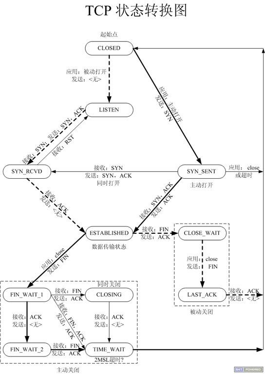

# 解读 Tornado

# 解读 Tornado

前几章主要是针对 TCP 编程中，tornado 中常用的函数进行简单的解读。本章主要对 tornado 性能进行分析，来看一看我们到底为什么要在 tornado 的基础上进行 tcp 编程。

# epoll

## epoll

我们知道 tornado 通过非阻塞的方式以及对 epoll 的运用，才使得性能上得到了很大的提升。那么 epoll 到底是什么，它在 tornado 中扮演着怎样的角色呢？

1.epoll 解读

说到 epoll，就得先说说阻塞和非阻塞，这里大家自行百度或者脑补。 我们通常处理数据流可能是这样的

```
While true：
    for i in stream:
        if i has data:
            Do something with i 
```

这种方式显然很差劲，他会一直轮询，不管数据流中是否有 IO 事件。针对这种情况就出现了 select， 它可以甄别数据流是否有 IO，当无 IO 的时候，就阻塞在那里，直到下一次 IO 发生，在进行操作。

```
While true：
    select（stream）
    for i in stream：
        if i has data：
            Do something 
```

虽然我们不用白白的轮询，也知道了是否发生 IO，，但却并不知道是那几个流（可能有一个，多个，甚至全部），我们只能无差别轮询所有流，找出能读出数据，或者写入数据的流，对他们进行操作。 因此 epoll 就诞生了，epoll 全称就是 event poll，和咱们平常用的轮询不同，基于事件的 epoll 会把哪个数据流发生了怎样的事件告诉我们。

```
while true 
    active_stream[] = epoll_wait(epollfd)
    for i in active_stream[]：
        read or write till unavailable 
```

# epoll 的 CPU 和内存消耗

## 2.epoll 的性能优势

#### 前面说了 epoll 的特点，那么这些特点能带来什么好处呢？Epoll 在绝大多数情况下性能都远超 select 或者 poll，但是除了速度之外，三者之间的 CPU 开销，内存消耗情况又怎么样呢？

##### 以下来自 stackoverflow 网友的问答翻译

##### 问:

##### 我读过所有的关于 tornado 的书告诉我在 epoll 是可以替代 select 和 poll 的，特别是对 twisted(twsited 是 python 的另一个十分有名的网络库)。查阅 epoll 以及其他的(select 等)相关资料表明，epoll 速度很快并且拓展性很强，这是否表明在 CPU 和内存消耗上，epoll 仍然很强？

##### 答：

##### 在 socket 数量很少的时候，select 在内存消耗以及运行效率上都超过 epoll，当然，这个差距是非常小的，以至于在绝大多数环境下都可以忽略。但是，无论是选择 select 还是 epoll，在不同场景下面临的 api 复杂度是不一样的。如果你选择了一个单一的 fd，100，那么它的性能会高于两倍���上的 fd，50.

##### Epoll 的成本接近于 fd(文件描述符)，如果你监控 200 个 fd，其中只有 100 个有 IO 事件，那么你只需要支付这 100 个 fd 的消耗，而不用在乎另外的 100 个，这就是 epoll 提供的优势。相反，当你使用 select 的时候，如果 1000 个 fd 都处于空闲，你仍然要监控这 1000 个 fd(简单的来讲，就是 epoll 只为有 io 的 fd 支付。你干活，我付钱给你；你不干活，那么我就不给你钱)。那么这就意味着更少的 CPU 使用率。

##### 关于内存使用率，简单来说，使用 select 的话，你要花 384 字节监视一个文件描述符，但它的价值是 1024，而用 epoll 你只花 20 个字节。不过，所有这些数字都很小，所以没有太大的区别。

# tornado 在 TCP 层里的工作

## tornado 在 TCP 里的工作

首先是关于 TCP 协议。这是一个面向连接的可靠交付的协议。由于是面向连接，所以在服务器端需要分配内存来记忆客户端连接，同样客户端也需要记录服务器。为了安全所以有了三次握手机制，这里给出一张图-- 状态转换图(UNIX 网络编程)

对于 TCP 编程的总结就是：创建一个监听 socket，然后把它绑定到端口和地址上并开始监听，然后不停 accept。这也是 tornado 的 TCPServer 要做的工作。

TCPServer 类的定义在 tcpserver.py。它有两种用法：bind+start 或者 listen。

简言之，基于事件驱动的服务器（tornado）要干的事就是：创建 socket，绑定到端口并 listen，然后注册事件和对应的回调，在回调里 accept 新请求。

创建监听 socket 后为了异步，设置 socket 为非阻塞（这样由它 accept 派生的 socket 也是非阻塞的），然后绑定并监听之。add_sockets 方法接收 socket 列表，对于列表中的 socket，用 fd 作键记录下来，并调用 add_accept_handler 方法。它也是在 netutil 里定义的。

add_accept_handler 方法的流程：首先是确保 ioloop 对象。然后调用 add_handler 向 loloop 对象注册在 fd 上的 read 事件和回调函数 accept_handler。该回调函数是现成定义的，属于 IOLoop 层次的回调，每当事件发生时就会调用。回调内容也就是 accept 得到新 socket 和客户端地址，然后调用 callback 向上层传递事件。从上面的分析可知，当 read 事件发生时，accept_handler 被调用，进而 callback=_handle_connection 被调用。

# tornado TCPServer 的设计解读

## TcpServer 类的解读

##### 在 TCPServer 类的注释中，首先强调了它是一个 non-blocking, single-threaded TCP Server.

那么如何理解 non-blocking 呢？ non-blocking，就是说，这个服务器没有使用阻塞式 API。 通常来说，我们 socket 的读写都是阻塞式的,不管有没有数据，服务器都派 API 去读，读不到，API 就不会回来交差。而非阻塞区别在于没有数据可读时，它不会在那死等，它直接就返回了。 而 single-thread，说的是服务器是单线程模式，一个线程可以监视成千上万的连接，因此不需要多线程。在 ubuntu 上用的是 epoll，bsd 用的是 kqueue。

在使用方面，tcpserver 这个类一般不直接使用，而是派生出子类，然后让子类实例化。可以看到作者是强制去继承 tcpserver，handle_stream 并没有实现，如果你不去覆盖，就会报错。

```
def handle_stream(self, stream, address):

    """Override to handle a new `.IOStream` from an incoming connection."""

    raise NotImplementedError() 
```

# ioloop 分析

## ioloop 分析

###### 咱们先来简单说一下 ioloop 的源码

```
while True:
    poll_timeout = 3600.0

    # Prevent IO event starvation by delaying new callbacks
    # to the next iteration of the event loop.
    with self._callback_lock:
        ＃上次循环的回调列表
        callbacks = self._callbacks
        self._callbacks = []
    for callback in callbacks:
        ＃执行遗留回调
        self._run_callback(callback)

    if self._timeouts:
        now = self.time()
        while self._timeouts:
            ＃超时回调
            if self._timeouts[0].callback is None:
                # 最小堆维护超时事件
                heapq.heappop(self._timeouts)
            elif self._timeouts[0].deadline <= now:
                timeout = heapq.heappop(self._timeouts)
                self._run_callback(timeout.callback)
            else:
                seconds = self._timeouts[0].deadline - now
                poll_timeout = min(seconds, poll_timeout)
                break

    if self._callbacks:
        # If any callbacks or timeouts called add_callback,
        # we don't want to wait in poll() before we run them.
        poll_timeout = 0.0

    if not self._running:
        break

    if self._blocking_signal_threshold is not None:
        # clear alarm so it doesn't fire while poll is waiting for
        # events.
        signal.setitimer(signal.ITIMER_REAL, 0, 0)

    try:
        ＃这里的 poll 就是 epoll，当有事件发生，就会返回，详情参照 tornado 里 e＃poll 的代码
        event_pairs = self._impl.poll(poll_timeout)
    except Exception as e:
        if (getattr(e, 'errno', None) == errno.EINTR or
            (isinstance(getattr(e, 'args', None), tuple) and
             len(e.args) == 2 and e.args[0] == errno.EINTR)):
            continue
        else:
            raise

    if self._blocking_signal_threshold is not None:
        signal.setitimer(signal.ITIMER_REAL,
                         self._blocking_signal_threshold, 0)

    ＃如果有事件发生，添加事件，
    self._events.update(event_pairs)
    while self._events:
        fd, events = self._events.popitem()
        try:
            ＃根据 fd 找到对应的回调函数，
            self._handlersfd
        except (OSError, IOError) as e:
            if e.args[0] == errno.EPIPE:
                # Happens when the client closes the connection
                pass
            else:
                app_log.error("Exception in I/O handler for fd %s",
                              fd, exc_info=True)
        except Exception:
            app_log.error("Exception in I/O handler for fd %s",
                          fd, exc_info=True) 
```

##### 简单来说一下流程，首先执行上次循环的回调列表，然后调用 epoll 等待事件的发生，根据 fd 取出对应的回调函数，然后执行。IOLoop 基本是个事件循环，因此它总是被其它模块所调用。

##### 咱们来看一下 ioloop 的 start 方法，start 方法中主要分三个部分：一个部分是对超时的相关处理；一部分是 epoll 事件通知阻塞、接收；一部分是对 epoll 返回 I/O 事件的处理。

1.超时的处理，是用一个最小堆来维护每个回调函数的超时时间，如果超时，取出对应的回调，如果没有则重新设置 poll_timeout 的值

2.通过 self._impl.poll(poll_timeout) 进行事件阻塞，当有事件通知或超时时 poll 返回特定的 event_pairs，这个上面也说过了。
