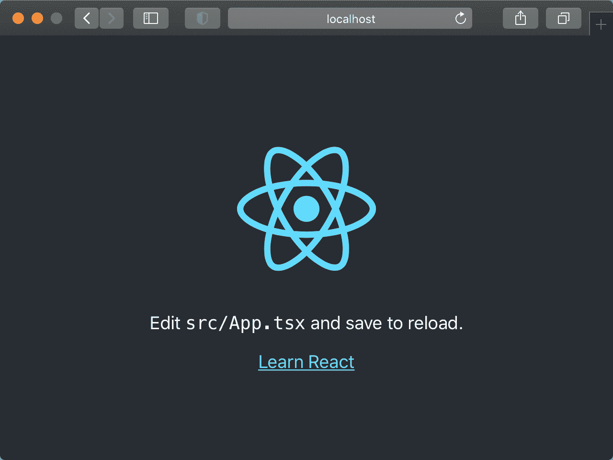
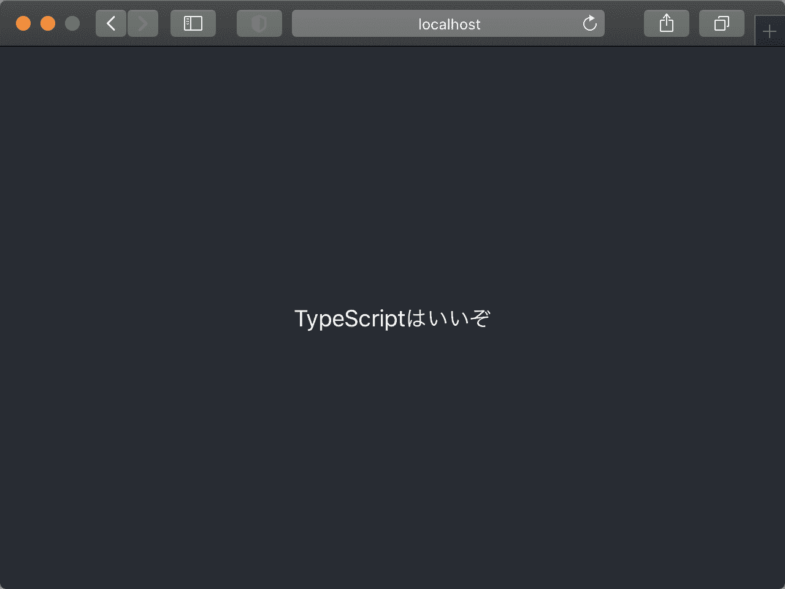
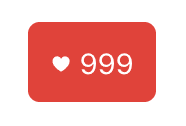
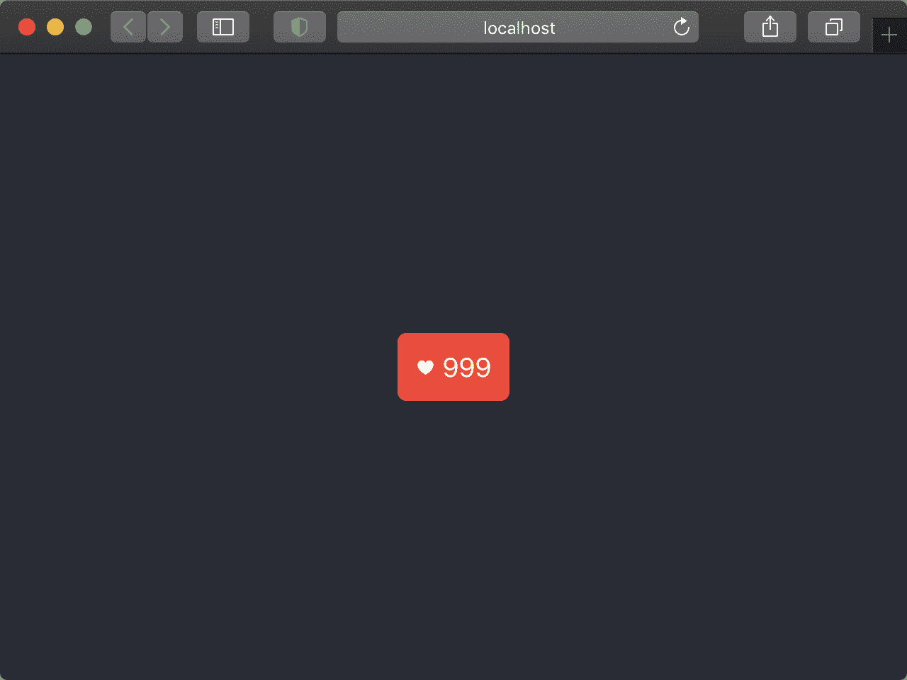
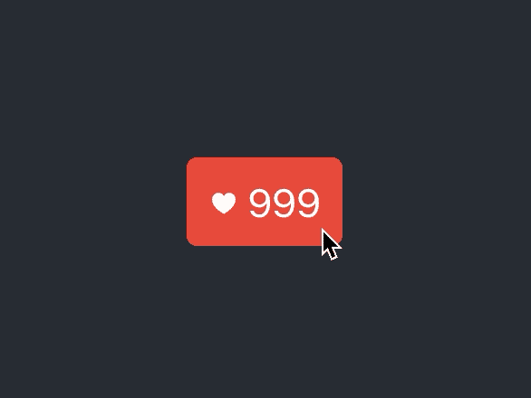

# Reactでいいねボタンを作ろう

> 原文：[`typescriptbook.jp/tutorials/react-like-button-tutorial`](https://typescriptbook.jp/tutorials/react-like-button-tutorial)

このチュートリアルでは、TypeScriptとReactの両方を用いて、SNSでよく見かける「いいねボタン」のUIを実装します。

本チュートリアルは、TypeScriptとReactによるコーディングの体験をすることを主眼に置いています。そのため、TSとReactの理論的な説明は省きます。「TypeScriptとReactでUIを開発するにはどのような流れになるのか」を感じ取って頂くことを目的としています。

Reactの専門書と比べて、本書の解説は詳しさや正確さは劣ります。それでも、初めてReactに触れる方でも読み進められるよう、Reactについて随時ワンポイント解説をしていくので、安心してお読みください。

このチュートリアルで作成するいいねボタンの最終的な成果物は[デモサイト](https://like-button.typescriptbook.jp)で確認できます。チュートリアルを開始する前に事前に触ってみることで、各ステップでどんな実装をしているかのイメージが掴みやすくなります。また、完成形のソースコードは[GitHub](https://github.com/yytypescript/like-button)で確認することができます。

## Reactとは？​

ReactはFacebook 社が開発した、ウェブアプリケーションのUIを作るためのパッケージです。JavaScriptやTypeScriptだけでもインタラクティブなUIは実装できます。しかし、UIが複雑になるとReactなしではコードの記述量が増大したり、可読性が悪くなったりと難易度が上がります。なんといっても、UIが今どのような状態なのかを管理するのは、プログラマが把握しきれない複雑さになることがあります。Reactを使うと、複雑なUIやインタラクションを短く簡潔に読みやすく書けるようになり、状態の管理も分かりやすくなります。

## Reactの3 大特徴​

Reactはどのような特徴を持ったパッケージなのでしょうか？ここではReactの特徴を3つに分けて説明します。Reactについて多少の予備知識を得たい方は、このセクションをお読みください。今すぐコードを書きたいという方は、ここは読み飛ばしても問題ありません。

### 特徴その1: 仮想 DOM​

Reactは仮想 DOM(virtual DOM)という考えを採用しています。仮想 DOMを理解するには、仮想ではない普通のDOMが何かを知る必要があります。DOM(document object model)とは、HTMLをJavaScriptから参照・操作する仕組みです。これのおかげで、HTMLを文字列操作ではな���、オブジェクトとして処理できます。DOMはHTMLを操作するためのAPIのようなものです。

プログラマがDOMを操作すると、間接的にHTMLが書き換えられ、その結果が画面に描画されます。多くの動的なUIはDOM 操作で成り立っています。

```
js`// <input id="email">の文字色を赤色にするDOM 操作の例 const  <data-lsp lsp="module emailInput
const emailInput: HTMLElement | null">emailInput</data-lsp>  =  <data-lsp lsp="var document: Document">document</data-lsp>.<data-lsp lsp="(method) Document.getElementById(elementId: string): HTMLElement | null">getElementById</data-lsp>("email");<data-lsp lsp="module emailInput
const emailInput: HTMLElement | null">emailInput</data-lsp>.<data-lsp lsp="(property) ElementCSSInlineStyle.style: CSSStyleDeclaration">style</data-lsp>.<data-lsp lsp="(property) CSSStyleDeclaration.color: string">color</data-lsp> =  "red";`
```

```
js`// <input id="email">の文字色を赤色にするDOM 操作の例 const  <data-lsp lsp="module emailInput
const emailInput: HTMLElement | null">emailInput</data-lsp>  =  <data-lsp lsp="var document: Document">document</data-lsp>.<data-lsp lsp="(method) Document.getElementById(elementId: string): HTMLElement | null">getElementById</data-lsp>("email");<data-lsp lsp="module emailInput
const emailInput: HTMLElement | null">emailInput</data-lsp>.<data-lsp lsp="(property) ElementCSSInlineStyle.style: CSSStyleDeclaration">style</data-lsp>.<data-lsp lsp="(property) CSSStyleDeclaration.color: string">color</data-lsp> =  "red";`
```

DOMは必ずしもプログラマにとって使いやすいAPIではありません。上の例のようなスタイルを少し変更するくらいなら実用的です。しかし、複雑なUIを作ろうとすると途端に難しくなります。注意深く実装しないと、表示や状態の変更し忘れといったバグを生みやすくなります。操作の方法が悪くパフォーマンス面で問題が出たりします。

仮想 DOMはリアルDOMのプロキシのようなものです。リアルDOMと比べて、状態管理上のバグを起こしにくい設計になっています。加えて、パフォーマンス面では描画処理の最適化もします。プログラマにとっては、リアルDOMを扱うときのような慎重さが不要になります。画面表示を変えたければ、仮想 DOMを操作します。仮想 DOMに起こった変更はリアルDOMに伝わり、画面に現れてきます。仮想 DOMは、複雑なUIを苦労せずに実装するための仕組みと言えます。

### 特徴その2: 宣言的 UI​

Reactの2つ目の特徴はUIを宣言的に書ける点です。Reactを使わずにUIを実装すると、命令的なコードになります。命令的なコードでは、何かを表示したい場合でもどのように表示するかのhowの部分を細かく書く必要があります。

次の簡単なHTMLのリストを表示するために、命令的なコードと宣言的なコードで書き方がどう違うかを見ていきましょう。

```
html`<ul> <li>リンゴ</li> <li>オレンジ</li> <li>ぶどう</li></ul>`
```

```
html`<ul> <li>リンゴ</li> <li>オレンジ</li> <li>ぶどう</li></ul>`
```

まず、命令的なコードでは、次のようになります。

```
js`const  <data-lsp lsp="const list: HTMLUListElement">list</data-lsp>  =  <data-lsp lsp="var document: Document">document</data-lsp>.<data-lsp lsp="(method) Document.createElement<&quot;ul&quot;>(tagName: &quot;ul&quot;, options?: ElementCreationOptions | undefined): HTMLUListElement (+2 overloads)">createElement</data-lsp>("ul");const  <data-lsp lsp="module apple
const apple: HTMLLIElement">apple</data-lsp>  =  <data-lsp lsp="var document: Document">document</data-lsp>.<data-lsp lsp="(method) Document.createElement<&quot;li&quot;>(tagName: &quot;li&quot;, options?: ElementCreationOptions | undefined): HTMLLIElement (+2 overloads)">createElement</data-lsp>("li");<data-lsp lsp="module apple
const apple: HTMLLIElement">apple</data-lsp>.<data-lsp lsp="(property) HTMLElement.innerText: string">innerText</data-lsp> =  "リンゴ";<data-lsp lsp="const list: HTMLUListElement">list</data-lsp>.<data-lsp lsp="(method) ParentNode.append(...nodes: (string | Node)[]): void">append</data-lsp>(<data-lsp lsp="module apple
const apple: HTMLLIElement">apple</data-lsp>);const  <data-lsp lsp="module orange
const orange: HTMLLIElement">orange</data-lsp>  =  <data-lsp lsp="var document: Document">document</data-lsp>.<data-lsp lsp="(method) Document.createElement<&quot;li&quot;>(tagName: &quot;li&quot;, options?: ElementCreationOptions | undefined): HTMLLIElement (+2 overloads)">createElement</data-lsp>("li");<data-lsp lsp="module orange
const orange: HTMLLIElement">orange</data-lsp>.<data-lsp lsp="(property) HTMLElement.innerText: string">innerText</data-lsp> =  "オレンジ";<data-lsp lsp="const list: HTMLUListElement">list</data-lsp>.<data-lsp lsp="(method) ParentNode.append(...nodes: (string | Node)[]): void">append</data-lsp>(<data-lsp lsp="module orange
const orange: HTMLLIElement">orange</data-lsp>);const  <data-lsp lsp="module grape
const grape: HTMLLIElement">grape</data-lsp>  =  <data-lsp lsp="var document: Document">document</data-lsp>.<data-lsp lsp="(method) Document.createElement<&quot;li&quot;>(tagName: &quot;li&quot;, options?: ElementCreationOptions | undefined): HTMLLIElement (+2 overloads)">createElement</data-lsp>("li");<data-lsp lsp="module grape
const grape: HTMLLIElement">grape</data-lsp>.<data-lsp lsp="(property) HTMLElement.innerText: string">innerText</data-lsp> =  "ぶどう";<data-lsp lsp="const list: HTMLUListElement">list</data-lsp>.<data-lsp lsp="(method) ParentNode.append(...nodes: (string | Node)[]): void">append</data-lsp>(<data-lsp lsp="module grape
const grape: HTMLLIElement">grape</data-lsp>);`
```

```
js`const  <data-lsp lsp="const list: HTMLUListElement">list</data-lsp>  =  <data-lsp lsp="var document: Document">document</data-lsp>.<data-lsp lsp="(method) Document.createElement<&quot;ul&quot;>(tagName: &quot;ul&quot;, options?: ElementCreationOptions | undefined): HTMLUListElement (+2 overloads)">createElement</data-lsp>("ul");const  <data-lsp lsp="module apple
const apple: HTMLLIElement">apple</data-lsp>  =  <data-lsp lsp="var document: Document">document</data-lsp>.<data-lsp lsp="(method) Document.createElement<&quot;li&quot;>(tagName: &quot;li&quot;, options?: ElementCreationOptions | undefined): HTMLLIElement (+2 overloads)">createElement</data-lsp>("li");<data-lsp lsp="module apple
const apple: HTMLLIElement">apple</data-lsp>.<data-lsp lsp="(property) HTMLElement.innerText: string">innerText</data-lsp> =  "リンゴ";<data-lsp lsp="const list: HTMLUListElement">list</data-lsp>.<data-lsp lsp="(method) ParentNode.append(...nodes: (string | Node)[]): void">append</data-lsp>(<data-lsp lsp="module apple
const apple: HTMLLIElement">apple</data-lsp>);const  <data-lsp lsp="module orange
const orange: HTMLLIElement">orange</data-lsp>  =  <data-lsp lsp="var document: Document">document</data-lsp>.<data-lsp lsp="(method) Document.createElement<&quot;li&quot;>(tagName: &quot;li&quot;, options?: ElementCreationOptions | undefined): HTMLLIElement (+2 overloads)">createElement</data-lsp>("li");<data-lsp lsp="module orange
const orange: HTMLLIElement">orange</data-lsp>.<data-lsp lsp="(property) HTMLElement.innerText: string">innerText</data-lsp> =  "オレンジ";<data-lsp lsp="const list: HTMLUListElement">list</data-lsp>.<data-lsp lsp="(method) ParentNode.append(...nodes: (string | Node)[]): void">append</data-lsp>(<data-lsp lsp="module orange
const orange: HTMLLIElement">orange</data-lsp>);const  <data-lsp lsp="module grape
const grape: HTMLLIElement">grape</data-lsp>  =  <data-lsp lsp="var document: Document">document</data-lsp>.<data-lsp lsp="(method) Document.createElement<&quot;li&quot;>(tagName: &quot;li&quot;, options?: ElementCreationOptions | undefined): HTMLLIElement (+2 overloads)">createElement</data-lsp>("li");<data-lsp lsp="module grape
const grape: HTMLLIElement">grape</data-lsp>.<data-lsp lsp="(property) HTMLElement.innerText: string">innerText</data-lsp> =  "ぶどう";<data-lsp lsp="const list: HTMLUListElement">list</data-lsp>.<data-lsp lsp="(method) ParentNode.append(...nodes: (string | Node)[]): void">append</data-lsp>(<data-lsp lsp="module grape
const grape: HTMLLIElement">grape</data-lsp>);`
```

この処理を日本語に書き下すと、次のようになります。

+   `ul`要素を作り、変数`list`に代入する

+   `li`要素を作り、変数`apple`に代入する

+   `apple`のテキストは「リンゴ」にする

+   `list`に`apple`を追加する

+   `li`要素を作り、変数`orange`に代入する

+   `orange`のテキストは「オ���ンジ」にする

+   `list`に`orange`を追加する

+   ...

3つの果物のリストのような簡単なUIでも、どのように作ったらいいかを細かく記述しなければなりません。これを見るだけでも、UIを命令的に書くのは大変で、保守していくことも考えると望ましい書き方には思えないのではないでしょうか。

今度は宣言的な書き方を見てみましょう。次はReactでの書き方です。

```
js`function  <data-lsp lsp="function Fruits(): any">Fruits</data-lsp>() {  return ( <<data-lsp lsp="any">ul</data-lsp>> <<data-lsp lsp="any">li</data-lsp>>リンゴ</<data-lsp lsp="any">li</data-lsp>> <<data-lsp lsp="any">li</data-lsp>>オレンジ</<data-lsp lsp="any">li</data-lsp>> <<data-lsp lsp="any">li</data-lsp>>ぶどう</<data-lsp lsp="any">li</data-lsp>> </<data-lsp lsp="any">ul</data-lsp>> );}`
```

```
js`function <data-lsp lsp="function Fruits(): any">Fruits</data-lsp>() {  return ( <<data-lsp lsp="any">ul</data-lsp>> <<data-lsp lsp="any">li</data-lsp>>リンゴ</<data-lsp lsp="any">li</data-lsp>> <<data-lsp lsp="any">li</data-lsp>>オレンジ</<data-lsp lsp="any">li</data-lsp>> <<data-lsp lsp="any">li</data-lsp>>ぶどう</<data-lsp lsp="any">li</data-lsp>> </<data-lsp lsp="any">ul</data-lsp>> );}`
```

見てのとおり、どのように表示するかの部分はなく、「このような表示になってほしい」という目標だけが書かれています。

宣言的 UIでは、実装の細部やアルゴリズムを気にしなくてよいです。「どんなUIにしたいか」の一点に集中してコードを書けるようになります。

### 特徴その3: コンポーネントベース​

Reactの3つ目の特徴は、コンポーネントベースです。コンポーネントというのはUIの部品のことです。たとえば、小さいもので言えばボタンや入力欄、より大きめの部品だとフォーム、さらに大きい部品ではページもコンポーネントです。

Reactには、小さいコンポーネントを組み合わせ、大きなアプリケーションを成すという思想があります。ここがReactがコンポーネントベースと言われるゆえんです。

コンポーネントベースのメリットは、同じコンポーネントを再利用できる点です。たとえば、ボタンコンポーネントを1つ作っておけば、それをアプリケーションの至るところで使い回せます。プログラマは同じコードを何度も書かなくて済み、開発効率が良くなります。

加えて、オープンソースのコンポーネントも数多く公開されています。プログラマは自分でゼロからコンポーネントを作らなくても、公開されているコンポーネントを利用することもできます。カレンダーUIのような自力で作ると面倒なコンポーネントも種類豊富に公開されているので、開発者はオープンソースのコンポーネントを使うとより手軽にアプリケーションが作れます。

## このチュートリアルに必要なもの​

このチュートリアルをやるに当たって、必要なツールがあります。それらはここにリストアップしておくのであらかじめ用意しておいてください。

+   Node.js (このチュートリアルではv18.15.0で動作確認しています)

+   NPM

+   Yarn v1 系 (このチュートリアルはv1.22.19で動作確認しています)

+   エディター（VS CodeやWebStormなど）

## Yarnのインストール​

チュートリアルではパッケージ管理ツールとして Yarn を利用しているので、最初にインストールをしておきます。

すでにインストール済みの方はここのステップはスキップして大丈夫です。

```
sh`npm install -g yarn`
```

```
sh`npm install -g yarn`
```

## プロジェクトを作る​

まず、`yarn create`コマンドでReactプロジェクトのひながたを生成します。

```
sh`yarn create react-app like-button --template typescript`
```

```
sh`yarn create react-app like-button --template typescript`
```

1 分ほどするとひながたの生成が完了します。like-buttonディレクトリが生成されるので、次のコマンドを実行してそのディレクトリに移動すると、ひながたが生成されているのが分かります。

```
sh`cd ./like-button`
```

```
sh`cd ./like-button`
```

```
生成後のディレクトリ構成 text`.├── .gitignore├── README.md├── package.json├── public│   ├── favicon.ico│   ├── index.html│   ├── logo192.png│   ├── logo512.png│   ├── manifest.json│   └── robots.txt├── src│   ├── App.css│   ├── App.test.tsx│   ├── App.tsx│   ├── index.css│   ├── index.tsx│   ├── logo.svg│   ├── react-app-env.d.ts│   ├── reportWebVitals.ts│   └── setupTests.ts├── tsconfig.json└── yarn.lock`
```

```
生成後のディレクトリ構成 text`.├── .gitignore├── README.md├── package.json├── public│   ├── favicon.ico│   ├── index.html│   ├── logo192.png│   ├── logo512.png│   ├── manifest.json│   └── robots.txt├── src│   ├── App.css│   ├── App.test.tsx│   ├── App.tsx│   ├── index.css│   ├── index.tsx│   ├── logo.svg│   ├── react-app-env.d.ts│   ├── reportWebVitals.ts│   └── setupTests.ts├── tsconfig.json└── yarn.lock`
```

`yarn create react-app`ではReactのインストールも自動で行われます。インストールされたReactのバージョンを確認するには次のコマンドを用います。

```
sh`yarn list react`
```

```
sh`yarn list react`
```

```
yarn list reactの実行結果 text`yarn list v1.22.19└─ react@18.2.0`
```

```
yarn list reactの実行結果 text`yarn list v1.22.19└─ react@18.2.0`
```

このディレクトリにて`yarn start`を実行すると、Reactのローカル開発サーバーが起動します。

```
sh`yarn start`
```

```
sh`yarn start`
```

開発サーバーが起動すると自動的にブラウザが開かれ、ひながたアプリの様子が確認できます。ブラウザが起動しない場合は、ターミナルに表示されているURLをブラウザで開いてください。



Reactのローカル開発サーバーを停止する場合は、Ctrl + Cキーを押してください。

CtrlキーとCキーを同時に押すと、コマンドを中断することができます。

ここからは実際にコードを書いて行きますので、生成したlike-buttonプロジェクトをお好みのエディターで開いてください。

ひながた初期状態の上のページはsrc/App.tsxの内容が描画されています。ためしに、src/App.tsxを変更してみましょう。App.tsxの`<header>`要素の中身を消して、「TypeScriptはいいぞ」に書き換えてみましょう。

```
App.tsxtsx`import <data-lsp lsp="(alias) namespace React
import React">React</data-lsp> from  "react";import  "./App.css";function  <data-lsp lsp="function App(): React.JSX.Element">App</data-lsp>() {  return ( <<data-lsp lsp="(property) JSX.IntrinsicElements.div: React.DetailedHTMLProps<React.HTMLAttributes<HTMLDivElement>, HTMLDivElement>">div</data-lsp>  <data-lsp lsp="(property) React.HTMLAttributes<HTMLDivElement>.className?: string | undefined">className</data-lsp>="App"> <<data-lsp lsp="(property) JSX.IntrinsicElements.header: React.DetailedHTMLProps<React.HTMLAttributes<HTMLElement>, HTMLElement>">header</data-lsp>  <data-lsp lsp="(property) React.HTMLAttributes<T>.className?: string | undefined">className</data-lsp>="App-header">TypeScriptはいいぞ</<data-lsp lsp="(property) JSX.IntrinsicElements.header: React.DetailedHTMLProps<React.HTMLAttributes<HTMLElement>, HTMLElement>">header</data-lsp>> </<data-lsp lsp="(property) JSX.IntrinsicElements.div: React.DetailedHTMLProps<React.HTMLAttributes<HTMLDivElement>, HTMLDivElement>">div</data-lsp>> );}export  default <data-lsp lsp="function App(): React.JSX.Element">App</data-lsp>;`
```

```
App.tsxtsx`import <data-lsp lsp="(alias) namespace React
import React">React</data-lsp> from  "react";import  "./App.css";function <data-lsp lsp="function App(): React.JSX.Element">App</data-lsp>() {  return ( <<data-lsp lsp="(property) JSX.IntrinsicElements.div: React.DetailedHTMLProps<React.HTMLAttributes<HTMLDivElement>, HTMLDivElement>">div</data-lsp> <data-lsp lsp="(property) React.HTMLAttributes<HTMLDivElement>.className?: string | undefined">className</data-lsp>="App"> <<data-lsp lsp="(property) JSX.IntrinsicElements.header: React.DetailedHTMLProps<React.HTMLAttributes<HTMLElement>, HTMLElement>">header</data-lsp> <data-lsp lsp="(property) React.HTMLAttributes<T>.className?: string | undefined">className</data-lsp>="App-header">TypeScriptはいいぞ</<data-lsp lsp="(property) JSX.IntrinsicElements.header: React.DetailedHTMLProps<React.HTMLAttributes<HTMLElement>, HTMLElement>">header</data-lsp>> </<data-lsp lsp="(property) JSX.IntrinsicElements.div: React.DetailedHTMLProps<React.HTMLAttributes<HTMLDivElement>, HTMLDivElement>">div</data-lsp>> );}export  default <data-lsp lsp="function App(): React.JSX.Element">App</data-lsp>;`
```

ワンポイント解説: .tsxって何？TypeScriptの中にHTMLが書ける？

App.tsxを見てこのような疑問を持ったのではないでしょうか。このHTMLに見える部分はJSXと言われるものです。JSXはJavaScriptを拡張した言語で、JavaScriptの中にXMLを直接書けるようにしたものです。XMLとHTMLは厳密には異なりますが、ここでは同じものと考えてください。

UIを実装しようとするとHTMLと密接に関わるコードを書くことになりますが、JavaScriptの構文だけでHTMLを表現しようとすると、可読性が低くなりがちです。ReactではJSXを採用することで可読性の問題を解決しました。JSXは、HTMLをほぼありのままに書けるので、可読性の高いコードになります。

TypeScriptとJSXは本来無関係の言語ですが、開発者の利便性のために、TypeScriptでもJSXが書けるようになっています。

JSXを書いたJavaScriptファイルは拡張子を.jsxにします。同様にTypeScriptファイルは.tsxにします。

## 📄️ JSX

JSX（JavaScript XML）は、コンポーネント指向のJavaScriptライブラリやフレームワーク（特にReact）で一般的に採用されている、JavaScriptの拡張構文です。JSXを用いると、JavaScriptのコード内にHTMLタグのような構文が埋め込み可能となり、より直感的かつ読みやすい形でUIのコードを表現することができます。それによって、開発者のコーディング体験や開発、デバッグの効率が上がります。

書き換えたらファイルを保存し、ブラウザで確認してみてください。ブラウザに書いた文言が表示されていればOKです。



## ボタンを作る場所を用意する​

ここからは、いいねボタンを実際に作っていきます。まずは、いいねボタンを実装する場所を作ります。

まず、先ほど「TypeScriptはいいぞ」と書いたところを`<LikeButton />`に変えます。次に、`LikeButton`関数を作ります。次のコードのようになるようにしてください。

```
App.tsxtsx`import <data-lsp lsp="(alias) namespace React
import React">React</data-lsp> from  "react";import  "./App.css";function  <data-lsp lsp="function App(): React.JSX.Element">App</data-lsp>() {  return ( <<data-lsp lsp="(property) JSX.IntrinsicElements.div: React.DetailedHTMLProps<React.HTMLAttributes<HTMLDivElement>, HTMLDivElement>">div</data-lsp>  <data-lsp lsp="(property) React.HTMLAttributes<HTMLDivElement>.className?: string | undefined">className</data-lsp>="App"> <<data-lsp lsp="(property) JSX.IntrinsicElements.header: React.DetailedHTMLProps<React.HTMLAttributes<HTMLElement>, HTMLElement>">header</data-lsp>  <data-lsp lsp="(property) React.HTMLAttributes<T>.className?: string | undefined">className</data-lsp>="App-header"> <<data-lsp lsp="function LikeButton(): React.JSX.Element">LikeButton</data-lsp> /> </<data-lsp lsp="(property) JSX.IntrinsicElements.header: React.DetailedHTMLProps<React.HTMLAttributes<HTMLElement>, HTMLElement>">header</data-lsp>> </<data-lsp lsp="(property) JSX.IntrinsicElements.div: React.DetailedHTMLProps<React.HTMLAttributes<HTMLDivElement>, HTMLDivElement>">div</data-lsp>> );}function  <data-lsp lsp="function LikeButton(): React.JSX.Element">LikeButton</data-lsp>() {  return <<data-lsp lsp="(property) JSX.IntrinsicElements.span: React.DetailedHTMLProps<React.HTMLAttributes<HTMLSpanElement>, HTMLSpanElement>">span</data-lsp>>いいねボタン予定地</<data-lsp lsp="(property) JSX.IntrinsicElements.span: React.DetailedHTMLProps<React.HTMLAttributes<HTMLSpanElement>, HTMLSpanElement>">span</data-lsp>>;}export  default <data-lsp lsp="function App(): React.JSX.Element">App</data-lsp>;`
```

```
App.tsxtsx`import <data-lsp lsp="(alias) namespace React
import React">React</data-lsp> from  "react";import  "./App.css";function <data-lsp lsp="function App(): React.JSX.Element">App</data-lsp>() {  return ( <<data-lsp lsp="(property) JSX.IntrinsicElements.div: React.DetailedHTMLProps<React.HTMLAttributes<HTMLDivElement>, HTMLDivElement>">div</data-lsp> <data-lsp lsp="(property) React.HTMLAttributes<HTMLDivElement>.className?: string | undefined">className</data-lsp>="App"> <<data-lsp lsp="(property) JSX.IntrinsicElements.header: React.DetailedHTMLProps<React.HTMLAttributes<HTMLElement>, HTMLElement>">header</data-lsp> <data-lsp lsp="(property) React.HTMLAttributes<T>.className?: string | undefined">className</data-lsp>="App-header"> <<data-lsp lsp="function LikeButton(): React.JSX.Element">LikeButton</data-lsp> /> </<data-lsp lsp="(property) JSX.IntrinsicElements.header: React.DetailedHTMLProps<React.HTMLAttributes<HTMLElement>, HTMLElement>">header</data-lsp>> </<data-lsp lsp="(property) JSX.IntrinsicElements.div: React.DetailedHTMLProps<React.HTMLAttributes<HTMLDivElement>, HTMLDivElement>">div</data-lsp>> );}function <data-lsp lsp="function LikeButton(): React.JSX.Element">LikeButton</data-lsp>() {  return <<data-lsp lsp="(property) JSX.IntrinsicElements.span: React.DetailedHTMLProps<React.HTMLAttributes<HTMLSpanElement>, HTMLSpanElement>">span</data-lsp>>いいねボタン予定地</<data-lsp lsp="(property) JSX.IntrinsicElements.span: React.DetailedHTMLProps<React.HTMLAttributes<HTMLSpanElement>, HTMLSpanElement>">span</data-lsp>>;}export  default <data-lsp lsp="function App(): React.JSX.Element">App</data-lsp>;`
```

この`LikeButton`関数が、これからいいねボタンを作っていく場所になります。

ワンポイント解説: 関数コンポーネント

ReactのJSXでは、HTMLタグの`div`や`header`が使えるだけでなく、自分で定義した関数もタグとして使うことができます。上で定義した`LikeButton`関数はその一例です。JSXを戻り値として返す関数だけがタグとして使えます。上の例では、`span`タグが戻り値になっているのがわかると思います。

JSXを戻り値にする関数をReact 用語で「関数コンポーネント」と言います。Reactを使ったフロントエンドアプリケーション開発では、関数コンポーネントをうまく使うことがポイントになります。画面の部品をコンポーネントにしておくと、再利用できたり変更が一箇所で済んだりと、開発や保守がしやすくなります。

ワンポイント解説: JSXのセルフクロージング要素

先ほども書いたように、JSXはJavaScriptの拡張構文であり、厳密にはHTMLと異なるものです。そのため、JSXにはHTMLとは異なる書き方や制約があります。

像`<LikeButton />`这样在标签中包含斜杠的写法是 JSX 独有的写法。这被称为自闭合元素(self-closing element)。当没有子元素等时，通过在末尾加上`/`，可以简洁地表示为`<LikeButton />`。

有关 JSX 和 HTML 的其他区别，请参考[React 官方文档](https://beta.reactjs.org/learn/writing-markup-with-jsx)。

## 完善按钮的视觉​

现在已经准备好实现点赞按钮，接下来我们将更改按钮的标签或编写 CSS，以创建按钮的外观。这次创建的按钮是一个简单的按钮，如下图所示。



首先，将`LikeButton`函数中`span`标签的文本设置为`♥ {count}`。由于`count`是一个变量，因此也一并定义该变量。

```
App.tsxtsx`function  <data-lsp lsp="function LikeButton(): React.JSX.Element">LikeButton</data-lsp>() {  const  <data-lsp lsp="const count: 999">count</data-lsp>  =  999;  return <<data-lsp lsp="(property) JSX.IntrinsicElements.span: React.DetailedHTMLProps<React.HTMLAttributes<HTMLSpanElement>, HTMLSpanElement>">span</data-lsp>>♥ {<data-lsp lsp="const count: 999">count</data-lsp>}</<data-lsp lsp="(property) JSX.IntrinsicElements.span: React.DetailedHTMLProps<React.HTMLAttributes<HTMLSpanElement>, HTMLSpanElement>">span</data-lsp>>;}`
```

```
App.tsxtsx`function <data-lsp lsp="function LikeButton(): React.JSX.Element">LikeButton</data-lsp>() {  const  <data-lsp lsp="const count: 999">count</data-lsp>  =  999;  return <<data-lsp lsp="(property) JSX.IntrinsicElements.span: React.DetailedHTMLProps<React.HTMLAttributes<HTMLSpanElement>, HTMLSpanElement>">span</data-lsp>>♥ {<data-lsp lsp="const count: 999">count</data-lsp>}</<data-lsp lsp="(property) JSX.IntrinsicElements.span: React.DetailedHTMLProps<React.HTMLAttributes<HTMLSpanElement>, HTMLSpanElement>">span</data-lsp>>;}`
```

`count`变量目前是固定值，但稍后会更改为在点击时增减。在 JSX 中，被`{}`包围的部分可以包含 JavaScript 变量或表达式。上面的例子只是变量名，但像`{count + 1}`这样的表达式也是有效的。

接下来，为了分配 CSS 类，我们向`span`标签添加`className`属性。

```
App.tsxtsx`function  <data-lsp lsp="function LikeButton(): React.JSX.Element">LikeButton</data-lsp>() {  const  <data-lsp lsp="const count: 999">count</data-lsp>  =  999;  return <<data-lsp lsp="(property) JSX.IntrinsicElements.span: React.DetailedHTMLProps<React.HTMLAttributes<HTMLSpanElement>, HTMLSpanElement>">span</data-lsp>  <data-lsp lsp="(property) React.HTMLAttributes<HTMLSpanElement>.className?: string | undefined">className</data-lsp>="likeButton">♥ {<data-lsp lsp="const count: 999">count</data-lsp>}</<data-lsp lsp="(property) JSX.IntrinsicElements.span: React.DetailedHTMLProps<React.HTMLAttributes<HTMLSpanElement>, HTMLSpanElement>">span</data-lsp>>;}`
```

```
App.tsxtsx`function <data-lsp lsp="function LikeButton(): React.JSX.Element">LikeButton</data-lsp>() {  const  <data-lsp lsp="const count: 999">count</data-lsp>  =  999;  return <<data-lsp lsp="(property) JSX.IntrinsicElements.span: React.DetailedHTMLProps<React.HTMLAttributes<HTMLSpanElement>, HTMLSpanElement>">span</data-lsp> <data-lsp lsp="(property) React.HTMLAttributes<HTMLSpanElement>.className?: string | undefined">className</data-lsp>="likeButton">♥ {<data-lsp lsp="const count: 999">count</data-lsp>}</<data-lsp lsp="(property) JSX.IntrinsicElements.span: React.DetailedHTMLProps<React.HTMLAttributes<HTMLSpanElement>, HTMLSpanElement>">span</data-lsp>>;}`
```

一个要点解释：为什么不使用 class 属性？

在 HTML 中，为了指定 CSS 类，我们使用`class`属性，所以你可能会对这里使用`className`属性感到惊讶。这是因为早期的 React 直接将值设置到 DOM 属性中。在 DOM 中，HTML 的`class`属性对应于`className`属性。尽管现在 React 不再直接设置 DOM 属性，没有技术上的理由限制在`className`属性上，但 React 开发团队似乎对切换到`class`属性持谨慎态度。这是因为可能会导致之前创建的组件无法正常工作。此外，他们似乎也不打算同时支持两者。这是因为同时支持`class`和`className`可能会导致混乱。

接下来，我们将编写`likeButton`类的 CSS。在 React 中，有几种方法可以实现样式表，但在这里我们选择在 App.css 中编写 CSS。请在 App.css 的末尾添加以下 CSS。

```
App.csscss`.likeButton {  background-color:  rgb(231, 76, 60);  color:  white;  padding:  0.8rem;  border-radius:  0.4rem;  cursor:  pointer;}`
```

```
App.csscss`.likeButton {  background-color: rgb(231, 76, 60);  color:  white;  padding:  0.8rem;  border-radius:  0.4rem;  cursor:  pointer;}`
```

将上述内容写入 App.css 后，可以在浏览器中查看效果。如果样式生效，应该会显示如下图所示。



故障排除

由于 App.css 在 App.tsx 中被`import`，所以无需额外操作，`LikeButton`组件的样式会自动应用。如果样式没有生效，请检查一下 App.tsx 中是否有`import` App.css 的代码。

```
App.tsxtsx`import <data-lsp lsp="(alias) namespace React
import React">React</data-lsp> from  "react";import  "./App.css"; // この行があるか確認するfunction  <data-lsp lsp="function App(): void">App</data-lsp>() {  // ...}`
```

```
App.tsxtsx`import <data-lsp lsp="(alias) namespace React
import React">React</data-lsp> from  "react";import  "./App.css"; // この行があるか確認するfunction <data-lsp lsp="function App(): void">App</data-lsp>() {  // ...}`
```

到目前为止，按钮的视觉设计已经完成。

## 为按钮添加功能​

目前，点击按钮不会有任何反应。接下来，我们将实现点击按钮时，数字会增加到 1,000 的功能。

目前的按钮显示了`count`变量，但该变量是固定值。为了使该值能够变化，我们将使用 React 的`useState`函数，将计数状态交由 React 管理。

```
App.tsxtsx`import <data-lsp lsp="(alias) namespace React
import React">React</data-lsp>, { <data-lsp lsp="(alias) function useState<S>(initialState: S | (() => S)): [S, Dispatch<SetStateAction<S>>] (+1 overload)
import useState">useState</data-lsp> } from  "react";//          ^^^^^^^^^^^^^^ここも追加/* ... */function  <data-lsp lsp="function LikeButton(): React.JSX.Element">LikeButton</data-lsp>() {  const [<data-lsp lsp="const count: number">count</data-lsp>,  <data-lsp lsp="const setCount: React.Dispatch<React.SetStateAction<number>>">setCount</data-lsp>] =  <data-lsp lsp="(alias) useState<number>(initialState: number | (() => number)): [number, React.Dispatch<React.SetStateAction<number>>] (+1 overload)
import useState">useState</data-lsp>(999); // このように書き換える  return <<data-lsp lsp="(property) JSX.IntrinsicElements.span: React.DetailedHTMLProps<React.HTMLAttributes<HTMLSpanElement>, HTMLSpanElement>">span</data-lsp>  <data-lsp lsp="(property) React.HTMLAttributes<HTMLSpanElement>.className?: string | undefined">className</data-lsp>="likeButton">♥ {<data-lsp lsp="const count: number">count</data-lsp>}</<data-lsp lsp="(property) JSX.IntrinsicElements.span: React.DetailedHTMLProps<React.HTMLAttributes<HTMLSpanElement>, HTMLSpanElement>">span</data-lsp>>;}`
```

```
App.tsxtsx`import <data-lsp lsp="(alias) namespace React
import React">React</data-lsp>, { <data-lsp lsp="(alias) function useState<S>(initialState: S | (() => S)): [S, Dispatch<SetStateAction<S>>] (+1 overload)
import useState">useState</data-lsp> } from  "react";//          ^^^^^^^^^^^^^^ここも追加/* ... */function <data-lsp lsp="function LikeButton(): React.JSX.Element">LikeButton</data-lsp>() {  const [<data-lsp lsp="const count: number">count</data-lsp>,  <data-lsp lsp="const setCount: React.Dispatch<React.SetStateAction<number>>">setCount</data-lsp>] = <data-lsp lsp="(alias) useState<number>(initialState: number | (() => number)): [number, React.Dispatch<React.SetStateAction<number>>] (+1 overload)
import useState">useState</data-lsp>(999); // このように書き換える  return <<data-lsp lsp="(property) JSX.IntrinsicElements.span: React.DetailedHTMLProps<React.HTMLAttributes<HTMLSpanElement>, HTMLSpanElement>">span</data-lsp> <data-lsp lsp="(property) React.HTMLAttributes<HTMLSpanElement>.className?: string | undefined">className</data-lsp>="likeButton">♥ {<data-lsp lsp="const count: number">count</data-lsp>}</<data-lsp lsp="(property) JSX.IntrinsicElements.span: React.DetailedHTMLProps<React.HTMLAttributes<HTMLSpanElement>, HTMLSpanElement>">span</data-lsp>>;}`
```

`useState`是 React 的一个功能，用于在函数组件中管理状态。将`useState`的返回值分别赋给`count`和`setCount`两个变量。`count`被赋予类似`999`的值，而`setCount`被赋予一个用于更改`count`值的函数。

接下来，我们将实现一个`handleClick`函数，用于在点击`span`元素时增加`count`的值。该函数会将当前的`count`值加 1 后传递给`setCount`函数。然后，将`handleClick`函数传递给`span`元素的`onClick`属性。

```
App.tsxtsx`function  <data-lsp lsp="function LikeButton(): React.JSX.Element">LikeButton</data-lsp>() {  const [<data-lsp lsp="const count: number">count</data-lsp>,  <data-lsp lsp="const setCount: React.Dispatch<React.SetStateAction<number>>">setCount</data-lsp>] =  <data-lsp lsp="(alias) useState<number>(initialState: number | (() => number)): [number, React.Dispatch<React.SetStateAction<number>>] (+1 overload)
import useState">useState</data-lsp>(999);  const  <data-lsp lsp="const handleClick: () => void">handleClick</data-lsp>  = () => {  <data-lsp lsp="const setCount: (value: React.SetStateAction<number>) => void">setCount</data-lsp>(<data-lsp lsp="const count: number">count</data-lsp> +  1); };  return ( <<data-lsp lsp="(property) JSX.IntrinsicElements.span: React.DetailedHTMLProps<React.HTMLAttributes<HTMLSpanElement>, HTMLSpanElement>">span</data-lsp>  <data-lsp lsp="(property) React.HTMLAttributes<HTMLSpanElement>.className?: string | undefined">className</data-lsp>="likeButton"  <data-lsp lsp="(property) React.DOMAttributes<HTMLSpanElement>.onClick?: React.MouseEventHandler<HTMLSpanElement> | undefined">onClick</data-lsp>={<data-lsp lsp="const handleClick: () => void">handleClick</data-lsp>}> ♥ {<data-lsp lsp="const count: number">count</data-lsp>} </<data-lsp lsp="(property) JSX.IntrinsicElements.span: React.DetailedHTMLProps<React.HTMLAttributes<HTMLSpanElement>, HTMLSpanElement>">span</data-lsp>> );}`
```

```
App.tsxtsx`function <data-lsp lsp="function LikeButton(): React.JSX.Element">LikeButton</data-lsp>() {  const [<data-lsp lsp="const count: number">count</data-lsp>,  <data-lsp lsp="const setCount: React.Dispatch<React.SetStateAction<number>>">setCount</data-lsp>] = <data-lsp lsp="(alias) useState<number>(initialState: number | (() => number)): [number, React.Dispatch<React.SetStateAction<number>>] (+1 overload)
import useState">useState</data-lsp>(999);  const <data-lsp lsp="const handleClick: () => void">handleClick</data-lsp> = () => { <data-lsp lsp="const setCount: (value: React.SetStateAction<number>) => void">setCount</data-lsp>(<data-lsp lsp="const count: number">count</data-lsp> +  1); };  return ( <<data-lsp lsp="(property) JSX.IntrinsicElements.span: React.DetailedHTMLProps<React.HTMLAttributes<HTMLSpanElement>, HTMLSpanElement>">span</data-lsp> <data-lsp lsp="(property) React.HTMLAttributes<HTMLSpanElement>.className?: string | undefined">className</data-lsp>="likeButton" <data-lsp lsp="(property) React.DOMAttributes<HTMLSpanElement>.onClick?: React.MouseEventHandler<HTMLSpanElement> | undefined">onClick</data-lsp>={<data-lsp lsp="const handleClick: () => void">handleClick</data-lsp>}> ♥ {<data-lsp lsp="const count: number">count</data-lsp>} </<data-lsp lsp="(property) JSX.IntrinsicElements.span: React.DetailedHTMLProps<React.HTMLAttributes<HTMLSpanElement>, HTMLSpanElement>">span</data-lsp>> );}`
```

现在，点击按钮将增加点赞数。



TypeScript 编写的 React 点赞按钮至此完成。
