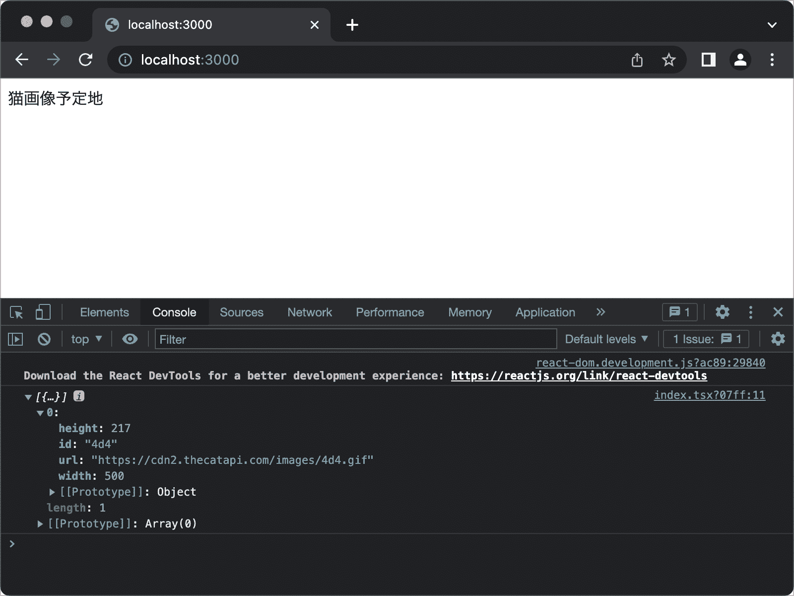
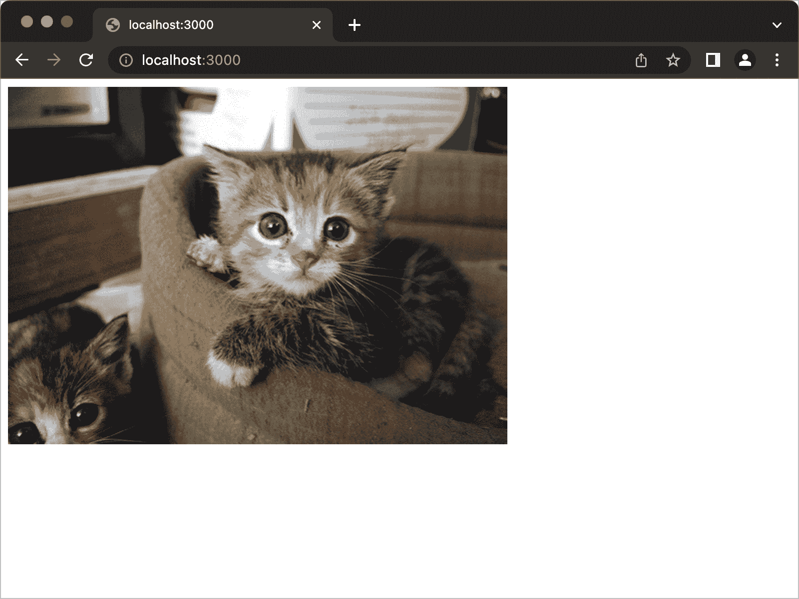

# 使用 Next.js 创建猫图片生成器

> 原文：[`typescriptbook.jp/tutorials/nextjs`](https://typescriptbook.jp/tutorials/nextjs)

## Next.js 概述​

[Next.js](https://nextjs.org/)是基于开源 UI 库 React 的前端框架。

在 React 开发中，通常会使用类似 webpack 的打包工具。编写 webpack 配置文件需要一定的知识。特别是，代码分割和 CSS 模块的配置可能很复杂，维护配置文件可能会很困难。Next.js 已经预先配置了 webpack，使得可以立即开始开发。

Next.js 内置了路由时的预取和图像优化等性能优化功能，使得可以轻松构建高性能的应用程序。它还提供了页面级的服务器端渲染(SSR)和静态站点生成(SSG)功能，可以根据需要灵活选择架构。

Next.js 由 Vercel 公司开发。该公司提供名为[Vercel](https://vercel.com/)的托管服务，因此使用 Next.js 构建的应用程序可以轻松发布。

## 即将创建的内容​

本教程的主题是“猫图片生成器”。当您点击按钮时，它会从猫图片的 API 获取图片 URL，并显示随机可爱的猫图片，这是一个简单的 Web 应用程序。

</tutorials/nextjs/demo.mp4>

最终成果物可在[演示站点](https://random-cat.typescriptbook.jp/)上查看。在开始教程之前，通过提前尝试，可以更容易地理解每个步骤的实现。此外，完成形的源代码可在[GitHub](https://github.com/yytypescript/random-cat)上查看。

## 本教程所需的内容​

本教程所需的内容如下。

+   Node.js v16 或更高版本

+   Yarn v1 系列（本教程已在 v1.22.19 上进行了测试）

+   浏览器（本教程假定使用 Google Chrome）

有关 Node.js 的安装，请参阅设置开发环境。

使用 Yarn 作为包管理工具。首先安装它。如果您已经安装了，请跳过这一步。

```
shell`npm install -g yarn`
```

```
shell`npm install -g yarn`
```

## 设置 Next.js​

首先使用`yarn create next-app`命令创建项目。为了创建基于 TypeScript 的项目，请指定 `--example with-typescript`。`random-cat`是仓库名称的一部分。您可以使用任何名称，但在本教程中将继续使用`random-cat`。

```
sh`yarn create next-app --example with-typescript random-cat`
```

```
sh`yarn create next-app --example with-typescript random-cat`
```

运行此命令后，将创建`random-cat`目录，请转到该目录。

```
sh`cd random-cat`
```

```
sh`cd random-cat`
```

请确认项目文件结构如下。

```
text`.├── components ---- ディレクトリ├── interfaces ---- ディレクトリ├── node_modules -- ディレクトリ├── pages --------- ディレクトリ├── utils --------- ディレクトリ├── README.md├── next-env.d.ts├── package.json├── tsconfig.json└── yarn.lock`
```

```
text`.├── components ---- ディレクトリ├── interfaces ---- ディレクトリ├── node_modules -- ディレクトリ├── pages --------- ディレクトリ├── utils --------- ディレクトリ├── README.md├── next-env.d.ts├── package.json├── tsconfig.json└── yarn.lock`
```

## 启动开发服务器​

运行以下命令启动开发服务器。

```
sh`yarn dev`
```

```
sh`yarn dev`
```

当开发服务器启动后，请在浏览器中访问终端中显示的 URL。

## 删除不必要的文件​

在继续教程之前，删除不需要的文件。将项目保持简单，以便更轻松地进行工作。

```
sh`rm -rf pages utils interfaces components`
```

```
sh`rm -rf pages utils interfaces components`
```

## 创建页面组件目录​

在 Next.js 中，`pages`目录下的目录结构对应页面的路由。例如，创建`pages/users.tsx`文件，当访问`/users`时，将执行该文件。对于`pages/index.tsx`，当访问`/`时将执行该文件。

在`pages`目录中放置的组件在 Next.js 术语中称为页面组件(page component)。

运行以下命令创建用于放置页面组件的目录。

```
sh`mkdir pages`
```

```
sh`mkdir pages`
```

## 创建首页页面组件​

运行以下命令创建首页页面组件。

```
sh`touch pages/index.tsx`
```

```
sh`touch pages/index.tsx`
```

页面组件的内容如下。`IndexPage`函数是页面组件。这只是一个简单的显示“猫图片占位符”的组件。

```
pages/index.tsxtsx`import { <data-lsp lsp="(alias) type NextPage<P = {}, IP = P> = React.ComponentType<P> &amp; {
    getInitialProps?(context: NextPageContext): IP | Promise<IP>;
}
import NextPage">NextPage</data-lsp> } from  "next";const  <data-lsp lsp="const IndexPage: NextPage">IndexPage</data-lsp>:  <data-lsp lsp="(alias) type NextPage<P = {}, IP = P> = React.ComponentType<P> &amp; {
    getInitialProps?(context: NextPageContext): IP | Promise<IP>;
}
import NextPage">NextPage</data-lsp>  = () => {  return <<data-lsp lsp="(property) JSX.IntrinsicElements.div: React.DetailedHTMLProps<React.HTMLAttributes<HTMLDivElement>, HTMLDivElement>">div</data-lsp>>猫画像予定地</<data-lsp lsp="(property) JSX.IntrinsicElements.div: React.DetailedHTMLProps<React.HTMLAttributes<HTMLDivElement>, HTMLDivElement>">div</data-lsp>>;};export  default <data-lsp lsp="const IndexPage: NextPage">IndexPage</data-lsp>;`
```

```
pages/index.tsxtsx`import { <data-lsp lsp="(alias) type NextPage<P = {}, IP = P> = React.ComponentType<P> &amp; {
    getInitialProps?(context: NextPageContext): IP | Promise<IP>;
}
import NextPage">NextPage</data-lsp> } from  "next";const <data-lsp lsp="const IndexPage: NextPage">IndexPage</data-lsp>: <data-lsp lsp="(alias) type NextPage<P = {}, IP = P> = React.ComponentType<P> &amp; {
    getInitialProps?(context: NextPageContext): IP | Promise<IP>;
}
import NextPage">NextPage</data-lsp> = () => {  return <<data-lsp lsp="(property) JSX.IntrinsicElements.div: React.DetailedHTMLProps<React.HTMLAttributes<HTMLDivElement>, HTMLDivElement>">div</data-lsp>>猫画像予定地</<data-lsp lsp="(property) JSX.IntrinsicElements.div: React.DetailedHTMLProps<React.HTMLAttributes<HTMLDivElement>, HTMLDivElement>">div</data-lsp>>;};export  default <data-lsp lsp="const IndexPage: NextPage">IndexPage</data-lsp>;`
```

在 Next.js 中，每个文件对应一个页面组件。Next.js 会读取`pages`目录下的每个`tsx`文件，并将默认导出的函数识别为页面组件。在上面的代码中，将`IndexPage`函数导出为`default`，以便 Next.js 识别为页面组件。`NextPage`是表示页面组件的类型。通过对此类型进行注释，可以检查函数的实现是否符合页面组件的要求。

实现组件后，请重新加载浏览器，确保屏幕上显示“猫图片占位符”。

在 Next.js 中应该使用箭头函数吗？

JavaScriptで関数を作るには、大きく分けてアロー関数と関数宣言を使った方法の2 種類があります。上で書いた`IndexPage`関数はアロー関数です。これを関数宣言に書き換えると次のようになります。

```
tsx`import { <data-lsp lsp="(alias) interface ReactElement<P = any, T extends string | React.JSXElementConstructor<any> = string | React.JSXElementConstructor<any>>
import ReactElement">ReactElement</data-lsp> } from  "react";export  default  function  <data-lsp lsp="function IndexPage(): ReactElement<any, any> | null">IndexPage</data-lsp>():  <data-lsp lsp="(alias) interface ReactElement<P = any, T extends string | React.JSXElementConstructor<any> = string | React.JSXElementConstructor<any>>
import ReactElement">ReactElement</data-lsp><any,  any> |  null {  return <<data-lsp lsp="(property) JSX.IntrinsicElements.div: React.DetailedHTMLProps<React.HTMLAttributes<HTMLDivElement>, HTMLDivElement>">div</data-lsp>>猫画像予定地</<data-lsp lsp="(property) JSX.IntrinsicElements.div: React.DetailedHTMLProps<React.HTMLAttributes<HTMLDivElement>, HTMLDivElement>">div</data-lsp>>;}`
```

```
tsx`import { <data-lsp lsp="(alias) interface ReactElement<P = any, T extends string | React.JSXElementConstructor<any> = string | React.JSXElementConstructor<any>>
import ReactElement">ReactElement</data-lsp> } from  "react";export  default  function <data-lsp lsp="function IndexPage(): ReactElement<any, any> | null">IndexPage</data-lsp>(): <data-lsp lsp="(alias) interface ReactElement<P = any, T extends string | React.JSXElementConstructor<any> = string | React.JSXElementConstructor<any>>
import ReactElement">ReactElement</data-lsp><any,  any> |  null {  return <<data-lsp lsp="(property) JSX.IntrinsicElements.div: React.DetailedHTMLProps<React.HTMLAttributes<HTMLDivElement>, HTMLDivElement>">div</data-lsp>>猫画像予定地</<data-lsp lsp="(property) JSX.IntrinsicElements.div: React.DetailedHTMLProps<React.HTMLAttributes<HTMLDivElement>, HTMLDivElement>">div</data-lsp>>;}`
```

Next.jsでは、アロー関数と関数宣言のどちらで書いても構いません。このチュートリアルでアロー関数を採用しているのは、ページコンポーネントに`NextPage`型の型注釈をつけるのが、アロー関数のほうがやりやすいためです。

## 猫 API

このチュートリアルでは猫の画像をランダムに表示するにあたり[猫 API](https://thecatapi.com/)を利用します。このAPIは特定の条件で猫の画像を取得したり、品種ごとの猫の情報を取得することができます。今回のチュートリアルでは[APIドキュメント](https://docs.thecatapi.com/)のQuickstartに記載されている`/v1/images/search`へリクエストを投げてランダムな猫の画像を取得します。

試しにブラウザで[`api.thecatapi.com/v1/images/search`](https://api.thecatapi.com/v1/images/search)へアクセスしてみてください。ランダムな結果が返ってくるので値は少し違いますが、次のような構造のデータがレスポンスとして取得できます。レスポンスのデータ構造が配列になっている点に注意してください。

```
The Cat APIのレスポンスのサンプルjson`[ {  "id":  "co9",  "url":  "https://cdn2.thecatapi.com/images/co9.jpg",  "width":  900,  "height":  600 }]`
```

```
The Cat APIのレスポンスのサンプルjson`[ {  "id":  "co9",  "url":  "https://cdn2.thecatapi.com/images/co9.jpg",  "width":  900,  "height":  600 }]`
```

レスポンスにある`url`が猫画像のURLです。この値を取得して猫の画像をランダムに表示します。

## 画像を取得する関数を実装する​

このステップでは、猫 APIにリクエストし猫画像を取得する関数を実装します。次の実装をした`fetchImage`関数を`export default IndexPage`の後ろに追加してください。

```
ts`const  <data-lsp lsp="const fetchImage: () => Promise<any>">fetchImage</data-lsp>  =  async () => {  const  <data-lsp lsp="const res: Response">res</data-lsp>  =  await  <data-lsp lsp="function fetch(input: RequestInfo | URL, init?: RequestInit | undefined): Promise<Response>">fetch</data-lsp>("https://api.thecatapi.com/v1/images/search");  const  <data-lsp lsp="const images: any">images</data-lsp>  =  await  <data-lsp lsp="const res: Response">res</data-lsp>.<data-lsp lsp="(method) Body.json(): Promise<any>">json</data-lsp>();  <data-lsp lsp="namespace console
var console: Console">console</data-lsp>.<data-lsp lsp="(method) Console.log(message?: any, ...optionalParams: any[]): void (+1 overload)">log</data-lsp>(<data-lsp lsp="const images: any">images</data-lsp>);  return <data-lsp lsp="const images: any">images</data-lsp>[0];};`
```

```
ts`const <data-lsp lsp="const fetchImage: () => Promise<any>">fetchImage</data-lsp> =  async () => {  const  <data-lsp lsp="const res: Response">res</data-lsp>  =  await <data-lsp lsp="function fetch(input: RequestInfo | URL, init?: RequestInit | undefined): Promise<Response>">fetch</data-lsp>("https://api.thecatapi.com/v1/images/search");  const  <data-lsp lsp="const images: any">images</data-lsp>  =  await  <data-lsp lsp="const res: Response">res</data-lsp>.<data-lsp lsp="(method) Body.json(): Promise<any>">json</data-lsp>();  <data-lsp lsp="namespace console
var console: Console">console</data-lsp>.<data-lsp lsp="(method) Console.log(message?: any, ...optionalParams: any[]): void (+1 overload)">log</data-lsp>(<data-lsp lsp="const images: any">images</data-lsp>);  return <data-lsp lsp="const images: any">images</data-lsp>[0];};`
```

`fetch`はHTTPリクエストでリソースを取得するブラウザ標準のAPIです。戻り値として[Response](https://developer.mozilla.org/ja/docs/Web/API/Response)オブジェクトを返します。Responseオブジェクトの`json()`メソッドを実行することで、レスポンスのボディーをJSONとしてパースし、JavaScriptのオブジェクトとして取得できます。

`fetchImage`関数についている`async`キーワードは、この関数が非同期処理を行うことを示すものです。`fetch`と`res.json`は非同期関数で、これらの処理を待つために、それぞれに`await`キーワードがついています。

`fetchImage`関数がAPIを呼び出せているかテストするために、これを呼び出す処理を`fetchImage`関数の後ろに追加してください。

```
pages/index.tsxtsx`import { <data-lsp lsp="(alias) type NextPage<P = {}, IP = P> = React.ComponentType<P> &amp; {
    getInitialProps?(context: NextPageContext): IP | Promise<IP>;
}
import NextPage">NextPage</data-lsp> } from  "next";const  <data-lsp lsp="const IndexPage: NextPage">IndexPage</data-lsp>:  <data-lsp lsp="(alias) type NextPage<P = {}, IP = P> = React.ComponentType<P> &amp; {
    getInitialProps?(context: NextPageContext): IP | Promise<IP>;
}
import NextPage">NextPage</data-lsp>  = () => {  return <<data-lsp lsp="(property) JSX.IntrinsicElements.div: React.DetailedHTMLProps<React.HTMLAttributes<HTMLDivElement>, HTMLDivElement>">div</data-lsp>>猫画像予定地</<data-lsp lsp="(property) JSX.IntrinsicElements.div: React.DetailedHTMLProps<React.HTMLAttributes<HTMLDivElement>, HTMLDivElement>">div</data-lsp>>;};export  default <data-lsp lsp="const IndexPage: NextPage">IndexPage</data-lsp>;const  <data-lsp lsp="const fetchImage: () => Promise<any>">fetchImage</data-lsp>  =  async () => {  const  <data-lsp lsp="const res: Response">res</data-lsp>  =  await  <data-lsp lsp="function fetch(input: RequestInfo | URL, init?: RequestInit | undefined): Promise<Response>">fetch</data-lsp>("https://api.thecatapi.com/v1/images/search");  const  <data-lsp lsp="const images: any">images</data-lsp>  =  await  <data-lsp lsp="const res: Response">res</data-lsp>.<data-lsp lsp="(method) Body.json(): Promise<any>">json</data-lsp>();  <data-lsp lsp="namespace console
var console: Console">console</data-lsp>.<data-lsp lsp="(method) Console.log(message?: any, ...optionalParams: any[]): void (+1 overload)">log</data-lsp>(<data-lsp lsp="const images: any">images</data-lsp>);  return <data-lsp lsp="const images: any">images</data-lsp>[0];};<data-lsp lsp="const fetchImage: () => Promise<any>">fetchImage</data-lsp>(); // 追加`
```

```
pages/index.tsxtsx`import { <data-lsp lsp="(alias) type NextPage<P = {}, IP = P> = React.ComponentType<P> &amp; {
    getInitialProps?(context: NextPageContext): IP | Promise<IP>;
}
import NextPage">NextPage</data-lsp> } from  "next";const <data-lsp lsp="const IndexPage: NextPage">IndexPage</data-lsp>: <data-lsp lsp="(alias) type NextPage<P = {}, IP = P> = React.ComponentType<P> &amp; {
    getInitialProps?(context: NextPageContext): IP | Promise<IP>;
}
import NextPage">NextPage</data-lsp> = () => {  return <<data-lsp lsp="(property) JSX.IntrinsicElements.div: React.DetailedHTMLProps<React.HTMLAttributes<HTMLDivElement>, HTMLDivElement>">div</data-lsp>>猫画像予定地</<data-lsp lsp="(property) JSX.IntrinsicElements.div: React.DetailedHTMLProps<React.HTMLAttributes<HTMLDivElement>, HTMLDivElement>">div</data-lsp>>;};export  default <data-lsp lsp="const IndexPage: NextPage">IndexPage</data-lsp>;const <data-lsp lsp="const fetchImage: () => Promise<any>">fetchImage</data-lsp> =  async () => {  const  <data-lsp lsp="const res: Response">res</data-lsp>  =  await <data-lsp lsp="function fetch(input: RequestInfo | URL, init?: RequestInit | undefined): Promise<Response>">fetch</data-lsp>("https://api.thecatapi.com/v1/images/search");  const  <data-lsp lsp="const images: any">images</data-lsp>  =  await  <data-lsp lsp="const res: Response">res</data-lsp>.<data-lsp lsp="(method) Body.json(): Promise<any>">json</data-lsp>();  <data-lsp lsp="namespace console
var console: Console">console</data-lsp>.<data-lsp lsp="(method) Console.log(message?: any, ...optionalParams: any[]): void (+1 overload)">log</data-lsp>(<data-lsp lsp="const images: any">images</data-lsp>);  return <data-lsp lsp="const images: any">images</data-lsp>[0];};<data-lsp lsp="const fetchImage: () => Promise<any>">fetchImage</data-lsp>(); // 追加`
```

Chromeの開発者ツールを開いてからページをリロードしてください。「コンソール」タブで次のようなテキストが表示されていたら成功です。



`fetchImage`関数の動作確認が済んだら、この関数の呼び出しは不要になるので消してください。

## 関数の戻り値に型をつける​

上で作った`fetchImage`関数の戻り値の型は`any`型です。そのため、呼び出し側で存在しないプロパティを参照しても気づけずにバグが発生する危険性があります。

```
ts`const  <data-lsp lsp="const fetchImage: () => Promise<any>" style="border-bottom:solid 2px lightgrey">fetchImage</data-lsp>  =  async () => {` `const fetchImage: () => Promise<any>  const  <data-lsp lsp="const res: Response">res</data-lsp>  =  await  <data-lsp lsp="function fetch(input: RequestInfo | URL, init?: RequestInit | undefined): Promise<Response>">fetch</data-lsp>("https://api.thecatapi.com/v1/images/search");  const  <data-lsp lsp="const images: any">images</data-lsp>  =  await  <data-lsp lsp="const res: Response">res</data-lsp>.<data-lsp lsp="(method) Body.json(): Promise<any>">json</data-lsp>();  <data-lsp lsp="namespace console
var console: Console">console</data-lsp>.<data-lsp lsp="(method) Console.log(message?: any, ...optionalParams: any[]): void (+1 overload)">log</data-lsp>(<data-lsp lsp="const images: any">images</data-lsp>);  return <data-lsp lsp="const images: any">images</data-lsp>[0];};<data-lsp lsp="const fetchImage: () => Promise<any>">fetchImage</data-lsp>().<data-lsp lsp="(method) Promise<any>.then<void, never>(onfulfilled?: ((value: any) => void | PromiseLike<void>) | null | undefined, onrejected?: ((reason: any) => PromiseLike<never>) | null | undefined): Promise<...>">then</data-lsp>((<data-lsp lsp="(parameter) image: any" style="border-bottom:solid 2px lightgrey">image</data-lsp>) => {` `(parameter) image: any  <data-lsp lsp="namespace console
var console: Console">console</data-lsp>.<data-lsp lsp="(method) Console.log(message?: any, ...optionalParams: any[]): void (+1 overload)">log</data-lsp>(<data-lsp lsp="(parameter) image: any">image</data-lsp>.<data-lsp lsp="any">alt</data-lsp>); // 存在しないプロパティを参照している});`

```

ts`const <data-lsp lsp="const fetchImage: () => Promise<any>" style="border-bottom:solid 2px lightgrey">fetchImage</data-lsp> =  async () => {` `const fetchImage: () => Promise<any>  const  <data-lsp lsp="const res: Response">res</data-lsp>  =  await <data-lsp lsp="function fetch(input: RequestInfo | URL, init?: RequestInit | undefined): Promise<Response>">fetch</data-lsp>("https://api.thecatapi.com/v1/images/search");  const  <data-lsp lsp="const images: any">images</data-lsp>  =  await  <data-lsp lsp="const res: Response">res</data-lsp>.<data-lsp lsp="(method) Body.json(): Promise<any>">json</data-lsp>();  <data-lsp lsp="namespace console

var console: Console">console</data-lsp>.<data-lsp lsp="(method) Console.log(message?: any, ...optionalParams: any[]): void (+1 overload)">log</data-lsp>(<data-lsp lsp="const images: any">images</data-lsp>);  return <data-lsp lsp="const images: any">images</data-lsp>[0];};<data-lsp lsp="const fetchImage: () => Promise<any>">fetchImage</data-lsp>().<data-lsp lsp="(method) Promise<any>.then<void, never>(onfulfilled?: ((value: any) => void | PromiseLike<void>) | null | undefined, onrejected?: ((reason: any) => PromiseLike<never>) | null | undefined): Promise<...>">then</data-lsp>((<data-lsp lsp="(parameter) image: any" style="border-bottom:solid 2px lightgrey">image</data-lsp>) => {` `(parameter) image: any  <data-lsp lsp="namespace console

var console: Console">console</data-lsp>.<data-lsp lsp="(method) Console.log(message?: any, ...optionalParams: any[]): void (+1 overload)">log</data-lsp>(<data-lsp lsp="(parameter) image: any">image</data-lsp>.<data-lsp lsp="any">alt</data-lsp>); // 存在しないプロパティを参照している});`

`image`并没有`alt`属性，但由于`image`是`any`类型，因此即使编写类似上面错误的代码，也不会在编译时发现错误。

处理 API 响应是前端中容易混入错误的地方，通过指定类型可以安全地处理 API 响应。

将包含在响应中的图像信息定义为`Image`类型。然后，将`fetchImage`函数的返回值注释为`Promise<Image>`。

```
ts`type  <data-lsp lsp="type Image = {
    url: string;
}">Image</data-lsp>  = { <data-lsp lsp="(property) url: string">url</data-lsp>:  string;};const  <data-lsp lsp="const fetchImage: () => Promise<Image>">fetchImage</data-lsp>  =  async ():  <data-lsp lsp="interface Promise<T>">Promise</data-lsp><<data-lsp lsp="type Image = {
    url: string;
}">Image</data-lsp>> => {  //                       ^^^^^^^^^^^^^^^^型注釈  const  <data-lsp lsp="const res: Response">res</data-lsp>  =  await  <data-lsp lsp="function fetch(input: RequestInfo | URL, init?: RequestInit | undefined): Promise<Response>">fetch</data-lsp>("https://api.thecatapi.com/v1/images/search");  const  <data-lsp lsp="const images: any">images</data-lsp>  =  await  <data-lsp lsp="const res: Response">res</data-lsp>.<data-lsp lsp="(method) Body.json(): Promise<any>">json</data-lsp>();  <data-lsp lsp="namespace console
var console: Console">console</data-lsp>.<data-lsp lsp="(method) Console.log(message?: any, ...optionalParams: any[]): void (+1 overload)">log</data-lsp>(<data-lsp lsp="const images: any">images</data-lsp>);  return <data-lsp lsp="const images: any">images</data-lsp>[0];};`
```

```
ts`type <data-lsp lsp="type Image = {
    url: string;
}">Image</data-lsp> = { <data-lsp lsp="(property) url: string">url</data-lsp>:  string;};const <data-lsp lsp="const fetchImage: () => Promise<Image>">fetchImage</data-lsp> =  async (): <data-lsp lsp="interface Promise<T>">Promise</data-lsp><<data-lsp lsp="type Image = {
    url: string;
}">Image</data-lsp>> => {  //                       ^^^^^^^^^^^^^^^^型注釈  const  <data-lsp lsp="const res: Response">res</data-lsp>  =  await <data-lsp lsp="function fetch(input: RequestInfo | URL, init?: RequestInit | undefined): Promise<Response>">fetch</data-lsp>("https://api.thecatapi.com/v1/images/search");  const  <data-lsp lsp="const images: any">images</data-lsp>  =  await  <data-lsp lsp="const res: Response">res</data-lsp>.<data-lsp lsp="(method) Body.json(): Promise<any>">json</data-lsp>();  <data-lsp lsp="namespace console
var console: Console">console</data-lsp>.<data-lsp lsp="(method) Console.log(message?: any, ...optionalParams: any[]): void (+1 overload)">log</data-lsp>(<data-lsp lsp="const images: any">images</data-lsp>);  return <data-lsp lsp="const images: any">images</data-lsp>[0];};`
```

API 响应中除了`url`之外还包含其他属性，但在这个应用程序中只需要`url`这些信息，所以省略了其他属性的定义。如果将来需要其他属性，只需在`Image`中添加属性定义即可。

如果`fetchImage`函数的返回值正确地注释了类型，即使不小心编写了引用 API 响应中不存在的属性的代码，也会通过编译错误发现问题。

```
ts`<data-lsp lsp="const fetchImage: () => Promise<Image>">fetchImage</data-lsp>().<data-lsp lsp="(method) Promise<Image>.then<void, never>(onfulfilled?: ((value: Image) => void | PromiseLike<void>) | null | undefined, onrejected?: ((reason: any) => PromiseLike<never>) | null | undefined): Promise<...>">then</data-lsp>((<data-lsp lsp="(parameter) image: Image" style="border-bottom:solid 2px lightgrey">image</data-lsp>) => {` `(parameter) image: Image  <data-lsp lsp="namespace console
var console: Console">console</data-lsp>.<data-lsp lsp="(method) Console.log(message?: any, ...optionalParams: any[]): void (+1 overload)">log</data-lsp>(<data-lsp lsp="(parameter) image: Image">image</data-lsp>.<data-err><data-lsp lsp="any">alt</data-lsp></data-err>); // 存在しないプロパティを参照しているProperty 'alt' does not exist on type 'Image'.2339Property 'alt' does not exist on type 'Image'.});`

```

ts`<data-lsp lsp="const fetchImage: () => Promise<Image>">fetchImage</data-lsp>().<data-lsp lsp="(method) Promise<Image>.then<void, never>(onfulfilled?: ((value: Image) => void | PromiseLike<void>) | null | undefined, onrejected?: ((reason: any) => PromiseLike<never>) | null | undefined): Promise<...>">then</data-lsp>((<data-lsp lsp="(parameter) image: Image" style="border-bottom:solid 2px lightgrey">image</data-lsp>) => {` `(parameter) image: Image  <data-lsp lsp="namespace console

var console: Console">console</data-lsp>.<data-lsp lsp="(method) Console.log(message?: any, ...optionalParams: any[]): void (+1 overload)">log</data-lsp>(<data-lsp lsp="(parameter) image: Image">image</data-lsp>.<data-err><data-lsp lsp="any">alt</data-lsp></data-err>); // 存在しないプロパティを参照しているProperty 'alt' does not exist on type 'Image'.2339Property 'alt' does not exist on type 'Image'.});`严格的响应检查

上面的代码是对服务器端百分之百信任的代码。这是基于服务器端一定会返回客户端期望的数据结构。但是，服务器端真的会返回期望的数据结构吗？

更加防御性的做法是在客户端检查服务器响应。作为检查的一个示例，可以考虑以下实现。

```
ts`const  <data-lsp lsp="const fetchImage: () => Promise<Image>">fetchImage</data-lsp>  =  async ():  <data-lsp lsp="interface Promise<T>">Promise</data-lsp><<data-lsp lsp="type Image = {
    url: string;
}">Image</data-lsp>> => {  const  <data-lsp lsp="const res: Response">res</data-lsp>  =  await  <data-lsp lsp="function fetch(input: RequestInfo | URL, init?: RequestInit | undefined): Promise<Response>">fetch</data-lsp>("https://api.thecatapi.com/v1/images/search");  const  <data-lsp lsp="const images: unknown">images</data-lsp>:  unknown  =  await  <data-lsp lsp="const res: Response">res</data-lsp>.<data-lsp lsp="(method) Body.json(): Promise<any>">json</data-lsp>();  // 配列として表現されているか？  if (!<data-lsp lsp="var Array: ArrayConstructor">Array</data-lsp>.<data-lsp lsp="(method) ArrayConstructor.isArray(arg: any): arg is any[]">isArray</data-lsp>(<data-lsp lsp="const images: unknown">images</data-lsp>)) {  throw  new  <data-lsp lsp="var Error: ErrorConstructor
new (message?: string | undefined) => Error">Error</data-lsp>("猫の画像が取得できませんでした"); }  const  <data-lsp lsp="const image: unknown">image</data-lsp>:  unknown  = <data-lsp lsp="const images: any[]">images</data-lsp>[0];  // Imageの構造をなしているか？  if (!<data-lsp lsp="const isImage: (value: unknown) => value is Image">isImage</data-lsp>(<data-lsp lsp="const image: unknown">image</data-lsp>)) {  throw  new  <data-lsp lsp="var Error: ErrorConstructor
new (message?: string | undefined) => Error">Error</data-lsp>("猫の画像が取得できませんでした"); }  return <data-lsp lsp="const image: Image">image</data-lsp>;};// 型ガード関数 const  <data-lsp lsp="const isImage: (value: unknown) => value is Image">isImage</data-lsp>  = (<data-lsp lsp="(parameter) value: unknown">value</data-lsp>:  unknown): <data-lsp lsp="(parameter) value: unknown">value</data-lsp> is  <data-lsp lsp="type Image = {
    url: string;
}">Image</data-lsp>  => {  // 値がオブジェクトなのか？  if (!<data-lsp lsp="(parameter) value: unknown">value</data-lsp> ||  typeof <data-lsp lsp="(parameter) value: {}">value</data-lsp> !==  "object") {  return  false; }  // urlプロパティが存在し、かつ、それが文字列なのか？  return  "url"  in <data-lsp lsp="(parameter) value: object">value</data-lsp> &&  typeof  <data-lsp lsp="(parameter) value: object &amp; Record<&quot;url&quot;, unknown>">value</data-lsp>.<data-lsp lsp="(property) url: unknown">url</data-lsp> ===  "string";};`
```

```
ts`const <data-lsp lsp="const fetchImage: () => Promise<Image>">fetchImage</data-lsp> =  async (): <data-lsp lsp="interface Promise<T>">Promise</data-lsp><<data-lsp lsp="type Image = {
    url: string;
}">Image</data-lsp>> => {  const  <data-lsp lsp="const res: Response">res</data-lsp>  =  await <data-lsp lsp="function fetch(input: RequestInfo | URL, init?: RequestInit | undefined): Promise<Response>">fetch</data-lsp>("https://api.thecatapi.com/v1/images/search");  const  <data-lsp lsp="const images: unknown">images</data-lsp>:  unknown  =  await  <data-lsp lsp="const res: Response">res</data-lsp>.<data-lsp lsp="(method) Body.json(): Promise<any>">json</data-lsp>();  // 配列として表現されているか？  if (!<data-lsp lsp="var Array: ArrayConstructor">Array</data-lsp>.<data-lsp lsp="(method) ArrayConstructor.isArray(arg: any): arg is any[]">isArray</data-lsp>(<data-lsp lsp="const images: unknown">images</data-lsp>)) {  throw  new  <data-lsp lsp="var Error: ErrorConstructor
new (message?: string | undefined) => Error">Error</data-lsp>("猫の画像が取得できませんでした"); }  const  <data-lsp lsp="const image: unknown">image</data-lsp>:  unknown  = <data-lsp lsp="const images: any[]">images</data-lsp>[0];  // Imageの構造をなしているか？  if (!<data-lsp lsp="const isImage: (value: unknown) => value is Image">isImage</data-lsp>(<data-lsp lsp="const image: unknown">image</data-lsp>)) {  throw  new  <data-lsp lsp="var Error: ErrorConstructor
new (message?: string | undefined) => Error">Error</data-lsp>("猫の画像が取得できませんでした"); }  return <data-lsp lsp="const image: Image">image</data-lsp>;};// 型ガード関数 const <data-lsp lsp="const isImage: (value: unknown) => value is Image">isImage</data-lsp> = (<data-lsp lsp="(parameter) value: unknown">value</data-lsp>:  unknown): <data-lsp lsp="(parameter) value: unknown">value</data-lsp> is <data-lsp lsp="type Image = {
    url: string;
}">Image</data-lsp> => {  // 値がオブジェクトなのか？  if (!<data-lsp lsp="(parameter) value: unknown">value</data-lsp> ||  typeof <data-lsp lsp="(parameter) value: {}">value</data-lsp> !==  "object") {  return  false; }  // urlプロパティが存在し、かつ、それが文字列なのか？  return  "url"  in <data-lsp lsp="(parameter) value: object">value</data-lsp> &&  typeof  <data-lsp lsp="(parameter) value: object &amp; Record<&quot;url&quot;, unknown>">value</data-lsp>.<data-lsp lsp="(property) url: unknown">url</data-lsp> ===  "string";};`
```

在这个检查过程中，使用了 TypeScript 的技巧，如安全地对未知值进行类型化 unknown type 和在检查值类型的同时进行类型化的类型守卫函数。虽然在这里不需要理解这些，但如果感兴趣，可以在完成教程后查看解释。

在本教程中，我们更注重简单性而不是严谨性，因此不会故意添加上述检查处理。

## 当页面加载时显示图片​

我们在页面显示时调用`fetchImage`，以显示猫的图片。请修改`IndexPage`函数如下。

```
pages/index.tsxtsx`import { <data-lsp lsp="(alias) type NextPage<P = {}, IP = P> = React.ComponentType<P> &amp; {
    getInitialProps?(context: NextPageContext): IP | Promise<IP>;
}
import NextPage">NextPage</data-lsp> } from  "next";import { <data-lsp lsp="(alias) function useEffect(effect: EffectCallback, deps?: DependencyList): void
import useEffect">useEffect</data-lsp>, <data-lsp lsp="(alias) function useState<S>(initialState: S | (() => S)): [S, Dispatch<SetStateAction<S>>] (+1 overload)
import useState">useState</data-lsp> } from  "react";const  <data-lsp lsp="const IndexPage: NextPage">IndexPage</data-lsp>:  <data-lsp lsp="(alias) type NextPage<P = {}, IP = P> = React.ComponentType<P> &amp; {
    getInitialProps?(context: NextPageContext): IP | Promise<IP>;
}
import NextPage">NextPage</data-lsp>  = () => {  // ❶ useStateを使って状態を定義する  const [<data-lsp lsp="const imageUrl: string">imageUrl</data-lsp>,  <data-lsp lsp="const setImageUrl: React.Dispatch<React.SetStateAction<string>>">setImageUrl</data-lsp>] =  <data-lsp lsp="(alias) useState<string>(initialState: string | (() => string)): [string, React.Dispatch<React.SetStateAction<string>>] (+1 overload)
import useState">useState</data-lsp>("");  const [<data-lsp lsp="const loading: boolean">loading</data-lsp>,  <data-lsp lsp="const setLoading: React.Dispatch<React.SetStateAction<boolean>>">setLoading</data-lsp>] =  <data-lsp lsp="(alias) useState<boolean>(initialState: boolean | (() => boolean)): [boolean, React.Dispatch<React.SetStateAction<boolean>>] (+1 overload)
import useState">useState</data-lsp>(true);  // ❷ マウント時に画像を読み込む宣言  <data-lsp lsp="(alias) useEffect(effect: React.EffectCallback, deps?: React.DependencyList | undefined): void
import useEffect">useEffect</data-lsp>(() => {  <data-lsp lsp="const fetchImage: () => Promise<Image>">fetchImage</data-lsp>().<data-lsp lsp="(method) Promise<Image>.then<void, never>(onfulfilled?: ((value: Image) => void | PromiseLike<void>) | null | undefined, onrejected?: ((reason: any) => PromiseLike<never>) | null | undefined): Promise<...>">then</data-lsp>((<data-lsp lsp="(parameter) newImage: Image">newImage</data-lsp>) => {  <data-lsp lsp="const setImageUrl: (value: React.SetStateAction<string>) => void">setImageUrl</data-lsp>(<data-lsp lsp="(parameter) newImage: Image">newImage</data-lsp>.<data-lsp lsp="(property) url: string">url</data-lsp>); // 画像 URLの状態を更新する  <data-lsp lsp="const setLoading: (value: React.SetStateAction<boolean>) => void">setLoading</data-lsp>(false); // ローディング状態を更新する }); }, []);  // ❸ ローディング中でなければ、画像を表示する  return <<data-lsp lsp="(property) JSX.IntrinsicElements.div: React.DetailedHTMLProps<React.HTMLAttributes<HTMLDivElement>, HTMLDivElement>">div</data-lsp>>{<data-lsp lsp="const loading: boolean">loading</data-lsp> || <<data-lsp lsp="(property) JSX.IntrinsicElements.img: React.DetailedHTMLProps<React.ImgHTMLAttributes<HTMLImageElement>, HTMLImageElement>">img</data-lsp>  <data-lsp lsp="(property) ImgHTMLAttributes<HTMLImageElement>.src?: string | undefined">src</data-lsp>={<data-lsp lsp="const imageUrl: string">imageUrl</data-lsp>} />}</<data-lsp lsp="(property) JSX.IntrinsicElements.div: React.DetailedHTMLProps<React.HTMLAttributes<HTMLDivElement>, HTMLDivElement>">div</data-lsp>>;};export  default <data-lsp lsp="const IndexPage: NextPage">IndexPage</data-lsp>;type  <data-lsp lsp="type Image = {
    url: string;
}">Image</data-lsp>  = { <data-lsp lsp="(property) url: string">url</data-lsp>:  string;};const  <data-lsp lsp="const fetchImage: () => Promise<Image>">fetchImage</data-lsp>  =  async ():  <data-lsp lsp="interface Promise<T>">Promise</data-lsp><<data-lsp lsp="type Image = {
    url: string;
}">Image</data-lsp>> => {  const  <data-lsp lsp="const res: Response">res</data-lsp>  =  await  <data-lsp lsp="function fetch(input: RequestInfo | URL, init?: RequestInit | undefined): Promise<Response>">fetch</data-lsp>("https://api.thecatapi.com/v1/images/search");  const  <data-lsp lsp="const images: any">images</data-lsp>  =  await  <data-lsp lsp="const res: Response">res</data-lsp>.<data-lsp lsp="(method) Body.json(): Promise<any>">json</data-lsp>();  <data-lsp lsp="namespace console
var console: Console">console</data-lsp>.<data-lsp lsp="(method) Console.log(message?: any, ...optionalParams: any[]): void (+1 overload)">log</data-lsp>(<data-lsp lsp="const images: any">images</data-lsp>);  return <data-lsp lsp="const images: any">images</data-lsp>[0];};`
```

```
pages/index.tsxtsx`import { <data-lsp lsp="(alias) type NextPage<P = {}, IP = P> = React.ComponentType<P> &amp; {
    getInitialProps?(context: NextPageContext): IP | Promise<IP>;
}
import NextPage">NextPage</data-lsp> } from  "next";import { <data-lsp lsp="(alias) function useEffect(effect: EffectCallback, deps?: DependencyList): void
import useEffect">useEffect</data-lsp>, <data-lsp lsp="(alias) function useState<S>(initialState: S | (() => S)): [S, Dispatch<SetStateAction<S>>] (+1 overload)
import useState">useState</data-lsp> } from  "react";const <data-lsp lsp="const IndexPage: NextPage">IndexPage</data-lsp>: <data-lsp lsp="(alias) type NextPage<P = {}, IP = P> = React.ComponentType<P> &amp; {
    getInitialProps?(context: NextPageContext): IP | Promise<IP>;
}
import NextPage">NextPage</data-lsp> = () => {  // ❶ useStateを使って状態を定義する  const [<data-lsp lsp="const imageUrl: string">imageUrl</data-lsp>,  <data-lsp lsp="const setImageUrl: React.Dispatch<React.SetStateAction<string>>">setImageUrl</data-lsp>] = <data-lsp lsp="(alias) useState<string>(initialState: string | (() => string)): [string, React.Dispatch<React.SetStateAction<string>>] (+1 overload)
import useState">useState</data-lsp>("");  const [<data-lsp lsp="const loading: boolean">loading</data-lsp>,  <data-lsp lsp="const setLoading: React.Dispatch<React.SetStateAction<boolean>>">setLoading</data-lsp>] = <data-lsp lsp="(alias) useState<boolean>(initialState: boolean | (() => boolean)): [boolean, React.Dispatch<React.SetStateAction<boolean>>] (+1 overload)
import useState">useState</data-lsp>(true);  // ❷ マウント時に画像を読み込む宣言 <data-lsp lsp="(alias) useEffect(effect: React.EffectCallback, deps?: React.DependencyList | undefined): void
import useEffect">useEffect</data-lsp>(() => { <data-lsp lsp="const fetchImage: () => Promise<Image>">fetchImage</data-lsp>().<data-lsp lsp="(method) Promise<Image>.then<void, never>(onfulfilled?: ((value: Image) => void | PromiseLike<void>) | null | undefined, onrejected?: ((reason: any) => PromiseLike<never>) | null | undefined): Promise<...>">then</data-lsp>((<data-lsp lsp="(parameter) newImage: Image">newImage</data-lsp>) => { <data-lsp lsp="const setImageUrl: (value: React.SetStateAction<string>) => void">setImageUrl</data-lsp>(<data-lsp lsp="(parameter) newImage: Image">newImage</data-lsp>.<data-lsp lsp="(property) url: string">url</data-lsp>); // 画像 URLの状態を更新する <data-lsp lsp="const setLoading: (value: React.SetStateAction<boolean>) => void">setLoading</data-lsp>(false); // ローディング状態を更新する }); }, []);  // ❸ ローディング中でなければ、画像を表示する  return <<data-lsp lsp="(property) JSX.IntrinsicElements.div: React.DetailedHTMLProps<React.HTMLAttributes<HTMLDivElement>, HTMLDivElement>">div</data-lsp>>{<data-lsp lsp="const loading: boolean">loading</data-lsp> || <<data-lsp lsp="(property) JSX.IntrinsicElements.img: React.DetailedHTMLProps<React.ImgHTMLAttributes<HTMLImageElement>, HTMLImageElement>">img</data-lsp> <data-lsp lsp="(property) ImgHTMLAttributes<HTMLImageElement>.src?: string | undefined">src</data-lsp>={<data-lsp lsp="const imageUrl: string">imageUrl</data-lsp>} />}</<data-lsp lsp="(property) JSX.IntrinsicElements.div: React.DetailedHTMLProps<React.HTMLAttributes<HTMLDivElement>, HTMLDivElement>">div</data-lsp>>;};export  default <data-lsp lsp="const IndexPage: NextPage">IndexPage</data-lsp>;type <data-lsp lsp="type Image = {
    url: string;
}">Image</data-lsp> = { <data-lsp lsp="(property) url: string">url</data-lsp>:  string;};const <data-lsp lsp="const fetchImage: () => Promise<Image>">fetchImage</data-lsp> =  async (): <data-lsp lsp="interface Promise<T>">Promise</data-lsp><<data-lsp lsp="type Image = {
    url: string;
}">Image</data-lsp>> => {  const  <data-lsp lsp="const res: Response">res</data-lsp>  =  await <data-lsp lsp="function fetch(input: RequestInfo | URL, init?: RequestInit | undefined): Promise<Response>">fetch</data-lsp>("https://api.thecatapi.com/v1/images/search");  const  <data-lsp lsp="const images: any">images</data-lsp>  =  await  <data-lsp lsp="const res: Response">res</data-lsp>.<data-lsp lsp="(method) Body.json(): Promise<any>">json</data-lsp>();  <data-lsp lsp="namespace console
var console: Console">console</data-lsp>.<data-lsp lsp="(method) Console.log(message?: any, ...optionalParams: any[]): void (+1 overload)">log</data-lsp>(<data-lsp lsp="const images: any">images</data-lsp>);  return <data-lsp lsp="const images: any">images</data-lsp>[0];};`
```

逐个查看变更内容。

❶ 首先，使用 React 的`useState`函数定义`imageUrl`和`loading`两个状态。

```
tsx`const [<data-lsp lsp="const imageUrl: string">imageUrl</data-lsp>,  <data-lsp lsp="const setImageUrl: React.Dispatch<React.SetStateAction<string>>">setImageUrl</data-lsp>] =  <data-lsp lsp="(alias) useState<string>(initialState: string | (() => string)): [string, React.Dispatch<React.SetStateAction<string>>] (+1 overload)
import useState">useState</data-lsp>("");const [<data-lsp lsp="const loading: boolean">loading</data-lsp>,  <data-lsp lsp="const setLoading: React.Dispatch<React.SetStateAction<boolean>>">setLoading</data-lsp>] =  <data-lsp lsp="(alias) useState<boolean>(initialState: boolean | (() => boolean)): [boolean, React.Dispatch<React.SetStateAction<boolean>>] (+1 overload)
import useState">useState</data-lsp>(true);`
```

```
tsx`const [<data-lsp lsp="const imageUrl: string">imageUrl</data-lsp>,  <data-lsp lsp="const setImageUrl: React.Dispatch<React.SetStateAction<string>>">setImageUrl</data-lsp>] = <data-lsp lsp="(alias) useState<string>(initialState: string | (() => string)): [string, React.Dispatch<React.SetStateAction<string>>] (+1 overload)
import useState">useState</data-lsp>("");const [<data-lsp lsp="const loading: boolean">loading</data-lsp>,  <data-lsp lsp="const setLoading: React.Dispatch<React.SetStateAction<boolean>>">setLoading</data-lsp>] = <data-lsp lsp="(alias) useState<boolean>(initialState: boolean | (() => boolean)): [boolean, React.Dispatch<React.SetStateAction<boolean>>] (+1 overload)
import useState">useState</data-lsp>(true);`
```

`imageUrl`是存储图片 URL 的变量。初始值为空字符串。`loading`是用于管理 API 调用状态的变量。初始值为`true`，表示调用中。

❷ 接下来，在组件挂载时定义从 API 获取猫图片信息的处理逻辑。

```
tsx`<data-lsp lsp="(alias) useEffect(effect: React.EffectCallback, deps?: React.DependencyList | undefined): void
import useEffect">useEffect</data-lsp>(() => {  <data-lsp lsp="const fetchImage: () => Promise<Image>">fetchImage</data-lsp>().<data-lsp lsp="(method) Promise<Image>.then<void, never>(onfulfilled?: ((value: Image) => void | PromiseLike<void>) | null | undefined, onrejected?: ((reason: any) => PromiseLike<never>) | null | undefined): Promise<...>">then</data-lsp>((<data-lsp lsp="(parameter) newImage: Image">newImage</data-lsp>) => {  <data-lsp lsp="const setImageUrl: (value: React.SetStateAction<string>) => void">setImageUrl</data-lsp>(<data-lsp lsp="(parameter) newImage: Image">newImage</data-lsp>.<data-lsp lsp="(property) url: string">url</data-lsp>); // 画像 URLの状態を更新する  <data-lsp lsp="const setLoading: (value: React.SetStateAction<boolean>) => void">setLoading</data-lsp>(false); // ローディング状態を更新する });}, []);`
```

```
tsx`<data-lsp lsp="(alias) useEffect(effect: React.EffectCallback, deps?: React.DependencyList | undefined): void
import useEffect">useEffect</data-lsp>(() => { <data-lsp lsp="const fetchImage: () => Promise<Image>">fetchImage</data-lsp>().<data-lsp lsp="(method) Promise<Image>.then<void, never>(onfulfilled?: ((value: Image) => void | PromiseLike<void>) | null | undefined, onrejected?: ((reason: any) => PromiseLike<never>) | null | undefined): Promise<...>">then</data-lsp>((<data-lsp lsp="(parameter) newImage: Image">newImage</data-lsp>) => { <data-lsp lsp="const setImageUrl: (value: React.SetStateAction<string>) => void">setImageUrl</data-lsp>(<data-lsp lsp="(parameter) newImage: Image">newImage</data-lsp>.<data-lsp lsp="(property) url: string">url</data-lsp>); // 画像 URLの状態を更新する <data-lsp lsp="const setLoading: (value: React.SetStateAction<boolean>) => void">setLoading</data-lsp>(false); // ローディング状態を更新する });}, []);`
```

使用 React 的`useEffect`函数。`useEffect`有两个参数。第一个参数是处理内容，第二个参数是指定何时执行处理内容的指定。第二个参数为空数组`[]`。虽然看起来似乎不需要，但这是非常重要的，因为它表示“仅在组件挂载时执行”。

让我们看一下`useEffect`函数的第一个参数函数的处理逻辑。`fetchImage`函数是一个异步处理函数。在异步处理完成后，调用`setImageUrl`函数将图片 URL 设置到`imageUrl`中。同时，调用`setLoading`函数将加载状态更新为`false`。

<mdxadmonitiontitle>`useEffect`无法传递异步函数</mdxadmonitiontitle>

尽管`useEffect`传递的函数是异步处理的，但可能有人注意到没有使用`async`关键字，而是使用`then`来编写。有些人可能希望以传递异步函数的方式编写代码，以使代码更易读。

```
ts`<data-lsp lsp="const useEffect: any">useEffect</data-lsp>(async () => {  const  <data-lsp lsp="const newImage: Image">newImage</data-lsp>  =  await  <data-lsp lsp="const fetchImage: () => Promise<Image>">fetchImage</data-lsp>();  <data-lsp lsp="const setImageUrl: (value: React.SetStateAction<string>) => void">setImageUrl</data-lsp>(<data-lsp lsp="const newImage: Image">newImage</data-lsp>.<data-lsp lsp="(property) url: string">url</data-lsp>);  <data-lsp lsp="const setLoading: (value: React.SetStateAction<boolean>) => void">setLoading</data-lsp>(false);}, []);`
```

```
ts`<data-lsp lsp="const useEffect: any">useEffect</data-lsp>(async () => {  const  <data-lsp lsp="const newImage: Image">newImage</data-lsp>  =  await <data-lsp lsp="const fetchImage: () => Promise<Image>">fetchImage</data-lsp>(); <data-lsp lsp="const setImageUrl: (value: React.SetStateAction<string>) => void">setImageUrl</data-lsp>(<data-lsp lsp="const newImage: Image">newImage</data-lsp>.<data-lsp lsp="(property) url: string">url</data-lsp>); <data-lsp lsp="const setLoading: (value: React.SetStateAction<boolean>) => void">setLoading</data-lsp>(false);}, []);`
```

但是，`useEffect`无法直接传递异步函数。如果尝试传递，将导致编译错误。

```
ts`<data-lsp lsp="(alias) useEffect(effect: React.EffectCallback, deps?: React.DependencyList | undefined): void
import useEffect">useEffect</data-lsp>(async () => {Argument of type '() => Promise<void>' is not assignable to parameter of type 'EffectCallback'.
  Type 'Promise<void>' is not assignable to type 'void | Destructor'.2345Argument of type '() => Promise<void>' is not assignable to parameter of type 'EffectCallback'.
  Type 'Promise<void>' is not assignable to type 'void | Destructor'.  /* 中略 */}, []);`
```

```
ts`<data-lsp lsp="(alias) useEffect(effect: React.EffectCallback, deps?: React.DependencyList | undefined): void
import useEffect">useEffect</data-lsp>(async () => {Argument of type '() => Promise<void>' is not assignable to parameter of type 'EffectCallback'.
  Type 'Promise<void>' is not assignable to type 'void | Destructor'.2345Argument of type '() => Promise<void>' is not assignable to parameter of type 'EffectCallback'.
  Type 'Promise<void>' is not assignable to type 'void | Destructor'.  /* 中略 */}, []);`
```

❸ 最后是显示图片的逻辑。`||`是逻辑或运算符，当`loading`为`false`时显示``元素。

```
tsx `return <<data-lsp lsp="(property) JSX.IntrinsicElements.div: React.DetailedHTMLProps<React.HTMLAttributes<HTMLDivElement>, HTMLDivElement>">div</data-lsp>>{<data-lsp lsp="const loading: boolean">loading</data-lsp> || <<data-lsp lsp="(property) JSX.IntrinsicElements.img: React.DetailedHTMLProps<React.ImgHTMLAttributes<HTMLImageElement>, HTMLImageElement>">img</data-lsp>  <data-lsp lsp="(property) React.ImgHTMLAttributes<HTMLImageElement>.src?: string | undefined">src</data-lsp>={<data-lsp lsp="const imageUrl: string">imageUrl</data-lsp>} />}</<data-lsp lsp="(property) JSX.IntrinsicElements.div: React.DetailedHTMLProps<React.HTMLAttributes<HTMLDivElement>, HTMLDivElement>">div</data-lsp>>;`
```

```
tsx `return <<data-lsp lsp="(property) JSX.IntrinsicElements.div: React.DetailedHTMLProps<React.HTMLAttributes<HTMLDivElement>, HTMLDivElement>">div</data-lsp>>{<data-lsp lsp="const loading: boolean">loading</data-lsp> || <<data-lsp lsp="(property) JSX.IntrinsicElements.img: React.DetailedHTMLProps<React.ImgHTMLAttributes<HTMLImageElement>, HTMLImageElement>">img</data-lsp> <data-lsp lsp="(property) React.ImgHTMLAttributes<HTMLImageElement>.src?: string | undefined">src</data-lsp>={<data-lsp lsp="const imageUrl: string">imageUrl</data-lsp>} />}</<data-lsp lsp="(property) JSX.IntrinsicElements.div: React.DetailedHTMLProps<React.HTMLAttributes<HTMLDivElement>, HTMLDivElement>">div</data-lsp>>;`
```

JSX 中无法写语句

看到上面的条件分支可能会想：“为什么不直接使用 if 语句？”这是有原因的。在 JSX 的`{}`中，只能写 JavaScript 表达式，而 if 是语句，因此无法使用。如果尝试使用，会导致编译错误。

```
JSXの式には文が使えないtsx`<<data-lsp lsp="(property) JSX.IntrinsicElements.div: React.DetailedHTMLProps<React.HTMLAttributes<HTMLDivElement>, HTMLDivElement>">div</data-lsp>>{<data-err>if</data-err> (!loading) { <<data-lsp lsp="(property) JSX.IntrinsicElements.img: React.DetailedHTMLProps<React.ImgHTMLAttributes<HTMLImageElement>, HTMLImageElement>">img</data-lsp> <data-lsp lsp="(property) React.ImgHTMLAttributes<HTMLImageElement>.src?: string | undefined">src</data-lsp>={<data-lsp lsp="const imageUrl: string">imageUrl</data-lsp>} /> }<data-err>}</data-err></<data-lsp lsp="(property) JSX.IntrinsicElements.div: React.DetailedHTMLProps<React.HTMLAttributes<HTMLDivElement>, HTMLDivElement>">div</data-lsp>>Expression expected.
Unexpected token. Did you mean `{'}'}` or `}`?1109
1381Expression expected.
Unexpected token. Did you mean `{'}'}` or `}`?`
```

```
JSXの式には文が使えないtsx`<<data-lsp lsp="(property) JSX.IntrinsicElements.div: React.DetailedHTMLProps<React.HTMLAttributes<HTMLDivElement>, HTMLDivElement>">div</data-lsp>>{<data-err>if</data-err> (!loading) { <<data-lsp lsp="(property) JSX.IntrinsicElements.img: React.DetailedHTMLProps<React.ImgHTMLAttributes<HTMLImageElement>, HTMLImageElement>">img</data-lsp> <data-lsp lsp="(property) React.ImgHTMLAttributes<HTMLImageElement>.src?: string | undefined">src</data-lsp>={<data-lsp lsp="const imageUrl: string">imageUrl</data-lsp>} /> }<data-err>}</data-err></<data-lsp lsp="(property) JSX.IntrinsicElements.div: React.DetailedHTMLProps<React.HTMLAttributes<HTMLDivElement>, HTMLDivElement>">div</data-lsp>>Expression expected.
Unexpected token. Did you mean `{'}'}` or `}`?1109
1381Expression expected.
Unexpected token. Did you mean `{'}'}` or `}`?`
```

因此，要在 JSX 表达式中进行条件分支，需要使用逻辑运算符或三元运算符。

```
tsx`<<data-lsp lsp="(property) JSX.IntrinsicElements.div: React.DetailedHTMLProps<React.HTMLAttributes<HTMLDivElement>, HTMLDivElement>">div</data-lsp>> {<data-lsp lsp="const loaded: boolean">loaded</data-lsp> && <<data-lsp lsp="(property) JSX.IntrinsicElements.img: React.DetailedHTMLProps<React.ImgHTMLAttributes<HTMLImageElement>, HTMLImageElement>">img</data-lsp>  <data-lsp lsp="(property) React.ImgHTMLAttributes<HTMLImageElement>.src?: string | undefined">src</data-lsp>="..." />} ── 論理積演算子 {<data-lsp lsp="const loading: boolean">loading</data-lsp> || <<data-lsp lsp="(property) JSX.IntrinsicElements.img: React.DetailedHTMLProps<React.ImgHTMLAttributes<HTMLImageElement>, HTMLImageElement>">img</data-lsp>  <data-lsp lsp="(property) React.ImgHTMLAttributes<HTMLImageElement>.src?: string | undefined">src</data-lsp>="..." />} ── 論理和演算子 {<data-lsp lsp="const loading: boolean">loading</data-lsp> ?  "読み込み中"  : <<data-lsp lsp="(property) JSX.IntrinsicElements.img: React.DetailedHTMLProps<React.ImgHTMLAttributes<HTMLImageElement>, HTMLImageElement>">img</data-lsp>  <data-lsp lsp="(property) React.ImgHTMLAttributes<HTMLImageElement>.src?: string | undefined">src</data-lsp>="..." />} ── 三項演算子</<data-lsp lsp="(property) JSX.IntrinsicElements.div: React.DetailedHTMLProps<React.HTMLAttributes<HTMLDivElement>, HTMLDivElement>">div</data-lsp>>;`
```

```
tsx`<<data-lsp lsp="(property) JSX.IntrinsicElements.div: React.DetailedHTMLProps<React.HTMLAttributes<HTMLDivElement>, HTMLDivElement>">div</data-lsp>> {<data-lsp lsp="const loaded: boolean">loaded</data-lsp> && <<data-lsp lsp="(property) JSX.IntrinsicElements.img: React.DetailedHTMLProps<React.ImgHTMLAttributes<HTMLImageElement>, HTMLImageElement>">img</data-lsp> <data-lsp lsp="(property) React.ImgHTMLAttributes<HTMLImageElement>.src?: string | undefined">src</data-lsp>="..." />} ── 論理積演算子 {<data-lsp lsp="const loading: boolean">loading</data-lsp> || <<data-lsp lsp="(property) JSX.IntrinsicElements.img: React.DetailedHTMLProps<React.ImgHTMLAttributes<HTMLImageElement>, HTMLImageElement>">img</data-lsp> <data-lsp lsp="(property) React.ImgHTMLAttributes<HTMLImageElement>.src?: string | undefined">src</data-lsp>="..." />} ── 論理和演算子 {<data-lsp lsp="const loading: boolean">loading</data-lsp> ?  "読み込み中"  : <<data-lsp lsp="(property) JSX.IntrinsicElements.img: React.DetailedHTMLProps<React.ImgHTMLAttributes<HTMLImageElement>, HTMLImageElement>">img</data-lsp> <data-lsp lsp="(property) React.ImgHTMLAttributes<HTMLImageElement>.src?: string | undefined">src</data-lsp>="..." />} ── 三項演算子</<data-lsp lsp="(property) JSX.IntrinsicElements.div: React.DetailedHTMLProps<React.HTMLAttributes<HTMLDivElement>, HTMLDivElement>">div</data-lsp>>;`
```

以上是变更的详细内容。完成`IndexPage`的更改后，请确保猫的图片是否正确显示。



## 使按钮点击后图片更新​

现在让我们为按钮添加一个功能，当点击按钮时，从 API 获取新的图片信息并将当前显示的图片替换为新图片。请在`IndexPage`组件中添加`handleClick`函数和按钮。

```
pages/index.tsxtsx`import { <data-lsp lsp="(alias) type NextPage<P = {}, IP = P> = React.ComponentType<P> &amp; {
    getInitialProps?(context: NextPageContext): IP | Promise<IP>;
}
import NextPage">NextPage</data-lsp> } from  "next";import { <data-lsp lsp="(alias) function useEffect(effect: EffectCallback, deps?: DependencyList): void
import useEffect">useEffect</data-lsp>, <data-lsp lsp="(alias) function useState<S>(initialState: S | (() => S)): [S, Dispatch<SetStateAction<S>>] (+1 overload)
import useState">useState</data-lsp> } from  "react";const  <data-lsp lsp="const IndexPage: NextPage">IndexPage</data-lsp>:  <data-lsp lsp="(alias) type NextPage<P = {}, IP = P> = React.ComponentType<P> &amp; {
    getInitialProps?(context: NextPageContext): IP | Promise<IP>;
}
import NextPage">NextPage</data-lsp>  = () => {  const [<data-lsp lsp="const imageUrl: string">imageUrl</data-lsp>,  <data-lsp lsp="const setImageUrl: React.Dispatch<React.SetStateAction<string>>">setImageUrl</data-lsp>] =  <data-lsp lsp="(alias) useState<string>(initialState: string | (() => string)): [string, React.Dispatch<React.SetStateAction<string>>] (+1 overload)
import useState">useState</data-lsp>("");  const [<data-lsp lsp="const loading: boolean">loading</data-lsp>,  <data-lsp lsp="const setLoading: React.Dispatch<React.SetStateAction<boolean>>">setLoading</data-lsp>] =  <data-lsp lsp="(alias) useState<boolean>(initialState: boolean | (() => boolean)): [boolean, React.Dispatch<React.SetStateAction<boolean>>] (+1 overload)
import useState">useState</data-lsp>(true);  <data-lsp lsp="(alias) useEffect(effect: React.EffectCallback, deps?: React.DependencyList | undefined): void
import useEffect">useEffect</data-lsp>(() => {  <data-lsp lsp="const fetchImage: () => Promise<Image>">fetchImage</data-lsp>().<data-lsp lsp="(method) Promise<Image>.then<void, never>(onfulfilled?: ((value: Image) => void | PromiseLike<void>) | null | undefined, onrejected?: ((reason: any) => PromiseLike<never>) | null | undefined): Promise<...>">then</data-lsp>((<data-lsp lsp="(parameter) newImage: Image">newImage</data-lsp>) => {  <data-lsp lsp="const setImageUrl: (value: React.SetStateAction<string>) => void">setImageUrl</data-lsp>(<data-lsp lsp="(parameter) newImage: Image">newImage</data-lsp>.<data-lsp lsp="(property) url: string">url</data-lsp>);  <data-lsp lsp="const setLoading: (value: React.SetStateAction<boolean>) => void">setLoading</data-lsp>(false); }); }, []);  // ボタンをクリックしたときに画像を読み込む処理  const  <data-lsp lsp="const handleClick: () => Promise<void>">handleClick</data-lsp>  =  async () => {  <data-lsp lsp="const setLoading: (value: React.SetStateAction<boolean>) => void">setLoading</data-lsp>(true); // 読込中フラグを立てる  const  <data-lsp lsp="const newImage: Image">newImage</data-lsp>  =  await  <data-lsp lsp="const fetchImage: () => Promise<Image>">fetchImage</data-lsp>();  <data-lsp lsp="const setImageUrl: (value: React.SetStateAction<string>) => void">setImageUrl</data-lsp>(<data-lsp lsp="const newImage: Image">newImage</data-lsp>.<data-lsp lsp="(property) url: string">url</data-lsp>); // 画像 URLの状態を更新する  <data-lsp lsp="const setLoading: (value: React.SetStateAction<boolean>) => void">setLoading</data-lsp>(false); // 読込中フラグを倒す };  return ( <<data-lsp lsp="(property) JSX.IntrinsicElements.div: React.DetailedHTMLProps<React.HTMLAttributes<HTMLDivElement>, HTMLDivElement>">div</data-lsp>> <<data-lsp lsp="(property) JSX.IntrinsicElements.button: React.DetailedHTMLProps<React.ButtonHTMLAttributes<HTMLButtonElement>, HTMLButtonElement>">button</data-lsp>  <data-lsp lsp="(property) DOMAttributes<HTMLButtonElement>.onClick?: React.MouseEventHandler<HTMLButtonElement> | undefined">onClick</data-lsp>={<data-lsp lsp="const handleClick: () => Promise<void>">handleClick</data-lsp>}>他のにゃんこも見る</<data-lsp lsp="(property) JSX.IntrinsicElements.button: React.DetailedHTMLProps<React.ButtonHTMLAttributes<HTMLButtonElement>, HTMLButtonElement>">button</data-lsp>> <<data-lsp lsp="(property) JSX.IntrinsicElements.div: React.DetailedHTMLProps<React.HTMLAttributes<HTMLDivElement>, HTMLDivElement>">div</data-lsp>>{<data-lsp lsp="const loading: boolean">loading</data-lsp> || <<data-lsp lsp="(property) JSX.IntrinsicElements.img: React.DetailedHTMLProps<React.ImgHTMLAttributes<HTMLImageElement>, HTMLImageElement>">img</data-lsp>  <data-lsp lsp="(property) ImgHTMLAttributes<HTMLImageElement>.src?: string | undefined">src</data-lsp>={<data-lsp lsp="const imageUrl: string">imageUrl</data-lsp>} />}</<data-lsp lsp="(property) JSX.IntrinsicElements.div: React.DetailedHTMLProps<React.HTMLAttributes<HTMLDivElement>, HTMLDivElement>">div</data-lsp>> </<data-lsp lsp="(property) JSX.IntrinsicElements.div: React.DetailedHTMLProps<React.HTMLAttributes<HTMLDivElement>, HTMLDivElement>">div</data-lsp>> );};export  default <data-lsp lsp="const IndexPage: NextPage">IndexPage</data-lsp>;type  <data-lsp lsp="type Image = {
    url: string;
}">Image</data-lsp>  = { <data-lsp lsp="(property) url: string">url</data-lsp>:  string;};const  <data-lsp lsp="const fetchImage: () => Promise<Image>">fetchImage</data-lsp>  =  async ():  <data-lsp lsp="interface Promise<T>">Promise</data-lsp><<data-lsp lsp="type Image = {
    url: string;
}">Image</data-lsp>> => {  const  <data-lsp lsp="const res: Response">res</data-lsp>  =  await  <data-lsp lsp="function fetch(input: RequestInfo | URL, init?: RequestInit | undefined): Promise<Response>">fetch</data-lsp>("https://api.thecatapi.com/v1/images/search");  const  <data-lsp lsp="const images: any">images</data-lsp>  =  await  <data-lsp lsp="const res: Response">res</data-lsp>.<data-lsp lsp="(method) Body.json(): Promise<any>">json</data-lsp>();  <data-lsp lsp="namespace console
var console: Console">console</data-lsp>.<data-lsp lsp="(method) Console.log(message?: any, ...optionalParams: any[]): void (+1 overload)">log</data-lsp>(<data-lsp lsp="const images: any">images</data-lsp>);  return <data-lsp lsp="const images: any">images</data-lsp>[0];};`
```

```
pages/index.tsxtsx`import { <data-lsp lsp="(alias) type NextPage<P = {}, IP = P> = React.ComponentType<P> &amp; {
    getInitialProps?(context: NextPageContext): IP | Promise<IP>;
}
import NextPage">NextPage</data-lsp> } from  "next";import { <data-lsp lsp="(alias) function useEffect(effect: EffectCallback, deps?: DependencyList): void
import useEffect">useEffect</data-lsp>, <data-lsp lsp="(alias) function useState<S>(initialState: S | (() => S)): [S, Dispatch<SetStateAction<S>>] (+1 overload)
import useState">useState</data-lsp> } from  "react";const <data-lsp lsp="const IndexPage: NextPage">IndexPage</data-lsp>: <data-lsp lsp="(alias) type NextPage<P = {}, IP = P> = React.ComponentType<P> &amp; {
    getInitialProps?(context: NextPageContext): IP | Promise<IP>;
}
import NextPage">NextPage</data-lsp> = () => {  const [<data-lsp lsp="const imageUrl: string">imageUrl</data-lsp>,  <data-lsp lsp="const setImageUrl: React.Dispatch<React.SetStateAction<string>>">setImageUrl</data-lsp>] = <data-lsp lsp="(alias) useState<string>(initialState: string | (() => string)): [string, React.Dispatch<React.SetStateAction<string>>] (+1 overload)
import useState">useState</data-lsp>("");  const [<data-lsp lsp="const loading: boolean">loading</data-lsp>,  <data-lsp lsp="const setLoading: React.Dispatch<React.SetStateAction<boolean>>">setLoading</data-lsp>] = <data-lsp lsp="(alias) useState<boolean>(initialState: boolean | (() => boolean)): [boolean, React.Dispatch<React.SetStateAction<boolean>>] (+1 overload)
import useState">useState</data-lsp>(true); <data-lsp lsp="(alias) useEffect(effect: React.EffectCallback, deps?: React.DependencyList | undefined): void
import useEffect">useEffect</data-lsp>(() => { <data-lsp lsp="const fetchImage: () => Promise<Image>">fetchImage</data-lsp>().<data-lsp lsp="(method) Promise<Image>.then<void, never>(onfulfilled?: ((value: Image) => void | PromiseLike<void>) | null | undefined, onrejected?: ((reason: any) => PromiseLike<never>) | null | undefined): Promise<...>">then</data-lsp>((<data-lsp lsp="(parameter) newImage: Image">newImage</data-lsp>) => { <data-lsp lsp="const setImageUrl: (value: React.SetStateAction<string>) => void">setImageUrl</data-lsp>(<data-lsp lsp="(parameter) newImage: Image">newImage</data-lsp>.<data-lsp lsp="(property) url: string">url</data-lsp>); <data-lsp lsp="const setLoading: (value: React.SetStateAction<boolean>) => void">setLoading</data-lsp>(false); }); }, []);  // ボタンをクリックしたときに画像を読み込む処理  const <data-lsp lsp="const handleClick: () => Promise<void>">handleClick</data-lsp> =  async () => { <data-lsp lsp="const setLoading: (value: React.SetStateAction<boolean>) => void">setLoading</data-lsp>(true); // 読込中フラグを立てる  const  <data-lsp lsp="const newImage: Image">newImage</data-lsp>  =  await <data-lsp lsp="const fetchImage: () => Promise<Image>">fetchImage</data-lsp>(); <data-lsp lsp="const setImageUrl: (value: React.SetStateAction<string>) => void">setImageUrl</data-lsp>(<data-lsp lsp="const newImage: Image">newImage</data-lsp>.<data-lsp lsp="(property) url: string">url</data-lsp>); // 画像 URLの状態を更新する <data-lsp lsp="const setLoading: (value: React.SetStateAction<boolean>) => void">setLoading</data-lsp>(false); // 読込中フラグを倒す };  return ( <<data-lsp lsp="(property) JSX.IntrinsicElements.div: React.DetailedHTMLProps<React.HTMLAttributes<HTMLDivElement>, HTMLDivElement>">div</data-lsp>> <<data-lsp lsp="(property) JSX.IntrinsicElements.button: React.DetailedHTMLProps<React.ButtonHTMLAttributes<HTMLButtonElement>, HTMLButtonElement>">button</data-lsp> <data-lsp lsp="(property) DOMAttributes<HTMLButtonElement>.onClick?: React.MouseEventHandler<HTMLButtonElement> | undefined">onClick</data-lsp>={<data-lsp lsp="const handleClick: () => Promise<void>">handleClick</data-lsp>}>他のにゃんこも見る</<data-lsp lsp="(property) JSX.IntrinsicElements.button: React.DetailedHTMLProps<React.ButtonHTMLAttributes<HTMLButtonElement>, HTMLButtonElement>">button</data-lsp>> <<data-lsp lsp="(property) JSX.IntrinsicElements.div: React.DetailedHTMLProps<React.HTMLAttributes<HTMLDivElement>, HTMLDivElement>">div</data-lsp>>{<data-lsp lsp="const loading: boolean">loading</data-lsp> || <<data-lsp lsp="(property) JSX.IntrinsicElements.img: React.DetailedHTMLProps<React.ImgHTMLAttributes<HTMLImageElement>, HTMLImageElement>">img</data-lsp> <data-lsp lsp="(property) ImgHTMLAttributes<HTMLImageElement>.src?: string | undefined">src</data-lsp>={<data-lsp lsp="const imageUrl: string">imageUrl</data-lsp>} />}</<data-lsp lsp="(property) JSX.IntrinsicElements.div: React.DetailedHTMLProps<React.HTMLAttributes<HTMLDivElement>, HTMLDivElement>">div</data-lsp>> </<data-lsp lsp="(property) JSX.IntrinsicElements.div: React.DetailedHTMLProps<React.HTMLAttributes<HTMLDivElement>, HTMLDivElement>">div</data-lsp>> );};export  default <data-lsp lsp="const IndexPage: NextPage">IndexPage</data-lsp>;type <data-lsp lsp="type Image = {
    url: string;
}">Image</data-lsp> = { <data-lsp lsp="(property) url: string">url</data-lsp>:  string;};const <data-lsp lsp="const fetchImage: () => Promise<Image>">fetchImage</data-lsp> =  async (): <data-lsp lsp="interface Promise<T>">Promise</data-lsp><<data-lsp lsp="type Image = {
    url: string;
}">Image</data-lsp>> => {  const  <data-lsp lsp="const res: Response">res</data-lsp>  =  await <data-lsp lsp="function fetch(input: RequestInfo | URL, init?: RequestInit | undefined): Promise<Response>">fetch</data-lsp>("https://api.thecatapi.com/v1/images/search");  const  <data-lsp lsp="const images: any">images</data-lsp>  =  await  <data-lsp lsp="const res: Response">res</data-lsp>.<data-lsp lsp="(method) Body.json(): Promise<any>">json</data-lsp>();  <data-lsp lsp="namespace console
var console: Console">console</data-lsp>.<data-lsp lsp="(method) Console.log(message?: any, ...optionalParams: any[]): void (+1 overload)">log</data-lsp>(<data-lsp lsp="const images: any">images</data-lsp>);  return <data-lsp lsp="const images: any">images</data-lsp>[0];};`
```

现在点击后应该可以更新图片了。请在浏览器中检查是否正常运行。

</tutorials/nextjs/cat-image-is-changed-when-click-the-button.mp4>

## Next.js 的 SSR 和数据获取 API​

React 专注于客户端渲染，但 Next.js 支持服务器端渲染（SSR）。这可以提高首次加载速度，对 SEO 和性能也有好处。

SSR 是在服务器端进行网页应用程序渲染的技术。通常，客户端渲染（CSR）中，浏览器下载 HTML、CSS、JavaScript 文件，并使用 JavaScript 渲染页面。相比之下，SSR 是服务器生成 HTML 并发送给浏览器。

要在 Next.js 中进行 SSR，使用以下数据获取 API 函数。

+   `getServerSideProps`

+   `getStaticProps`

+   `getInitialProps`

使用这些函数可以轻松实现 Next.js 中的 SSR。

### 获取服务器端生成页面数据

`getServerSideProps`是一个在每次页面被请求时在服务器端执行并返回页面属性的函数。使用此函数可以在每个请求时获取页面数据。此外，即使在客户端发生路由更改时，此函数也会在服务器端执行。

由于仅在服务器端执行，仅在`getServerSideProps`内使用的模块或函数不会捆绑到客户端代码中。这有助于减少要传送的文件大小。

由于在服务器端执行，可以编写直接从未公开在网络上的中间件（如数据库）获取数据的处理逻辑。

### 获取静态生成页面数据

`getStaticProps`是一个用于获取静态生成页面数据的函数，在构建时执行。使用这个函数可以在构建时获取页面数据，并在客户端请求时从缓存中返回数据。需要注意的是，这个函数不会在请求或渲染时执行数据获取。适用于构建不需要用户登录或实时内容的静态页面，比如落地页或不需要实时更新的博客等。

### 获取初始数据

`getInitialProps`在服务器端渲染时会执行数据获取操作。此外，如果发生客户端路由更改，客户端也会执行数据获取操作。这个 API 会在服务器端和客户端都执行，因此必须在两个环境中实现。

`getInitialProps`是旧版本 Next.js 9 中使用的方法。虽然目前仍然支持，但是从 Next.js 10 开始，建议改用`getServerSideProps`或`getStaticProps`。

## 使用数据获取 API 在请求时获取初始图片​

之前创建的`IndexPage`组件在客户端获取并显示了初始图片。现在我们将使用数据获取 API 的`getServerSideProps`来在服务器端获取初始图片。下面是修改后的代码：

```
pages/index.tsxtsx`import { <data-lsp lsp="(alias) type GetServerSideProps<P extends { [key: string]: any; } = { [key: string]: any; }, Q extends ParsedUrlQuery = ParsedUrlQuery, D extends PreviewData = PreviewData> = (context: GetServerSidePropsContext<Q, D>) => Promise<GetServerSidePropsResult<P>>
import GetServerSideProps">GetServerSideProps</data-lsp>, <data-lsp lsp="(alias) type NextPage<P = {}, IP = P> = React.ComponentType<P> &amp; {
    getInitialProps?(context: NextPageContext): IP | Promise<IP>;
}
import NextPage">NextPage</data-lsp> } from  "next";import { <data-lsp lsp="(alias) function useState<S>(initialState: S | (() => S)): [S, Dispatch<SetStateAction<S>>] (+1 overload)
import useState">useState</data-lsp> } from  "react";// getServerSidePropsから渡されるpropsの型 type  <data-lsp lsp="type Props = {
    initialImageUrl: string;
}">Props</data-lsp>  = { <data-lsp lsp="(property) initialImageUrl: string">initialImageUrl</data-lsp>:  string;};// ページコンポーネント関数にpropsを受け取る引数を追加するconst  <data-lsp lsp="const IndexPage: NextPage<Props>">IndexPage</data-lsp>:  <data-lsp lsp="(alias) type NextPage<P = {}, IP = P> = React.ComponentType<P> &amp; {
    getInitialProps?(context: NextPageContext): IP | Promise<IP>;
}
import NextPage">NextPage</data-lsp><<data-lsp lsp="type Props = {
    initialImageUrl: string;
}">Props</data-lsp>> = ({ <data-lsp lsp="(parameter) initialImageUrl: string">initialImageUrl</data-lsp> }) => {  const [<data-lsp lsp="const imageUrl: string">imageUrl</data-lsp>,  <data-lsp lsp="const setImageUrl: React.Dispatch<React.SetStateAction<string>>">setImageUrl</data-lsp>] =  <data-lsp lsp="(alias) useState<string>(initialState: string | (() => string)): [string, React.Dispatch<React.SetStateAction<string>>] (+1 overload)
import useState">useState</data-lsp>(<data-lsp lsp="(parameter) initialImageUrl: string">initialImageUrl</data-lsp>); // 初期値を渡す  const [<data-lsp lsp="const loading: boolean">loading</data-lsp>,  <data-lsp lsp="const setLoading: React.Dispatch<React.SetStateAction<boolean>>">setLoading</data-lsp>] =  <data-lsp lsp="(alias) useState<boolean>(initialState: boolean | (() => boolean)): [boolean, React.Dispatch<React.SetStateAction<boolean>>] (+1 overload)
import useState">useState</data-lsp>(false); // 初期状態はfalseにしておく  // useEffect(() => {  //   fetchImage().then((newImage) => {  //     setImageUrl(newImage.url);  //     setLoading(false);  //   });  // }, []);  const  <data-lsp lsp="const handleClick: () => Promise<void>">handleClick</data-lsp>  =  async () => {  <data-lsp lsp="const setLoading: (value: React.SetStateAction<boolean>) => void">setLoading</data-lsp>(true);  const  <data-lsp lsp="const newImage: Image">newImage</data-lsp>  =  await  <data-lsp lsp="const fetchImage: () => Promise<Image>">fetchImage</data-lsp>();  <data-lsp lsp="const setImageUrl: (value: React.SetStateAction<string>) => void">setImageUrl</data-lsp>(<data-lsp lsp="const newImage: Image">newImage</data-lsp>.<data-lsp lsp="(property) url: string">url</data-lsp>);  <data-lsp lsp="const setLoading: (value: React.SetStateAction<boolean>) => void">setLoading</data-lsp>(false); };  return ( <<data-lsp lsp="(property) JSX.IntrinsicElements.div: React.DetailedHTMLProps<React.HTMLAttributes<HTMLDivElement>, HTMLDivElement>">div</data-lsp>> <<data-lsp lsp="(property) JSX.IntrinsicElements.button: React.DetailedHTMLProps<React.ButtonHTMLAttributes<HTMLButtonElement>, HTMLButtonElement>">button</data-lsp>  <data-lsp lsp="(property) DOMAttributes<HTMLButtonElement>.onClick?: React.MouseEventHandler<HTMLButtonElement> | undefined">onClick</data-lsp>={<data-lsp lsp="const handleClick: () => Promise<void>">handleClick</data-lsp>}>他のにゃんこも見る</<data-lsp lsp="(property) JSX.IntrinsicElements.button: React.DetailedHTMLProps<React.ButtonHTMLAttributes<HTMLButtonElement>, HTMLButtonElement>">button</data-lsp>> <<data-lsp lsp="(property) JSX.IntrinsicElements.div: React.DetailedHTMLProps<React.HTMLAttributes<HTMLDivElement>, HTMLDivElement>">div</data-lsp>>{<data-lsp lsp="const loading: boolean">loading</data-lsp> || <<data-lsp lsp="(property) JSX.IntrinsicElements.img: React.DetailedHTMLProps<React.ImgHTMLAttributes<HTMLImageElement>, HTMLImageElement>">img</data-lsp>  <data-lsp lsp="(property) ImgHTMLAttributes<HTMLImageElement>.src?: string | undefined">src</data-lsp>={<data-lsp lsp="const imageUrl: string">imageUrl</data-lsp>} />}</<data-lsp lsp="(property) JSX.IntrinsicElements.div: React.DetailedHTMLProps<React.HTMLAttributes<HTMLDivElement>, HTMLDivElement>">div</data-lsp>> </<data-lsp lsp="(property) JSX.IntrinsicElements.div: React.DetailedHTMLProps<React.HTMLAttributes<HTMLDivElement>, HTMLDivElement>">div</data-lsp>> );};export  default <data-lsp lsp="const IndexPage: NextPage<Props>">IndexPage</data-lsp>;// サーバーサイドで実行する処理 export  const  <data-lsp lsp="const getServerSideProps: GetServerSideProps<Props>">getServerSideProps</data-lsp>:  <data-lsp lsp="(alias) type GetServerSideProps<P extends { [key: string]: any; } = { [key: string]: any; }, Q extends ParsedUrlQuery = ParsedUrlQuery, D extends PreviewData = PreviewData> = (context: GetServerSidePropsContext<Q, D>) => Promise<GetServerSidePropsResult<P>>
import GetServerSideProps">GetServerSideProps</data-lsp><<data-lsp lsp="type Props = {
    initialImageUrl: string;
}">Props</data-lsp>> =  async () => {  const  <data-lsp lsp="const image: Image">image</data-lsp>  =  await  <data-lsp lsp="const fetchImage: () => Promise<Image>">fetchImage</data-lsp>();  return { <data-lsp lsp="(property) props: Props | Promise<Props>">props</data-lsp>: { <data-lsp lsp="(property) initialImageUrl: string">initialImageUrl</data-lsp>:  <data-lsp lsp="const image: Image">image</data-lsp>.<data-lsp lsp="(property) url: string">url</data-lsp>, }, };};type  <data-lsp lsp="type Image = {
    url: string;
}">Image</data-lsp>  = { <data-lsp lsp="(property) url: string">url</data-lsp>:  string;};const  <data-lsp lsp="const fetchImage: () => Promise<Image>">fetchImage</data-lsp>  =  async ():  <data-lsp lsp="interface Promise<T>">Promise</data-lsp><<data-lsp lsp="type Image = {
    url: string;
}">Image</data-lsp>> => {  const  <data-lsp lsp="const res: Response">res</data-lsp>  =  await  <data-lsp lsp="function fetch(input: RequestInfo | URL, init?: RequestInit | undefined): Promise<Response>">fetch</data-lsp>("https://api.thecatapi.com/v1/images/search");  const  <data-lsp lsp="const images: any">images</data-lsp>  =  await  <data-lsp lsp="const res: Response">res</data-lsp>.<data-lsp lsp="(method) Body.json(): Promise<any>">json</data-lsp>();  <data-lsp lsp="namespace console
var console: Console">console</data-lsp>.<data-lsp lsp="(method) Console.log(message?: any, ...optionalParams: any[]): void (+1 overload)">log</data-lsp>(<data-lsp lsp="const images: any">images</data-lsp>);  return <data-lsp lsp="const images: any">images</data-lsp>[0];};`
```

```
pages/index.tsxtsx`import { <data-lsp lsp="(alias) type GetServerSideProps<P extends { [key: string]: any; } = { [key: string]: any; }, Q extends ParsedUrlQuery = ParsedUrlQuery, D extends PreviewData = PreviewData> = (context: GetServerSidePropsContext<Q, D>) => Promise<GetServerSidePropsResult<P>>
import GetServerSideProps">GetServerSideProps</data-lsp>, <data-lsp lsp="(alias) type NextPage<P = {}, IP = P> = React.ComponentType<P> &amp; {
    getInitialProps?(context: NextPageContext): IP | Promise<IP>;
}
import NextPage">NextPage</data-lsp> } from  "next";import { <data-lsp lsp="(alias) function useState<S>(initialState: S | (() => S)): [S, Dispatch<SetStateAction<S>>] (+1 overload)
import useState">useState</data-lsp> } from  "react";// getServerSidePropsから渡されるpropsの型 type <data-lsp lsp="type Props = {
    initialImageUrl: string;
}">Props</data-lsp> = { <data-lsp lsp="(property) initialImageUrl: string">initialImageUrl</data-lsp>:  string;};// ページコンポーネント関数にpropsを受け取る引数を追加するconst <data-lsp lsp="const IndexPage: NextPage<Props>">IndexPage</data-lsp>: <data-lsp lsp="(alias) type NextPage<P = {}, IP = P> = React.ComponentType<P> &amp; {
    getInitialProps?(context: NextPageContext): IP | Promise<IP>;
}
import NextPage">NextPage</data-lsp><<data-lsp lsp="type Props = {
    initialImageUrl: string;
}">Props</data-lsp>> = ({ <data-lsp lsp="(parameter) initialImageUrl: string">initialImageUrl</data-lsp> }) => {  const [<data-lsp lsp="const imageUrl: string">imageUrl</data-lsp>,  <data-lsp lsp="const setImageUrl: React.Dispatch<React.SetStateAction<string>>">setImageUrl</data-lsp>] = <data-lsp lsp="(alias) useState<string>(initialState: string | (() => string)): [string, React.Dispatch<React.SetStateAction<string>>] (+1 overload)
import useState">useState</data-lsp>(<data-lsp lsp="(parameter) initialImageUrl: string">initialImageUrl</data-lsp>); // 初期値を渡す  const [<data-lsp lsp="const loading: boolean">loading</data-lsp>,  <data-lsp lsp="const setLoading: React.Dispatch<React.SetStateAction<boolean>>">setLoading</data-lsp>] = <data-lsp lsp="(alias) useState<boolean>(initialState: boolean | (() => boolean)): [boolean, React.Dispatch<React.SetStateAction<boolean>>] (+1 overload)
import useState">useState</data-lsp>(false); // 初期状態はfalseにしておく  // useEffect(() => {  //   fetchImage().then((newImage) => {  //     setImageUrl(newImage.url);  //     setLoading(false);  //   });  // }, []);  const <data-lsp lsp="const handleClick: () => Promise<void>">handleClick</data-lsp> =  async () => { <data-lsp lsp="const setLoading: (value: React.SetStateAction<boolean>) => void">setLoading</data-lsp>(true);  const  <data-lsp lsp="const newImage: Image">newImage</data-lsp>  =  await <data-lsp lsp="const fetchImage: () => Promise<Image>">fetchImage</data-lsp>(); <data-lsp lsp="const setImageUrl: (value: React.SetStateAction<string>) => void">setImageUrl</data-lsp>(<data-lsp lsp="const newImage: Image">newImage</data-lsp>.<data-lsp lsp="(property) url: string">url</data-lsp>); <data-lsp lsp="const setLoading: (value: React.SetStateAction<boolean>) => void">setLoading</data-lsp>(false); };  return ( <<data-lsp lsp="(property) JSX.IntrinsicElements.div: React.DetailedHTMLProps<React.HTMLAttributes<HTMLDivElement>, HTMLDivElement>">div</data-lsp>> <<data-lsp lsp="(property) JSX.IntrinsicElements.button: React.DetailedHTMLProps<React.ButtonHTMLAttributes<HTMLButtonElement>, HTMLButtonElement>">button</data-lsp> <data-lsp lsp="(property) DOMAttributes<HTMLButtonElement>.onClick?: React.MouseEventHandler<HTMLButtonElement> | undefined">onClick</data-lsp>={<data-lsp lsp="const handleClick: () => Promise<void>">handleClick</data-lsp>}>他のにゃんこも見る</<data-lsp lsp="(property) JSX.IntrinsicElements.button: React.DetailedHTMLProps<React.ButtonHTMLAttributes<HTMLButtonElement>, HTMLButtonElement>">button</data-lsp>> <<data-lsp lsp="(property) JSX.IntrinsicElements.div: React.DetailedHTMLProps<React.HTMLAttributes<HTMLDivElement>, HTMLDivElement>">div</data-lsp>>{<data-lsp lsp="const loading: boolean">loading</data-lsp> || <<data-lsp lsp="(property) JSX.IntrinsicElements.img: React.DetailedHTMLProps<React.ImgHTMLAttributes<HTMLImageElement>, HTMLImageElement>">img</data-lsp> <data-lsp lsp="(property) ImgHTMLAttributes<HTMLImageElement>.src?: string | undefined">src</data-lsp>={<data-lsp lsp="const imageUrl: string">imageUrl</data-lsp>} />}</<data-lsp lsp="(property) JSX.IntrinsicElements.div: React.DetailedHTMLProps<React.HTMLAttributes<HTMLDivElement>, HTMLDivElement>">div</data-lsp>> </<data-lsp lsp="(property) JSX.IntrinsicElements.div: React.DetailedHTMLProps<React.HTMLAttributes<HTMLDivElement>, HTMLDivElement>">div</data-lsp>> );};export  default <data-lsp lsp="const IndexPage: NextPage<Props>">IndexPage</data-lsp>;// サーバーサイドで実行する処理 export  const <data-lsp lsp="const getServerSideProps: GetServerSideProps<Props>">getServerSideProps</data-lsp>: <data-lsp lsp="(alias) type GetServerSideProps<P extends { [key: string]: any; } = { [key: string]: any; }, Q extends ParsedUrlQuery = ParsedUrlQuery, D extends PreviewData = PreviewData> = (context: GetServerSidePropsContext<Q, D>) => Promise<GetServerSidePropsResult<P>>
import GetServerSideProps">GetServerSideProps</data-lsp><<data-lsp lsp="type Props = {
    initialImageUrl: string;
}">Props</data-lsp>> =  async () => {  const  <data-lsp lsp="const image: Image">image</data-lsp>  =  await <data-lsp lsp="const fetchImage: () => Promise<Image>">fetchImage</data-lsp>();  return { <data-lsp lsp="(property) props: Props | Promise<Props>">props</data-lsp>: { <data-lsp lsp="(property) initialImageUrl: string">initialImageUrl</data-lsp>:  <data-lsp lsp="const image: Image">image</data-lsp>.<data-lsp lsp="(property) url: string">url</data-lsp>, }, };};type <data-lsp lsp="type Image = {
    url: string;
}">Image</data-lsp> = { <data-lsp lsp="(property) url: string">url</data-lsp>:  string;};const <data-lsp lsp="const fetchImage: () => Promise<Image>">fetchImage</data-lsp> =  async (): <data-lsp lsp="interface Promise<T>">Promise</data-lsp><<data-lsp lsp="type Image = {
    url: string;
}">Image</data-lsp>> => {  const  <data-lsp lsp="const res: Response">res</data-lsp>  =  await <data-lsp lsp="function fetch(input: RequestInfo | URL, init?: RequestInit | undefined): Promise<Response>">fetch</data-lsp>("https://api.thecatapi.com/v1/images/search");  const  <data-lsp lsp="const images: any">images</data-lsp>  =  await  <data-lsp lsp="const res: Response">res</data-lsp>.<data-lsp lsp="(method) Body.json(): Promise<any>">json</data-lsp>();  <data-lsp lsp="namespace console
var console: Console">console</data-lsp>.<data-lsp lsp="(method) Console.log(message?: any, ...optionalParams: any[]): void (+1 overload)">log</data-lsp>(<data-lsp lsp="const images: any">images</data-lsp>);  return <data-lsp lsp="const images: any">images</data-lsp>[0];};`
```

让我们逐个查看上面所做的更改。首先，我们添加了`getServerSideProps`函数。这个函数用于在服务器端执行的逻辑。上面的代码是获取图片信息的逻辑。`getServerSideProps`函数将在函数中传入的`prop`作为返回值。为了让 Next.js 识别，`getServerSideProps`函数必须被`export`。

次に、`IndexPage`函数被添加了一个参数，以接收`getServerSideProps`返回的`props`。`props`中的`initialImageUrl`包含了初始图片的 URL，在调用`useState`时将其作为`image`的初始值传入。

由于初始图片是在服务器端获取的，因此不再需要在客户端获取初始图片的`useEffect`部分。

现在，在请求页面时，将会在服务器端获取图片信息，并随机显示猫图片。

## ​

功能已完成，现在让我们来完善视觉设计。首先创建样式表。由于样式表内容较长，请从以下 URL 下载样式表。下载后，请将其保存为`index.module.css`并放入`pages`目录中。

[`raw.githubusercontent.com/yytypescript/random-cat/main/pages/index.module.css`](https://raw.githubusercontent.com/yytypescript/random-cat/main/pages/index.module.css)

将这些样式应用于`IndexPage`组件。首先导入`index.module.css`。以`.module.css`结尾的文件是 CSS 模块，它允许您从 CSS 文件中定义的类名在 TypeScript 中以对象的形式引用。然后，在每个元素上使用`className`属性指定类名。

```
pages/index.tsxtsx`import { <data-lsp lsp="(alias) type GetServerSideProps<P extends { [key: string]: any; } = { [key: string]: any; }, Q extends ParsedUrlQuery = ParsedUrlQuery, D extends PreviewData = PreviewData> = (context: GetServerSidePropsContext<Q, D>) => Promise<GetServerSidePropsResult<P>>
import GetServerSideProps">GetServerSideProps</data-lsp>, <data-lsp lsp="(alias) type NextPage<P = {}, IP = P> = React.ComponentType<P> &amp; {
    getInitialProps?(context: NextPageContext): IP | Promise<IP>;
}
import NextPage">NextPage</data-lsp> } from  "next";import { <data-lsp lsp="(alias) function useState<S>(initialState: S | (() => S)): [S, Dispatch<SetStateAction<S>>] (+1 overload)
import useState">useState</data-lsp> } from  "react";import <data-lsp lsp="(alias) const styles: {
    readonly [key: string]: string;
}
import styles">styles</data-lsp> from  "./index.module.css";const  <data-lsp lsp="const IndexPage: NextPage<Props>">IndexPage</data-lsp>:  <data-lsp lsp="(alias) type NextPage<P = {}, IP = P> = React.ComponentType<P> &amp; {
    getInitialProps?(context: NextPageContext): IP | Promise<IP>;
}
import NextPage">NextPage</data-lsp><<data-lsp lsp="type Props = {
    initialImageUrl: string;
}">Props</data-lsp>> = ({ <data-lsp lsp="(parameter) initialImageUrl: string">initialImageUrl</data-lsp> }) => {  // 中略  return ( <<data-lsp lsp="(property) JSX.IntrinsicElements.div: React.DetailedHTMLProps<React.HTMLAttributes<HTMLDivElement>, HTMLDivElement>">div</data-lsp>  <data-lsp lsp="(property) HTMLAttributes<HTMLDivElement>.className?: string | undefined">className</data-lsp>={<data-lsp lsp="(alias) const styles: {
    readonly [key: string]: string;
}
import styles">styles</data-lsp>.<data-lsp lsp="(index) classes[string]: string">page</data-lsp>}> <<data-lsp lsp="(property) JSX.IntrinsicElements.button: React.DetailedHTMLProps<React.ButtonHTMLAttributes<HTMLButtonElement>, HTMLButtonElement>">button</data-lsp>  <data-lsp lsp="(property) DOMAttributes<HTMLButtonElement>.onClick?: React.MouseEventHandler<HTMLButtonElement> | undefined">onClick</data-lsp>={<data-lsp lsp="const handleClick: () => Promise<void>">handleClick</data-lsp>} <data-lsp lsp="(property) HTMLAttributes<T>.className?: string | undefined">className</data-lsp>={<data-lsp lsp="(alias) const styles: {
    readonly [key: string]: string;
}
import styles">styles</data-lsp>.<data-lsp lsp="(index) classes[string]: string">button</data-lsp>}> 他のにゃんこも見る </<data-lsp lsp="(property) JSX.IntrinsicElements.button: React.DetailedHTMLProps<React.ButtonHTMLAttributes<HTMLButtonElement>, HTMLButtonElement>">button</data-lsp>> <<data-lsp lsp="(property) JSX.IntrinsicElements.div: React.DetailedHTMLProps<React.HTMLAttributes<HTMLDivElement>, HTMLDivElement>">div</data-lsp>  <data-lsp lsp="(property) HTMLAttributes<HTMLDivElement>.className?: string | undefined">className</data-lsp>={<data-lsp lsp="(alias) const styles: {
    readonly [key: string]: string;
}
import styles">styles</data-lsp>.<data-lsp lsp="(index) classes[string]: string">frame</data-lsp>}> {<data-lsp lsp="const loading: boolean">loading</data-lsp> || <<data-lsp lsp="(property) JSX.IntrinsicElements.img: React.DetailedHTMLProps<React.ImgHTMLAttributes<HTMLImageElement>, HTMLImageElement>">img</data-lsp>  <data-lsp lsp="(property) ImgHTMLAttributes<HTMLImageElement>.src?: string | undefined">src</data-lsp>={<data-lsp lsp="const imageUrl: string">imageUrl</data-lsp>} <data-lsp lsp="(property) HTMLAttributes<T>.className?: string | undefined">className</data-lsp>={<data-lsp lsp="(alias) const styles: {
    readonly [key: string]: string;
}
import styles">styles</data-lsp>.<data-lsp lsp="(index) classes[string]: string">img</data-lsp>} />} </<data-lsp lsp="(property) JSX.IntrinsicElements.div: React.DetailedHTMLProps<React.HTMLAttributes<HTMLDivElement>, HTMLDivElement>">div</data-lsp>> </<data-lsp lsp="(property) JSX.IntrinsicElements.div: React.DetailedHTMLProps<React.HTMLAttributes<HTMLDivElement>, HTMLDivElement>">div</data-lsp>> );};// 以下略`
```

```
pages/index.tsxtsx`import { <data-lsp lsp="(alias) type GetServerSideProps<P extends { [key: string]: any; } = { [key: string]: any; }, Q extends ParsedUrlQuery = ParsedUrlQuery, D extends PreviewData = PreviewData> = (context: GetServerSidePropsContext<Q, D>) => Promise<GetServerSidePropsResult<P>>
import GetServerSideProps">GetServerSideProps</data-lsp>, <data-lsp lsp="(alias) type NextPage<P = {}, IP = P> = React.ComponentType<P> &amp; {
    getInitialProps?(context: NextPageContext): IP | Promise<IP>;
}
import NextPage">NextPage</data-lsp> } from  "next";import { <data-lsp lsp="(alias) function useState<S>(initialState: S | (() => S)): [S, Dispatch<SetStateAction<S>>] (+1 overload)
import useState">useState</data-lsp> } from  "react";import <data-lsp lsp="(alias) const styles: {
    readonly [key: string]: string;
}
import styles">styles</data-lsp> from  "./index.module.css";const <data-lsp lsp="const IndexPage: NextPage<Props>">IndexPage</data-lsp>: <data-lsp lsp="(alias) type NextPage<P = {}, IP = P> = React.ComponentType<P> &amp; {
    getInitialProps?(context: NextPageContext): IP | Promise<IP>;
}
import NextPage">NextPage</data-lsp><<data-lsp lsp="type Props = {
    initialImageUrl: string;
}">Props</data-lsp>> = ({ <data-lsp lsp="(parameter) initialImageUrl: string">initialImageUrl</data-lsp> }) => {  // 中略  return ( <<data-lsp lsp="(property) JSX.IntrinsicElements.div: React.DetailedHTMLProps<React.HTMLAttributes<HTMLDivElement>, HTMLDivElement>">div</data-lsp> <data-lsp lsp="(property) HTMLAttributes<HTMLDivElement>.className?: string | undefined">className</data-lsp>={<data-lsp lsp="(alias) const styles: {
    readonly [key: string]: string;
}
import styles">styles</data-lsp>.<data-lsp lsp="(index) classes[string]: string">page</data-lsp>}> <<data-lsp lsp="(property) JSX.IntrinsicElements.button: React.DetailedHTMLProps<React.ButtonHTMLAttributes<HTMLButtonElement>, HTMLButtonElement>">button</data-lsp> <data-lsp lsp="(property) DOMAttributes<HTMLButtonElement>.onClick?: React.MouseEventHandler<HTMLButtonElement> | undefined">onClick</data-lsp>={<data-lsp lsp="const handleClick: () => Promise<void>">handleClick</data-lsp>} <data-lsp lsp="(property) HTMLAttributes<T>.className?: string | undefined">className</data-lsp>={<data-lsp lsp="(alias) const styles: {
    readonly [key: string]: string;
}
import styles">styles</data-lsp>.<data-lsp lsp="(index) classes[string]: string">button</data-lsp>}> 他のにゃんこも見る </<data-lsp lsp="(property) JSX.IntrinsicElements.button: React.DetailedHTMLProps<React.ButtonHTMLAttributes<HTMLButtonElement>, HTMLButtonElement>">button</data-lsp>> <<data-lsp lsp="(property) JSX.IntrinsicElements.div: React.DetailedHTMLProps<React.HTMLAttributes<HTMLDivElement>, HTMLDivElement>">div</data-lsp> <data-lsp lsp="(property) HTMLAttributes<HTMLDivElement>.className?: string | undefined">className</data-lsp>={<data-lsp lsp="(alias) const styles: {
    readonly [key: string]: string;
}
import styles">styles</data-lsp>.<data-lsp lsp="(index) classes[string]: string">frame</data-lsp>}> {<data-lsp lsp="const loading: boolean">loading</data-lsp> || <<data-lsp lsp="(property) JSX.IntrinsicElements.img: React.DetailedHTMLProps<React.ImgHTMLAttributes<HTMLImageElement>, HTMLImageElement>">img</data-lsp> <data-lsp lsp="(property) ImgHTMLAttributes<HTMLImageElement>.src?: string | undefined">src</data-lsp>={<data-lsp lsp="const imageUrl: string">imageUrl</data-lsp>} <data-lsp lsp="(property) HTMLAttributes<T>.className?: string | undefined">className</data-lsp>={<data-lsp lsp="(alias) const styles: {
    readonly [key: string]: string;
}
import styles">styles</data-lsp>.<data-lsp lsp="(index) classes[string]: string">img</data-lsp>} />} </<data-lsp lsp="(property) JSX.IntrinsicElements.div: React.DetailedHTMLProps<React.HTMLAttributes<HTMLDivElement>, HTMLDivElement>">div</data-lsp>> </<data-lsp lsp="(property) JSX.IntrinsicElements.div: React.DetailedHTMLProps<React.HTMLAttributes<HTMLDivElement>, HTMLDivElement>">div</data-lsp>> );};// 以下略`
```

使用 Next.js 创建猫图生成器的开发已经完成。

## ​

通过执行`next build`，Next.js 可以生成优化后的生产环境代码，然后通过`next start`来执行生成的生产环境代码。由于本教程使用了模板，所以`package.json`中已经提供了`build`命令和`start`命令。执行`yarn build`和`yarn start`来运行生产环境应用程序。

```
sh`yarn build && yarn start`
```

```
sh`yarn build && yarn start`
```

通过在浏览器中访问[`localhost:3000`](http://localhost:3000)，您可以确认生产环境应用程序的运行。

```

```

```

```
