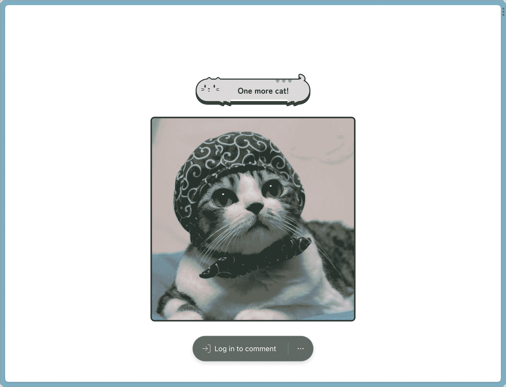

# Vercelにデプロイしてみよう

> 原文：[`typescriptbook.jp/tutorials/vercel-deploy`](https://typescriptbook.jp/tutorials/vercel-deploy)

このチュートリアルでは前のNext.jsのハンズオンで作成した猫画像ジェネレーターをVercelへデプロイする方法を学びます。

## Vercelとは？​

Next.jsを開発しているVercel 社が提供しているフロントエンド向けのクラウドプラットフォームで、特徴としては次の点があります。

+   特別な設定をせずにゼロコンフィグでGitHubリポジトリと連携をするだけで簡単にデプロイ環境を構築できる

+   プルリク単位で自動でプレビュー環境を利用できる

+   JavaScriptやCSSファイルを自動で圧縮してCDN 環境で配信

特にVercelはNext.jsをホスティングする環境として開発されており、Next.jsのAPIルートの自動スケールや特別な対応がなくISRを利用できるので、他のクラウドプラットフォームを利用する理由がない場合はNext.jsのホスティング環境としてVercelを利用することをオススメします。

## このチュートリアルに必要なもの​

今回のチュートリアルではGitHubリポジトリとの連携を利用してデプロイ環境を構築するために、次のものが必要です。

+   GitHubアカウント

+   「Next.jsで猫画像ジェネレーターを作ろう」で作成したコードと、それをpush 済みのGitHubリポジトリ

    +   上のチュートリアルを実施された方は、ご自身のGitHubアカウントのリポジトリにコードをpushしておいてください。

    +   自分で作ったコードでなくても構わない方は、本書が提供する[random-catリポジトリ](https://github.com/yytypescript/random-cat)を[フォーク](https://docs.github.com/ja/get-started/quickstart/fork-a-repo)しておくのでも構いません。

## デプロイの流れ​

+   Vercelアカウントを作成する

+   Vercelにログインする

+   GitHubリポジトリを連携する

## Vercelアカウントを作成する​

注記

Vercelのアカウントをすでにお持ちの方は、この手順を飛ばしてください。

最初に[Vercel](https://vercel.com/signup)にアクセスをして、GitHubアカウントでVercelのアカウントを作成しましょう。アカウント作成後に連携するGitHubリポジトリの選択画面が表示されるので、「GitHubリポジトリを連携する」にお進みください。

## Vercelにログインする​

[Vercelのログイン画面](https://vercel.com/login)に遷移してGitHubアカウントでログインをします。

## GitHubリポジトリを連携する​

[VercelのGitHubリポジトリ連携のページ](https://vercel.com/new)へアクセスして猫画像ジェネレーターのGitHubリポジトリを検索して「Import」ボタンをクリックします。


プロジェクトの設定画面が表示されるので、設定はデフォルトのままで「Deploy」ボタンをクリックしてください。


デプロイ完了画面が表示されればデプロイは完了です。🎉画面のプレビュー表示がリンクになっており、クリックすることでデプロイされたアプリを表示することができます。


「Continue To Dashboard」のボタンをクリックすることでプロジェクトのダッシュボードページへ遷移できます。ダッシュボード上でVercelが自動生成したドメインを確認できます。このドメインはプロジェクトが存続している限り変更されないため、このURLを他の人に共有することでアプリを公開することができます。


## 自動デプロイを体験​

プルリクエストを作成・マージして自動デプロイを実行してみます。VercelではGitHub 連携が完了した段階で自動デプロイのCI/CD 環境も自動で構築されるので、プルリクエストを作成・マージするだけで自動でデプロイがされる状態になっています。

実際に猫画像ジェネレーターのコードの一部を修正して自動デプロイを実行してみましょう。

次のようにボタンの文言を「他のにゃんこも見る」を「One more cat!」に変更してGitHubリポジトリでプルリクエストを作成してください。

```
src/pages/index.tsxtsx`const  <data-lsp lsp="const IndexPage: NextPage<Props>">IndexPage</data-lsp>:  <data-lsp lsp="(alias) type NextPage<P = {}, IP = P> = React.ComponentType<P> &amp; {
    getInitialProps?(context: NextPageContext): IP | Promise<IP>;
}
import NextPage">NextPage</data-lsp><<data-lsp lsp="type Props = {
    initialImageUrl: string;
}">Props</data-lsp>> = ({ <data-lsp lsp="(parameter) initialImageUrl: string">initialImageUrl</data-lsp> }) => {  const [<data-lsp lsp="const imageUrl: string">imageUrl</data-lsp>,  <data-lsp lsp="const setImageUrl: React.Dispatch<React.SetStateAction<string>>">setImageUrl</data-lsp>] =  <data-lsp lsp="(alias) useState<string>(initialState: string | (() => string)): [string, React.Dispatch<React.SetStateAction<string>>] (+1 overload)
import useState">useState</data-lsp>(<data-lsp lsp="(parameter) initialImageUrl: string">initialImageUrl</data-lsp>);  const [<data-lsp lsp="const loading: boolean">loading</data-lsp>,  <data-lsp lsp="const setLoading: React.Dispatch<React.SetStateAction<boolean>>">setLoading</data-lsp>] =  <data-lsp lsp="(alias) useState<boolean>(initialState: boolean | (() => boolean)): [boolean, React.Dispatch<React.SetStateAction<boolean>>] (+1 overload)
import useState">useState</data-lsp>(false);  const  <data-lsp lsp="const handleClick: () => Promise<void>">handleClick</data-lsp>  =  async () => {  <data-lsp lsp="const setLoading: (value: React.SetStateAction<boolean>) => void">setLoading</data-lsp>(true);  const  <data-lsp lsp="const newImage: Image">newImage</data-lsp>  =  await  <data-lsp lsp="function fetchImage(): Promise<Image>">fetchImage</data-lsp>();  <data-lsp lsp="const setImageUrl: (value: React.SetStateAction<string>) => void">setImageUrl</data-lsp>(<data-lsp lsp="const newImage: Image">newImage</data-lsp>.<data-lsp lsp="(property) url: string">url</data-lsp>);  <data-lsp lsp="const setLoading: (value: React.SetStateAction<boolean>) => void">setLoading</data-lsp>(false); };  return ( <<data-lsp lsp="(property) JSX.IntrinsicElements.div: React.DetailedHTMLProps<React.HTMLAttributes<HTMLDivElement>, HTMLDivElement>">div</data-lsp>  <data-lsp lsp="(property) HTMLAttributes<HTMLDivElement>.className?: string | undefined">className</data-lsp>={<data-lsp lsp="const styles: any">styles</data-lsp>.<data-lsp lsp="any">page</data-lsp>}> <<data-lsp lsp="(property) JSX.IntrinsicElements.button: React.DetailedHTMLProps<React.ButtonHTMLAttributes<HTMLButtonElement>, HTMLButtonElement>">button</data-lsp>  <data-lsp lsp="(property) DOMAttributes<HTMLButtonElement>.onClick?: React.MouseEventHandler<HTMLButtonElement> | undefined">onClick</data-lsp>={<data-lsp lsp="const handleClick: () => Promise<void>">handleClick</data-lsp>} <data-lsp lsp="(property) HTMLAttributes<T>.className?: string | undefined">className</data-lsp>={<data-lsp lsp="const styles: any">styles</data-lsp>.<data-lsp lsp="any">button</data-lsp>}> One more cat! </<data-lsp lsp="(property) JSX.IntrinsicElements.button: React.DetailedHTMLProps<React.ButtonHTMLAttributes<HTMLButtonElement>, HTMLButtonElement>">button</data-lsp>> <<data-lsp lsp="(property) JSX.IntrinsicElements.div: React.DetailedHTMLProps<React.HTMLAttributes<HTMLDivElement>, HTMLDivElement>">div</data-lsp>  <data-lsp lsp="(property) HTMLAttributes<HTMLDivElement>.className?: string | undefined">className</data-lsp>={<data-lsp lsp="const styles: any">styles</data-lsp>.<data-lsp lsp="any">frame</data-lsp>}> {<data-lsp lsp="const loading: boolean">loading</data-lsp> || <<data-lsp lsp="(property) JSX.IntrinsicElements.img: React.DetailedHTMLProps<React.ImgHTMLAttributes<HTMLImageElement>, HTMLImageElement>">img</data-lsp>  <data-lsp lsp="(property) ImgHTMLAttributes<HTMLImageElement>.src?: string | undefined">src</data-lsp>={<data-lsp lsp="const imageUrl: string">imageUrl</data-lsp>} <data-lsp lsp="(property) HTMLAttributes<T>.className?: string | undefined">className</data-lsp>={<data-lsp lsp="const styles: any">styles</data-lsp>.<data-lsp lsp="any">img</data-lsp>} />} </<data-lsp lsp="(property) JSX.IntrinsicElements.div: React.DetailedHTMLProps<React.HTMLAttributes<HTMLDivElement>, HTMLDivElement>">div</data-lsp>> </<data-lsp lsp="(property) JSX.IntrinsicElements.div: React.DetailedHTMLProps<React.HTMLAttributes<HTMLDivElement>, HTMLDivElement>">div</data-lsp>> );};`
```

```
src/pages/index.tsxtsx`const <data-lsp lsp="const IndexPage: NextPage<Props>">IndexPage</data-lsp>: <data-lsp lsp="(alias) type NextPage<P = {}, IP = P> = React.ComponentType<P> &amp; {
    getInitialProps?(context: NextPageContext): IP | Promise<IP>;
}
import NextPage">NextPage</data-lsp><<data-lsp lsp="type Props = {
    initialImageUrl: string;
}">Props</data-lsp>> = ({ <data-lsp lsp="(parameter) initialImageUrl: string">initialImageUrl</data-lsp> }) => {  const [<data-lsp lsp="const imageUrl: string">imageUrl</data-lsp>,  <data-lsp lsp="const setImageUrl: React.Dispatch<React.SetStateAction<string>>">setImageUrl</data-lsp>] = <data-lsp lsp="(alias) useState<string>(initialState: string | (() => string)): [string, React.Dispatch<React.SetStateAction<string>>] (+1 overload)
import useState">useState</data-lsp>(<data-lsp lsp="(parameter) initialImageUrl: string">initialImageUrl</data-lsp>);  const [<data-lsp lsp="const loading: boolean">loading</data-lsp>,  <data-lsp lsp="const setLoading: React.Dispatch<React.SetStateAction<boolean>>">setLoading</data-lsp>] = <data-lsp lsp="(alias) useState<boolean>(initialState: boolean | (() => boolean)): [boolean, React.Dispatch<React.SetStateAction<boolean>>] (+1 overload)
import useState">useState</data-lsp>(false);  const <data-lsp lsp="const handleClick: () => Promise<void>">handleClick</data-lsp> =  async () => { <data-lsp lsp="const setLoading: (value: React.SetStateAction<boolean>) => void">setLoading</data-lsp>(true);  const  <data-lsp lsp="const newImage: Image">newImage</data-lsp>  =  await <data-lsp lsp="function fetchImage(): Promise<Image>">fetchImage</data-lsp>(); <data-lsp lsp="const setImageUrl: (value: React.SetStateAction<string>) => void">setImageUrl</data-lsp>(<data-lsp lsp="const newImage: Image">newImage</data-lsp>.<data-lsp lsp="(property) url: string">url</data-lsp>); <data-lsp lsp="const setLoading: (value: React.SetStateAction<boolean>) => void">setLoading</data-lsp>(false); };  return ( <<data-lsp lsp="(property) JSX.IntrinsicElements.div: React.DetailedHTMLProps<React.HTMLAttributes<HTMLDivElement>, HTMLDivElement>">div</data-lsp> <data-lsp lsp="(property) HTMLAttributes<HTMLDivElement>.className?: string | undefined">className</data-lsp>={<data-lsp lsp="const styles: any">styles</data-lsp>.<data-lsp lsp="any">page</data-lsp>}> <<data-lsp lsp="(property) JSX.IntrinsicElements.button: React.DetailedHTMLProps<React.ButtonHTMLAttributes<HTMLButtonElement>, HTMLButtonElement>">button</data-lsp> <data-lsp lsp="(property) DOMAttributes<HTMLButtonElement>.onClick?: React.MouseEventHandler<HTMLButtonElement> | undefined">onClick</data-lsp>={<data-lsp lsp="const handleClick: () => Promise<void>">handleClick</data-lsp>} <data-lsp lsp="(property) HTMLAttributes<T>.className?: string | undefined">className</data-lsp>={<data-lsp lsp="const styles: any">styles</data-lsp>.<data-lsp lsp="any">button</data-lsp>}> One more cat! </<data-lsp lsp="(property) JSX.IntrinsicElements.button: React.DetailedHTMLProps<React.ButtonHTMLAttributes<HTMLButtonElement>, HTMLButtonElement>">button</data-lsp>> <<data-lsp lsp="(property) JSX.IntrinsicElements.div: React.DetailedHTMLProps<React.HTMLAttributes<HTMLDivElement>, HTMLDivElement>">div</data-lsp> <data-lsp lsp="(property) HTMLAttributes<HTMLDivElement>.className?: string | undefined">className</data-lsp>={<data-lsp lsp="const styles: any">styles</data-lsp>.<data-lsp lsp="any">frame</data-lsp>}> {<data-lsp lsp="const loading: boolean">loading</data-lsp> || <<data-lsp lsp="(property) JSX.IntrinsicElements.img: React.DetailedHTMLProps<React.ImgHTMLAttributes<HTMLImageElement>, HTMLImageElement>">img</data-lsp> <data-lsp lsp="(property) ImgHTMLAttributes<HTMLImageElement>.src?: string | undefined">src</data-lsp>={<data-lsp lsp="const imageUrl: string">imageUrl</data-lsp>} <data-lsp lsp="(property) HTMLAttributes<T>.className?: string | undefined">className</data-lsp>={<data-lsp lsp="const styles: any">styles</data-lsp>.<data-lsp lsp="any">img</data-lsp>} />} </<data-lsp lsp="(property) JSX.IntrinsicElements.div: React.DetailedHTMLProps<React.HTMLAttributes<HTMLDivElement>, HTMLDivElement>">div</data-lsp>> </<data-lsp lsp="(property) JSX.IntrinsicElements.div: React.DetailedHTMLProps<React.HTMLAttributes<HTMLDivElement>, HTMLDivElement>">div</data-lsp>> );};`
```

Vercelは連携しているGitHubリポジトリに新たにブランチがプッシュされると自動でビルドが実行されて、プレビュー環境をデプロイしてくれます。

プルリクエストを作成するとVercel BOTが画像のようにビルドのステータスとプレビュー環境のURLをコメントとしてくれるので、「Visit Preview」のリンクをクリックすることでレビュアーは簡単に新しい変更の確認をすることができます。


ビルドの結果はプルリクエストのstatus checksにも表示されるので、ビルドが失敗している状態で誤ってデプロイをする事故も防ぐこともできます。


「Merge pull request」ボタンをクリックして、このプルリクエストをマージしてみましょう。ベースブランチに新しくブランチがマージされると本番環境に更新が自動でデプロイされます。

通过访问刚才确认的生产环境 URL，您可以看到按钮设计已更改，并且此次修正已自动部署到生产环境中。😺



## 项目删除​

如果您想要保留项目，请转到设置页面，点击`Delete`按钮，并在对话框中输入必要的文本即可删除项目。


