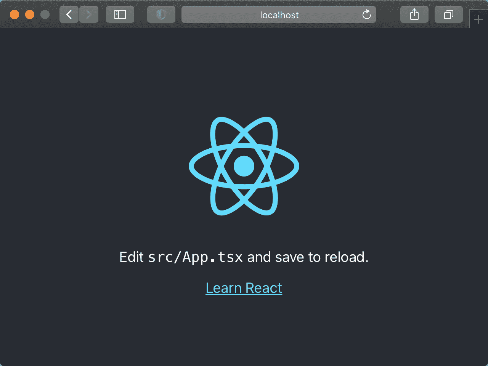

# 编写 React 组件的测试

> 原文：[`typescriptbook.jp/tutorials/component-test`](https://typescriptbook.jp/tutorials/component-test)

本教程将教您如何编写 React 组件的测试。

## 本章可以学到的内容​

本章的目标是编写简单组件的测试，具体来说，我们将做以下事情。

+   使用 UI 测试库`testing-library`创建测试。

+   使用`Jest`创建快照测试

本章的目标不是完全理解组件测试，而是通过实际体验了解其基本概念。因此，内容相当基础，但也正因为如此，您可以在很短的时间内体验一下组件测试，所以请务必动手尝试。

备注

假设您已经了解了 React 组件的创建，如果您想了解 React 的基本用法，请参考使用 React 创建点赞按钮。

您可以在[GitHub](https://github.com/yytypescript/component-test-tutorial/blob/main/src/SimpleButton.test.tsx)上查看本教程中创建的测试代码的完成形式。

## 本教程所需的内容​

在进行本教程之前，您需要准备一些工具。请提前准备好这些工具，我将在这里列出。

+   Node.js（本教程中使用的版本为 v18.15.0）

+   NPM

+   Yarn v1 系列（本教程使用 v1.22.19 进行测试）

有关 Node.js 的安装，请参阅设置开发环境。

我们将使用 Yarn 作为包管理工具。首先安装 Yarn。如果您已经安装了 Yarn，则可以跳过这一步。

```
shell`npm install -g yarn`
```

```
shell`npm install -g yarn`
```

## 创建 React 项目​

创建用于测试的 React 项目。请执行以下命令。

```
shell`yarn create react-app component-test-tutorial --template typescript`
```

```
shell`yarn create react-app component-test-tutorial --template typescript`
```

成功后，将在当前目录下创建一个名为`component-test-tutorial`的目录。然后执行以下命令，进入`component-test-tutorial`目录。

```
shell`cd component-test-tutorial`
```

```
shell`cd component-test-tutorial`
```

`component-test-tutorial`目录下应该有以下文件结构。

```
text`├── .gitignore├── node_modules├── README.md├── package.json├── public│   ├── favicon.ico│   ├── index.html│   ├── logo192.png│   ├── logo512.png│   ├── manifest.json│   └── robots.txt├── src│   ├── App.css│   ├── App.test.tsx│   ├── App.tsx│   ├── index.css│   ├── index.tsx│   ├── logo.svg│   ├── react-app-env.d.ts│   ├── reportWebVitals.ts│   └── setupTests.ts├── tsconfig.json└── yarn.lock`
```

```
text`├── .gitignore├── node_modules├── README.md├── package.json├── public│   ├── favicon.ico│   ├── index.html│   ├── logo192.png│   ├── logo512.png│   ├── manifest.json│   └── robots.txt├── src│   ├── App.css│   ├── App.test.tsx│   ├── App.tsx│   ├── index.css│   ├── index.tsx│   ├── logo.svg│   ├── react-app-env.d.ts│   ├── reportWebVitals.ts│   └── setupTests.ts├── tsconfig.json└── yarn.lock`
```

现在，请执行以下命令。

```
shell`yarn start`
```

```
shell`yarn start`
```

如果自动打开浏览器并显示如下图像，则表示项目创建成功。



## 要测试的组件​

在这里，我们将以编写简单按钮组件的测试为例进行讲解。具体来说，我们将以按钮上最初显示为`OFF`的文字，每次单击按钮时切换为`ON`/`OFF`为例。


让我们测试一下这个组件，看看单击按钮时`ON`/`OFF`的显示是否会切换。

## 创建要测试的组件​

为了创建测试，首先要实现要测试的组件。请在`src`目录下创建一个名为`SimpleButton.tsx`的文件。

```
shell`cd srctouch SimpleButton.tsx`
```

```
shell`cd srctouch SimpleButton.tsx`
```

创建此文件后，`src`目录的文件结构将如下所示。

```
text`├── App.css├── App.test.tsx├── App.tsx├── SimpleButton.tsx├── index.css├── index.tsx├── logo.svg├── react-app-env.d.ts├── reportWebVitals.ts└── setupTests.ts`
```

```
text`├── App.css├── App.test.tsx├── App.tsx├── SimpleButton.tsx├── index.css├── index.tsx├── logo.svg├── react-app-env.d.ts├── reportWebVitals.ts└── setupTests.ts`
```

将`SimpleButton.tsx`的内容设置如下。

```
SimpleButton.tsxtsx`import { <data-lsp lsp="(alias) function useState<S>(initialState: S | (() => S)): [S, Dispatch<SetStateAction<S>>] (+1 overload)
import useState">useState</data-lsp> } from  "react";export  const  <data-lsp lsp="const SimpleButton: () => JSX.Element">SimpleButton</data-lsp>: () =>  <data-lsp lsp="namespace JSX">JSX</data-lsp>.<data-lsp lsp="interface JSX.Element">Element</data-lsp>  = () => {  const [<data-lsp lsp="const state: boolean">state</data-lsp>,  <data-lsp lsp="const setState: React.Dispatch<React.SetStateAction<boolean>>">setState</data-lsp>] =  <data-lsp lsp="(alias) useState<boolean>(initialState: boolean | (() => boolean)): [boolean, React.Dispatch<React.SetStateAction<boolean>>] (+1 overload)
import useState">useState</data-lsp>(false);  const  <data-lsp lsp="const handleClick: () => void">handleClick</data-lsp>  = () => {  <data-lsp lsp="const setState: (value: React.SetStateAction<boolean>) => void">setState</data-lsp>((<data-lsp lsp="(parameter) prevState: boolean">prevState</data-lsp>) =>  !<data-lsp lsp="(parameter) prevState: boolean">prevState</data-lsp>); };  return <<data-lsp lsp="(property) JSX.IntrinsicElements.button: React.DetailedHTMLProps<React.ButtonHTMLAttributes<HTMLButtonElement>, HTMLButtonElement>">button</data-lsp>  <data-lsp lsp="(property) React.DOMAttributes<HTMLButtonElement>.onClick?: React.MouseEventHandler<HTMLButtonElement> | undefined">onClick</data-lsp>={<data-lsp lsp="const handleClick: () => void">handleClick</data-lsp>}>{<data-lsp lsp="const state: boolean">state</data-lsp> ?  "ON"  :  "OFF"}</<data-lsp lsp="(property) JSX.IntrinsicElements.button: React.DetailedHTMLProps<React.ButtonHTMLAttributes<HTMLButtonElement>, HTMLButtonElement>">button</data-lsp>>;};`
```

```
SimpleButton.tsxtsx`import { <data-lsp lsp="(alias) function useState<S>(initialState: S | (() => S)): [S, Dispatch<SetStateAction<S>>] (+1 overload)
import useState">useState</data-lsp> } from  "react";export  const <data-lsp lsp="const SimpleButton: () => JSX.Element">SimpleButton</data-lsp>: () => <data-lsp lsp="namespace JSX">JSX</data-lsp>.<data-lsp lsp="interface JSX.Element">Element</data-lsp> = () => {  const [<data-lsp lsp="const state: boolean">state</data-lsp>,  <data-lsp lsp="const setState: React.Dispatch<React.SetStateAction<boolean>>">setState</data-lsp>] = <data-lsp lsp="(alias) useState<boolean>(initialState: boolean | (() => boolean)): [boolean, React.Dispatch<React.SetStateAction<boolean>>] (+1 overload)
import useState">useState</data-lsp>(false);  const <data-lsp lsp="const handleClick: () => void">handleClick</data-lsp> = () => { <data-lsp lsp="const setState: (value: React.SetStateAction<boolean>) => void">setState</data-lsp>((<data-lsp lsp="(parameter) prevState: boolean">prevState</data-lsp>) =>  !<data-lsp lsp="(parameter) prevState: boolean">prevState</data-lsp>); };  return <<data-lsp lsp="(property) JSX.IntrinsicElements.button: React.DetailedHTMLProps<React.ButtonHTMLAttributes<HTMLButtonElement>, HTMLButtonElement>">button</data-lsp> <data-lsp lsp="(property) React.DOMAttributes<HTMLButtonElement>.onClick?: React.MouseEventHandler<HTMLButtonElement> | undefined">onClick</data-lsp>={<data-lsp lsp="const handleClick: () => void">handleClick</data-lsp>}>{<data-lsp lsp="const state: boolean">state</data-lsp> ?  "ON"  :  "OFF"}</<data-lsp lsp="(property) JSX.IntrinsicElements.button: React.DetailedHTMLProps<React.ButtonHTMLAttributes<HTMLButtonElement>, HTMLButtonElement>">button</data-lsp>>;};`
```

现在，让我们来检查`SimpleButton`组件的行为。请将`index.tsx`文件保存为以下内容。

```
index.tsxtsx`import <data-lsp lsp="(alias) namespace React
import React">React</data-lsp> from  "react";import <data-lsp lsp="import ReactDOM">ReactDOM</data-lsp> from  "react-dom/client";import { <data-lsp lsp="import SimpleButton">SimpleButton</data-lsp> } from  "./SimpleButton";const  <data-lsp lsp="const root: any">root</data-lsp>  =  <data-lsp lsp="import ReactDOM">ReactDOM</data-lsp>.<data-lsp lsp="any">createRoot</data-lsp>(  <data-lsp lsp="var document: Document">document</data-lsp>.<data-lsp lsp="(method) Document.getElementById(elementId: string): HTMLElement | null">getElementById</data-lsp>("root") as  <data-lsp lsp="interface HTMLElement">HTMLElement</data-lsp>);<data-lsp lsp="const root: any">root</data-lsp>.<data-lsp lsp="any">render</data-lsp>( <<data-lsp lsp="(alias) namespace React
import React">React</data-lsp>.<data-lsp lsp="const React.StrictMode: React.ExoticComponent<{
    children?: React.ReactNode;
}>">StrictMode</data-lsp>> <<data-lsp lsp="import SimpleButton">SimpleButton</data-lsp> /> </<data-lsp lsp="(alias) namespace React
import React">React</data-lsp>.<data-lsp lsp="const React.StrictMode: React.ExoticComponent<{
    children?: React.ReactNode;
}>">StrictMode</data-lsp>>);`
```

```
index.tsxtsx`import <data-lsp lsp="(alias) namespace React
import React">React</data-lsp> from  "react";import <data-lsp lsp="import ReactDOM">ReactDOM</data-lsp> from  "react-dom/client";import { <data-lsp lsp="import SimpleButton">SimpleButton</data-lsp> } from  "./SimpleButton";const  <data-lsp lsp="const root: any">root</data-lsp>  =  <data-lsp lsp="import ReactDOM">ReactDOM</data-lsp>.<data-lsp lsp="any">createRoot</data-lsp>(  <data-lsp lsp="var document: Document">document</data-lsp>.<data-lsp lsp="(method) Document.getElementById(elementId: string): HTMLElement | null">getElementById</data-lsp>("root") as <data-lsp lsp="interface HTMLElement">HTMLElement</data-lsp>);<data-lsp lsp="const root: any">root</data-lsp>.<data-lsp lsp="any">render</data-lsp>( <<data-lsp lsp="(alias) namespace React
import React">React</data-lsp>.<data-lsp lsp="const React.StrictMode: React.ExoticComponent<{
    children?: React.ReactNode;
}>">StrictMode</data-lsp>> <<data-lsp lsp="import SimpleButton">SimpleButton</data-lsp> /> </<data-lsp lsp="(alias) namespace React
import React">React</data-lsp>.<data-lsp lsp="const React.StrictMode: React.ExoticComponent<{
    children?: React.ReactNode;
}>">StrictMode</data-lsp>>);`
```

然后执行以下命令。

```
shell`yarn start`
```

```
shell`yarn start`
```

然后，浏览器将自动打开，并显示如下按钮。一开始显示为`OFF`，单击后会交替显示`ON`和`OFF`，请确认。


备注

如果按钮太小，请尝试增大浏览器的缩放比例以查看更大的按钮。

现在我们已经创建了要测试的组件。

## 使用`testing-library`进行测试的方法和步骤​

现在我们将进入测试的制作方法和步骤。本次测试将测试当单击按钮时`ON`/`OFF`显示切换的功能。

有多种方法可以测试 React 组件，但在这里我们将介绍使用相对流行的`testing-library`库的方法。`testing-library`是用于测试 UI 组件的库集合，可以实现组件的渲染和对组件的操作等。有了`testing-library`，可以认为可以完成组件的测试。

### 安装 testing-library​

请执行以下命令安装 testing-library。

```
shell`yarn add \ @testing-library/react@14 \ @testing-library/jest-dom@5 \ @testing-library/user-event@14`
```

```
shell`yarn add \ @testing-library/react@14 \ @testing-library/jest-dom@5 \ @testing-library/user-event@14`
```

### 创建测试​

それでは、実際に`testing-library`を使ってテストを作っていきましょう。まずは先ほどと同じ`src`ディレクトリ配下で`SimpleButton.test.tsx`というファイルを作成します。

```
shell`touch SimpleButton.test.tsx`
```

```
shell`touch SimpleButton.test.tsx`
```

このファイルに、テストを実行するためのひな形を書きます。

```
SimpleButton.test.tsxtsx`<data-lsp lsp="any">test</data-lsp>("ボタンをクリックするとON/OFFの表示が切り替わる",  async () => {  // ここにテストの中身を書いていきます});`
```

```
SimpleButton.test.tsxtsx`<data-lsp lsp="any">test</data-lsp>("ボタンをクリックするとON/OFFの表示が切り替わる",  async () => {  // ここにテストの中身を書いていきます});`
```

ここにテストの中身を追加していきます。今回はボタンをクリックすると`ON`/`OFF`の表示が切り替わることがテストしたいので、次のような流れのテストコードになります。

1.  ボタンを描画する

1.  `OFF`と表示されていることを確かめる

1.  ボタンをクリックする

1.  `ON`と表示されていることを確かめる

備考

コンポーネントのテストは、コンポーネントを描画した後、次の2つのことを組み合わせて実現されます。

1.  コンポーネントに操作を施す

1.  コンポーネントの状態を確かめる

今回の例もボタンを描画した後、「`OFF`と表示されている」という状態確認から始まり、「クリック」という操作を施した後、再び「`ON`と表示されている」という状態確認をします。みなさんが自分でコンポーネントのテストを書く際も、どのような操作と状態確認を行えばよいかを意識することでテスト作成がスムーズにできるはずです。

まずはボタンを描画してみましょう。コンポーネントの描画は`@testing-library/react`の`render()`を使って、次のようにするだけです。なお、この`@testing-library/react`というライブラリは、今回`yarn create react-app`でReactアプリケーションを作成したためすでにプロジェクトにインストールされています。

```
SimpleButton.test.tsxtsx`import { <data-lsp lsp="import render">render</data-lsp> } from  "@testing-library/react";import { <data-lsp lsp="import SimpleButton">SimpleButton</data-lsp> } from  "./SimpleButton";<data-lsp lsp="any">test</data-lsp>("ボタンをクリックするとON/OFFの表示が切り替わる",  async () => {  <data-lsp lsp="import render">render</data-lsp>(<<data-lsp lsp="import SimpleButton">SimpleButton</data-lsp> />);});`
```

```
SimpleButton.test.tsxtsx`import { <data-lsp lsp="import render">render</data-lsp> } from  "@testing-library/react";import { <data-lsp lsp="import SimpleButton">SimpleButton</data-lsp> } from  "./SimpleButton";<data-lsp lsp="any">test</data-lsp>("ボタンをクリックするとON/OFFの表示が切り替わる",  async () => { <data-lsp lsp="import render">render</data-lsp>(<<data-lsp lsp="import SimpleButton">SimpleButton</data-lsp> />);});`
```

ボタンが描画されたので、次は`OFF`と表示されていることを確かめます。具体的には、ボタンのDOM(DOMとは、ここではボタンを表すオブジェクトくらいに捉えていただければ大丈夫です)を取得し、そのテキストが`OFF`という文字列に等しいかのアサーションを実施します。今回、ボタンのDOMの取得には`@testing-library/react`が提供するクエリのひとつである`getByRole()`を使います。これは[WAI-ARIA](https://developer.mozilla.org/ja/docs/Learn/Accessibility/WAI-ARIA_basics)(アクセシビリティ向上を主目的として定められたwebの仕様)で定められたRoleを引数に指定すると、そのRoleを持つコンポーネントを取得するクエリです。詳細は[公式ドキュメント](https://testing-library.com/docs/queries/byrole)をご参照ください。具体的には、このように書けます。

```
SimpleButton.test.tsxtsx`import { <data-lsp lsp="import render">render</data-lsp>, <data-lsp lsp="import screen">screen</data-lsp> } from  "@testing-library/react";//               ^^^^^^追加 import { <data-lsp lsp="import SimpleButton">SimpleButton</data-lsp> } from  "./SimpleButton";<data-lsp lsp="any">test</data-lsp>("ボタンをクリックするとON/OFFの表示が切り替わる",  async () => {  <data-lsp lsp="import render">render</data-lsp>(<<data-lsp lsp="import SimpleButton">SimpleButton</data-lsp> />);  const  <data-lsp lsp="const simpleButton: any">simpleButton</data-lsp>  =  <data-lsp lsp="import screen">screen</data-lsp>.<data-lsp lsp="any">getByRole</data-lsp>("button");});`
```

```
SimpleButton.test.tsxtsx`import { <data-lsp lsp="import render">render</data-lsp>, <data-lsp lsp="import screen">screen</data-lsp> } from  "@testing-library/react";//               ^^^^^^追加 import { <data-lsp lsp="import SimpleButton">SimpleButton</data-lsp> } from  "./SimpleButton";<data-lsp lsp="any">test</data-lsp>("ボタンをクリックするとON/OFFの表示が切り替わる",  async () => { <data-lsp lsp="import render">render</data-lsp>(<<data-lsp lsp="import SimpleButton">SimpleButton</data-lsp> />);  const  <data-lsp lsp="const simpleButton: any">simpleButton</data-lsp>  =  <data-lsp lsp="import screen">screen</data-lsp>.<data-lsp lsp="any">getByRole</data-lsp>("button");});`
```

そして、ボタンのテキストのアサーションは`@testing-library/jest-dom`が提供する`toHaveTextContent()`を使います。`expect()`にコンポーネントを渡し、そのまま`toHaveTextContent()`を呼び出すと、そのコンポーネントがどのようなテキストを持っているかのアサーションが行なえます。具体的には次のようになります。

```
SimpleButton.test.tsxtsx`import { <data-lsp lsp="import render">render</data-lsp>, <data-lsp lsp="import screen">screen</data-lsp> } from  "@testing-library/react";import { <data-lsp lsp="import SimpleButton">SimpleButton</data-lsp> } from  "./SimpleButton";<data-lsp lsp="any">test</data-lsp>("ボタンをクリックするとON/OFFの表示が切り替わる",  async () => {  <data-lsp lsp="import render">render</data-lsp>(<<data-lsp lsp="import SimpleButton">SimpleButton</data-lsp> />);  const  <data-lsp lsp="const simpleButton: any">simpleButton</data-lsp>  =  <data-lsp lsp="import screen">screen</data-lsp>.<data-lsp lsp="any">getByRole</data-lsp>("button");  <data-lsp lsp="any">expect</data-lsp>(<data-lsp lsp="const simpleButton: any">simpleButton</data-lsp>).<data-lsp lsp="any">toHaveTextContent</data-lsp>("OFF");});`
```

```
SimpleButton.test.tsxtsx`import { <data-lsp lsp="import render">render</data-lsp>, <data-lsp lsp="import screen">screen</data-lsp> } from  "@testing-library/react";import { <data-lsp lsp="import SimpleButton">SimpleButton</data-lsp> } from  "./SimpleButton";<data-lsp lsp="any">test</data-lsp>("ボタンをクリックするとON/OFFの表示が切り替わる",  async () => { <data-lsp lsp="import render">render</data-lsp>(<<data-lsp lsp="import SimpleButton">SimpleButton</data-lsp> />);  const  <data-lsp lsp="const simpleButton: any">simpleButton</data-lsp>  =  <data-lsp lsp="import screen">screen</data-lsp>.<data-lsp lsp="any">getByRole</data-lsp>("button"); <data-lsp lsp="any">expect</data-lsp>(<data-lsp lsp="const simpleButton: any">simpleButton</data-lsp>).<data-lsp lsp="any">toHaveTextContent</data-lsp>("OFF");});`
```

ここで一旦`yarn test`コマンドでテストを実行し、テストが通ることを確認しましょう。

```
shell`yarn test`
```

```
shell`yarn test`
```

次のような結果になるはずです。


さて、次にボタンをクリックします。コンポーネントの操作は`testing-library`に収録されている`@testing-library/user-event`を使って実現できます。`@testing-library/user-event`はコンポーネントの操作を含む、色々なユーザーイベントをテストで実行するライブラリです。具体的には`click()`にクエリでみつけた`simpleButton`を引数として渡すことで、ボタンのクリックを実現できます。

```
SimpleButton.test.tsxtsx`import { <data-lsp lsp="import render">render</data-lsp>, <data-lsp lsp="import screen">screen</data-lsp> } from  "@testing-library/react";import <data-lsp lsp="import userEvent">userEvent</data-lsp> from  "@testing-library/user-event";import { <data-lsp lsp="import SimpleButton">SimpleButton</data-lsp> } from  "./SimpleButton";<data-lsp lsp="any">test</data-lsp>("ボタンをクリックするとON/OFFの表示が切り替わる",  async () => {  const  <data-lsp lsp="const user: any">user</data-lsp>  =  <data-lsp lsp="import userEvent">userEvent</data-lsp>.<data-lsp lsp="any">setup</data-lsp>();  <data-lsp lsp="import render">render</data-lsp>(<<data-lsp lsp="import SimpleButton">SimpleButton</data-lsp> />);  const  <data-lsp lsp="const simpleButton: any">simpleButton</data-lsp>  =  <data-lsp lsp="import screen">screen</data-lsp>.<data-lsp lsp="any">getByRole</data-lsp>("button");  <data-lsp lsp="any">expect</data-lsp>(<data-lsp lsp="const simpleButton: any">simpleButton</data-lsp>).<data-lsp lsp="any">toHaveTextContent</data-lsp>("OFF");  await  <data-lsp lsp="const user: any">user</data-lsp>.<data-lsp lsp="any">click</data-lsp>(<data-lsp lsp="const simpleButton: any">simpleButton</data-lsp>);});`
```

```
SimpleButton.test.tsxtsx`import { <data-lsp lsp="import render">render</data-lsp>, <data-lsp lsp="import screen">screen</data-lsp> } from  "@testing-library/react";import <data-lsp lsp="import userEvent">userEvent</data-lsp> from  "@testing-library/user-event";import { <data-lsp lsp="import SimpleButton">SimpleButton</data-lsp> } from  "./SimpleButton";<data-lsp lsp="any">test</data-lsp>("ボタンをクリックするとON/OFFの表示が切り替わる",  async () => {  const  <data-lsp lsp="const user: any">user</data-lsp>  =  <data-lsp lsp="import userEvent">userEvent</data-lsp>.<data-lsp lsp="any">setup</data-lsp>(); <data-lsp lsp="import render">render</data-lsp>(<<data-lsp lsp="import SimpleButton">SimpleButton</data-lsp> />);  const  <data-lsp lsp="const simpleButton: any">simpleButton</data-lsp>  =  <data-lsp lsp="import screen">screen</data-lsp>.<data-lsp lsp="any">getByRole</data-lsp>("button"); <data-lsp lsp="any">expect</data-lsp>(<data-lsp lsp="const simpleButton: any">simpleButton</data-lsp>).<data-lsp lsp="any">toHaveTextContent</data-lsp>("OFF");  await  <data-lsp lsp="const user: any">user</data-lsp>.<data-lsp lsp="any">click</data-lsp>(<data-lsp lsp="const simpleButton: any">simpleButton</data-lsp>);});`
```

続けて、ボタンがクリックされた後のアサーションを実施します。先ほどと同様に`toHaveTextContent()`を用いますが、今度はボタンのテキストが`ON`になっていることを確認しましょう。

```
SimpleButton.test.tsxtsx`import { <data-lsp lsp="import render">render</data-lsp>, <data-lsp lsp="import screen">screen</data-lsp> } from  "@testing-library/react";import <data-lsp lsp="import userEvent">userEvent</data-lsp> from  "@testing-library/user-event";import { <data-lsp lsp="import SimpleButton">SimpleButton</data-lsp> } from  "./SimpleButton";<data-lsp lsp="any">test</data-lsp>("ボタンをクリックするとON/OFFの表示が切り替わる",  async () => {  const  <data-lsp lsp="const user: any">user</data-lsp>  =  <data-lsp lsp="import userEvent">userEvent</data-lsp>.<data-lsp lsp="any">setup</data-lsp>();  <data-lsp lsp="import render">render</data-lsp>(<<data-lsp lsp="import SimpleButton">SimpleButton</data-lsp> />);  const  <data-lsp lsp="const simpleButton: any">simpleButton</data-lsp>  =  <data-lsp lsp="import screen">screen</data-lsp>.<data-lsp lsp="any">getByRole</data-lsp>("button");  <data-lsp lsp="any">expect</data-lsp>(<data-lsp lsp="const simpleButton: any">simpleButton</data-lsp>).<data-lsp lsp="any">toHaveTextContent</data-lsp>("OFF");  await  <data-lsp lsp="const user: any">user</data-lsp>.<data-lsp lsp="any">click</data-lsp>(<data-lsp lsp="const simpleButton: any">simpleButton</data-lsp>);  <data-lsp lsp="any">expect</data-lsp>(<data-lsp lsp="const simpleButton: any">simpleButton</data-lsp>).<data-lsp lsp="any">toHaveTextContent</data-lsp>("ON");});`
```

```
SimpleButton.test.tsxtsx`import { <data-lsp lsp="import render">render</data-lsp>, <data-lsp lsp="import screen">screen</data-lsp> } from  "@testing-library/react";import <data-lsp lsp="import userEvent">userEvent</data-lsp> from  "@testing-library/user-event";import { <data-lsp lsp="import SimpleButton">SimpleButton</data-lsp> } from  "./SimpleButton";<data-lsp lsp="any">test</data-lsp>("ボタンをクリックするとON/OFFの表示が切り替わる",  async () => {  const  <data-lsp lsp="const user: any">user</data-lsp>  =  <data-lsp lsp="import userEvent">userEvent</data-lsp>.<data-lsp lsp="any">setup</data-lsp>(); <data-lsp lsp="import render">render</data-lsp>(<<data-lsp lsp="import SimpleButton">SimpleButton</data-lsp> />);  const  <data-lsp lsp="const simpleButton: any">simpleButton</data-lsp>  =  <data-lsp lsp="import screen">screen</data-lsp>.<data-lsp lsp="any">getByRole</data-lsp>("button"); <data-lsp lsp="any">expect</data-lsp>(<data-lsp lsp="const simpleButton: any">simpleButton</data-lsp>).<data-lsp lsp="any">toHaveTextContent</data-lsp>("OFF");  await  <data-lsp lsp="const user: any">user</data-lsp>.<data-lsp lsp="any">click</data-lsp>(<data-lsp lsp="const simpleButton: any">simpleButton</data-lsp>); <data-lsp lsp="any">expect</data-lsp>(<data-lsp lsp="const simpleButton: any">simpleButton</data-lsp>).<data-lsp lsp="any">toHaveTextContent</data-lsp>("ON");});`
```

この状態で`yarn test`コマンドでテストを実行し、テストが通ることを確認しましょう。次のような結果になるはずです。


以上が、`testing-library`を用いてコンポーネントのテストを作成する流れです。`testing-library`からは、ここで紹介したもの以外にも多くのクエリやアサーション、ユーザーイベントの機能が提供されています。英語にはなってしまいますが、クエリは[こちら](https://testing-library.com/docs/queries/about)、アサーションは[こちら](https://github.com/testing-library/jest-dom#custom-matchers)、ユーザーイベントは[こちら](https://testing-library.com/docs/user-event/intro)に公式ドキュメントによる詳細な説明があります。実際に自分でテストを作る際には、ぜひそれらも確認してみてください。

## `Jest`を使ったスナップショットテストの作り方とやり方​

ここからは「スナップショットテスト」と呼ばれるテスト手法について解説します。

先ほどまでのテストはコンポーネントのある部分(例: テキスト)の状態を確認するものでしたが、「スナップショットテスト」はコンポーネントの全体の状態を確かめるためのテストです。より正確には、コンポーネントのDOMをまるごと保存し、その保存したDOMと、テスト実行時にコンポーネントを描画して生成したDOMとが一致するかを確認します(DOMとは何かがよく分からない場合、ここではひとまず「コンポーネントを表すオブジェクト」程度に捉えてください)。

「スナップシ��ットテスト」は簡単に書くことができます。それでいてスタイルなど含めた全体の確認ができるので、手軽なリグレッションテストとして活用できます。一方で、そうであるからこそコンポーネントを一旦作り終えるまでは機能しないテストですので、テストファーストの開発には不向きです。

注意

实际上，快照测试的对象不仅限于组件和 DOM。快照测试可以应用于广泛的对象。更多信息，请参阅 Jest 的[官方文档](https://jestjs.io/ja/docs/snapshot-testing#%E3%82%B9%E3%83%8A%E3%83%83%E3%83%97%E3%82%B7%E3%83%A7%E3%83%83%E3%83%88%E3%83%86%E3%82%B9%E3%83%88%E3%81%AFreact%E3%82%B3%E3%83%B3%E3%83%9D%E3%83%BC%E3%83%8D%E3%83%B3%E3%83%88%E3%81%A7%E3%81%AE%E3%81%BF%E5%88%A9%E7%94%A8%E3%81%A7%E3%81%8D%E3%81%BE%E3%81%99%E3%81%8B)。

现在，让我们实际进行快照测试。在与之前相同的`src`目录下创建一个名为`SimpleButton.test.tsx`的文件。

```
shell`touch SimpleButton.test.tsx`
```

```
shell`touch SimpleButton.test.tsx`
```

备注

如果您是从「`testing-library`を使ったテストの作り方とやり方」继续进行本教程的话，可以在`SimpleButton.test.tsx`文件中继续添加测试用例。

快照测试包括以下两个步骤。

1.  将组件带入要验证快照的状态

1.  对快照进行比对

在这里，我们考虑对刚刚渲染的按钮显示为 OFF 的状态进行快照测试。因为我们想验证刚刚渲染的状态，所以只需渲染后立即进行快照比对即可。

根据这个思路，让我们来编写实际的代码。您可以使用`@testing-library/react`的`render`函数进行组件渲染，使用 Jest 的`toMatchSnapshot()`函数进行快照比对。

```
SimpleButton.test.tsxtsx`import { <data-lsp lsp="import render">render</data-lsp> } from  "@testing-library/react";import { <data-lsp lsp="import SimpleButton">SimpleButton</data-lsp> } from  "./SimpleButton";<data-lsp lsp="any">test</data-lsp>("描画されてすぐはOFFと表示されている", () => {  const  <data-lsp lsp="const view: any">view</data-lsp>  =  <data-lsp lsp="import render">render</data-lsp>(<<data-lsp lsp="import SimpleButton">SimpleButton</data-lsp> />);  <data-lsp lsp="any">expect</data-lsp>(<data-lsp lsp="const view: any">view</data-lsp>.<data-lsp lsp="any">container</data-lsp>).<data-lsp lsp="any">toMatchSnapshot</data-lsp>();});`
```

```
SimpleButton.test.tsxtsx`import { <data-lsp lsp="import render">render</data-lsp> } from  "@testing-library/react";import { <data-lsp lsp="import SimpleButton">SimpleButton</data-lsp> } from  "./SimpleButton";<data-lsp lsp="any">test</data-lsp>("描画されてすぐはOFFと表示されている", () => {  const  <data-lsp lsp="const view: any">view</data-lsp>  = <data-lsp lsp="import render">render</data-lsp>(<<data-lsp lsp="import SimpleButton">SimpleButton</data-lsp> />); <data-lsp lsp="any">expect</data-lsp>(<data-lsp lsp="const view: any">view</data-lsp>.<data-lsp lsp="any">container</data-lsp>).<data-lsp lsp="any">toMatchSnapshot</data-lsp>();});`
```

备注

Jest 本身无法渲染 React 组件。因此，您需要使用用于渲染组件的库。有许多库可供选择，但在这里我们使用了前一章中介绍过的`@testing-library/react`。

创建测试文件后，运行`yarn test`命令。

```
shell`yarn test`
```

```
shell`yarn test`
```

这样就会显示如下内容，表明测试已经执行并成功（通过）。


现在，您应该在`src`目录中自动添加了一个名为`__snapshots__`的目录。这是 Jest 用于保存快照测试文件的文件夹。Jest 的快照测试会在首次运行时生成快照测试文件，并从第二次开始进行比对。因为这是第一次运行，所以文件和目录都会自动生成。

为了更多了解快照测试，让我们看看生成的快照测试文件的内容。

生成的`SimpleButton.test.tsx.snap`文件位于`__snapshots__`目录中。

```
SimpleButton.test.tsx.snapjs`// Jest Snapshot v1, https://goo.gl/fbAQLP<data-lsp lsp="module &quot;/vercel/path0/index&quot;">exports</data-lsp>[`描画されてすぐはOFFと表示されている 1`] =  `<div> <button> OFF </button></div>`;`
```

```
SimpleButton.test.tsx.snapjs`// Jest Snapshot v1, https://goo.gl/fbAQLP<data-lsp lsp="module &quot;/vercel/path0/index&quot;">exports</data-lsp>[`描画されてすぐはOFFと表示されている 1`] =  `<div> <button> OFF </button></div>`;`
```

因此，用于快照测试的文件由测试用例的名称和该测试用例使用的快照组成。

现在生成的快照包含一个带有`OFF`文本的`button`标签和其父元素`div`标签。这正好与之前创建的`SimpleButton`组件的 DOM 相匹配（`div`元素是 React 启动时自动生成的元素）。这个快照测试会在每次执行时渲染`SimpleButton`组件，并检查是否与刚刚创建的快照��任何差异。

例如，如果由于某种错误，`SimpleButton`组件被渲染为显示`ON`，那么这个快照测试就会失败。

现在，让我们看看实际失败的情况。当`SimpleButton`组件被渲染时，我们将其更改为显示`ON`。

```
SimpleButton.tsxtsx`import { <data-lsp lsp="(alias) function useState<S>(initialState: S | (() => S)): [S, Dispatch<SetStateAction<S>>] (+1 overload)
import useState">useState</data-lsp> } from  "react";export  const  <data-lsp lsp="const SimpleButton: () => JSX.Element">SimpleButton</data-lsp>: () =>  <data-lsp lsp="namespace JSX">JSX</data-lsp>.<data-lsp lsp="interface JSX.Element">Element</data-lsp>  = () => {  const [<data-lsp lsp="const state: boolean">state</data-lsp>,  <data-lsp lsp="const setState: React.Dispatch<React.SetStateAction<boolean>>">setState</data-lsp>] =  <data-lsp lsp="(alias) useState<boolean>(initialState: boolean | (() => boolean)): [boolean, React.Dispatch<React.SetStateAction<boolean>>] (+1 overload)
import useState">useState</data-lsp>(true);  // falseからtrueに変更               ^^^^  const  <data-lsp lsp="const handleClick: () => void">handleClick</data-lsp>  = () => {  <data-lsp lsp="const setState: (value: React.SetStateAction<boolean>) => void">setState</data-lsp>((<data-lsp lsp="(parameter) prevState: boolean">prevState</data-lsp>) =>  !<data-lsp lsp="(parameter) prevState: boolean">prevState</data-lsp>); };  return <<data-lsp lsp="(property) JSX.IntrinsicElements.button: React.DetailedHTMLProps<React.ButtonHTMLAttributes<HTMLButtonElement>, HTMLButtonElement>">button</data-lsp>  <data-lsp lsp="(property) React.DOMAttributes<HTMLButtonElement>.onClick?: React.MouseEventHandler<HTMLButtonElement> | undefined">onClick</data-lsp>={<data-lsp lsp="const handleClick: () => void">handleClick</data-lsp>}>{<data-lsp lsp="const state: boolean">state</data-lsp> ?  "ON"  :  "OFF"}</<data-lsp lsp="(property) JSX.IntrinsicElements.button: React.DetailedHTMLProps<React.ButtonHTMLAttributes<HTMLButtonElement>, HTMLButtonElement>">button</data-lsp>>;};`
```

```
SimpleButton.tsxtsx`import { <data-lsp lsp="(alias) function useState<S>(initialState: S | (() => S)): [S, Dispatch<SetStateAction<S>>] (+1 overload)
import useState">useState</data-lsp> } from  "react";export  const <data-lsp lsp="const SimpleButton: () => JSX.Element">SimpleButton</data-lsp>: () => <data-lsp lsp="namespace JSX">JSX</data-lsp>.<data-lsp lsp="interface JSX.Element">Element</data-lsp> = () => {  const [<data-lsp lsp="const state: boolean">state</data-lsp>,  <data-lsp lsp="const setState: React.Dispatch<React.SetStateAction<boolean>>">setState</data-lsp>] = <data-lsp lsp="(alias) useState<boolean>(initialState: boolean | (() => boolean)): [boolean, React.Dispatch<React.SetStateAction<boolean>>] (+1 overload)
import useState">useState</data-lsp>(true);  // falseからtrueに変更               ^^^^  const <data-lsp lsp="const handleClick: () => void">handleClick</data-lsp> = () => { <data-lsp lsp="const setState: (value: React.SetStateAction<boolean>) => void">setState</data-lsp>((<data-lsp lsp="(parameter) prevState: boolean">prevState</data-lsp>) =>  !<data-lsp lsp="(parameter) prevState: boolean">prevState</data-lsp>); };  return <<data-lsp lsp="(property) JSX.IntrinsicElements.button: React.DetailedHTMLProps<React.ButtonHTMLAttributes<HTMLButtonElement>, HTMLButtonElement>">button</data-lsp> <data-lsp lsp="(property) React.DOMAttributes<HTMLButtonElement>.onClick?: React.MouseEventHandler<HTMLButtonElement> | undefined">onClick</data-lsp>={<data-lsp lsp="const handleClick: () => void">handleClick</data-lsp>}>{<data-lsp lsp="const state: boolean">state</data-lsp> ?  "ON"  :  "OFF"}</<data-lsp lsp="(property) JSX.IntrinsicElements.button: React.DetailedHTMLProps<React.ButtonHTMLAttributes<HTMLButtonElement>, HTMLButtonElement>">button</data-lsp>>;};`
```

运行`yarn start`命令后，您会发现渲染的按钮文本初始值为`ON`。

现在，运行`yarn test`命令。

```
shell`yarn test`
```

```
shell`yarn test`
```

尽管之前的快照测试已经执行过了，但是这次测试未通过，显示了渲染的组件与快照之间的差异。


虽然这次我们只更改了按钮内文本的初始值，但是几乎所有对 DOM 的更改，比如从`button`标签更改为`div`标签或者向`button`标签添加类等，都可以通过快照测试检测到。

想要了解更多关于快照测试的详细步骤和最佳实践，请参阅 Jest 的[官方文档](https://jestjs.io/ja/docs/snapshot-testing)。

使用 Jest 进行快照测试的教程到此结束。同时，React 组件的测试教程也已完成。
