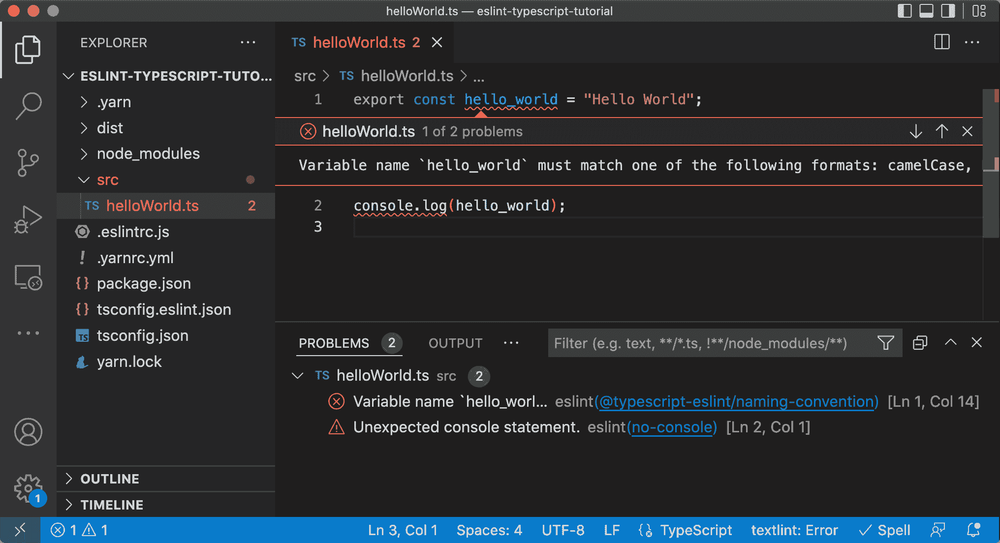
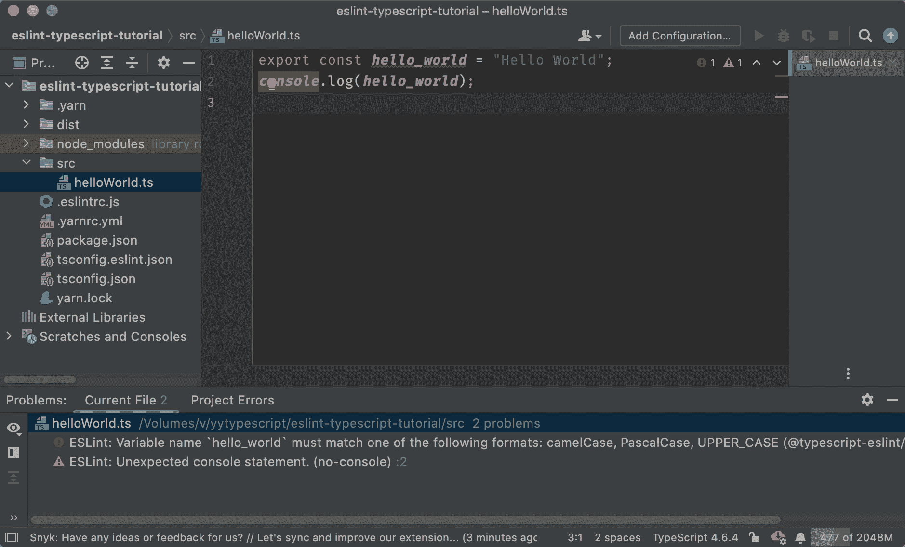
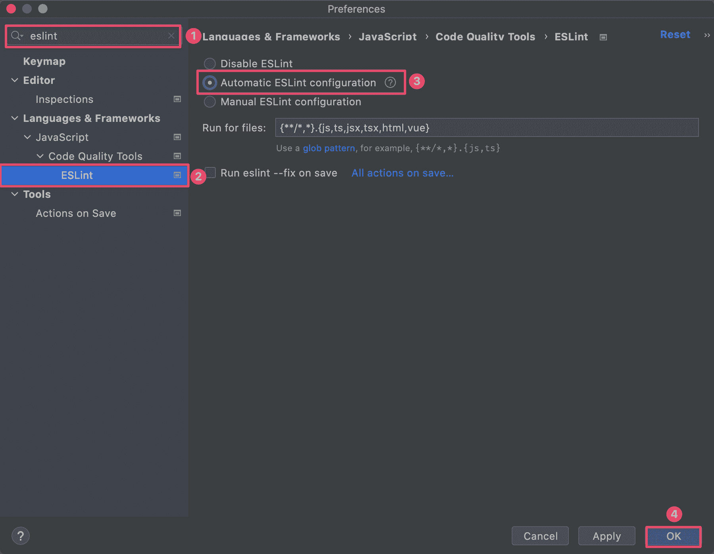

# 使用 ESLint 自动化检查 TypeScript 的编码规范

> 原文：[`typescriptbook.jp/tutorials/eslint`](https://typescriptbook.jp/tutorials/eslint)

本章将以教程形式学习如何使用<ruby>ESLint<rt>イーエスリント</rt></ruby>检查 TypeScript。

## 本章中可以学到的内容​

本章将教您以下内容。

+   编码规范的必要性和问题

+   使用 ESLint 检查 JavaScript 和 TypeScript 的方法

+   设置 ESLint 规则的方法

+   利用 ESLint 应用 Airbnb 的编码规范

+   解决错误的方法

+   如何部分禁用检查

+   如何集成 VS Code 和 JetBrains IDE 与 ESLint

完成教程后，您将掌握在实际工作中有用的基本技能，如在自己的项目中引入 ESLint。

## 本章的流程和阅读方式​

本章分为以下 3 部分。

+   背景知識

+   ESLintでJavaScriptをリントしよう

+   ESLintでTypeScriptをリントしよう

本章的前半部分是理论学习。针对不了解“编码规范”或“代码检查工具”的人，将解释这些背景知识(背景知識)。如果您已经了解编码规范或代码检查工具，或者想立即动手的人，可以跳过这部分。

本章的后半部分是教程。本章的目标是让您能够使用 ESLint 检查 TypeScript。然而，在 ESLint 中处理 TypeScript 是一种高级用法。因此，教程的流程是，首先作为基础部分，学习如何在 ESLint 中处理 JavaScript(ESLintでJavaScriptをリントしよう)。然后，学习如何在 ESLint 中处理 TypeScript(ESLintでTypeScriptをリントしよう)。

在章节末尾，还提供了其他教程作为额外内容。如果您感兴趣并有余力，也可以查看这些内容。

+   集成 VS Code 和 ESLint

+   集成 JetBrains IDE 和 ESLint

## 本教程所需的内容​

本教程所需的内容如下。

+   Node.js v16 以上

+   NPM v7 系列以上

+   Yarn v1 系列（本教程已在 v1.22.18 上进行了测试）

有关 Node.js 的安装，请参阅准备开发环境。

使用 Yarn 作为包管理工具。首先安装它。如果您已经安装了，请跳过这一步。

```
shell`npm install -g yarn`
```

```
shell`npm install -g yarn`
```

## 背景知识​

### TypeScript 的写法有多种​

不仅限于 TypeScript，编程语言都有语法规则。遵循语法编写的代码可以无错误地执行或编译。

只要程序遵循语法，无论谁写的代码都不会完全相同。例如，在 TypeScript 中，可以省略语句末尾的分号。下面两行代码的区别在于是否有分号。这两种写法都是语法正确的，使用哪种取决于个人喜好。

```
ts`<data-lsp lsp="namespace console
var console: Console">console</data-lsp>.<data-lsp lsp="(method) Console.log(message?: any, ...optionalParams: any[]): void (+1 overload)">log</data-lsp>("OK")<data-lsp lsp="namespace console
var console: Console">console</data-lsp>.<data-lsp lsp="(method) Console.log(message?: any, ...optionalParams: any[]): void (+1 overload)">log</data-lsp>("OK");`
```

```
ts`<data-lsp lsp="namespace console
var console: Console">console</data-lsp>.<data-lsp lsp="(method) Console.log(message?: any, ...optionalParams: any[]): void (+1 overload)">log</data-lsp>("OK")<data-lsp lsp="namespace console
var console: Console">console</data-lsp>.<data-lsp lsp="(method) Console.log(message?: any, ...optionalParams: any[]): void (+1 overload)">log</data-lsp>("OK");`
```

字符串可以用单引号、双引号和反引号的三种方式编写。单引号和双引号在功能上没有区别。反引号称为模板文字，与字符串文字的规范不同。但是，在像下面这样简单的字符串中，这三种方式具有相同的含义。

```
ts`<data-lsp lsp="namespace console
var console: Console">console</data-lsp>.<data-lsp lsp="(method) Console.log(message?: any, ...optionalParams: any[]): void (+1 overload)">log</data-lsp>('OK');<data-lsp lsp="namespace console
var console: Console">console</data-lsp>.<data-lsp lsp="(method) Console.log(message?: any, ...optionalParams: any[]): void (+1 overload)">log</data-lsp>("OK");<data-lsp lsp="namespace console
var console: Console">console</data-lsp>.<data-lsp lsp="(method) Console.log(message?: any, ...optionalParams: any[]): void (+1 overload)">log</data-lsp>(`OK`);`
```

```
ts`<data-lsp lsp="namespace console
var console: Console">console</data-lsp>.<data-lsp lsp="(method) Console.log(message?: any, ...optionalParams: any[]): void (+1 overload)">log</data-lsp>('OK');<data-lsp lsp="namespace console
var console: Console">console</data-lsp>.<data-lsp lsp="(method) Console.log(message?: any, ...optionalParams: any[]): void (+1 overload)">log</data-lsp>("OK");<data-lsp lsp="namespace console
var console: Console">console</data-lsp>.<data-lsp lsp="(method) Console.log(message?: any, ...optionalParams: any[]): void (+1 overload)">log</data-lsp>(`OK`);`
```

这个例子是一个有争议的问题。根据本书的独立调查，“基本上使用哪种引号最多？”这个问题的回答是，单引号占 55%，其次是双引号占 29%，反引号占 16%。(共 232 个回答)


上述例子只是一个例子。有很多意义相同但写法不同的例子。

### 写法的差异也可能成为问题​

书写方式的差异可能成为问题。例如，在共同开发程序的情况下。如果每个人的书写方式不同，可能会让人感到困惑或惊讶，导致无法理解代码的主要内容。如果缩进宽度不统一，代码可能会变得难以阅读。结果，**书写方式的差异会影响程序的可维护性**。

### 通过编码规范统一书写方式​

理想情况下，无论谁写，代码都应该相同。为了实现这一目标，有什么方法呢？其中之一是制定书写规则。**书写规则被称为“编码标准(coding standards)”**。

在编码规范中，例如，可以规定以下内容。

+   变量名应该使用驼峰命名法。

+   `function`的括号应该与函数名写在同一行。(不应该放在下一行)

+   应该删除`console.log`。

+   在 if 语句的条件中不要进行变量赋值。例如`if (data = getData())`是不行的。

虽然可以制定这样的规则来制定规范，但要将其制定为实用的规范需要相当大的努力。在实际工作中，借用已公开的规范更为现实。

公开的规范主要包括以下内容。这些规范实际上在许多项目中被广泛使用。

+   [Google JavaScript 风格指南](https://google.github.io/styleguide/jsguide.html)

+   [JavaScript 标准风格](https://standardjs.com/rules.html)

+   [Airbnb JavaScript 风格指南](https://github.com/airbnb/javascript)

如果团队中的每个人都遵守编码规范，就更容易统一书写方式。

### 编码规范的问题​

编码规范也存在问题。

#### 运用的手续并不简单​

只要每个开发者遵守规范，编码规范就会起作用。但是，人为错误是难以避免的。有时候会违反规范，但更多的是不知不觉中违反或者出错。如果规范没有被遵守，规范就会变成形式上的东西。这样一来，统一书写的目标就无法实现。

要防止人为错误，必须每天检查代码是否**符合规范**。但是，这需要大量的工作。在有更重要的工作的情况下，可能无法进行检查。要正确运用规范，需要付出很多努力。

#### 增加了沟通上的心理负担​

编码规范确定了什么是正确的，什么是错误的。因此，明显的错误代码会出现。也会出现指出他人编写的错误代码的情况。**指出他人工作中的错误是困难的**。这比想象中的心理负担要大。指出方会努力避免让对方感到不快。被指出方也可能无法积极接受。根据与对方的人际关系，有时可能会避免指出。

### 编码规范的自动化​

要统一书写方式，编码规范是必不可少的。但是，运用的手续和心理问题也是存在的。解决这些问题的工具是 ESLint。**ESLint 是一个检查 JavaScript 和 TypeScript 代码是否符合编码规范的工具**。

ESLint 可以通过一个命令进行检查。检查只需几秒钟，结果立即可见。因此，检查的工作几乎没有任何麻烦。

此外，还有自动修正功能。有些代码可能会被 ESLint 修正为符合规范的代码。如果可以使用此功能，则可以省去修改违规处的麻烦。

奇怪的是，即使是相同的指出，被机器指出比被人指出更轻松。由于 ESLint 可以机械地指出问题，因此可以减轻沟通上的心理负担。

引入 ESLint 后，开发人员可以摆脱规范的运用和心理压力，**更专注于开发等更重要的工作**。

##### 学习分享

📝TypeScript 即使在相同的意义处理下也可以有不同的书写方式

💥在团队开发中，书写方式的差异可能成为问题…

🤝为了统一书写方式，让我们引入编码规范

😵但是，规范也存在运用的手续和心理问题

✅这个问题可以通过 ESLint 解决！

『生存 TypeScript』摘录

[この内容をツイートする](https://twitter.com/intent/tweet?text=%F0%9F%93%9DTypeScript%E3%81%AF%E5%90%8C%E3%81%98%E6%84%8F%E5%91%B3%E5%87%A6%E7%90%86%E3%81%A7%E3%82%82%E7%95%B0%E3%81%AA%E3%82%8B%E6%9B%B8%E3%81%8D%E6%96%B9%E3%81%8C%E5%8F%AF%E8%83%BD%0A%F0%9F%92%A5%E3%83%81%E3%83%A0%E9%96%8B%E7%99%BA%E3%81%A7%E3%81%AF%E6%9B%B8%E3%81%8D%E6%96%B9%E3%81%AE%E9%81%95%E3%81%84%E3%81%8C%E5%95%8F%E9%A1%8C%E3%81%AB%E3%81%AA%E3%82%8B%E3%81%93%E3%81%A8%E3%82%82%E2%80%A6%0A%F0%9F%A4%9D%E6%9B%B8%E3%81%8D%E6%96%B9%E7%B5%B1%E4%B8%80%E3%81%AE%E3%81%9F%E3%82%81%E3%81%AB%E3%82%B3%E3%83%BC%E3%83%87%E3%82%A3%E3%83%B3%E3%82%B0%E8%A6%8F%E7%B4%84%E3%82%92%E5%B0%8E%E5%85%A5%E3%81%97%E3%82%88%E3%81%86%0A%F0%9F%98%B5%E3%81%A7%E3%82%82%E3%80%81%E8%A6%8F%E7%B4%84%E3%81%AB%E3%81%AF%E9%81%8B%E7%94%A8%E3%81%AE%E6%89%8B%E9%96%93%E3%82%84%E5%BF%83%E7%90%86%E7%9A%84%E3%81%AA%E8%AA%B2%E9%A1%8C%E3%82%82%E3%81%82%E3%82%8B%0A%E2%9C%85%E3%81%93%E3%81%AE%E8%AA%B2%E9%A1%8C%E3%81%AFESLint%E3%81%A7%E8%A7%A3%E6%B1%BA%E3%81%A7%E3%81%8D%E3%82%8B%EF%BC%81%0A%0A%E3%80%8E%E3%82%B5%E3%83%90%E3%82%A4%E3%83%90%E3%83%ABTypeScript%E3%80%8F%E3%82%88%E3%82%8A)

### リンターとは​

ESLintは一般的に「リンター(linter)」というジャンルのツールです。リンターは、プログラムを**静的に解析し、バグや問題点を発見するツール**を言います。リンターを使って、問題点を解析することを「リントする(lint)」と言います。

リント(lint)の由来は紡績です。羊毛や綿花から、繊維をつむぐ際に不要になるホコリのような糸くずをリントと呼びます。紡績ではリントを取り除く工程があり、これにちなんでプログラミングでもリントという名前が使われだしたと言われています。

### コンパイラとリンターの違い​

コンパイラの本質は、ある言語から別の言語に変換することです。TypeScriptコンパイラの場合は、TypeScriptからJavaScriptへの変換です。

リンターの本質は、プログラムの問題点を指摘することです。言語から言語への変換は行いません。

実際は、TypeScriptコンパイラもプログラムの問題点を報告します。たとえば、コンパイラオプション`noUnusedLocals`を有効にすると、未使用の変数をチェックできます。ESLintにもこれと同等のチェックがあります。こうした点はリンターの機能と重複する部分です。

類似のチェック機能があるものの、両者は得意分野が異なります。TypeScriptコンパイラは型のチェックが充実しています。型の側面から問題点を発見するのが得意です。一方、ESLintはインデントや命名規則などのコーディングスタイルや、どのようなコードを書くべきか避けるべきかの意思決定、セキュリティやパフォーマンスに関する分野でのチェックが充実しています。どちらも相互補完的な関係です。したがって、コンパイラとリンターの両方を導入すると、より幅広いチェックが行えるようになります。

TypeScriptコンパイラとESLintの得意分野の比較

|  | TypeScriptコンパイラ | ESLint |
| --- | :-: | :-: |
| 言語から言語への変換 | ○ |  |
| 型のチェック | ○ |  |
| 構文チェック | ○ | ○ |
| コーディングスタイル |  | ○ |
| コードの意思決定 |  | ○ |
| セキュリティ |  | ○ |
| パフォーマンス |  | ○ |

##### 学びをシェアする

🧵リンター：コードを静的解析し問題点を指摘するツール。ESLintはリンター。

🔀コンパイラ：静的解析もするが、別言語への変換が主目的。tscはコンパイラ。

⚖️tscとESLintの相違点

・tsc：型のチェックが得意

・ESLint：コーディング規約のチェックが得意

『サバイバルTypeScript』より

[この内容をツイートする](https://twitter.com/intent/tweet?text=%F0%9F%A7%B5%E3%83%AA%E3%83%B3%E3%82%BF%E3%83%BC%EF%BC%9A%E3%82%B3%E3%83%BC%E3%83%89%E3%82%92%E9%9D%99%E7%9A%84%E8%A7%A3%E6%9E%90%E3%81%97%E5%95%8F%E9%A1%8C%E7%82%B9%E3%82%92%E6%8C%87%E6%91%98%E3%81%99%E3%82%8B%E3%83%84%E3%83%BC%E3%83%AB%E3%80%82ESLint%E3%81%AF%E3%83%AA%E3%83%B3%E3%82%BF%E3%83%BC%E3%80%82%0A%F0%9F%94%80%E3%82%B3%E3%83%B3%E3%83%91%E3%82%A4%E3%83%A9%EF%BC%9A%E9%9D%99%E7%9A%84%E8%A7%A3%E6%9E%90%E3%82%82%E3%81%99%E3%82%8B%E3%81%8C%E3%80%81%E5%88%A5%E8%A8%80%E8%AA%9E%E3%81%B8%E3%81%AE%E5%A4%89%E6%8F%9B%E3%81%8C%E4%B8%BB%E7%9B%AE%E7%9A%84%E3%80%82tsc%E3%81%AF%E3%82%B3%E3%83%B3%E3%83%91%E3%82%A4%E3%83%A9%E3%80%82%0A%0A%E2%9A%96%EF%B8%8Ftsc%E3%81%A8ESLint%E3%81%AE%E7%9B%B8%E9%81%95%E7%82%B9%0A%E3%83%BBtsc%EF%BC%9A%E5%9E%8B%E3%81%AE%E3%83%81%E3%82%A7%E3%83%83%E3%82%AF%E3%81%8C%E5%BE%97%E6%84%8F%0A%E3%83%BBESLint%EF%BC%9A%E3%82%B3%E3%83%BC%E3%83%87%E3%82%A3%E3%83%B3%E3%82%B0%E8%A6%8F%E7%B4%84%E3%81%AE%E3%83%81%E3%82%A7%E3%83%83%E3%82%AF%E3%81%8C%E5%BE%97%E6%84%8F%0A%0A%E3%80%8E%E3%82%B5%E3%83%90%E3%82%A4%E3%83%90%E3%83%ABTypeScript%E3%80%8F%E3%82%88%E3%82%8A)

## ESLintでJavaScriptをリントしよう

ここからはESLintの導入方法や使い方をチュートリアル形式で説明していきます。ぜひお手元の環境で実際にトライしてみてください。

### プロジェクトを作成する

まず、このチュートリアルに使うプロジェクトを作成します。

```
shell`mkdir eslint-tutorialcd eslint-tutorial`
```

```
shell`mkdir eslint-tutorialcd eslint-tutorial`
```

プロジェクトルートにpackage.jsonを作ってください。その内容は次のようにします。

```
package.jsonjson`{  "name":  "eslint-tutorial",  "license":  "UNLICENSED"}`
```

```
package.jsonjson`{  "name":  "eslint-tutorial",  "license":  "UNLICENSED"}`
```

### ESLintを導入する

ESLintはYarnでインストールしましょう。ESLintは開発時だけ使うパッケージなので、`yarn add`コマンドには`-D`オプションをつけてインストールします。

```
shell`yarn add -D 'eslint@⁸'`
```

```
shell`yarn add -D 'eslint@⁸'`
```

備考

Next.jsは最初からESLintが導入されています。実務でNext.jsプロジェクトでESLintを使う場合は、導入ステップは省略できます。

ESLintが正しくインストールされたか、バージョンを表示して確認してください。

```
shell`npx eslint -vv8.15.0`
```

```
shell`npx eslint -vv8.15.0`
```

ちなみにこの`npx`コマンドは、Nodeモジュール(ライブラリ)の実行ファイルを起動するツールです。`npx eslint`を実行すると、`./node_modules/.bin/eslint`が実行されます。

### ESLintの設定ファイルを作る

ESLintの設定ファイル`.eslintrc.js`をプロジェクトルートに作ってください。

```
shell`touch .eslintrc.js`
```

```
shell`touch .eslintrc.js`
```

```
設定ファイル作成後のディレクトリ構造 text`.├── .eslintrc.js├── node_modules├── package.json└── yarn.lock`
```

```
設定ファイル作成後のディレクトリ構造 text`.├── .eslintrc.js├── node_modules├── package.json└── yarn.lock`
```

設定ファイルの内容は次のようにします。

```
.eslintrc.jsjs`<data-lsp lsp="module export=
(property) export=: {
    root: boolean;
    env: {
        browser: boolean;
        es2021: boolean;
    };
    parserOptions: {
        ecmaVersion: string;
        sourceType: string;
    };
}">module</data-lsp>.<data-lsp lsp="module export=
(property) export=: {
    root: boolean;
    env: {
        browser: boolean;
        es2021: boolean;
    };
    parserOptions: {
        ecmaVersion: string;
        sourceType: string;
    };
}">exports</data-lsp>  = { <data-lsp lsp="(property) root: boolean">root</data-lsp>:  true, <data-lsp lsp="(property) env: {
    browser: boolean;
    es2021: boolean;
}">env</data-lsp>: { <data-lsp lsp="(property) browser: boolean">browser</data-lsp>:  true, <data-lsp lsp="(property) es2021: boolean">es2021</data-lsp>:  true, }, <data-lsp lsp="(property) parserOptions: {
    ecmaVersion: string;
    sourceType: string;
}">parserOptions</data-lsp>: { <data-lsp lsp="(property) ecmaVersion: string">ecmaVersion</data-lsp>:  "latest", <data-lsp lsp="(property) sourceType: string">sourceType</data-lsp>:  "module", },};`
```

```
.eslintrc.jsjs`<data-lsp lsp="module export=
(property) export=: {
    root: boolean;
    env: {
        browser: boolean;
        es2021: boolean;
    };
    parserOptions: {
        ecmaVersion: string;
        sourceType: string;
    };
}">module</data-lsp>.<data-lsp lsp="module export=
(property) export=: {
    root: boolean;
    env: {
        browser: boolean;
        es2021: boolean;
    };
    parserOptions: {
        ecmaVersion: string;
        sourceType: string;
    };
}">exports</data-lsp>  = { <data-lsp lsp="(property) root: boolean">root</data-lsp>:  true, <data-lsp lsp="(property) env: {
    browser: boolean;
    es2021: boolean;
}">env</data-lsp>: { <data-lsp lsp="(property) browser: boolean">browser</data-lsp>:  true, <data-lsp lsp="(property) es2021: boolean">es2021</data-lsp>:  true, }, <data-lsp lsp="(property) parserOptions: {
    ecmaVersion: string;
    sourceType: string;
}">parserOptions</data-lsp>: { <data-lsp lsp="(property) ecmaVersion: string">ecmaVersion</data-lsp>:  "latest", <data-lsp lsp="(property) sourceType: string">sourceType</data-lsp>:  "module", },};`
```

この設定内容は次で説明します。

#### `root`​

`eslint`コマンドを実行したディレクトリを起点に、ディレクトリをさかのぼって設定ファイルを探す仕様がESLintにはあります。たとえば、ディレクトリ`/a/b/`でコマンドを実行した場合、ESLintは次の順で設定ファイルを探します。

1.  `/a/b/.eslintrc.js`

1.  `/a/.eslintrc.js`

1.  `/.eslintrc.js`

この探索はルートディレクトリに達するまでさかのぼります。探索中に複数の設定ファイルが見つかった場合は、設定内容がマージされていきます。この仕様は便利な反面、プロジェクト外の設定ファイルまで見にいってしまう危険性もあります。設定ファイルの探索範囲をしぼるためにも、`root`に`true`を設定するのがお勧めです。これがある設定ファイルが見つかると、これ以上ディレクトリをさかのぼらなくなります。

#### `env`​

`env`はチェック対象のJavaScript/TypeScriptコードがどの実行環境で使われるかをESLintに伝えるためのオプションです。これを設定すると、ESLintがグローバル変数を認識するようになります。たとえば、`browser: true`を設定すると、`window`や`alert`などのグローバル変数が認識されます。`es2021`を設定すると、ES2021までに導入されたグローバル変数が認識されます。他にも`node`などの指定ができます。指定できる実行環境の一覧は[公式ドキュメント](https://eslint.org/docs/user-guide/configuring/language-options#specifying-environments)をご覧ください。

この設定は、ESLintの[no-undefルール](https://eslint.org/docs/rules/no-undef)に関係します。このルールは未定義の変数をチェックするルールです。グローバル変数は定義せずに利用できる変数です。ESLintはどのグローバル変数が定義済みかを知らないと、このルールを正しく適用できません。そのため、`env`オプションは正しく設定する必要があります。

#### `parserOptions`​

##### `ecmaVersion`​

`parserOptions`はチェック対象のJavaScriptがどの構文を使っているかをESLintに伝えるためのオプションです。`ecmaVersion`は、どの���ージョンのECMAScriptの構文を使うかを指定します。`"latest"`を設定すると、最新のECMAScriptの構文を使うという指定になります。デフォルトではECMAScript 5になっています。これはかなり古いバージョンです。実務ではES5で開発することはまれなので、ここは必ず指定しましょう。なお、`env`オプションで`es2022`などECMAScriptのバージョンを指定している場合、`ecmaVersion`にも自動的に`es2022`が設定されます。どちらも同じバージョンを指定する場合は、`ecmaVersion`の指定は省略できます。

##### `sourceType`​

JavaScriptにはスクリプトモードとモジュールモードがあります。`sourceType`はJavaScriptコードがどちらのモードで書かれるかを指定するオプションです。モジュールモードでは、`import`文や`export`文といった追加の構文がサポートされます。`sourceType`のデフォルト値は`"script"`(スクリプトモード)です。実務で開発する場合は、モジュールモードでJavaScript/TypeScriptを書くほうが普通なので、`sourceType`には`"module"`(モジュールモード)を指定しましょう。

### ESLintのルールを設定する​

ESLintには「ルール(rule)」という概念があります。ルールはチェックの最小単位です。たとえば、ルールには次のようなものがあります。

+   `no-console`: `console.log`を書いてはならない

+   `camelcase`: 変数名はキャメルケースにすること

+   `semi`: 文末セミコロンは省略しない

ESLintには200を超えるルールがあります。[全ルールのリストは公式ドキュメント](https://eslint.org/docs/rules/)にあります。

ESLintでは、複数のルールを組み合わせてコーディング規約を組み立てていきます。

ルールには、重大度(severity)という重み付けが設定できます。重大度は、`off`、`warn`と`error`の3 種類です。`off`はルールを無効化し、チェックを行わなくする設定です。`warn`は発見した問題を警告として報告します。報告はするものの、`eslint`コマンドの終了コードには影響しません。`error`は発見した問題をエラーとして報告し、終了コードを1にする効果があります。それぞれの重大度は、`0`から`2`までの数値で設定することもできます。

ESLintの重大度

| 重大度 | 数値 | 効果 |
| --- | --- | --- |
| off | 0 | ルールをオフにする |
| warn | 1 | 警告するが終了コードに影響しない |
| error | 2 | 警告し、終了コードを1にする |

ルールは`.eslintrc.js`の`rules`フィールドに、`ルール名: 重大度`のキーバリュー形式で書きます。まずは、`no-console`をルールに追加してみましょう。

```
.eslintrc.jsjs`<data-lsp lsp="module export=
(property) export=: {
    root: boolean;
    env: {
        browser: boolean;
        es2021: boolean;
    };
    parserOptions: {
        ecmaVersion: string;
        sourceType: string;
    };
    rules: {
        &quot;no-console&quot;: string;
    };
}">module</data-lsp>.<data-lsp lsp="module export=
(property) export=: {
    root: boolean;
    env: {
        browser: boolean;
        es2021: boolean;
    };
    parserOptions: {
        ecmaVersion: string;
        sourceType: string;
    };
    rules: {
        &quot;no-console&quot;: string;
    };
}">exports</data-lsp>  = { <data-lsp lsp="(property) root: boolean">root</data-lsp>:  true, <data-lsp lsp="(property) env: {
    browser: boolean;
    es2021: boolean;
}">env</data-lsp>: { <data-lsp lsp="(property) browser: boolean">browser</data-lsp>:  true, <data-lsp lsp="(property) es2021: boolean">es2021</data-lsp>:  true, }, <data-lsp lsp="(property) parserOptions: {
    ecmaVersion: string;
    sourceType: string;
}">parserOptions</data-lsp>: { <data-lsp lsp="(property) ecmaVersion: string">ecmaVersion</data-lsp>:  "latest", <data-lsp lsp="(property) sourceType: string">sourceType</data-lsp>:  "module", }, <data-lsp lsp="(property) rules: {
    &quot;no-console&quot;: string;
}">rules</data-lsp>: {  "no-console":  "error", },};`
```

```
.eslintrc.jsjs`<data-lsp lsp="module export=
(property) export=: {
    root: boolean;
    env: {
        browser: boolean;
        es2021: boolean;
    };
    parserOptions: {
        ecmaVersion: string;
        sourceType: string;
    };
    rules: {
        &quot;no-console&quot;: string;
    };
}">module</data-lsp>.<data-lsp lsp="module export=
(property) export=: {
    root: boolean;
    env: {
        browser: boolean;
        es2021: boolean;
    };
    parserOptions: {
        ecmaVersion: string;
        sourceType: string;
    };
    rules: {
        &quot;no-console&quot;: string;
    };
}">exports</data-lsp>  = { <data-lsp lsp="(property) root: boolean">root</data-lsp>:  true, <data-lsp lsp="(property) env: {
    browser: boolean;
    es2021: boolean;
}">env</data-lsp>: { <data-lsp lsp="(property) browser: boolean">browser</data-lsp>:  true, <data-lsp lsp="(property) es2021: boolean">es2021</data-lsp>:  true, }, <data-lsp lsp="(property) parserOptions: {
    ecmaVersion: string;
    sourceType: string;
}">parserOptions</data-lsp>: { <data-lsp lsp="(property) ecmaVersion: string">ecmaVersion</data-lsp>:  "latest", <data-lsp lsp="(property) sourceType: string">sourceType</data-lsp>:  "module", }, <data-lsp lsp="(property) rules: {
    &quot;no-console&quot;: string;
}">rules</data-lsp>: {  "no-console":  "error", },};`
```

ルールによっては、細かく設定できるものもあります。たとえば、`camelcase`です。これは変数名がキャメルケースかをチェックするルールです。変数の種類によっては、キャメルケース以外が使いたい場合があります。たとえば、プロパティ名はアンダースコアを使いたいことがあるかもしれません。ウェブAPIによっては、JSONオブジェクトがスネークケース(`foo_bar`のようなアンダースコア区切り)を採用している場合があるからです。この場合、`ルール名: [重大度, 設定値]`のような配列形式で設定することで、細かいルール設定ができます。次の設定例は、プロパティ名に限ってはキャメルケースを強制しない設定です。試しに、この設定を`.eslintrc.js`に加えてみましょう。

```
.eslintrc.jsjs`<data-lsp lsp="module export=
(property) export=: {
    root: boolean;
    env: {
        browser: boolean;
        es2021: boolean;
    };
    parserOptions: {
        ecmaVersion: string;
        sourceType: string;
    };
    rules: {
        &quot;no-console&quot;: string;
        camelcase: (string | {
            properties: string;
        })[];
    };
}">module</data-lsp>.<data-lsp lsp="module export=
(property) export=: {
    root: boolean;
    env: {
        browser: boolean;
        es2021: boolean;
    };
    parserOptions: {
        ecmaVersion: string;
        sourceType: string;
    };
    rules: {
        &quot;no-console&quot;: string;
        camelcase: (string | {
            properties: string;
        })[];
    };
}">exports</data-lsp>  = { <data-lsp lsp="(property) root: boolean">root</data-lsp>:  true, <data-lsp lsp="(property) env: {
    browser: boolean;
    es2021: boolean;
}">env</data-lsp>: { <data-lsp lsp="(property) browser: boolean">browser</data-lsp>:  true, <data-lsp lsp="(property) es2021: boolean">es2021</data-lsp>:  true, }, <data-lsp lsp="(property) parserOptions: {
    ecmaVersion: string;
    sourceType: string;
}">parserOptions</data-lsp>: { <data-lsp lsp="(property) ecmaVersion: string">ecmaVersion</data-lsp>:  "latest", <data-lsp lsp="(property) sourceType: string">sourceType</data-lsp>:  "module", }, <data-lsp lsp="(property) rules: {
    &quot;no-console&quot;: string;
    camelcase: (string | {
        properties: string;
    })[];
}">rules</data-lsp>: {  "no-console":  "error", <data-lsp lsp="(property) camelcase: (string | {
    properties: string;
})[]">camelcase</data-lsp>: ["error", { <data-lsp lsp="(property) properties: string">properties</data-lsp>:  "never" }], },};`
```

```
.eslintrc.jsjs`<data-lsp lsp="module export=
(property) export=: {
    root: boolean;
    env: {
        browser: boolean;
        es2021: boolean;
    };
    parserOptions: {
        ecmaVersion: string;
        sourceType: string;
    };
    rules: {
        &quot;no-console&quot;: string;
        camelcase: (string | {
            properties: string;
        })[];
    };
}">module</data-lsp>.<data-lsp lsp="module export=
(property) export=: {
    root: boolean;
    env: {
        browser: boolean;
        es2021: boolean;
    };
    parserOptions: {
        ecmaVersion: string;
        sourceType: string;
    };
    rules: {
        &quot;no-console&quot;: string;
        camelcase: (string | {
            properties: string;
        })[];
    };
}">exports</data-lsp>  = { <data-lsp lsp="(property) root: boolean">root</data-lsp>:  true, <data-lsp lsp="(property) env: {
    browser: boolean;
    es2021: boolean;
}">env</data-lsp>: { <data-lsp lsp="(property) browser: boolean">browser</data-lsp>:  true, <data-lsp lsp="(property) es2021: boolean">es2021</data-lsp>:  true, }, <data-lsp lsp="(property) parserOptions: {
    ecmaVersion: string;
    sourceType: string;
}">parserOptions</data-lsp>: { <data-lsp lsp="(property) ecmaVersion: string">ecmaVersion</data-lsp>:  "latest", <data-lsp lsp="(property) sourceType: string">sourceType</data-lsp>:  "module", }, <data-lsp lsp="(property) rules: {
    &quot;no-console&quot;: string;
    camelcase: (string | {
        properties: string;
    })[];
}">rules</data-lsp>: {  "no-console":  "error", <data-lsp lsp="(property) camelcase: (string | {
    properties: string;
})[]">camelcase</data-lsp>: ["error", { <data-lsp lsp="(property) properties: string">properties</data-lsp>:  "never" }], },};`
```

ここまでのふりかえり

+   package.jsonを作りました。

+   eslintをインストールしました。

+   設定ファイル`.eslintrc.js`を作りました。

+   設定ファイルには次のルールを追加しました。

    +   `no-console`: `console.log`をコードに残しておいてはいけない。

    +   `camelcase`: 変数名はキャメルケースにすること(プロパティ名を除く)。

### JavaScriptをチェックする​

設定ファイルが準備できたので、JavaScriptファイルを作り、ESLintでチェックしてみましょう。

まず、`src`ディレクトリを作ってください。

```
shell`mkdir src`
```

```
shell`mkdir src`
```

`src`ディレクトリにJavaScriptファイル`helloWorld.js`を作ってください。

```
shell`touch src/helloWorld.js`
```

```
shell`touch src/helloWorld.js`
```

`helloWorld.js`が加わったディレクトリ構造が、次のようになっているか確認してください。

```
txt`.├── .eslintrc.js├── node_modules├── package.json├── src│   └── helloWorld.js└── yarn.lock`
```

```
txt`.├── .eslintrc.js├── node_modules├── package.json├── src│   └── helloWorld.js└── yarn.lock`
```

`helloWorld.js`の内容は次のようにします。

```
src/helloWorld.jsjs`export  const  <data-lsp lsp="const hello_world: &quot;Hello World&quot;">hello_world</data-lsp>  =  "Hello World";<data-lsp lsp="namespace console
var console: Console">console</data-lsp>.<data-lsp lsp="(method) Console.log(message?: any, ...optionalParams: any[]): void (+1 overload)">log</data-lsp>(<data-lsp lsp="const hello_world: &quot;Hello World&quot;">hello_world</data-lsp>);`
```

```
src/helloWorld.jsjs`export  const  <data-lsp lsp="const hello_world: &quot;Hello World&quot;">hello_world</data-lsp>  =  "Hello World";<data-lsp lsp="namespace console
var console: Console">console</data-lsp>.<data-lsp lsp="(method) Console.log(message?: any, ...optionalParams: any[]): void (+1 overload)">log</data-lsp>(<data-lsp lsp="const hello_world: &quot;Hello World&quot;">hello_world</data-lsp>);`
```

この`helloWorld.js`は、わざとコーディング規約に違反するコードになっています。1 行目の変数`hello_world`はキャメルケースになっていません。2 行目では、使ってはいけない`console.log`が使われています。

では、ESLintでチェックを実行してみましょう。チェックは、`eslint`コマンドを起動するだけです。`eslint`コマンドは第一引数に、チェック対象のファイル名やディレクトリ名を指定します。ここでは、`src`ディレクトリ全体をチェックするために、引数は`src`にします。

```
srcディレクトリをESLintでチェックするshell`npx eslint src`
```

```
srcディレクトリをESLintでチェックするshell`npx eslint src`
```

これを実行すると、次の出力が表示されます。


#### 結果の読み方​

チェックした結果、問題点が見つかると表形式で詳細が表示されます。各行は4つの列からなります。左から順に、コードの行番号列番号、重大度、問題点の説明、ルール名です。


結果に表示されている内容だけでは、どうして問題点になっているのか、どう直したらいいのかが分からないことがあります。その場合は、ルール名からESLintのドキュメントでルールの詳細を調べます。たとえば、上の結果ではルール名に`no-console`が挙がっていますが、この文字列をもとにルールの詳細を探します。`no-console`の詳細ページは、[`eslint.org/docs/rules/no-console`](https://eslint.org/docs/rules/no-console)にあります。

### コードを修正してエラーを解消する​

```
src/helloWorld.jsjs`export  const  <data-lsp lsp="const hello_world: &quot;Hello World&quot;">hello_world</data-lsp>  =  "Hello World";<data-lsp lsp="namespace console
var console: Console">console</data-lsp>.<data-lsp lsp="(method) Console.log(message?: any, ...optionalParams: any[]): void (+1 overload)">log</data-lsp>(<data-lsp lsp="const hello_world: &quot;Hello World&quot;">hello_world</data-lsp>);`
```

```
src/helloWorld.jsjs`export  const  <data-lsp lsp="const hello_world: &quot;Hello World&quot;">hello_world</data-lsp>  =  "Hello World";<data-lsp lsp="namespace console
var console: Console">console</data-lsp>.<data-lsp lsp="(method) Console.log(message?: any, ...optionalParams: any[]): void (+1 overload)">log</data-lsp>(<data-lsp lsp="const hello_world: &quot;Hello World&quot;">hello_world</data-lsp>);`
```

上のコードをESLintでチェックした結果、2つの問題点が指摘されました。

+   1 行目: 変数名`hello_world`がキャメルケースではない

+   2 行目: `console.log`は使ってはいけない

このエラーを解消したいので、`helloWorld.js`を編集してみましょう。変数名`hello_world`は`helloWorld`に変更します。2 行目の`console.log`は削除しましょう。修正後のコードは次のようになります。

```
src/helloWorld.jsjs`export  const  <data-lsp lsp="const helloWorld: &quot;Hello World&quot;">helloWorld</data-lsp>  =  "Hello World";`
```

```
src/helloWorld.jsjs`export  const  <data-lsp lsp="const helloWorld: &quot;Hello World&quot;">helloWorld</data-lsp>  =  "Hello World";`
```

再びESLintでチェックして、もう問題がなくなっているか確認してみましょう。

```
shell`npx eslint src`
```

```
shell`npx eslint src`
```

この実行結果に何も出力されなければ、問題点が解消されています。

### コードを自動修正する​

ESLintのルールの中には、コードの自動修正ができるものがあります。たとえば、[`semi`](https://eslint.org/docs/rules/semi)は、文末セミコロンをつけるつけないを定めるルールですが、これは自動修正に対応しています。ここでは、`semi`を使ってESLintの自動修正をためしてみましょう。

まず、設定ファイル`.eslintrc.js`の`rules`に`semi`を追加します。

```
.eslintrc.jsjs`<data-lsp lsp="module export=
(property) export=: {
    root: boolean;
    env: {
        browser: boolean;
        es2021: boolean;
    };
    parserOptions: {
        ecmaVersion: string;
        sourceType: string;
    };
    rules: {
        &quot;no-console&quot;: string;
        camelcase: (string | {
            properties: string;
        })[];
        semi: string[];
    };
}">module</data-lsp>.<data-lsp lsp="module export=
(property) export=: {
    root: boolean;
    env: {
        browser: boolean;
        es2021: boolean;
    };
    parserOptions: {
        ecmaVersion: string;
        sourceType: string;
    };
    rules: {
        &quot;no-console&quot;: string;
        camelcase: (string | {
            properties: string;
        })[];
        semi: string[];
    };
}">exports</data-lsp>  = { <data-lsp lsp="(property) root: boolean">root</data-lsp>:  true, <data-lsp lsp="(property) env: {
    browser: boolean;
    es2021: boolean;
}">env</data-lsp>: { <data-lsp lsp="(property) browser: boolean">browser</data-lsp>:  true, <data-lsp lsp="(property) es2021: boolean">es2021</data-lsp>:  true, }, <data-lsp lsp="(property) parserOptions: {
    ecmaVersion: string;
    sourceType: string;
}">parserOptions</data-lsp>: { <data-lsp lsp="(property) ecmaVersion: string">ecmaVersion</data-lsp>:  "latest", <data-lsp lsp="(property) sourceType: string">sourceType</data-lsp>:  "module", }, <data-lsp lsp="(property) rules: {
    &quot;no-console&quot;: string;
    camelcase: (string | {
        properties: string;
    })[];
    semi: string[];
}">rules</data-lsp>: {  "no-console":  "error", <data-lsp lsp="(property) camelcase: (string | {
    properties: string;
})[]">camelcase</data-lsp>: ["error", { <data-lsp lsp="(property) properties: string">properties</data-lsp>:  "never" }], <data-lsp lsp="(property) semi: string[]">semi</data-lsp>: ["error",  "always"], },};`
```

```
.eslintrc.jsjs`<data-lsp lsp="module export=
(property) export=: {
    root: boolean;
    env: {
        browser: boolean;
        es2021: boolean;
    };
    parserOptions: {
        ecmaVersion: string;
        sourceType: string;
    };
    rules: {
        &quot;no-console&quot;: string;
        camelcase: (string | {
            properties: string;
        })[];
        semi: string[];
    };
}">module</data-lsp>.<data-lsp lsp="module export=
(property) export=: {
    root: boolean;
    env: {
        browser: boolean;
        es2021: boolean;
    };
    parserOptions: {
        ecmaVersion: string;
        sourceType: string;
    };
    rules: {
        &quot;no-console&quot;: string;
        camelcase: (string | {
            properties: string;
        })[];
        semi: string[];
    };
}">exports</data-lsp>  = { <data-lsp lsp="(property) root: boolean">root</data-lsp>:  true, <data-lsp lsp="(property) env: {
    browser: boolean;
    es2021: boolean;
}">env</data-lsp>: { <data-lsp lsp="(property) browser: boolean">browser</data-lsp>:  true, <data-lsp lsp="(property) es2021: boolean">es2021</data-lsp>:  true, }, <data-lsp lsp="(property) parserOptions: {
    ecmaVersion: string;
    sourceType: string;
}">parserOptions</data-lsp>: { <data-lsp lsp="(property) ecmaVersion: string">ecmaVersion</data-lsp>:  "latest", <data-lsp lsp="(property) sourceType: string">sourceType</data-lsp>:  "module", }, <data-lsp lsp="(property) rules: {
    &quot;no-console&quot;: string;
    camelcase: (string | {
        properties: string;
    })[];
    semi: string[];
}">rules</data-lsp>: {  "no-console":  "error", <data-lsp lsp="(property) camelcase: (string | {
    properties: string;
})[]">camelcase</data-lsp>: ["error", { <data-lsp lsp="(property) properties: string">properties</data-lsp>:  "never" }], <data-lsp lsp="(property) semi: string[]">semi</data-lsp>: ["error",  "always"], },};`
```

このルール設定では、`"always"`を指定しています。これは、文末セミコロンを必須にする設定です。

つぎに、`src/helloWorld.js`のコードのセミコロンを消して保存してください。

```
src/helloWorld.jsjs`export  const  <data-lsp lsp="const helloWorld: &quot;Hello World&quot;">helloWorld</data-lsp>  =  "Hello World"`
```

```
src/helloWorld.jsjs`export  const  <data-lsp lsp="const helloWorld: &quot;Hello World&quot;">helloWorld</data-lsp>  =  "Hello World"`
```

自動修正の前にチェックだけを実行し、`semi`についての問題が報告されるか確認します。

```
shell`npx eslint src`
```

```
shell`npx eslint src`
```

次のような結果が表示されれば、追加した`semi`ルールが効いていることになります。


ESLintでコードを自動修正するには、`eslint`コマンドに`--fix`オプションをつけます。次のコマンドを実行し、自動修正してみましょう。

```
shell`npx eslint src --fix`
```

```
shell`npx eslint src --fix`
```

自動修正が成功していれば、出力は何も表示されずに処理が終了します。自動修正が効いているかを確認するために、`src/helloWorld.js`を開いてみてください。文末にセミコロンが追加されているでしょうか。追加されていれば自動修正成功です。

ここまでのふりかえり

+   `src/helloWorld.js`を作りました。

+   `npx eslint src`を実行し、`src`ディレクトリをチェックしてみました。

+   コードを手直しして、ESLintのチェックを通過する流れを体験しました。(`camelcase`, `no-console`)

+   `npx eslint src --fix`を実行し、ESLintの自動修正機能を試しました。(`semi`)

### ESLintにはどんなルールがある？​

ここまでのチュートリアルでは3つのルールを扱いました(`camelcase`、`no-console`、`semi`)。ESLintにはもっと多くのルールがあります。ルール数は200を超えます。

ルールの一覧は、[公式ドキュメントのRules](https://eslint.org/docs/rules/)にあります。この一覧では、どのルールが自動修正に対応しているかも確認できます。

### Shareable configを導入する​

ESLintのルールは数があまりにも多いため、ルールをひとつひとつ調べて導入していくのは大変です。そこで、お勧めなのがshareable configの活用です。

shareable configは、誰かが設定したルールのプリセットです。これを導入すると、自分でルールを設定する手間が省けます。

有名なshareable configのひとつに、ESLint 公式が公開している`eslint:recommended`があります。これを導入すると、[Rulesの一覧](https://eslint.org/docs/rules/)でチェックマークがついているルールが一括して有効化されます。これは公式が提供してるため有名ですが、有効になっているルールが少ないため、実務では物足りなさがあるかもしれません。

第三者が公開しているshareable configもあり、次にあげるものは実務でも広く使われています。

| 名前 | 作成 | 準拠するコーディング規約 |
| --- | --- | --- |
| [eslint-config-airbnb](https://www.npmjs.com/package/eslint-config-airbnb) | Airbnb | [Airbnb JavaScript Style Guide](https://github.com/airbnb/javascript)、[Airbnb React/JSX Style Guide](https://github.com/airbnb/javascript/tree/master/react) |
| [eslint-config-airbnb-base](https://www.npmjs.com/package/eslint-config-airbnb-base) | Airbnb | [Airbnb JavaScript Style Guide](https://github.com/airbnb/javascript) |
| [eslint-config-standard](https://www.npmjs.com/package/eslint-config-standard) | Standard JS | [JavaScript Standard Style](https://standardjs.com/rules.html) |
| [eslint-config-google](https://www.npmjs.com/package/eslint-config-google) | Google | [Google JavaScript Style Guide](https://google.github.io/styleguide/jsguide.html) |

上のshareable configはコーディング規約に基づいて作成されているため、文書としてのコーディング規約とESLintの設定をセットでプロジェクトに導入できる利点があります。

このチュートリアルでは、人気のAirbnbのものを使っていきます。Airbnbの設定には、[eslint-config-airbnb](https://www.npmjs.com/package/eslint-config-airbnb)と[eslint-config-airbnb-base](https://www.npmjs.com/package/eslint-config-airbnb-base)の2つがあります。前者は、React 向けの設定が追加で盛り込まれています。今回はReactは扱わないので、よりシンプルな後者を導入します。

各 shareable configのインストール件数の推移

[`npmcharts.com/compare/eslint-config-airbnb-base,eslint-config-airbnb,eslint-config-standard,eslint-config-google?interval=30&log=false&minimal=true`](https://npmcharts.com/compare/eslint-config-airbnb-base,eslint-config-airbnb,eslint-config-standard,eslint-config-google?interval=30&log=false&minimal=true)

まず、Yarnで`eslint-config-airbnb-base`をインストールします。その際、合わせて`eslint-plugin-import`も導入します。

```
shell`yarn add -D \  'eslint-config-airbnb-base@¹⁵' \  'eslint-plugin-import@²'`
```

```
shell`yarn add -D \  'eslint-config-airbnb-base@¹⁵' \  'eslint-plugin-import@²'`
```

次に、設定ファイル`.eslintrc.js`の`rules`を消します。その上で、`extends: ["airbnb-base"]`を追加してください。

```
.eslintrc.jsjs`<data-lsp lsp="module export=
(property) export=: {
    root: boolean;
    env: {
        browser: boolean;
        es2021: boolean;
    };
    parserOptions: {
        ecmaVersion: string;
        sourceType: string;
    };
    extends: string[];
}">module</data-lsp>.<data-lsp lsp="module export=
(property) export=: {
    root: boolean;
    env: {
        browser: boolean;
        es2021: boolean;
    };
    parserOptions: {
        ecmaVersion: string;
        sourceType: string;
    };
    extends: string[];
}">exports</data-lsp>  = { <data-lsp lsp="(property) root: boolean">root</data-lsp>:  true, <data-lsp lsp="(property) env: {
    browser: boolean;
    es2021: boolean;
}">env</data-lsp>: { <data-lsp lsp="(property) browser: boolean">browser</data-lsp>:  true, <data-lsp lsp="(property) es2021: boolean">es2021</data-lsp>:  true, }, <data-lsp lsp="(property) parserOptions: {
    ecmaVersion: string;
    sourceType: string;
}">parserOptions</data-lsp>: { <data-lsp lsp="(property) ecmaVersion: string">ecmaVersion</data-lsp>:  "latest", <data-lsp lsp="(property) sourceType: string">sourceType</data-lsp>:  "module", }, <data-lsp lsp="(property) extends: string[]">extends</data-lsp>: ["airbnb-base"],};`
```

```
.eslintrc.jsjs`<data-lsp lsp="module export=
(property) export=: {
    root: boolean;
    env: {
        browser: boolean;
        es2021: boolean;
    };
    parserOptions: {
        ecmaVersion: string;
        sourceType: string;
    };
    extends: string[];
}">module</data-lsp>.<data-lsp lsp="module export=
(property) export=: {
    root: boolean;
    env: {
        browser: boolean;
        es2021: boolean;
    };
    parserOptions: {
        ecmaVersion: string;
        sourceType: string;
    };
    extends: string[];
}">exports</data-lsp>  = { <data-lsp lsp="(property) root: boolean">root</data-lsp>:  true, <data-lsp lsp="(property) env: {
    browser: boolean;
    es2021: boolean;
}">env</data-lsp>: { <data-lsp lsp="(property) browser: boolean">browser</data-lsp>:  true, <data-lsp lsp="(property) es2021: boolean">es2021</data-lsp>:  true, }, <data-lsp lsp="(property) parserOptions: {
    ecmaVersion: string;
    sourceType: string;
}">parserOptions</data-lsp>: { <data-lsp lsp="(property) ecmaVersion: string">ecmaVersion</data-lsp>:  "latest", <data-lsp lsp="(property) sourceType: string">sourceType</data-lsp>:  "module", }, <data-lsp lsp="(property) extends: string[]">extends</data-lsp>: ["airbnb-base"],};`
```

これで、shareable configの導入は完了です。

チェックを試すために、`src/helloWorld.js`を次の内容に置き換えてください。

```
src/helloWorld.jsjs`export  const  <data-lsp lsp="const hello_world: &quot;Hello World&quot;">hello_world</data-lsp>  =  "Hello World";<data-lsp lsp="namespace console
var console: Console">console</data-lsp>.<data-lsp lsp="(method) Console.log(message?: any, ...optionalParams: any[]): void (+1 overload)">log</data-lsp>(<data-lsp lsp="const hello_world: &quot;Hello World&quot;">hello_world</data-lsp>);`
```

```
src/helloWorld.jsjs`export  const  <data-lsp lsp="const hello_world: &quot;Hello World&quot;">hello_world</data-lsp>  =  "Hello World";<data-lsp lsp="namespace console
var console: Console">console</data-lsp>.<data-lsp lsp="(method) Console.log(message?: any, ...optionalParams: any[]): void (+1 overload)">log</data-lsp>(<data-lsp lsp="const hello_world: &quot;Hello World&quot;">hello_world</data-lsp>);`
```

このコードはAirbnbの規約にわざと違反する内容になっています。

最後に`eslint`を実行し、チェックを動かしてみましょう。

```
shell`npx eslint src`
```

```
shell`npx eslint src`
```

すると、次のような結果が得られるはずです。


ここで報告されている問題点は、次のような内容になります。

+   `import/prefer-default-export`: デフォルトエクスポートを使わければなりません。

+   `camelcase`: 変数`hello_world`はキャメルケースでなければなりません。

+   `quotes`: 文字列リテラルはシングルクォートで囲む必要があります。

+   `no-console`: `console.log`は残しておいてはいけません。

続いて、shareable configのルールを上書きする方法を学んでいきましょう。

上の結果では、`import/prefer-default-export`違反が報告されていました。これは、名前付きエクスポート(`export const helloWorld = "..."`)ではなく、デフォルトエクスポート(`export default "..."`)にすべきというエラーです。しかし、ここでは名前付きエクスポートを使いたいので、このルールをオフにすることで警告されないようにしてみましょう。ルールを上書きするには、`.eslintrc.js`の`rules`に`"import/prefer-default-export": "off"`を追加します。

```
.eslintrc.jsjs`<data-lsp lsp="module export=
(property) export=: {
    root: boolean;
    env: {
        browser: boolean;
        es2021: boolean;
    };
    parserOptions: {
        ecmaVersion: string;
        sourceType: string;
    };
    extends: string[];
    rules: {
        &quot;import/prefer-default-export&quot;: string;
    };
}">module</data-lsp>.<data-lsp lsp="module export=
(property) export=: {
    root: boolean;
    env: {
        browser: boolean;
        es2021: boolean;
    };
    parserOptions: {
        ecmaVersion: string;
        sourceType: string;
    };
    extends: string[];
    rules: {
        &quot;import/prefer-default-export&quot;: string;
    };
}">exports</data-lsp>  = { <data-lsp lsp="(property) root: boolean">root</data-lsp>:  true, <data-lsp lsp="(property) env: {
    browser: boolean;
    es2021: boolean;
}">env</data-lsp>: { <data-lsp lsp="(property) browser: boolean">browser</data-lsp>:  true, <data-lsp lsp="(property) es2021: boolean">es2021</data-lsp>:  true, }, <data-lsp lsp="(property) parserOptions: {
    ecmaVersion: string;
    sourceType: string;
}">parserOptions</data-lsp>: { <data-lsp lsp="(property) ecmaVersion: string">ecmaVersion</data-lsp>:  "latest", <data-lsp lsp="(property) sourceType: string">sourceType</data-lsp>:  "module", }, <data-lsp lsp="(property) extends: string[]">extends</data-lsp>: ["airbnb-base"], <data-lsp lsp="(property) rules: {
    &quot;import/prefer-default-export&quot;: string;
}">rules</data-lsp>: {  "import/prefer-default-export":  "off", },};`
```

```
.eslintrc.jsjs`<data-lsp lsp="module export=
(property) export=: {
    root: boolean;
    env: {
        browser: boolean;
        es2021: boolean;
    };
    parserOptions: {
        ecmaVersion: string;
        sourceType: string;
    };
    extends: string[];
    rules: {
        &quot;import/prefer-default-export&quot;: string;
    };
}">module</data-lsp>.<data-lsp lsp="module export=
(property) export=: {
    root: boolean;
    env: {
        browser: boolean;
        es2021: boolean;
    };
    parserOptions: {
        ecmaVersion: string;
        sourceType: string;
    };
    extends: string[];
    rules: {
        &quot;import/prefer-default-export&quot;: string;
    };
}">exports</data-lsp>  = { <data-lsp lsp="(property) root: boolean">root</data-lsp>:  true, <data-lsp lsp="(property) env: {
    browser: boolean;
    es2021: boolean;
}">env</data-lsp>: { <data-lsp lsp="(property) browser: boolean">browser</data-lsp>:  true, <data-lsp lsp="(property) es2021: boolean">es2021</data-lsp>:  true, }, <data-lsp lsp="(property) parserOptions: {
    ecmaVersion: string;
    sourceType: string;
}">parserOptions</data-lsp>: { <data-lsp lsp="(property) ecmaVersion: string">ecmaVersion</data-lsp>:  "latest", <data-lsp lsp="(property) sourceType: string">sourceType</data-lsp>:  "module", }, <data-lsp lsp="(property) extends: string[]">extends</data-lsp>: ["airbnb-base"], <data-lsp lsp="(property) rules: {
    &quot;import/prefer-default-export&quot;: string;
}">rules</data-lsp>: {  "import/prefer-default-export":  "off", },};`
```

さらに、文字列リテラルはダブルクォートのほうを使いたいので、`rules`に`quotes: ["error", "double"]`を追加します。

```
.eslintrc.jsjs`<data-lsp lsp="module export=
(property) export=: {
    root: boolean;
    env: {
        browser: boolean;
        es2021: boolean;
    };
    parserOptions: {
        ecmaVersion: string;
        sourceType: string;
    };
    extends: string[];
    rules: {
        &quot;import/prefer-default-export&quot;: string;
        quotes: string[];
    };
}">module</data-lsp>.<data-lsp lsp="module export=
(property) export=: {
    root: boolean;
    env: {
        browser: boolean;
        es2021: boolean;
    };
    parserOptions: {
        ecmaVersion: string;
        sourceType: string;
    };
    extends: string[];
    rules: {
        &quot;import/prefer-default-export&quot;: string;
        quotes: string[];
    };
}">exports</data-lsp>  = { <data-lsp lsp="(property) root: boolean">root</data-lsp>:  true, <data-lsp lsp="(property) env: {
    browser: boolean;
    es2021: boolean;
}">env</data-lsp>: { <data-lsp lsp="(property) browser: boolean">browser</data-lsp>:  true, <data-lsp lsp="(property) es2021: boolean">es2021</data-lsp>:  true, }, <data-lsp lsp="(property) parserOptions: {
    ecmaVersion: string;
    sourceType: string;
}">parserOptions</data-lsp>: { <data-lsp lsp="(property) ecmaVersion: string">ecmaVersion</data-lsp>:  "latest", <data-lsp lsp="(property) sourceType: string">sourceType</data-lsp>:  "module", }, <data-lsp lsp="(property) extends: string[]">extends</data-lsp>: ["airbnb-base"], <data-lsp lsp="(property) rules: {
    &quot;import/prefer-default-export&quot;: string;
    quotes: string[];
}">rules</data-lsp>: {  "import/prefer-default-export":  "off", <data-lsp lsp="(property) quotes: string[]">quotes</data-lsp>: ["error",  "double"], },};`
```

```
.eslintrc.jsjs`<data-lsp lsp="module export=
(property) export=: {
    root: boolean;
    env: {
        browser: boolean;
        es2021: boolean;
    };
    parserOptions: {
        ecmaVersion: string;
        sourceType: string;
    };
    extends: string[];
    rules: {
        &quot;import/prefer-default-export&quot;: string;
        quotes: string[];
    };
}">module</data-lsp>.<data-lsp lsp="module export=
(property) export=: {
    root: boolean;
    env: {
        browser: boolean;
        es2021: boolean;
    };
    parserOptions: {
        ecmaVersion: string;
        sourceType: string;
    };
    extends: string[];
    rules: {
        &quot;import/prefer-default-export&quot;: string;
        quotes: string[];
    };
}">exports</data-lsp>  = { <data-lsp lsp="(property) root: boolean">root</data-lsp>:  true, <data-lsp lsp="(property) env: {
    browser: boolean;
    es2021: boolean;
}">env</data-lsp>: { <data-lsp lsp="(property) browser: boolean">browser</data-lsp>:  true, <data-lsp lsp="(property) es2021: boolean">es2021</data-lsp>:  true, }, <data-lsp lsp="(property) parserOptions: {
    ecmaVersion: string;
    sourceType: string;
}">parserOptions</data-lsp>: { <data-lsp lsp="(property) ecmaVersion: string">ecmaVersion</data-lsp>:  "latest", <data-lsp lsp="(property) sourceType: string">sourceType</data-lsp>:  "module", }, <data-lsp lsp="(property) extends: string[]">extends</data-lsp>: ["airbnb-base"], <data-lsp lsp="(property) rules: {
    &quot;import/prefer-default-export&quot;: string;
    quotes: string[];
}">rules</data-lsp>: {  "import/prefer-default-export":  "off", <data-lsp lsp="(property) quotes: string[]">quotes</data-lsp>: ["error",  "double"], },};`
```

再び`eslint`を実行して、ルールの上書きが効いているか確認してみましょう。

```
shell`npx eslint src`
```

```
shell`npx eslint src`
```

次のように、出力結果からデフォルトエクスポートと文字列クォートについての警告が消えていれば、ルールが効いています。


### ルールを部分的に無効化する​

`.eslintrc.js`で設定した規約はプロジェクト全体に及びます。コードを書いていると、どうしても規約を破らざるをえない部分が出てくることがあります。その場合は、コードのいち部分について、ルールを無効化することもできます。

部分的にルールを無効にするには、その行の前にコメント`eslint-disable-next-line`を追加します。たとえば、次の例ように書いておくと、変数名`hello_world`がキャメルケースでなくても、ESLintは警告を出さなくできます。

```
js`// eslint-disable-next-line camelcaseexport  const  <data-lsp lsp="const hello_world: &quot;Hello World&quot;">hello_world</data-lsp>  =  "Hello World";`
```

```
js`// eslint-disable-next-line camelcaseexport  const  <data-lsp lsp="const hello_world: &quot;Hello World&quot;">hello_world</data-lsp>  =  "Hello World";`
```

この方法はいざというときに知っておくとよいというものです。ルール無効化コメントだらけになってしまうと本末転倒です。節度を持って使うのが望ましいです。

ここまでのふりかえり

+   shareable configの`eslint-config-airbnb-base`を導入しました。

+   これのルールを一部上書きしてみました。

    +   `import/prefer-default-export`を無効化

    +   `quotes`の指定をシングルクォートからダブルクォートに変更

+   ルール無効化コメント`// eslint-disable-next-line`を試しました。

## ESLintでTypeScriptをリントしよう​

ここまでのチュートリアルでは、JavaScriptにESLintをかける方法を学んできました。ここからは、TypeScriptにESLintを使う方法を学んでいきます。

そもそもESLintでは、TypeScriptはチェックできません。これを補うのが[TypeScript ESLint](https://typescript-eslint.io/)です。これを��入するとESLintでTypeScriptがチェックできるようになります。

### プロジェクトを作成する​

从这里开始，创建另一个项目，并在新项目中继续教程。请创建一个空目录，并在其中放置最基本的 package.json。

```
shell`mkdir eslint-typescript-tutorialcd eslint-typescript-tutorial/echo  '{"name": "eslint-typescript-tutorial","license": "UNLICENSED"}'  > package.json`
```

```
shell`mkdir eslint-typescript-tutorialcd eslint-typescript-tutorial/echo '{"name": "eslint-typescript-tutorial","license": "UNLICENSED"}'  > package.json`
```

### 引入 TypeScript​

若要使用 TypeScript ESLint，需要先搭建 TypeScript 环境。首先安装`typescript`，并安装 Node.js 的类型定义`@types/node`。这些类型信息在 ESLint 检查类似`.eslintrc.js`等在 Node.js 环境下运行的文件时会被用到。

```
shell`yarn add -D 'typescript@⁴.6'  '@types/node@¹⁶'`
```

```
shell`yarn add -D 'typescript@⁴.6'  '@types/node@¹⁶'`
```

也要创建 TypeScript 编译器的配置文件。

```
shell`touch tsconfig.json`
```

```
shell`touch tsconfig.json`
```

tsconfig.json 的内容如下。

```
tsconfig.jsonjson`{  "compilerOptions": {  "outDir":  "dist" },  "include": ["src"]}`
```

```
tsconfig.jsonjson`{  "compilerOptions": {  "outDir":  "dist" },  "include": ["src"]}`
```

接下来，在`src`目录中添加 TypeScript 文件`helloWorld.ts`。内容可以为空。

```
shell`mkdir srctouch src/helloWorld.ts`
```

```
shell`mkdir srctouch src/helloWorld.ts`
```

尝试进行编译。

```
shell`npx tsc`
```

```
shell`npx tsc`
```

编译成功后，将生成`dist/helloWorld.js`。

在这个阶段，目录结构应该如下所示。

```
ディレクトリ構成 text`.├── dist│   └── helloWorld.js├── node_modules├── package.json├── src│   └── helloWorld.ts├── tsconfig.json└── yarn.lock`
```

```
ディレクトリ構成 text`.├── dist│   └── helloWorld.js├── node_modules├── package.json├── src│   └── helloWorld.ts├── tsconfig.json└── yarn.lock`
```

### 引入 TypeScript ESLint​

安装 ESLint 本体和[TypeScript ESLint](https://typescript-eslint.io/)。

```
shell`yarn add -D \  'eslint@⁸' \  '@typescript-eslint/parser@⁵' \  '@typescript-eslint/eslint-plugin@⁵'`
```

```
shell`yarn add -D \  'eslint@⁸' \  '@typescript-eslint/parser@⁵' \  '@typescript-eslint/eslint-plugin@⁵'`
```

TypeScript ESLint 由两个包组成。`@typescript-eslint/parser`用于使 ESLint 理解 TypeScript 语法。`@typescript-eslint/eslint-plugin`用于添加适用于 TypeScript 的规则。

确保 ESLint 已安装并可执行，检查版本。

```
shell`npx eslint -vv8.15.0`
```

```
shell`npx eslint -vv8.15.0`
```

### TypeScript ESLint 有哪些规则？​

除了 ESLint 的[200 多个规则](https://eslint.org/docs/rules/)外，引入 TypeScript ESLint 后还会添加 100 多个规则。可以在[TypeScript ESLint 文档](https://typescript-eslint.io/rules/)中查看添加的规则列表。

迄今为止的回顾

+   创建了新项目`eslint-typescript-tutorial`。

+   安装了 TypeScript，并配置了`tsconfig.json`。

+   创建了一个空的`src/helloWorld.ts`文件，并进行了编译。

+   已安装 ESLint 和 TypeScript ESLint。

### 引入适用于 TypeScript 的可共享配置​

遵循[Airbnb JavaScript Style Guide](https://github.com/airbnb/javascript)的编码规范，安装可共享的配置。

```
shell`yarn add -D \  'eslint-config-airbnb-base@¹⁵' \  'eslint-plugin-import@²' \  'eslint-config-airbnb-typescript@¹⁷'`
```

```
shell`yarn add -D \  'eslint-config-airbnb-base@¹⁵' \  'eslint-plugin-import@²' \  'eslint-config-airbnb-typescript@¹⁷'`
```

`eslint-config-airbnb-base`是 JavaScript 的可共享配置。而`eslint-config-airbnb-typescript`则是在此基础上添加了 TypeScript ESLint 规则，以及排除了不需要 ESLint 检查的规则。由于依赖关系，需要安装`eslint-plugin-import`包。

### 创建 TypeScript ESLint 的配置文件​

要运行 TypeScript ESLint，需要创建两个配置文件。

+   tsconfig.eslint.json

+   .eslintrc.js

请在项目根目录下创建这些文件。

```
shell`touch tsconfig.eslint.json .eslintrc.js`
```

```
shell`touch tsconfig.eslint.json .eslintrc.js`
```

```
作成後のディレクトリ構造 text`.├── .eslintrc.js├── dist│   └── helloWorld.js├── node_modules├── package.json├── src│   └── helloWorld.ts├── tsconfig.eslint.json├── tsconfig.json└── yarn.lock`
```

```
作成後のディレクトリ構造 text`.├── .eslintrc.js├── dist│   └── helloWorld.js├── node_modules├── package.json├── src│   └── helloWorld.ts├── tsconfig.eslint.json├── tsconfig.json└── yarn.lock`
```

#### tsconfig.eslint.json​

TypeScript ESLint 使用 TypeScript 编译器在检查时使用类型信息。为此，需要在`tsconfig.eslint.json`中编写编译器配置。编译器配置将继承`tsconfig.json`的内容，并在必要时进行覆盖。

```
tsconfig.eslint.jsonjson`{  "extends":  "./tsconfig.json"}`
```

```
tsconfig.eslint.jsonjson`{  "extends":  "./tsconfig.json"}`
```

在这种情况下，除了 TypeScript 文件外，ESLint 配置文件`.eslintrc.js`本身也需要包含在 ESLint 的检查范围内，因此需要添加`allowJs`并覆盖`include`。

```
tsconfig.eslint.jsonjson`{  "extends":  "./tsconfig.json",  "compilerOptions": {  "allowJs":  true },  "include": ["src",  ".*.js"]}`
```

```
tsconfig.eslint.jsonjson`{  "extends":  "./tsconfig.json",  "compilerOptions": {  "allowJs":  true },  "include": ["src",  ".*.js"]}`
```

`".*.js"`是匹配以点开头的 JS 文件的模式。通过这种模式匹配，可以将将来可能添加的其他配置文件也包含在检查范围内。

此外，在测试框架“Jest”的配置文件中，也可能存在像`jest.config.js`这样不以点开头的 JS 文件。为了预见到可能添加的其他文件，最好提前添加`"*.js"`。

```
tsconfig.eslint.jsonjson`{  "extends":  "./tsconfig.json",  "compilerOptions": {  "allowJs":  true },  "include": ["src",  ".*.js",  "*.js"]}`
```

```
tsconfig.eslint.jsonjson`{  "extends":  "./tsconfig.json",  "compilerOptions": {  "allowJs":  true },  "include": ["src",  ".*.js",  "*.js"]}`
```

使用 TypeScript ESLint 进行检查时，需要逐步添加到`include`中。

请确保`tsconfig.eslint.json`已正确配置，执行以下命令以确认输出。

```
shell`npx tsc --showConfig --project tsconfig.eslint.json`
```

```
shell`npx tsc --showConfig --project tsconfig.eslint.json`
```

如果配置正确，输出应该如下所示。

```
text`{ "compilerOptions": { "outDir": "./dist", "allowJs": true }, "files": [ "./src/helloWorld.ts", "./.eslintrc.js" ], "include": [ "src", ".*.js", "*.js" ]}`
```

```
text`{ "compilerOptions": { "outDir": "./dist", "allowJs": true }, "files": [ "./src/helloWorld.ts", "./.eslintrc.js" ], "include": [ "src", ".*.js", "*.js" ]}`
```

#### .eslintrc.js​

接下来创建 ESLint 配置文件`.eslintrc.js`。内容如下。

```
.eslintrc.jsjs`<data-lsp lsp="module export=
(property) export=: {
    root: boolean;
    parser: string;
    plugins: string[];
    env: {
        browser: boolean;
        es2021: boolean;
    };
    parserOptions: {
        ecmaVersion: string;
        sourceType: string;
        project: string;
        tsconfigRootDir: string;
    };
    ignorePatterns: string[];
    extends: string[];
    rules: {
        ...;
    };
}">module</data-lsp>.<data-lsp lsp="module export=
(property) export=: {
    root: boolean;
    parser: string;
    plugins: string[];
    env: {
        browser: boolean;
        es2021: boolean;
    };
    parserOptions: {
        ecmaVersion: string;
        sourceType: string;
        project: string;
        tsconfigRootDir: string;
    };
    ignorePatterns: string[];
    extends: string[];
    rules: {
        ...;
    };
}">exports</data-lsp>  = { <data-lsp lsp="(property) root: boolean">root</data-lsp>:  true, <data-lsp lsp="(property) parser: string">parser</data-lsp>:  "@typescript-eslint/parser", <data-lsp lsp="(property) plugins: string[]">plugins</data-lsp>: ["@typescript-eslint"], <data-lsp lsp="(property) env: {
    browser: boolean;
    es2021: boolean;
}">env</data-lsp>: { <data-lsp lsp="(property) browser: boolean">browser</data-lsp>:  true, <data-lsp lsp="(property) es2021: boolean">es2021</data-lsp>:  true, }, <data-lsp lsp="(property) parserOptions: {
    ecmaVersion: string;
    sourceType: string;
    project: string;
    tsconfigRootDir: string;
}">parserOptions</data-lsp>: { <data-lsp lsp="(property) ecmaVersion: string">ecmaVersion</data-lsp>:  "latest", <data-lsp lsp="(property) sourceType: string">sourceType</data-lsp>:  "module", <data-lsp lsp="(property) project: string">project</data-lsp>:  "./tsconfig.eslint.json", <data-lsp lsp="(property) tsconfigRootDir: string">tsconfigRootDir</data-lsp>: <data-lsp lsp="var __dirname: string">__dirname</data-lsp>, }, <data-lsp lsp="(property) ignorePatterns: string[]">ignorePatterns</data-lsp>: ["dist"], <data-lsp lsp="(property) extends: string[]">extends</data-lsp>: [  "airbnb-base",  "airbnb-typescript/base",  "plugin:@typescript-eslint/recommended-requiring-type-checking", ], <data-lsp lsp="(property) rules: {
    &quot;import/prefer-default-export&quot;: string;
    &quot;@typescript-eslint/quotes&quot;: string[];
}">rules</data-lsp>: {  "import/prefer-default-export":  "off",  "@typescript-eslint/quotes": ["error",  "double"], },};`
```

```
.eslintrc.jsjs`<data-lsp lsp="module export=
(property) export=: {
    root: boolean;
    parser: string;
    plugins: string[];
    env: {
        browser: boolean;
        es2021: boolean;
    };
    parserOptions: {
        ecmaVersion: string;
        sourceType: string;
        project: string;
        tsconfigRootDir: string;
    };
    ignorePatterns: string[];
    extends: string[];
    rules: {
        ...;
    };
}">module</data-lsp>.<data-lsp lsp="module export=
(property) export=: {
    root: boolean;
    parser: string;
    plugins: string[];
    env: {
        browser: boolean;
        es2021: boolean;
    };
    parserOptions: {
        ecmaVersion: string;
        sourceType: string;
        project: string;
        tsconfigRootDir: string;
    };
    ignorePatterns: string[];
    extends: string[];
    rules: {
        ...;
    };
}">exports</data-lsp>  = { <data-lsp lsp="(property) root: boolean">root</data-lsp>:  true, <data-lsp lsp="(property) parser: string">parser</data-lsp>:  "@typescript-eslint/parser", <data-lsp lsp="(property) plugins: string[]">plugins</data-lsp>: ["@typescript-eslint"], <data-lsp lsp="(property) env: {
    browser: boolean;
    es2021: boolean;
}">env</data-lsp>: { <data-lsp lsp="(property) browser: boolean">browser</data-lsp>:  true, <data-lsp lsp="(property) es2021: boolean">es2021</data-lsp>:  true, }, <data-lsp lsp="(property) parserOptions: {
    ecmaVersion: string;
    sourceType: string;
    project: string;
    tsconfigRootDir: string;
}">parserOptions</data-lsp>: { <data-lsp lsp="(property) ecmaVersion: string">ecmaVersion</data-lsp>:  "latest", <data-lsp lsp="(property) sourceType: string">sourceType</data-lsp>:  "module", <data-lsp lsp="(property) project: string">project</data-lsp>:  "./tsconfig.eslint.json", <data-lsp lsp="(property) tsconfigRootDir: string">tsconfigRootDir</data-lsp>: <data-lsp lsp="var __dirname: string">__dirname</data-lsp>, }, <data-lsp lsp="(property) ignorePatterns: string[]">ignorePatterns</data-lsp>: ["dist"], <data-lsp lsp="(property) extends: string[]">extends</data-lsp>: [  "airbnb-base",  "airbnb-typescript/base",  "plugin:@typescript-eslint/recommended-requiring-type-checking", ], <data-lsp lsp="(property) rules: {
    &quot;import/prefer-default-export&quot;: string;
    &quot;@typescript-eslint/quotes&quot;: string[];
}">rules</data-lsp>: {  "import/prefer-default-export":  "off",  "@typescript-eslint/quotes": ["error",  "double"], },};`
```

`root`、`env`、`parserOptions`の`ecmaVersion`と`sourceType`については前のチュートリアルの解説をご覧ください。まだ説明していない、追加のオプションは次で説明します。

#### `parser`​

```
js`<data-lsp lsp="module export=
(property) export=: {
    parser: string;
}">module</data-lsp>.<data-lsp lsp="module export=
(property) export=: {
    parser: string;
}">exports</data-lsp>  = {  // ... <data-lsp lsp="(property) parser: string">parser</data-lsp>:  "@typescript-eslint/parser",  // ...};`
```

```
js`<data-lsp lsp="module export=
(property) export=: {
    parser: string;
}">module</data-lsp>.<data-lsp lsp="module export=
(property) export=: {
    parser: string;
}">exports</data-lsp>  = {  // ... <data-lsp lsp="(property) parser: string">parser</data-lsp>:  "@typescript-eslint/parser",  // ...};`
```

`parser`で設定したパーサーを使って、ESLintはJavaScriptやTypeScriptの構文を解析します。上の例では、TypeScriptパーサーを指定しています。この指定がないと、ESLintはTypeScriptを解釈できず、エラーが発生します。

TypeScriptはJavaScriptの構文を拡張した言語です。なので、このパーサーさえ入れておけば、TypeScriptに限らずJavaScriptのこのパーサーひとつで対応できます。要するに、このパーサーひとつで、TypeScriptとJavaScriptのファイルどちらもリントできるようになります。

#### `plugins`​

```
js`<data-lsp lsp="module export=
(property) export=: {
    plugins: string[];
}">module</data-lsp>.<data-lsp lsp="module export=
(property) export=: {
    plugins: string[];
}">exports</data-lsp>  = {  // ... <data-lsp lsp="(property) plugins: string[]">plugins</data-lsp>: ["@typescript-eslint"],  // ...};`
```

```
js`<data-lsp lsp="module export=
(property) export=: {
    plugins: string[];
}">module</data-lsp>.<data-lsp lsp="module export=
(property) export=: {
    plugins: string[];
}">exports</data-lsp>  = {  // ... <data-lsp lsp="(property) plugins: string[]">plugins</data-lsp>: ["@typescript-eslint"],  // ...};`
```

ESLintは公式が提供するルールに加えて、第三者が作成したルールを使うこともできます。第三者が作成したルー���はプラグインという形で公開されています。この`plugins`フィールドにプラグインを追加すると、ルールが追加できます。上の例では、TypeScript ESLint 独自のルールを追加するために、`@typescript-eslint`を設定しています。

#### `parserOptions`​

```
js`<data-lsp lsp="module export=
(property) export=: {
    parserOptions: {
        project: string;
        tsconfigRootDir: string;
    };
}">module</data-lsp>.<data-lsp lsp="module export=
(property) export=: {
    parserOptions: {
        project: string;
        tsconfigRootDir: string;
    };
}">exports</data-lsp>  = {  // ... <data-lsp lsp="(property) parserOptions: {
    project: string;
    tsconfigRootDir: string;
}">parserOptions</data-lsp>: {  // ... <data-lsp lsp="(property) project: string">project</data-lsp>:  "./tsconfig.eslint.json", <data-lsp lsp="(property) tsconfigRootDir: string">tsconfigRootDir</data-lsp>: <data-lsp lsp="var __dirname: string">__dirname</data-lsp>, },  // ...};`
```

```
js`<data-lsp lsp="module export=
(property) export=: {
    parserOptions: {
        project: string;
        tsconfigRootDir: string;
    };
}">module</data-lsp>.<data-lsp lsp="module export=
(property) export=: {
    parserOptions: {
        project: string;
        tsconfigRootDir: string;
    };
}">exports</data-lsp>  = {  // ... <data-lsp lsp="(property) parserOptions: {
    project: string;
    tsconfigRootDir: string;
}">parserOptions</data-lsp>: {  // ... <data-lsp lsp="(property) project: string">project</data-lsp>:  "./tsconfig.eslint.json", <data-lsp lsp="(property) tsconfigRootDir: string">tsconfigRootDir</data-lsp>: <data-lsp lsp="var __dirname: string">__dirname</data-lsp>, },  // ...};`
```

`project`と`tsconfigRootDir`はTypeScript ESLint 独自のオプションです。`tsconfigRootDir`はプロジェクトルートの絶対パスを指定します。`project`は、ESLint 実行時に使うコンパイラ設定ファイルを`tsconfigRootDir`からの相対パスで指定します。これらの設定は、TypeScript ESLintが型情報を参照するために必要な設定です。

#### `ignorePatterns`​

```
js`<data-lsp lsp="module export=
(property) export=: {
    ignorePatterns: string[];
}">module</data-lsp>.<data-lsp lsp="module export=
(property) export=: {
    ignorePatterns: string[];
}">exports</data-lsp>  = {  // ... <data-lsp lsp="(property) ignorePatterns: string[]">ignorePatterns</data-lsp>: ["dist"],  // ...};`
```

```
js`<data-lsp lsp="module export=
(property) export=: {
    ignorePatterns: string[];
}">module</data-lsp>.<data-lsp lsp="module export=
(property) export=: {
    ignorePatterns: string[];
}">exports</data-lsp>  = {  // ... <data-lsp lsp="(property) ignorePatterns: string[]">ignorePatterns</data-lsp>: ["dist"],  // ...};`
```

`ignorePatterns`はESLintのチェック対象外にするファイルやディレクトリを指定するオプションです。TypeScriptプロジェクトでは、コンパイルで生成されるJavaScriptは、リントしないのが普通です。なので、`dist`ディレクトリをチェック対象外にしておきます。

#### `extends`​

```
js`<data-lsp lsp="module export=
(property) export=: {
    extends: string[];
}">module</data-lsp>.<data-lsp lsp="module export=
(property) export=: {
    extends: string[];
}">exports</data-lsp>  = {  // ... <data-lsp lsp="(property) extends: string[]">extends</data-lsp>: [  "airbnb-base",  // ①  "airbnb-typescript/base",  // ②  "plugin:@typescript-eslint/recommended-requiring-type-checking",  // ③ ],  // ...};`
```

```
js`<data-lsp lsp="module export=
(property) export=: {
    extends: string[];
}">module</data-lsp>.<data-lsp lsp="module export=
(property) export=: {
    extends: string[];
}">exports</data-lsp>  = {  // ... <data-lsp lsp="(property) extends: string[]">extends</data-lsp>: [  "airbnb-base",  // ①  "airbnb-typescript/base",  // ②  "plugin:@typescript-eslint/recommended-requiring-type-checking",  // ③ ],  // ...};`
```

`extends`はshareable configを使うための設定です。①は、JavaScript 向けのルールです。これを拡張してTypeScript ESLintのルールにも範囲を広げたのが②です。①と②は上の順番でないと正しく設定されないので注意してください。

③はTypeScript ESLintが提供する推奨ルールセットで、型情報を要するルールを含みます。このルールセットでどのルールが有効になるかは、[公式ドキュメント](https://typescript-eslint.io/rules/)をご覧ください。

#### `rules`​

```
js`<data-lsp lsp="module export=
(property) export=: {
    rules: {
        &quot;import/prefer-default-export&quot;: string;
        &quot;@typescript-eslint/quotes&quot;: string[];
    };
}">module</data-lsp>.<data-lsp lsp="module export=
(property) export=: {
    rules: {
        &quot;import/prefer-default-export&quot;: string;
        &quot;@typescript-eslint/quotes&quot;: string[];
    };
}">exports</data-lsp>  = {  // ... <data-lsp lsp="(property) rules: {
    &quot;import/prefer-default-export&quot;: string;
    &quot;@typescript-eslint/quotes&quot;: string[];
}">rules</data-lsp>: {  "import/prefer-default-export":  "off",  "@typescript-eslint/quotes": ["error",  "double"], },  // ...};`
```

```
js`<data-lsp lsp="module export=
(property) export=: {
    rules: {
        &quot;import/prefer-default-export&quot;: string;
        &quot;@typescript-eslint/quotes&quot;: string[];
    };
}">module</data-lsp>.<data-lsp lsp="module export=
(property) export=: {
    rules: {
        &quot;import/prefer-default-export&quot;: string;
        &quot;@typescript-eslint/quotes&quot;: string[];
    };
}">exports</data-lsp>  = {  // ... <data-lsp lsp="(property) rules: {
    &quot;import/prefer-default-export&quot;: string;
    &quot;@typescript-eslint/quotes&quot;: string[];
}">rules</data-lsp>: {  "import/prefer-default-export":  "off",  "@typescript-eslint/quotes": ["error",  "double"], },  // ...};`
```

ここの`rules`は、shareable configで有効化されたルールを上書きするのに用いています。TypeScript ESLintで追加されたルールは、`@typescript-eslint/`が接頭辞になります。

ここまでのふりかえり

+   コーディング規約 Airbnb JavaScript Style Guideに準拠したshareable configをインストールしました。

+   TypeScript ESLintの設定ファイルを作りました。

    +   tsconfig.eslint.json

    +   .eslintrc.js

### TypeScriptをチェックする​

TypeScript ESLintを使う準備ができたので、いよいよTypeScriptをチェックしてみたいと思います。

まず、空だった`src/helloWorld.ts`に次のコードを書いて保存してください。

```
src/helloWorld.tsts`export  const  <data-lsp lsp="const hello_world: &quot;Hello World&quot;">hello_world</data-lsp>  =  "Hello World";<data-lsp lsp="namespace console
var console: Console">console</data-lsp>.<data-lsp lsp="(method) Console.log(message?: any, ...optionalParams: any[]): void (+1 overload)">log</data-lsp>(<data-lsp lsp="const hello_world: &quot;Hello World&quot;">hello_world</data-lsp>);`
```

```
src/helloWorld.tsts`export  const  <data-lsp lsp="const hello_world: &quot;Hello World&quot;">hello_world</data-lsp>  =  "Hello World";<data-lsp lsp="namespace console
var console: Console">console</data-lsp>.<data-lsp lsp="(method) Console.log(message?: any, ...optionalParams: any[]): void (+1 overload)">log</data-lsp>(<data-lsp lsp="const hello_world: &quot;Hello World&quot;">hello_world</data-lsp>);`
```

そうしたら、ESLintを実行してみましょう。

```
shell`npx eslint .`
```

```
shell`npx eslint .`
```

すると、次の結果が出力されるはずです。


2つの問題点が報告されています。1つ目は、変数名の命名規則が守られていない点についてのエラーです。2つ目は、`console.log`が使われている点についての警告です。

これらの問題点を修正してみましょう。`src/helloWorld.ts`を次の内容に変更し、保存してください。

```
src/helloWorld.tsts`export  const  <data-lsp lsp="const helloWorld: &quot;Hello World&quot;">helloWorld</data-lsp>  =  "Hello World";`
```

```
src/helloWorld.tsts`export  const  <data-lsp lsp="const helloWorld: &quot;Hello World&quot;">helloWorld</data-lsp>  =  "Hello World";`
```

再びESLintを実行して、問題点が解消されているか確認してみましょう。

```
shell`npx eslint .`
```

```
shell`npx eslint .`
```

出力結果に何も表示されていなければ、問題点が解決されています。

以上で、ESLintでTypeScriptをリントするチュートリアルは終わりです。

## VS CodeとESLintを統合しよう​

ここでは、Visual Studio Code(VS Code)に、ESLintを組み込む方法を説明します。

ESLintはコマンドひとつでコーディング規約をチェックできるようになり、それだけでも便利です。しかし、VS CodeとESLintを統合するとさらに便利になります。コードを書いているときに、リアルタイムで問題点のフィードバックが得られるようになるからです。

ESLintのエラーがVS Codeに表示される様子



VS CodeとESLintを統合するには、[ESLintの拡張](https://marketplace.visualstudio.com/items?itemName=dbaeumer.vscode-eslint)をVisual Studio Codeのマーケットプレイスからインストールするだけです。


## 让 JetBrains IDE 和 ESLint 集成起来​ 

这里将介绍如何将 ESLint 集成到 JetBrains IDE（如 WebStorm）中。

ESLint 是一个命令，可以用来检查编码规范，这一点本身就很方便。然而，将 JetBrains IDE 与 ESLint 集成会更加方便。因为这样在编写代码时，可以实时获得问题的反馈。

ESLint 错误在 WebStorm 中显示的样子



WebStorm 默认集成了 ESLint 功能，因此无需安装插件等。要启用 ESLint，请打开“Preferences”，在搜索框中输入“eslint”(①)。然后从筛选后的菜单中打开“ESLint”(②)。勾选“Automatic ESLint configuration”(③)，最后点击“OK”完成设置(④)。


